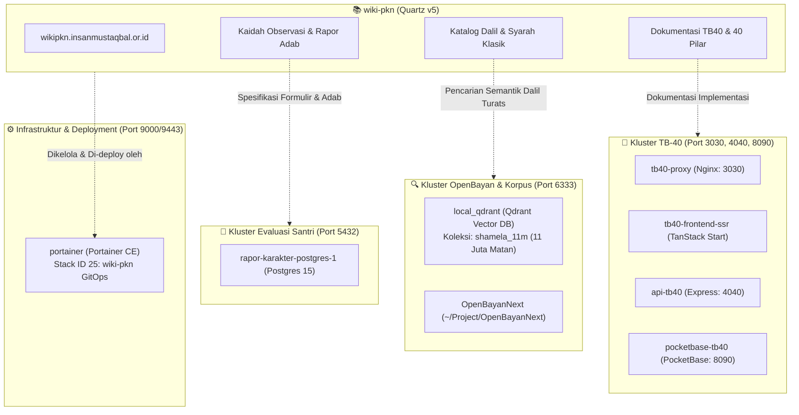

# Pemetaan Repositori & Kontainer Docker Ekosistem PKN

Dokumen ini memetakan seluruh repositori lokal dan kontainer Docker yang aktif di lingkungan mesin ini (`/home/abuhafi/Project/`) beserta keterkaitannya dengan **Wiki Pendidikan Karakter Nabawiyah (Wiki-PKN)**.

---

## 1. Ikhtisar Kontainer Docker Aktif

Audit per **15 September 2026** menunjukkan kontainer-kontainer berikut aktif berjalan dan membentuk pilar ekosistem digital PKN:

| Nama Kontainer | Image | Host Port | Direktori Kerja / Mount | Kluster Ekosistem | Status |
| :--- | :--- | :--- | :--- | :--- | :--- |
| **`tb40-proxy`** | `nginx:alpine` | `3030:3030` | `/home/abuhafi/Project/tb40-fe` | Kluster 2: TB-40 Asesmen | 🟢 Up |
| **`tb40-frontend-ssr`** | `tb40-fe-frontend-ssr` | - (internal `3030`) | `/home/abuhafi/Project/tb40-fe` | Kluster 2: TB-40 Asesmen | 🟢 Up |
| **`api-tb40`** | `tb40-fe-api` | `4040:4040` | `/home/abuhafi/Project/api-tb40-explore` | Kluster 2: TB-40 Asesmen | 🟢 Up |
| **`pocketbase-tb40`** | `pocketbase-local:latest` | `8090:8090` | `/home/abuhafi/Project/tb40-fe` | Kluster 2: TB-40 Asesmen | 🟢 Up |
| **`local_qdrant`** | `qdrant/qdrant:v1.12.0` | `6333:6333`<br>`6334:6334` | `/home/abuhafi/Project/OpenBayanNext/data/qdrant_storage` | Kluster 1: OpenBayan & Korpus Hadits | 🟢 Up |
| **`rapor-karakter-postgres-1`** | `postgres:15-alpine` | `5432:5432` | `/home/abuhafi/Project/rapor-karakter` | Kluster 3: Rapor Karakter Santri | 🟢 Up |
| **`portainer`** | `portainer/portainer-ce:latest` | `9000:9000`<br>`9443:9443` | `/var/run/docker.sock` | Kluster 5: GitOps & Deployment Host | 🟢 Up |
| **`langflow`** | `langflowai/langflow:latest` | Host Network | `/home/abuhafi/Project/langflow_test` | R&D: Pipeline RAG & AI Workflow | 🟢 Up |
| **`langflow_postgres`** | `postgres:16-trixie` | `127.0.0.1:5433:5432` | `/home/abuhafi/Project/langflow_test` | R&D: Database Langflow | 🟢 Up |
| **`open-notebook-open_notebook-1`** | `lfnovo/open_notebook:v1-latest` | `5055:5055`<br>`8502:8502` | `/app/data` (Notebook data) | R&D: Asisten AI Knowledge Base | 🟢 Up |
| **`open-notebook-surrealdb-1`** | `surrealdb/surrealdb:v2` | `8000:8000` | Database Engine Open Notebook | R&D: Database SurrealDB | 🟢 Up |
| **`unstructured-api`** | `unstructured-api:latest` | `8005:8000` | `docker-compose.unstructured.yml` | R&D: Parsing Dokumen Multimodal | 🔵 Siap Dijalankan |
| **`WinBoat`** | `ghcr.io/dockur/windows:5.14` | - | `/home/abuhafi/.winboat` | Utilitas Sistem (Non-PKN) | ⚪ Exited |

---

## 2. Pemetaan Hubungan Kontainer dengan Konten Wiki-PKN



### A. Kluster Asesmen Bakat (TB-40 Ecosystem)
* **Repositori Terkait:**
  * `~/Project/tb40-fe` ([Yayasan-Bina-Insan-Mustaqbal/tb40-fe](https://github.com/Yayasan-Bina-Insan-Mustaqbal/tb40-fe))
  * `~/Project/api-tb40-explore` ([Yayasan-Bina-Insan-Mustaqbal/api-tb40-explore](https://github.com/Yayasan-Bina-Insan-Mustaqbal/api-tb40-explore))
* **Peran dalam Wiki-PKN:**
  * Wiki-PKN memuat 40 artikel pilar bakat (`content/Paradigma - Implementasi PKN/.../TB40/01-himmah.md` s.d. `40-khalq.md`) dan indeks klasifikasi 6 rumpun bakat.
  * Kontainer `tb40-*` menjalankan sistem aplikasi web mandiri untuk pelaksanaan tes online kuesioner bakat bagi santri dan umum.

### B. Kluster Korpus Hadits & Maktabah Syamilah (OpenBayan)
* **Repositori Terkait:**
  * `~/Project/OpenBayanNext` ([decaller/OpenBayanNext](https://github.com/decaller/OpenBayanNext))
* **Detail Kontainer:**
  * `local_qdrant` memuat koleksi **`shamela_11m`** (11+ juta vektor naskah Arab Maktabah Syamilah).
  * Storage persisten berada di: `/home/abuhafi/Project/OpenBayanNext/data/qdrant_storage`.
* **Peran dalam Wiki-PKN:**
  * Seluruh tombol callout dalil `🔍 Telusuri di OpenBayan` pada 124 artikel ensiklopedia merujuk ke kluster data ini untuk penelusuran sanad dan syarah klasik.

### C. Kluster Rapor Karakter Santri
* **Repositori Terkait:**
  * `~/Project/rapor-karakter` ([decaller/rapor-karakter](https://github.com/decaller/rapor-karakter))
* **Detail Kontainer:**
  * `rapor-karakter-postgres-1` (Postgres 15 pada port host `5432`).
* **Peran dalam Wiki-PKN:**
  * Mengimplementasikan modul evaluasi naratif berbasis adab tanpa ranking angka (sesuai dokumen `content/Paradigma - Implementasi PKN/Dokumen Pendidikan Karakter Nabawiyah/Paradigma & Implementasi/Implementasi/Kaidah & Elemen/Panduan RPP dan Observasi Lapangan.md`).

### D. Kluster Infrastruktur Portainer (GitOps)
* **Detail Kontainer:**
  * `portainer` (Portainer CE pada port host `9000` dan `9443`).
* **Peran dalam Wiki-PKN:**
  * Menjalankan **Stack ID 25** (`wiki-pkn`) di lingkungan produksi `endpointId: 3`.
  * Menangani webhook auto-update dan Git redeploy otomatis setiap kali terjadi perubahan kode di branch `main`.

### E. Kluster Ekstraksi Dokumen Multimodal (Unstructured API)
* **Berkas Konfigurasi:** [`docker-compose.unstructured.yml`](docker-compose.unstructured.yml)
* **Detail Kontainer:**
  * `unstructured-api` (Port host `8005:8000`, label DIUN otomatis).
* **Peran dalam Wiki-PKN:**
  * Mengekstrak dan mempartisi 41 presentasi PPTX (`presentations/`) dan koleksi PDF kurikulum (`searchable_pdfs/`) menjadi elemen terstruktur (`Title`, `Table`, `NarrativeText`).
  * Mengonversi tabel kurikulum menjadi tabel Markdown rapi.
  * Menghasilkan chunk semantik (`by_title`) untuk pipeline RAG LangChain / LangGraph.
  * Diintegrasikan via client adapter [`scripts/unstructured_adapter.py`](scripts/unstructured_adapter.py).

---

## 3. Peringatan Penting: Konflik Port Host `4040`

> [!WARNING]
> ### Potensi Konflik Port `4040` Antara `api-tb40` dan `wiki-pkn`
> 
> * Kontainer **`api-tb40`** saat ini terikat pada port host:
>   ```text
>   0.0.0.0:4040 -> 4040/tcp
>   ```
> * Berkas [`docker-compose.yml`](file:///home/abuhafi/Project/wiki-pkn/docker-compose.yml) milik `wiki-pkn` menggunakan konfigurasi default:
>   ```yaml
>   ports:
>     - "${HOST_PORT:-4040}:${PORT:-8080}"
>   ```
> * **Solusi saat menjalankan `wiki-pkn` via Docker di PC lokal:**
>   Jangan menjalankan `docker compose up` tanpa mendefinisikan `HOST_PORT`. Gunakan port alternatif di berkas `.env` lokal:
>   ```bash
>   # Di folder wiki-pkn:
>   echo "HOST_PORT=4045" >> .env
>   docker compose up -d
>   ```
>   *(Pada server produksi Portainer / Zoraxy, port `4040` telah dialokasikan khusus untuk wiki-pkn karena `api-tb40` berada di reverse proxy / host yang berbeda).*

---

## 4. Perintah Cepat Diagnostik Lingkungan Docker

```bash
# 1. Cek ringkasan kontainer ekosistem PKN yang sedang berjalan
docker ps --format "table {{.Names}}\t{{.Status}}\t{{.Ports}}"

# 2. Cek status konektivitas Qdrant OpenBayan
curl -s http://localhost:6333/collections

# 3. Cek status API TB-40 Explore
curl -s http://localhost:4040/health || curl -s http://localhost:4040/

# 4. Cek status Portainer
curl -k -s https://localhost:9443/api/status

# 5. Menjalankan Wiki PKN lokal dengan port aman (tidak bentrok)
HOST_PORT=4045 PORT=8080 docker compose up -d

# 6. Menjalankan Unstructured API lokal (port 8005)
docker compose -f docker-compose.unstructured.yml up -d

# 7. Memeriksa status & healthcheck Unstructured API
python3 scripts/unstructured_adapter.py --check-health
```

