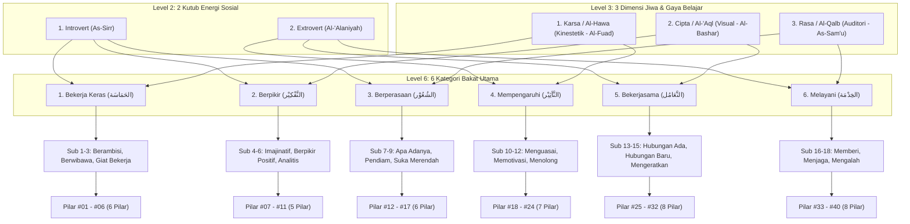
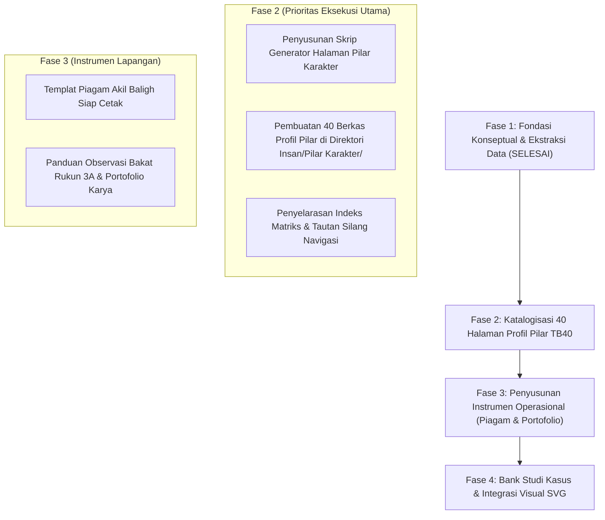

# Analisis Konten & Master Taksonomi TB40 Wiki PKN

Dokumen ini menyajikan hasil analisis mendalam terhadap basis pengetahuan **Pendidikan Karakter Nabawiyah (PKN)**, mencakup rekapitulasi pengayaan materi dari naskah arsip (`old_backup/random/`), integrasi data otoritatif **Tafsir Bakat 40 (TB40)** dari API Observasi Karakter, pemetaan celah konten (*content gaps*), serta peta jalan (*roadmap*) pengembangan selanjutnya.

---

## 1. Ringkasan Eksekutif Pembaruan Konten

Sebelum proses pembaruan dan migrasi dilakukan, dari total 59 berkas Markdown di dalam direktori `content/`, terdapat **43 berkas yang berstatus dokumen kerangka/templat kosong** (hanya memuat teks placeholder seperti `Penjelasan singkat mengenai tema...`, `< matan dalil >`, `< Grafik Utama Tema >`, dan `teks narasi`).

Melalui pemindaian, ekstraksi, dan sintesis terhadap 15 naskah komprehensif di direktori `old_backup/random/`:
1. **39 dokumen inti** telah diperkaya dengan materi otentik berbahasa Indonesia yang terstruktur rapi.
2. **100% resolusi navigasi tercapai**: Seluruh 47 simpul daun pada `nav_structure.json` kini memiliki berkas Markdown fisik yang valid dengan frontmatter `title` yang selaras (0 *unlinked leaf labels*).
3. **Data Otoritatif TB40 Berhasil Diekstraksi**: Data taksonomi lengkap 40 pilar karakter dari `/home/deck/Projects/observasi-karakter-api/api-tb40-explore/api/` telah dipetakan secara utuh, menutup kesenjangan konseptual antara teori fitrah bakat dan operasionalisasi 40 pilar karakter.

---

## 2. Pemetaan Materi yang Telah Diperbarui

Tabel berikut merangkum integrasi antara naskah sumber arsip dan halaman dokumentasi aktif di dalam direktori `content/`:

| Kluster Pembahasan | Halaman yang Diperbarui | Sumber Materi (`old_backup/random/`) | Inti Materi yang Diintegrasikan |
|---|---|---|---|
| **Trilogi Jiwa (Insan)** | `Pembagian Jiwa.md`, `Ammarah.md`, `Lawwamah.md`, `Muthmainnah.md`, `Bersatunya Ruh dan Jasad...` | `Trilogi Jiwa dalam Pendidikan Karakter Nabawiyah.md`, `Struktur Komprehensif... Arsitektural` | Struktur tripartit jasad-ruh-nafs, kecondongan 3 nafs, hak & kewajiban tiap jiwa, kondisi ekstrim (*ifroth* & *tafrith*). |
| **Fitrah & Karakter** | `Fitrah (Karakter).md`, `Iman.md`, `Tangki Cinta.md`, `Belajar.md`, `Bakat.md`, serta 6 sub-bakat | `Menuju Paradigma Pendidikan Berbasis Fitrah...`, `Panduan Strategis Menumbuhkan Kesadaran Beramal...` | Dekonstruksi teori *Tabula Rasa*, 4 dimensi karakter, rukun 3A bakat (Suka, Bisa, Berguna), 5 bahasa cinta & prinsip *koneksi sebelum koreksi*. |
| **Fase Perkembangan** | `Perkembangan.md`, `Thufulah.md`, `Tamyiz.md`, `Murahaqah.md`, `Syabab.md` | `Hak dan Kewajiban Anak dalam Pendidikan Karakter Nabawiyah.md` | Hadits pengangkatan pena (*Rufi'al Qalam*), hak bermain bebas usia 0-7, pembiasaan shalat 7-10, kedisiplinan 10-baligh, dan kemandirian mukallaf pasca-baligh. |
| **Pendidikan Ideal** | `Pendidikan Ideal.md`, `Benang Merah Pendidikan.md`, `Metode Mendidik.md`, `Bahasa Hati/Lisan/Tangan` | `Kritik Pendidikan Modern...`, `Pedoman Strategis Bahasa Tangan...`, `Seni Mengambil Hati...` | Kritik pemesinan anak oleh sekolah modern, penjenjangan 3 bahasa pendidik, syarat operasional pukulan edukatif (*ghairu mubarrih*). |
| **Luka & Pemulihan** | `Luka dan Hutang Pengasuhan.md`, `Euforia.md`, `Recovery.md`, `Batas Toleransi.md` | `Menata Fitrah...`, `Strategi Memenangkan Hati Ananda...` | Asal mula *parenting debt*, dinamika ledakan euforia masa remaja, metode pemulihan EMISOL (Empati, Imajinasi, Solusi). |
| **Implementasi & Peran** | `Implementasi.md`, `4 Kaidah...`, `4 Elemen...`, `Tazkiyatun Nafs.md`, `Tawakkal dan Doa.md`, `Peran Ayah/Bunda/Guru` | `Panduan Strategis Implementasi...`, `Struktur Komprehensif... Transformasi Fitrah` | 4 kaidah penumbuhan fitrah, pembersihan hati pendidik, sinergi peran maskulin ayah & feminin bunda, serta reposisi guru sebagai fasilitator fitrah. |

---

## 3. Spesifikasi Lengkap Master Taksonomi TB40 (Tafsir Bakat 40)

Data taksonomi ini diekstraksi secara langsung dari spesifikasi OpenAPI dan engine kalkulasi repositori API Observasi Karakter di `/home/deck/Projects/observasi-karakter-api/api-tb40-explore/api/` (`v0.1/tb40/calculation.json`, `v0.1/tb40/result.json`, dan `v0.3/tb40/result.json`).

### 3.1 Landasan Filosofis & Penyelarasan Nabawiyah
TB40 (Tafsir Bakat 40) adalah metode pemetaan potensi fitrah dan bakat manusia yang diselaraskan dengan **40 sifat karakter mulia (*fadhilah*)** yang bersumber dari keteladanan Rasulullah ﷺ dan para Sahabat. 

Berbeda dengan asesmen kepribadian konvensional Barat (seperti MBTI atau DISC) yang bersifat deskriptif-netral atau sekuler, TB40 mengintegrasikan:
1. **Konsep Trilogi Jiwa Qur'ani**: Membedah fitrah manusia melalui *Al-Hawa* (Ammarah), *Al-'Aql* (Lawwamah), dan *Al-Qalb* (Muthmainnah).
2. **Karakter Bersifat Normatif-Ideal**: Menjadikan akhlak mulia sebagai standar potensi puncak (*ihsan*).
3. **Pendeteksian Dua Sisi Jurang Ekstrim**: Setiap pilar bakat memiliki batas keseimbangan. Jika diabaikan (*tafrith*) menjadi sifat tercela tertentu, dan jika dilampiaskan berlebihan (*ifrath*) juga menjadi sifat tercela lain. Solusi penyembuhannya (*'ilaj*) diambil secara sistemik dari pilar karakter nabawiyah lainnya.

---

### 3.2 Hierarki 5 Tingkat Arsitektur TB40

TB40 dibangun di atas struktur hierarki matematis dan psikologis 5 tingkat (Level 2 → Level 3 → Level 6 → Level 18 → Level 40):

---

### 3.3 Tingkat 2 & 3: Dimensi Jiwa, Gaya Belajar, dan Bahasa Hati

Persilangan antara dorongan energi interaksi dan dimensi jiwa manusia menghasilkan orientasi modalitas belajar dan penerimaan kasih sayang yang spesifik:

| Dimensi Jiwa (Level 3) | Aspek Qur'ani | Kutub Jiwa | Gaya Belajar Otentik (*Modalitas*) | Karakteristik Belajar & Lingkungan Ideal | Bahasa Hati Terpilih (*Love Language*) |
|---|---|---|---|---|---|
| **Karsa** | *Al-Hawa* (الهَوَى) | Jiwa *Ammarah* | **Al-Fuad / Kinestetik** (الفُؤَاد - bergerak & menyentuh) | Belajar lewat aktivitas fisik, membongkar sesuatu, peragaan langsung. Nyaman di ruang terbuka, lapangan, bengkel, laboratorium terbuka. | **Bahasa Pelayanan (*Acts of Service*)**: Melayani kemauannya, membantu tugasnya, menjaga rahasia, memaafkan kesalahannya. |
| **Cipta** | *Al-'Aql* (العَقْل) | Jiwa *Lawwamah* | **Al-Bashar / Visual** (البَصَر - melihat & mengamati) | Membaca cepat, menangkap bagan/diagram, menonton demonstrasi. Memerlukan ruangan dengan pencahayaan optimal, tertata rapi, dan kaya visual. | **Bahasa Kebersamaan (*Quality Time*)**: Menemani aktivitasnya, mendengarkan gagasannya, tersenyum tulus, memenuhi janji, menyayangi. |
| **Rasa** | *Al-Qalb* (القَلْب) | Jiwa *Muthmainnah* | **As-Sam'u / Auditori** (السَمْع - mendengar & menirukan) | Menghafal dengan mengeraskan suara, mendengar narasi/murottal, berdiskusi. Memerlukan ruangan hening, tenang, bebas kebisingan liar. | **Bahasa Perlindungan / Hadiah (*Gifts / Protection*)**: Pemberian hadiah bermakna, kata-kata motivasi tulus, melindungi saat kesulitan, membela harga diri. |

---

### 3.4 Tingkat 6 & 18: Matriks 6 Kategori Bakat & 18 Sub-Kelompok

Persilangan Level 2 (Introvert vs Extrovert) $	imes$ Level 3 (Karsa, Cipta, Rasa) melahirkan **6 Kategori Bakat Utama**, yang masing-masing diurai menjadi **3 Sub-Kelompok Bakat (Total 18 Sub-Kelompok)**:

| No | Kategori Bakat (L6) | Aksara Arab | Kombinasi Asal | 18 Sub-Kelompok Bakat (L18) | Karakteristik Dominan |
|---|---|---|---|---|---|
| 1 | **Bekerja Keras** | الحَمَاسَة (*Al-Hamasah*) | Introvert + Karsa | 1. Berambisi 2. Berwibawa 3. Giat bekerja | Berkeinginan tinggi, pantang menyerah, ingin segera menyelesaikan pekerjaan, tidak suka menunda waktu. |
| 2 | **Berpikir** | التَّفْكِيْر (*At-Tafkir*) | Introvert + Cipta | 4. Suka berpikir imajinatif 5. Suka berpikir positif 6. Suka berpikir analitis | Cerdas, tajam menganalisis masalah, senang menghitung, menghafal, dan menemukan pola solusi. |
| 3 | **Berperasaan** | الشُعُوْر (*Asy-Syu'ur*) | Introvert + Rasa | 7. Suka apa adanya 8. Pendiam 9. Suka merendah | Suka merenung sendiri, peka perasaan nurani, pemalu, berhati-hati dalam menjaga kesucian diri. |
| 4 | **Mempengaruhi** | التَّأْثِيْر (*At-Ta'tsir*) | Extrovert + Karsa | 10. Suka menguasai 11. Suka memotivasi 12. Suka menolong | Berani tampil di depan publik, tegas memimpin, mengarahkan orang lain, bersemangat memotivasi dan membela. |
| 5 | **Bekerjasama** | التَّعَامُل (*At-Ta'amul*) | Extrovert + Cipta | 13. Suka menggunakan relasi ada 14. Suka membuka relasi baru 15. Suka mengeratkan relasi | Suka kerukunan, anti-konflik, senang menjalin persahabatan, adil, hangat, dan pandai mencairkan suasana. |
| 6 | **Melayani** | الخِدْمَة (*Al-Khidmah*) | Extrovert + Rasa | 16. Melayani dengan memberi 17. Melayani dengan menjaga 18. Melayani dengan mengalah | Mengutamakan orang lain (*itsaar*), penyayang, setia memegang amanah, menjaga rahasia, pemaaf, dan sabar. |

---

### 3.5 Tingkat 40: Katalog Komprehensif 40 Pilar Karakter Nabawiyah

Berikut adalah basis data lengkap 40 pilar karakter nabawiyah hasil ekstraksi dari sistem engine TB40:

| No | Pilar Karakter | Arab | Kategori (L6) | Sub-Kelompok (L18) | Label Diri | Definisi Operasional | Rekomendasi Profesi | Rekomendasi Rumpun Jurusan |
|---|---|---|---|---|---|---|---|---|
| #01 | **Himmah** | الهِمَّة | Bekerja keras | Berambisi | memiliki cita-cita yang tinggi | memiliki rasa ingin tahu dan gairah yang sangat tinggi untuk mengetahui dan meraih cita-cita yang tertinggi | Team Perumus Visi Misi, Team Litbang Pendidikan atau lembaga lainnya, Pemimpin, Entrepreneur, Perencana Jangka Panjang, Visioner, Pengembang produk baru, Pengembang Perusahaan | Ekonomi Syariah, Manajemen, Marketing, Manajemen Lingkungan |
| #02 | **Ihsaan** | الاِحْسَان | Bekerja keras | Berambisi | perfeksionis | mampu berbuat yang terbaik dalam amalan ibadah maupun dalam memberikan manfaat terhadap diri, orang lain, atau lainnya | Team Penjamin Mutu Pendidikan, Quality Controller (QC), Peran untuk membantu orang hebat menjadi sukses seperti Pelatih, Manajer, Mentor, Guru, Transformational leader | Tadriibud Du’aat, Hadits, Fiqih, Syariah, Manajemen, Manajemen Bisnis, Ilmu Sains dan Teknologi |
| #03 | **‘izzah** | العِزَّة | Bekerja keras | Berwibawa | mampu mempertahankan harga diri | mampu bersikap kuat, tegas, dan tangguh dalam mempertahankan kemuliaan atau harga dirinya, sehingga tidak direndahkan dan dapat mengalahkan pihak lain | Utusan, Duta Besar, Da’i, Da’iyah, Guru, Pengajar, Pembawa Misi, Leader | Ilmu Aqidah, Syariah, Fiqih, Tadriibud Du’aat, Keguruan, Hubungan Internasional, Manajemen |
| #04 | **Waqaar** | الوَقَار | Bekerja keras | Berwibawa | berwibawa | memiliki sikap tenang tapi kelihatan tangguh, tidak banyak bicara, tidak tergesa tapi mendahului dalam melakukan semua urusan | Trainer, Pendamping pelatihan, Peningkatan SDM, Konsultan, Team penanganan masalah lembaga/perusahaan | Teknik Sipil, Teknik Listrik, Teknik Mesin, Manajemen |
| #05 | **‘aziimah** | العَزِيمَة | Bekerja keras | Giat bekerja | memiliki tekad untuk segera memulai sesuatu pekerjaan | memiliki tekad kuat untuk segera memulai suatu tindakan atau amalan | Perintis atau pelopor, Team penggerak, Entrepreneur, Sales, Pengelola usaha-usaha baru,  atau usaha yang memerlukan perubahan besar | Manajemen dan Bisnis, Teknologi Terapan, Marketing, Kewirausahaan, Pekerjaan Umum |
| #06 | **Nasyaath** | النَّشَاط | Bekerja keras | Giat bekerja | bersemangat menyelesaikan pekerjaan | memiliki semangat dan bekerja keras untuk menyelesaikan apa yang sedang dilakukan | Penyelenggara Lembaga pendidikan, Pemborong Proyek, Tenaga Penjual/Sales, Teknisi Proyek, Teknisi Lapangan, Pekerja Lapangan, Relawan, Petugas SAR, Pemadam Kebakaran | Teknik Sipil, Teknik Permesinan, Teknik Instalasi dan Tenaga Listrik, Teknik perkayuan, Teknik Otomotif, Keperawatan, Kebidanan, Marketing, dan jurusan lain yang banyak menumbuhkan sifat kerja keras |
| #07 | **Firaasah** | الفِرَاسَة | Berpikir | Suka berpikir imajinatif | memiliki firasat terhadap sesuatu yang akan terjadi | memiliki ketajaman ilmu yang mampu menyimpulkan perkara batiniyah dengan memperhatikan tanda-tanda lahiriyah yang dapat dilihat, didengar, atau dirasakan | Penasehat, Konsultan, Perumus Visi Misi, Entrepreneur, Event Organizer (EO), Tour Leader, Manajer | Ilmu Aqidah, Ilmu Ushuluddin, Ilmu Jiwa, Manajemen |
| #08 | **Nubl** | النُّبْل | Berpikir | Suka berpikir imajinatif | banyak akal untuk menemukan solusi masalah | cepat mengerti (tentang situasi dan sebagainya) dan pandai mencari pemecahannya,  panjang atau banyak akalnya | Konsultan, Konselor, Team Penanganan Masalah, Perencana Strategi, Manajer, Leader, Team Pencari Solusi Bagi Perusahaan/Lembaga Yang Bermasalah | Ilmu Fiqih, Ekonomi Syariah, Manajemen, Sosiologi, Hubungan Internasional, atau jurusan lain yang banyak menumbuhkan kemampuan untuk menemukan solusi |
| #09 | **Husnuzhan** | حُسْنُ الظَّن | Berpikir | Suka berpikir positif | berpikir positif tentang segala sesuatu | memiliki kecenderungan menduga yang baik dari pada yang buruk walaupun fakta yang dilihatnya mendukung kepada dugaan yang buruk | Hakim, Pendidik, Guru, Pengajar, Juru Damai, Mediator, Relator, Pelayanan Publik | Hukum Islam, Keguruan, Manajemen, Ilmu Komunikasi, Manajemen Bisnis |
| #10 | **Dzakaa’** | الذَّكَاء | Berpikir | Suka berpikir analitis | cerdas dalam menganalisa sesuatu | memiliki kecepatan dan ketajaman berpikir dalam memahami, menghafal, menganalisa, dan menyimpulkan sesuatu yang dihadapkan kepadanya | Ahli ilmu (Agama atau umum: Fisika, kimia, dll), Analis, Periset (teknologi, pemasaran, keuangan, atau kesehatan), Manajemen Database, Editor, Manajemen Risiko, Accounting, Programmer | Jurusan Ilmu Hadits, Ilmu Al Qur’an, Fiqih, atau ilmu Agama lainnya, Teknik kimia, Fisika, Matematika, Teknik Komputer,  IT Programmer, Akuntansi |
| #11 | **Hikmah** | الحِكْمَة | Berpikir | Suka berpikir analitis | berpikir sangat mendalam untuk mengambil hikmah darinya | memiliki keilmuan yang mendalam tentang suatu pengetahuan hingga dapat menempatkan sesuatu pada kondisi yang sebenarnya | Kosultan, Konselor, Mufti, Da’i/yah, Psikolog, Petugas Pembinaan Keluarga, Leader dalam membangun team yang berbeda kelompok, atau membantu orang agar merasa berguna | Ilmu Aqidah, Ilmu Jiwa, Ilmu Adab, Sastra, Syariah, Psikologi, Manajemen |
| #12 | **Shidq** | الصِّدْق | Berperasaan | Suka apa adanya | mampu berkata dan berbuat apa adanya | memiliki sikap mudah menerima kebenaran serta berkata dan berbuat  sesuai dengan apa yang sebenarnya | Pengelola Dana Umat (Donasi), Kurir/Duta, Bidang Keuangan, Pengelola Baitul Mal, Team Belanja (Pengadaan Sarana Prasarana), Hakim, Jaksa | Administrasi Keuangan, Hukum Islam, Ilmu Hukum, Manajemen |
| #13 | **‘iffah** | العِفَّة | Berperasaan | Pendiam | mampu menahan diri untuk tidak menuruti hasrat | mampu menahan diri terhadap dorongan hawa nafsu dalam dirinya sehingga tidak melakukan hal yang dilarang, baik dalam harta, ucapan, atau perbuatan | Pengelola Keuangan Umat, Bendahara, Team Sarana Prasarana, Team Belanja, Pemimpin, Akuntan | Syariah, Hukum Islam, Manajemen Keuangan, Akuntansi, Administrasi |
| #14 | **Shamt** | الصَّمْت | Berperasaan | Pendiam | mampu menjaga perkataan | memiliki sikap banyak diam dan jika berbicara seperlunya atau yang bermanfaat saja | Pelayan Umat, Ajudan, Pelaksana Lapangan, Penulis, Peneliti, Analis | Teknik Kimia, Teknik Informatika (IT), Administrasi Perkantoran |
| #15 | **Hayaa’** | الحَيَاء | Berperasaan | Suka merendah | memiliki perasaan malu | merasa betapa besar pemberian/hak yang diterimanya, namun merasa dirinya masih memiliki banyak keterbatasan dan kekurangan, sehingga merasa tidak pantas untuk mendapatkannya | Ahli Hikmah, Sastrawan, Penulis, Designer Fashion, Designer Interior, Arsitek, Kaligrafer, dsb. | Ilmu Jiwa, Sastra, Arsitektur, Tata Busana, Seni, Desain Komunikasi Visual, Animasi, Fotografi, dsb. |
| #16 | **Qanaa'ah** | القَنَاعَة | Berperasaan | Suka merendah | merasa cukup dengan apa yang telah aku terima | rela menerima apapun yang diberikan kepadanya dan merasa cukup terhadap apa yang telah diterimanya | Team Perencana Anggaran Belanja Lembaga, Team Penghemat Anggaran Perusahaan, Petugas Lapangan, Explorer, Relawan | Ilmu Ekonomi, Manajemen Bisnis, Ilmu Sosial, Ilmu Manajemen Sumber Daya Alam, Akuntansi, atau jurusan lain yang terkait dengan perhitungan nilai ekonomis |
| #17 | **Tawaadhu'** | التَّوَاضُع | Berperasaan | Suka merendah | rendah hati terhadap kehebatan yang dimiliki | memiliki rasa tidak suka menampakkan atau ditampakkan kelebihannya meskipun memiliki kemampuan dan kelebihan | Guru TK, Konselor, Pemimpin, Relawan, Pengasuh Panti Asuhan, Penasehat, public serving | Dakwah, Psikologi, Sastra, Sosiologi, Ilmu Komunikasi, Keguruan, Ilmu Kejiwaan |
| #18 | **Syajaa’ah** | الشَّجَاعَة | Mempengaruhi | Suka menguasai | berani menghadapi orang secara langsung | teguh dan berani dalam menghadapi orang untuk mengendalikannya, mengaturnya, dan menguasainya | Tentara, TNI, Komandan, Pengusaha, Petugas Keamanan, Sales, Negosiator, Wartawan, Pengacara, HRD, Pembelian | Ilmu Hukum Islam, Syariah, Akademi Militer, Akademi Kepolisian, Manajemen, Manajemen Bisnis |
| #19 | **Ghairah** | الغَيْرَة | Mempengaruhi | Suka menguasai | memiliki rasa cemburu | memiliki rasa tidak senang jika syariat, aturan, hak, atau ketentuan lain yang telah ditetapkan dilanggar oleh orang lain | Penegak Peraturan, Penegak Disiplin, Pengawas, Mandor, Evaluator, Auditor, Supervisor, Manajer. | Administrasi, manajemen, manajemen bisnis, Sekolah Tinggi Pemerintahan Dalam Negeri, Akademi Militer, Akademi Kepolisian |
| #20 | **Munaafasah** | المُنَافَسَة | Mempengaruhi | Suka menguasai | suka bersaing dengan orang lain | senang bersaing dengan usaha semaksimal mungkin agar dirinya menjadi yang paling unggul dari yang lainnya | Bidang Periklanan, Motivator, Competition Organizer, Team Litbang Perusahaan, Konsultan atau pengelola perusahaan dalam menghadapi persaingan, Sales, Pelatih Olahraga | Manajemen, Manajemen Bisnis, Olahraga dan Kesehatan, Sekolah Pelatih |
| #21 | **Nashiihah** | النَّصِيْحَة | Mempengaruhi | Suka memotivasi | suka menasehati orang lain | senang memberikan nasehat, saran, dorongan kepada orang lain agar menjadi lebih baik | Penasehat, Da’i, Da’iyah, Guru, Konselor, Konsultan, Pemimpin, Manajer, Leader, Supervisor, Evaluator, Pengawas, Pelatih, Pelayanan Pelanggan (Customer Service) | Ilmu Agama, Ilmu Komunikasi, Ilmu Manajemen, Ilmu Hukum, Psikologi, Bimbingan Konseling |
| #22 | **Fashaahah** | الفَصَاحَة | Mempengaruhi | Suka memotivasi | fasih berbicara dalam menjelaskan sesuatu | memiliki kemampuan untuk menyampaikan sesuatu dengan ungkapan sederhana, meskipun sebenarnya rumit, sehingga mudah untuk dipahami | Guru Tajwid Qira’ah, Qari’, Da’i, Guru (pengajar), Dosen, Motivator, Penyuluh Masyarakat, Public Relation, Duta, Sales, Marketing, Humas, Juru Bicara, Presenter, MC, Pengacara, Layanan Pelanggan, Penulis | Pendidikan Agama, Konseling Keluarga, Keguruan, Ilmu Komunikasi, Hubungan Internasional, Marketing, Manajemen, Manajemen Bisnis |
| #23 | **Nushrah** | النُّصْرَة | Mempengaruhi | Suka menolong | suka menolong orang dari kesulitan | senang membantu orang lain yang mengalami kesusahan (atau terzhalimi) hingga terlepas dari kesusahan tersebut | Polisi, Penegak Hukum, Relawan, Pengacara, Lembaga Bantuan Hukum (LBH), Hakim, atau profesi lain yang terkait dengan bantuan terhadap orang yang terzhalimi | PAI, Syari’ah, Ilmu Hukum, Ilmu Sosial, Akademi Kepolisian, Akademi Militer |
| #24 | **Juud** | الجُوْد | Mempengaruhi | Suka menolong | dermawan terhadap orang lain | senang memberikan sesuatu tanpa diminta dan tidak mengharap ucapan terima kasih atau bentuk balasan lainnya | Relawan, Petugas Sosial, Konselor, Perawat, Pengelola LAZIZ, Pengelola Baitul Maal, Panitia Bulan Amal, Entrepreneur, Leader, manajer | Pendidikan Agama Islam, Ilmu Fiqih, Manajemen, Keperawatan, Sosiologi, Bimbingan Konseling, Manajemen Bisnis |
| #25 | **Ta'aawun** | التَّعَاوُن | Bekerjasama | Suka menggunakan hubungan yang ada | mampu bekerjasama dengan orang lain | senang bekerjasama dengan orang lain untuk mencapai tujuan bersama | Penggerak dakwah, Guru, Pembangun jaringan antara orang-orang dengan cara pandang yang berbeda, Juru Damai, Penasehat, Wirausahawan, Manajer | Dakwah, Manajemen, Ilmu Komunikasi, Ilmu Ekonomi, Keguruan |
| #26 | **Ulfah** | الاُلْفَة | Bekerjasama | Suka menggunakan hubungan yang ada | suka berkumpul dan mengumpulkan orang | senang bersatu dan berkumpul  karena adanya kesamaan | Da’i, Marketing, Pengelola lembaga sosial, Motivator kelompok, Wakil suara minoritas, Pemimpin kelompok dengan latar budaya beragam, Mentor bagi mereka yang baru bergabung di dalam organisasi | Dakwah, Manajemen Pendidikan, Manajemen Bisnis, Sosiologi |
| #27 | **‘adaalah** | العَدَالَة | Bekerjasama | Suka menggunakan hubungan yang ada | bersikap adil | bersikap tengah-tengah, tepat dalam menempatkan sesuatu pada tempatnya tanpa berlebihan dan tidak kurang | Hakim, Petugas pembinaan keluarga, Konselor masalah keluarga, Mediator, Petugas kontrol terhadap kesesuaian atas standar seperti kepatuhan kepada aturan, Quantity Surveyor, Petugas Commisioning atau peran yang bisa memiliki kekuatan untuk menyamakan aturan main dan peran lainnya  yang terkait dengan sifat adil | Hukum Islam, Syariah, Konseling keluarga, Hukum Publik, Hukum Perdata, Hukum Internasioanal, Ilmu Hukum, Hukum Pidana, atau jurusan lainnya yang terkait dengan keadilan |
| #28 | **Wafaa'** | الوَفَاء | Bekerjasama | Suka menggunakan hubungan yang ada | teguh dalam memenuhi janji | teguh memegang janji yang telah disepakati, walaupun kondisinya sebagai pihak yang dicurangi | Pengajar Aqidah, Pelayanan Masyarakat, Pelayanan Pelanggan, Birokrat, Relator, Account Sales, Manajer, Keuangan, Quality Control, Keamanan | Ilmu Aqidah, Akuntansi, Administrasi, Manajemen, Sosiologi, Ilmu Hukum |
| #29 | **Muzaah** | المُزَاح | Bekerjasama | Suka membuat hubungan baru | suka bercanda untuk mengakrabkan hubungan | senang bercanda tapi tidak menyinggung orang lain, santai dalam bergaul | MC, Pranata cara (Jawa), Penerima Tamu, Motivator, Comentator | Ilmu Komunikasi, Marketing, Keguruan |
| #30 | **Basyaasyah** | البَشَاشَة | Bekerjasama | Suka membuat hubungan baru | berseri-seri tampak wajahnya | berseri-seri wajahnya, murah senyum, berkata lembut, dan memberikan penyambutan yang baik karena rasa gembira ketika bertemu orang lain | Guru, Konselor, Presenter, Trainer, Motivator, Pemandu Kegiatan Anak, Pelayan Publik, Tour Leader (Pemandu Wisata) | Ilmu Keguruan, Ilmu Komunikasi, PGTK (Pendidikan Guru TK), Keperawatan, Psikologi, Kepariwisataan, Pelayanan Publik |
| #31 | **Rifq** | الرِّفْق | Bekerjasama | Suka mengeratkan hubungan yang sudah ada | lemah lembut dalam bergaul | mampu mengambil sisi termudah dalam semua urusan, sehingga lemah-lembut dalam perkataan dan perbuatan | Guru, Pendidik, Penasehat, Konsultan, Manajer, Supervisor, Pengawas, Marketing, Customer Service, Leader | Syari’ah, Keguruan, Psikologi Islam, Manajemen, Manajemen Bisnis |
| #32 | **Mahabbah** | المَحَبَّة | Bekerjasama | Suka mengeratkan hubungan yang sudah ada | suka memperdalam hubungan yang telah terjalin | memiliki kecintaan yang mendalam dan khusus terhadap sesuatu untuk memperkuat dan meperdalam hubungan | Guru Privat, Terapist, Konselor, Psikolog, Guru PAUD, Peternak Hewan Rumahan, Perawat | Tarbiyah, Pendidikan Guru TK (PGTK), Keguruan, Pendidikan Terapist, Keperawatan, Peternakan |
| #33 | **Rahmah** | الرَّحْمَة | Melayani | Suka melayani dengan cara memberi | berbelas kasihan kepada orang lain | berbelas kasihan dan bersimpati karena ingin memberikan yang terbaik bagi yang dibelas kasihi | Konselor, Pembinaan Keluarga Sejahtera, Guru PAUD-TK, Psikolog, Sales, HRD, Perawat, Operator Telepon, Psikiater, Dispatcher, Layanan Pelanggan | PAI, Keguruan, Tarbiyah, Ilmu Sosial, Manajemen, Manajemen Bisnis, Psikologi, atau jurusan lain yang terkait dengan penguatan empati atau perasaan |
| #34 | **Itsaar** | الاِيْثَار | Melayani | Suka melayani dengan cara memberi | suka mendahulukan orang lain | memiliki kecenderungan untuk lebih mendahulukan orang lain dari pada dirinya sendiri dan rela berkorban dalam memberikan manfaat atau dalam menghindari sesuatu, walaupun dirinya lebih membutuhkannya | Da’i/da’iyah, Pengelola lembaga sosial seperti panti asuhan, Laziz, Baitul Maal; Konselor, Pelayanan Pelanggan, Maintenance, Perawat, Pekerja Sosial, Relawan, Team Palang Merah | Tadriibud Du’aat, Tarbiyah, Penyuluh Masyarakat, Kesehatan Masyarakat, Keperawatan, Kebidanan, Kedokteran, Kepalangmerahan |
| #35 | **Kitmaanus sirr** | كِتْمَانُ السِّرِّ | Melayani | Suka melayani dengan cara menjaga | mampu menjaga rahasia meskipun bukan aib | mampu menutupi suatu kabar (bukan aib) agar tidak tersebar untuk mencegah timbulnya keburukan jika tersebar | Hakim, Pengacara, Konselor, Intelijen, Administrator, Pengelola Dokumen Negara, Psikolog, Kepolisian, Militer, Keuangan Negara | Hukum Islam, Syariah, Sekolah Tinggi Pertahanan Nasional, Politeknik Keuangan Negara, Akademi Kepolisian, Akademi Militer, Administrasi, Akuntansi |
| #36 | **Satr** | السَّتْر | Melayani | Suka melayani dengan cara menjaga | mampu menutupi aib diri sendiri atau orang lain | mampu menutupi dan tidak menampakkan atau menceritakan aib diri sendiri atau orang lain | Ajudan, Asisten Pribadi, Sekretaris, Agen Rahasia, Notaris | Akademi Kepolisian, Akademi Militer, Ilmu Kenotariatan, Administrasi |
| #37 | **Amaanah** | الاَمَانَة | Melayani | Suka melayani dengan cara mengalah | bertanggung jawab terhadap tugas yang diberikan kepadanya | senang jika diberi tanggung jawab serta menunaikan akad atau janji yang disepakati dengan sebaik-baiknya | Pengelola Lembaga Pendidikan, Pengelola Baitul Maal, Pengasuh Anak Yatim, Pedagang, Pengelola Dana Umat, Bendahara, Account Sales, Manajer Umum, Manajer Keuangan, Quality Controller, Keamanan, dan peran lainnya  yang terkait dengan sifat amanah atau tanggung jawab | Keguruan/tarbiyah, akuntansi, bisnis dan manajemen, administrasi |
| #38 | **Anaah** | الاَنَاة | Melayani | Suka melayani dengan cara mengalah | mempertimbangkan dulu sebelum bertindak | tenang, dan mencari kejelasan terlebih dahulu sebelum melakukan tindakan | Mufti, Penasehat, Konsultan, Perumus peraturan, Perancang Sistem Keamanan, Pengawas, Pilot, Urusan Legal, Membuat Kontrak Bisnis yang baik atau memastikan kesesuaian dengan peraturan atau standar atau kode atau juga peran yang terkait dengan masalah keuangan dan atau keamanan | Teknik Penerbangan, Teknik Mesin, Teknik Konstruksi Bangunan, Keselamatan Lalu Lintas, Teknik Listrik, Akuntansi, Manajemen Keuangan, dan jurusan lain yang terkait dengan kehati-hatian, keamanan, dan ketelitian |
| #39 | **Hilm** | الحِلْم | Melayani | Suka melayani dengan cara mengalah | mampu untuk tidak membalas perbuatan orang lain | memiliki kemampuan menahan diri untuk tidak memarahi, membalas, atau memberikan hukuman walaupun mampu melakukannya | Pelayanan Masyarakat Umum, Rahabilitasi Kenakalan Remaja, Perawat Rumah Sakit, Guru (pengajar), Pelayanan Pelanggan (Customer Service), Sales, Manajer, Supervisor | Keperawatan, Ilmu Komunikasi, Keguruan, Kepariwisataan, Marketing, Manajemen |
| #40 | **Shabr** | الصَّبْر | Melayani | Suka melayani dengan cara mengalah | bersabar terhadap apa yang menimpa | mampu menahan diri untuk tidak bereaksi (menolak/membalas) terhadap apa yang diterimanya, baik berupa tekanan dari luar, kesulitan hidup, maupun berupa hambatan dalam meraih apa yang diharapkan | Da’i, Khadimul Ummah, Public Serving, Pengemban Misi, Pelayanan Pelanggan, Maintenance, Perawat, Pekerja Sosial, Relawan | Syari’ah, Keperawatan, Kebidanan, Ilmu Sosial, Kepariwisataan, Manajemen |

---

### 3.6 Matriks Kondisi Ekstrim (*Tafrith* vs *Ifrath*) & Formula Kuratif

Kaidah mendasar pendidikan fitrah Nabawiyah adalah bahwa **setiap bakat adalah amanah kebajikan (*fadhilah*) yang harus dijaga keseimbangannya**. Kerusakan karakter terjadi dalam dua bentuk:
1. **Lalai (*Tafrith* / Kekurangan):** Meremehkan, mematikan, atau tidak melatih potensi bakat fitrahnya sehingga terjerumus pada kehinaan.
2. **Berlebih (*Ifrath* / Melampaui Batas):** Memperturutkan dorongan bakat tanpa bingkai syariat dan adab, sehingga menjadi bumerang kezaliman bagi diri dan lingkungannya.

Tabel berikut menyajikan pemetaan kondisi ekstrim dan formula penyembuh kuratif (*'ilaj*) untuk ke-40 pilar:

| Pilar Karakter | Kondisi Lalai / Meremehkan (*Tafrith*) & Solusi Kuratif | Kondisi Berlebihan (*Ifrath*) & Solusi Kuratif |
|---|---|---|
| #01 **Himmah** (الهِمَّة) | **Futuur (الفُتُوْر) (lemah kemauan)**: sikap malas, lesu, lamban dalam meraih sesuatu, padahal sebelumnya bersungguh-sungguh, semangat, dan bergairah  *Solusi Kuratif:* Sifat tercela futuur (الفُتُوْر) (lemah kemauan) yang ditimbulkan akibat meremehkan bakat himmah, dapat diperbaiki dengan menguatkan bakat himmah itu sendiri dan bakat lainnya, yaitu antara lain bakat ‘aziimah dan nasyaath. | **Thuulul amal (طُوْلُ الأَمَلِ) (panjang angan-angan)**: keinginan kuat terhadap sesuatu yang kemungkinan kecil untuk dapat diraih  *Solusi Kuratif:* sifat tercela thuulul amal (طُوْلُ الأَمَلِ) (panjang angan-angan) yang ditimbulkan akibat berlebihan dalam bakat himmah, dapat diperbaiki dengan menguatkan bakat  qanaa’ah, tawaadhu’, dan hayaa’. |
| #02 **Ihsaan** (الاِحْسَان) | **Isaa’ah (الإِسَاءة) (berbuat kerusakan)**: perbuatan yang menjadikan sesuatu menjadi lebih buruk atau perbuatan yang merusak  *Solusi Kuratif:* Sifat tercela isaa’ah (الإِسَاءة) (berbuat kerusakan) yang ditimbulkan akibat meremehkan bakat ihsaan, dapat diperbaiki dengan menguatkan bakat ihsaan itu sendiri dan bakat lainnya, yaitu antara lain bakat himmah, ‘aziimah, nasyaath, ‘izzah, dan waqaar. | **Tabdziir (التَّبْذِيْر) (boros, berlebihan)**: membelanjakan atau melakukan sesuatu pada hal yang seharusnya tidak diperlukan, berlebihan dalam membelanjakan atau berperilaku  *Solusi Kuratif:* sifat tercela tabdziir (التَّبْذِيْر) (boros, berlebihan) yang ditimbulkan akibat berlebihan dalam bakat ihsaan, dapat diperbaiki dengan menguatkan bakat  qanaa’ah dan tawaadhu’. |
| #03 **‘izzah** (العِزَّة) | **Dzull (الذُّلّ) (lemah)**: lemahnya jiwa sehingga tidak mampu mempertahankan prinsipnya  *Solusi Kuratif:* Sifat tercela dzull (الذُّلّ) (lemah) yang ditimbulkan akibat meremehkan bakat ‘izzah, dapat diperbaiki dengan menguatkan bakat ‘izzah itu sendiri dan bakat lainnya, yaitu antara lain bakat himmah, ‘aziimah, nasyaath, ihsaan, dan waqaar | **Kibr (الكِبْر) (sombong)**: karena gengsi dan egonya, sehingga menolak kebenaran dan merendahkan orang lain  *Solusi Kuratif:* sifat tercela kibr (الكِبْر) (sombong) yang ditimbulkan akibat berlebihan dalam bakat ‘izzah, dapat diperbaiki dengan menguatkan bakat   tawaadhu’, qanaa’ah, dan hayaa’. |
| #04 **Waqaar** (الوَقَار) | **Dzull (الذُّلّ) (lemah)**: tidak mampu untuk bangkit  atau ketakutan dalam menghadapi persaingan dalam kehidupan sehingga menjadi terpuruk  *Solusi Kuratif:* Sifat tercela dzull (الذُّلّ) (lemah) yang ditimbulkan akibat meremehkan bakat waqaar, dapat diperbaiki dengan menguatkan bakat waqaar itu sendiri dan bakat lainnya, yaitu antara lain bakat Izzah dan Aziimah. | **Ujb (العُجْب) (bangga diri)**: persepsi tentang tingginya derajat pribadinya, yang sebenarnya tidak layak dinisbatkan kepadanya  *Solusi Kuratif:* sifat tercela ujb (العُجْب) (bangga diri) yang ditimbulkan akibat berlebihan dalam bakat waqaar, dapat diperbaiki dengan menguatkan bakat tawaadhu’ dan qanaa’ah. |
| #05 **‘aziimah** (العَزِيمَة) | **Kasal (الكَسَل) (malas)**: merasa berat dan lamban terhadap sesuatu, padahal memiliki kekuatan, karena tidak adanya keinginan untuk berbuat kebaikan  *Solusi Kuratif:* Sifat tercela kasal (الكَسَل) (malas) yang ditimbulkan akibat meremehkan bakat ‘aziimah, dapat diperbaiki dengan menguatkan bakat itu sendiri dan bakat lainnya, yaitu antara lain bakat himmah dan nasyaath. | **Thama’ (الطَّمَع) (Serakah)**: keinginan kuat terhadap sesuatu yang sebenarnya tidak dibutuhkannya  *Solusi Kuratif:* sifat tercela thama’ (الطَّمَع) (Serakah) yang ditimbulkan akibat berlebihan dalam bakat ‘aziimah, dapat diperbaiki dengan menguatkan bakat qanaa’ah, tawaadhu’, dan hayaa’. |
| #06 **Nasyaath** (النَّشَاط) | **Kasal (الكَسَل) (malas)**: merasa berat dan lamban terhadap sesuatu, padahal memiliki kekuatan, karena tidak adanya keinginan untuk berbuat kebaikan  *Solusi Kuratif:* Sifat tercela kasal (الكَسَل) (malas) yang ditimbulkan akibat meremehkan bakat nasyaath, dapat diperbaiki dengan menguatkan bakat nasyaath itu sendiri dan bakat lainnya, yaitu antara lain bakat himmah, ihsaan, dan ‘aziimah. | **Thama’ (الطَّمَع) (serakah)**: keinginan kuat untuk mendapatkan sesuatu yang sebenarnya tidak dibutuhkannya  *Solusi Kuratif:* sifat tercela thama’ (الطَّمَع) (serakah) yang ditimbulkan akibat berlebihan dalam bakat nasyaath, dapat diperbaiki dengan menguatkan bakat qanaa’ah dan tawaadhu’. |
| #07 **Firaasah** (الفِرَاسَة) | **Safah (السَّفَه) (bodoh)**: keyakinan terhadap sesuatu yang bertentangan dengan hakikatnya, sehingga dapat menjadikan seseorang tidak mampu memahami kebenaran yang sangat jelas tanda-tandanya  *Solusi Kuratif:* Sifat tercela ‘ujmah safah (السَّفَه) (bodoh) yang ditimbulkan akibat meremehkan bakat firaasah, dapat diperbaiki dengan menguatkan bakat itu sendiri dan bakat lainnya, yaitu antara lain bakat hikmah dan dzakaa’. | **Kadzib (الكَذِب) (dusta)**: mengabarkan sesuatu tidak sesuai dengan yang sebenarnya, baik sengaja atau tidak, baik masa lalu atau masa mendatang  *Solusi Kuratif:* sifat tercela kadzib (الكَذِب) (dusta) yang ditimbulkan akibat berlebihan dalam bakat firaasah, dapat diperbaiki dengan menguatkan bakat shidq, shamt, dan iffah. |
| #08 **Nubl** (النُّبْل) | **Jahl (الجَهْل) (kebodohan)**: kebingungan dalam menghadapi masalah karena tidak mengetahui solusi atau jalan keluar yang harus ditempuhnya  *Solusi Kuratif:* Sifat tercela jahl (الجَهْل) (kebodohan) yang ditimbulkan akibat meremehkan bakat nubl, dapat diperbaiki dengan menguatkan bakat nubl itu sendiri dan bakat lainnya, yaitu antara lain bakat firaasah dan husnuzhan. | **Ghisy (الغِشِّ)(licik)**: menipu orang lain dengan kemampuannya bersiasat yang tidak diketahui oleh orang lain  *Solusi Kuratif:* sifat tercela Ghisy (الغِشِّ)(licik) yang ditimbulkan akibat berlebihan dalam bakat nubl, dapat diperbaiki dengan menguatkan bakat shidq, shamt, ‘iffah, dan hayaa’. |
| #09 **Husnuzhan** (حُسْنُ الظَّن) | **Suu’uzhan (سُوْءُ الظَّن) (prasangka buruk)**: memenuhi hati dengan prasangka buruk, sampai memenuhi juga lisannya dan anggota badannya  *Solusi Kuratif:* Sifat tercela su’uzhan (سُوْءُ الظَّن) (prasangka buruk) yang ditimbulkan akibat meremehkan bakat husnuzhan, dapat diperbaiki dengan menguatkan bakat husnuzhan itu sendiri dan bakat lainnya, yaitu antara lain bakat hikmah, dan firaasah. | **Taqliid (التَّقْلِيْد) (fanatik buta)**: mengikuti dan mempercayai perkataan dan perbuatan orang lain tanpa mempedulikan kebenarannya  *Solusi Kuratif:* sifat tercela taqliid (التَّقْلِيْد) (fanatik buta) yang ditimbulkan akibat berlebihan dalam bakat husnuzhan, dapat diperbaiki dengan menguatkan bakat  himmah, aziimah, ‘izzah, dan waqaar. |
| #10 **Dzakaa’** (الذَّكَاء) | **Jahl (الجَهْل) (bodoh)**: meyakini sesuatu yang bertentangan dengan hakikat yang sebenarnya  *Solusi Kuratif:* Sifat tercela jahl (الجَهْل) (bodoh) yang ditimbulkan akibat meremehkan bakat dzakaa’, dapat diperbaiki dengan menguatkan bakat itu sendiri dan bakat lainnya, yaitu antara lain bakat hikmah, | **Ahlur ra’yi (اَهْلُ الرَّأْي) (pemuja akal)**: mendewakan logika dan akal dalam menghukumi sesuatu sehingga tidak menerima kebenaran yang tidak dapat dilogika  *Solusi Kuratif:* sifat tercela ahlur ra’yi (اَهْلُ الرَّأْي) (pemuja akal) yang ditimbulkan akibat berlebihan dalam bakat dzakaa’, dapat diperbaiki dengan menguatkan bakat tawaadhu’, qanaa’ah, dan hayaa’. |
| #11 **Hikmah** (الحِكْمَة) | **Jahl/الجَل (kebodohan)**: meyakini sesuatu yang tidak sesuai dengan keadaan sebenarnya, atau tidak mengetahui sesuatu yang sebenarnya  *Solusi Kuratif:* Sifat tercela jahl/الجَل )kebodohan( yang ditimbulkan akibat meremehkan bakat hikmah, dapat diperbaiki dengan menguatkan bakat hikmah itu sendiri dan bakat lainnya, yaitu antara lain bakat dzakaa’, nubl, husnuzhan, dan firaasah. | **Kadzib (الكَذِب) (dusta)**: mengabarkan tentang sesuatu peristiwa yang tidak sesuai dengan keadaan sebenarnya, hanya didasari prasangka saja  *Solusi Kuratif:* sifat tercela kadzib (الكَذِب) (dusta) yang ditimbulkan akibat berlebihan dalam bakat hikmah, dapat diperbaiki dengan menguatkan bakat shidq dan ‘iffah. |
| #12 **Shidq** (الصِّدْق) | **Kadzib (الكَذِب) (dusta)**: mengabarkan dan berperilaku sesuatu yang tidak sesuai dengan yang sebenarnya  *Solusi Kuratif:* Sifat tercela kadzib (الكَذِب) (dusta) yang ditimbulkan akibat meremehkan bakat shidq, dapat diperbaiki dengan menguatkan bakat shidq itu sendiri dan bakat lainnya, yaitu antara lain bakat ‘iffah dan shamt. | **Ifsyaa’us sirr (إِفْشَاءُ السِّرّ) (membocorkan rahasia)**: membocorkan rahasia orang yang memberikan kepercayaan kepadanya  *Solusi Kuratif:* sifat tercela ifsyaa’us sirr (إِفْشَاءُ السِّرّ) (membocorkan rahasia) yang ditimbulkan akibat berlebihan dalam bakat shidq, dapat diperbaiki dengan menguatkan bakat ‘izzah, waqaar dan syajaa’ah. |
| #13 **‘iffah** (العِفَّة) | **Fahsy (الفَحْش) (keji)**: segala hal yang mengindikasikan pada wilayah keburukan, kemaksiatan, dan dosa yang keluar pada wilayah batas kewajaran, serta dipandang sangat hina oleh akal sehat manusia dan syariat Islam  *Solusi Kuratif:* Sifat tercela fahsy (الفَحْش) (keji) yang ditimbulkan akibat meremehkan bakat ‘iffah, dapat diperbaiki dengan menguatkan bakat ‘iffah itu sendiri dan bakat lainnya, yaitu antara lain bakat hayaa’, tawaadhu’, qanaa’ah dan shidq. | **Dzull (الذُّلّ) (lemah)**: ketundukan jiwa dikarenakan ketidakmampuan untuk mempertahankan sesuatu, sehingga merendahkan diri sendiri  *Solusi Kuratif:* sifat tercela dzull (الذُّلّ) (lemah) yang ditimbulkan akibat berlebihan dalam bakat ‘iffah, dapat diperbaiki dengan menguatkan bakat  himmah, aziimah, ‘izzah, dan waqaar. |
| #14 **Shamt** (الصَّمْت) | **Ghiibah (الغِيْبَة) (menggunjing)**: membicarakan suatu hal pada diri seseorang, baik dengan perkataan, isyarat, atau menirukan, yang apabila dia mengetahuinya, maka dia tidak menyukainya  *Solusi Kuratif:* Sifat tercela ghiibah (الغِيْبَة) (menggunjing) yang ditimbulkan akibat meremehkan bakat shamt, dapat diperbaiki dengan menguatkan bakat shamt itu sendiri dan bakat lainnya, yaitu antara lain bakat shidq, ‘iffah  dan hayaa’. | **Jubn (الجُبْن) (penakut)**: takut untuk berbicara yang seharusnya tidak perlu ditakuti  *Solusi Kuratif:* sifat tercela jubn (الجُبْن) (penakut) yang ditimbulkan akibat berlebihan dalam bakat shamt, dapat diperbaiki dengan menguatkan bakat syajaa’ah, ghairah, dan munaafasah. |
| #15 **Hayaa’** (الحَيَاء) | **Waqaahah/الوَقَاحَة (tidak tahu malu)**: kadang disebut juga ber “muka tebal”, yaitu tidak malu ketika melanggar syariat Allah  *Solusi Kuratif:* Sifat tercela waqaahah/الوَقَاحَة (tidak tahu malu) yang ditimbulkan akibat meremehkan bakat hayaa’, dapat diperbaiki dengan menguatkan bakat hayaa’ itu sendiri dan bakat lainnya, yaitu antara lain bakat ‘iffah dan shidq. | **Duuniyyah/الدُوْنِيَّة (rendah diri) atau minder**: tekanan jiwa yang muncul karena adanya konflik dalam diri antara keinginan untuk menjadi unggul dan rasa takut karena merasa dirinya tidak memiliki kemampuan. Dengan kata lain dirinya merasa lebih rendah dari orang lain tetapi takut dianggap rendah  *Solusi Kuratif:* sifat tercela duuniyyah/الدُوْنِيَّة (rendah diri) atau minder yang ditimbulkan akibat berlebihan dalam bakat hayaa’, dapat diperbaiki dengan menguatkan bakat himmah, aziimah, nasyaath, ihsaan, izzah, dan waqaar. |
| #16 **Qanaa'ah** (القَنَاعَة) | **Thama’ (الطَّمَع) (serakah, tamak)**: berkeinginan kuat untuk mendapatkan sesuatu yang sebenarnya tidak dibutuhkannya  *Solusi Kuratif:* Sifat tercela thama’ (الطَّمَع) (serakah, tamak) yang ditimbulkan akibat meremehkan bakat qanaa’ah, dapat diperbaiki dengan menguatkan bakat qanaa’ah itu sendiri dan bakat lainnya, yaitu antara lain bakat tawaadhu’. | **Dzull (الذُّلّ) (lemah)**: ketidakmampuan untuk menuntut haknya, sehingga meyusahkan dirinya sendiri  *Solusi Kuratif:* sifat tercela dzull (الذُّلّ) (lemah) yang ditimbulkan akibat berlebihan dalam bakat qanaa’ah, dapat diperbaiki dengan menguatkan bakat himmah, ihsaan, aziimah, nasyaath, ‘izzah, dan waqaar. |
| #17 **Tawaadhu'** (التَّوَاضُع) | **Kibr (الكِبْر) (takabur atau sombong)**: melihat diri lebih besar dari orang lain, sehingga menolak kebenaran dan merendahkan orang lain, tidak menerima nasehat dan suka mencela kelemahan orang lain  *Solusi Kuratif:* Sifat tercela kibr (الكِبْر) (takabur atau sombong) yang ditimbulkan akibat meremehkan bakat tawaadhu’, dapat diperbaiki dengan menguatkan bakat tawaadhu’ itu sendiri dan bakat lainnya, yaitu antara lain bakat qanaa’ah dan hayaa’. | **Dzull (الذُّلّ) (lemah)**: ketidakmampuan untuk mempertahankan dan menuntut sesuatu yang menjadi haknya, sehingga menjadi dihinakan  *Solusi Kuratif:* sifat tercela dzull (الذُّلّ) (lemah) yang ditimbulkan akibat berlebihan dalam bakat tawaadhu’, dapat diperbaiki dengan menguatkan bakat syajaa’ah, ghairah dan munaafasah. |
| #18 **Syajaa’ah** (الشَّجَاعَة) | **Jubn (الجُبْن) (penakut)**: takut terhadap sesuatu yang seharusnya tidak perlu ditakuti  *Solusi Kuratif:* Sifat tercela jubn (الجُبْن) (penakut) yang ditimbulkan akibat meremehkan bakat syajaa’ah, dapat diperbaiki dengan menguatkan bakat syajaa’ah itu sendiri dan bakat lainnya, yaitu antara lain bakat ghairah, munaafasah, himmah, ihsaan dan ‘aziimah. | **Tahawwur (التَّهَوُّر) (ceroboh)**: bertindak tanpa dipikirkan dan dinalar terlebih dahulu, dan tidak peduli dengan apa yang akan terjadi  *Solusi Kuratif:* sifat tercela tahawwur (التَّهَوُّر) (ceroboh) yang ditimbulkan akibat berlebihan dalam bakat syajaa’ah, dapat diperbaiki dengan menguatkan bakat shabr, hilm dan anaah. |
| #19 **Ghairah** (الغَيْرَة) | **Diyaatsah (الدِّيَاثَة) (permisif)**: tidak ada kepedulian pada diri seorang laki-laki (dan juga perempuan) terhadap kemungkaran yang terjadi dalam keluarganya, lembaga, lingkungan masyarakat, atau lainnya  *Solusi Kuratif:* Sifat tercela diyaatsah (الدِّيَاثَة) (permisif) yang ditimbulkan akibat meremehkan bakat ghairah, dapat diperbaiki dengan menguatkan bakat ghairah itu sendiri dan bakat lainnya, yaitu antara lain bakat munaafasah dan syajaa’ah. | **Hasad (الحَسَد) (iri hati)**: mengharap hilangnya nikmat pada orang yang diiri dan berpindah kepada orang yang iri  *Solusi Kuratif:* sifat tercela hasad (الحَسَد) (iri hati) yang ditimbulkan akibat berlebihan dalam bakat ghairah, dapat diperbaiki dengan menguatkan bakat tawaadhu’, qanaa’ah, dan hayaa’. |
| #20 **Munaafasah** (المُنَافَسَة) | **Dzull (الذُّلّ) (lemah)**: tidak mampu untuk bangkit  atau ketakutan dalam menghadapi persaingan dalam kehidupan sehingga menjadi terpuruk  *Solusi Kuratif:* Sifat tercela dzull (الذُّلّ) (lemah) yang ditimbulkan akibat meremehkan bakat munaafasah, dapat diperbaiki dengan menguatkan bakat munaafasah itu sendiri dan bakat lainnya, yaitu antara lain bakat ghairah, syajaa’ah, himmah, ihsaan, dan nasyaath. | **Zhulm (الظُّلْم)(zhalim)**: berbuat aniaya dan curang kepada orang atau pihak lain hanya karena ingin unggul dari yang lain  *Solusi Kuratif:* sifat tercela zhulm (الظُّلْم)(zhalim) yang ditimbulkan akibat berlebihan dalam bakat munaafasah, dapat diperbaiki dengan menguatkan bakat ‘adaalah, itsaar, rahmah, qanaa’ah, dan tawaadhu’. |
| #21 **Nashiihah** (النَّصِيْحَة) | **Ghisy (الغِشِّ)(menipu)**: menjerumuskan dan membiarkan seseorang menjadi lebih buruk keadaannya. (Sebagaimana yang dilakukan iblis kepada Adam dan Hawa)  *Solusi Kuratif:* Sifat tercela ghisy (الغِشِّ)(menipu) yang ditimbulkan akibat meremehkan bakat nashiihah, dapat diperbaiki dengan menguatkan bakat nashiihah itu sendiri dan bakat lainnya, yaitu antara lain bakat nushrah dan juud. | **Tanfiir (التَّنْفِير) (menakut-nakuti)**: menakut-nakuti orang lain sehingga menjadi bosan, lari atau enggan terhadap sesuatu yang dinasehatkan  *Solusi Kuratif:* sifat tercela tanfiir (التَّنْفِير) (menakut-nakuti) yang ditimbulkan akibat berlebihan dalam bakat nashiihah, dapat diperbaiki dengan menguatkan bakat rifq, mahabbah, rahmah, dan itsaar. |
| #22 **Fashaahah** (الفَصَاحَة) | **‘Ujmah (العُجْمَة) (gagap)**: kesalahan berbicara yang berupa pengulangan bunyi, suku kata, atau kata-kata, sehingga menjadikan tidak fasih berbicara  *Solusi Kuratif:* Sifat tercela ‘ujmah (العُجْمَة) (gagap) yang ditimbulkan akibat meremehkan bakat fashaahah, dapat diperbaiki dengan menguatkan bakat fashaahah itu sendiri dan bakat lainnya, yaitu antara lain bakat syajaa’ah. | **Jidaal (الجِدَال) (berdebat)**: berbantah-bantahan untuk saling menjatuhkan satu dengan lainnya dengan menyalahgunakan kefasihan berbahasa yang dimiliki  *Solusi Kuratif:* sifat tercela jidaal (الجِدَال) (berdebat) yang ditimbulkan akibat berlebihan dalam bakat fashaahah, dapat diperbaiki dengan menguatkan bakat itsaar, hilm, rahmah, dan shabr. |
| #23 **Nushrah** (النُّصْرَة) | **Khidzlaan (الخِذْلَان) (menerlantarkan)**: membiarkan, tidak peduli, tidak memelihara sesuatu yang seharusnya dipelihara  *Solusi Kuratif:* Sifat tercela khidzlaan (الخِذْلَان) (menerlantarkan) yang ditimbulkan akibat meremehkan bakat nushrah, dapat diperbaiki dengan menguatkan bakat nushrah itu sendiri dan bakat lainnya, yaitu antara lain bakat juud dan nashiihah. | **Zhulm (الظُّلْم) (zhalim)**: meletakkan sesuatu bukan pada tempatnya  *Solusi Kuratif:* sifat tercela zhulm (الظُّلْم) (zhalim) yang ditimbulkan akibat berlebihan dalam bakat nushrah, dapat diperbaiki dengan menguatkan bakat ‘adaalah, itsaar, rahmah, qanaa’ah, dan tawaadhu’. |
| #24 **Juud** (الجُوْد) | **Bukhl (البُخْل) (kikir)**: menahan sesuatu yang seharusnya tidak ditahan bahkan yang seharusnya wajib dikeluarkan  *Solusi Kuratif:* Sifat tercela bukhl (البُخْل)(kikir) yang ditimbulkan akibat meremehkan bakat juud, dapat diperbaiki dengan menguatkan bakat juud itu sendiri dan bakat lainnya, yaitu antara lain bakat nushrah dan nashiihah. | **Tabdzir (التَّبْذِيْر) (boros)**: mengeluarkan sesuatu pada hal-hal yang seharusnya tidak terlalu perlu dan berlebihan dalam membelanjakan sesuatu  *Solusi Kuratif:* sifat tercela tabdzir (التَّبْذِيْر) (boros) yang ditimbulkan akibat berlebihan dalam bakat juud, dapat diperbaiki dengan menguatkan bakat   tawaadhu’, qanaa’ah, dan hayaa’. |
| #25 **Ta'aawun** (التَّعَاوُن) | **‘Udwaan (العُدْوَان) (memusuhi)**: berupa ketidakadilan dalam bermuamalah, seperti merampas hak orang lain, menindas, dll  *Solusi Kuratif:* Sifat tercela ‘udwaan (العُدْوَان) (memusuhi) yang ditimbulkan akibat meremehkan bakat ta’aawun, dapat diperbaiki dengan menguatkan bakat ta’aawun itu sendiri dan bakat lainnya, yaitu antara lain bakat ‘adaalah dan ulfah. | **Dzull (الذُّلّ) (lemah)**: ketundukan jiwa dikarenakan ketidakmampuan untuk mempertahankan sesuatu, sehingga menjadi tidak mandiri dan tergantung pada orang lain  *Solusi Kuratif:* sifat tercela dzull (الذُّلّ) (lemah) yang ditimbulkan akibat berlebihan dalam bakat ta’aawun, dapat diperbaiki dengan menguatkan bakat syajaa’ah, ghairah dan munaafasah. |
| #26 **Ulfah** (الاُلْفَة) | **Namiimah (النَّمِيْمَة) (adu domba)**: menyampaikan perkataan seseorang kepada orang lain dengan tujuan merusak hubungan di antara mereka  *Solusi Kuratif:* Sifat tercela namiimah (النَّمِيْمَة) (adu domba) yang ditimbulkan akibat meremehkan bakat ulfah, dapat diperbaiki dengan menguatkan bakat ulfah itu sendiri dan bakat lainnya, yaitu antara lain bakat ta’aawun dan ‘adaalah. | **Taqliid (التَّقْلِيْد) (fanatik buta)**: mengikuti dan mempercayai perkataan dan perbuatan kebanyakan orang di kelompoknya tanpa mempedulikan kebenarannya  *Solusi Kuratif:* sifat tercela taqliid (التَّقْلِيْد) (fanatik buta) yang ditimbulkan akibat berlebihan dalam bakat ulfah, dapat diperbaiki dengan menguatkan bakat ‘izzah dan waqaar. |
| #27 **‘adaalah** (العَدَالَة) | **Zhulm (الظُّلْم)(zhalim)**: berbuat tidak adil atau berat sebelah dalam bersikap dan bertindak sehingga merugikan orang atau pihak lain  *Solusi Kuratif:* Sifat tercela zhulm (الظُّلْم)(zhalim) yang ditimbulkan akibat meremehkan bakat ‘adaalah, dapat diperbaiki dengan menguatkan bakat ‘adaalah itu sendiri dan bakat lainnya, yaitu antara lain bakat itsaar, rahmah, shabr, hilm, anaah, dan amaanah | **Jahl (الجَهْل) (kebodohan) **: ketiadaan pengetahuan sehingga menganggap yang dilakukan adalah adil, tetapi sebenarnya yang dilakukannya bukanlah keadilan  *Solusi Kuratif:* sifat tercela jahl (الجَهْل) (kebodohan) yang ditimbulkan akibat berlebihan dalam bakat ‘adaalah, dapat diperbaiki dengan menguatkan bakat syajaa’ah, munaafasah, dan ghairah. |
| #28 **Wafaa'** (الوَفَاء) | **Ghadr (الغَدْر) (langar janji)**: melanggar janji yang telah disepakati bersama  *Solusi Kuratif:* Sifat tercela ghadr (الغَدْر) (langar janji) yang ditimbulkan akibat meremehkan bakat wafaa’, dapat diperbaiki dengan menguatkan bakat wafaa’ itu sendiri dan bakat lainnya, yaitu antara lain bakat shidq, hayaa’ dan ‘iffah. | **Taqliid (التَّقْلِيْد) (fanatik buta)**: mengikuti, mempercayai, dan menyepakati perjanjian dengan pihak lain tanpa mempedulikan kerugian dan kebenarannya  *Solusi Kuratif:* sifat tercela taqliid (التَّقْلِيْد) (fanatik buta) yang ditimbulkan akibat berlebihan dalam bakat wafaa’, dapat diperbaiki dengan menguatkan bakat ‘izzah dan waqaar. |
| #29 **Muzaah** (المُزَاح) | **Jafaa’ (الجَفَاء) (kaku)**: bersikap kaku dalam pergaulan sehingga dapat mengurangi keakraban  *Solusi Kuratif:* Sifat tercela jafaa’ (الجَفَاء) (kaku) yang ditimbulkan akibat meremehkan bakat muzaah, dapat diperbaiki dengan menguatkan bakat muzaah itu sendiri dan bakat lainnya, yaitu antara lain bakat basyaasyah, rifq, dan mahabbah. | **Istihzaa’ (الاِسْتِهْزَاء) (mengejek)**: berkata dan berbuat untuk tujuan bermain-main, bukan untuk keseriusan, dengan mengejek sifat dan perilaku orang yang diejek  *Solusi Kuratif:* sifat tercela istihzaa’ (الاِسْتِهْزَاء) (mengejek) yang ditimbulkan akibat berlebihan dalam bakat muzaah, dapat diperbaiki dengan menguatkan bakat shamt, ‘iffah, dan shidq. |
| #30 **Basyaasyah** (البَشَاشَة) | **Abush (العَبُوْس) (muka masam)**: berwajah masam dalam bergaul sehingga membuat orang-orang tidak suka, takut, bahkan lari darinya  *Solusi Kuratif:* Sifat tercela abush (العَبُوْس) (muka masam) yang ditimbulkan akibat meremehkan bakat basyaasyah, dapat diperbaiki dengan menguatkan bakat itu sendiri dan bakat lainnya, yaitu antara lain bakat rifq, muzaah, dan ulfah. | **Dzull (الذُّلّ)(Lemah)**: kelemahan untuk mempertahankan sesuatu sehingga cenderung untuk direndahkan orang lain karena kurangnya ketegasan dalam bersikap  *Solusi Kuratif:* sifat tercela dzull (الذُّلّ)(Lemah) yang ditimbulkan akibat berlebihan dalam bakat basyaasyah, dapat diperbaiki dengan menguatkan bakat syajaa’ah, munaafasah, dan ghairah. |
| #31 **Rifq** (الرِّفْق) | **‘Anfu (العَنْفُ) (kasar)**: bersikap kasar kepada orang lain yang melakukan kekeliruan  *Solusi Kuratif:* Sifat tercela ‘anfu (العَنْفُ) (kasar) yang ditimbulkan akibat meremehkan bakat rifq, dapat diperbaiki dengan menguatkan bakat rifq itu sendiri dan bakat lainnya, yaitu antara lain bakat basyaasyah dan mahabbah. | **Dzull (الذُّلّ) (lemah)**: kelemahan jiwa sehingga tidak mampu memperbaiki suatu kesalahan atau pelanggaran yang dilakukan oleh seseorang  *Solusi Kuratif:* sifat tercela dzull (الذُّلّ) (lemah) yang ditimbulkan akibat berlebihan dalam bakat rifq, dapat diperbaiki dengan menguatkan bakat syajaa’ah, ghairah, dan munaafasah. |
| #32 **Mahabbah** (المَحَبَّة) | **Karaahiyah (الكَرَاهِيَة) (kebencian)**: ketidaksukaan menjalin kedekatan dalam suatu hubungan sehingga mengakibatkan kerenggangan hubungan  *Solusi Kuratif:* Sifat tercela karaahiyah (الكَرَاهِيَة) (kebencian) yang ditimbulkan akibat meremehkan bakat mahabbah, dapat diperbaiki dengan menguatkan bakat mahabbah itu sendiri dan bakat lainnya, yaitu antara lain bakat ulfah, ta’aawun dan basyaasyah. | **Taqliid (التَّقْلِيْد) (fanatik buta)**: mencintai, mengikuti dan mempercayai orang lain atau sesuatu tanpa mempedulikan kebenaran dan manfaatnya  *Solusi Kuratif:* sifat tercela taqliid (التَّقْلِيْد) (fanatik buta) yang ditimbulkan akibat berlebihan dalam bakat mahabbah, dapat diperbaiki dengan menguatkan bakat izzah dan waqaar. |
| #33 **Rahmah** (الرَّحْمَة) | **Ghilzhah (الغِلْظَة)   (kasar)**: kejam, kurang belas kasih, tidak pengertian dan kurang hasrat untuk kebaikan  *Solusi Kuratif:* Sifat tercela ghilzhah (الغِلْظَة) (kasar) yang ditimbulkan akibat meremehkan bakat rahmah, dapat diperbaiki dengan menguatkan bakat rahmah itu sendiri dan bakat lainnya, yaitu antara lain bakat itsaar dan hilm. | **Taqliid (التَّقْلِيْد) (fanatik buta)**: mengikuti dan menuruti perkataan dan perbuatan orang lain tanpa mempedulikan kebenarannya  *Solusi Kuratif:* sifat tercela taqliid (التَّقْلِيْد) (fanatik buta) yang ditimbulkan akibat berlebihan dalam bakat rahmah, dapat diperbaiki dengan menguatkan bakat ‘izzah dan waqaar. |
| #34 **Itsaar** (الاِيْثَار) | **Bakhil (البُخْل) (bakhil)**: menahan kepemilikan yang seharusnya tidak dicegah, menahan sesuatu yang seharusnya tidak ditahan, atau menahan sesuatu yang wajib  *Solusi Kuratif:* Sifat tercela bukhl (البُخْل) (bakhil) yang ditimbulkan akibat meremehkan bakat itsaar, dapat diperbaiki dengan menguatkan bakat itsaar itu sendiri dan bakat lainnya, yaitu antara lain bakat juud, nushrah, dan nashiihah. | **Dzull (الذُّلّ) (lemah)**: kelemahan jiwa dikarenakan ketidakmampuan untuk mempertahankan hak pribadinya  *Solusi Kuratif:* sifat tercela dzull (الذُّلّ) (lemah) yang ditimbulkan akibat berlebihan dalam bakat itsaar, dapat diperbaiki dengan menguatkan bakat syajaa’ah, munaafasah, dan ghairah. |
| #35 **Kitmaanus sirr** (كِتْمَانُ السِّرِّ) | **Ifsyaa’us sirr  (إِفْشَاءُ السِّرّ) (membocorkan rahasia)**: membocorkan rahasia orang yang memberikan kepercayaan kepadanya  *Solusi Kuratif:* Sifat tercela ifsyaa’us sirr  (إِفْشَاءُ السِّرّ) (membocorkan rahasia) yang ditimbulkan akibat meremehkan bakat kitmaanus sirr, dapat diperbaiki dengan menguatkan bakat kitmaanus sirr itu sendiri dan bakat lainnya, yaitu antara lain bakat amaanah dan satr. | **Bukhl (البُخْل) (bakhil)**: menahan sesuatu yang seharusnya tidak ditahan untuk dikabarkan  *Solusi Kuratif:* sifat tercela bukhl (البُخْل) (bakhil) yang ditimbulkan akibat berlebihan dalam bakat kitmaanus sirr, dapat diperbaiki dengan menguatkan bakat juud, nushrah, nashiihah dan fashaahah. |
| #36 **Satr** (السَّتْر) | **Ghiibah (الغِيْبَة) (menggunjing)**: menyebarkan aib diri (mujaahir) dan orang lain yang seharusnya ditutupi  *Solusi Kuratif:* Sifat tercela ghiibah (الغِيْبَة) (menggunjing), yaitu menyebarkan aib diri (mujaahir) yang ditimbulkan akibat meremehkan bakat satr, dapat diperbaiki dengan menguatkan bakat satr itu sendiri dan bakat lainnya, yaitu antara lain bakat kitmaanus sirr, amaanah,  dan shabr. | **Dzull (الذُّلّ) (Lemah)**: kelemahan untuk mengatakan sesuatu yang seharusnya dikatakan, sehingga menyembunyikan ilmu yang seharusnya disampaikan  *Solusi Kuratif:* sifat tercela dzull (الذُّلّ) (lemah) yang ditimbulkan akibat berlebihan dalam bakat satr, dapat diperbaiki dengan menguatkan bakat fashaahah dan nashiihah. |
| #37 **Amaanah** (الاَمَانَة) | **Khiaanah (الخِيَانَة) (penghianatan)**: perkataan dan perlakuan yang tidak sesuai dengan apa yang telah diamanahkan  *Solusi Kuratif:* Sifat tercela khiaanah (الخِيَانَة) (penghianatan) yang ditimbulkan akibat meremehkan bakat amaanah, dapat diperbaiki dengan menguatkan bakat itu sendiri dan bakat lainnya, yaitu antara lain bakat  iffah dan shidq. | **Taqliid (التَّقْلِيْد) (fanatik buta)**: menerima tugas dan menuruti perkataan dan perbuatan orang lain tanpa mempedulikan kebenarannya  *Solusi Kuratif:* sifat tercela taqliid (التَّقْلِيْد) (fanatik buta) yang ditimbulkan akibat berlebihan dalam bakat amaanah, dapat diperbaiki dengan menguatkan bakat izzah dan waqaar. |
| #38 **Anaah** (الاَنَاة) | **‘ajalah (العَجَلَة) (tergesa-gesa)**: keinginan untuk mendapatkan sesuatu sebelum tiba waktunya yang disebabkan oleh besarnya keinginannya terhadap sesuatu tersebut, seperti halnya orang yang memanen buah sebelum datang waktu panennya  *Solusi Kuratif:* Sifat tercela ‘ajalah (العَجَلَة) (tergesa-gesa) yang ditimbulkan akibat meremehkan bakat anaah, dapat diperbaiki dengan menguatkan bakat itu sendiri dan bakat lainnya, yaitu antara lain bakat hilm. | **Was-was (وَسْوَاس)(ragu-ragu)**: salah satu senjata iblis yang disematkan di hati hamba Allah untuk menimbulkan keraguan, baik dalam beribadah, muamalah, maupun lainnya  *Solusi Kuratif:* sifat tercela was-was (وَسْوَاس)(ragu-ragu) yang ditimbulkan akibat berlebihan dalam bakat anaah, dapat diperbaiki dengan menguatkan bakat husnuzhan  dan firaasah. |
| #39 **Hilm** (الحِلْم) | **Ghadhab (الغَضَب) (marah)**: mendidihnya darah dalam hati untuk menahan orang yang mengganggunya atau untuk membalas dendam setelah mengganggunya  *Solusi Kuratif:* Sifat tercela ghadhab (الغَضَب) (marah) yang ditimbulkan akibat meremehkan bakat hilm, dapat diperbaiki dengan menguatkan bakat hilm itu sendiri dan bakat lainnya, yaitu antara lain bakat shabr dan anaah. | **Dzull (الذُّلّ) (lemah)**: kelemahan untuk mempertahankan sesuatu yang seharusnya dipertahankan  *Solusi Kuratif:* sifat tercela dzull (الذُّلّ) (lemah) yang ditimbulkan akibat berlebihan dalam bakat hilm, dapat diperbaiki dengan menguatkan bakat syajaa’ah, munaafasah, dan ghairah. |
| #40 **Shabr** (الصَّبْر) | **Jaza’ (الجَزَع) (tidak sabar)**: tampaknya kegelisahan yang menjadikan seseorang bereaksi (menolak/membalas) perlakukan terhadap dirinya sehingga menimbulkan kerusakan yang lebih besar  *Solusi Kuratif:* Sifat tercela jaza’ (الجَزَع) (tidak sabar) yang ditimbulkan akibat meremehkan bakat shabr, dapat diperbaiki dengan menguatkan bakat shabr itu sendiri dan bakat lainnya, yaitu antara lain bakat anaah  dan hilm. | **Dzull (الذُّلّ) (lemah)**: kelemahan untuk mempertahankan dan mendapatkan hak yang seharusnya diambilnya  *Solusi Kuratif:* sifat tercela dzull (الذُّلّ) (lemah) yang ditimbulkan akibat berlebihan dalam bakat shabr, dapat diperbaiki dengan menguatkan bakat syajaa’ah, ghairah, dan munaafasah. |

---

### 3.7 Spesifikasi Engine & Instrumen Asesmen API TB40

Repositori `/home/deck/Projects/observasi-karakter-api/api-tb40-explore/api/` mendokumentasikan evolusi teknis platform asesmen karakter:

#### A. Dua Varian Instrumen Asesmen
1. **TB40 Dewasa (`tb40Dewasa`):** 
   - Kuesioner refleksi mandiri (*self-assessment*) 40 butir pertanyaan dengan skala Likert.
   - Contoh butir (#27 ‘Adaalah): *"Ketika menghadapi orang lain, aku tidak berat sebelah dalam bersikap, tidak memihak, bersikap tengah-tengah, adil, dan fair dalam permainan."*
2. **TB40 Anak (`tb40Anak`):** 
   - Kuesioner berbasis observasi orang tua/guru terhadap aktivitas riil keseharian anak usia 10-14 tahun (Fase Murahaqah).
   - Menggunakan bahasa ramah anak dan konteks bermain. Contoh butir (#27 ‘Adaalah): *"Saat bermain dengan teman, aku selalu mengikuti aturan dan tidak mau curang meskipun aku sangat ingin menang."*

#### B. Alur Asesmen Adaptif 4-Tier (API v0.3)
Pada API versi 0.3 (`swagger.yaml`), asesmen dirombak menjadi model adaptif bertingkat (*continuous scoring*):
- **Tier 1 (Energi Sosial - 1 Soal):** Menyaring dominansi energi Introvert vs Extrovert.
- **Tier 2 (Orientasi Jiwa - 1 Soal):** Mengidentifikasi modalitas jiwa Karsa / Cipta / Rasa. Pada akhir Tier 2, engine dapat menghasilkan **Laporan Separuh Jalan (*Halfway Report*)** berupa kluster Level 6.
- **Tier 3 (Pendalaman Sub-Kelompok - 18 Soal):** Menguji kecondongan perilaku pada 18 sub-kelompok bakat.
- **Tier 4 (Presisi 40 Pilar - 40 Soal):** Mengukur derajat intensitas seluruh 40 pilar secara mendalam.

#### C. Algoritma Pendeteksian Peringatan Dini (*Warning Triggers*)
Engine TB40 v0.3 secara otomatis menghitung skor anomali:
- **Ego Warning:** Muncul jika responden memberikan skor maksimal seragam pada seluruh pilar (indikasi *riya'* atau *self-serving bias*).
- **Lalai Warnings:** Mendeteksi kategori bakat yang skornya berada di bawah ambang batas dasar, lalu memberikan peringatan dini perilaku negatif yang mungkin muncul (misal: *Kasal* untuk pekerja keras, *Jubn* untuk mempengaruhi).
- **Lebih Warnings:** Mendeteksi pilar yang mendominasi secara hiperaktif tanpa penyeimbang, lalu memberikan saran rem kuratif (misal: *Thama'* diredam dengan *Qanaa'ah* dan *Tawaadhu'*).

---

## 4. Analisis Kebutuhan Konten Lanjutan (*Content Gaps*)

Dengan tersedianya master taksonomi TB40 yang komprehensif, celah terbesar dalam literatur Wiki PKN kini berpindah dari tataran *teori konseptual* ke tataran *dokumentasi operasional dan instrumen praktis*. 

Berikut adalah 6 celah konten prioritas:

### Gap A. Pembuatan 40 Halaman Profil Pilar Karakter Nabawiyah
* **Urgensi:** SANGAT TINGGI
* **Deskripsi:** Menjadikan data 40 pilar di atas sebagai halaman-halaman profil mandiri di dalam direktori `content/Paradigma - Implementasi PKN/Dokumen Pendidikan Karakter Nabawiyah/Paradigma & Implementasi/Insan/Pilar Karakter/`.
* **Struktur Halaman yang Dibutuhkan:**
  1. Frontmatter judul & metadata kategori.
  2. Matan dalil (Ayat Al-Qur'an & Hadits) terkait sifat tersebut.
  3. Definisi operasional & silsilah hierarki (Level 2, 3, 6, 18).
  4. Indikator perilaku positif dalam keseharian anak.
  5. Tanda-tanda bahaya kondisi ekstrim (*Tafrith* vs *Ifrath*) beserta langkah kuratifnya.
  6. Stimulasi pengasuhan berdasarkan 4 fase usia (Thufulah, Tamyiz, Murahaqah, Syabab).
  7. Proyeksi karir & pilihan studi masa depan.

### Gap B. Lembar Observasi & Portofolio Bakat Anak (Rukun 3A)
* **Urgensi:** TINGGI
* **Deskripsi:** Instrumen panduan bagi orang tua untuk mengamati potensi anak tanpa tergesa memberi label (*labeling*).
* **Komponen yang Dibutuhkan:**
  1. Rubrik pemantauan Rukun 3A: **Suka** (*Al-Hawa* / dorongan senang), **Bisa** (*Al-'Aql* / kemudahan belajar), **Berguna** (*Al-Qalb* / kemanfaatan bagi sesama).
  2. Lembar portofolio kegiatan harian/mingguan anak usia 7-14 tahun.
  3. Contoh rancangan Proyek Bakat Mandiri (*Home-Based Project*) untuk 6 kluster bakat utama.

### Gap C. Dokumen "Piagam Akil Baligh" & Protokol Kesiapan Mukallaf
* **Urgensi:** TINGGI
* **Deskripsi:** Naskah perjanjian tertulis antara orang tua dan anak menjelang peralihan status menuju fase Syabab (15 tahun / baligh).
* **Komponen yang Dibutuhkan:**
  1. Templat kontrak legal-syar'i piagam akil baligh (hak kebebasan pengelolaan diri vs kewajiban ibadah mandiri & nafkah pribadi).
  2. Daftar periksa (*checklist*) kesiapan baligh: fiqih thaharah (mandi wajib), batasan aurat, adab pergaulan lawan jenis, serta literasi finansial syariah.

### Gap D. Bank Studi Kasus Kurikulum Berbasis Peristiwa (*Response Tree*)
* **Urgensi:** SEDANG
* **Deskripsi:** Pedoman langkah-demi-langkah bagi orang tua dalam merespons kejadian faktual di rumah sesuai prinsip *koneksi sebelum koreksi*.
* **Komponen yang Dibutuhkan:**
  1. Skenario studi kasus: anak enggan shalat, pertengkaran saudara (*sibling rivalry*), adiksi gawai, dusta spontan (*kadzib*), dan sikap minder.
  2. Pohon respons bertingkat: Langkah 1 (Cek Tangki Cinta) → Langkah 2 (Bahasa Hati) → Langkah 3 (Bahasa Lisan) → Langkah 4 (Bahasa Tangan jika memenuhi syarat).

### Gap E. Integrasi Materi Folder `Insight & Teknis/`
* **Urgensi:** SEDANG
* **Deskripsi:** Menata 3 berkas pendek di folder `content/.../Insight & Teknis/` (`Arahan Teknis Implementasi.md`, `Insight.md`, `SOTABH.md`).
* **Rekomendasi:** Menyempurnakan berkas SOTABH (*State of the Art Belajar Hati*) dan mengaitkannya secara erat ke bab *Bahasa Hati* dan *Metode Mendidik*.

### Gap F. Visualisasi Konseptual & Diagram Interaktif
* **Urgensi:** SEDANG
* **Deskripsi:** Menghadirkan visualisasi grafis untuk tema-tema berbobot tinggi.
* **Komponen yang Dibutuhkan:**
  1. Integrasi peta visual SVG (`tb40.svg`) ke halaman payung `Bakat.md`.
  2. Penambahan diagram alur Mermaid pada halaman `Insan.md` (struktur jasad-ruh-nafs) dan `Recovery.md` (metode pemulihan luka pengasuhan EMISOL).

---

## 5. Rencana Kerja Bertahap (Roadmap)

### Rekomendasi Langkah Eksekusi Selanjutnya:
1. **Langkah 1:** Menghasilkan 40 berkas Markdown profil pilar karakter di `content/.../Insan/Pilar Karakter/` menggunakan skrip otomasi berdasarkan data master pada dokumen ini.
2. **Langkah 2:** Memperbarui `nav_structure.json` agar memuat folder cabang `40 Pilar Karakter Nabawiyah` yang terkelompok berdasarkan 6 kategori utama.
3. **Langkah 3:** Menulis templat praktis `Piagam Akil Baligh.md` dan `Lembar Observasi Bakat (Rukun 3A).md` untuk melengkapi bab Fase Perkembangan dan Bakat.
