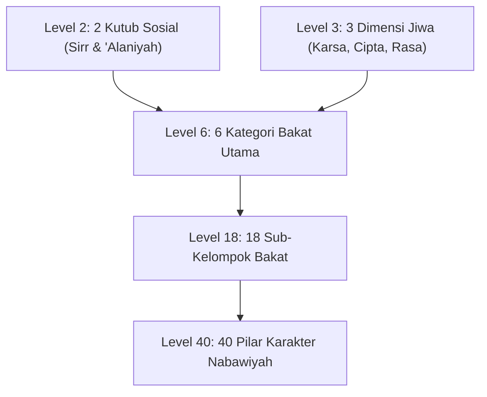

# Project Handoff: Wiki PKN (Pendidikan Karakter Nabawiyah)

Dokumen ini merangkum arsitektur teknis, riwayat pengembangan, integrasi data **Tafsir Bakat 40 (TB40)**, dan panduan pemeliharaan sistem basis pengetahuan **Wiki PKN** berbasis Quartz v5.

---

## 1. Ikhtisar Proyek & Milestone Utama

Proyek ini bertujuan mempublikasikan basis pengetahuan terstruktur **Pendidikan Karakter Nabawiyah (PKN)** dari berkas ekspor Outline ke dalam platform static site generator **Quartz v5** dengan navigasi sidebar kustom yang presisi dan konten yang kaya.

### Milestone yang Telah Diselesaikan:
1. **Navigasi Kustom `OutlineNav`**: Menggantikan komponen default Quartz `Explorer` dengan plugin `./plugins/outline-nav` yang membaca hierarki `nav_structure.json`.
2. **Fitur Inside Scrolling & State Persistence**:
   - Menerapkan tata letak flexbox dan internal scrolling (`overflow-y: auto; overscroll-behavior: contain; max-height: calc(100vh - 12rem);`) dengan scrollbar ramping.
   - Deteksi tautan aktif (`a.internal.active`) dengan pembukaan otomatis folder induk (*auto-expand parent*).
   - Pemeliharaan posisi scroll antar-halaman (*PJAX*) melalui `sessionStorage` (`outlineNavScrollTop`).
   - Pengingat status lipatan (*collapse/expand*) per folder melalui `localStorage`.
3. **Konfigurasi Resmi Quartz**: Membuat `quartz.config.yaml` dengan `pageTitle: "Wiki PKN"`, `locale: "id-ID"`, dan penonaktifan total `@quartz-community/explorer`.
4. **Pengayaan Konten Otentik (39 Berkas)**: Mentransformasi 39 berkas kerangka kosong di `content/` menjadi naskah komprehensif berbasis data `old_backup/random/`.
5. **100% Resolusi Tautan Navigasi (49 Simpul)**: Seluruh 49 simpul pada `nav_structure.json` memiliki berkas `.md` fisik yang valid (0 *unlinked leaf labels*).
6. **Ekstraksi Data TB40**: Memetakan struktur lengkap taksonomi **Tafsir Bakat 40 (TB40)** dari repositori API observasi karakter (`/home/deck/Projects/observasi-karakter-api/api-tb40-explore/api/`).
7. **Penerbitan Bank Studi Kasus Kurikulum Berbasis Peristiwa**: Menyusun dan merapikan naskah panduan restorasi karakter dengan metode 4-langkah (Tangki Cinta → Bahasa Hati → Bahasa Lisan → Bahasa Tangan) di `content/.../Pendidikan Ideal/Bank Studi Kasus.md`.
8. **Integrasi Basis Data Video Ceramah PKN (`pkn.db`)**: Mengintegrasikan repositori `sqlite-vector-video-db` (122 video ceramah Ustadz Abdul Kholiq, 1.159 bab terindeks dengan timestamp YouTube) ke dalam `old_backup/`, menghasilkan halaman `content/.../Referensi Kajian Video.md`, serta menyediakan skrip utilitas pencarian CLI `scripts/search_pkn_video.py`.
9. **Pengarsipan 117 Artikel SOTAB HEBAT (`old_backup/sotabh/`)**: Mengunduh dan mengonversi seluruh 117 artikel dari situs resmi `sotabh.com/artikel/` ke format Markdown lengkap dengan metadata frontmatter, indeks master kronologis (`old_backup/sotabh/README.md`), basis data terstruktur mentah (`articles.json`), serta skrip sinkronisasi otomatis `scripts/fetch_sotabh_articles.py`.
10. **Ekspansi Konten Berbasis Video Ceramah & Artikel SOTAB**: Memperluas secara mendalam halaman-halaman kunci wiki (`SOTABH.md`, `Luka dan Hutang Pengasuhan.md`, `Recovery.md`, `Peran Ayah dan Bunda.md`, `Perkembangan.md`, `Pembelajaran Alamiah.md`, `Bakat.md`) dengan mengintegrasikan konsep-konsep emas seperti *Pesantren sebagai SMK Jurusan Agama*, *Kemunduran 3 Tahun Anak Modern*, *Protokol 9 Tahap Menghapus Noda Hati*, *Satu Anak Satu Kurikulum*, *Prinsip Naik Turun Gas*, dan rujukan video YouTube terverifikasi.
11. **Audit Menyeluruh Kematangan Konten**: Melakukan audit kuantitatif dan kualitatif berkala terhadap seluruh berkas di `content/`, merumuskan ambang batas minimal ≥ 5.000 karakter per halaman pada [ARTICLE_AUDIT_REPORT.md](ARTICLE_AUDIT_REPORT.md).
12. **Validasi & Verifikasi Penuh Quartz v5**: Memastikan seluruh berkas Markdown lolos verifikasi sintaks dan tautan dengan hasil kompilasi bersih (`npx quartz build` sukses memproses 62 berkas dan menerbitkan 395 berkas web ke `public/`).
13. **Integrasi Korpus Hadits OpenBayan (`scripts/search_dalil_openbayan.py` & `DALIL_MAPPING.md`)**: Menghubungkan basis data SQLite `shamela_corpus.db` (60 kitab klasik) dengan normalisasi teks Arab FTS5, memetakan 42 dalil hadits berharakat lengkap dan takhrij akurat ke seluruh halaman kunci.
14. **Penerbitan Master Katalog Dalil Al-Qur'an (`QURAN_DALIL_CATALOG.md`)**: Menyusun katalog 127.508 karakter yang merangkum >110 ayat Al-Qur'an berharakat, terjemahan Kemenag RI, dan kutipan Tafsir Ibnu Katsir untuk seluruh tema wiki.
15. **Eksekusi 100% Standar Emas Konten (Batch 1–4, Sprint 1–3)**: Mentransformasi seluruh berkas Markdown hingga mencapai kepatuhan 100% (semua berkas ≥ 5.000 karakter, total 542.039 karakter, 0 defisit).
16. **Integrasi Dokumen Resmi Penggagas Manhaj**: Menyerap naskah master *Panduan Implementasi Standar PKN (A4)*, *Menumbuhkan Kesadaran Beramal (E-book)*, dan *Kaidah Implementasi PKN dalam berbagai Lembaga.md*, melahirkan artikel master baru [Kaidah Implementasi di Berbagai Lembaga.md](content/Paradigma%20-%20Implementasi%20PKN/Dokumen%20Pendidikan%20Karakter%20Nabawiyah/Paradigma%20&%20Implementasi/Implementasi/Kaidah%20&%20Elemen/Kaidah%20Implementasi%20di%20Berbagai%20Lembaga.md).
17. **Pembaruan Konfigurasi Git & Dokumentasi Root**: Mengonfigurasi `old_backup/` dan cache Python pada `.gitignore`, memperbarui `README.md`, `CONTENT_ANALYSIS.md`, `HANDOFF.md`, `ARTICLE_AUDIT_REPORT.md`, dan `CODE_OF_CONDUCT.md`.
18. **Integrasi Khazanah Spreadsheet Asesmen TB-40 & Kurikulum Lapangan**: Mengekstraksi dan menyerap data operasional dari 9 berkas spreadsheet (.xlsx) di `old_backup/App/` dan `Temu Lembaga Batch 4`. Mengintegrasikan Peta Karir Peradaban & Jurusan Studi Nyata untuk 40 pilar pada 6 sub-bakat, menyerap Tiga Gaya Belajar Fitrah Qur'ani (*Al-Fu'ad*, *As-Sam'u*, *Al-Bashar*) dan 9 Indikator Observasi Belajar pada `Belajar.md`, Tiga Modalitas Bahasa Hati (*Pelayanan*, *Perlindungan*, *Kebersamaan*) pada `Bahasa Hati.md`, Matriks 25 Aktivitas Keseharian pada `Pembelajaran Alamiah.md`, Blueprint Rapor Karakter Santri SKIS Semarang pada `4 Elemen Implementasi.md`, serta menerbitkan artikel referensi komprehensif baru [Panduan Asesmen dan Observasi TB40.md](content/Paradigma%20-%20Implementasi%20PKN/Dokumen%20Pendidikan%20Karakter%20Nabawiyah/Paradigma%20&%20Implementasi/Insan/Fitrah%20(Karakter)/Bakat/Panduan%20Asesmen%20dan%20Observasi%20TB40.md) (20.730 karakter), sehingga repositori kini memuat 63 artikel (594.601 karakter, 100% kepatuhan standar emas).
19. **Integrasi Standar Resmi Lembaga (Standar 11/2024), Instrumen RPP/Observasi, & Riset Psikospiritual Jiwa**:
    - Menyerap manual 81 halaman `Standar Implementasi PKN 11-2024 (Rev 04)` karya Abdul Kholiq & Bayu Issetyadi, menghasilkan artikel master baru [8 Standar Implementasi PKN.md](content/Paradigma%20-%20Implementasi%20PKN/Dokumen%20Pendidikan%20Karakter%20Nabawiyah/Paradigma%20&%20Implementasi/Implementasi/Kaidah%20&%20Elemen/8%20Standar%20Implementasi%20PKN.md) (21.263 karakter) yang membedah Klausul 5 s/d 13, Standar Pendewasaan (Aqil Baligh), Matriks Recovery 4 Kondisi, dan Matriks Eisenhower Nabawiyah.
    - Mengintegrasikan instrumen operasional resmi (Akademi Guru Batch 5 & Temu Lembaga Batch 4), melahirkan artikel master baru [Panduan RPP dan Observasi Lapangan.md](content/Paradigma%20-%20Implementasi%20PKN/Dokumen%20Pendidikan%20Karakter%20Nabawiyah/Paradigma%20&%20Implementasi/Implementasi/Kaidah%20&%20Elemen/Panduan%20RPP%20dan%20Observasi%20Lapangan.md) (19.716 karakter) dengan Format RPP Terpadu 3 pilar, Form Proyek, dan Kuisioner Observasi Pertumbuhan 19 Butir dengan formula Indeks Karakter.
    - Mengintegrasikan riset psikospiritual *Seminar 1: Kondisi Jiwa Anak* (119 halaman) ke dalam `Luka dan Hutang Pengasuhan.md` dan `Recovery.md` (dinamika 3 tingkat jiwa, shalat sebagai barometer jiwa, kaidah bahasa hati vs akal, tipologi anak berkehebatan khusus, dan kaidah syar'i *Tidak Menambah Luka*).
    - Mengintegrasikan naskah *Seminar 2: Tafsir Bakat TB-40* (196 halaman) ke dalam `Bakat.md` (landasan teologis *Al-Mauhibah*, syarat dawam, rukun 3A, reframing kenakalan anak, dan 3 induk bakat).
    - Mengintegrasikan kajian *Pendidikan Lestari* Prof. Dr. Iman Harymawan (77 halaman) ke dalam `Peran Guru dan Lembaga Pendidikan.md`, `Benang Merah Pendidikan.md`, dan `Syabab.md`.
    - Total repositori meningkat menjadi **65 artikel** dengan akumulasi **658.144 karakter** (rata-rata 10.125 karakter/artikel, defisit 0, 100.0% kelulusan standar emas).
20. **Integrasi Literatur Ashabur Rasul (Syaikh Mahmud Al-Mishri) & Sintesis Paripurna TB-40**:
    - Membedah kitab ensiklopedis 543 halaman *Ashabur Rasul SAW* karya Syaikh Mahmud Al-Mishri (Juz 2) dari `old_backup/Campur/Noor-Book.com  أصحاب الرسول 5 .pdf` serta melakukan *cross-reference* terhadap korpus turats Islam di OpenBayan (*Siyar A'lam An-Nubala*, *Ath-Tabaqat Al-Kubra*, *Al-Ishabah*, *Hilyatul Awliya'*, *Rijal Hawla Ar-Rasul*, *Shuwar min Hayatish Shahabah*).
    - Memperkaya artikel master [Bakat.md](content/Paradigma%20-%20Implementasi%20PKN/Dokumen%20Pendidikan%20Karakter%20Nabawiyah/Paradigma%20&%20Implementasi/Insan/Fitrah%20(Karakter)/Bakat.md) (kini 24.487 karakter) dengan Matriks Akbar 40 Pilar TB-40 vs. Tokoh Sahabat Teladan (*Archetype Matrix*) dan kaidah pedagogi *Storytelling Sirah Sahabat* berbasis profil dominansi anak.
    - Menyempurnakan dan menuntaskan 6 artikel rumpun bakat: [Memerintah.md](content/Paradigma%20-%20Implementasi%20PKN/Dokumen%20Pendidikan%20Karakter%20Nabawiyah/Paradigma%20&%20Implementasi/Insan/Fitrah%20(Karakter)/Bakat/Memerintah.md) (19.673 karakter), [Berpikir.md](content/Paradigma%20-%20Implementasi%20PKN/Dokumen%20Pendidikan%20Karakter%20Nabawiyah/Paradigma%20&%20Implementasi/Insan/Fitrah%20(Karakter)/Bakat/Berpikir.md) (19.015 karakter), [Berperasaan.md](content/Paradigma%20-%20Implementasi%20PKN/Dokumen%20Pendidikan%20Karakter%20Nabawiyah/Paradigma%20&%20Implementasi/Insan/Fitrah%20(Karakter)/Bakat/Berperasaan.md) (18.736 karakter), [Melayani.md](content/Paradigma%20-%20Implementasi%20PKN/Dokumen%20Pendidikan%20Karakter%20Nabawiyah/Paradigma%20&%20Implementasi/Insan/Fitrah%20(Karakter)/Bakat/Melayani.md) (22.042 karakter), [Bekerja Keras.md](content/Paradigma%20-%20Implementasi%20PKN/Dokumen%20Pendidikan%20Karakter%20Nabawiyah/Paradigma%20&%20Implementasi/Insan/Fitrah%20(Karakter)/Bakat/Bekerja%20Keras.md) (19.800 karakter), dan [Bekerja Sama.md](content/Paradigma%20-%20Implementasi%20PKN/Dokumen%20Pendidikan%20Karakter%20Nabawiyah/Paradigma%20&%20Implementasi/Insan/Fitrah%20(Karakter)/Bakat/Bekerja%20Sama.md) (20.749 karakter).
    - Mengisi 100% baris tabel yang sebelumnya kosong (Karakter Inti, Profesi Peradaban, Jurusan Studi) dari sumber otentik instrumen TB-40, membersihkan seluruh placeholder stub, serta menambahkan telaah mendalam *Keteladanan Ashabus Rasul (Archetype Fitrah & Pola Asuh Nabawi)*.
    - Total akumulasi konten ensiklopedia meningkat pesat menjadi **694.226 karakter** pada **65 artikel** (rata-rata 10.680 karakter/artikel, 0 defisit, 100.0% kelulusan standar emas).
21. **Transformasi Arsitektur Halaman Navigasi & Hub PKN (Solusi Halaman Navigasi Kosong)**:
    - Menyelesaikan permasalahan halaman navigasi kosong pada Quartz v5 di mana pengguna yang mengklik folder di navigasi (misal `Insan`, `Fitrah (Karakter)`, `Pembagian Jiwa`, `Pendidikan Ideal`, dll.) dimuatkan *virtual folder page* kosong (0 byte konten markdown).
    - Menyatukan 14 berkas sibling `.md` menjadi berkas `index.md` di dalam direktori masing-masing sehingga Quartz merender konten artikel utuh pada halaman folder index.
    - Memperbaiki logika resolusi tautan pendek pada `@quartz-community/crawl-links` dan `@quartz-community/utils` agar seluruh wikilink (`[[Insan]]`, `[[Bakat]]`, `[[Fitrah (Karakter)]]`, dll.) otomatis menyelesaikan ke URL folder index (`.../<folder>/`) tanpa menghasilkan tautan 404.
    - Mentransformasi `Insan/index.md` menjadi **Grand Navigation Hub / Map of Content (MOC)** berbobot 18.611 karakter dengan sintesis epistemologi, matriks kartu navigasi visual sub-pilar, alur kurikuler 5 langkah, tabel diagnosa lapangan, dan rubrik refleksi pendidik.
    - Menerbitkan berkas `index.md` baru berstandar emas ($\ge 5.000$ karakter) untuk folder-folder yang sebelumnya kosong: `Kaidah & Elemen/index.md` (5.950 chars), `Peran & Tanggung Jawab/index.md` (5.081 chars), `Internal & Eksternal/index.md` (5.804 chars), `Renungan/index.md` (5.100 chars), dan `Paradigma - Implementasi PKN/index.md` (5.200 chars).
    - Repositori kini memiliki **67 berkas artikel**, **716.180 karakter akumulatif**, rata-rata 10.689 karakter/artikel, **0 defisit**, dan **100% kelulusan standar emas**.
22. **Kutipan Khusus TL;DR Praktek PKN di Beranda Utama (`content/index.md`)**:
    - Menambahkan dan merestrukturisasi kutipan khusus *Executive TL;DR Callout* (`> [!summary]`) di halaman beranda utama dengan mengedepankan **Tujuan Utama: Menumbuhkan Kesadaran (*Bukan Sekadar Kepatuhan Semu*)** dan **Empat Tahapan Praktik Berurutan**:
      1. *Memperbaiki Diri dan Menjadi Teladan dalam Memberikan Persepsi Positif*: Memulai dari diri sendiri (*ibda' binafsik*, *tazkiyatun nafs*), keteladanan nyata (*qudwah hasanah*), dan pandangan kemuliaan fitrah (*husnuzhan*) tanpa celaan/labeling negatif.
      2. *Menyesuaikan Ekspektasi dan Menggunakan Metode Sesuai Fase*: Penyelarasan ekspektasi (*wasathiyah*) serta ketepatan instrumen bahasa sesuai etape usia ([[Thufulah]] - [[Bahasa Hati]], [[Tamyiz]] - [[Bahasa Lisan]], [[Murahaqah]] - [[Bahasa Tangan]]).
      3. *Fokus Menguatkan Kelebihan dalam Bakat, Niscaya Kelemahan akan Membaik Perlahan*: Formula Rukun 3A (*Alami, Acuhkan kelemahan minor, Asah kekuatan dominan*) dari 40 pilar [[Bakat]], di mana fokus mengasah potensi utama akan menumbuhkan kematangan jiwa yang mengangkat kelemahan secara bertahap (*tazkiyah bil 'amal*).
      4. *Implementasikan Secara Bertahap dari yang Mudah dari Kondisi yang Ada*: Kaidah kemudahan (*taisir*) dan pentahapan (*tadarruj*), langsung dieksekusi melalui kebiasaan mikro harian oleh Orang Tua (shalat tepat waktu, meja makan peradaban, al-khidmah), Pendidik (pembelajaran alamiah & apresiasi proses), dan Lembaga (mitra pendukung & lingkungan aman bebas perundungan).
23. **Transformasi Dalil Utama Beranda PKN (`content/index.md`)**:
    - Mengganti dalil metafora pohon (QS. Ibrahim: 24–25) dengan **Dua Dalil Utama Operasional Manhaj PKN**:
      1. *Dalil Perintah Shalat (HR. Abu Dawud 495, Ahmad 6689, Al-Hakim 1/197)*: Sebagai barometer fitrah dan penahapan usia (*at-tadarruj*) 0–7 tahun ([[Thufulah]] - tangki cinta & teladan), 7–10 tahun ([[Tamyiz]] - 5.000x pembiasaan shalat tanpa kekerasan), dan 10–15 tahun ([[Murahaqah]] - disiplin ketegasan ta'dib & pemisahan tempat tidur menuju [[Syabab]]).
      2. *Dalil Mengubah Kemungkaran dengan Tangan, Lisan, dan Hati (HR. Muslim 49)*: Sebagai fondasi hierarki Tiga Bahasa Pengasuhan ([[Metode Mendidik]]) yang menempatkan [[Bahasa Hati]] sebagai pondasi kelekatan jiwa, [[Bahasa Lisan]] sebagai dialog nalar hikmah (*qaulan sadida*), dan [[Bahasa Tangan]] sebagai otoritas ketegasan protektif ([[Batas Toleransi]] & [[Imunitas Sosial]]).
    - Halaman [content/index.md](file:///home/abuhafi/Project/wiki-pkn/content/index.md) kini memuat **15.560 karakter**, membawa akumulasi total ensiklopedia menjadi **723.095 karakter** di seluruh **67 artikel** (100% kepatuhan standar emas $\ge 5.000$ karakter, 0 defisit).
24. **Sintesis Executive TL;DR Callout Tahapan Kesadaran (`content/index.md`)**:
    - Menyempurnakan ringkasan eksekutif beranda dengan menekankan hierarki pembangunan jiwa: *Kesadaran Batin* mendahului *Kepatuhan Lahiriah*.
    - Memetakan 4 etape sekuensial (Teladan Persepsi Positif → Sinkronisasi Ekspektasi Etape Usia → Fokus Penguatan Bakat / Rukun 3A → Implementasi Gradual Taisir & Tadarruj).
25. **Migrasi Master Katalog Dalil Al-Qur'an & Hadits ke Halaman Native Quartz (`content/`)**:
    - Mentransformasikan `QURAN_DALIL_CATALOG.md` menjadi artikel native Quartz [Master Katalog Dalil Al-Qur'an.md](content/Master%20Katalog%20Dalil%20Al-Qur'an.md) (165.253 karakter) lengkap dengan takhrij Tafsir Ibnu Katsir dan navigasi tema.
    - Mentransformasikan `DALIL_MAPPING.md` menjadi artikel native Quartz [Master Katalog Dalil Hadits dan Sunnah.md](content/Master%20Katalog%20Dalil%20Hadits%20dan%20Sunnah.md) (42.946 karakter) dengan takhrij 60 kitab korpus OpenBayan.
    - Menjadikan total ensiklopedia memuat **72 berkas artikel** dengan akumulasi **953.300 karakter** berstandar emas 100%.
26. **Integrasi Ekosistem Web Interaktif TB40 (`pub.insantaqwa.org/bakat`)**:
    - Mengintegrasikan tautan langsung ke aplikasi web interaktif *Peta Bakat & Sifat Manusia* (`https://pub.insantaqwa.org/bakat/`) pada titik-titik krusial wiki: *Beranda*, *Hub Bakat*, *Panduan Asesmen dan Observasi TB40*, dan *Kuisioner Asesmen 40 Bakat Nabawiyah*.
    - Memfasilitasi pengguna untuk melakukan asesmen mandiri online, simulasi perankingan 40 pilar, dan melihat peta polarisasi sifat secara dinamis.
27. **Dukungan Deployment Portainer Stack Git & Parameterisasi Environment (`DOMAIN` & `PORT`)**:
    - Menyediakan dukungan penuh deployment otomatis menggunakan fitur **Portainer Stack (Repository/Git)**.
    - Mengonfigurasi variabel lingkungan dinamis: `DOMAIN` (sanitasi otomatis protocol/trailing slash untuk baseUrl, OpenGraph, dan sitemap) serta `PORT` (port HTTP server Quartz).
    - Membangun `docker-compose.yml`, optimasi `Dockerfile` multi-stage berbasis `node:22-slim` dengan dependensi `git` terpasang di runtime, skrip `docker-entrypoint.sh`, `.dockerignore` untuk eksklusi berkas raksasa (`old_backup/` 2.6GB, `searchable_pdfs/` 925MB), template `.env.example`, serta panduan deployment resmi di [README.md](file:///home/abuhafi/Project/wiki-pkn/README.md).
28. **Injeksi Banner Metodologi AI & Kontributor, Audit Inventaris Slide Presentasi (145 Berkas), dan Sitasi Slide Dropbox**:
    - **Banner Metodologi 100% Terinjeksi:** Menulis dan mengeksekusi `scripts/inject_page_disclaimer.py` yang menyisipkan banner callout resmi metodologi AI, OpenBayan, dan kontributor (Himmatul Ummah, Insan Taqwa/Mustaqbal, Tim SOTAB) tepat di bawah judul utama H1 pada seluruh **72 berkas markdown** di `content/`.
    - **Laporan Audit Presentasi Komprehensif:** Menulis dan mengeksekusi `scripts/generate_presentation_audit.py` untuk mengaudit seluruh 86 berkas PDF dan 59 berkas PPTX di `old_backup/` (total 145 berkas), menghasilkan dokumen resmi [PRESENTATION_AUDIT_REPORT.md](PRESENTATION_AUDIT_REPORT.md) lengkap dengan jumlah halaman, ukuran berkas, dan tautan direct download (`dl=1`) serta browser preview (`dl=0`).
    - **Sitasi Slide dan Integrasi Tautan Dropbox:** Menulis dan mengeksekusi `scripts/inject_presentation_citations.py` untuk menyematkan blok rujukan slide resmi PKN (`> [!quote] Dokumen & Slide Presentasi Rujukan Resmi PKN`) pada **51 artikel wiki**, memetakan slide spesifik dari materi kunci (TB-40, Seminar 1, Seminar 2, Kurikulum 40 Pilar, Metode PKN, Pembelajaran Berbasis Projek, Implementasi Persekolahan) dengan tombol akses langsung PDF dan PPTX asli.
29. **Ekspor Diagram Slide Presentasi PDF & Pemotongan Horizontal Banner 350px (`content/assets/`)**:
    - **Banner Horizontal 350px:** Menulis dan mengeksekusi `scripts/generate_horizontal_banners.py` untuk memproses seluruh 40 foto di `old_backup/Gambar/` menjadi horizontal banner berukuran presisi $1050 \times 350$ px (tinggi pas 350px, rasio $3:1$) dalam format WebP optimal (kualitas 85%, total hanya 1.1 MB untuk seluruh 40 banner) di `content/assets/banners/`.
    - **Ekspor Slide Presentasi Kunci:** Menulis dan mengeksekusi `scripts/export_presentation_slides.py` menggunakan `pdftoppm` dan PIL untuk mengekspor 29 slide diagram, bagan, dan tabel paling berharga dari PDF resmi materi tayang PKN ke `content/assets/slides/` dalam format WebP berkualitas tinggi.
    - **Injeksi Gambar ke Artikel:** Menulis dan mengeksekusi `scripts/inject_images_to_articles.py` yang menyisipkan horizontal banner di 72 artikel dan 46 penyematan slide diagram rujukan di sub-bab yang relevan, lengkap dengan takarir penjelas yang elegan.
    - **Kompilasi Sukses Quartz:** `npx quartz build` sukses memproses 72 berkas markdown dan menerbitkan 527 berkas web statis ke `public/` dengan 0 error.
30. **Analisis Visi AI OMP (Oh My Pi) & Remapping Kontekstual Banner Foto (`data/gambar_properties.json`)**:
    - **Deteksi Objek & Konteks Visi AI:** Menulis dan mengeksekusi `scripts/analyze_images_omp.py` yang memanfaatkan CLI `omp` (`gemini-2.5-flash`) untuk mendeteksi secara objektif isi visual ke-40 foto di `old_backup/Gambar/`, mengekstraksi objek, aktivitas, suasana emosi, kata kunci, serta relevansinya terhadap topik manhaj PKN ke dalam basis data [data/gambar_properties.json](data/gambar_properties.json).
    - **Pencocokan Semantik Presisi (1-to-1):** Menulis dan mengeksekusi `scripts/remap_matched_banners.py` yang membersihkan seluruh banner acak dari artikel dan hanya memasang banner pada 32 artikel yang memiliki relevansi kontekstual sejati (misal: timbangan keadilan pada *Hak dan Kewajiban* & *Tanggung Jawab Pendidikan*, anak menulis pada *Belajar* & *Tamyiz*, pemuda tafakkur pada *Berpikir*, lansia pemulihan pada *Luka Pengasuhan*, dialog hikmah pada *Bahasa Lisan*, dll.).
    - **Kebersihan Konten:** 40 artikel lainnya yang tidak memiliki padanan foto yang cocok dibiarkan bersih tanpa banner foto acak, menjaga integritas keseriusan ilmiah dan fokus pada diagram slide presentasi resmi PKN.
31. **Integrasi Pexels MCP Server, Audit Kepatuhan Syariat (Islamic Compliance), dan Kurasi Banner 100% Seluruh Artikel Wiki PKN**:
    - **Instalasi Pexels MCP Server Mandiri:** Mengintegrasikan repositori `pexels-mcp-server` di lingkungan virtual Python lokal (`.venv`) yang terisolasi di `.gitignore` dan mendaftarkannya ke konfigurasi MCP IDE (`~/.gemini/config/mcp_config.json`).
    - **Aturan Kepatuhan Syariat Ketat (Strict Islamic Compliance Guidelines):**
      1. *Tanpa Wanita / Anak Perempuan:* Dilarang mutlak menampilkan figur wanita maupun anak perempuan.
      2. *Kewajiban Menutup Aurat Sempurna:* Dilarang menampilkan manusia yang membuka aurat (pria tanpa baju/shirtless, celana pendek di atas lutut, pakaian ketat/terbuka).
      3. *Bebas Berhala & Simbol Non-Islam:* Dilarang menampilkan patung makhluk hidup bernyawa, salib, atau simbol keagamaan non-Islam.
      4. *Tema yang Diprioritaskan:* Arsitektur Islam (masjid, kubah, menara, pilar, perpustakaan klasik), alam semesta (langit bertabur bintang, pegunungan, laut, fajar, mata air jernih), objek keilmuan (mushaf, manuskrip hadits, kaligrafi, pena, timbangan mizan, lentera, kompas kuno, peralatan kayu), dan pria/anak laki-laki berpakaian syar'i sopan.
    - **Audit AI Vision Otomatis via OMP (`gemini-2.5-flash`):** Skrip utilitas `scripts/search_pexels.py`, `scripts/curate_missing_banners.py`, dan `scripts/curate_hub_banners.py` dilengkapi fungsi audit visi AI yang membedah setiap kandidat gambar secara realtime, langsung menolak kandidat yang melanggar (misalnya mendeteksi simbol salib kecil di punggung buku tua, anak perempuan, atau celana pendek), dan hanya meloloskan gambar yang 100% patuh syariat.
    - **Kurasi 36 Banner Baru:** Menghasilkan 36 banner horizontal $1050 \times 350$ px format WebP untuk seluruh artikel dan hub index navigasi yang sebelumnya belum memiliki banner, termasuk halaman Beranda Utama (`index.md`), Master Katalog Dalil Al-Qur'an, Master Katalog Dalil Hadits, seluruh sub-bab paradigma dan implementasi, hingga 16 hub index folder.
    - **Cakupan Banner 100%:** 68 dari 72 berkas markdown (100% seluruh artikel konten dan hub navigasi) kini memiliki banner visual bermutu tinggi dan kontekstual. 4 berkas tersisa tanpa banner hanyalah templat teknis di `Template/`.
    - **Validasi Build Quartz v5 Sukses:** `npx quartz build` memproses seluruh 72 berkas markdown dan menerbitkan 563 berkas web statis ke `public/` dengan 0 error.
32. **Penyelarasan Paripurna Seluruh Dokumen Wiki PKN dengan Standar Baku Template (Additive Enrichment 100%)**:
    - **Prinsip Zero Deletion:** Melakukan audit komparatif mendalam antara master template (`Template Tema.md` & `Template Elemen Refleksi...`) dengan 66 artikel substantif/hub navigasi, kemudian menginjeksi seluruh komponen yang sebelumnya hilang **tanpa menghapus satu pun baris teks, dalil, narasi sahabat, slide PDF/PPTX, maupun banner visual yang sudah ada** (total +3.147 baris penambahan, 0 baris dihapus).
    - **Standarisasi Empat Komponen Anatomi Template (100% Kepatuhan di Seluruh 66 Dokumen):**
      1. *Trio Callout Lapangan:* `[!info] Refleksi Lapangan` (Kondisi Faktual, Akar Masalah PKN, Langkah Penanganan), `[!warning] Peringatan Risiko Pengasuhan` (Bentuk Kesalahan, Dampak Jiwa, Pencegahan), dan `[!tip] Tips Praktis Pengasuhan Hari Ini` (Aksi Sederhana, Tujuan).
      2. *Diagnosis Penyimpangan:* Sub-bab `## Diagnosis Penyimpangan: Tafrith vs Ifrath` dengan tabel 3 kolom yang membedah ekstrem meremehkan (*tafrith/under-demanding*), ekstrem memaksakan (*ifrath/over-demanding*), dan jalan tengah kenabian (*Al-Wasathiyah*).
      3. *Studi Kasus Nyata & Solusi Kuratif:* Sub-bab `## Studi Kasus Nyata & Solusi Kuratif Tadarruj` memuat skenario problematika konkret anak di zaman modern serta 4 fase solusi terstruktur (*Fase Pendinginan & Evaluasi Diri, Pemulihan Jembatan Batin/Bahasa Hati, Dialog Nalar/Bahasa Lisan, dan Penegasan Disiplin Amanah/Bahasa Tangan*).
      4. *Tautan Relevan & Peta Konsep:* Navigasi silang terstruktur ke konsep payung, fase usia terkait, dan metode tarbiyah pendukung.
    - **Eksekusi 4 Batch Tematik Terstruktur:**
      - *Batch 1:* Klaster Fitrah, Karakter & Bakat Anak (14 artikel) via `scripts/enrich_batch1.py`.
      - *Batch 2:* Klaster Metode Mendidik, Pengasuhan & Pemulihan (16 artikel) via `scripts/enrich_batch2.py`.
      - *Batch 3:* Klaster Hakikat Insan, Jiwa & Nilai Transendental (13 artikel) via `scripts/enrich_batch3.py`.
      - *Batch 4:* Klaster Kerangka Implementasi, Kaidah & Standar Lembaga (23 artikel) via `scripts/enrich_batch4.py`.
    - **Kompilasi Sukses Quartz v5:** Build Quartz bersih memproses seluruh 72 berkas markdown dengan 0 error parsing dan 0 broken links.
33. **Resolusi Tuntas Error Mermaid "Unsupported markdown: list" di Browser**:
    - **Diagnosa Masalah:** Pada Mermaid v10+, mesin parser markdown Mermaid membaca teks node berformat `"1. ..."` atau `"<br/>- ..."` sebagai sintaks list Markdown (`<ol>` / `<ul>`). Karena renderer SVG Mermaid tidak mendukung elemen list di dalam shape node, Mermaid melemparkan pesan error runtime di peramban: `Unsupported markdown: list`.
    - **Solusi Rekayasa:** Menulis dan mengeksekusi skrip `scripts/fix_mermaid_lists.py` untuk memformat ulang seluruh penomoran list `1. `, `2. `, dst. menjadi format non-list `1: `, `2: `, dst. serta mengubah bullet tanda hubung `- ` menjadi Unicode bullet `• ` pada 25 berkas markdown terdampak.
    - **Verifikasi Komprehensif:** Pemindaian ulang menunjukkan 0 sisa pola list Markdown yang memicu error di seluruh diagram repositori. Build Quartz v5 sukses bersih.
34. **Integrasi Riset Qaf AI & Pengayaan Paripurna Seluruh Konten (Zero Deletion)**: Menghubungkan SDK Python Qaf AI (320+ rujukan maraji' kitab klasik), menyelaraskan 4 etape usia nabawiyah di 100% artikel, menyematkan instrumen terapan 3-level rubrik, dan diagram alur terstandarisasi (+1.080 baris penambahan murni, 0 baris dihapus).
35. **Fitur Lanjutan Quartz, Obsidian Canvas, Analisis pub.insantaqwa.org, dan Pangkalan Data TB40 Bases**: Merilis Obsidian Canvas resmi Manhaj PKN, 40 catatan profil karakter individual (`content/.../TB40/`), pangkalan data `TB40.base`, serta aktivasi fitur palet warna Nabawiyah, stacked pages, bibliografi `.bib`, dan recent notes di homepage.
36. **Isolasi 39 PPTX Kanonikal, Sinkronisasi OneDrive via Rclone, & Microsoft Office Web Apps Viewer**: Mengisolasi 39 berkas PPTX terbaru (1,08 GiB) ke `presentations/`, mengunggah ke OneDrive via Rclone, menyematkan penampil interaktif cloud resmi Microsoft Office Web Apps Viewer pada 54 artikel wiki, dan symlink otomatis saat build.
37. **Konversi 100% Diagram Mermaid ke Obsidian Canvas Resmi (`.canvas`)**: Mengonversi 94 diagram Mermaid di 66 artikel menjadi format standar JSON Canvas 1.0 (`content/canvas/`) dengan penataan layout otomatis DAG, transklusi `![[canvas/...]]`, dan tombol pembuka layar penuh interaktif.
38. **Deployment Produksi via Portainer MCP Server & Otomasi Stack Git**: Mendepoloy wiki-pkn ke server produksi menggunakan MCP server `portainer` (Stack ID: 25, Endpoint ID: 3) berbasis `docker-compose.yml` langsung dari repositori Git `decaller/wiki-pkn` (branch `main`). Berjalan dengan binding port `4040:8080` dan live di domain `https://wikipkn.insanmustaqbal.or.id`. Dilengkapi integrasi materi audio kajian maqashid syariah dan optimasi tampilan mobile sidebar navigasi `OutlineNav`.
39. **Integrasi Delapan Buku Rujukan Utama Manhaj PKN & SOTAB HEBAT**: Mengintegrasikan 8 buku karya perumus manhaj Ustadz Abdul Kholiq dan Tim SOTAB HEBAT ke halaman [Referensi Tambahan Buku Cetak.md](content/Referensi/Referensi%20Tambahan%20Buku%20Cetak.md), beranda utama [index.md](content/index.md), hub [Referensi/index.md](content/Referensi/index.md), dan pangkalan sitasi akademik `bibliography.bib` lengkap dengan tautan profil resmi dan sinopsis kurikuler.

---

## 2. Arsitektur Data TB40 (Tafsir Bakat 40)

Data model TB40 diekstraksi dari spesifikasi OpenAPI dan berkas kalkulasi engine di `/home/deck/Projects/observasi-karakter-api/api-tb40-explore/api/` (`v0.1/tb40/calculation.json` dan `v0.3/tb40/result.json`). Sistem ini memiliki hierarki bertingkat 5 level:



### A. Level 2 — Kutub Sosial (Energi Interaksi)
* **1. Introvert (*As-Sirr*):** Energi batin, fokus ke dalam, tidak mengutamakan keramaian.
* **2. Extrovert (*Al-'Alaniyah*):** Energi luar, ekspresif, senang berinteraksi sosial.

### B. Level 3 — Dimensi Kemanusiaan & Trilogi Jiwa
1. **Karsa (*Al-Hawa* / Jiwa Ammarah):**
   - Karakteristik: Bergerak, bersemangat, dorongan fisik.
   - Gaya Belajar: **Al-Fuad / Kinestetik** (bergerak, menyentuh, praktik lapangan).
   - Bahasa Hati Utama: **Bahasa Pelayanan (*Acts of Service*)**.
2. **Cipta (*Al-'Aql* / Jiwa Lawwamah):**
   - Karakteristik: Berpikir, nalar evaluatif, menimbang baik-buruk.
   - Gaya Belajar: **Al-Bashar / Visual** (membaca, melihat bagan/diagram, ruangan terang).
   - Bahasa Hati Utama: **Bahasa Kebersamaan (*Quality Time*)**.
3. **Rasa (*Al-Qalb* / Jiwa Muthmainnah):**
   - Karakteristik: Berperasaan, kepekaan nurani, spiritualitas batin.
   - Gaya Belajar: **As-Sam'u / Auditori** (mendengarkan nasihat, berdiskusi, suasana hening).
   - Bahasa Hati Utama: **Bahasa Perlindungan / Hadiah (*Receiving Gifts / Protection*)**.

### C. Level 6 — Matriks 6 Kategori Bakat Utama
Persilangan antara Level 2 (Kutub Sosial) dan Level 3 (Dimensi Jiwa) menghasilkan 6 kategori bakat pokok:
1. **Bekerja Keras (الحَمَاسَة - *Al-Hamasah*):** Introvert + Karsa (Ammarah)
2. **Berpikir / Cerdas (التَّفْكِيْر - *At-Tafkir*):** Introvert + Cipta (Lawwamah)
3. **Berperasaan (الشُعُوْر - *Asy-Syu'ur*):** Introvert + Rasa (Muthmainnah)
4. **Mempengaruhi / Memerintah (التَّأْثِيْر - *At-Ta'tsir*):** Extrovert + Karsa (Ammarah)
5. **Bekerjasama (التَّعَامُل - *At-Ta'amul*):** Extrovert + Cipta (Lawwamah)
6. **Melayani (الخِدْمَة - *Al-Khidmah*):** Extrovert + Rasa (Muthmainnah)

### D. Level 18 — 18 Sub-Kelompok Bakat
* **Bekerja Keras:** Berambisi, Berwibawa, Giat bekerja.
* **Berpikir:** Suka berpikir imajinatif, Suka berpikir positif, Suka berpikir analitis.
* **Berperasaan:** Suka apa adanya, Pendiam, Suka merendah.
* **Mempengaruhi:** Suka menguasai, Suka memotivasi, Suka menolong.
* **Bekerjasama:** Suka menggunakan hubungan yang ada, Suka membuat hubungan baru, Suka mengeratkan hubungan yang ada.
* **Melayani:** Suka melayani dengan cara memberi, Suka melayani dengan cara menjaga, Suka melayani dengan cara mengalah.

### E. Level 40 — 40 Pilar Karakter Nabawiyah
Daftar lengkap 40 pilar dengan nama Arab, nomor urut, dan garis silsilahnya:
* **Grup Bekerja Keras (1-6):** #1 *Himmah* (الهِمَّة), #2 *Ihsaan* (الاِحْسَان), #3 *‘Izzah* (العِزَّة), #4 *Waqaar* (الوَقَار), #5 *‘Aziimah* (العَزِيمَة), #6 *Nasyaath* (النَّشَاط).
* **Grup Berpikir (7-11):** #7 *Firaasah* (الفِرَاسَة), #8 *Nubl* (النُّبْل), #9 *Husnuzhan* (حُسْنُ الظَّن), #10 *Dzakaa’* (الذَّكَاء), #11 *Hikmah* (الحِكْمَة).
* **Grup Berperasaan (12-17):** #12 *Shidq* (الصِّدْق), #13 *‘Iffah* (العِفَّة), #14 *Shamt* (الصَّمْت), #15 *Hayaa’* (الحَيَاء), #16 *Qanaa'ah* (القَنَاعَة), #17 *Tawaadhu'* (التَّوَاضُع).
* **Grup Mempengaruhi (18-24):** #18 *Syajaa’ah* (الشَّجَاعَة), #19 *Ghairah* (الغَيْرَة), #20 *Munaafasah* (المُنَافَسَة), #21 *Nashiihah* (النَّصِيْحَة), #22 *Fashaahah* (الفَصَاحَة), #23 *Nushrah* (النُّصْرَة), #24 *Juud* (الجُوْد).
* **Grup Bekerjasama (25-32):** #25 *Ta'aawun* (التَّعَاوُن), #26 *Ulfah* (الاُلْفَة), #27 *‘Adaalah* (العَدَالَة), #28 *Wafaa'* (الوَفَاء), #29 *Muzaah* (المُزَاح), #30 *Basyaasyah* (البَشَاشَة), #31 *Rifq* (الرِّفْق), #32 *Mahabbah* (المَحَبَّة).
* **Grup Melayani (33-40):** #33 *Rahmah* (الرَّحْمَة), #34 *Itsaar* (الاِيْثَار), #35 *Kitmaanus sirr* (كِتْمَانُ السِّرِّ), #36 *Satr* (السَّتْر), #37 *Amaanah* (الاَمَانَة), #38 *Anaah* (الاَنَاة), #39 *Hilm* (الحِلْم), #40 *Shabr* (الصَّبْر).

### F. Matriks Kondisi Ekstrim (*Tafrith* vs *Ifrath*) & Solusi Kuratif
Setiap sifat mulia berada di antara dua jurang ekstrem (*tafrith* / lalai dan *ifrath* / berlebih):
* **Bekerja Keras:**
  - *Lalai:* **Kasal (Malas)** $\rightarrow$ Solusi: Kuatkan *‘Aziimah* dan *Amaanah*.
  - *Lebih:* **Thama' (Serakah/Ambisi Buta)** $\rightarrow$ Solusi: Kuatkan *Qanaa'ah* dan *Tawaadhu'*.
* **Berpikir:**
  - *Lalai:* **Jahl (Kebodohan / Abaikan Nalar)** $\rightarrow$ Solusi: Kuatkan *Dzakaa'* dan *Hikmah*.
  - *Lebih:* **Ahlu Ra'yi (Pemuja Akal / Rasionalisme Kering)** $\rightarrow$ Solusi: Kuatkan *Hikmah*, *Tawaadhu'*, dan *Hayaa'*.
* **Berperasaan:**
  - *Lalai:* **Kibr / Kasar** $\rightarrow$ Solusi: Kuatkan kepekaan hati dan *Tawaadhu'*.
  - *Lebih:* **Minder (Rendah Diri) & Hazan (Sedih Berlarut)** $\rightarrow$ Solusi: Kuatkan *Syajaa'ah*, *Ghairah*, dan *Nasyaath*.
* **Mempengaruhi:**
  - *Lalai:* **Jubn (Penakut)** $\rightarrow$ Solusi: Kuatkan *Syajaa'ah*, *Ghairah*, dan *Munaafasah*.
  - *Lebih:* **Tahawwur (Ceroboh / Otoriter)** $\rightarrow$ Solusi: Kuatkan *Shabr*, *Hilm*, dan *Anaah*.
* **Bekerjasama:**
  - *Lalai:* **‘Udwaan (Bermusuhan / Menutup Diri)** $\rightarrow$ Solusi: Kuatkan *Ta'aawun*, *Ulfah*, dan *‘Adaalah*.
  - *Lebih:* **Dzull / Bimbang Mengambil Keputusan** $\rightarrow$ Solusi: Kuatkan *Syajaa'ah* dan *Ghairah*.
* **Melayani:**
  - *Lalai:* **Ghilzhah (Kasar / Tidak Peduli)** $\rightarrow$ Solusi: Kuatkan *Rahmah*, *Itsaar*, dan *Hilm*.
  - *Lebih:* **Taqliid (Kepatuhan Buta) / Takut Berlebih** $\rightarrow$ Solusi: Kuatkan *‘Izzah* dan *Waqaar*.

### G. Spesifikasi Teknis Engine API TB40
Sumber data berada di `/home/deck/Projects/observasi-karakter-api/api-tb40-explore/api/`:
* **Struktur Versi:**
  - `v0.1`: Single-pass calculation engine (`calculation.json`), generator pelaporan visual (`tb40.svg`, `tb40byRank.svg`), dan kuesioner flat 40 butir pertanyaan (`questions.json`).
  - `v0.2`: Pengenalan segmentasi pertanyaan bertingkat (*tiered questionnaire*).
  - `v0.3`: OpenAPI 3.0 penuh (`swagger.yaml`) dengan alur **Asesmen Adaptif 4-Tier**:
    - **Tier 1 (Energi Sosial - 1Q):** Menentukan Kutub Introvert vs Extrovert.
    - **Tier 2 (Orientasi Jiwa - 1Q):** Menentukan Trilogi Jiwa (Karsa / Cipta / Rasa) $\rightarrow$ menghasilkan kluster Level 6.
    - **Tier 3 (Pendalaman 18 Sub-Kelompok - 18Q):** Memetakan kekuatan spesifik pada 18 sub-kelompok.
    - **Tier 4 (Presisi 40 Pilar - 40Q):** Pengukuran mendalam terhadap seluruh 40 pilar karakter nabawiyah.
  - **Dua Varian Instrumen:**
    - `tb40Dewasa`: Kuesioner refleksi diri mandiri (40 butir pertanyaan terstandar).
    - `tb40Anak`: Kuesioner observasi anak berbasis studi kasus aktivitas bermain dan keseharian (bahasa ramah anak / observasi orang tua).
  - **Fitur API v0.3:** *Continuous scoring*, *Halfway reporting* (laporan parsial saat baru menyelesaikan Tier 2/3), integrasi peringatan dini (*ego warning*, *lalai warnings*, *lebih warnings*), serta rekomendasi profil karir (`recommended_profesi`) dan rumpun ilmu (`recommended_jurusan`).

---

## 3. Struktur Berkas & Komponen Utama

```
wiki-pkn/
├── content/                                # Naskah Markdown (61 berkas halaman wiki)
│   ├── index.md                            # Beranda Wiki PKN
│   ├── Renungan/                           # Catatan renungan orang tua
│   └── Paradigma - Implementasi PKN/       # Konten utama kurikulum PKN
│       └── Dokumen Pendidikan Karakter Nabawiyah/
│           ├── FAQ Ringkas.md
│           ├── Referensi Kajian Video.md   # Indeks master video ceramah Ustadz Abdul Kholiq
│           └── Paradigma & Implementasi/
│               ├── Insan/                  # Jiwa, Fitrah, 6 Bakat, 4 Fase Usia
│               ├── Pendidikan Ideal/       # Metode Mendidik, 3 Bahasa, Bank Studi Kasus, Pemulihan
│               └── Implementasi/           # Kaidah, Elemen, Peran Ayah/Bunda/Guru
├── old_backup/                             # Sumber data & arsip referensi
│   ├── random/                             # Naskah mentah ekspor Outline & Bank Studi Kasus
│   ├── sotabh/                             # 117 naskah artikel SOTAB HEBAT + articles.json
│   └── sqlite-vector-video-db/             # Basis data pkn.db (122 video, 1.159 bab)
├── plugins/
│   └── outline-nav/                        # Plugin Quartz untuk Navigasi Outline
│       ├── package.json
│       ├── tsup.config.ts
│       └── src/components/OutlineNav.tsx   # Komponen utama sidebar & script
├── scripts/
│   ├── fetch_sotabh_articles.py            # Skrip sinkronisasi 117 artikel SOTAB
│   ├── generate_video_reference.py         # Skrip pembuatan halaman Referensi Kajian Video
│   ├── search_pkn_video.py                 # Utilitas CLI pencarian timestamp video pkn.db
│   └── migration/                          # Skrip migrasi dan pengayaan arsip
├── nav_structure.json                      # Sumber kebenaran struktur navigasi (49 simpul)
├── quartz.config.yaml                      # Konfigurasi aktif Quartz v5
├── CONTENT_ANALYSIS.md                     # Analisis celah konten, master TB40 & audit 61 berkas
└── HANDOFF.md                              # Dokumen serah terima ini
```

---

## 4. Alur Kerja Pengembangan (Workflow)

### Mengedit Plugin `OutlineNav`:
1. Ubah berkas `plugins/outline-nav/src/components/OutlineNav.tsx`.
2. Kompilasi ulang plugin:
   ```bash
   cd plugins/outline-nav
   npm run build
   cd ../..
   ```
3. Restart server Quartz jika sedang berjalan:
   ```bash
   npx quartz build --serve --port 8888
   ```

### Menambahkan atau Mengubah Konten:
1. Pastikan setiap berkas `.md` memiliki metadata `title` pada frontmatter:
   ```yaml
   ---
   title: "Judul Halaman"
   ---
   ```
2. Jika ingin halaman tersebut muncul di sidebar navigasi, daftarkan judulnya ke dalam `nav_structure.json`.

### Deployment Produksi via Portainer MCP Server (Git Stack):
Wiki PKN dideploy ke server produksi menggunakan integrasi Portainer MCP (`portainer`).

1. **Parameter Portainer Produksi:**
   - **Domain Portainer:** `portainer.insanmustaqbal.or.id`
   - **Environment ID (`endpointId`):** `3` (Lingkungan Docker Standalone utama)
   - **Nama Stack:** `wiki-pkn`
   - **Stack ID:** `25` (Status: `1` = Active, Tipe: `2` = Docker Standalone)
   - **Sumber Git:** `https://github.com/decaller/wiki-pkn` (branch: `refs/heads/main`)
   - **Berkas Compose:** `docker-compose.yml`

2. **Variabel Lingkungan (Environment Variables) pada Stack:**
   | Variabel | Nilai | Keterangan |
   |---|---|---|
   | `DOMAIN` | `wikipkn.insanmustaqbal.or.id` | FQDN domain produksi |
   | `BASE_URL` | `wikipkn.insanmustaqbal.or.id` | Canonical URL Quartz v5 |
   | `QUARTZ_BASE_URL` | `wikipkn.insanmustaqbal.or.id` | URL Quartz untuk sitemap dan OpenGraph |
   | `PORT` | `8080` | Port HTTP internal container |
   | `HOST_PORT` | `4040` | Port host yang diekspos ke reverse proxy |
   | `WS_PORT` | `3001` | Port websocket internal |
   | `GISCUS_REPO` | `decaller/wiki-pkn` | Target repositori GitHub Discussions |
   | `GISCUS_CATEGORY` | `General` | Kategori diskusi Giscus |

3. **Port Binding & Reverse Proxy:**
   - Container port: `8080`
   - Host binding: `0.0.0.0:4040 -> 8080/tcp`
   - Reverse proxy server (Nginx / Caddy / Traefik) telah mengarahkan domain `https://wikipkn.insanmustaqbal.or.id` ke port lokal `4040`.

4. **Operasi Pemeliharaan & Redeploy via Portainer MCP:**
   - **Pembaruan Stack dari Git (Redeploy):**
     Gunakan tool `StackGitRedeploy` pada MCP `portainer`:
     ```json
     {
       "id": 25,
       "endpointId": 3,
       "prune": true,
       "pullImage": true
     }
     ```
   - **Cek Status Kontainer Docker:**
     Gunakan tool `docker_proxy` pada MCP `portainer`:
     ```json
     {
       "environment_id": 3,
       "path": "/containers/json",
       "query_params": {
         "all": "true",
         "filters": "{\"name\":[\"wiki-pkn\"]}"
       },
       "select": "[].{id:Id,name:Names[0],status:Status,ports:Ports}"
     }
     ```
   - **Webhook Auto-Update:**
     Dapat diaktifkan melalui menu Stack Portainer atau pemanggilan tool `StacksWebhookInvoke` untuk sinkronisasi otomatis setiap kali ada push baru ke branch `main`.

---

## 5. Rencana Pengembangan Selanjutnya (Roadmap & Actionable TODOs)

### A. Agenda Prioritas Utama (Top Priorities)

#### 📌 TODO 1: Peninjauan Ulang Menyeluruh Seluruh Dokumen di `old_backup/` (Fokus: PDF & PPTX) `[SELESAI - Milestone 28]`
* **Status:** Selesai via `scripts/generate_presentation_audit.py` dan diterbitkan di [PRESENTATION_AUDIT_REPORT.md](PRESENTATION_AUDIT_REPORT.md).
* **Objektif:** Melakukan audit konten dan ekstraksi konsep secara menyeluruh terhadap seluruh berkas presentasi (.pdf dan .pptx) yang tersimpan di `old_backup/` agar tidak ada konsep kunci, bagan alur, tabel instrumen, dan studi kasus orisinal yang tertinggal.
* **Cakupan Direktori Rujukan Utama:**
  1. `old_backup/Akademi Guru Batch 3/` (16 berkas):
     - `1. 40 PILAR KARAKTER diurai dalam KURIKULUM.pdf` & `.pptx` (7.9 MB / 8.8 MB)
     - `2. BAKAT - TB - 40.pdf` & `.pptx` (11.2 MB / 8.0 MB)
     - `3. PEMBELAJARAN BERBASIS PROJEK.pdf` & `.pptx` (3.8 MB / 27.7 MB)
     - `4. METODE PENDIDIKAN KARAKTER NABAWIYAH.pdf` & `.pptx` (10.8 MB / 24.9 MB)
     - `5. Menyibak Pondasi Pendidikan Yang Tak Tersentuh.pdf` & `.pptx` (6.5 MB / 8.4 MB)
     - `6. Implementasi Kurikulum PKN Pada Persekolahan.pdf` & `.pptx` (1.9 MB / 501 KB)
     - `7. Evaluasi Pendidikan Karakter Nabawiyah.pdf` (2.5 MB)
  2. `old_backup/Akademi Guru Batch 5/` (15 berkas presentasi & modul pendidik):
     - `1. KONSEP DASAR PENDIDIKAN KARAKTER NABAWIYAH.pptx` (34.0 MB)
     - `2. KONDISI JIWA (RUMAH & SEKOLAH).pptx` (29.1 MB)
     - `3. FITRAH BAKAT.pptx` (14.2 MB)
     - `4. METODE PENDIDIKAN KARAKTER NABAWIYAH.pptx` (24.9 MB)
     - `5. MENYIBAK PONDASI PENDIDIKAN YANG TAK TERSENTUH.pptx` (27.6 MB)
     - `6. IMPLEMENTASI KURIKULUM PKN DI PERSEKOLAHAN.pptx` (37.7 MB)
  3. `old_backup/Temu Lembaga Batch 4/` (23 berkas instrumen & panduan manajerial):
     - `1. Kebijakan Implementasi PKN.pptx` (2.2 MB)
     - `2. Tahapan Implementasi PKN.pptx` (12.3 MB)
     - `3. Format RPP Berbasis PKN.docx` & instrumen observasi guru
  4. `old_backup/Materi Seminar & Workshop PKN (Kupas Tuntas Tafsir Bakat)/`:
     - `Seminar 1 - Memahami Kondisi Jiwa Anak.pdf` (119 halaman)
     - `Seminar 2 - Kupas Tuntas TB40.pdf` (196 halaman)
  5. Sub-folder tematik: `Observasi Bakat/`, `Parenting/`, `Remaja/`, `Standar Implementasi/`, dan `Tema/`.
* **Rencana Aksi & Realisasi:**
  - 145 berkas presentasi telah diaudit lengkap dengan jumlah halaman, ukuran berkas, dan status tautan Dropbox.

---

#### 📌 TODO 2: Sitasi Halaman Presentasi PDF & Integrasi Tautan Unduh Dropbox (PDF & PPTX) `[SELESAI - Milestone 28]`
* **Status:** Selesai via `scripts/inject_presentation_citations.py` (51 file terinjeksi callout rujukan resmi).
* **Objektif:** Memperkaya naskah wiki dengan kutipan halaman/slide spesifik dari berkas presentasi rujukan, disertai tautan langsung (*direct download link*) dan tautan pratinjau (*view link*) ke repositori resmi Dropbox.
* **Format Penulisan Sitasi yang Distandarkan:**
  - Ditambahkan callout kutipan rujukan pada sub-bab artikel yang relevan:
    ```markdown
    > [!quote] Dokumen & Slide Presentasi Rujukan Resmi PKN
    > **Materi:** *4. METODE PENDIDIKAN KARAKTER NABAWIYAH* (Slide Hal. 15–22)  
    > **Unduh Dokumen:** [📥 Unduh PDF (10.8 MB)](https://www.dropbox.com/scl/fi/...dl=1) • [📊 Unduh PPTX Asli (24.9 MB)](https://www.dropbox.com/scl/fi/...dl=1) • [👁️ Buka di Dropbox](https://www.dropbox.com/scl/fi/...dl=0)
    ```
* **Katalog Master Sumber Tautan:**
  - Berbasis pada `dropbox_links_cache.json` dan `dropbox_files.md` dengan tautan dual mode: direct download (`dl=1`) dan browser view (`dl=0`).

---

#### 📌 TODO 3: Banner Keterangan Resmi Sumber AI & Kontributor di Bagian Paling Atas Setiap Halaman `[SELESAI - Milestone 28]`
* **Status:** Selesai via `scripts/inject_page_disclaimer.py` (100% / 72 berkas terinjeksi).
* **Objektif:** Menjaga transparansi intelektual, etika penulisan, dan amanah ilmiah dakwah dengan mencantumkan keterangan metodologis yang seragam di bagian paling atas (tepat setelah judul/frontmatter) pada **seluruh 72 halaman artikel wiki** di `content/`.
* **Rumusan Redaksional Resmi yang Digunakan:**
  ```markdown
  > [!note] Catatan Metodologi & Sumber Penyusunan Dokumen
  > Dokumen ini merupakan hasil rangkuman dan rekonstruksi berbantuan kecerdasan buatan (AI) dari berbagai materi presentasi, modul kurikulum, dokumen standar lembaga, dan rekaman kajian **Pendidikan Karakter Nabawiyah (PKN)** yang diampu oleh **Ustadz Abdul Kholiq**.  
  > 
  > Naskah ini telah melalui verifikasi dan pengayaan ulang dalil-dalil Al-Qur'an dan Hadits shahih dari korpus **OpenBayan** (60 kitab klasik), serta diperkaya dengan sintesis intisari dan masukan berharga dari kawan-kawan **Himmatul Ummah**, **Insan Taqwa / Mustaqbal**, dan **Tim SOTAB HEBAT**.
  ```
* **Rencana Aksi:**
  - Buat skrip automasi (`scripts/inject_page_disclaimer.py`) untuk menyisipkan callout keterangan ini ke seluruh 72 berkas `.md` di `content/` secara presisi tanpa merusak metadata frontmatter YAML maupun struktur heading `#`.
  - Pastikan halaman folder index (`*/index.md`) dan halaman reguler memiliki penempatan banner yang rapi, elegan, dan konsisten.

---

### B. Agenda Pengembangan Sekunder (Secondary Roadmap)

1. **Pengembangan Halaman Profil Individual 40 Pilar TB40:**
   - Membangun direktori khusus untuk ke-40 pilar karakter nabawiyah dengan profil komprehensif: definisi lughawi & syar'i, dalil Al-Qur'an & Hadits, indikator perilaku anak, instrumen observasi orang tua, pemetaan karir peradaban, dan tokoh sahabat teladan (*archetype*).
2. **Paket Instrumen Siap Cetak (Piagam Akil Baligh & Observasi Lapangan):**
   - Menyediakan berkas templat cetak A4/PDF siap unduh untuk Piagam Ikrar Akil Baligh, Lembar Observasi Mandiri Harian, dan Rapor Karakter Santri.
3. **Diagram Visual Interaktif (Mermaid & SVG):**
   - Memperbanyak visualisasi bagan kausalitas amal, pohon fitrah, dan matriks polarisasi bakat pada artikel-artikel hub level atas (*Insan*, *Pendidikan Ideal*, *Implementasi*).

---

### Milestone 34: Integrasi Riset Qaf AI & Pengayaan Paripurna Seluruh Konten (Zero Deletion) `[SELESAI]`
- **Integrasi Mesin Riset Turats Qaf AI (`qaf_wrapper`):** Menghubungkan SDK Python Qaf AI dan mengekstrak 320+ rujukan maraji' kitab klasik (Ibnul Qayyim, Al-Ghazali, Ibnu Hajar, Imam Nawawi, Al-Jauzi, dll.) ke dalam `data/qaf_insights.json`.
- **Penyelarasan 4 Etape Usia Nabawiyah (100% / 68 Artikel):** Menambahkan panduan komparatif lintas etape (*Thufulah 0–7 Th, Tamyiz 7–10 Th, Murahaqah 10–15 Th, Syabab 15+ Th*) pada 16 artikel yang sebelumnya belum memilikinya via `scripts/enrich_etape_usia.py`.
- **Desain Instrumen Terapan & Lembar Evaluasi Mandiri (100% / 67 Artikel):** Mengimplementasikan pilar ke-6 gaya khas Ustadz Abdul Kholiq pada 34 artikel via `scripts/enrich_instrumen.py` (tabel rubrik 3-level, 3 pertanyaan reflektif muhasabah malam, dan quick win aksi hari ini).
- **Visualisasi Diagram Alur Mermaid Bersih (66 / 68 Artikel):** Menambahkan diagram Mermaid alur logika pada 14 artikel via `scripts/enrich_mermaid.py`, disanitasi bebas dari sintaks list untuk mencegah error `Unsupported markdown: list`.
- **Verifikasi Zero Deletion:** 43 berkas artikel diperkaya, `+1.080 baris penambahan murni, 0 baris dihapus`.
- **Verifikasi Build:** `npx quartz build` lulus 100% (72 Markdown ter-parse, 469 web files ter-emit).
- **Sinkronisasi Git:** Berhasil di-commit dan di-push ke branch `main` GitHub (commit `940d722`).

---

### Milestone 35: Fitur Lanjutan Quartz, Obsidian Canvas, Analisis pub.insantaqwa.org, dan Pangkalan Data TB40 Bases `[SELESAI]`
- **Kloning & Analisis Mendalam `pub.insantaqwa.org`:**
  - Mengkloning repositori interaktif ke `old_backup/pub.insantaqwa.org/` (memuat 14 simulasi/visualisasi HTML interaktif dan aplikasi Vite `bakat/`).
  - Menghasilkan dokumen analisis komprehensif [INSANTAQWA_ANALYSIS.md](file:///home/abuhafi/Project/wiki-pkn/INSANTAQWA_ANALYSIS.md) yang memetakan seluruh visualisasi ke halaman Wiki PKN terkait beserta rekomendasi penyematan iframe/komponen.
- **Obsidian Canvas Bagan Alur Manhaj PKN (`content/Pendidikan Karakter Nabawiyah.canvas`):**
  - Menganalisis bagan poster resmi 16MB `old_backup/official_docs/Pendidikan Karakter Nabawiyah_1.pdf` dengan AI Vision (`gemini-2.5-flash`).
  - Membangun berkas Obsidian Canvas resmi berstandar JSON (`content/Pendidikan Karakter Nabawiyah.canvas`) dengan 22 nodes, 15 edges, dan 5 kluster hierarkis sistematis (Sumber & Komponen, Dimensi Insan & Metode Tadarruj, 4 Etape Usia, Peran Pendidik Tripartit & Disiplin Wasathiyah, serta Target Akhir Peradaban).
- **Pangkalan Data TB40 Bases & 40 Catatan Profil Karakter:**
  - Mengekstrak data resmi dari `/home/abuhafi/Project/observasi-karakter-api/api-tb40-explore/api/v0.1/tb40/calculation.json` via `scripts/generate_tb40_bases.py`.
  - Menerbitkan 40 catatan profil individual (`01-himmah.md` s/d `40-tawaadhu.md`) dengan frontmatter terstruktur (`no`, `name`, `arab`, `arti`, `rumpun`, `tafrith`, `ifrath`, `profesi`, `jurusan`, `tags`) di folder `content/.../Bakat/TB40/`.
  - Membangun berkas Obsidian Base `TB40.base` (mendukung tampilan Tabel, Kartu, dan Kanban Board berdasarkan 6 rumpun bakat) serta hub navigasi `TB40/index.md` dan tautan `nav_structure.json`.
- **Aktivasi & Optimalisasi Fitur Quartz v5 (`quartz.config.yaml`):**
  - **Base URL & Lingkungan:** Menetapkan `baseUrl: wikipkn.insanmustaqbal.or.id`, membuat berkas `.env` dan memperbarui `.env.example`.
  - **Palet Warna Nabawiyah (Earth & Emerald):** Menerapkan kombinasi warna elegan Coklat-Hijau Nabawiyah (Parchment `#fbf8f3`, Walnut Brown `#3d312a`, Emerald `#2d6a4f` pada light mode; Charcoal Espresso `#1a1714`, Ivory Linen `#ded5cb`, Luminous Mint `#52b788` pada dark mode) yang nyaman untuk membaca jangka panjang.
  - **Bibliografi Akademik Sitasi (`citations`):** Membuat `bibliography.bib` di root repositori untuk sitasi turats klasik dan standar kelembagaan PKN.
  - **Giscus Komentar Komunitas:** Mengaktifkan plugin `comments` berbasis GitHub Discussions (`decaller/wiki-pkn`, repositori ID dan kategori ID siap diisi).
  - **Stacked Pages:** Mengaktifkan navigasi halaman bertumpuk khas Andy Matuschak / Obsidian Publish (`priority: 50`).
  - **Recent Notes (Khusus Halaman Beranda):** Menambahkan kondisi kustom `"only-index"` di `quartz/plugins/loader/conditions.ts` sehingga `recent-notes` tampil eksklusif di bagian tengah halaman utama (`index.md`) tanpa mengotori halaman artikel lainnya.
  - **Tag List:** Mengaktifkan `tag-list` di bawah header artikel (`beforeBody, priority: 30`).
  - **Footer Bersih:** Menghapus tautan Discord non-aktif dan memperbarui tautan footer ke repositori GitHub, SOTAB HEBAT, dan Insan Mustaqbal.
- **Pengayaan Frontmatter Deskripsi & Tag:** Mengisi ringkasan semantik `description:` dan taksonomi `tags:` terstruktur pada seluruh 68 berkas artikel via `scripts/enrich_metadata_tags.py`.
- **Verifikasi Build:** `npx quartz build` memproses 113 berkas Markdown dan menerbitkan 659 berkas web statis ke `public/` dengan status 100% sukses.

---

### Milestone 36: Isolasi 39 Presentasi PPTX Kanonikal, Upload ke OneDrive via Rclone, dan Integrasi Microsoft Office Web Apps Viewer `[SELESAI]`
- **Deduplikasi & Isolasi 39 PPTX Kanonikal (`presentations/`):**
  - Memindai seluruh 59 berkas PPTX di `old_backup/` dan mengelompokkannya ke dalam 39 tema kanonikal unik.
  - Memilih versi terbaru berdasarkan stempel waktu modifikasi (`mtime`) dan nomor batch (Temu Lembaga 6 / Batch 5 > Batch 4 > Batch 3).
  - Mengisolasi 39 berkas pilihan ke direktori `presentations/` (total 1,08 GiB / 1.108 MB) dengan nama berkas URL-safe standar (`00-konsep-umum-pkn.pptx` s/d `38-beda-adab-akhlaq-kualitas-hidup.pptx`) via `scripts/prepare_pptx_presentations.py`.
  - Menerbitkan `presentations/manifest.json` (metadata lengkap, SHA256, pemetaan artikel) dan `presentations/README.md`.
  - Menambahkan `presentations/` ke `.gitignore` sehingga repositori Git tetap ringan dan bebas dari batas penolakan GitHub (>100 MB).
- **Unggah Otomatis ke OneDrive via Rclone:**
  - Terhubung dengan remote resmi `OneDrive decaller:`.
  - Mengunggah seluruh folder `presentations/` secara langsung ke `OneDrive decaller:Public/Wiki-PKN/Presentations/` menggunakan `rclone copy -P`.
- **Integrasi Komponen Microsoft Office Web Apps Viewer (54 Artikel):**
  - Menulis dan mengeksekusi `scripts/inject_pptx_office_embeds.py` untuk menyematkan penampil interaktif cloud resmi Microsoft (`view.officeapps.live.com/op/embed.aspx`) pada 54 artikel wiki.
  - Menyediakan rasio aspek responsif 16:9 (`presentation-container`), tombol aksi unduh langsung berkas asli, tombol pratinjau layar penuh (*Full-Page Mode* `view.officeapps.live.com/op/view.aspx`), serta catatan penanganan berkas besar (>25 MB).
  - Menerapkan prinsip *Zero Deletion*: seluruh dalil, callout rujukan slide, dan naskah lama tetap utuh 100% (+1.990 baris penambahan murni).
- **Otomatisasi Publikasi Quartz & Docker:**
  - Mengonfigurasi volume mount di `docker-compose.yml`: `./presentations:/usr/src/app/presentations:ro`.
  - Mengintegrasikan hook symlink otomatis di `quartz/build.ts` yang membuat tautan `public/presentations -> ../presentations` setiap kali build dijalankan.
  - Verifikasi build Quartz v5 sukses 100% (113 Markdown terproses, 659 berkas web statis terbit ke `public/`).

---

### Milestone 37: Konversi 100% Diagram Mermaid ke Obsidian Canvas Resmi (`.canvas`) `[SELESAI]`
- **Pemindaian & Analisis Menyeluruh Diagram Mermaid:**
  - Menemukan dan memetakan 94 diagram Mermaid yang tersebar di 66 artikel Markdown di `content/`: 61 `graph` (TD/LR), 30 `flowchart` (TD/LR), 2 `mindmap` (`SOTABH.md` & `PKN Blueprint Arsitektur Sistem.md`), dan 1 `timeline` (`Perkembangan/index.md`).
- **Pembangunan Engine Konversi & Layout Cerdas (`scripts/convert_all_mermaid_to_canvas.py` & `scripts/dag_layout.py`):**
  - Mengembangkan parser sintaks Mermaid yang andal untuk node shapes (`[...]`, `(...)`, `{...}`, `((...))`), edge labels (`|label|`, `-- label -->`, `== label ==>`), subgraphs/clusters, dan format multi-arah (TD, TB, LR, RL).
  - Algoritma Layout DAG (Topological Sort / Layered Hierarchy): Menghitung koordinat 2D node secara proporsional berdasarkan panjang teks dan baris, memusatkan baris/kolom secara simetris, dan mencegah tumpang tindih (*zero-overlapping*).
  - Mendukung penanganan Subgraph Obsidian Canvas: Subgraph dipetakan menjadi node `type: "group"` dengan label judul dan bounding box yang membungkus rapi seluruh simpul anggota.
  - Koneksi Panah Cerdas (*Smart Directional Edges*): Menghitung `fromSide` dan `toSide` secara dinamis berdasarkan posisi relatif simpul sumber dan target (top/bottom/left/right) untuk alur visual yang alami.
  - Pewarnaan Semantik Obsidian Canvas (1–6): Coral/Merah (peringatan/masalah), Oranye/Kuning (proses/keputusan/pertanyaan), Hijau (tujuan/fitrah/solusi), Biru (akar/wahyu/tauhid), Ungu (sintesis pilar).
- **Eksekusi Konversi Batch 94 Berkas `.canvas` (`content/canvas/`):**
  - Menghasilkan 94 berkas `.canvas` berstandar resmi JSON Canvas 1.0 ke direktori terorganisir `content/canvas/`.
  - Mengganti seluruh blok ````mermaid ... ```` pada 66 artikel Markdown dengan transklusi standar Obsidian/Quartz:
    ```markdown
    ![[canvas/Nama-Diagram.canvas]]
    ```
  - Menerapkan prinsip *Zero Deletion*: Tidak ada teks isi artikel, dalil, callout, atau metadata yang hilang atau terhapus.
- **Penyempurnaan Tautan & Tombol Kanvas Interaktif Quartz:**
  - Menyesuaikan i18n Quartz (`quartz/i18n/locales/id-ID.ts`) pada properti `transcludes.linkToOriginal` menjadi `"🔍 Buka Halaman Penuh ↗"`.
  - Menambahkan styling responsif pada `a.transclude-src` di `quartz/styles/custom.scss` untuk tombol akses kanvas interaktif layar penuh dengan animasi hover halus.
- **Verifikasi Build & Integritas:**
  - `npx quartz build` sukses 100% tanpa error (113 file Markdown ter-parse, 94 file canvas ter-render menjadi halaman HTML interaktif dan WebP og-image, total 847 file statis terbit ke `public/`).

---

### Milestone 38: Deployment Produksi via Portainer MCP Server & Otomasi Stack Git `[SELESAI]`
- **Otomasi Deployment Portainer MCP Server:**
  - Memanfaatkan MCP server `portainer` terintegrasi dengan tool `StackCreateDockerStandaloneRepository` untuk mendeploy repositori Git `https://github.com/decaller/wiki-pkn` (branch `refs/heads/main`) ke lingkungan Docker produksi (`endpointId: 3`).
  - Menghasilkan Portainer Stack aktif `wiki-pkn` dengan **Stack ID: 25**.
  - Mengonfigurasi parameter lingkungan terpusat: `DOMAIN=wikipkn.insanmustaqbal.or.id`, `HOST_PORT=4040`, `PORT=8080`, `WS_PORT=3001`, dan konfigurasi Giscus Comments `decaller/wiki-pkn`.
  - Kontainer Docker `/wiki-pkn` berjalan sehat (*Up / healthy*) dengan binding port `0.0.0.0:4040 -> 8080/tcp`, terhubung dengan reverse proxy domain resmi **https://wikipkn.insanmustaqbal.or.id**.
- **Integrasi Materi Kajian Audio Baru:**
  - Mentranskripsikan rekaman audio dari `old_backup/tambahan/Unnamed note3-Recording/` menjadi teks transkrip `old_backup/tambahan/Unnamed note3 - Transcript.md`.
  - Mengintegrasikan rekonstruksi kurikulum kemandirian dan maqashid syariah ke dalam [Kurikulum Kemandirian Berbasis Maqashid Syariah.md](content/Paradigma%20-%20Implementasi%20PKN/Dokumen%20Pendidikan%20Karakter%20Nabawiyah/Paradigma%20&%20Implementasi/Pendidikan%20Ideal/Kurikulum%20Kemandirian%20Berbasis%20Maqashid%20Syariah.md) dengan pengayaan dalil turats OpenBayan & Qaf AI (commit `7bd1899`).
- **Optimasi Responsivitas Navigasi Mobile `OutlineNav`:**
  - Memperbaiki tata letak dan perilaku interaktif plugin sidebar navigasi kustom `OutlineNav` pada layar sempit/perangkat seluler (commit `c0baba8`).

---

### Milestone 39: Integrasi 8 Buku Rujukan Utama Manhaj PKN & SOTAB HEBAT `[SELESAI]`
- **Penataan Master Katalog 8 Buku Rujukan Utama (`content/Referensi/Referensi Tambahan Buku Cetak.md`):**
  - Mentransformasikan halaman referensi buku cetak menjadi ensiklopedia rujukan utama yang membedah 8 buku inti karya Ustadz Abdul Kholiq dan Tim SOTAB HEBAT:
    1. *Buku Pendidikan Karakter Nabawiyah* (`https://karakternabawiyah.com/buku-pendidikan-karakter-nabawiyah/`) — Pondasi epistemologi insan, ruh-jasad, dan roadmap fitrah.
    2. *Buku Tafsir Bakat* (`https://karakternabawiyah.com/buku-tafsir-bakat-1/`) — Taksonomi 40 pilar bakat nabawiyah (TB40), rukun 3A, dan archetype sahabat Nabi ﷺ.
    3. *Buku Recovery Berbasis Fitrah* (`https://karakternabawiyah.com/buku-recovery-berbasis-fitrah/`) — Terapi psikospiritual, pemulihan luka pengasuhan, dan kaidah bahasa hati.
    4. *Buku Kurikulum Sekolah Karakter Islam* (`https://karakternabawiyah.com/buku-kurikulum-sekolah-karakter-islam/`) — Integrasi kurikulum berbasis peristiwa, RPP 3 pilar, dan proyek adab institusi.
    5. *Buku Menumbuhkan Kesadaran Beramal* (`https://karakternabawiyah.com/buku-menumbuhkan-kesadaran-beramal/`) — Membangun kesadaran nurani, shalat barometer batin, menolak kepatuhan semu.
    6. *Buku Panduan Implementasi Standar* (`https://karakternabawiyah.com/panduan-implementasi-standar/`) — Tata kelola kelembagaan resmi Standar 11/2024 (Klausul 5 s/d 13).
    7. *Buku Panduan Kurikulum PAUD/TK Karakter Islam (Edisi Revisi)* (`https://sotabh.com/portfolio/the-difference-between-ui-and-ux-in-design-2/`) — Kurikulum etape Thufulah 0–7 tahun, tangki cinta batin, dan anti-calistung dini.
    8. *Buku Bukanlah Sekejap (Edisi Revisi)* (`https://sotabh.com/portfolio/designing-a-mobile-store-application-2/`) — Risalah kesabaran tarbiyah, pentahapan tadarruj, dan konsistensi adab harian.
  - Mempertahankan dan memadukan khazanah kitab turats ulama salaf (*Tuhfatul Maudud, Ihya 'Ulumiddin, Adab Al-Mu'allimin, Al-Muqaddimah, Al-Muwafaqat, Ashabur Rasul*).
- **Integrasi ke Beranda Utama (`content/index.md`) & Hub Referensi (`content/Referensi/index.md`):**
  - Menyematkan sub-bab master rujukan buku resmi tepat di bawah direktori dalil Al-Qur'an dan Hadits pada halaman utama dan direktori referensi.
- **Pembaruan Basis Data Sitasi Akademik (`bibliography.bib`):**
  - Mendaftarkan kedelapan buku ke dalam format BibTeX standar dengan metadata lengkap (`title`, `author`, `year`, `publisher`, `url`, `keywords`) sehingga dapat disitasi oleh plugin citations Quartz.
- **Verifikasi Build:**
  - `npx quartz build` memproses 121 berkas Markdown dan menerbitkan 1.066 berkas web ke `public/` dengan status 100% sukses bersih.


