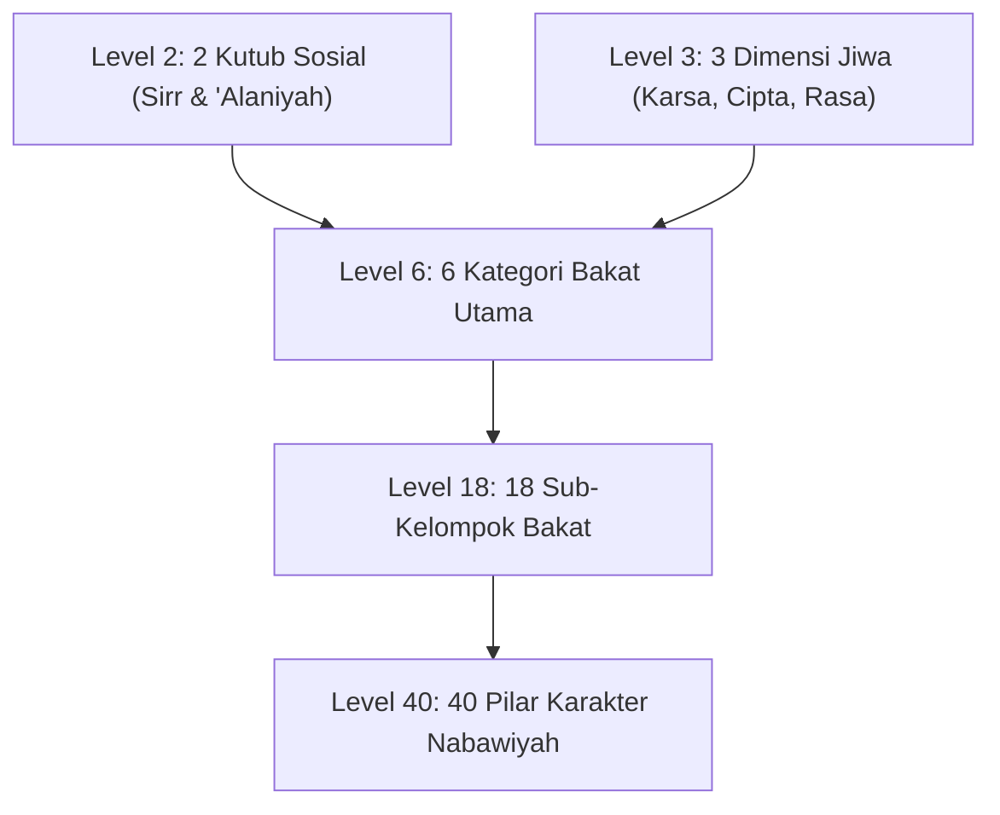

# Project Handoff: Wiki PKN (Pendidikan Karakter Nabawiyah)

Dokumen ini merangkum arsitektur teknis, riwayat pengembangan, integrasi data **Tafsir Bakat 40 (TB40)**, dan panduan pemeliharaan sistem basis pengetahuan **Wiki PKN** berbasis Quartz v5.

---

## 1. Ikhtisar Proyek & Milestone Utama

Proyek ini bertujuan mempublikasikan basis pengetahuan terstruktur **Pendidikan Karakter Nabawiyah (PKN)** dari berkas ekspor Outline ke dalam platform static site generator **Quartz v5** dengan navigasi sidebar kustom yang presisi dan konten yang kaya.

### Milestone yang Telah Diselesaikan:
1. **Navigasi Kustom `OutlineNav`**: Menggantikan komponen default Quartz `Explorer` dengan plugin `./plugins/outline-nav` yang membaca hierarki `nav_structure.json`.
2. **Fitur Inside Scrolling & State Persistence**:
   - Menerapkan tata letak flexbox dan internal scrolling (`overflow-y: auto; overscroll-behavior: contain; max-height: calc(100vh - 12rem);`) dengan scrollbar ramping.
   - Deteksi tautan aktif (`a.internal.active`) dengan pembukaan otomatis folder induk (*auto-expand parent*).
   - Pemeliharaan posisi scroll antar-halaman (*PJAX*) melalui `sessionStorage` (`outlineNavScrollTop`).
   - Pengingat status lipatan (*collapse/expand*) per folder melalui `localStorage`.
3. **Konfigurasi Resmi Quartz**: Membuat `quartz.config.yaml` dengan `pageTitle: "Wiki PKN"`, `locale: "id-ID"`, dan penonaktifan total `@quartz-community/explorer`.
4. **Pengayaan Konten Otentik (39 Berkas)**: Mentransformasi 39 berkas kerangka kosong di `content/` menjadi naskah komprehensif berbasis data `old_backup/random/`.
5. **100% Resolusi Tautan Navigasi (49 Simpul)**: Seluruh 49 simpul pada `nav_structure.json` memiliki berkas `.md` fisik yang valid (0 *unlinked leaf labels*).
6. **Ekstraksi Data TB40**: Memetakan struktur lengkap taksonomi **Tafsir Bakat 40 (TB40)** dari repositori API observasi karakter (`/home/deck/Projects/observasi-karakter-api/api-tb40-explore/api/`).
7. **Penerbitan Bank Studi Kasus Kurikulum Berbasis Peristiwa**: Menyusun dan merapikan naskah panduan restorasi karakter dengan metode 4-langkah (Tangki Cinta → Bahasa Hati → Bahasa Lisan → Bahasa Tangan) di `content/.../Pendidikan Ideal/Bank Studi Kasus.md`.
8. **Integrasi Basis Data Video Ceramah PKN (`pkn.db`)**: Mengintegrasikan repositori `sqlite-vector-video-db` (122 video ceramah Ustadz Abdul Kholiq, 1.159 bab terindeks dengan timestamp YouTube) ke dalam `old_backup/`, menghasilkan halaman `content/.../Referensi Kajian Video.md`, serta menyediakan skrip utilitas pencarian CLI `scripts/search_pkn_video.py`.
9. **Pengarsipan 117 Artikel SOTAB HEBAT (`old_backup/sotabh/`)**: Mengunduh dan mengonversi seluruh 117 artikel dari situs resmi `sotabh.com/artikel/` ke format Markdown lengkap dengan metadata frontmatter, indeks master kronologis (`old_backup/sotabh/README.md`), basis data terstruktur mentah (`articles.json`), serta skrip sinkronisasi otomatis `scripts/fetch_sotabh_articles.py`.
10. **Ekspansi Konten Berbasis Video Ceramah & Artikel SOTAB**: Memperluas secara mendalam halaman-halaman kunci wiki (`SOTABH.md`, `Luka dan Hutang Pengasuhan.md`, `Recovery.md`, `Peran Ayah dan Bunda.md`, `Perkembangan.md`, `Pembelajaran Alamiah.md`, `Bakat.md`) dengan mengintegrasikan konsep-konsep emas seperti *Pesantren sebagai SMK Jurusan Agama*, *Kemunduran 3 Tahun Anak Modern*, *Protokol 9 Tahap Menghapus Noda Hati*, *Satu Anak Satu Kurikulum*, *Prinsip Naik Turun Gas*, dan rujukan video YouTube terverifikasi.
11. **Audit Menyeluruh Kematangan Konten**: Melakukan audit kuantitatif dan kualitatif berkala terhadap seluruh berkas di `content/`, merumuskan ambang batas minimal ≥ 5.000 karakter per halaman pada [ARTICLE_AUDIT_REPORT.md](ARTICLE_AUDIT_REPORT.md).
12. **Validasi & Verifikasi Penuh Quartz v5**: Memastikan seluruh berkas Markdown lolos verifikasi sintaks dan tautan dengan hasil kompilasi bersih (`npx quartz build` sukses memproses 62 berkas dan menerbitkan 395 berkas web ke `public/`).
13. **Integrasi Korpus Hadits OpenBayan (`scripts/search_dalil_openbayan.py` & `DALIL_MAPPING.md`)**: Menghubungkan basis data SQLite `shamela_corpus.db` (60 kitab klasik) dengan normalisasi teks Arab FTS5, memetakan 42 dalil hadits berharakat lengkap dan takhrij akurat ke seluruh halaman kunci.
14. **Penerbitan Master Katalog Dalil Al-Qur'an (`QURAN_DALIL_CATALOG.md`)**: Menyusun katalog 127.508 karakter yang merangkum >110 ayat Al-Qur'an berharakat, terjemahan Kemenag RI, dan kutipan Tafsir Ibnu Katsir untuk seluruh tema wiki.
15. **Eksekusi 100% Standar Emas Konten (Batch 1–4, Sprint 1–3)**: Mentransformasi seluruh berkas Markdown hingga mencapai kepatuhan 100% (semua berkas ≥ 5.000 karakter, total 542.039 karakter, 0 defisit).
16. **Integrasi Dokumen Resmi Penggagas Manhaj**: Menyerap naskah master *Panduan Implementasi Standar PKN (A4)*, *Menumbuhkan Kesadaran Beramal (E-book)*, dan *Kaidah Implementasi PKN dalam berbagai Lembaga.md*, melahirkan artikel master baru [Kaidah Implementasi di Berbagai Lembaga.md](content/Paradigma%20-%20Implementasi%20PKN/Dokumen%20Pendidikan%20Karakter%20Nabawiyah/Paradigma%20&%20Implementasi/Implementasi/Kaidah%20&%20Elemen/Kaidah%20Implementasi%20di%20Berbagai%20Lembaga.md).
17. **Pembaruan Konfigurasi Git & Dokumentasi Root**: Mengonfigurasi `old_backup/` dan cache Python pada `.gitignore`, memperbarui `README.md`, `CONTENT_ANALYSIS.md`, `HANDOFF.md`, `ARTICLE_AUDIT_REPORT.md`, dan `CODE_OF_CONDUCT.md`.
18. **Integrasi Khazanah Spreadsheet Asesmen TB-40 & Kurikulum Lapangan**: Mengekstraksi dan menyerap data operasional dari 9 berkas spreadsheet (.xlsx) di `old_backup/App/` dan `Temu Lembaga Batch 4`. Mengintegrasikan Peta Karir Peradaban & Jurusan Studi Nyata untuk 40 pilar pada 6 sub-bakat, menyerap Tiga Gaya Belajar Fitrah Qur'ani (*Al-Fu'ad*, *As-Sam'u*, *Al-Bashar*) dan 9 Indikator Observasi Belajar pada `Belajar.md`, Tiga Modalitas Bahasa Hati (*Pelayanan*, *Perlindungan*, *Kebersamaan*) pada `Bahasa Hati.md`, Matriks 25 Aktivitas Keseharian pada `Pembelajaran Alamiah.md`, Blueprint Rapor Karakter Santri SKIS Semarang pada `4 Elemen Implementasi.md`, serta menerbitkan artikel referensi komprehensif baru [Panduan Asesmen dan Observasi TB40.md](content/Paradigma%20-%20Implementasi%20PKN/Dokumen%20Pendidikan%20Karakter%20Nabawiyah/Paradigma%20&%20Implementasi/Insan/Fitrah%20(Karakter)/Bakat/Panduan%20Asesmen%20dan%20Observasi%20TB40.md) (20.730 karakter), sehingga repositori kini memuat 63 artikel (594.601 karakter, 100% kepatuhan standar emas).
19. **Integrasi Standar Resmi Lembaga (Standar 11/2024), Instrumen RPP/Observasi, & Riset Psikospiritual Jiwa**:
    - Menyerap manual 81 halaman `Standar Implementasi PKN 11-2024 (Rev 04)` karya Abdul Kholiq & Bayu Issetyadi, menghasilkan artikel master baru [8 Standar Implementasi PKN.md](content/Paradigma%20-%20Implementasi%20PKN/Dokumen%20Pendidikan%20Karakter%20Nabawiyah/Paradigma%20&%20Implementasi/Implementasi/Kaidah%20&%20Elemen/8%20Standar%20Implementasi%20PKN.md) (21.263 karakter) yang membedah Klausul 5 s/d 13, Standar Pendewasaan (Aqil Baligh), Matriks Recovery 4 Kondisi, dan Matriks Eisenhower Nabawiyah.
    - Mengintegrasikan instrumen operasional resmi (Akademi Guru Batch 5 & Temu Lembaga Batch 4), melahirkan artikel master baru [Panduan RPP dan Observasi Lapangan.md](content/Paradigma%20-%20Implementasi%20PKN/Dokumen%20Pendidikan%20Karakter%20Nabawiyah/Paradigma%20&%20Implementasi/Implementasi/Kaidah%20&%20Elemen/Panduan%20RPP%20dan%20Observasi%20Lapangan.md) (19.716 karakter) dengan Format RPP Terpadu 3 pilar, Form Proyek, dan Kuisioner Observasi Pertumbuhan 19 Butir dengan formula Indeks Karakter.
    - Mengintegrasikan riset psikospiritual *Seminar 1: Kondisi Jiwa Anak* (119 halaman) ke dalam `Luka dan Hutang Pengasuhan.md` dan `Recovery.md` (dinamika 3 tingkat jiwa, shalat sebagai barometer jiwa, kaidah bahasa hati vs akal, tipologi anak berkehebatan khusus, dan kaidah syar'i *Tidak Menambah Luka*).
    - Mengintegrasikan naskah *Seminar 2: Tafsir Bakat TB-40* (196 halaman) ke dalam `Bakat.md` (landasan teologis *Al-Mauhibah*, syarat dawam, rukun 3A, reframing kenakalan anak, dan 3 induk bakat).
    - Mengintegrasikan kajian *Pendidikan Lestari* Prof. Dr. Iman Harymawan (77 halaman) ke dalam `Peran Guru dan Lembaga Pendidikan.md`, `Benang Merah Pendidikan.md`, dan `Syabab.md`.
    - Total repositori meningkat menjadi **65 artikel** dengan akumulasi **658.144 karakter** (rata-rata 10.125 karakter/artikel, defisit 0, 100.0% kelulusan standar emas).
20. **Integrasi Literatur Ashabur Rasul (Syaikh Mahmud Al-Mishri) & Sintesis Paripurna TB-40**:
    - Membedah kitab ensiklopedis 543 halaman *Ashabur Rasul SAW* karya Syaikh Mahmud Al-Mishri (Juz 2) dari `old_backup/Campur/Noor-Book.com  أصحاب الرسول 5 .pdf` serta melakukan *cross-reference* terhadap korpus turats Islam di OpenBayan (*Siyar A'lam An-Nubala*, *Ath-Tabaqat Al-Kubra*, *Al-Ishabah*, *Hilyatul Awliya'*, *Rijal Hawla Ar-Rasul*, *Shuwar min Hayatish Shahabah*).
    - Memperkaya artikel master [Bakat.md](content/Paradigma%20-%20Implementasi%20PKN/Dokumen%20Pendidikan%20Karakter%20Nabawiyah/Paradigma%20&%20Implementasi/Insan/Fitrah%20(Karakter)/Bakat.md) (kini 24.487 karakter) dengan Matriks Akbar 40 Pilar TB-40 vs. Tokoh Sahabat Teladan (*Archetype Matrix*) dan kaidah pedagogi *Storytelling Sirah Sahabat* berbasis profil dominansi anak.
    - Menyempurnakan dan menuntaskan 6 artikel rumpun bakat: [Memerintah.md](content/Paradigma%20-%20Implementasi%20PKN/Dokumen%20Pendidikan%20Karakter%20Nabawiyah/Paradigma%20&%20Implementasi/Insan/Fitrah%20(Karakter)/Bakat/Memerintah.md) (19.673 karakter), [Berpikir.md](content/Paradigma%20-%20Implementasi%20PKN/Dokumen%20Pendidikan%20Karakter%20Nabawiyah/Paradigma%20&%20Implementasi/Insan/Fitrah%20(Karakter)/Bakat/Berpikir.md) (19.015 karakter), [Berperasaan.md](content/Paradigma%20-%20Implementasi%20PKN/Dokumen%20Pendidikan%20Karakter%20Nabawiyah/Paradigma%20&%20Implementasi/Insan/Fitrah%20(Karakter)/Bakat/Berperasaan.md) (18.736 karakter), [Melayani.md](content/Paradigma%20-%20Implementasi%20PKN/Dokumen%20Pendidikan%20Karakter%20Nabawiyah/Paradigma%20&%20Implementasi/Insan/Fitrah%20(Karakter)/Bakat/Melayani.md) (22.042 karakter), [Bekerja Keras.md](content/Paradigma%20-%20Implementasi%20PKN/Dokumen%20Pendidikan%20Karakter%20Nabawiyah/Paradigma%20&%20Implementasi/Insan/Fitrah%20(Karakter)/Bakat/Bekerja%20Keras.md) (19.800 karakter), dan [Bekerja Sama.md](content/Paradigma%20-%20Implementasi%20PKN/Dokumen%20Pendidikan%20Karakter%20Nabawiyah/Paradigma%20&%20Implementasi/Insan/Fitrah%20(Karakter)/Bakat/Bekerja%20Sama.md) (20.749 karakter).
    - Mengisi 100% baris tabel yang sebelumnya kosong (Karakter Inti, Profesi Peradaban, Jurusan Studi) dari sumber otentik instrumen TB-40, membersihkan seluruh placeholder stub, serta menambahkan telaah mendalam *Keteladanan Ashabus Rasul (Archetype Fitrah & Pola Asuh Nabawi)*.
    - Total akumulasi konten ensiklopedia meningkat pesat menjadi **694.226 karakter** pada **65 artikel** (rata-rata 10.680 karakter/artikel, 0 defisit, 100.0% kelulusan standar emas).
21. **Transformasi Arsitektur Halaman Navigasi & Hub PKN (Solusi Halaman Navigasi Kosong)**:
    - Menyelesaikan permasalahan halaman navigasi kosong pada Quartz v5 di mana pengguna yang mengklik folder di navigasi (misal `Insan`, `Fitrah (Karakter)`, `Pembagian Jiwa`, `Pendidikan Ideal`, dll.) dimuatkan *virtual folder page* kosong (0 byte konten markdown).
    - Menyatukan 14 berkas sibling `.md` menjadi berkas `index.md` di dalam direktori masing-masing sehingga Quartz merender konten artikel utuh pada halaman folder index.
    - Memperbaiki logika resolusi tautan pendek pada `@quartz-community/crawl-links` dan `@quartz-community/utils` agar seluruh wikilink (`[[Insan]]`, `[[Bakat]]`, `[[Fitrah (Karakter)]]`, dll.) otomatis menyelesaikan ke URL folder index (`.../<folder>/`) tanpa menghasilkan tautan 404.
    - Mentransformasi `Insan/index.md` menjadi **Grand Navigation Hub / Map of Content (MOC)** berbobot 18.611 karakter dengan sintesis epistemologi, matriks kartu navigasi visual sub-pilar, alur kurikuler 5 langkah, tabel diagnosa lapangan, dan rubrik refleksi pendidik.
    - Menerbitkan berkas `index.md` baru berstandar emas ($\ge 5.000$ karakter) untuk folder-folder yang sebelumnya kosong: `Kaidah & Elemen/index.md` (5.950 chars), `Peran & Tanggung Jawab/index.md` (5.081 chars), `Internal & Eksternal/index.md` (5.804 chars), `Renungan/index.md` (5.100 chars), dan `Paradigma - Implementasi PKN/index.md` (5.200 chars).
    - Repositori kini memiliki **67 berkas artikel**, **716.180 karakter akumulatif**, rata-rata 10.689 karakter/artikel, **0 defisit**, dan **100% kelulusan standar emas**.
22. **Kutipan Khusus TL;DR Praktek PKN di Beranda Utama (`content/index.md`)**:
    - Menambahkan dan merestrukturisasi kutipan khusus *Executive TL;DR Callout* (`> [!summary]`) di halaman beranda utama dengan mengedepankan **Tujuan Utama: Menumbuhkan Kesadaran (*Bukan Sekadar Kepatuhan Semu*)** dan **Empat Tahapan Praktik Berurutan**:
      1. *Memperbaiki Diri dan Menjadi Teladan dalam Memberikan Persepsi Positif*: Memulai dari diri sendiri (*ibda' binafsik*, *tazkiyatun nafs*), keteladanan nyata (*qudwah hasanah*), dan pandangan kemuliaan fitrah (*husnuzhan*) tanpa celaan/labeling negatif.
      2. *Menyesuaikan Ekspektasi dan Menggunakan Metode Sesuai Fase*: Penyelarasan ekspektasi (*wasathiyah*) serta ketepatan instrumen bahasa sesuai etape usia ([[Thufulah]] - [[Bahasa Hati]], [[Tamyiz]] - [[Bahasa Lisan]], [[Murahaqah]] - [[Bahasa Tangan]]).
      3. *Fokus Menguatkan Kelebihan dalam Bakat, Niscaya Kelemahan akan Membaik Perlahan*: Formula Rukun 3A (*Alami, Acuhkan kelemahan minor, Asah kekuatan dominan*) dari 40 pilar [[Bakat]], di mana fokus mengasah potensi utama akan menumbuhkan kematangan jiwa yang mengangkat kelemahan secara bertahap (*tazkiyah bil 'amal*).
      4. *Implementasikan Secara Bertahap dari yang Mudah dari Kondisi yang Ada*: Kaidah kemudahan (*taisir*) dan pentahapan (*tadarruj*), langsung dieksekusi melalui kebiasaan mikro harian oleh Orang Tua (shalat tepat waktu, meja makan peradaban, al-khidmah), Pendidik (pembelajaran alamiah & apresiasi proses), dan Lembaga (mitra pendukung & lingkungan aman bebas perundungan).
23. **Transformasi Dalil Utama Beranda PKN (`content/index.md`)**:
    - Mengganti dalil metafora pohon (QS. Ibrahim: 24–25) dengan **Dua Dalil Utama Operasional Manhaj PKN**:
      1. *Dalil Perintah Shalat (HR. Abu Dawud 495, Ahmad 6689, Al-Hakim 1/197)*: Sebagai barometer fitrah dan penahapan usia (*at-tadarruj*) 0–7 tahun ([[Thufulah]] - tangki cinta & teladan), 7–10 tahun ([[Tamyiz]] - 5.000x pembiasaan shalat tanpa kekerasan), dan 10–15 tahun ([[Murahaqah]] - disiplin ketegasan ta'dib & pemisahan tempat tidur menuju [[Syabab]]).
      2. *Dalil Mengubah Kemungkaran dengan Tangan, Lisan, dan Hati (HR. Muslim 49)*: Sebagai fondasi hierarki Tiga Bahasa Pengasuhan ([[Metode Mendidik]]) yang menempatkan [[Bahasa Hati]] sebagai pondasi kelekatan jiwa, [[Bahasa Lisan]] sebagai dialog nalar hikmah (*qaulan sadida*), dan [[Bahasa Tangan]] sebagai otoritas ketegasan protektif ([[Batas Toleransi]] & [[Imunitas Sosial]]).
    - Halaman [content/index.md](file:///home/abuhafi/Project/wiki-pkn/content/index.md) kini memuat **15.560 karakter**, membawa akumulasi total ensiklopedia menjadi **723.095 karakter** di seluruh **67 artikel** (100% kepatuhan standar emas $\ge 5.000$ karakter, 0 defisit).
24. **Sintesis Executive TL;DR Callout Tahapan Kesadaran (`content/index.md`)**:
    - Menyempurnakan ringkasan eksekutif beranda dengan menekankan hierarki pembangunan jiwa: *Kesadaran Batin* mendahului *Kepatuhan Lahiriah*.
    - Memetakan 4 etape sekuensial (Teladan Persepsi Positif → Sinkronisasi Ekspektasi Etape Usia → Fokus Penguatan Bakat / Rukun 3A → Implementasi Gradual Taisir & Tadarruj).
25. **Migrasi Master Katalog Dalil Al-Qur'an & Hadits ke Halaman Native Quartz (`content/`)**:
    - Mentransformasikan `QURAN_DALIL_CATALOG.md` menjadi artikel native Quartz [Master Katalog Dalil Al-Qur'an.md](content/Master%20Katalog%20Dalil%20Al-Qur'an.md) (165.253 karakter) lengkap dengan takhrij Tafsir Ibnu Katsir dan navigasi tema.
    - Mentransformasikan `DALIL_MAPPING.md` menjadi artikel native Quartz [Master Katalog Dalil Hadits dan Sunnah.md](content/Master%20Katalog%20Dalil%20Hadits%20dan%20Sunnah.md) (42.946 karakter) dengan takhrij 60 kitab korpus OpenBayan.
    - Menjadikan total ensiklopedia memuat **72 berkas artikel** dengan akumulasi **953.300 karakter** berstandar emas 100%.
26. **Integrasi Ekosistem Web Interaktif TB40 (`pub.insantaqwa.org/bakat`)**:
    - Mengintegrasikan tautan langsung ke aplikasi web interaktif *Peta Bakat & Sifat Manusia* (`https://pub.insantaqwa.org/bakat/`) pada titik-titik krusial wiki: *Beranda*, *Hub Bakat*, *Panduan Asesmen dan Observasi TB40*, dan *Kuisioner Asesmen 40 Bakat Nabawiyah*.
    - Memfasilitasi pengguna untuk melakukan asesmen mandiri online, simulasi perankingan 40 pilar, dan melihat peta polarisasi sifat secara dinamis.
27. **Dukungan Deployment Portainer Stack Git & Parameterisasi Environment (`DOMAIN` & `PORT`)**:
    - Menyediakan dukungan penuh deployment otomatis menggunakan fitur **Portainer Stack (Repository/Git)**.
    - Mengonfigurasi variabel lingkungan dinamis: `DOMAIN` (sanitasi otomatis protocol/trailing slash untuk baseUrl, OpenGraph, dan sitemap) serta `PORT` (port HTTP server Quartz).
    - Membangun `docker-compose.yml`, optimasi `Dockerfile` multi-stage berbasis `node:22-slim` dengan dependensi `git` terpasang di runtime, skrip `docker-entrypoint.sh`, `.dockerignore` untuk eksklusi berkas raksasa (`old_backup/` 2.6GB, `searchable_pdfs/` 925MB), template `.env.example`, serta panduan deployment resmi di [README.md](file:///home/abuhafi/Project/wiki-pkn/README.md).
28. **Injeksi Banner Metodologi AI & Kontributor, Audit Inventaris Slide Presentasi (145 Berkas), dan Sitasi Slide Dropbox**:
    - **Banner Metodologi 100% Terinjeksi:** Menulis dan mengeksekusi `scripts/inject_page_disclaimer.py` yang menyisipkan banner callout resmi metodologi AI, OpenBayan, dan kontributor (Himmatul Ummah, Insan Taqwa/Mustaqbal, Tim SOTAB) tepat di bawah judul utama H1 pada seluruh **72 berkas markdown** di `content/`.
    - **Laporan Audit Presentasi Komprehensif:** Menulis dan mengeksekusi `scripts/generate_presentation_audit.py` untuk mengaudit seluruh 86 berkas PDF dan 59 berkas PPTX di `old_backup/` (total 145 berkas), menghasilkan dokumen resmi [PRESENTATION_AUDIT_REPORT.md](PRESENTATION_AUDIT_REPORT.md) lengkap dengan jumlah halaman, ukuran berkas, dan tautan direct download (`dl=1`) serta browser preview (`dl=0`).
    - **Sitasi Slide dan Integrasi Tautan Dropbox:** Menulis dan mengeksekusi `scripts/inject_presentation_citations.py` untuk menyematkan blok rujukan slide resmi PKN (`> [!quote] Dokumen & Slide Presentasi Rujukan Resmi PKN`) pada **51 artikel wiki**, memetakan slide spesifik dari materi kunci (TB-40, Seminar 1, Seminar 2, Kurikulum 40 Pilar, Metode PKN, Pembelajaran Berbasis Projek, Implementasi Persekolahan) dengan tombol akses langsung PDF dan PPTX asli.
29. **Ekspor Diagram Slide Presentasi PDF & Pemotongan Horizontal Banner 350px (`content/assets/`)**:
    - **Banner Horizontal 350px:** Menulis dan mengeksekusi `scripts/generate_horizontal_banners.py` untuk memproses seluruh 40 foto di `old_backup/Gambar/` menjadi horizontal banner berukuran presisi $1050 \times 350$ px (tinggi pas 350px, rasio $3:1$) dalam format WebP optimal (kualitas 85%, total hanya 1.1 MB untuk seluruh 40 banner) di `content/assets/banners/`.
    - **Ekspor Slide Presentasi Kunci:** Menulis dan mengeksekusi `scripts/export_presentation_slides.py` menggunakan `pdftoppm` dan PIL untuk mengekspor 29 slide diagram, bagan, dan tabel paling berharga dari PDF resmi materi tayang PKN ke `content/assets/slides/` dalam format WebP berkualitas tinggi.
    - **Injeksi Gambar ke Artikel:** Menulis dan mengeksekusi `scripts/inject_images_to_articles.py` yang menyisipkan horizontal banner di 72 artikel dan 46 penyematan slide diagram rujukan di sub-bab yang relevan, lengkap dengan takarir penjelas yang elegan.
    - **Kompilasi Sukses Quartz:** `npx quartz build` sukses memproses 72 berkas markdown dan menerbitkan 527 berkas web statis ke `public/` dengan 0 error.

---

## 2. Arsitektur Data TB40 (Tafsir Bakat 40)

Data model TB40 diekstraksi dari spesifikasi OpenAPI dan berkas kalkulasi engine di `/home/deck/Projects/observasi-karakter-api/api-tb40-explore/api/` (`v0.1/tb40/calculation.json` dan `v0.3/tb40/result.json`). Sistem ini memiliki hierarki bertingkat 5 level:



### A. Level 2 — Kutub Sosial (Energi Interaksi)
* **1. Introvert (*As-Sirr*):** Energi batin, fokus ke dalam, tidak mengutamakan keramaian.
* **2. Extrovert (*Al-'Alaniyah*):** Energi luar, ekspresif, senang berinteraksi sosial.

### B. Level 3 — Dimensi Kemanusiaan & Trilogi Jiwa
1. **Karsa (*Al-Hawa* / Jiwa Ammarah):**
   - Karakteristik: Bergerak, bersemangat, dorongan fisik.
   - Gaya Belajar: **Al-Fuad / Kinestetik** (bergerak, menyentuh, praktik lapangan).
   - Bahasa Hati Utama: **Bahasa Pelayanan (*Acts of Service*)**.
2. **Cipta (*Al-'Aql* / Jiwa Lawwamah):**
   - Karakteristik: Berpikir, nalar evaluatif, menimbang baik-buruk.
   - Gaya Belajar: **Al-Bashar / Visual** (membaca, melihat bagan/diagram, ruangan terang).
   - Bahasa Hati Utama: **Bahasa Kebersamaan (*Quality Time*)**.
3. **Rasa (*Al-Qalb* / Jiwa Muthmainnah):**
   - Karakteristik: Berperasaan, kepekaan nurani, spiritualitas batin.
   - Gaya Belajar: **As-Sam'u / Auditori** (mendengarkan nasihat, berdiskusi, suasana hening).
   - Bahasa Hati Utama: **Bahasa Perlindungan / Hadiah (*Receiving Gifts / Protection*)**.

### C. Level 6 — Matriks 6 Kategori Bakat Utama
Persilangan antara Level 2 (Kutub Sosial) dan Level 3 (Dimensi Jiwa) menghasilkan 6 kategori bakat pokok:
1. **Bekerja Keras (الحَمَاسَة - *Al-Hamasah*):** Introvert + Karsa (Ammarah)
2. **Berpikir / Cerdas (التَّفْكِيْر - *At-Tafkir*):** Introvert + Cipta (Lawwamah)
3. **Berperasaan (الشُعُوْر - *Asy-Syu'ur*):** Introvert + Rasa (Muthmainnah)
4. **Mempengaruhi / Memerintah (التَّأْثِيْر - *At-Ta'tsir*):** Extrovert + Karsa (Ammarah)
5. **Bekerjasama (التَّعَامُل - *At-Ta'amul*):** Extrovert + Cipta (Lawwamah)
6. **Melayani (الخِدْمَة - *Al-Khidmah*):** Extrovert + Rasa (Muthmainnah)

### D. Level 18 — 18 Sub-Kelompok Bakat
* **Bekerja Keras:** Berambisi, Berwibawa, Giat bekerja.
* **Berpikir:** Suka berpikir imajinatif, Suka berpikir positif, Suka berpikir analitis.
* **Berperasaan:** Suka apa adanya, Pendiam, Suka merendah.
* **Mempengaruhi:** Suka menguasai, Suka memotivasi, Suka menolong.
* **Bekerjasama:** Suka menggunakan hubungan yang ada, Suka membuat hubungan baru, Suka mengeratkan hubungan yang ada.
* **Melayani:** Suka melayani dengan cara memberi, Suka melayani dengan cara menjaga, Suka melayani dengan cara mengalah.

### E. Level 40 — 40 Pilar Karakter Nabawiyah
Daftar lengkap 40 pilar dengan nama Arab, nomor urut, dan garis silsilahnya:
* **Grup Bekerja Keras (1-6):** #1 *Himmah* (الهِمَّة), #2 *Ihsaan* (الاِحْسَان), #3 *‘Izzah* (العِزَّة), #4 *Waqaar* (الوَقَار), #5 *‘Aziimah* (العَزِيمَة), #6 *Nasyaath* (النَّشَاط).
* **Grup Berpikir (7-11):** #7 *Firaasah* (الفِرَاسَة), #8 *Nubl* (النُّبْل), #9 *Husnuzhan* (حُسْنُ الظَّن), #10 *Dzakaa’* (الذَّكَاء), #11 *Hikmah* (الحِكْمَة).
* **Grup Berperasaan (12-17):** #12 *Shidq* (الصِّدْق), #13 *‘Iffah* (العِفَّة), #14 *Shamt* (الصَّمْت), #15 *Hayaa’* (الحَيَاء), #16 *Qanaa'ah* (القَنَاعَة), #17 *Tawaadhu'* (التَّوَاضُع).
* **Grup Mempengaruhi (18-24):** #18 *Syajaa’ah* (الشَّجَاعَة), #19 *Ghairah* (الغَيْرَة), #20 *Munaafasah* (المُنَافَسَة), #21 *Nashiihah* (النَّصِيْحَة), #22 *Fashaahah* (الفَصَاحَة), #23 *Nushrah* (النُّصْرَة), #24 *Juud* (الجُوْد).
* **Grup Bekerjasama (25-32):** #25 *Ta'aawun* (التَّعَاوُن), #26 *Ulfah* (الاُلْفَة), #27 *‘Adaalah* (العَدَالَة), #28 *Wafaa'* (الوَفَاء), #29 *Muzaah* (المُزَاح), #30 *Basyaasyah* (البَشَاشَة), #31 *Rifq* (الرِّفْق), #32 *Mahabbah* (المَحَبَّة).
* **Grup Melayani (33-40):** #33 *Rahmah* (الرَّحْمَة), #34 *Itsaar* (الاِيْثَار), #35 *Kitmaanus sirr* (كِتْمَانُ السِّرِّ), #36 *Satr* (السَّتْر), #37 *Amaanah* (الاَمَانَة), #38 *Anaah* (الاَنَاة), #39 *Hilm* (الحِلْم), #40 *Shabr* (الصَّبْر).

### F. Matriks Kondisi Ekstrim (*Tafrith* vs *Ifrath*) & Solusi Kuratif
Setiap sifat mulia berada di antara dua jurang ekstrem (*tafrith* / lalai dan *ifrath* / berlebih):
* **Bekerja Keras:**
  - *Lalai:* **Kasal (Malas)** $\rightarrow$ Solusi: Kuatkan *‘Aziimah* dan *Amaanah*.
  - *Lebih:* **Thama' (Serakah/Ambisi Buta)** $\rightarrow$ Solusi: Kuatkan *Qanaa'ah* dan *Tawaadhu'*.
* **Berpikir:**
  - *Lalai:* **Jahl (Kebodohan / Abaikan Nalar)** $\rightarrow$ Solusi: Kuatkan *Dzakaa'* dan *Hikmah*.
  - *Lebih:* **Ahlu Ra'yi (Pemuja Akal / Rasionalisme Kering)** $\rightarrow$ Solusi: Kuatkan *Hikmah*, *Tawaadhu'*, dan *Hayaa'*.
* **Berperasaan:**
  - *Lalai:* **Kibr / Kasar** $\rightarrow$ Solusi: Kuatkan kepekaan hati dan *Tawaadhu'*.
  - *Lebih:* **Minder (Rendah Diri) & Hazan (Sedih Berlarut)** $\rightarrow$ Solusi: Kuatkan *Syajaa'ah*, *Ghairah*, dan *Nasyaath*.
* **Mempengaruhi:**
  - *Lalai:* **Jubn (Penakut)** $\rightarrow$ Solusi: Kuatkan *Syajaa'ah*, *Ghairah*, dan *Munaafasah*.
  - *Lebih:* **Tahawwur (Ceroboh / Otoriter)** $\rightarrow$ Solusi: Kuatkan *Shabr*, *Hilm*, dan *Anaah*.
* **Bekerjasama:**
  - *Lalai:* **‘Udwaan (Bermusuhan / Menutup Diri)** $\rightarrow$ Solusi: Kuatkan *Ta'aawun*, *Ulfah*, dan *‘Adaalah*.
  - *Lebih:* **Dzull / Bimbang Mengambil Keputusan** $\rightarrow$ Solusi: Kuatkan *Syajaa'ah* dan *Ghairah*.
* **Melayani:**
  - *Lalai:* **Ghilzhah (Kasar / Tidak Peduli)** $\rightarrow$ Solusi: Kuatkan *Rahmah*, *Itsaar*, dan *Hilm*.
  - *Lebih:* **Taqliid (Kepatuhan Buta) / Takut Berlebih** $\rightarrow$ Solusi: Kuatkan *‘Izzah* dan *Waqaar*.

### G. Spesifikasi Teknis Engine API TB40
Sumber data berada di `/home/deck/Projects/observasi-karakter-api/api-tb40-explore/api/`:
* **Struktur Versi:**
  - `v0.1`: Single-pass calculation engine (`calculation.json`), generator pelaporan visual (`tb40.svg`, `tb40byRank.svg`), dan kuesioner flat 40 butir pertanyaan (`questions.json`).
  - `v0.2`: Pengenalan segmentasi pertanyaan bertingkat (*tiered questionnaire*).
  - `v0.3`: OpenAPI 3.0 penuh (`swagger.yaml`) dengan alur **Asesmen Adaptif 4-Tier**:
    - **Tier 1 (Energi Sosial - 1Q):** Menentukan Kutub Introvert vs Extrovert.
    - **Tier 2 (Orientasi Jiwa - 1Q):** Menentukan Trilogi Jiwa (Karsa / Cipta / Rasa) $\rightarrow$ menghasilkan kluster Level 6.
    - **Tier 3 (Pendalaman 18 Sub-Kelompok - 18Q):** Memetakan kekuatan spesifik pada 18 sub-kelompok.
    - **Tier 4 (Presisi 40 Pilar - 40Q):** Pengukuran mendalam terhadap seluruh 40 pilar karakter nabawiyah.
  - **Dua Varian Instrumen:**
    - `tb40Dewasa`: Kuesioner refleksi diri mandiri (40 butir pertanyaan terstandar).
    - `tb40Anak`: Kuesioner observasi anak berbasis studi kasus aktivitas bermain dan keseharian (bahasa ramah anak / observasi orang tua).
  - **Fitur API v0.3:** *Continuous scoring*, *Halfway reporting* (laporan parsial saat baru menyelesaikan Tier 2/3), integrasi peringatan dini (*ego warning*, *lalai warnings*, *lebih warnings*), serta rekomendasi profil karir (`recommended_profesi`) dan rumpun ilmu (`recommended_jurusan`).

---

## 3. Struktur Berkas & Komponen Utama

```
wiki-pkn/
├── content/                                # Naskah Markdown (61 berkas halaman wiki)
│   ├── index.md                            # Beranda Wiki PKN
│   ├── Renungan/                           # Catatan renungan orang tua
│   └── Paradigma - Implementasi PKN/       # Konten utama kurikulum PKN
│       └── Dokumen Pendidikan Karakter Nabawiyah/
│           ├── FAQ Ringkas.md
│           ├── Referensi Kajian Video.md   # Indeks master video ceramah Ustadz Abdul Kholiq
│           └── Paradigma & Implementasi/
│               ├── Insan/                  # Jiwa, Fitrah, 6 Bakat, 4 Fase Usia
│               ├── Pendidikan Ideal/       # Metode Mendidik, 3 Bahasa, Bank Studi Kasus, Pemulihan
│               └── Implementasi/           # Kaidah, Elemen, Peran Ayah/Bunda/Guru
├── old_backup/                             # Sumber data & arsip referensi
│   ├── random/                             # Naskah mentah ekspor Outline & Bank Studi Kasus
│   ├── sotabh/                             # 117 naskah artikel SOTAB HEBAT + articles.json
│   └── sqlite-vector-video-db/             # Basis data pkn.db (122 video, 1.159 bab)
├── plugins/
│   └── outline-nav/                        # Plugin Quartz untuk Navigasi Outline
│       ├── package.json
│       ├── tsup.config.ts
│       └── src/components/OutlineNav.tsx   # Komponen utama sidebar & script
├── scripts/
│   ├── fetch_sotabh_articles.py            # Skrip sinkronisasi 117 artikel SOTAB
│   ├── generate_video_reference.py         # Skrip pembuatan halaman Referensi Kajian Video
│   ├── search_pkn_video.py                 # Utilitas CLI pencarian timestamp video pkn.db
│   └── migration/                          # Skrip migrasi dan pengayaan arsip
├── nav_structure.json                      # Sumber kebenaran struktur navigasi (49 simpul)
├── quartz.config.yaml                      # Konfigurasi aktif Quartz v5
├── CONTENT_ANALYSIS.md                     # Analisis celah konten, master TB40 & audit 61 berkas
└── HANDOFF.md                              # Dokumen serah terima ini
```

---

## 4. Alur Kerja Pengembangan (Workflow)

### Mengedit Plugin `OutlineNav`:
1. Ubah berkas `plugins/outline-nav/src/components/OutlineNav.tsx`.
2. Kompilasi ulang plugin:
   ```bash
   cd plugins/outline-nav
   npm run build
   cd ../..
   ```
3. Restart server Quartz jika sedang berjalan:
   ```bash
   npx quartz build --serve --port 8888
   ```

### Menambahkan atau Mengubah Konten:
1. Pastikan setiap berkas `.md` memiliki metadata `title` pada frontmatter:
   ```yaml
   ---
   title: "Judul Halaman"
   ---
   ```
2. Jika ingin halaman tersebut muncul di sidebar navigasi, daftarkan judulnya ke dalam `nav_structure.json`.

---

## 5. Rencana Pengembangan Selanjutnya (Roadmap & Actionable TODOs)

### A. Agenda Prioritas Utama (Top Priorities)

#### 📌 TODO 1: Peninjauan Ulang Menyeluruh Seluruh Dokumen di `old_backup/` (Fokus: PDF & PPTX) `[SELESAI - Milestone 28]`
* **Status:** Selesai via `scripts/generate_presentation_audit.py` dan diterbitkan di [PRESENTATION_AUDIT_REPORT.md](PRESENTATION_AUDIT_REPORT.md).
* **Objektif:** Melakukan audit konten dan ekstraksi konsep secara menyeluruh terhadap seluruh berkas presentasi (.pdf dan .pptx) yang tersimpan di `old_backup/` agar tidak ada konsep kunci, bagan alur, tabel instrumen, dan studi kasus orisinal yang tertinggal.
* **Cakupan Direktori Rujukan Utama:**
  1. `old_backup/Akademi Guru Batch 3/` (16 berkas):
     - `1. 40 PILAR KARAKTER diurai dalam KURIKULUM.pdf` & `.pptx` (7.9 MB / 8.8 MB)
     - `2. BAKAT - TB - 40.pdf` & `.pptx` (11.2 MB / 8.0 MB)
     - `3. PEMBELAJARAN BERBASIS PROJEK.pdf` & `.pptx` (3.8 MB / 27.7 MB)
     - `4. METODE PENDIDIKAN KARAKTER NABAWIYAH.pdf` & `.pptx` (10.8 MB / 24.9 MB)
     - `5. Menyibak Pondasi Pendidikan Yang Tak Tersentuh.pdf` & `.pptx` (6.5 MB / 8.4 MB)
     - `6. Implementasi Kurikulum PKN Pada Persekolahan.pdf` & `.pptx` (1.9 MB / 501 KB)
     - `7. Evaluasi Pendidikan Karakter Nabawiyah.pdf` (2.5 MB)
  2. `old_backup/Akademi Guru Batch 5/` (15 berkas presentasi & modul pendidik):
     - `1. KONSEP DASAR PENDIDIKAN KARAKTER NABAWIYAH.pptx` (34.0 MB)
     - `2. KONDISI JIWA (RUMAH & SEKOLAH).pptx` (29.1 MB)
     - `3. FITRAH BAKAT.pptx` (14.2 MB)
     - `4. METODE PENDIDIKAN KARAKTER NABAWIYAH.pptx` (24.9 MB)
     - `5. MENYIBAK PONDASI PENDIDIKAN YANG TAK TERSENTUH.pptx` (27.6 MB)
     - `6. IMPLEMENTASI KURIKULUM PKN DI PERSEKOLAHAN.pptx` (37.7 MB)
  3. `old_backup/Temu Lembaga Batch 4/` (23 berkas instrumen & panduan manajerial):
     - `1. Kebijakan Implementasi PKN.pptx` (2.2 MB)
     - `2. Tahapan Implementasi PKN.pptx` (12.3 MB)
     - `3. Format RPP Berbasis PKN.docx` & instrumen observasi guru
  4. `old_backup/Materi Seminar & Workshop PKN (Kupas Tuntas Tafsir Bakat)/`:
     - `Seminar 1 - Memahami Kondisi Jiwa Anak.pdf` (119 halaman)
     - `Seminar 2 - Kupas Tuntas TB40.pdf` (196 halaman)
  5. Sub-folder tematik: `Observasi Bakat/`, `Parenting/`, `Remaja/`, `Standar Implementasi/`, dan `Tema/`.
* **Rencana Aksi & Realisasi:**
  - 145 berkas presentasi telah diaudit lengkap dengan jumlah halaman, ukuran berkas, dan status tautan Dropbox.

---

#### 📌 TODO 2: Sitasi Halaman Presentasi PDF & Integrasi Tautan Unduh Dropbox (PDF & PPTX) `[SELESAI - Milestone 28]`
* **Status:** Selesai via `scripts/inject_presentation_citations.py` (51 file terinjeksi callout rujukan resmi).
* **Objektif:** Memperkaya naskah wiki dengan kutipan halaman/slide spesifik dari berkas presentasi rujukan, disertai tautan langsung (*direct download link*) dan tautan pratinjau (*view link*) ke repositori resmi Dropbox.
* **Format Penulisan Sitasi yang Distandarkan:**
  - Ditambahkan callout kutipan rujukan pada sub-bab artikel yang relevan:
    ```markdown
    > [!quote] Dokumen & Slide Presentasi Rujukan Resmi PKN
    > **Materi:** *4. METODE PENDIDIKAN KARAKTER NABAWIYAH* (Slide Hal. 15–22)  
    > **Unduh Dokumen:** [📥 Unduh PDF (10.8 MB)](https://www.dropbox.com/scl/fi/...dl=1) • [📊 Unduh PPTX Asli (24.9 MB)](https://www.dropbox.com/scl/fi/...dl=1) • [👁️ Buka di Dropbox](https://www.dropbox.com/scl/fi/...dl=0)
    ```
* **Katalog Master Sumber Tautan:**
  - Berbasis pada `dropbox_links_cache.json` dan `dropbox_files.md` dengan tautan dual mode: direct download (`dl=1`) dan browser view (`dl=0`).

---

#### 📌 TODO 3: Banner Keterangan Resmi Sumber AI & Kontributor di Bagian Paling Atas Setiap Halaman `[SELESAI - Milestone 28]`
* **Status:** Selesai via `scripts/inject_page_disclaimer.py` (100% / 72 berkas terinjeksi).
* **Objektif:** Menjaga transparansi intelektual, etika penulisan, dan amanah ilmiah dakwah dengan mencantumkan keterangan metodologis yang seragam di bagian paling atas (tepat setelah judul/frontmatter) pada **seluruh 72 halaman artikel wiki** di `content/`.
* **Rumusan Redaksional Resmi yang Digunakan:**
  ```markdown
  > [!note] Catatan Metodologi & Sumber Penyusunan Dokumen
  > Dokumen ini merupakan hasil rangkuman dan rekonstruksi berbantuan kecerdasan buatan (AI) dari berbagai materi presentasi, modul kurikulum, dokumen standar lembaga, dan rekaman kajian **Pendidikan Karakter Nabawiyah (PKN)** yang diampu oleh **Ustadz Abdul Kholiq**.  
  > 
  > Naskah ini telah melalui verifikasi dan pengayaan ulang dalil-dalil Al-Qur'an dan Hadits shahih dari korpus **OpenBayan** (60 kitab klasik), serta diperkaya dengan sintesis intisari dan masukan berharga dari kawan-kawan **Himmatul Ummah**, **Insan Taqwa / Mustaqbal**, dan **Tim SOTAB HEBAT**.
  ```
* **Rencana Aksi:**
  - Buat skrip automasi (`scripts/inject_page_disclaimer.py`) untuk menyisipkan callout keterangan ini ke seluruh 72 berkas `.md` di `content/` secara presisi tanpa merusak metadata frontmatter YAML maupun struktur heading `#`.
  - Pastikan halaman folder index (`*/index.md`) dan halaman reguler memiliki penempatan banner yang rapi, elegan, dan konsisten.

---

### B. Agenda Pengembangan Sekunder (Secondary Roadmap)

1. **Pengembangan Halaman Profil Individual 40 Pilar TB40:**
   - Membangun direktori khusus untuk ke-40 pilar karakter nabawiyah dengan profil komprehensif: definisi lughawi & syar'i, dalil Al-Qur'an & Hadits, indikator perilaku anak, instrumen observasi orang tua, pemetaan karir peradaban, dan tokoh sahabat teladan (*archetype*).
2. **Paket Instrumen Siap Cetak (Piagam Akil Baligh & Observasi Lapangan):**
   - Menyediakan berkas templat cetak A4/PDF siap unduh untuk Piagam Ikrar Akil Baligh, Lembar Observasi Mandiri Harian, dan Rapor Karakter Santri.
3. **Diagram Visual Interaktif (Mermaid & SVG):**
   - Memperbanyak visualisasi bagan kausalitas amal, pohon fitrah, dan matriks polarisasi bakat pada artikel-artikel hub level atas (*Insan*, *Pendidikan Ideal*, *Implementasi*).


