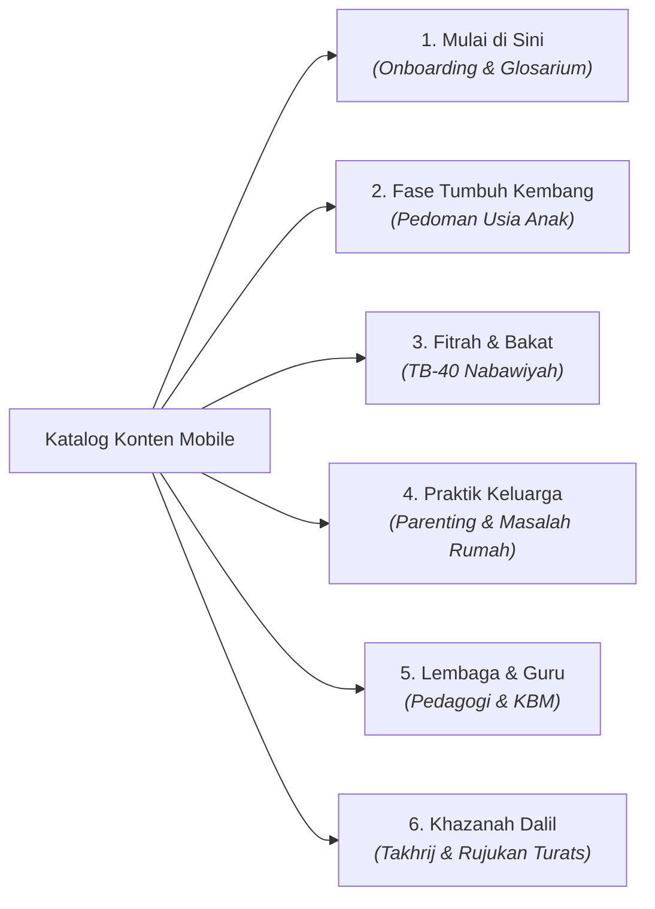
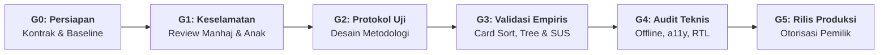

# 📱 Blueprint & Ide Pengembangan Aplikasi Mobile PKN
## *(Pendidikan Karakter Nabawiyah & Tafsir Bakat 40 Mobile App)*

Dokumen ini menyusun konsep arsitektur, spesifikasi fitur, pemetaan kebutuhan pengguna, model data, protokol validasi empiris, dan peta jalan (*roadmap*) pengembangan **Aplikasi Mobile Berbasis Pendidikan Karakter Nabawiyah (PKN)**. Dokumen ini diperkaya dan diselaraskan secara menyeluruh dengan rangkaian dokumen evaluasi arsitektur informasi dan strategi konten [`analisis-desain/`](analisis-desain/README.md).

> [!NOTE]
> **Status: Rancangan Produk & Desain Konseptual, Bukan Laporan Aplikasi Berjalan.**
> Fitur, durasi pengerjaan, dan pilihan pustaka di bawah merupakan usulan spesifikasi teknis dan pengalaman pengguna (*UX specification*). Seluruh persona berstatus hipotesis desain (`[INFERENCE]`) yang memerlukan verifikasi empiris. Inventaris layanan pada [`CONTAINERS_ECOSYSTEM.md`](CONTAINERS_ECOSYSTEM.md) bertanggal 15 September 2026 dan berasal dari beberapa repositori terpisah; belum membuktikan kontrak API mobile yang aktif, instrumen asesmen anak yang tervalidasi psikometrik, maupun kesiapan produksi. Penambahan kebutuhan dalam dokumen ini tidak mengubah layanan yang sedang berjalan.

Aplikasi ini dirancang sebagai platform pendamping harian terpadu (*daily mobile companion*) yang melayani seluruh ekosistem tarbiyah nabawiyah melalui pendekatan antarmuka adaptif berbasis peran (*Role-Based Adaptive UI*) yang berakar pada taksonomi 13 persona interdisipliner dan 6 pilar navigasi berorientasi tugas (*task-oriented*).

---

## 1. Visi, Nilai Inti & Filosofi Produk

| Pilar Filosofi | Prinsip Penerapan dalam Aplikasi Mobile PKN | Landasan Desain |
|---|---|---|
| **Fitrah-First, Bukan Peringkat** | Menghilangkan budaya angka mati (*ranking*) dan komparasi sosial antar anak. Menggantinya dengan pelacakan pertumbuhan kualitatif adab (BT-MT-BK-MM), keunikan syakilah (bakat ciptaan Allah), serta apresiasi proses. | [`03-usulan-arsitektur-informasi.md`](analisis-desain/03-usulan-arsitektur-informasi.md) |
| **Koneksi Sebelum Koreksi** | Menuntun orang tua dan guru menyentuh hati (*Bahasa Hati*) dan memvalidasi emosi anak sebelum menuntut logika atau memberikan konsekuensi kedisiplinan. | [`01b-ibu-bunda.md`](analisis-desain/persona/01b-ibu-bunda.md) |
| **Bebas Tekanan bagi Anak** | Untuk segmen anak, antarmuka dirancang ramah anak (*gamified visual discovery*), bebas formulir panjang, minim beban input teks, tanpa diagnosis, dan berfokus pada penemuan rasa percaya diri terhadap fitrah diri. | [`06-siswa-santri.md`](analisis-desain/persona/06-siswa-santri.md) |
| **Rekayasa Kognitif & Zero-Fluff** | Menekan beban mental (*extraneous cognitive load*) orang tua yang lelah setelah bekerja dan guru yang tergesa-gesa menyiapkan KBM. Menyajikan solusi instan 10 detik (*Lead TL;DR*) tanpa basa-basi bertele-tele. | [`06-rencana-aksi-penerapan-persona-interdisipliner.md`](analisis-desain/06-rencana-aksi-penerapan-persona-interdisipliner.md) |
| **Keselamatan Manhaj & Batas Klinis** | Menjaga rambu syar'i secara ketat: larangan sanksi fisik pada balita, batas sanksi disiplin mendidik hanya setelah usia 10 tahun (tidak memukul wajah/tidak melukai), serta penegasan bahwa aplikasi adalah materi edukasi, bukan pengganti diagnosis psikologis atau terapi klinis. | [`07-paket-implementasi-agentic-orchestration.md`](analisis-desain/07-paket-implementasi-agentic-orchestration.md) |
| **Offline-First & Lapangan-Ready** | Guru di ruang kelas pedalaman dan asrama dapat mencatat observasi adab santri dalam hitungan detik tanpa ketergantungan sinyal internet stabil; data tersimpan di penyimpanan lokal terenkripsi dan tersinkronisasi otomatis saat online. | [`CONTAINERS_ECOSYSTEM.md`](CONTAINERS_ECOSYSTEM.md) |

---

## 2. Taksonomi 5 Ranah Ekosistem, 13 Persona & Matriks Fitur Adaptif

Berdasarkan taksonomi persona interdisipliner pada [`analisis-desain/persona/README.md`](analisis-desain/persona/README.md), aplikasi mobile tidak hanya membagi antarmuka secara kaku, melainkan menghadirkan **Adaptive Role Experience** yang merespon konteks tugas spesifik pengguna:

```mermaid
graph TD
    App["📱 Aplikasi Mobile PKN"]
    
    App --> R1["🏡 Ranah 1: Pengasuhan Keluarga (Orang Tua)"]
    App --> R2["🏫 Ranah 2: Pendidik & Guru (Fase Usia)"]
    App --> R3["🏛️ Ranah 3: Tata Kelola Institusi (Sekolah/Pesantren)"]
    App --> R4["📖 Ranah 4: Otoritas Keilmuan & Pengkaji"]
    App --> R5["🎒 Ranah 5: Siswa, Santri & Pembelajar Mandiri"]
    
    R1 --> P01a["01a. Ayah / Bapak (Qawwamun & Visi)"]
    R1 --> P01b["01b. Ibu / Bunda (Madrasah Utama & Bonding)"]
    
    R2 --> P02a["02a. Guru Thufulah (2–7 Thn / PAUD-TK)"]
    R2 --> P02b["02b. Guru Tamyiz (7–10 Thn / SD Bawah)"]
    R2 --> P02c["02c. Guru Murahaqah (10–14 Thn / SMP-Asrama)"]
    R2 --> P02d["02d. Guru Baligh & Syabab (14–18+ Thn / SMA)"]
    R2 --> P02e["02e. Pembimbing Dewasa (Pra-Nikah & Tazkiyah)"]
    
    R3 --> P03a["03a. Pengelola Lembaga Formal (SIT / Madrasah)"]
    R3 --> P03b["03b. Pengelola Non-Formal (Kuttab / Homeschooling)"]
    
    R4 --> P04["04. Fasilitator Kajian & Da'i"]
    R4 --> P05["05. Penelaah Sumber & Peneliti Dalil"]
    
    R5 --> P06["06. Siswa & Santri (Pelajar Muda 12–20 Thn)"]
    R5 --> P07["07. Masyarakat Umum (Tazkiyatun Nafs Dewasa)"]
    R5 --> P00["🎒 Mode Khusus Anak (TB-40 Kids & Stiker Amal)"]
```



---

### A. Ranah 1: Pengasuhan Keluarga (Orang Tua Berbasis Peran Gender)

Dua profil pengasuhan orang tua memiliki beban emosional dan konteks penggunaan yang berbeda, sebagaimana dirumuskan dalam [`01a-ayah-bapak.md`](analisis-desain/persona/01a-ayah-bapak.md) dan [`01b-ibu-bunda.md`](analisis-desain/persona/01b-ibu-bunda.md):

#### 1. Persona 01a: Ayah / Bapak (*Kepala Keluarga & Penegak Visi*)
* **Karakteristik & Konteks:** Memikul amanah kepemimpinan spiritual (*Qawwamun*), perumusan visi aqidah anak, dan penegakan batasan adab. Waktu terbatas karena mencari nafkah di luar rumah; sering merasa canggung berdialog mendalam atau terjebak dalam sindrom "pengasuhan urusan ibu semata".
* **Fitur Utama Mobile:**
  - **Executive 3-Minute Parenting Lead:** Intisari ringkas peran kepemimpinan ayah (teladan Nabi Ibrahim, Luqman, Rasulullah ﷺ) yang dapat dibaca tuntas saat jeda kerja.
  - **Panduan Dialog Ayah-Anak (Kisah Luqman):** Naskah pemantik obrolan akhir pekan berdua dengan anak (*Father-Child Bonding*).
  - **Katalog Disiplin Syar'i & Batas Toleransi:** Rambu tegas sanksi kedisiplinan: larangan memukul anak balita, batas sanksi fisik ringan hanya setelah usia 10 tahun (tidak memukul wajah, tidak melukai), serta teknik ketegasan yang menenteramkan.
  - **Kartu Ringkasan WAG Siap Sebar:** Akses 1-tap mengunduh atau menyalin tips infografis padat untuk disebarkan ke grup percakapan keluarga.

#### 2. Persona 01b: Ibu / Bunda (*Madrasah Utama & Pengasuh Harian*)
* **Karakteristik & Konteks:** Pengasuh harian dari jam ke jam (*Al-Ummu Madrasatun Ula*), pusat kelekatan (*bonding & attachment*). Sangat rentan mengalami kelelahan pengasuhan (*caregiver burnout*) dan perasaan bersalah (*mom guilt*).
* **Fitur Utama Mobile:**
  - **Meteran "Tangki Cinta" Harian (Love-Tank Check-in):** Pengingat refleksi 1 menit sebelum tidur: *"Sudahkah memeluk ananda hari ini?"*, *"Sudahkah mendengar ceritanya tanpa menyela?"*, *"Sudahkah menatap matanya dengan senyuman tulus?"*. Mengukur 5 Bahasa Cinta Nabawiyah.
  - **Katalog Solusi Respon Cepat (Problem-Solution Hub):** Menu pencarian instan berdasarkan masalah riil balita/anak:
    - *Tantrum di tempat umum* $\rightarrow$ Solusi PKN: Validasi emosi, peluk saat reda, jangan mendebat logika di puncak amarah.
    - *Mogok shalat / menolak tidur* $\rightarrow$ Solusi PKN: Hadirkan teladan fisik (*Bahasa Tangan*), ajak wudhu riang, hindari bentakan jarak jauh.
    - *Pertengkaran saudara (sibling rivalry)* $\rightarrow$ Solusi PKN: Netralisir rasa cemburu, penuhi tangki cinta anak sulung.
  - **Tazkiyatun Nafs Bunda & Self-Care Syar'i:** Naskah penenang jiwa dan audio muhasabah singkat untuk memulihkan stabilitas batin ibu agar tidak menumpahkan stres rumah tangga kepada anak.

---

### B. Ranah 2: Pendidik & Guru Berbasis Fase Usia Peserta Didik

Sebagaimana dipetakan dalam profil [`02a`](analisis-desain/persona/02a-guru-thufulah.md) hingga [`02e`](analisis-desain/persona/02e-pembimbing-dewasa.md), kebutuhan pedagogis guru bervariasi sesuai fase perkembangan fitrah anak:

#### 1. Persona 02a: Guru Fase Thufulah (Usia 2–7 Tahun / PAUD & TK)
* **Tugas Pokok:** Menjaga keaslian fitrah bermain dan fitrah keimanan riang tanpa pemaksaan taklif syar'i formal; menolak tuntutan calistung kaku dini.
* **Fitur Mobile:**
  - **Bank Dongeng Sirah Ramah Balita:** Kisah kelembutan Nabi ﷺ mencium cucunya (Hasan & Husain), menyayangi binatang, dan merawat tanaman.
  - **Rubrik Observasi Adab Awal:** Instrumen cepat mengamati kemandirian dasar (adab makan, toilet training, merapikan mainan) tanpa ranking.
  - **Kamus Respon Tanpa Ancaman:** Alternatif bahasa menggantikan doktrin ancaman neraka dengan penanaman cinta kepada Allah sang Maha Pengasih.

#### 2. Persona 02b: Guru Fase Tamyiz (Usia 7–10 Tahun / SD Kelas Bawah)
* **Tugas Pokok:** Menegakkan hadits shalat usia 7 tahun, melatih keteraturan nalar adab, pembedaan baik-buruk (*tamyiz*), tanpa sanksi fisik.
* **Fitur Mobile:**
  - **Lembar Fast-Tap Observasi 19 Butir:** Mode pencatatan cepat adab kualitatif (🔴 BT, 🟡 MT, 🟢 BK, 🔵 MM) dengan target $< 10$ detik per santri.
  - **Lumbung Apersepsi KBM 5 Menit:** Pengait materi pelajaran sains, matematika, dan sosial dengan kisah shahabat (dari dokumen master [`Bank Cerita Sirah dan Apersepsi KBM.md`](content/Toolkit%20KBM/Bank%20Cerita%20Sirah%20dan%20Apersepsi%20KBM.md)).
  - **Pelacak Pembiasaan Shalat Gembira:** Monitoring kehadiran shalat berjamaah berbasis motivasi internal tanpa hukuman fisik.

#### 3. Persona 02c: Guru Fase Murahaqah (Usia 10–14 Tahun / SMP & Asrama Pra-Baligh)
* **Tugas Pokok:** Pendampingan pubertas, penegakan sanksi kedisiplinan syar'i usia 10 tahun secara proporsional, pemisahan tempat tidur (*madhaji'*), penguatan rasa malu (*haya'*), dan pencegahan perundungan.
* **Fitur Mobile:**
  - **Buku Restoratif Adab & Dialog Kasus Santri:** Langkah penanganan pelanggaran (Tahap 1: Validasi emosi $\rightarrow$ Tahap 2: Dialog penyadaran rasional $\rightarrow$ Tahap 3: Konsekuensi logis/kafarat adab).
  - **SOP Kamar Asrama & Pemisahan Tempat Tidur:** Panduan teknis pengawasan asrama putra/putri dan edukasi thaharah pubertas bermartabat.
  - **Voice-to-Text Incident Log:** Pendiktean catatan insiden santri secara aman dan terenkripsi.

#### 4. Persona 02d: Guru Baligh & Syabab (Usia 14–18+ Tahun / SMA & Pemuda)
* **Tugas Pokok:** Mempersiapkan kematangan mukallaf penuh (*Aqil Baligh*), pemetaan bakat TB-40 untuk orientasi kontribusi (*syakilah*) & penjurusan karier, serta menjaga iffah dan manajemen syahwat.
* **Fitur Mobile:**
  - **Dashboard Radar Bakat TB-40 Santri:** Visualisasi radar 6 kluster bakat santri untuk sesi konseling penjurusan studi dan peminatan profesi.
  - **Modul Kesiapan Taklif & Adab Digital:** Bahan diskusi penegakan tanggung jawab hukum syariat, etika bermedia sosial, dan penundukan pandangan.

#### 5. Persona 02e: Instruktur & Pembimbing Dewasa (Mahasiswa, Calon Pasutri, Pelatihan Guru)
* **Tugas Pokok:** Kedewasaan spiritual, penyucian jiwa (*Tazkiyatun Nafs*), pemulihan luka pengasuhan masa lalu, dan kesiapan membina keluarga nabawiyah.
* **Fitur Mobile:**
  - **Kurikulum Pra-Nikah & SOTAB Lanjutan:** Modul persiapan kepemimpinan rumah tangga dan rekonsiliasi trauma masa lalu.

---

### C. Ranah 3: Tata Kelola Institusi (Sekolah, Pesantren & Kuttab)

Berdasarkan profil [`03a`](analisis-desain/persona/03a-pengelola-lembaga-formal.md) dan [`03b`](analisis-desain/persona/03b-pengelola-lembaga-nonformal.md):

#### 1. Persona 03a: Pengelola Lembaga Formal (SIT, Madrasah, Sekolah Diknas/Kemenag)
* **Konteks:** Menghadapi kewajiban ganda antara regulasi birokrasi negara (KOSP, CP/ATP, akreditasi) dan implementasi adab fitrah.
* **Fitur Mobile:**
  - **Filter Prioritas Maqashid Syariah (The Maqashid Program Filter):** Modul evaluasi program kerja tahunan berbasis *Dharuriyyat*, *Hajiyyat*, dan *Tahsiniyyat* untuk menyaring kegiatan seremonial yang menguras energi guru dan melindungi pos kesejahteraan serta adab pokok.
  - **Generator Rapor Karakter Naratif (PDF):** Mengubah data observasi kualitatif guru menjadi draf narasi deskriptif tanpa ranking, yang dapat diselaraskan dengan e-rapor resmi pemerintah.
  - **Dasbor Pemantauan Iklim Adab Sekolah:** Rekapitulasi agregat tren perkembangan karakter per jenjang kelas.
  - **Manajemen Modul SOTAB Sekolah:** Silabus terstruktur pembinaan wali murid bulanan untuk menjamin keselarasan rumah dan sekolah.

#### 2. Persona 03b: Pengelola Lembaga Non-Formal (Kuttab, Homeschooling, TPQ, Sentra Adab)
* **Konteks:** Menjalankan kurikulum berbasis Al-Qur'an dan Sirah murni dengan kemitraan orang tua 100%, bebas dari belenggu administrasi negara.
* **Fitur Mobile:**
  - **Filter Maqashid Komunitas:** Panduan alokasi sumber daya berbasis skala maslahat agar komunitas fokus 100% pada penumbuhan iman dan adab tanpa terbebani ketiadaan sarana mewah.
  - **Portofolio Amalan Karakter Mandiri:** Dokumentasi pencapaian adab dan karya santri berbasis proyek fitrah.
  - **Buku Penghubung Kemitraan Wali Santri:** Komunikasi harian dua arah antara ustadz/ustadzah dengan ayah bunda.

---

### D. Ranah 4: Pengkaji & Penelaah Otoritas Keilmuan

Berdasarkan profil [`04`](analisis-desain/persona/04-fasilitator-kajian.md) dan [`05`](analisis-desain/persona/05-penelaah-sumber.md):

#### 1. Persona 04: Fasilitator Kajian & Da'i
* **Fitur Mobile:** Lumbung materi daurah tematik, pemutar podcast audio kajian Ustadz Abdul Kholiq (SOTAB HEBAT), serta materi infografis siap sebar untuk jamaah kajian.

#### 2. Persona 05: Penelaah Sumber & Peneliti Dalil
* **Fitur Mobile:**
  - **Quick Lookup Takhrij Dalil:** Penelusuran cepat matan hadits (Kutubus Sittah), nomor riwayat, derajat hadits, dan syarah ulama salaf.
  - **Verifikasi Status Sumber Korpus:** Menampilkan status sumber (aktif vs *superseded*) merujuk pada [`data/sources_registry.csv`](data/sources_registry.csv).

---

### E. Ranah 5: Siswa, Santri & Pembelajar Mandiri

Berdasarkan profil [`06`](analisis-desain/persona/06-siswa-santri.md) dan [`07`](analisis-desain/persona/07-masyarakat-pengembangan-diri.md):

#### 1. Persona 06: Siswa & Santri (Pelajar Muda Usia 12–20 Tahun)
* **Karakteristik:** Generasi muda yang berada pada fase pencarian jati diri, alergi terhadap bahasa menggurui/menghakimi, membutuhkan navigasi visual yang interaktif dan lugas (*plain language*).
* **Fitur Mobile:**
  - **Asesmen Mandiri TB-40 Remaja:** Kuesioner bakat interaktif ramah pemuda untuk mengenali 5 bakat dominan ciptaan Allah dan rekomendasi orientasi kiprah (*syakilah*).
  - **Panduan Adab Penuntut Ilmu (*Thalabul Ilmi*):** Tips menjaga adab kepada guru, etika memegang mushaf/kitab, dan menjaga fokus hafalan Al-Qur'an di era digital.
  - **Konseling Diri & Iffah Remaja:** Panduan mengatasi kecanduan layar gawai dan menjaga pandangan mata.

#### 2. Persona 07: Masyarakat Umum & Pembelajar Mandiri (Dewasa / Tazkiyatun Nafs)
* **Karakteristik:** Profesional, wirausahawan, atau individu dewasa yang mendambakan kedamaian spiritual, penataan orientasi hidup, dan pemulihan luka masa kecil (*inner child*).
* **Fitur Mobile:**
  - **Peta Kejiwaan & Jurnal Tazkiyatun Nafs:** Pelacak pembersihan penyakit hati (*Hasad, Riya, Ujub, Kikir*) dan penanaman sifat mulia (*Ikhlas, Sabar, Syukur, Ridha*) menuju jiwa *Muthmainnah*.
  - **Panduan 4 Tahap Recovery Luka Pengasuhan:** Rekonsiliasi trauma masa lalu melalui kerangka syar'i: *Pengakuan Fakta $\rightarrow$ Taubat Nasuha $\rightarrow$ Tahallul (Menghalalkan Hak) $\rightarrow$ Pengisian Ulang Tangki Cinta*.
  - **Asesmen Bakat TB-40 Profesional:** Analisis 40 pilar bakat, 2 kutub energi (*Introvert/As-Sirr* vs *Extrovert/Al-'Alaniyah*), dan Rukun 3A: **Suka** (*Raghibah*), **Bisa** (*Qudrah*), **Bermanfaat** (*Naf'ah*).

---

### F. Mode Khusus: Mode Siswa & Anak (*Kid-Discovery & Reflection*)

> [!IMPORTANT]
> **Rambu Khusus Perlindungan Anak (Child-Safe Mode):**
> Sesuai arahan pada [`07-paket-implementasi-agentic-orchestration.md`](analisis-desain/07-paket-implementasi-agentic-orchestration.md), anak-anak **tidak boleh** dibebani menu birokratis, formulir teks rumit, diagnosis, perbandingan sosial, atau chatbot interaktif tanpa pengawasan. Seluruh akses anak didampingi oleh orang tua/wali.

1. **Tafsir Bakat Kartu Bergambar (Swipe Card Discovery TB-40 Kids):**
   - Kartu visual berkalimat sederhana (*"Aku suka merapikan buku di rak"*, *"Aku suka mengajak teman bermain bersama"*).
   - Opsi pilihan: **Suka**, **Kurang Suka**, atau **Belum Tahu** melalui gestur geser (*swipe*) maupun tombol sentuh besar.
   - Hasil berupa rangkuman aktivitas kegemaran anak dan ajakan bereksplorasi nyata di dunia fisik bersama orang tua. **Dilarang keras menyimpulkan bakat tetap, memberi label permanen, atau menentukan masa depan anak dari satu sesi kuis**.
2. **Kisah Keteladanan Sahabat Nabi Bersumber:**
   - Cerita audio dan ilustrasi tentang keberanian, kejujuran, dan kedermawanan para Sahabat Nabi sebagai teladan akhlak, bukan klaim psikometrik bahwa anak setara dengan tokoh tertentu.
3. **Jurnal Bintang Kebaikan (Daily Gratitude Sticker):**
   - Anak mencatat 1 kebaikan harian dengan memilih stiker visual ceria (🌟 *"Membantu Bunda"*, 📖 *"Membaca Al-Qur'an riang"*, 🤝 *"Berbagi mainan"*).

---

## 3. Penyelarasan dengan Arsitektur Informasi 6 Pilar MOC

Aplikasi mobile PKN menyelaraskan struktur katalog materi lokalnya secara konsisten dengan **6 Pilar Taksonomi Navigasi Berorientasi Tugas** yang dirumuskan pada [`analisis-desain/03-usulan-arsitektur-informasi.md`](analisis-desain/03-usulan-arsitektur-informasi.md):



| Pilar Navigasi | Cakupan Konten pada Aplikasi Mobile | Target Berkas Master Wiki |
|---|---|---|
| **P1: Mulai di Sini** | Peta konsep 5 menit, pengantar manhaj trilogi insan, panduan jalur peran, dan Glosarium Istilah Karakter Nabawiyah cepat (*Syakilah, Muthmainnah, Taisir, Tadarruj, Qudwah*). | [`content/Glosarium Istilah Karakter Nabawiyah.md`](content/Glosarium%20Istilah%20Karakter%20Nabawiyah.md) |
| **P2: Fase Tumbuh Kembang** | Panduan berbasis fase usia: Janin (0–2 thn), Thufulah (2–7 thn), Tamyiz (7–10 thn), Murahaqah (10–14 thn), Baligh & Syabab (14+ thn). | [`content/Paradigma - Implementasi PKN/.../Perkembangan/`](content/Paradigma%20-%20Implementasi%20PKN/Dokumen%20Pendidikan%20Karakter%20Nabawiyah/Paradigma%20&%20Implementasi/Insan/Fitrah%20(Karakter)/Perkembangan/) |
| **P3: Fitrah & Bakat TB-40** | Matriks 4 Kluster Jiwa (Karakter Berpikir, Menggerakkan, Hubungan, Pelaksana), 40 pilar bakat, lembar observasi bakat, dan kuesioner asesmen. | [`content/Paradigma - Implementasi PKN/.../TB40/`](content/Paradigma%20-%20Implementasi%20PKN/Dokumen%20Pendidikan%20Karakter%20Nabawiyah/Paradigma%20&%20Implementasi/Insan/Fitrah%20(Karakter)/Bakat/TB40/) |
| **P4: Praktik Keluarga** | Sinergi Ayah-Bunda, komunikasi Bahasa Hati, katalog respon krisis harian (tantrum, mogok shalat, gadget), pemulihan luka pengasuhan, dan kartu infografis WAG. | [`content/Toolkit KBM/Infografis Ringkasan Materi PKN Siap Sebar.md`](content/Toolkit%20KBM/Infografis%20Ringkasan%20Materi%20PKN%20Siap%20Sebar.md) |
| **P5: Lembaga & Guru** | Toolkit KBM: Modul Ajar/RPP karakter, lembar observasi harian fast-tap, bank cerita sirah & apersepsi, SOP disiplin positif, dan manajemen SOTAB sekolah. | [`content/Toolkit KBM/Bank Cerita Sirah dan Apersepsi KBM.md`](content/Toolkit%20KBM/Bank%20Cerita%20Sirah%20dan%20Apersepsi%20KBM.md) |
| **P6: Khazanah Dalil** | Master katalog dalil Al-Qur'an, katalog hadits nabawiyah bertakhrij, telaah buku kanonikal Ustadz Abdul Kholiq, dan integrasi riset OpenBayan. | [`content/Master Katalog Dalil Hadits dan Sunnah.md`](content/Master%20Katalog%20Dalil%20Hadits%20dan%20Sunnah.md) |

---

## 4. Prinsip Desain Interdisipliner & Rekayasa Kognitif Mobile

Berdasarkan pedoman [`analisis-desain/06-rencana-aksi-penerapan-persona-interdisipliner.md`](analisis-desain/06-rencana-aksi-penerapan-persona-interdisipliner.md), aplikasi mobile dirancang dengan menerapkan 4 disiplin ilmu:

### 4.1 Rekayasa Beban Kognitif (*Cognitive Load Engineering*)
* **Penerapan Hukum Miller ($7 \pm 2$ dan $4 \pm 1$):**
  - Menu navigasi utama di bilah bawah (*bottom bar*) dibatasi tepat **4–5 tab utama**.
  - Paragraf panduan pada layar ponsel dipecah menjadi blok-blok pendek (maksimal **3 hingga 4 kalimat** atau 50 kata per blok).
* **Serial Position Effect (Efek Primasi & Resensi):**
  - **Primacy Rule:** Tempatkan kartu jawaban cepat (*Lead TL;DR / 10-Second Solution*) pada bagian paling atas layar (*above the fold*).
  - **Recency Rule:** Tempatkan daftar tilik tindakan konkret (*Action Checklist*) dan do'a refleksi di bagian paling bawah sebelum tombol kembali.
* **Hukum Hick (*Hick's Law*):**
  - Gunakan *Progressive Disclosure*: detail teknis turats atau sanad hadits disembunyikan di balik *collapsible card* / *bottom sheet*, sehingga pembaca awam tidak kewalahan.

### 4.2 Desain Visual & Penguat Pemindaian Layar (*Mobile Scannability*)
* **Pola Pemindaian F & Z (Front-Loading Keywords):**
  - Tempatkan kata kunci penting pada **2 kata pertama** di setiap judul kartu, tombol aksi, dan butir daftar.
  - *Contoh Unggul:* **"Tenangkan Balita:** 3 langkah pelukan saat tantrum..." (bukan *"Beberapa tips yang dapat dicoba orang tua saat menghadapi tantrum"*).
* **Tabel Komparatif Dua Kolom Standar (`🔴 Kebiasaan Umum vs ✅ Pendekatan PKN`):**
  - Dioptimalkan untuk tampilan mobile melalui kartu perbandingan geser (*swipe comparison cards*):
    ```markdown
    | 🔴 Kebiasaan Umum | ✅ Pendekatan Karakter Nabawiyah |
    |---|---|
    | Membentak anak saat menolak shalat | Hadirkan teladan fisik wudhu gembira |
    | Memberikan sanksi fisik pada balita | Batas sanksi fisik hanya setelah 10 tahun |
    ```
* **Standardisasi Tiga Jenis Callout Box:**
  - `[!summary] TL;DR 10 Detik` (latar biru/hijau lembut) untuk respon cepat.
  - `[!warning] Batas Toleransi Syar'i` (latar kuning/amber) untuk kehati-hatian hukum sanksi & keselamatan anak.
  - `[!tip] Resep Praktis Lapangan` (latar hijau cerah) untuk langkah konkret guru/orang tua.

### 4.3 Aksesibilitas Universal (WCAG 2.1 AA) & Tipografi Bahasa
* **Kontras Warna & Mode Gelap:** Rasio kontras teks terhadap latar belakang minimal **$4.5:1$** pada tema terang (*light mode*) maupun gelap (*dark mode*).
* **Ukuran Target Sentuh (Touch Targets):** Seluruh tombol interaktif, ikon, dan opsi pilihan memiliki area sentuh minimal **$48 \times 48\text{ dp}$** untuk kenyamanan penggunaan satu tangan.
* **Tipografi Teks Arab Berharakat:**
  - Teks ayat dan hadits menggunakan font *Amiri* / *Uthman Taha* dengan harakat lengkap, arah pembacaan RTL native, ukuran proporsional (minimal $22\text{ sp}$), serta disertai teks transliterasi latin dan terjemahan bahasa Indonesia lugas.
* **Aksesibilitas Pembaca Layar:** Seluruh elemen grafis dan indikator warna (BT/MT/BK/MM) memiliki label aksesibilitas semantik (*ContentDescription / Semantic Labels*) untuk pengguna TalkBack (Android) dan VoiceOver (iOS).

---

## 5. Arsitektur Teknis Sistem & Integrasi Backend

Aplikasi mobile dibangun menggunakan arsitektur modular modern berbasis Flutter, memprioritaskan kemampuan berjalan tanpa koneksi (*offline-first*):

```
┌────────────────────────────────────────────────────────────────────────┐
│                   APLIKASI MOBILE (FLUTTER / DART)                     │
│  - State Management: Flutter Riverpod (Arsitektur Feature-First)       │
│  - Penyimpanan Lokal: Drift ORM (SQLite) + SQLCipher                   │
│  - Keamanan Kunci: Flutter Secure Storage (Keychain / Keystore)         │
│  - Audio Player: just_audio + audio_service (Background Playback)      │
│  - Visualisasi Data: fl_chart (Radar Chart TB-40 & Grafik Adab)        │
│  - Engine Aksesibilitas: Semantic Widgets & RTL Text Layout            │
└───────────────────────────────────┬────────────────────────────────────┘
                                    │ API HTTPS Terotorisasi (mTLS / JWT)
┌───────────────────────────────────┴────────────────────────────────────┐
│                    BACKEND & INTEGRASI DOCKER                          │
├───────────────────────────────┬────────────────────────────────────────┤
│ 1. Engine Asesmen TB-40       │ api-tb40 & PocketBase Auth Gateway     │
│                               │ - Menghitung skor 40 pilar & kluster   │
├───────────────────────────────┼────────────────────────────────────────┤
│ 2. Database Rapor Karakter    │ rapor-karakter-postgres-1              │
│                               │ - Multi-tenant isolasi per lembaga     │
├───────────────────────────────┼────────────────────────────────────────┤
│ 3. Database Dalil & Turats    │ local_qdrant & SQLite FTS5             │
│                               │ - Pencarian semantik korpus & matan    │
├───────────────────────────────┼────────────────────────────────────────┤
│ 4. Analitik Privasi           │ Umami Analytics (Agregat Minimal)      │
│                               │ - Tanpa data PII, asesmen, atau jurnal │
├───────────────────────────────┼────────────────────────────────────────┤
│ 5. Dewan Syura Advisory       │ Engine LLM Council (Simulasi Terlabel) │
│                               │ - Advisory terverifikasi manusia       │
└───────────────────────────────┴────────────────────────────────────────┘
```

> [!CAUTION]
> **Pemisahan API Publik vs Database Internal:**
> Klien mobile tidak pernah mengakses PostgreSQL, Qdrant, atau PocketBase secara langsung. Seluruh permintaan dilewatkan melalui API Gateway HTTPS terotorisasi yang memvalidasi otentikasi JWT, keanggotaan lembaga (*tenant_id*), dan hak akses peran (*Role-Based Access Control*).

---

## 6. Skenario Alur Interaksi Pengguna End-to-End (*User Journeys*)

Berdasarkan 16 skenario tugas riil pada [`analisis-desain/04-matriks-tugas-dan-skenario-navigasi.md`](analisis-desain/04-matriks-tugas-dan-skenario-navigasi.md), berikut adalah alur interaksi utama yang dioptimalkan untuk meminimalkan friksi pengguna:

### Flow 1: Guru Melakukan Fast-Tap Observasi Kelas (< 15 Detik)
1. Guru membuka aplikasi $\rightarrow$ Mode otomatis: **Guru/Musyrif**.
2. Memilih kelas: *"Kelas 3 Al-Fatih"* (tersimpan sebagai favorit).
3. Muncul kisi kartu nama santri dengan foto/avatar.
4. Tap pada santri *"Ahmad Fulan"* $\rightarrow$ Muncul 4 indikator adab pekan ini (*Kejujuran, Menjaga Lisan, Ketertiban, Gotong Royong*).
5. Tap indikator *Kejujuran* $\rightarrow$ Pilih **[BK] Berkembang Konsisten**.
6. *(Opsional)* Tekan ikon mikrofon untuk dikte suara cepat: *"Ahmad mengembalikan uang saku temannya yang terjatuh di lorong."*
7. Tap **Simpan**. Data tersimpan seketika di SQLite lokal (< 1 detik) dan masuk antrean sinkronisasi latar belakang.

### Flow 2: Ibu/Bunda Merespon Krisis Balita Tantrum (< 30 Detik)
1. Bunda membuka aplikasi dalam mode **Orang Tua / Ibu**.
2. Tap tombol merah mencolok di beranda: **"Respon Kilat Krisis Anak"**.
3. Pilih kategori usia: **Fase Thufulah (2–7 Tahun)**.
4. Pilih masalah: **"Anak Menangis Berguling-guling / Tantrum"**.
5. Layar menyajikan kartu ringkas *Lead TL;DR*:
   - 🔴 **Hindari:** Membentak, memaksa anak diam seketika, mengancam hukuman neraka.
   - ✅ **Lakukan:** Dekati, duduk sejajar mata, peluk dengan lembut saat anak siap (*Bahasa Hati*), katakan: *"Bunda tahu adik sedang sedih/marah. Bunda ada di sini menemani adik."*
6. Terdapat tombol pemutar audio penenang jiwa ibu durasi 90 detik.

### Flow 3: Ayah Menegakkan Sinergi Disiplin & Dialog Akhir Pekan
1. Ayah membuka aplikasi dalam mode **Orang Tua / Ayah**.
2. Memilih menu **[Praktik Keluarga $\rightarrow$ Kepemimpinan Ayah]**.
3. Membuka panduan: *"Membagi Peran Pengasuhan dengan Istri saat Menegakkan Shalat Anak Usia 8 Tahun"*.
4. Membaca tabel batas toleransi: anak usia tamyiz (7–10 tahun) dibiasakan dengan teladan dan ajakan riang; sanksi disiplin mendidik hanya berlaku setelah usia 10 tahun jika membangkang.
5. Mengunduh kartu ringkasan naskah dialog Luqman untuk obrolan santai berdua dengan putranya di masjid.

### Flow 4: Anak & Wali Mengikuti Kuis Penjelajahan Bakat (TB-40 Kids)
1. Wali membuka profil anak yang telah diverifikasi lalu memilih mode **Siswa & Anak**.
2. Muncul maskot santri ceria: *"Ayo temukan kebaikan hebat yang Allah titipkan padamu!"*.
3. Muncul kartu bergambar satu per satu dengan teks sederhana: *"Aku suka merapikan buku dan mainan"* dengan 3 tombol besar: **Suka**, **Kurang Suka**, **Belum Tahu**.
4. Sesi dapat dihentikan kapan saja tanpa paksaan menyelesaikan seluruh kartu.
5. Selesai sesi $\rightarrow$ Animasi gembira membuka peti harta fitrah!
6. Ditampilkan rangkuman kegiatan yang disukai anak beserta ide aktivitas bermain nyata di rumah bersama orang tua, tanpa peringkat atau label permanen.

### Flow 5: Santri Remaja Mengisi Asesmen TB-40 untuk Penjurusan Studi
1. Santri SMA membuka mode **Siswa & Santri**.
2. Memilih menu **[Asesmen Mandiri TB-40 Remaja]**.
3. Mengisi kuesioner mandiri 40 pilar bakat yang disajikan dengan bahasa lugas dan relevan bagi generasi muda.
4. Aplikasi memproses skor dan menghasilkan diagram radar 6 kluster bakat (*Driving, Thinking, Relating, Executing, dll.*).
5. Aplikasi menyajikan interpretasi Rukun 3A (**Suka**, **Bisa**, **Bermanfaat**) dan rekomendasi bidang kontribusi (*Syakilah*), misalnya kecenderungan ke arah diplomasi/komunikasi (*Al-Fashahah*) atau kepemimpinan (*Al-Qiyadah*).

### Flow 6: Pembelajar Dewasa Menjalani Jurnal Tazkiyatun Nafs & Recovery
1. Pengguna membuka mode **Masyarakat Umum / Pembelajar Mandiri**.
2. Memilih menu **[Jurnal Tazkiyatun Nafs Harian]**.
3. Melakukan muhasabah pembersihan hati dari penyakit batin (*Riya, Ujub, Hasad*).
4. Saat mengalami krisis batin akibat masa lalu, membuka modul **Recovery Luka Pengasuhan** dan menelusuri 4 langkah rekonsiliasi: *Pengakuan Fakta $\rightarrow$ Taubat Nasuha $\rightarrow$ Tahallul $\rightarrow$ Pengisian Tangki Cinta*. Seluruh data tersimpan terenkripsi di perangkat lokal.

### Flow 7: Pengelola Lembaga Mengaudit Rapor Karakter Naratif
1. Kepala Sekolah/Koordinator membuka dasbor lembaga via tablet/mobile.
2. Memilih kelas dan periode semester ganjil.
3. Sistem mengompilasi seluruh observasi kualitatif guru menjadi draf narasi evaluasi karakter santri.
4. Dewan guru meninjau dan menyunting draf narasi sebelum menyetujui penerbitan.
5. Ekspor PDF Rapor Karakter resmi berstandar siap dibagikan kepada wali santri saat pertemuan SOTAB.

---

## 7. Peta Jalan Pengembangan (Roadmap) & Gerbang Penerimaan Empiris (G0–G5)

Mengadopsi tata kelola mutu dari [`analisis-desain/07-paket-implementasi-agentic-orchestration.md`](analisis-desain/07-paket-implementasi-agentic-orchestration.md), tahapan pengembangan produk diatur berdasarkan **Gerbang Penerimaan Ketat (*Quality Gates*)**:



### Rincian 6 Gerbang Penerimaan:

| Gerbang | Nama Gerbang | Fokus Verifikasi & Kriteria Kelulusan | Bukti yang Wajib Diamati |
|:---:|---|---|---|
| **G0** | **Persiapan & Kontrak Data** | Penyelarasan model data, traceability 13 persona & 16 skenario, serta inventarisasi kontrak API backend. | Dokumen kontrak data disetujui, baseline korpus terkunci. |
| **G1** | **Keselamatan Manhaj & Anak** | Penelaahan independen oleh asatidzah manhaj dan pemerhati anak: larangan sanksi fisik balita, batas usia 10 tahun, penolakan klaim kesamaan dengan sahabat, dan batasan non-diagnostik. | Risalah telaah keselamatan ditandatangani, materi berisiko tinggi terkunci. |
| **G2** | **Protokol Validasi Metodologis** | Penyusunan instrumen pengujian pengguna (50 kartu card sorting, 10 tugas tree testing, kriteria rekrutmen lintas persona). | Protokol pengujian empiris siap uji. |
| **G3** | **Validasi Empiris Berurutan** | Pelaksanaan uji berurutan: Card Sorting, Tree Testing, dan Moderated Usability Testing. | TCR $\ge 85\%$, SUS $\ge 80.0$, SEQ $\ge 5.8$, ToT $< 60$ s. |
| **G4** | **Audit Teknis & Aksesibilitas** | Uji ketahanan offline sync, deteksi konflik multi-device, audit TalkBack/VoiceOver, kontras WCAG AA, dan rendering teks Arab RTL. | Laporan uji stres offline lulus, 0 konflik diam-diam, kepatuhan WCAG 2.1 AA. |
| **G5** | **Otorisasi Publikasi Produksi** | Persetujuan resmi peluncuran dari pemilik produk, dewan editorial manhaj, dan penanggung jawab privasi data. | Berita acara rilis produksi disahkan. |

---

### Pengelolaan Fitur Contract-Gated (Backlog Terkontrol)

Fitur-fitur canggih berikut **tidak boleh dianggap selesai** sebelum kontrak teknis dan otorisasi independen terpenuhi:
1. **Filter Asesmen TB-40:** Memerlukan kontrak vocabulary kluster dan skoring tervalidasi sebelum diterapkan.
2. **Filter & Takhrij Dalil:** Wajib memisahkan nash matan, terjemahan, dan sintesis serta mengacu pada `sources_registry.csv`.
3. **Filter Bank Cerita Sirah:** Pengelompokan tema dan verifikasi keshahihan riwayat oleh editor.
4. **Generator Rapor Karakter PDF Naratif:** Memerlukan persetujuan format lembaga dan mekanisme telaah guru sebelum penerbitan.
5. **Dewan Syura Advisory (LLM Council Integration):** Berstatus sebagai **advisory simulasi terlabel** untuk membantu penyusunan draf; tidak boleh mempublikasikan keputusan manhaj atau fatwa otomatis tanpa persetujuan asatidzah manusia nyata.

---

## 8. Protokol Validasi Empiris & Metrik Ketergunaan UX

Merujuk pada metodologi [`analisis-desain/05-rencana-validasi-dan-pengujian.md`](analisis-desain/05-rencana-validasi-dan-pengujian.md), keberhasilan desain aplikasi mobile dievaluasi melalui 3 tahap pengujian empiris:

### 8.1 Tiga Tahap Pengujian Pengguna
1. **Tahap 1: Card Sorting (Penyortiran 50 Kartu Materi):**
   - Menguji apakah 50 topik materi PKN dikelompokkan oleh pengguna secara alami ke dalam 6 pilar taksonomi.
   - *Target Kelulusan:* Card Placement Agreement Rate $\ge 80\%$.
2. **Tahap 2: Tree Testing (Pengujian Struktur Menu Teks):**
   - Menguji 10 skenario tugas terpandu (mencari panduan tantrum, batas sanksi shalat, modul ajar KBM, apersepsi sirah, dalil hadits) tanpa elemen visual UI.
   - *Target Kelulusan:* Directness Score $\ge 75\%$.
3. **Tahap 3: Moderated Usability Testing (15 Partisipan Riil):**
   - 4 Orang Tua (2 balita, 2 SD/SMP), 4 Guru (PAUD, SD, SMP, SMA), 2 Kepala Sekolah, 3 Fasilitator Kajian, 2 Peneliti Dalil.

### 8.2 Metrik Kuantitatif & Standar Kelulusan Produk (*Pass Criteria*)

| Metrik Evaluasi | Definisi Operasional | Target Kelulusan Mobile | Baseline Sistem Lama (Estimasi) |
|---|---|:---:|:---:|
| **Task Completion Rate (TCR)** | Persentase tugas yang berhasil diselesaikan tanpa bantuan fasilitator | **$\ge 85\%$** | ~50% |
| **Directness Score** | Persentase peserta yang menempuh jalur tepat tanpa salah klik (*backtracking*) | **$\ge 75\%$** | ~30% |
| **Time on Task (ToT) — Pencarian** | Waktu menemukan solusi krisis atau panduan pengasuhan | **$< 60$ detik** | > 150 detik |
| **Time on Task (ToT) — Observasi Guru** | Waktu pencatatan capaian adab santri (*Fast-Tap*) | **$< 15$ detik** | Manual kertas / > 60 detik |
| **System Usability Scale (SUS)** | Kuesioner standar kepuasan ketergunaan aplikasi (skala 0–100) | **$\ge 80.0$** *(Grade A)* | < 60.0 *(Marginal)* |
| **Single Ease Question (SEQ)** | Evaluasi kemudahan setelah menyelesaikan tiap skenario (skala 1–7) | **Rata-rata $\ge 5.8$** | ~3.5 |

---

## 9. Perlindungan Anak, Privasi Data & Hak Akses

1. **Prinsip Tampilan vs Otorisasi Server:**
   - Pemilihan mode (*role mode*) pada aplikasi hanyalah pengaturan tampilan antarmuka (*adaptive presentation*). Otorisasi data sebenarnya diverifikasi secara ketat di server backend berdasarkan keanggotaan lembaga (*tenant_id*), hubungan wali-anak yang terverifikasi, dan penugasan kelas.
2. **Isolasi Ranah Data Multi-Tenant:**
   - Pisahkan secara tegas antara:
     - *Observasi resmi sekolah:* hanya dapat diakses guru kelas dan manajemen sekolah.
     - *Ringkasan perkembangan anak:* hanya data terkurasi yang dibagikan kepada wali santri terverifikasi.
     - *Catatan kasus sensitif santri:* memiliki enkripsi khusus dan hanya dapat dibaca oleh konselor/guru yang berwenang.
     - *Jurnal Tazkiyatun Nafs pribadi & Jurnal Tangki Cinta:* **bersifat privat mutlak**, tersimpan di penyimpanan lokal perangkat, dan tidak diunggah ke server tanpa izin eksplisit pengguna.
3. **Penyimpanan Kunci & Enkripsi Lokal:**
   - Kunci enkripsi dan token sesi disimpan di platform aman (*Android KeyStore / iOS Keychain* via `flutter_secure_storage`).
   - Basis data lokal SQLite dilindungi menggunakan enkripsi penuh *SQLCipher*.
4. **Kebijakan Ramah Anak & Anti-Komersialisasi:**
   - Bebas iklan komersial pihak ketiga.
   - Tidak ada pelacakan lokasi (*GPS tracking*), tidak ada pengenalan wajah (*facial recognition*), dan rekaman suara dikte tidak disimpan di peladen publik.
   - Analitik hanya menggunakan metrik agregat tanpa identitas pribadi (*privacy-preserving analytics via Umami*).

---

## 10. Model Data Minimum & Kontrak Sinkronisasi Offline

### 10.1 Entitas Data Utama

| Entitas | Atribut Kunci & Invariant Minimum |
|---|---|
| **Lembaga & Tenant** | `tenant_id`, nama institusi, jenis (formal/non-formal), masa aktif lisensi, konfigurasi silabus SOTAB. |
| **Pengguna & Penugasan** | `user_id`, nama tampilan, peran (`guru_thufulah`, `guru_tamyiz`, `orang_tua`, dll.), daftar `tenant_id`, token otentikasi. |
| **Profil Anak & Santri** | `child_id` (UUID acak), alias tampilan, kelompok usia/kelas, daftar ID wali terverifikasi, izin akses. |
| **Instrumen Adab 19 Butir** | `indicator_id`, versi instrumen, label kualitatif (`BT`, `MT`, `BK`, `MM`), deskripsi perilaku indikator. |
| **Catatan Observasi Lapangan** | `observation_id` (UUID klien), `tenant_id`, `child_id`, `indicator_id`, status capaian, catatan naratif/suara, waktu kejadian, pencatat, versi revisi. |
| **Sesi Asesmen TB-40** | `session_id`, `user_id`/`child_id`, versi instrumen, rekap respons 40 pilar, konteks pendampingan, tanggal pelaksanaan. |
| **Paket Konten Offline** | `package_id`, versi rilis, checksum SHA-256, ukuran unduhan, daftar berkas Markdown dan audio kajian terkait. |

### 10.2 Kontrak Sinkronisasi Offline Idempoten
* **Transaksi Lokal Pertama (*Local-First Storage*):** Setiap input observasi atau refleksi disimpan seketika ke database SQLite lokal sebelum antrean kirim dijalankan.
* **Operasi Idempoten:** Setiap transaksi diberi ID unik (`client_transaction_id`). Pengiriman ulang yang terjadi akibat gangguan sinyal tidak akan menimbulkan data observasi ganda di peladen.
* **Status Sinkronisasi pada UI:** Antarmuka menampilkan status yang transparan kepada pengguna:
  - 💾 **Tersimpan di Perangkat** (Offline)
  - ⏳ **Menunggu Sinkronisasi** (Dalam antrean)
  - ✅ **Tersinkronisasi Penuh** (Telah diakui oleh server)
  - ⚠️ **Konflik Data** (Memerlukan peninjauan manual guru)
* **Resolusi Konflik Catatan:** Dua catatan dari guru berbeda terhadap santri yang sama dicatat sebagai dua bukti observasi yang saling melengkapi, bukan saling menimpa (*non-destructive merge*).

---

## 11. Model Keberlanjutan & Monetisasi Syar'i (*Sustainability*)

Agar operasional aplikasi dapat mandiri, berkesinambungan, dan berdaya jangkau luas tanpa mencederai keluhuran dakwah:

1. **Layanan Terbuka untuk Umat (*Freemium Dakwah*):**
   - Asesmen dasar TB-40 mandiri gratis untuk seluruh kaum muslimin.
   - Seluruh konten artikel 6 pilar, panduan respon krisis anak, doa dan dalil tarbiyah terbuka gratis tanpa dinding berbayar (*paywall*) dan tanpa iklan komersial.
2. **Paket Berlangganan Institusi (*B2B SaaS Sekolah & Pesantren*):**
   - Layanan multi-kelas terpadu, dasbor pemantauan pimpinan yayasan, generator rapor karakter naratif otomatis tanpa batas, dan integrasi kurikulum KOSP.
3. **Ekosistem Pelatihan & Sertifikasi Guru/Wali Santri:**
   - Terintegrasi dengan pendaftaran workshop SOTAB HEBAT, sertifikasi fasilitator karakter nabawiyah, dan pemesanan buku-buku kanonikal fisik karya Ustadz Abdul Kholiq.

---

## 12. Dokumentasi Rujukan & Landasan Proyek

Dokumen cetak biru mobile ini terhubung erat dengan khazanah dokumentasi arsitektur Wiki PKN:
* **Analisis & Desain Terpadu:**
  - [`analisis-desain/README.md`](analisis-desain/README.md) — Ikhtisar evaluasi arsitektur informasi dan desain konten.
  - [`analisis-desain/03-usulan-arsitektur-informasi.md`](analisis-desain/03-usulan-arsitektur-informasi.md) — Cetak biru taksonomi 6 pilar MOC.
  - [`analisis-desain/04-matriks-tugas-dan-skenario-navigasi.md`](analisis-desain/04-matriks-tugas-dan-skenario-navigasi.md) — Matriks tugas pengguna dan 16 skenario navigasi end-to-end.
  - [`analisis-desain/05-rencana-validasi-dan-pengujian.md`](analisis-desain/05-rencana-validasi-dan-pengujian.md) — Protokol pengujian empiris (Card Sorting, Tree Testing, SUS).
  - [`analisis-desain/06-rencana-aksi-penerapan-persona-interdisipliner.md`](analisis-desain/06-rencana-aksi-penerapan-persona-interdisipliner.md) — Strategi rekayasa beban kognitif & desain interdisipliner.
  - [`analisis-desain/07-paket-implementasi-agentic-orchestration.md`](analisis-desain/07-paket-implementasi-agentic-orchestration.md) — Kontrak gerbang penerimaan keselamatan (G0–G5) dan backlog fitur.
  - [`analisis-desain/persona/`](analisis-desain/persona/README.md) — Profil komprehensif 13 persona ekosistem PKN.
* **Materi Master Korpus Wiki:**
  - Katalog Taksonomi Bakat TB-40: [`content/Paradigma - Implementasi PKN/.../TB40/`](content/Paradigma%20-%20Implementasi%20PKN/Dokumen%20Pendidikan%20Karakter%20Nabawiyah/Paradigma%20&%20Implementasi/Insan/Fitrah%20(Karakter)/Bakat/TB40/)
  - Bank Narasi Sirah Guru: [`content/Toolkit KBM/Bank Cerita Sirah dan Apersepsi KBM.md`](content/Toolkit%20KBM/Bank%20Cerita%20Sirah%20dan%20Apersepsi%20KBM.md)
  - Infografis Ringkasan WAG: [`content/Toolkit KBM/Infografis Ringkasan Materi PKN Siap Sebar.md`](content/Toolkit%20KBM/Infografis%20Ringkasan%20Materi%20PKN%20Siap%20Sebar.md)
  - Ekosistem Backend Docker: [`CONTAINERS_ECOSYSTEM.md`](CONTAINERS_ECOSYSTEM.md)
