# 📱 Blueprint & Ide Pengembangan Aplikasi Mobile PKN
## *(Pendidikan Karakter Nabawiyah & Tafsir Bakat 40 Mobile App)*

Dokumen ini menyusun konsep arsitektur, spesifikasi fitur, pemetaan kebutuhan pengguna, model data, dan peta jalan (*roadmap*) pengembangan **Aplikasi Mobile Berbasis Pendidikan Karakter Nabawiyah (PKN)**.

**Status: rancangan produk, bukan laporan aplikasi yang sudah berjalan.** Fitur, durasi pengerjaan, dan pilihan pustaka di bawah merupakan usulan. Inventaris layanan pada `CONTAINERS_ECOSYSTEM.md` bertanggal 15 September 2026 dan berasal dari beberapa repositori terpisah; belum membuktikan kontrak API mobile, instrumen asesmen anak, maupun kesiapan produksi. Penambahan kebutuhan dalam dokumen ini tidak mengubah layanan yang berjalan.

Aplikasi ini dirancang sebagai platform pendamping harian terpadu yang melayani 4 segmen pengguna utama melalui pendekatan antarmuka adaptif berbasis peran (*Role-Based Adaptive UI*):
1. 👨‍🏫 **Guru, Pendidik & Musyrif**
2. 👨‍👩‍👧‍👦 **Orang Tua (Ayah Bunda)**
3. 🧑 **Masyarakat Umum & Dewasa Muslim**
4. 🎒 **Siswa dan Anak-Anak** *(Terbatas untuk asesmen Tafsir Bakat visual dan pendataan observasi/refleksi ringan)*

---

## 1. Visi, Nilai Inti & Filosofi Produk

| Pilar | Prinsip Aplikasi Mobile PKN |
|---|---|
| **Fitrah-First, Bukan Peringkat** | Menghilangkan budaya angka mati dan ranking anak. Menggantinya dengan pelacakan pertumbuhan kualitatif, keunikan syakilah (bakat), dan apresiasi adab. |
| **Koneksi Sebelum Koreksi** | Membantu orang tua dan guru menyentuh hati (*Bahasa Hati*) sebelum menuntut logika atau memberikan hukuman fisik. |
| **Bebas Tekanan bagi Anak** | Untuk segmen anak, aplikasi dirancang ramah anak (*gamified card discovery*), minim beban input teks, dan berfokus pada penemuan potensi serta rasa percaya diri terhadap fitrah pemberian Allah. |
| **Offline-First & Lapangan-Ready** | Guru dan orang tua dapat mencatat observasi di ruang kelas atau asrama tanpa ketergantungan sinyal internet stabil; data tersinkronisasi otomatis saat online. |

---

## 2. Arsitektur 4 Segmen Pengguna (User Persona & Feature Matrix)

```mermaid
graph TD
    App["📱 Aplikasi Mobile PKN"]
    
    App --> R1["👨‍🏫 Mode GURU & MUSYRIF"]
    App --> R2["👨‍👩‍👧 Mode ORANG TUA"]
    App --> R3["🧑 Mode UMUM (DEWASA)"]
    App --> R4["🎒 Mode SISWA & ANAK"]
    
    R1 --> F1_1["Lembar Observasi 19 Butir (BT-MT-BK-MM)"]
    R1 --> F1_2["Bank Cerita Sirah & Apersepsi 5 Menit"]
    R1 --> F1_3["Buku Kasus & Dialog Hati Guru-Santri"]
    R1 --> F1_4["Generator Rapor Karakter Naratif"]
    
    R2 --> F2_1["Meteran Tangki Cinta Harian"]
    R2 --> F2_2["Panduan Refleksi: Biasa vs PKN"]
    R2 --> F2_3["Refleksi Pengasuhan & Panduan EMISOL"]
    R2 --> F2_4["Sinkronisasi Amalan Rumah-Sekolah"]
    
    R3 --> F3_1["Asesmen Mandiri TB-40 (40 Pilar)"]
    R3 --> F3_2["Peta Polaritas: Ifrath vs Tafrith"]
    R3 --> F3_3["Jurnal Tazkiyah (Takhalli & Tahalli)"]
    R3 --> F3_4["Ensiklopedia Dalil & Audio Kajian"]
    
    R4 --> F4_1["Tafsir Bakat Kartu Bergambar (Swipe Game)"]
    R4 --> F4_2["Kisah Keteladanan Sahabat Bersumber"]
    R4 --> F4_3["Jurnal Bintang Kebaikan (Refleksi Ringan)"]
```



---

### A. Segmen 1: Mode Guru & Musyrif (*The Educator Hub*)

Mode ini dioptimalkan untuk kecepatan (*speed*) dan kepraktisan pencatatan di tengah kesibukan KBM:

1. **Lembar Observasi Karakter Sentuh Cepat (Fast-Tap Field Observation)**
   - Guru dapat memilih kelas, memilih nama santri, lalu memberikan tanda capaian adab kualitatif berbasis instrumen 19 butir:
     - 🔴 **BT** (Belum Terlihat)
     - 🟡 **MT** (Mulai Terlihat)
     - 🟢 **BK** (Berkembang Konsisten)
     - 🔵 **MM** (Membudaya Teladan)
   - Input cepat: *Tap nama anak $\to$ Tap indikator $\to$ Simpan dalam waktu $< 10$ detik*.
   - Fitur *Voice-to-Text Note*: Guru dapat mendiktekan catatan naratif singkat tentang peristiwa khusus santri tanpa perlu mengetik panjang.

2. **Lumbung Apersepsi & Pemutar Audio Sirah 5 Menit**
   - Mengambil data dari dokumen master [`Bank Cerita Sirah dan Apersepsi KBM.md`](content/Toolkit%20KBM/Bank%20Cerita%20Sirah%20dan%20Apersepsi%20KBM.md).
   - Filter berdasarkan mata pelajaran yang akan diajar: *Sains & Alam*, *Sosial & Sejarah*, *Matematika & Logika*, *Adab Keseharian*.
   - Menyediakan naskah penceritaan ringkas 3 menit + 3 pertanyaan pemantik *Bahasa Hati* untuk membuka KBM secara hidup.

3. **Buku Dialog Hati & Catatan Kasus Santri (Restoratif Adab)**
   - Panduan langkah demi langkah saat santri melanggar adab (menggantikan hukuman emosional):
     - *Tahap 1: Validasi Emosi Anak*
     - *Tahap 2: Dialog Penyadaran (Bukan Menginterogasi)*
     - *Tahap 3: Konsekuensi Logis & Pemulihan (Kafarat Adab)*
   - Terintegrasi dengan riwayat privat santri agar guru pengganti dapat memahami riwayat keunikan santri.

4. **Ekspor Otomatis Rapor Karakter Naratif (PDF)**
   - Mengubah observasi bulanan/semesteran menjadi draf laporan deskriptif tanpa ranking angka, ditinjau guru sebelum diterbitkan. Integrasi sistem rapor mengacu pada [`CONTAINERS_ECOSYSTEM.md`](CONTAINERS_ECOSYSTEM.md), melalui API terotorisasi, bukan koneksi mobile langsung ke PostgreSQL.

---

### B. Segmen 2: Mode Orang Tua / Ayah Bunda (*The Nabawi Home*)

Fokus pada kehangatan rumah tangga, sinergi pengasuhan ayah-bunda, dan pencegahan luka pengasuhan:

1. **Meteran "Tangki Cinta" Harian (Daily Love-Tank Check-in)**
   - Fitur refleksi harian 1 menit sebelum tidur:
     - *"Sudahkah memeluk ananda hari ini?"*
     - *"Sudahkah mendengar ceritanya tanpa menyela?"*
     - *"Sudahkah menatap matanya dengan senyuman tulus?"*
   - Memvisualisasikan indikator tangki cinta anak (5 Bahasa Cinta: Sentuhan fisik, Kata pendukung, Waktu berkualitas, Hadiah kasih sayang, Bantuan tulus).

2. **Kartu Panduan Respon Cepat: "Kebiasaan Umum vs. Pendekatan PKN"**
   - Widget layar utama (*Home Screen Widget*) yang menyajikan tips praktis harian dari [`Infografis Ringkasan Materi PKN Siap Sebar.md`](content/Toolkit%20KBM/Infografis%20Ringkasan%20Materi%20PKN%20Siap%20Sebar.md).
   - Fitur pencarian instan berdasarkan masalah anak:
     - Ketik *"Tantrum"* $\to$ Muncul solusi PKN: Diamkan sejenak, peluk saat tenang, jangan ajak debat logika di puncak amarah.
     - Ketik *"Kecanduan Gadget"* $\to$ Solusi PKN: Perbanyak aktivitas kinestetik luar ruangan, jalin dialog hati, buat kesepakatan fitrah bersama.

3. **Refleksi Luka Pengasuhan & Panduan EMISOL**
   - Pertanyaan refleksi membantu orang tua mencatat peristiwa dan kebutuhan pendampingan, bukan mendeteksi gangguan psikologis atau memberi diagnosis.
   - Panduan **Empati**, **Imajinasi**, dan **Solusi** merupakan materi edukasi yang memerlukan telaah pendidik; bukan pengganti layanan profesional. Dugaan kekerasan atau bahaya langsung harus diarahkan ke bantuan setempat, bukan ditangani dengan kuis atau chatbot.

4. **Kanal Audio Kajian SOTAB & Podcast Parenting**
   - Streaming pemutar audio kajian ringkas Ustadz Abdul Kholiq dan materi SOTAB HEBAT yang dapat didengarkan saat mengantar anak atau beraktivitas di rumah.

---

### C. Segmen 4: Mode Siswa & Anak (*Kid-Discovery & Reflection*)

> [!IMPORTANT]
> **Batasan Khusus Anak:** Anak-anak **tidak boleh** dibebani menu kompleks, formulir panjang, teks rumit, atau perbandingan sosial. Fitur untuk anak dibatasi ketat hanya pada **penjelajahan bakat visual (TB-40 Kids)** dan **jurnal kebaikan harian**.

1. **Tafsir Bakat Visual Anak (Swipe Card Game TB-40)**
   - Kartu visual berkalimat sederhana, didampingi wali sesuai kesiapan membaca anak; batas usia dan jumlah kartu harus diuji, bukan dianggap instrumen tervalidasi.
     - Contoh aktivitas: *"Aku suka merapikan barang"* dengan pilihan **Suka**, **Kurang Suka**, dan **Belum Tahu**; tombol tersedia selain gestur geser.
   - Hasil berupa rangkuman aktivitas yang disukai dan ajakan mencoba pengalaman nyata. Jangan menyimpulkan kutub kepribadian dari satu jawaban, memberi label bakat tetap, atau menentukan jurusan anak sebelum instrumen ditelaah dan diuji.

2. **Kartu Kisah Keteladanan Sahabat Nabi**
   - Kisah Sahabat Nabi disajikan sebagai keteladanan perilaku dengan sumber yang ditelaah editor, bukan klaim kesamaan profil psikometrik anak dengan seorang Sahabat.
   - Pemilihan kisah berdasarkan tema aktivitas/adab; pemetaan otomatis tokoh ke skor TB-40 tidak diterbitkan tanpa dasar sumber dan persetujuan editorial.
   - Menumbuhkan rasa bangga (*Izzah*) terhadap fitrah diri tanpa membandingkan diri dengan orang lain.

3. **Jurnal Bintang Kebaikan (Daily Gratitude & Good Deeds)**
   - Anak mencatat 1 kebaikan yang dilakukan hari ini dengan memilih stiker visual:
     - 🌟 *"Hari ini aku membantu Bunda"*
     - 📖 *"Hari ini aku membaca Al-Qur'an dengan riang"*
     - 🤝 *"Hari ini aku meminjamkan pensil ke teman"*
   - Menumbuhkan pembiasaan muhasabah adab sejak dini secara membahagiakan.

---

### D. Segmen 3: Mode Masyarakat Umum & Dewasa Muslim (*Self-Mastery & Turats*)

Bagi profesional, pemuda mukallaf, dan masyarakat umum yang ingin mengenali diri dan membersihkan jiwa:

1. **Asesmen Penuh Tafsir Bakat 40 (TB-40 Professional Assessment)**
   - 40 pilar karakter lengkap terbagi dalam 6 klaster bakat (*Bekerja Keras, Berpikir, Berperasaan, Memerintah, Bekerja Sama, Melayani*).
   - Analisis 2 Kutub Energi (*Introvert / As-Sirr* vs *Extrovert / Al-'Alaniyah*).
   - Analisis 3 Dimensi Jiwa (*Al-Hawa / Karsa*, *Al-'Aql / Cipta*, *Al-Qalb / Rasa*).
   - Diagram Radar Bakat & Rukun 3A: **Suka** (*Raghibah*), **Bisa** (*Qudrah*), **Bermanfaat** (*Naf'ah*).

2. **Refleksi Ifrath, Tafrith & Panduan 'Ilaj Nabawi**
   - Menunjukkan jika bakat tidak terkontrol akan jatuh ke jurang apa:
     - Contoh Bakat *Himmah* (Ambisi Kuat):
       - *Tafrith (Pengabaian):* Pemalas, minder, tidak punya cita-cita.
       - *Wasathiyah (Ideal):* Bersemangat tinggi untuk kejayaan Islam.
       - *Ifrath (Kelewat Batas):* Ambisius buta, menghalalkan segala cara, egois.
     - Rekomendasi Terapi (*'Ilaj*): Melatih pilar *Tawadhu'* dan *Zuhud*.

3. **Jurnal Tazkiyatun Nafs Harian (Takhalli & Tahalli)**
   - Pelacak pembersihan hati dari penyakit batin (*Hasad, Riya, Ujub, Sum'ah, Kikir*) dan penanaman sifat mulia (*Ikhlas, Sabar, Syukur, Ridha*).

4. **Koleksi Dalil & Akses Cepat Korpus Turats**
   - Takhrij dalil, teks Arab berharakat, dan terjemahan dari paket konten yang ditelaah editor. Qdrant adalah sarana penelusuran, bukan jaminan kesahihan dalil atau tersedianya terjemahan; akses korpus dilakukan melalui backend dengan rujukan kitab/bab/halaman.

---

## 3. Arsitektur Teknis Sistem & Integrasi Backend

Aplikasi mobile diusulkan menggunakan Flutter; inventaris backend merupakan kandidat integrasi lintas-repositori. Klien hanya mengakses API HTTPS terotorisasi. Port dan nama kontainer pada tabel berikut adalah informasi inventaris, bukan endpoint publik mobile; API perantara wajib memisahkan akses PostgreSQL, PocketBase, Qdrant, dan analitik.

```
┌────────────────────────────────────────────────────────────────────────┐
│                   APLIKASI MOBILE (FLUTTER / DART)                     │
│  - Usulan awal: Riverpod; keputusan setelah prototipe                 │
│  - Usulan lokal: Drift (SQLite) + penyimpanan kunci platform           │
│  - Audio Player: just_audio (Streaming kajian & sirah)                 │
│  - Visual Chart: fl_chart (Radar chart TB-40 & grafik pertumbuhan)     │
└───────────────────────────────────┬────────────────────────────────────┘
                                    │ API HTTPS terotorisasi
┌───────────────────────────────────┴────────────────────────────────────┐
│                    BACKEND & INTEGRASI DOCKER                          │
├───────────────────────────────┬────────────────────────────────────────┤
│ 1. Engine Asesmen TB-40       │ api-tb40 (Port 4040) & PocketBase       │
│                               │ - Menghitung skor 40 pilar & kluster   │
├───────────────────────────────┼────────────────────────────────────────┤
│ 2. Database Rapor Karakter    │ rapor-karakter-postgres-1 (Port 5432)  │
│                               │ - Penyimpanan observasi guru & rapor   │
├───────────────────────────────┼────────────────────────────────────────┤
│ 3. Database Dalil & Turats    │ local_qdrant (Port 6333) & SQLite FTS  │
│                               │ - Pencarian semantik matan & syarah    │
├───────────────────────────────┼────────────────────────────────────────┤
│ 4. Analitik Privasi           │ Umami Analytics (Port 3008)            │
│                               │ - Agregat tanpa isi jurnal/identitas  │
└───────────────────────────────┴────────────────────────────────────────┘
```

---

## 4. Alur Interaksi Pengguna (Core User Flows)

### Flow 1: Guru Melakukan Observasi Kelas (Waktu: ~15 Detik)
1. Guru membuka aplikasi $\to$ Mode Otomatis: **Guru**.
2. Pilih Kelas: *"Kelas 4 Al-Fatih"*.
3. Muncul daftar kartu santri dengan foto/avatar.
4. Tap santri *"Ahmad Fulan"* $\to$ Muncul 4 pilar adab pekan ini (misal: *Kejujuran, Menjaga Lisan, Ketertiban, Gotong Royong*).
5. Tap indikator: *Kejujuran* $\to$ Pilih **[BK] Berkembang Konsisten**.
6. (Opsional) Tekan ikon mikrofon: *"Ahmad mengembalikan uang saku temannya yang jatuh di koridor."*
7. Tap **Simpan**. Data tersimpan offline dan langsung sinkron ke server saat ada internet.

### Flow 2: Anak Mengikuti Kuis Bakat Kartu TB-40 (Fun & Visual)
1. Wali membuka profil anak yang diizinkan lalu mendampingi mode **Siswa/Anak**.
2. Muncul maskot santri ceria: *"Ayo temukan kekuatan hebat yang Allah titipkan padamu!"*.
3. Muncul kartu visual satu per satu; panjang sesi ditentukan lewat uji kesiapan anak dan dapat dihentikan kapan saja.
4. Anak memilih **Suka**, **Kurang Suka**, atau **Belum Tahu** melalui tombol maupun gestur; tidak ada kewajiban menyelesaikan sesi.
5. Selesai $\to$ Animasi pembukaan peti harta fitrah!
6. Muncul rangkuman aktivitas yang disukai, termasuk jawaban **Belum Tahu**, tanpa peringkat bakat atau label permanen.
7. Ditampilkan kisah keteladanan bersumber dan aktivitas bersama wali; bukan klaim *"bakatmu sama dengan Sahabat tertentu"*.

### Flow 3: Orang Tua Menghadapi Masalah Harian Anak
1. Orang tua membuka mode **Orang Tua**.
2. Di halaman beranda, tap menu: **"Solusi Kilat Respon Anak"**.
3. Pilih kategori usia: *Fase Tamyiz (7–10 tahun)*.
4. Pilih problematika: *"Anak malas shalat dan harus disuruh berkali-kali"*.
5. Aplikasi menampilkan tabel kontras:
   - 🔴 **Kebiasaan Umum:** Membentak dari jauh, mengancam tidak diberi uang saku, membandingkan dengan kakak.
   - ✅ **Pendekatan PKN:** Masuk ke kamarnya, sentuh pundaknya dengan lembut (*Bahasa Hati*), tanyakan kabar harinya, lalu ajak shalat bersama dengan qudwah keteladanan fisik (*Bahasa Tangan*).
6. Terdapat tombol dengarkan audio panduan Ustadz Abdul Kholiq (durasi 2 menit).

---

## 5. Peta Jalan Pengembangan Produk (Roadmap & MVP)

Urutan berikut berbasis gerbang penerimaan, bukan janji selesai dalam enam bulan. Estimasi baru dibuat setelah audit API, kapasitas tim, dan uji pengguna. Pemisahan lembaga harus ada sejak penyimpanan pertama, bukan ditambahkan setelah data sekolah terkumpul.

| Tahap | Hasil yang ditargetkan | Syarat maju |
|---|---|---|
| 0 — Validasi kebutuhan | Uji alur bersama guru/wali, telaah instrumen dan sumber, audit kontrak backend serta izin konten | Pemilik konten/data menyetujui cakupan; akses API dan kebijakan data terbukti tersedia |
| 1 — Pilot inti | Observasi guru offline, profil anak dengan izin wali, paket bacaan offline, draf rapor naratif | Uji isolasi lembaga, pencabutan akses, konflik sinkronisasi, dan pemulihan data lulus |
| 2 — Sinergi rumah–sekolah | Ringkasan yang disetujui untuk wali, refleksi keluarga privat, audio berizin, PDF | Uji kegunaan dan aksesibilitas; laporan hanya terbit setelah tinjauan guru |
| 3 — Penjelajahan bakat | TB-40 dewasa dan kartu anak setelah telaah instrumen terpisah | Versi pertanyaan/skoring terdokumentasi; pengguna memahami keterbatasan hasil |
| 4 — Perluasan | Admin web, dukungan banyak lembaga, asisten pencarian bersumber | Kebutuhan terbukti; RAG dievaluasi untuk kutipan, penolakan jawaban tanpa dasar, dan pemisahan data privat |

Pilot tidak mencakup diagnosis, rekomendasi terapi otomatis, ranking anak, chatbot untuk anak, atau pemetaan bakat ke tokoh Sahabat. Konten bacaan dapat dipakai tanpa akun; pencatatan privat memerlukan pengaturan akses yang sesuai.

---

## 6. Model Monetisasi & Keberlanjutan (*Sustainability*)

Agar aplikasi dapat terus berkembang dan mendukung dakwah pendidikan secara lestari:
1. **Fitur Gratis untuk Umat (Freemium Dakwah):**
   - Asesmen dasar TB-40 anak & dewasa gratis.
   - Seluruh konten artikel, panduan respon harian, dan dalil sirah terbuka gratis tanpa iklan yang mengganggu syariat.
2. **Paket Berlangganan Sekolah & Lembaga (B2B SaaS Pendidikan):**
   - Pengelolaan multi-kelas, dasbor pemantauan kepala sekolah, rekapitulasi data santri per angkatan, dan generator rapor otomatis tak terbatas.
3. **Paket Pelatihan & Sertifikasi Guru/Wali Murid:**
   - Terintegrasi dengan pendaftaran workshop SOTAB HEBAT, Akademi Guru PKN, dan pembelian edisi cetak buku kanonikal Ustadz Abdul Kholiq.

---

## 7. Perlindungan Anak, Privasi & Hak Akses

* Mode adalah tampilan, bukan otorisasi. Server memeriksa keanggotaan lembaga, penugasan kelas, hubungan wali–anak, dan izin untuk setiap baca, tulis, serta ekspor.
* Guru hanya melihat kelas yang ditugaskan; guru pengganti memperoleh akses terbatas waktu. Wali hanya melihat anak yang hubungannya sudah diverifikasi. Admin mengelola akun, bukan otomatis membaca jurnal atau catatan kasus.
* Pisahkan observasi sekolah, ringkasan yang dibagikan, catatan kasus sensitif, dan jurnal keluarga/dewasa. Jurnal pribadi tidak dibagikan secara default; izin berbagi dapat dicabut. Ekspor yang sudah diunduh penerima tidak dapat ditarik kembali dan harus dijelaskan.
* Profil anak dibuat oleh wali atau lembaga dengan dasar pemrosesan yang terdokumentasi; gunakan alias/avatar dan kelompok usia bila cukup. Foto, tanggal lahir lengkap, rekaman suara, dan lokasi tidak wajib.
* Sebelum pilot, tetapkan persetujuan/pemberitahuan sesuai konteks, masa simpan tiap kategori data, prosedur koreksi/ekspor/penghapusan, penanggung jawab, dan peninjauan kepatuhan perlindungan data Indonesia bersama pihak yang kompeten. Jangan mengklaim patuh hanya karena memakai enkripsi.
* Token/kunci disimpan di penyimpanan aman platform; data sensitif lokal dilindungi enkripsi dengan pengelolaan kunci yang diuji. Logout memisahkan akun dan membersihkan cache privat; antrean belum terkirim harus diberi pilihan aman sebelum dihapus.
* Mikrofon memerlukan izin saat digunakan. Utamakan dikte lokal; layanan transkripsi eksternal memerlukan pemberitahuan dan persetujuan yang sesuai. Rekaman tidak disimpan secara default.
* Tidak ada iklan bertarget anak, papan peringkat, hukuman kehilangan streak, atau notifikasi berisi nama dan kasus santri. Analitik hanya agregat minimal tanpa isi jurnal, hasil asesmen, atau identitas anak.

## 8. Model Data Minimum & Sinkronisasi Offline

Model berikut adalah kontrak konseptual, bukan skema database yang telah diterapkan.

| Entitas | Data dan invariant minimum |
|---|---|
| Lembaga, keanggotaan, penugasan | `tenant_id`, pengguna, peran, kelas, masa berlaku; satu akun dapat memiliki beberapa peran tanpa mencampur cakupan |
| Profil anak dan hubungan wali | ID acak, nama tampilan, kelompok usia, wali terverifikasi, cakupan izin; bukan akun publik anak |
| Instrumen dan indikator | ID stabil, versi, sumber, definisi BT/MT/BK/MM yang disetujui; instrumen 19 butir tidak diubah diam-diam |
| Observasi | ID buatan klien, lembaga, anak, indikator/versi, keadaan kualitatif, konteks, waktu kejadian, pencatat, revisi; bukan nilai rata-rata karakter |
| Catatan privat dan izin berbagi | Pemilik, kategori sensitivitas, penerima/cakupan, masa berlaku; terpisah dari ringkasan untuk wali |
| Rapor | Periode, referensi observasi dan versi, draf narasi, peninjau, waktu penerbitan; revisi terbit tetap terlacak |
| Sesi penjelajahan/asesmen | Versi pertanyaan dan aturan hasil, jawaban termasuk belum tahu, konteks pendampingan, tanggal; hasil lama tidak dihitung ulang diam-diam |
| Paket konten | ID/versi, jalur sumber, kelompok usia, penelaah, hak penggunaan, checksum, ukuran unduhan; audio memiliki transkrip |

**Kontrak sinkronisasi:** simpan transaksi lokal dan antrean kirim sebelum menampilkan sukses. UI membedakan **Tersimpan di perangkat**, **Menunggu sinkron**, **Tersinkron**, **Konflik**, dan **Akses dicabut**. Sinkronisasi otomatis bersifat upaya terbaik karena OS dapat menunda pekerjaan latar; sediakan tombol coba kembali.

* Setiap operasi mempunyai ID idempoten; pengiriman ulang setelah timeout tidak membuat observasi ganda. Server memberi pengakuan tersimpan dan revisi otoritatif.
* Observasi dari dua pencatat berbeda adalah dua bukti, bukan saling menimpa. Perubahan atas record yang sama memakai revisi dasar; konflik catatan ditinjau pengguna, bukan last-write-wins berdasarkan jam perangkat.
* Pengambilan perubahan memakai cursor server dan penanda penghapusan. Pencabutan izin menghentikan sinkron/akses server; perangkat offline baru mengetahui pencabutan saat terhubung atau sesi lokal berakhir. Jangan menjanjikan penghapusan jarak jauh seketika.
* Paket konten diunduh atas pilihan pengguna, mendukung batas ukuran, checksum, pembaruan atomik, dan penggunaan versi lama saat unduhan gagal. Mesin pencarian lokal tetap berfungsi untuk paket yang telah diunduh.
* API dan aturan perhitungan hasil ditetapkan bersama pemilik backend sebelum integrasi; nama kontainer atau port tidak menggantikan kontrak autentikasi, skema, pagination, revisi, dan penanganan kesalahan.

## 9. Mutu Konten, Aksesibilitas & Gerbang Penerimaan

* Setiap panduan, pertanyaan asesmen, dan kisah keteladanan menyertakan sumber, versi, serta penelaah. Audio hanya ditawarkan bila aset dan izin distribusi tersedia; jangan membuat tombol pemutar untuk materi yang belum ada.
* Teks Arab mempertahankan harakat, arah RTL, urutan baca, dan font fallback di layar/PDF. Diagram bukan satu-satunya penyajian: hasil tersedia sebagai teks dan tabel.
* Uji pembesaran teks, kontras, TalkBack/VoiceOver, target sentuh, navigasi tanpa geser, mode koneksi lambat, serta perangkat Android berdaya rendah. Warna BT/MT/BK/MM selalu disertai label.
* Tangki Cinta adalah pengingat refleksi orang tua, bukan pengukur kondisi batin anak. Jurnal tazkiyah tidak memberi skor kesalehan atau kesimpulan keadaan hati.
* Asisten RAG, bila diterapkan, hanya menelusuri konten yang disetujui dan menyertakan kutipan yang dapat dibuka; tidak memberi fatwa, diagnosis, atau memakai jurnal privat sebagai korpus tanpa dasar dan izin terpisah.

| Skenario penerimaan pilot | Bukti yang wajib diamati |
|---|---|
| Catat tanpa jaringan, tutup paksa, buka kembali | Observasi tetap ada; kirim ulang menghasilkan tepat satu record server |
| Dua perangkat mengubah catatan yang sama | Konflik terlihat; tidak ada kehilangan perubahan diam-diam |
| Ganti akun/lembaga dan cabut penugasan guru | Tidak ada data lintas lembaga/cache akun lain; server menolak akses yang dicabut |
| Wali meminta ringkasan dan ekspor | Hanya data anak/cakupan yang diizinkan terbaca; catatan privat tidak ikut |
| Hasil kartu anak | Tidak ada ranking, label permanen, diagnosis, atau klaim kesamaan dengan Sahabat |
| Rapor dan teks Arab | Draf ditinjau guru; sumber dapat ditelusuri; harakat dan tabel tidak terpotong pada PDF |
| Cadangan dan pemulihan | Pemulihan dicoba pada lingkungan terisolasi; penghapusan dan masa simpan tetap dihormati |

Target input cepat kurang dari 10 detik dan alur 15 detik adalah hipotesis kegunaan yang harus diukur pada guru nyata, bukan jaminan performa. Ukur waktu penyelesaian, kesalahan input, keberhasilan sinkron, dan pemahaman hasil tanpa merekam isi privat. Pilot hanya diterbitkan setelah penanggung jawab produk, editorial, dan data menyetujui hasil pemeriksaan.

---

> 📌 **Dokumentasi Pendukung:**  
> - Katalog Taksonomi Bakat: [`content/Paradigma - Implementasi PKN/.../TB40/`](content/Paradigma%20-%20Implementasi%20PKN/Dokumen%20Pendidikan%20Karakter%20Nabawiyah/Paradigma%20&%20Implementasi/Insan/Fitrah%20(Karakter)/Bakat/TB40/)
> - Bank Narasi Sirah Guru: [`content/Toolkit KBM/Bank Cerita Sirah dan Apersepsi KBM.md`](content/Toolkit%20KBM/Bank%20Cerita%20Sirah%20dan%20Apersepsi%20KBM.md)
> - Ringkasan Materi WAG: [`content/Toolkit KBM/Infografis Ringkasan Materi PKN Siap Sebar.md`](content/Toolkit%20KBM/Infografis%20Ringkasan%20Materi%20PKN%20Siap%20Sebar.md)
> - Ekosistem Backend Docker: [`CONTAINERS_ECOSYSTEM.md`](CONTAINERS_ECOSYSTEM.md)
