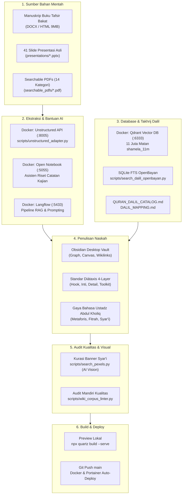
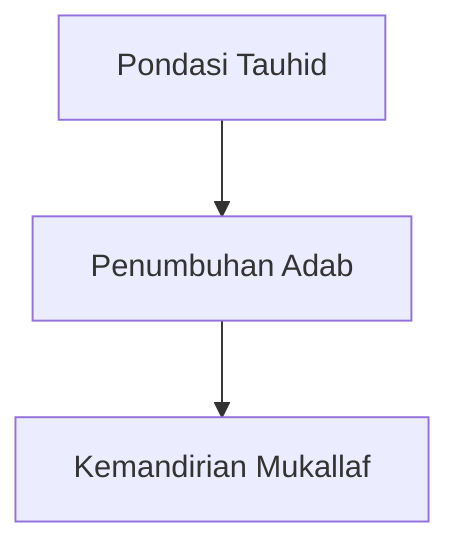

# ✍️ Panduan Lengkap Penulisan Konten Wiki PKN
## *(The Master PKN Content Authoring & Research Guide)*

Selamat datang di pedoman resmi penulisan dan pengembangan konten **Wiki Pendidikan Karakter Nabawiyah (Wiki-PKN)**. Dokumen ini dirancang sebagai panduan operasional satu pintu (*single source of truth*) bagi para penulis, peneliti (*researchers*), asatidzah, guru, dan kontributor digital dalam memproduksi artikel ensiklopedia berstandar emas (*Gold Standard*).

### Kedudukan panduan dan batas penggunaannya

Dokumen ini adalah **kebijakan editorial kanonis** untuk konten Wiki PKN. [`USTADZ_ABDUL_KHOLIQ_STYLE_GUIDE.md`](pipeline_designs/USTADZ_ABDUL_KHOLIQ_STYLE_GUIDE.md) merupakan referensi pendamping untuk suara penulisan dan ciri materi Ustadz Abdul Kholiq, bukan kebijakan publikasi yang berdiri sendiri. Jika aturan panjang, struktur, skor, atau review berbeda, gunakan panduan ini. Ciri gaya tidak membuktikan bahwa suatu kalimat pernah diucapkan penulis sumber atau telah disetujui ahli.

Bedakan jenis halaman sebelum menulis:
- **Artikel panjang:** uraikan konsep, sumber, batas penerapan, dan praktik yang relevan. Angka 5.000 karakter adalah sasaran pengembangan untuk artikel yang memang membutuhkan elaborasi, bukan syarat kebenaran atau kewajiban menambah teks.
- **MOC/indeks:** utamakan orientasi pembaca, pengelompokan, dan tautan yang tepat. Tidak perlu enam pilar atau narasi 5.000 karakter.
- **Formulir, jurnal, dan toolkit:** utamakan petunjuk pengisian, contoh, batas penggunaan, dan rujukan ke artikel induk. Jangan memperpanjang formulir dengan pengulangan teori.

Tidak boleh menambah dalil, metafora, tabel, atau paragraf pengisi hanya untuk mencapai panjang atau skor. Skor linter/AI adalah petunjuk perbaikan editorial; bukan bukti kebenaran, validitas instrumen, atau persetujuan manusia. Kutipan asli tetap dipertahankan meskipun gaya bahasanya berbeda dari pedoman.

---

## 1. Ikhtisar Ekosistem Penulisan Wiki PKN

Wiki PKN memadukan **khazanah keilmuan Islam turats** dengan **teknologi basis pengetahuan modern** (Obsidian, Quartz v5, Vector Database, dan AI Document Processing). 



---

## 2. Setup Lingkungan Menulis Penulis

### A. Menggunakan Obsidian Desktop (Sangat Direkomendasikan)
Repositori ini telah dikonfigurasi penuh sebagai **Obsidian Vault**. Ini adalah cara ternyaman untuk menulis:
1. Buka aplikasi **Obsidian** di komputer Anda.
2. Pilih **Open folder as vault**, lalu arahkan ke direktori root repositori ini: `/home/abuhafi/Project/wiki-pkn` (atau path kloning Anda).
3. Seluruh fitur canggih Obsidian langsung aktif:
   - **Kanvas Interaktif:** Buka berkas `.canvas` di folder `content/canvas/` atau [`Pendidikan Karakter Nabawiyah.canvas`](content/Pendidikan%20Karakter%20Nabawiyah.canvas).
   - **Graph View:** Melihat keterhubungan antar tema konsep secara visual (`Ctrl + G`).
   - **Autocompletion Wikilinks:** Cukup ketik `[[` untuk menghubungkan artikel dengan konsep lain.

### B. Menjalankan Live Preview Lokal (Quartz Server)
Untuk melihat tampilan persis sebagaimana yang akan dilihat pembaca di web:

```bash
# Opsi 1: Menjalankan langsung via Node.js
npm install
npx quartz build --serve --port 8888
# Buka browser di http://localhost:8888
```

```bash
# Opsi 2: Menjalankan via Docker lokal
# Gunakan port 4045 agar tidak bentrok dengan kontainer api-tb40
HOST_PORT=4045 PORT=8080 docker compose up -d
# Buka browser di http://localhost:4045
```

### C. Manajemen Berkas Berbasis Web (Bagi Kontributor Non-Developer)
Jika kontributor ingin mengunggah dokumen referensi (PDF/gambar) tanpa terminal:
- **FileBrowser Quantum:** Akses di `http://localhost:8080`
- **Copyparty Media Manager:** Akses di `http://localhost:3923`

---

## 3. Pemanfaatan Sumber Data Bahan Mentah

Penulis **tidak perlu membuat materi dari nol**. Rujuklah bahan-bahan primer yang telah tersedia di repositori:

| Sumber Bahan Mentah | Lokasi Direktori | Cara Menggunakannya untuk Penulisan |
|---|---|---|
| **Manuskrip Buku Tafsir Bakat** | [`sources/buku_tafsir_bakat/`](sources/buku_tafsir_bakat/) | Berisi naskah asli buku Ustadz Abdul Kholiq (file master `Buku_Tafsir_Bakat_Full.html` 9MB dan DOCX per bab). Gunakan untuk merujuk definisi 40 pilar bakat, kutub energi, dan analogi karakter. |
| **Data Ekstraksi Buku (JSON)** | [`data/buku_tafsir_bakat_extracted.json`](data/buku_tafsir_bakat_extracted.json) | Hasil ekstraksi bab terstruktur siap pakai untuk disalin ke artikel tematik. |
| **41 Slide Presentasi Asli** | [`presentations/`](presentations/) | Berisi 41 slide pelatihan resmi PKN (00 s.d. 40: Akhlaq, Jiwa, Fase Perkembangan, Penanganan Kasus, Bullying, Kurikulum TB40, KBM Alamiah, dll.). |
| **Searchable PDFs (OCR)** | [`searchable_pdfs/`](searchable_pdfs/) | Ratusan PDF modul KBM di 14 kategori (*Akademi Guru, Temu Lembaga, Standar Implementasi, Modul Parenting, Observasi Bakat, Remaja*). Teks di dalamnya sudah di-OCR dan dapat disalin langsung. |
| **Arsip & Backup Materi** | `old_backup/` | Naskah kajian pendukung dan notulensi workshop temu lembaga. |

### A. Jejak sumber yang dapat ditelusuri

Setiap definisi khusus PKN, angka, batas usia, kutipan, dan klaim faktual harus dapat ditelusuri ke sumber yang benar-benar dibaca. Catat identitas penulis/pemateri, judul, berkas atau URL, dan penunjuk lokasi (bab/halaman, nomor slide, atau waktu rekaman). Untuk HTML/hasil ekstraksi tanpa halaman, gunakan judul bagian dan identitas berkas asal. OCR, JSON ekstraksi, hasil pencarian, dan jawaban AI adalah alat bantu; cocokkan teks dengan dokumen asal sebelum menyebutnya terverifikasi.

Gunakan catatan kaki Markdown dekat klaim, bukan hanya daftar tautan di akhir. Beberapa klaim boleh berbagi rujukan jika cakupannya jelas. Format berikut adalah templat, bukan sumber yang sudah diverifikasi:

```markdown
Parafrasa gagasan sumber dengan cakupan yang sama.[^materi]

[^materi]: Nama penulis/pemateri, *Judul materi*, edisi/tanggal bila tersedia, [berkas sumber](path-ke-berkas) atau URL, bab/halaman/slide/waktu. Jika melalui ekstraksi, catat berkas ekstraksi dan lokasi dokumen asal.
```

- **Kutipan langsung:** gunakan tanda kutip atau callout, atribusi nama, dan lokasi sumber. Jangan memperbaiki isi kutipan diam-diam; tandai pemotongan dengan elipsis tanpa mengubah makna. Terjemahan atau koreksi OCR harus diberi keterangan dan dibandingkan dengan asal.
- **Parafrasa:** gunakan bahasa sendiri tanpa tanda kutip, tetap beri sumber; jangan menaikkan saran menjadi kewajiban atau kemungkinan menjadi kepastian.
- **Sintesis/editorial:** nyatakan sebagai rangkuman atau usulan praktik kontributor. Jangan mengatasnamakan Ustadz Abdul Kholiq untuk teks baru yang hanya mengikuti gaya beliau.
- **Contoh:** beri label “contoh hipotetis” atau “contoh pengisian”. Jangan menyajikannya sebagai kejadian, hasil penelitian, atau keberhasilan nyata. Anonimkan kisah nyata dan hindari data anak yang dapat dikenali.

### B. Status klaim dan keterbatasan

“Terverifikasi terhadap sumber” berarti editor telah mencocokkan teks dan lokasi sumber, bukan memastikan seluruh kesimpulannya benar secara ilmiah atau syar'i. Bedakan laporan pendapat pemateri dari fakta umum. Pertahankan syarat, pengecualian, ketidakpastian, serta lingkup populasi/waktu yang ada dalam sumber.

Jika sumber belum ditemukan, teks OCR meragukan, atribusi tidak jelas, atau sumber saling berbeda, tandai dalam draf sebagai **belum terverifikasi** dengan masalah yang spesifik. Jangan membuat nomor halaman, kutipan, sanad, atau tautan agar terlihat lengkap. Klaim tersebut tidak boleh disajikan sebagai fakta pasti pada publikasi; minta pemeriksaan sumber atau keluarkan klaim dari naskah terbit sambil mencatat alasannya dalam catatan review. Perubahan substansi berisiko tinggi harus dieskalasikan, bukan diselesaikan lewat copy-edit.

---

## 4. Ekstraksi Dokumen Menggunakan Docker Unstructured API

Jika Anda memiliki berkas baru berbentuk PDF scan, modul presentasi PPTX, atau lembar kerja DOCX yang ingin diubah menjadi Markdown rapi:

### 1. Pastikan Kontainer Unstructured Aktif
```bash
# Jalankan kontainer Unstructured API (port 8005)
docker compose -f docker-compose.unstructured.yml up -d

# Cek kesehatan service
python3 scripts/unstructured_adapter.py --check-health
```

### 2. Ekstrak Dokumen ke Markdown Terstruktur
Gunakan client adapter yang telah disediakan:
```bash
# Ekstrak file PDF/PPTX/DOCX menjadi teks terstruktur dan tabel Markdown rapi
python3 scripts/unstructured_adapter.py path/ke/dokumen.pdf --output-dir data/extracted_elements/searchable_pdfs/
```
Sistem secara otomatis:
- Memisahkan judul (*Title*), narasi (*NarrativeText*), poin daftar (*ListItem*), dan tabel (*Table*).
- Mengonversi tabel kurikulum menjadi tabel Markdown standar GitHub.

---

## 5. Pemanfaatan Database & Takhrij Dalil Syar'i

Artikel konsep perlu menjelaskan landasan dalil yang relevan dan sudah ditelusuri. Jangan menempelkan dalil hanya untuk memenuhi format; MOC dan formulir dapat merujuk artikel induk. Penetapan kesahihan hadits dan kesimpulan syar'i memerlukan sumber otoritatif serta review sesuai risiko, bukan hasil pencarian AI semata.

### A. Katalog Master Dalil Siap Pakai
Sebelum mencari manual, periksa katalog yang telah disusun:
- 📖 [**`QURAN_DALIL_CATALOG.md`**](QURAN_DALIL_CATALOG.md): Memuat ribuan ayat bertema pendidikan, teks Arab berharakat resmi, terjemahan Kemenag RI, dan intisari Tafsir Ibnu Katsir.
- 📜 [**`DALIL_MAPPING.md`**](DALIL_MAPPING.md): Pemetaan hadits nabawiyah tematik (*Kutubus Sittah*) lengkap dengan sanad dan nomor hadits.

### B. Pencarian Semantik via Qdrant Vector DB (Port 6333)
Kontainer Docker `local_qdrant` menyimpan koleksi **`shamela_11m`** (11+ juta potongan naskah Arab Maktabah Syamilah).
- Dapat diintegrasikan via skrip pencarian untuk menemukan ayat/hadits yang maknanya semakna dengan tema yang sedang Anda tulis.

### C. Pencarian Cepat Teks Hadits & Syarah via Skrip OpenBayan
Gunakan utilitas CLI untuk menelusuri database Maktabah Syamilah lokal:
```bash
# Menelusuri naskah hadits atau maqolah ulama berdasarkan kata kunci Arab
python3 scripts/search_dalil_openbayan.py "إنما بعثت لأتمم" 5

# Mencari tafsir ayat tertentu
python3 scripts/search_quran_dalil.py
```

### D. Format Baku Kotak Callout Dalil
Tuliskan dalil dalam callout Quartz berikut dan sertakan tautan penelusuran secara eksplisit. Callout atau hasil OpenBayan tidak otomatis memverifikasi teks, terjemahan, atau kesimpulan:

```markdown
> [!quote] Dalil Al-Qur'an: QS. Asy-Syams (91): 7-10
> **وَنَفْسٍ وَمَا سَوَّىٰهَا ۝ فَأَلْهَمَهَا فُجُورَهَا وَتَقْوَىٰهَا ۝ قَدْ أَفْلَحَ مَن زَكَّىٰهَا ۝ وَقَدْ خَابَ مَن دَسَّىٰهَا**
> 
> *"Demi jiwa serta penyempurnaan (ciptaan)-nya, maka Dia mengilhamkan kepadanya (jalan) kejahatan dan ketakwaannya. Sungguh beruntung orang yang menyucikannya, dan sungguh rugi orang yang mengotorinya."*
> 
> [🔍 Telusuri Syarah di OpenBayan](https://openbayan.org/search?q=ونفس+وما+سواها)
```

Untuk ayat, cantumkan nama surah dan nomor ayat serta sumber/edisi terjemahan. Untuk hadits, cantumkan kitab/koleksi, bab atau nomor sesuai edisi, perawi bila tersedia, dan sumber penilaian derajat jika menyebut “shahih”. Nomor yang berbeda antar edisi perlu dijelaskan, bukan dipaksakan sama. Untuk syarah, pisahkan ucapan ulama dari penjelasan kontributor dan cantumkan kitab serta lokasi kutipannya. Tautan pencarian OpenBayan membantu penelusuran, tetapi tidak menggantikan identitas kitab dan lokasi. Jika data belum tersedia, catat kekurangannya untuk reviewer; jangan mengisi dari ingatan.

Callout di atas adalah contoh penyajian. Saat menggunakannya dalam artikel, tetap cocokkan teks dan terjemahan dengan sumber yang dicantumkan; contoh dalam panduan bukan catatan verifikasi untuk artikel tersebut.

---

## 6. Standar Anatomi Naskah: Framework Diátaxis 4-Layer

Artikel panjang menggunakan prinsip **Progressive Disclosure** sesuai kebutuhan pembaca (baca rincian di [`pipeline_designs/DIATAXIS_PROGRESSIVE_DISCLOSURE.md`](pipeline_designs/DIATAXIS_PROGRESSIVE_DISCLOSURE.md)). Empat lapisan berikut adalah pola penyajian, bukan kewajiban menambahkan bagian yang tidak relevan. MOC dan formulir mengikuti fungsi halamannya.

```
┌────────────────────────────────────────────────────────┐
│ Lapisan 1: TL;DR Hook 10 Detik                         │
│ (Banner Gambar + Callout Ringkasan Inti Masalah)       │
├────────────────────────────────────────────────────────┤
│ Lapisan 2: Arsitektur Inti 2 Menit                     │
│ (Diagram Konsep / Tabel Kaidah Pokok / Peta Alur)      │
├────────────────────────────────────────────────────────┤
│ Lapisan 3: Elaborasi Naratif 10 Menit                  │
│ (Dalil, Syarah Turats, Analisis Tafrith-Ifrath, Studi) │
├────────────────────────────────────────────────────────┤
│ Lapisan 4: Toolkit Praktisi & Raw Data                 │
│ (Rubrik Non-Angka, RPP, Transkrip dalam <details>)     │
└────────────────────────────────────────────────────────┘
```

Templat berikut adalah contoh anatomi artikel, bukan daftar bagian wajib. Istilah “diagnosis” dan “terapi” dalam contoh tidak mengizinkan diagnosis klinis atau protokol terapi baru; gunakan pengamatan deskriptif dan rujukan yang sudah direview. Bagian dalil, rentang usia, dan evaluasi hanya dimuat jika relevan serta memiliki sumber yang dapat ditelusuri. Jangan membuat konstruk/indikator untuk mengisi templat.

### Kerangka Templat Standar Artikel Baru (`.md`):

```markdown
---
title: "Judul Konsep Nabawiyah"
tags:
  - Paradigma
  - Fitrah
  - TahapanUsia
description: "Deskripsi padat 1-2 kalimat untuk meta preview SEO dan indexing."
---


> [!important] 🎯 Ringkasan Eksekutif (TL;DR)
> **Poin Kunci:** Jelaskan esensi konsep ini dalam 2-3 kalimat lugas.
> **Aplikasi Utama:** Di mana dan bagaimana konsep ini diterapkan pada anak/santri.
> **Peringatan Tafrith & Ifrath:** Kesalahan fatal jika konsep ini diabaikan atau diterapkan berlebihan.

---

## 1. Landasan Filosofis & Arsitektur Konsep

Gambarkan relasi konsep dengan diagram Mermaid atau rujukan ke canvas:



---

## 2. Landasan Dalil Syar'i & Syarah Ulama

Tuliskan dalil Al-Qur'an dan Hadits shahih dengan teks Arab berharakat, terjemahan resmi, dan syarah ulama salaf (Ibnu Katsir, An-Nawawi, Ibnul Qayyim, dll.).

---

## 3. Diagnosis Lapangan: Dua Sisi Ekstrim (*Ifrath* vs *Tafrith*)

Sajikan tabel analisis penyimpangan karakter:

| Dimensi | Pengabaian (*Tafrith*) | Keseimbangan (*Wasathiyah*) | Pelampiasan Berlebih (*Ifrath*) |
|---|---|---|---|
| Sikap Mental | Rendah diri / Minder | Tawadhu' & Percaya Diri | Takabbur / Sombong |
| Terapi Solutif | Penguatan fitrah bakat | Pembinaan konsisten | Tazkiyatun nafs & empati |

---

## 4. Panduan Implementasi Praktis bagi Pendidik & Orang Tua

- **Langkah 1 (Bahasa Hati):** Koneksi emosi sebelum mengoreksi nalar.
- **Langkah 2 (Bahasa Lisan):** Dialog ma'ruf tanpa label negatif.
- **Langkah 3 (Bahasa Tangan):** Pengkondisian lingkungan dan keteladanan fisik (*qudwah*).

---

## 5. Instrumen Evaluasi KBM & Rubrik Observasi

Sediakan indikator deskriptif kualitatif (tanpa ranking angka).

---

## 6. Bahan Rujukan Mentah & Transkrip Kajian

<details>
<summary>📂 Klik untuk membuka transkrip lengkap kajian & catatan takhrij</summary>

Catatan mentah kajian, anotasi sanad, atau rekaman verbatim diletakkan di sini agar tidak mengganggu alur baca utama.

</details>

---

## 7. Referensi Silang (Wikilinks)
- Konsep Terkait: [[Benang Merah Pendidikan]], [[Fitrah (Karakter)]], [[Recovery]]
- Modul Presentasi: [[03-jiwa-dan-metode-mendidiknya]]
```

### Struktur praktis yang dapat dijalankan

Bagian praktik tidak cukup berisi “lakukan dengan sabar”. Susun langkah yang menjawab:
1. **Tujuan dan konteks:** untuk siapa, situasi apa, dan rujukan konsep yang digunakan.
2. **Persiapan:** siapa pendampingnya, bahan yang tersedia, dan waktu yang dapat disesuaikan. Angka durasi baru harus dilabeli contoh, bukan batas perkembangan baku.
3. **Urutan tindakan:** tulis tindakan pendamping dan anak, contoh kalimat bila perlu, serta pilihan penyesuaian bila anak belum siap. Jangan menjanjikan hasil yang pasti.
4. **Catatan observasi:** rekam kejadian, ucapan, konteks, dan bantuan yang diberikan; pisahkan pengamatan dari tafsir. Rujuk instrumen yang sudah ada tanpa menciptakan skala atau label baru.
5. **Refleksi dan tindak lanjut:** apa yang dibicarakan bersama rumah/sekolah, kapan meninjau ulang, dan kapan perlu berhenti atau meminta bantuan. Isi bagian ini sesuai sumber dan batas risiko, bukan diagnosis atau protokol terapi baru.

Untuk formulir, sediakan petunjuk setiap kolom penting dan satu contoh pengisian yang berlabel. Untuk MOC, sediakan jalur baca dan tautan ke praktik terkait, bukan menyalin seluruh praktik.

---

## 7. Ketentuan Aset Visual & Kepatuhan Syariat (*Sharia Compliance*)

Wiki PKN menerapkan aturan kepatuhan syariat yang sangat ketat untuk seluruh banner dan gambar ilustrasi (baca aturan di [`scripts/search_pexels.py`](scripts/search_pexels.py)):

### Aturan Wajib Gambar:
1. **DILARANG KERAS** menampilkan figur wanita atau anak perempuan (baik dewasa maupun anak-anak).
2. **DILARANG KERAS** menampilkan aurat manusia (pria tanpa baju/celana di atas lutut dilarang).
3. **DILARANG KERAS** menampilkan patung/gambar makhluk bernyawa utuh, simbol salib, atau atribut keagamaan non-Islam.
4. **OBJEK YANG SANGAT DIANJURKAN:**
   - Keindahan alam ciptaan Allah: langit, gunung, laut, bintang, gurun, pepohonan.
   - Arsitektur bernuansa Islam: masjid, kubah, menara, mihrab, perpustakaan, lorong klasik.
   - Objek ilmu & peradaban: mushaf Al-Qur'an, lembaran kitab, pena bulu, tinta, kaligrafi, timbangan, lentera, kompas, jam pasir.

### Menggunakan Skrip Kurasi Otomatis (Pexels + Gemini AI Vision):
```bash
# Mencari dan mengunduh gambar yang otomatis diaudit lolos sensor syar'i oleh AI Vision:
python3 scripts/search_pexels.py "library ancient books" --target content/assets/banners/library.webp
```

---

## 8. Panduan Gaya Bahasa (Ustadz Abdul Kholiq Style Guide)

Dalam menyusun naskah, gunakan referensi nada tutur (*voice & tone*) PKN (lihat [`pipeline_designs/USTADZ_ABDUL_KHOLIQ_STYLE_GUIDE.md`](pipeline_designs/USTADZ_ABDUL_KHOLIQ_STYLE_GUIDE.md)). Referensi ini tunduk pada kebijakan sumber, jenis halaman, dan review dalam panduan kanonis ini:

1. **Memuliakan Fitrah Anak:** Anak tidak pernah dipandang sebagai kertas kosong (*tabula rasa*) atau botol kosong yang harus dijejali, melainkan benih pohon yang di dalamnya telah tersimpan cetak biru potensi dari Allah.
2. **Kritik Dekonstruktif yang Lembut tapi Tajam:** Mengkritisi pemesinan pendidikan modern yang memaksakan standardisasi seragam dan ranking angka, namun selalu menyodorkan solusi alternatif berbasis sunnah.
3. **Mengutamakan *Bahasa Hati* Sebelum *Bahasa Lisan*:** Prinsip *“Koneksi sebelum Koreksi”* dan *“Sentuh hatinya sebelum mengarahkan logikanya”*.
4. **Terminologi Turats yang Presisi:** Gunakan istilah Arab standar beserta syarahnya (*Ta'dib*, *Tazkiyah*, *Tadarruj*, *Taisir*, *Qudwah*, *Akal-Baligh*, *Syakilah*).

---

## 9. Kendali Mutu Mandiri Sebelum Publikasi (Self-Check Checklist)

Sebelum melakukan *commit* atau mengajukan *Pull Request*, jalankan pemeriksaan mandiri berikut:

- [ ] **Jenis dan kecukupan halaman:** Artikel panjang menjawab kebutuhan pembaca tanpa pengisi demi 5.000 karakter; MOC/formulir cukup lengkap untuk fungsi masing-masing.
- [ ] **Frontmatter Valid:** Memiliki `title`, `tags`, dan `description` sesuai pola halaman yang digunakan.
- [ ] **Validasi Sumber:** Klaim dan kutipan memiliki identitas sumber serta lokasi; dalil mencantumkan rujukan ayat/kitab, sumber terjemahan, dan tautan penelusuran bila tersedia. Kekurangan verifikasi tercatat, tidak disamarkan.
- [ ] **Kepatuhan Visual:** Banner horizontal 1050×350px format `.webp` bebas dari figur wanita dan aurat.
- [ ] **Integritas Wikilinks:** Tautan ganda `[[Nama Halaman]]` merujuk ke berkas yang benar-benar ada di `content/`.
- [ ] **Jalankan Skrip Linter Otomatis:**
  ```bash
  python3 scripts/wiki_corpus_linter.py
  ```


### Checklist copy-edit dengan retensi fakta

- [ ] Sebelum menyunting, catat sumber utama dan daftar fakta yang harus tetap ada: nama, istilah, angka, fase/usia, urutan, syarat, pengecualian, dalil, dan peringatan.
- [ ] Bandingkan setiap bagian yang diubah dengan sumber dan naskah awal. Tidak ada fakta, nuansa ketidakpastian, atau atribusi yang hilang saat kalimat dipadatkan.
- [ ] Kutipan langsung tidak berubah tanpa penanda; parafrasa tidak dikemas menjadi kutipan. Koreksi OCR memiliki dasar dari dokumen asal.
- [ ] Repetisi dibuang hanya jika informasinya tetap tersedia di tempat yang jelas. Tidak ada target pemotongan persentase kata yang mengalahkan retensi fakta.
- [ ] Catatan kaki, tautan sumber, wikilink, dan embed tetap terkait dengan klaim/konsep yang benar setelah pemindahan teks.
- [ ] Contoh baru diberi label dan tidak menambah klaim efektivitas, diagnosis, batas syar'i, indikator, atau skala.
- [ ] Catatan penyerahan menyebut berkas/bagian yang berubah, sumber yang dipertahankan, klaim belum terverifikasi, dan pertanyaan untuk reviewer. Checklist yang belum diperiksa tidak ditandai selesai.

### Gerbang review manusia (HITL)

1. **Klasifikasikan risiko perubahan**, bukan hanya nama halaman. Risiko rendah meliputi ejaan, alur kalimat, dan navigasi tanpa perubahan makna. Risiko sedang meliputi sintesis pedagogis, petunjuk kegiatan, jurnal naratif, atau komunikasi rumah–sekolah tanpa perubahan konstruk. Jika ragu, gunakan tingkat lebih tinggi.
2. **Siapkan paket review**: berkas dan bagian yang berubah, ringkasan perubahan, sumber beserta lokasi, daftar retensi fakta, status verifikasi klaim, serta risiko/pertanyaan terbuka. Gunakan alur lokal [`scripts/hitl_workflow.py`](scripts/hitl_workflow.py) untuk low/medium sesuai bantuan CLI. Runtime saat ini mewajibkan preflight scorer mencapai ambang 70 sebelum menerima keputusan manusia. `PREFLIGHT_FAILED` berarti perbaiki draf berdasarkan laporan lalu jalankan `revise`; tidak ada bypass. Ambang ini merupakan prasyarat teknis alur lokal, bukan bukti kebenaran atau persetujuan. Jangan menambah pengisi atau mengubah fakta demi skor; bila formulir yang memadai tetap gagal, laporkan keterbatasan scorer kepada pengelola.
3. **Tetapkan pending** sampai manusia yang berwenang menelaah versi tersebut. `HUMAN_PENDING`, skor AI, linter lolos, atau simulasi persona bukan persetujuan. Jangan mengisi nama reviewer, keputusan, tanggal, atau tanda tangan atas nama orang lain.
4. **Review rendah/sedang**: risiko `low` memerlukan satu reviewer berperan `editorial` atau `source`; `medium` memerlukan dua manusia berbeda, masing-masing berperan `editorial` dan `source`. Reviewer memeriksa kecocokan sumber, retensi makna, kejelasan praktik, batas penggunaan, dan risiko. Catat keputusan nyata melalui `decide` (`approve`, `reject`, atau `needs-revision`) dengan identitas, peran, dan alasan. Jalankan `resume` hanya setelah semua signoff wajib menghasilkan `HUMAN_APPROVED`; hasilnya handoff privat, bukan publikasi. Perubahan atau kehilangan byte draf/konteks/sumber membatalkan persetujuan menjadi `STALE` dan memerlukan revisi serta review baru.
5. **Eskalasi tinggi**: perubahan konstruk/skala/indikator, TB-40, klaim klinis/diagnosis/terapi, penanganan kekerasan/KDRT, atau keputusan hukum/syariah tidak boleh dilewatkan sebagai low/medium. Tahan perubahan substansi dan publikasinya; serahkan sumber serta pertanyaan kepada penanggung jawab dan ahli bidang yang sesuai melalui proses khusus. Skrip low/medium tidak mengesahkan risiko tinggi.

### Urutan kerja kontributor

Tentukan jenis halaman dan risiko; baca sumber; catat lokasi dan fakta; susun draf beratribusi; copy-edit dengan checklist retensi; jalankan pemeriksaan teknis yang relevan; siapkan paket HITL; tanggapi revisi; publikasi hanya setelah keputusan manusia yang diperlukan benar-benar tercatat. Dokumen panduan ini sendiri tidak menyatakan bahwa naskah tertentu telah memperoleh persetujuan ahli.
---

## 10. Alur Publikasi & Otomasi Deployment (GitOps)

Repositori ini terhubung dengan sistem deployment otomatis berbasis Portainer:

Langkah teknis berikut dilakukan setelah pemeriksaan sumber dan gerbang review yang diperlukan terpenuhi. Build sukses tidak mengizinkan melewati HITL; naskah pending tetap draf dan tidak boleh dipublikasikan sebagai materi yang telah disetujui.

```bash
# 1. Pastikan build Quartz tidak memiliki syntax error
npx quartz build

# 2. Tambahkan berkas yang diubah
git add content/NamaArtikelBaru.md assets/

# 3. Buat commit dengan pesan bermakna
git commit -m "feat(content): menambahkan panduan observasi fitrah tamyiz"

# 4. Push ke GitHub
git push origin main
```

🚀 **Deployment Otomatis:** Setelah `git push`, webhook Portainer akan otomatis memicu rebuild kontainer Docker pada server produksi (`https://wikipkn.insanmustaqbal.or.id`). Perubahan Anda akan live dalam waktu 1-2 menit!

---

> 🤝 **Butuh Bantuan atau Diskusi Penulisan?**  
> Pelajari piagam etika kami di [**`CODE_OF_CONDUCT.md`**](CODE_OF_CONDUCT.md) dan cetak biru arsitektur sistem di [**`HANDOFF.md`**](HANDOFF.md). Selamat menulis dan menorehkan amal jariyah peradaban!
