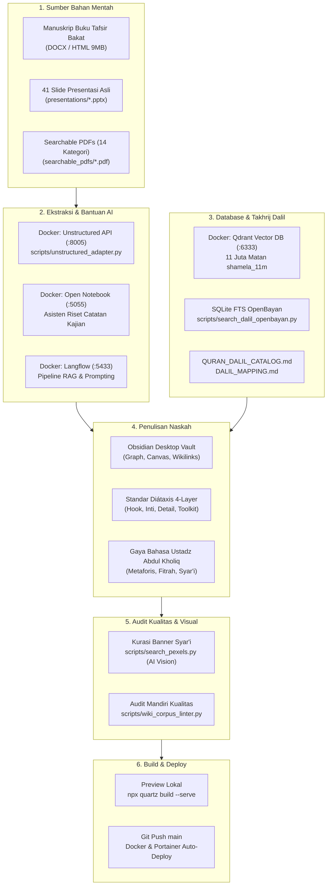
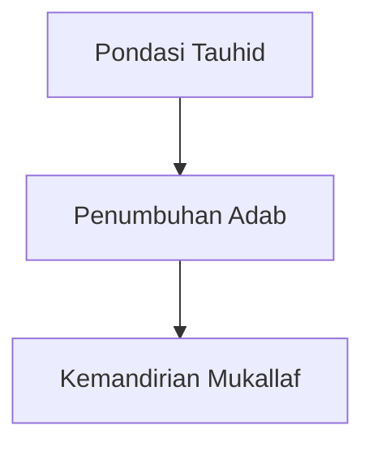

# ✍️ Panduan Lengkap Penulisan Konten Wiki PKN
## *(The Master PKN Content Authoring & Research Guide)*

Selamat datang di pedoman resmi penulisan dan pengembangan konten **Wiki Pendidikan Karakter Nabawiyah (Wiki-PKN)**. Dokumen ini dirancang sebagai panduan operasional satu pintu (*single source of truth*) bagi para penulis, peneliti (*researchers*), asatidzah, guru, dan kontributor digital dalam memproduksi artikel ensiklopedia berstandar emas (*Gold Standard*).

---

## 1. Ikhtisar Ekosistem Penulisan Wiki PKN

Wiki PKN memadukan **khazanah keilmuan Islam turats** dengan **teknologi basis pengetahuan modern** (Obsidian, Quartz v5, Vector Database, dan AI Document Processing). 



---

## 2. Setup Lingkungan Menulis Penulis

### A. Menggunakan Obsidian Desktop (Sangat Direkomendasikan)
Repositori ini telah dikonfigurasi penuh sebagai **Obsidian Vault**. Ini adalah cara ternyaman untuk menulis:
1. Buka aplikasi **Obsidian** di komputer Anda.
2. Pilih **Open folder as vault**, lalu arahkan ke direktori root repositori ini: `/home/abuhafi/Project/wiki-pkn` (atau path kloning Anda).
3. Seluruh fitur canggih Obsidian langsung aktif:
   - **Kanvas Interaktif:** Buka berkas `.canvas` di folder `content/canvas/` atau [`Pendidikan Karakter Nabawiyah.canvas`](content/Pendidikan%20Karakter%20Nabawiyah.canvas).
   - **Graph View:** Melihat keterhubungan antar tema konsep secara visual (`Ctrl + G`).
   - **Autocompletion Wikilinks:** Cukup ketik `[[` untuk menghubungkan artikel dengan konsep lain.

### B. Menjalankan Live Preview Lokal (Quartz Server)
Untuk melihat tampilan persis sebagaimana yang akan dilihat pembaca di web:

```bash
# Opsi 1: Menjalankan langsung via Node.js
npm install
npx quartz build --serve --port 8888
# Buka browser di http://localhost:8888
```

```bash
# Opsi 2: Menjalankan via Docker lokal
# Gunakan port 4045 agar tidak bentrok dengan kontainer api-tb40
HOST_PORT=4045 PORT=8080 docker compose up -d
# Buka browser di http://localhost:4045
```

### C. Manajemen Berkas Berbasis Web (Bagi Kontributor Non-Developer)
Jika kontributor ingin mengunggah dokumen referensi (PDF/gambar) tanpa terminal:
- **FileBrowser Quantum:** Akses di `http://localhost:8080`
- **Copyparty Media Manager:** Akses di `http://localhost:3923`

---

## 3. Pemanfaatan Sumber Data Bahan Mentah

Penulis **tidak perlu membuat materi dari nol**. Rujuklah bahan-bahan primer yang telah tersedia di repositori:

| Sumber Bahan Mentah | Lokasi Direktori | Cara Menggunakannya untuk Penulisan |
|---|---|---|
| **Manuskrip Buku Tafsir Bakat** | [`sources/buku_tafsir_bakat/`](sources/buku_tafsir_bakat/) | Berisi naskah asli buku Ustadz Abdul Kholiq (file master `Buku_Tafsir_Bakat_Full.html` 9MB dan DOCX per bab). Gunakan untuk merujuk definisi 40 pilar bakat, kutub energi, dan analogi karakter. |
| **Data Ekstraksi Buku (JSON)** | [`data/buku_tafsir_bakat_extracted.json`](data/buku_tafsir_bakat_extracted.json) | Hasil ekstraksi bab terstruktur siap pakai untuk disalin ke artikel tematik. |
| **41 Slide Presentasi Asli** | [`presentations/`](presentations/) | Berisi 41 slide pelatihan resmi PKN (00 s.d. 40: Akhlaq, Jiwa, Fase Perkembangan, Penanganan Kasus, Bullying, Kurikulum TB40, KBM Alamiah, dll.). |
| **Searchable PDFs (OCR)** | [`searchable_pdfs/`](searchable_pdfs/) | Ratusan PDF modul KBM di 14 kategori (*Akademi Guru, Temu Lembaga, Standar Implementasi, Modul Parenting, Observasi Bakat, Remaja*). Teks di dalamnya sudah di-OCR dan dapat disalin langsung. |
| **Arsip & Backup Materi** | `old_backup/` | Naskah kajian pendukung dan notulensi workshop temu lembaga. |

---

## 4. Ekstraksi Dokumen Menggunakan Docker Unstructured API

Jika Anda memiliki berkas baru berbentuk PDF scan, modul presentasi PPTX, atau lembar kerja DOCX yang ingin diubah menjadi Markdown rapi:

### 1. Pastikan Kontainer Unstructured Aktif
```bash
# Jalankan kontainer Unstructured API (port 8005)
docker compose -f docker-compose.unstructured.yml up -d

# Cek kesehatan service
python3 scripts/unstructured_adapter.py --check-health
```

### 2. Ekstrak Dokumen ke Markdown Terstruktur
Gunakan client adapter yang telah disediakan:
```bash
# Ekstrak file PDF/PPTX/DOCX menjadi teks terstruktur dan tabel Markdown rapi
python3 scripts/unstructured_adapter.py path/ke/dokumen.pdf --output-dir data/extracted_elements/searchable_pdfs/
```
Sistem secara otomatis:
- Memisahkan judul (*Title*), narasi (*NarrativeText*), poin daftar (*ListItem*), dan tabel (*Table*).
- Mengonversi tabel kurikulum menjadi tabel Markdown standar GitHub.

---

## 5. Pemanfaatan Database & Takhrij Dalil Syar'i

Setiap artikel konsep di Wiki PKN wajib berlandaskan Al-Qur'an dan Hadits shahih. Anda memiliki akses ke infrastruktur database dalil:

### A. Katalog Master Dalil Siap Pakai
Sebelum mencari manual, periksa katalog yang telah disusun:
- 📖 [**`QURAN_DALIL_CATALOG.md`**](QURAN_DALIL_CATALOG.md): Memuat ribuan ayat bertema pendidikan, teks Arab berharakat resmi, terjemahan Kemenag RI, dan intisari Tafsir Ibnu Katsir.
- 📜 [**`DALIL_MAPPING.md`**](DALIL_MAPPING.md): Pemetaan hadits nabawiyah tematik (*Kutubus Sittah*) lengkap dengan sanad dan nomor hadits.

### B. Pencarian Semantik via Qdrant Vector DB (Port 6333)
Kontainer Docker `local_qdrant` menyimpan koleksi **`shamela_11m`** (11+ juta potongan naskah Arab Maktabah Syamilah).
- Dapat diintegrasikan via skrip pencarian untuk menemukan ayat/hadits yang maknanya semakna dengan tema yang sedang Anda tulis.

### C. Pencarian Cepat Teks Hadits & Syarah via Skrip OpenBayan
Gunakan utilitas CLI untuk menelusuri database Maktabah Syamilah lokal:
```bash
# Menelusuri naskah hadits atau maqolah ulama berdasarkan kata kunci Arab
python3 scripts/search_dalil_openbayan.py "إنما بعثت لأتمم" 5

# Mencari tafsir ayat tertentu
python3 scripts/search_quran_dalil.py
```

### D. Format Baku Kotak Callout Dalil
Tuliskan dalil dalam format callout Quartz berikut agar link penelusuran OpenBayan otomatis terpasang:

```markdown
> [!quote] Dalil Al-Qur'an: QS. Asy-Syams (91): 7-10
> **وَنَفْسٍ وَمَا سَوَّىٰهَا ۝ فَأَلْهَمَهَا فُجُورَهَا وَتَقْوَىٰهَا ۝ قَدْ أَفْلَحَ مَن زَكَّىٰهَا ۝ وَقَدْ خَابَ مَن دَسَّىٰهَا**
> 
> *"Demi jiwa serta penyempurnaan (ciptaan)-nya, maka Dia mengilhamkan kepadanya (jalan) kejahatan dan ketakwaannya. Sungguh beruntung orang yang menyucikannya, dan sungguh rugi orang yang mengotorinya."*
> 
> [🔍 Telusuri Syarah di OpenBayan](https://openbayan.org/search?q=ونفس+وما+سواها)
```

---

## 6. Standar Anatomi Naskah: Framework Diátaxis 4-Layer

Agar naskah padat referensi namun tetap nyaman dibaca oleh pembaca yang sibuk, setiap artikel harus mematuhi prinsip **Progressive Disclosure** (baca rincian di [`pipeline_designs/DIATAXIS_PROGRESSIVE_DISCLOSURE.md`](pipeline_designs/DIATAXIS_PROGRESSIVE_DISCLOSURE.md)):

```
┌────────────────────────────────────────────────────────┐
│ Lapisan 1: TL;DR Hook 10 Detik                         │
│ (Banner Gambar + Callout Ringkasan Inti Masalah)       │
├────────────────────────────────────────────────────────┤
│ Lapisan 2: Arsitektur Inti 2 Menit                     │
│ (Diagram Konsep / Tabel Kaidah Pokok / Peta Alur)      │
├────────────────────────────────────────────────────────┤
│ Lapisan 3: Elaborasi Naratif 10 Menit                  │
│ (Dalil, Syarah Turats, Analisis Tafrith-Ifrath, Studi) │
├────────────────────────────────────────────────────────┤
│ Lapisan 4: Toolkit Praktisi & Raw Data                 │
│ (Rubrik Non-Angka, RPP, Transkrip dalam <details>)     │
└────────────────────────────────────────────────────────┘
```

### Kerangka Templat Standar Artikel Baru (`.md`):

```markdown
---
title: "Judul Konsep Nabawiyah"
tags:
  - Paradigma
  - Fitrah
  - TahapanUsia
description: "Deskripsi padat 1-2 kalimat untuk meta preview SEO dan indexing."
---


> [!important] 🎯 Ringkasan Eksekutif (TL;DR)
> **Poin Kunci:** Jelaskan esensi konsep ini dalam 2-3 kalimat lugas.
> **Aplikasi Utama:** Di mana dan bagaimana konsep ini diterapkan pada anak/santri.
> **Peringatan Tafrith & Ifrath:** Kesalahan fatal jika konsep ini diabaikan atau diterapkan berlebihan.

---

## 1. Landasan Filosofis & Arsitektur Konsep

Gambarkan relasi konsep dengan diagram Mermaid atau rujukan ke canvas:



---

## 2. Landasan Dalil Syar'i & Syarah Ulama

Tuliskan dalil Al-Qur'an dan Hadits shahih dengan teks Arab berharakat, terjemahan resmi, dan syarah ulama salaf (Ibnu Katsir, An-Nawawi, Ibnul Qayyim, dll.).

---

## 3. Diagnosis Lapangan: Dua Sisi Ekstrim (*Ifrath* vs *Tafrith*)

Sajikan tabel analisis penyimpangan karakter:

| Dimensi | Pengabaian (*Tafrith*) | Keseimbangan (*Wasathiyah*) | Pelampiasan Berlebih (*Ifrath*) |
|---|---|---|---|
| Sikap Mental | Rendah diri / Minder | Tawadhu' & Percaya Diri | Takabbur / Sombong |
| Terapi Solutif | Penguatan fitrah bakat | Pembinaan konsisten | Tazkiyatun nafs & empati |

---

## 4. Panduan Implementasi Praktis bagi Pendidik & Orang Tua

- **Langkah 1 (Bahasa Hati):** Koneksi emosi sebelum mengoreksi nalar.
- **Langkah 2 (Bahasa Lisan):** Dialog ma'ruf tanpa label negatif.
- **Langkah 3 (Bahasa Tangan):** Pengkondisian lingkungan dan keteladanan fisik (*qudwah*).

---

## 5. Instrumen Evaluasi KBM & Rubrik Observasi

Sediakan indikator deskriptif kualitatif (tanpa ranking angka).

---

## 6. Bahan Rujukan Mentah & Transkrip Kajian

<details>
<summary>📂 Klik untuk membuka transkrip lengkap kajian & catatan takhrij</summary>

Catatan mentah kajian, anotasi sanad, atau rekaman verbatim diletakkan di sini agar tidak mengganggu alur baca utama.

</details>

---

## 7. Referensi Silang (Wikilinks)
- Konsep Terkait: [[Benang Merah Pendidikan]], [[Fitrah (Karakter)]], [[Recovery]]
- Modul Presentasi: [[03-jiwa-dan-metode-mendidiknya]]
```

---

## 7. Ketentuan Aset Visual & Kepatuhan Syariat (*Sharia Compliance*)

Wiki PKN menerapkan aturan kepatuhan syariat yang sangat ketat untuk seluruh banner dan gambar ilustrasi (baca aturan di [`scripts/search_pexels.py`](scripts/search_pexels.py)):

### Aturan Wajib Gambar:
1. **DILARANG KERAS** menampilkan figur wanita atau anak perempuan (baik dewasa maupun anak-anak).
2. **DILARANG KERAS** menampilkan aurat manusia (pria tanpa baju/celana di atas lutut dilarang).
3. **DILARANG KERAS** menampilkan patung/gambar makhluk bernyawa utuh, simbol salib, atau atribut keagamaan non-Islam.
4. **OBJEK YANG SANGAT DIANJURKAN:**
   - Keindahan alam ciptaan Allah: langit, gunung, laut, bintang, gurun, pepohonan.
   - Arsitektur bernuansa Islam: masjid, kubah, menara, mihrab, perpustakaan, lorong klasik.
   - Objek ilmu & peradaban: mushaf Al-Qur'an, lembaran kitab, pena bulu, tinta, kaligrafi, timbangan, lentera, kompas, jam pasir.

### Menggunakan Skrip Kurasi Otomatis (Pexels + Gemini AI Vision):
```bash
# Mencari dan mengunduh gambar yang otomatis diaudit lolos sensor syar'i oleh AI Vision:
python3 scripts/search_pexels.py "library ancient books" --target content/assets/banners/library.webp
```

---

## 8. Panduan Gaya Bahasa (Ustadz Abdul Kholiq Style Guide)

Dalam menyusun naskah, ikuti nada tutur (*voice & tone*) resmi PKN (lihat [`pipeline_designs/USTADZ_ABDUL_KHOLIQ_STYLE_GUIDE.md`](pipeline_designs/USTADZ_ABDUL_KHOLIQ_STYLE_GUIDE.md)):

1. **Memuliakan Fitrah Anak:** Anak tidak pernah dipandang sebagai kertas kosong (*tabula rasa*) atau botol kosong yang harus dijejali, melainkan benih pohon yang di dalamnya telah tersimpan cetak biru potensi dari Allah.
2. **Kritik Dekonstruktif yang Lembut tapi Tajam:** Mengkritisi pemesinan pendidikan modern yang memaksakan standardisasi seragam dan ranking angka, namun selalu menyodorkan solusi alternatif berbasis sunnah.
3. **Mengutamakan *Bahasa Hati* Sebelum *Bahasa Lisan*:** Prinsip *“Koneksi sebelum Koreksi”* dan *“Sentuh hatinya sebelum mengarahkan logikanya”*.
4. **Terminologi Turats yang Presisi:** Gunakan istilah Arab standar beserta syarahnya (*Ta'dib*, *Tazkiyah*, *Tadarruj*, *Taisir*, *Qudwah*, *Akal-Baligh*, *Syakilah*).

---

## 9. Kendali Mutu Mandiri Sebelum Publikasi (Self-Check Checklist)

Sebelum melakukan *commit* atau mengajukan *Pull Request*, jalankan pemeriksaan mandiri berikut:

- [ ] **Standar Emas Karakter:** Panjang artikel memenuhi ambang batas kualitas (minimal **5.000 karakter** narasi bermutu).
- [ ] **Frontmatter Valid:** Memiliki `title`, `tags`, dan `description`.
- [ ] **Validasi Dalil:** Ayat Al-Qur'an dan Hadits mencantumkan teks Arab berharakat, perawi, dan link OpenBayan.
- [ ] **Kepatuhan Visual:** Banner horizontal 1050×350px format `.webp` bebas dari figur wanita dan aurat.
- [ ] **Integritas Wikilinks:** Tautan ganda `[[Nama Halaman]]` merujuk ke berkas yang benar-benar ada di `content/`.
- [ ] **Jalankan Skrip Linter Otomatis:**
  ```bash
  python3 scripts/wiki_corpus_linter.py
  ```

---

## 10. Alur Publikasi & Otomasi Deployment (GitOps)

Repositori ini terhubung dengan sistem deployment otomatis berbasis Portainer:

```bash
# 1. Pastikan build Quartz tidak memiliki syntax error
npx quartz build

# 2. Tambahkan berkas yang diubah
git add content/NamaArtikelBaru.md assets/

# 3. Buat commit dengan pesan bermakna
git commit -m "feat(content): menambahkan panduan observasi fitrah tamyiz"

# 4. Push ke GitHub
git push origin main
```

🚀 **Deployment Otomatis:** Setelah `git push`, webhook Portainer akan otomatis memicu rebuild kontainer Docker pada server produksi (`https://wikipkn.insanmustaqbal.or.id`). Perubahan Anda akan live dalam waktu 1-2 menit!

---

> 🤝 **Butuh Bantuan atau Diskusi Penulisan?**  
> Pelajari piagam etika kami di [**`CODE_OF_CONDUCT.md`**](CODE_OF_CONDUCT.md) dan cetak biru arsitektur sistem di [**`HANDOFF.md`**](HANDOFF.md). Selamat menulis dan menorehkan amal jariyah peradaban!
