# Wiki Pendidikan Karakter Nabawiyah (PKN)

[](https://quartz.jzhao.xyz/)
[](ARTICLE_AUDIT_REPORT.md)
[-brightgreen)](ARTICLE_AUDIT_REPORT.md)
[](ARTICLE_AUDIT_REPORT.md)
[-emerald)](DALIL_MAPPING.md)

Basis pengetahuan digital komprehensif **Pendidikan Karakter Nabawiyah (PKN)**
> [!tip] 🌐 Aplikasi Web Pendukung: Peta Bakat & Sifat Manusia
> Repositori ini terhubung dengan aplikasi web interaktif untuk eksplorasi visual 40 pilar bakat nabawiyah:  
> 👉 **[Peta Bakat & Sifat Manusia (Insan Taqwa)](https://pub.insantaqwa.org/bakat/)**
—sebuah ensiklopedia rujukan terstruktur yang merekonstruksi paradigma, kurikulum, metodologi, dan tata kelola implementasi pengasuhan generasi Islam berdasarkan sunnah Rasulullah ﷺ, atsar para sahabat, serta pandangan ulama mu'tabar (*Ibnul Qayyim, Al-Ghazali, Ibnu Sahnun, An-Nawawi, Ibnu Khaldun, Asy-Syathibi*).

---

## 1. Peta Konsep Arsitektur Pendidikan Karakter Nabawiyah

Ensiklopedia ini memetakan manusia secara holistik melalui metafora **Pohon Karakter Nabawiyah**:

```mermaid
graph TD
    subgraph AKAR["🌱 PONDASI INSAN (AKAR TAUHID)"]
        Tujuan["[[Tujuan Hidup Manusia]]<br/>Ibadah & Khilafah"]
        RuhJasad["[[Bersatunya Ruh dan Jasad Membentuk Jiwa]]<br/>Tiupan Ruh & Sari Pati Tanah"]
        Trilogi["[[Pembagian Jiwa]]<br/>Muthmainnah • Lawwamah • Ammarah"]
        Fitrah["[[Fitrah (Karakter)]]<br/>Cetak Biru Suci Lahiriah"]
    end

    subgraph BATANG["🌳 PENDIDIKAN IDEAL (BATANG ADAB & METODOLOGI)"]
        Benang["[[Benang Merah Pendidikan]]<br/>Grand Theory 5 Rantai Kausalitas Amal"]
        TigaBahasa["[[Metode Mendidik]]<br/>[[Bahasa Hati]] • [[Bahasa Lisan]] • [[Bahasa Tangan]]"]
        Fase["[[Perkembangan]]<br/>[[Thufulah]] (0-7) • [[Tamyiz]] (7-10) • [[Murahaqah]] (10-15) • [[Syabab]] (15+)"]
        Proteksi["[[Batas Toleransi]] • [[Imunitas Sosial]] • [[Recovery]]"]
    end

    subgraph RANTING["🍃 FITRAH BAKAT (40 PILAR TB40)"]
        BakatUmum["[[Bakat]] (Syakilah Unik)"]
        Sub1["[[Bekerja Keras]] (Al-Hammasah)"]
        Sub2["[[Berpikir]] (Al-Fikrah)"]
        Sub3["[[Berperasaan]] (Al-Wijdaniyyah)"]
        Sub4["[[Memerintah]] (At-Ta'tsir)"]
        Sub5["[[Bekerja Sama]] (At-Ta'amul)"]
        Sub6["[[Melayani]] (Al-Khidmah)"]
    end

    subgraph BUAH["🍎 IMPLEMENTASI & PERADABAN"]
        Kaidah["[[4 Kaidah Implementasi]]<br/>Taisir • Qudwah • Rahmah • Tadarruj"]
        Lembaga["[[Kaidah Implementasi di Berbagai Lembaga]]<br/>5 Kaidah Ushul Fiqih Adopsi Sekolah/Pesantren"]
        Sinergi["[[Peran Ayah dan Bunda]] • [[Peran Guru dan Lembaga Pendidikan]]"]
        Output["Kematangan Akil-Baligh & Khairu Ummah"]
    end

    AKAR --> BATANG
    BATANG --> RANTING
    RANTING --> BUAH
```



---

## 2. Fitur Unggulan Sistem Basis Pengetahuan

1. **100% Berstandar Emas (≥ 5.000 Karakter per Berkas):** Setiap halaman ensiklopedia ditulis secara mendalam, lengkap dengan landasan Al-Qur'an, Hadits shahih, syarah ulama, diagnosis tafrith-ifrath, rubrik evaluasi, dan lembar refleksi orang tua/guru.
2. **Katalog Dalil Terpadu:**
   - **[QURAN_DALIL_CATALOG.md](QURAN_DALIL_CATALOG.md):** Memuat lebih dari 110 ayat Al-Qur'an lengkap teks Arab berharakat, terjemahan Indonesia, dan rujukan Tafsir Ibnu Katsir.
   - **[DALIL_MAPPING.md](DALIL_MAPPING.md):** Memetakan hadits-hadits shahih hasil penelusuran korpus **OpenBayan** (`data/shamela_corpus.db`).
3. **Integrasi Dokumen Resmi Penggagas Manhaj:** Menyerap seluruh naskah otoritatif karya Ustadz Abdul Kholiq dan Bayu Issetyadi:
   - *Panduan Implementasi Standar PKN pada Lembaga Pendidikan Islam (A4)*
   - *Menumbuhkan Kesadaran Beramal (E-book)*
   - *Kaidah Implementasi PKN dalam Berbagai Lembaga*
4. **Navigasi Kustom `OutlineNav`:** Komponen navigasi sidebar khusus yang membaca struktur hierarki `nav_structure.json`, dilengkapi fitur *inside scrolling*, *active link auto-expand*, dan *session scroll state persistence*.
5. **Dukungan Diagram Interaktif Mermaid & Callout Quartz:** Visualisasi psikospiritual dan rubrik aksi yang memikat serta responsif.

---

## 3. Direktori Dokumen Utama di Root

| Dokumen | Deskripsi |
|---|---|
| 📊 **[ARTICLE_AUDIT_REPORT.md](ARTICLE_AUDIT_REPORT.md)** | Laporan audit kuantitatif & kualitatif panjang seluruh 65 artikel (100% kepatuhan standar emas). |
| 📖 **[QURAN_DALIL_CATALOG.md](QURAN_DALIL_CATALOG.md)** | Katalog master dalil Al-Qur'an, teks Arab berharakat, dan takhrij Tafsir Ibnu Katsir. |
| 📜 **[DALIL_MAPPING.md](DALIL_MAPPING.md)** | Katalog master hadits shahih OpenBayan dan relevansinya bagi kurikulum PKN. |
| 🏗️ **[HANDOFF.md](HANDOFF.md)** | Dokumentasi arsitektur teknis sistem, data model TB40, riwayat milestone 1 s/d 19, dan panduan pemeliharaan. |
| 🔍 **[CONTENT_ANALYSIS.md](CONTENT_ANALYSIS.md)** | Analisis konten holistik, pemetaan hierarki TB40, dan metodologi pengayaan materi. |

| 🤝 **[CODE_OF_CONDUCT.md](CODE_OF_CONDUCT.md)** | Piagam adab dan etika kontributor riset berbasis nilai-nilai Islam nabawiyah. |

---

## 4. Panduan Menjalankan Secara Lokal

### Prasyarat:
- Node.js versi 18.14.0 atau yang lebih baru.
- npm atau npx.

### Langkah Menjalankan:
```bash
# 1. Kloning repositori
git clone https://github.com/decaller/wiki-pkn.git
cd wiki-pkn

# 2. Instal dependensi
npm install

# 3. Bangun situs statis
npx quartz build

# 4. Jalankan development server lokal
npx quartz build --serve --port 8888
```
Buka peramban di `http://localhost:8888/` untuk menelusuri seluruh basis pengetahuan Wiki PKN.

---

---

## 5. Panduan Deployment Portainer Stack (Fitur Git)

Repositori ini telah dikonfigurasi penuh agar dapat langsung di-*deploy* menggunakan fitur **Portainer Stack (Repository/Git)** dan mendukung kustomisasi nama domain serta port via environment variables (`DOMAIN` dan `PORT`).

### A. Konfigurasi Environment Variables

File `.env.example` telah disediakan. Variabel utama yang didukung:

| Variabel | Deskripsi | Default | Contoh Nilai |
|---|---|---|---|
| `DOMAIN` | Domain publik untuk canonical URL, OpenGraph metadata, dan sitemap | `localhost:8080` | `wiki.domainanda.com` |
| `PORT` | Port server Quartz di dalam dan luar container | `8080` | `8080` / `3000` |
| `HOST_PORT` | Port binding host (opsional jika berbeda dari port container) | `${PORT}` | `80` |
| `WS_PORT` | Port WebSocket live-reload | `3001` | `3001` |

> [!NOTE]
> Format `DOMAIN` dapat ditulis dengan atau tanpa `https://` (misal `https://wiki.domainanda.com` atau `wiki.domainanda.com`). Sistem secara otomatis membersihkan awalan protokol dan garis miring penutup.

---

### B. Langkah-langkah Deploy di Portainer

1. **Masuk ke Portainer Web UI**
2. Pilih environment Docker Anda, lalu klik menu **Stacks** di bilah navigasi kiri.
3. Klik tombol **Add stack** (+).
4. Pilih metode build **Repository** (Git repository):
   - **Name:** Beri nama stack, contoh: `wiki-pkn`
   - **Repository URL:** `https://github.com/decaller/wiki-pkn.git` (atau URL repositori Anda)
   - **Repository reference:** `refs/heads/v5` (atau branch target deployment Anda)
   - **Compose path:** `docker-compose.yml`
5. **Konfigurasi GitOps / Automatic Updates (Sangat Direkomendasikan):**
   - Aktifkan toggle **Automatic updates**.
   - Pilih **Polling** (misal interval 5m) atau **Webhook**.
   - Jika menggunakan Webhook, salin Webhook URL yang disediakan Portainer ke pengaturan Webhook repositori GitHub/Gitlab Anda. Setiap kali ada `git push`, Portainer akan otomatis menarik perubahan dan me-rebuild wiki Anda.
6. **Isi Environment Variables:**
   - Di bagian bawah, pada kartu **Environment variables**, klik **Add an environment variable**:
     - `DOMAIN` = `wiki.domainanda.com` (atau domain Anda)
     - `PORT` = `8080`
7. Klik tombol **Deploy the stack**.
8. Portainer akan secara otomatis meng-clone repositori, membangun image container, dan menjalankan stack `wiki-pkn`!

---

## 6. Tim Penyusun & Pengembang

* **Perumus Manhaj PKN:** Ustadz Abdul Kholiq, Bayu Issetyadi, dan Tim SOTAB HEBAT.
* **Penerbit Dokumen Acuan:** Perkumpulan Radio Komunitas Mutiara Qur'an, Sawangan, Depok.
* **Pengembang Basis Pengetahuan & Sistem Quartz:** Tim Relawan Pengembang Digital PKN.

