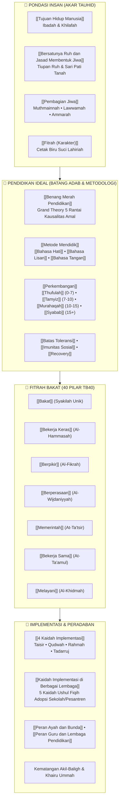

# Wiki Pendidikan Karakter Nabawiyah (PKN)

[](https://quartz.jzhao.xyz/)
[](content/)
[-brightgreen)](ARTICLE_AUDIT_REPORT.md)
[](ARTICLE_AUDIT_REPORT.md)
[-emerald)](content/Referensi/Korpus%20Dalil%20%26%20Atsar%20Klasik.md)
[](https://wikipkn.insanmustaqbal.or.id)

Basis pengetahuan digital komprehensif **Pendidikan Karakter Nabawiyah (PKN)**
> [!tip] 🌐 Aplikasi Web Pendukung: Peta Bakat & Sifat Manusia
> Repositori ini terhubung dengan aplikasi web interaktif untuk eksplorasi visual 40 pilar bakat nabawiyah:  
> 👉 **[Peta Bakat & Sifat Manusia (Insan Taqwa)](https://pub.insantaqwa.org/bakat/)**
—sebuah ensiklopedia rujukan terstruktur yang merekonstruksi paradigma, kurikulum, metodologi, dan tata kelola implementasi pengasuhan generasi Islam berdasarkan sunnah Rasulullah ﷺ, atsar para sahabat, serta pandangan ulama mu'tabar (*Ibnul Qayyim, Al-Ghazali, Ibnu Sahnun, An-Nawawi, Ibnu Khaldun, Asy-Syathibi*).

---

## 1. Peta Konsep Arsitektur Pendidikan Karakter Nabawiyah

Ensiklopedia ini memetakan manusia secara holistik melalui metafora **Pohon Karakter Nabawiyah**:


```mermaid
graph TD
    subgraph AKAR["🌱 PONDASI INSAN (AKAR TAUHID)"]
        Tujuan["[[Tujuan Hidup Manusia]]<br/>Ibadah & Khilafah"]
        RuhJasad["[[Bersatunya Ruh dan Jasad Membentuk Jiwa]]<br/>Tiupan Ruh & Sari Pati Tanah"]
        Trilogi["[[Pembagian Jiwa]]<br/>Muthmainnah • Lawwamah • Ammarah"]
        Fitrah["[[Fitrah (Karakter)]]<br/>Cetak Biru Suci Lahiriah"]
    end

    subgraph BATANG["🌳 PENDIDIKAN IDEAL (BATANG ADAB & METODOLOGI)"]
        Benang["[[Benang Merah Pendidikan]]<br/>Grand Theory 5 Rantai Kausalitas Amal"]
        TigaBahasa["[[Metode Mendidik]]<br/>[[Bahasa Hati]] • [[Bahasa Lisan]] • [[Bahasa Tangan]]"]
        Fase["[[Perkembangan]]<br/>[[Thufulah]] (0-7) • [[Tamyiz]] (7-10) • [[Murahaqah]] (10-15) • [[Syabab]] (15+)"]
        Proteksi["[[Batas Toleransi]] • [[Imunitas Sosial]] • [[Recovery]]"]
    end

    subgraph RANTING["🍃 FITRAH BAKAT (40 PILAR TB40)"]
        BakatUmum["[[Bakat]] (Syakilah Unik)"]
        Sub1["[[Bekerja Keras]] (Al-Hammasah)"]
        Sub2["[[Berpikir]] (Al-Fikrah)"]
        Sub3["[[Berperasaan]] (Al-Wijdaniyyah)"]
        Sub4["[[Memerintah]] (At-Ta'tsir)"]
        Sub5["[[Bekerja Sama]] (At-Ta'amul)"]
        Sub6["[[Melayani]] (Al-Khidmah)"]
    end

    subgraph BUAH["🍎 IMPLEMENTASI & PERADABAN"]
        Kaidah["[[4 Kaidah Implementasi]]<br/>Taisir • Qudwah • Rahmah • Tadarruj"]
        Lembaga["[[Kaidah Implementasi di Berbagai Lembaga]]<br/>5 Kaidah Ushul Fiqih Adopsi Sekolah/Pesantren"]
        Sinergi["[[Peran Ayah dan Bunda]] • [[Peran Guru dan Lembaga Pendidikan]]"]
        Output["Kematangan Akil-Baligh & Khairu Ummah"]
    end

    AKAR --> BATANG
    BATANG --> RANTING
    RANTING --> BUAH
```

---

## 2. Fitur Unggulan Sistem Basis Pengetahuan

1. **Korpus Markdown:** Build lokal terakhir memproses 484 berkas input, termasuk halaman indeks dan dokumen pendukung; angka 123 di laporan audit artikel merujuk pada cakupan audit saat laporan dibuat, bukan seluruh input build.
2. **Link Pencarian OpenBayan Terintegrasi (183 Link):** Setiap callout dalil memiliki tombol 🔍 yang menghubungkan langsung ke platform OpenBayan (seluruh dataset **Maktabah Syamilah**) untuk penelusuran teks Arab mendalam.
3. **41 Presentasi Interaktif Embedded:** Materi slide resmi PKN ditampilkan langsung via iframe Microsoft Office Web Apps (OneDrive) di 57 artikel — dapat dinavigasi, dibuka layar penuh, dan diunduh.
4. **96 Diagram Visual Obsidian Canvas:** Seluruh diagram telah dikonversi ke format JSON Canvas 1.0 resmi (0 Mermaid tersisa), mendukung tampilan interaktif dan integrasi Obsidian penuh.
5. **Navigasi Kustom `OutlineNav`:** Komponen sidebar khusus yang membaca hierarki `nav_structure.json` (49 simpul), dengan fitur *inside scrolling*, *active link auto-expand*, *scroll state persistence* (sessionStorage), dan *collapse/expand state* (localStorage).
6. **Palet Warna Nabawiyah:** Tema Coklat-Hijau *Earth & Emerald* (Parchment `#fbf8f3`, Walnut Brown `#3d312a`, Emerald `#2d6a4f` pada light; Charcoal Espresso `#1a1714`, Ivory Linen `#ded5cb`, Luminous Mint `#52b788` pada dark).
7. **Aset Visual Premium:** 100% artikel memiliki banner horizontal 1050×350px WebP yang dikurasi sesuai compliance syariat Islam (via Pexels API + audit AI vision Gemini 2.5 Flash).

---

## 3. Direktori Dokumen Utama di Root

| Dokumen | Deskripsi |
|---|---|
| 📱 **[IDE_APLIKASI_MOBILE_PKN.md](IDE_APLIKASI_MOBILE_PKN.md)** | **Blueprint & konsep pengembangan aplikasi mobile PKN (Multi-role: Guru, Orang Tua, Siswa/Anak, dan Umum).** |
| ✍️ **[PANDUAN_PENULISAN_KONTEN.md](PANDUAN_PENULISAN_KONTEN.md)** | **Panduan operasional resmi penulisan konten, pemanfaatan database dalil, ekstraksi materi, dan alur kontribusi.** |
| 📊 **[ARTICLE_AUDIT_REPORT.md](ARTICLE_AUDIT_REPORT.md)** | Laporan audit kuantitatif & kualitatif panjang seluruh artikel (100% kepatuhan standar emas). |
| 📑 **[PRESENTATION_AUDIT_REPORT.md](PRESENTATION_AUDIT_REPORT.md)** | Laporan audit inventaris 145 berkas PDF/PPTX presentasi pelatihan dan tautan cloud Dropbox. |
| 📖 **[QURAN_DALIL_CATALOG.md](QURAN_DALIL_CATALOG.md)** | Katalog master dalil Al-Qur'an, teks Arab berharakat, dan takhrij Tafsir Ibnu Katsir. |
| 📜 **[DALIL_MAPPING.md](DALIL_MAPPING.md)** | Katalog master hadits shahih OpenBayan dan relevansinya bagi kurikulum PKN. |
| 🏗️ **[HANDOFF.md](HANDOFF.md)** | Dokumentasi arsitektur teknis sistem, data model TB40, riwayat 49+ milestone, dan panduan pemeliharaan. |
| 🔍 **[CONTENT_ANALYSIS.md](CONTENT_ANALYSIS.md)** | Analisis konten holistik, pemetaan hierarki TB40, dan metodologi pengayaan materi. |
| 🤝 **[CODE_OF_CONDUCT.md](CODE_OF_CONDUCT.md)** | Piagam adab dan etika kontributor riset berbasis nilai-nilai Islam nabawiyah. |
| 🐳 **[CONTAINERS_ECOSYSTEM.md](CONTAINERS_ECOSYSTEM.md)** | Pemetaan repositori & kontainer Docker aktif ekosistem PKN (TB-40, OpenBayan, Qdrant, Rapor, Portainer). |

> 📖 **Dokumentasi Teknis Lengkap Platform:** Baca halaman **[Tentang Aplikasi Wiki PKN](https://wikipkn.insanmustaqbal.or.id/Referensi/Tentang-Aplikasi-Wiki-PKN)** di dalam wiki untuk penjelasan menyeluruh tentang sumber data, metodologi rekonstruksi AI, stack teknologi, plugin navigasi kustom, skrip otomasi, dan infrastruktur deployment.
>
> 🐳 **Ekosistem Docker Lokal & Deployment:** Baca **[CONTAINERS_ECOSYSTEM.md](CONTAINERS_ECOSYSTEM.md)** untuk panduan integrasi kontainer lokal (TB40, Qdrant Maktabah Syamilah, Postgres, Portainer) dan antisipasi konflik port `4040`.

---

## 4. Panduan Menjalankan Secara Lokal

### Prasyarat:
- Node.js versi 22 atau yang lebih baru (npm >=10.9.2; lihat `package.json`).
- npm atau npx.

### Langkah Menjalankan:
```bash
# 1. Kloning repositori
git clone https://github.com/decaller/wiki-pkn.git
cd wiki-pkn

# 2. Instal dependensi
npm install

# 3. Bangun situs statis
npx quartz build

# 4. Jalankan development server lokal
npx quartz build --serve --port 8888
```
Buka peramban di `http://localhost:8888/` untuk menelusuri seluruh basis pengetahuan Wiki PKN.

---

---

## 5. Panduan Deployment CI/CD (GHCR & Portainer Stack 25)

Repositori ini menggunakan arsitektur modern **GitHub Actions CI/CD $\to$ GitHub Container Registry (GHCR) $\to$ Portainer GitOps Webhook** dengan runtime Nginx Alpine ultra-ringan (~18 MB RAM vs ~1 GB Node.js runtime).

> [!tip] 📖 Panduan Lengkap CI/CD
> Panduan teknis komprehensif, arsitektur, rahasia lingkungan, dan prosedur pemulihan bencana (*disaster recovery*) didokumentasikan di:  
> 👉 **[`docs/CI_CD_DEPLOYMENT_GUIDE.md`](docs/CI_CD_DEPLOYMENT_GUIDE.md)**

### Ringkasan Cepat Deployment:
1. **Penyebaran Otomatis:** Cukup lakukan `git push origin main`. GitHub Actions menjalankan linter korpus, kompilasi Quartz v5, pembuatan image Docker Nginx, dan memicu webhook auto-redeploy Portainer.
2. **Kredensial Koneksi:** Seluruh kredensial infrastruktur disimpan terpusat di berkas `.env` lokal (termasuk Portainer Webhook, Umami, Qdrant, TB-40 API, Unstructured API). Gunakan `.env.example` sebagai referensi struktur.
3. **Pemicu Manual Webhook:**
   ```bash
   curl -k -i -X POST https://portainer.insanmustaqbal.or.id/api/stacks/webhooks/41440fa5-3131-42e1-a2b6-2a7bd675296d
   ```
4. **Situs Produksi:** [https://wikipkn.insanmustaqbal.or.id](https://wikipkn.insanmustaqbal.or.id) (Status: 🟢 Live, Nginx Alpine, HTTP/2 200 OK).

---

## Review manusia lokal (HITL rendah–sedang)

`scripts/hitl_workflow.py` menerima **Markdown nyata dari kontributor**, konteks sumber, dan satu atau lebih berkas sumber; bukan teks template council. Contoh berikut memakai artefak privat di luar `content/`:

```bash
python3 scripts/hitl_workflow.py create --run-dir /tmp/pkn-review-001 --draft /tmp/draft.md --context-file /tmp/source-context.md --source /tmp/source.md --risk low
python3 scripts/hitl_workflow.py status --run-dir /tmp/pkn-review-001
python3 scripts/hitl_workflow.py decide --run-dir /tmp/pkn-review-001 --decision approve --reviewer editor-001 --role editorial --reason "Draf dan sumber versi ini diperiksa"
python3 scripts/hitl_workflow.py resume --run-dir /tmp/pkn-review-001
```

Gunakan direktori run baru yang belum ada. `--source` dapat diulang. Risiko `low` membutuhkan satu reviewer manusia dengan peran `editorial` atau `source`; `medium` membutuhkan kedua peran dengan identitas manusia berbeda. `decide` juga menerima `reject` dan `needs-revision`, selalu dengan identitas, peran, dan alasan. `revise --run-dir ... --draft ... --context-file ... --source ...` membuat revisi baru, mempertahankan risiko run dan riwayat lama, menjalankan preflight baru, serta mengosongkan signoff revisi baru. Risiko tinggi tidak didukung oleh adapter ini.

Preflight menggunakan scorer yang sudah ada; status scorer `APPROVED` **bukan persetujuan manusia**. `status`, `decide`, dan `resume` memeriksa SHA-256 byte draf asli, snapshot, konteks, serta semua sumber. Berkas hilang/berubah membuat `STALE` dan membatalkan keputusan secara persisten; perlu revisi baru. `resume` hanya menghasilkan salinan Markdown dan receipt JSON yang disetujui di luar `content/`, idempoten pada versi/destinasi yang sama, tanpa publikasi/deploy. Run/output yang mengarah ke `content/` melalui symlink ditolak.

Ini ledger operator lokal terpercaya, **bukan autentikasi/otorisasi reviewer** atau perlindungan kriptografis terhadap pemilik filesystem yang mengedit manifest. Simpan artefak dan identitas secara privat; otoritas reviewer, klasifikasi risiko, perlindungan PII, dan signoff operasional nyata tetap tanggung jawab manusia. CLI council lama tetap tersedia, tetapi outputnya dilabeli simulasi offline belum disetujui; tidak ada provider live atau jaminan grounding sumber. Implementasi adapter tidak membuktikan review manusia sudah dilakukan.

---

## 6. Tim Penyusun & Pengembang

* **Perumus Manhaj PKN:** Ustadz Abdul Kholiq, Bayu Issetyadi, dan Tim SOTAB HEBAT.
* **Penerbit Dokumen Acuan:** Perkumpulan Radio Komunitas Mutiara Qur'an, Sawangan, Depok.
* **Pengembang Basis Pengetahuan & Sistem Quartz:** Tim Relawan Pengembang Digital PKN.

