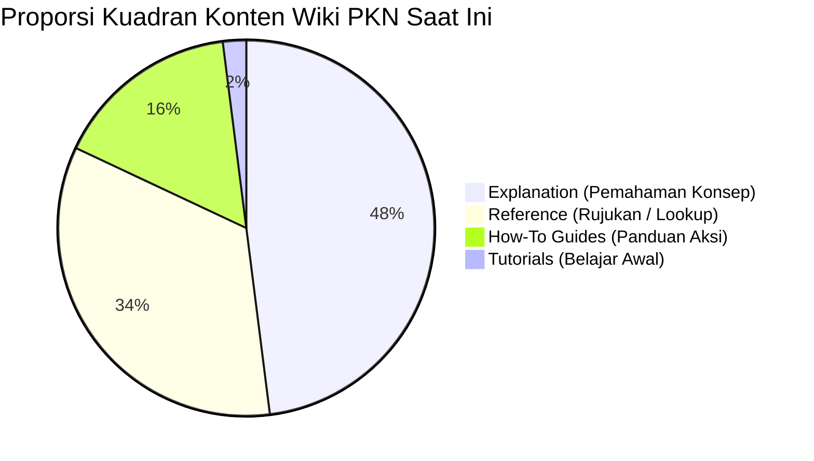
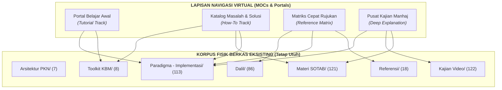

# 02 — Audit Model Diátaxis pada Korpus Wiki PKN
## *(Diátaxis Framework Audit & Quadrant Balancing Strategy)*

**Status:** Dokumen evaluasi arsitektur konten. Disusun berdasarkan pedoman arsitektur informasi [`DIATAXIS_PROGRESSIVE_DISCLOSURE.md`](../pipeline_designs/DIATAXIS_PROGRESSIVE_DISCLOSURE.md) dan sensus struktural 482 berkas Markdown di direktori `content/`.

---

## 1. Konteks dan Metodologi Diátaxis

Kerangka kerja **Diátaxis** (dipopulerkan oleh Daniele Procida) membagi dokumentasi teknis dan sistem pengetahuan ke dalam empat kuadran berdasarkan dua sumbu utama:
1. **Sumbu Pembelajaran vs. Pekerjaan** (*Learning* vs. *Working*)
2. **Sumbu Praktik vs. Teori** (*Practical* vs. *Theoretical*)

```text
               PRAKTIK (Practical step)
                         │
      TUTORIALS          │      HOW-TO GUIDES
   (Belajar Awal)        │    (Menyelesaikan Masalah)
                         │
PEMBELAJARAN ────────────┼──────────── PEKERJAAN
(Acquisition)            │             (Application)
                         │
      EXPLANATION        │        REFERENCE
 (Pemahaman Konsep)      │    (Rujukan Fakta / Lookup)
                         │
               TEORI (Theoretical knowledge)
```

Tujuan evaluasi ini adalah memetakan apakah korpus Wiki PKN saat ini telah melayani keempat kuadran tersebut secara proporsional, ataukah terjadi ketimpangan kognitif yang memicu keluhan pengguna mengenai susunan konten yang "membingungkan dan sulit dinavigasi".

---

## 2. Sensus Distribusi Kuadran Korpus Eksisting (482 Berkas)

Berdasarkan analisis karakteristik isi dan fungsi 482 berkas Markdown yang aktif saat ini, berikut adalah perkiraan distribusi kuadran Diátaxis di seluruh direktori repositori:

| Direktori Korpus | Total Berkas | Tutorials (Belajar Awal) | How-To Guides (Panduan Aksi) | Reference (Rujukan/Lookup) | Explanation (Diskursus Teori) |
|---|:---:|:---:|:---:|:---:|:---:|
| `Arsitektur PKN/` | 7 | 1 (14%) | 0 (0%) | 1 (14%) | 5 (72%) |
| `Paradigma - Implementasi/` | 113 | 5 (4%) | 12 (11%) | 46 (41%) | 50 (44%) |
| `Toolkit KBM/` | 8 | 1 (12%) | 7 (88%) | 0 (0%) | 0 (0%) |
| `Dalil/` | 86 | 0 (0%) | 0 (0%) | 86 (100%) | 0 (0%) |
| `Materi SOTAB/` | 121 | 2 (2%) | 38 (31%) | 5 (4%) | 76 (63%) |
| `Kajian Video/` | 122 | 0 (0%) | 15 (12%) | 8 (7%) | 99 (81%) |
| `Referensi/` | 18 | 0 (0%) | 2 (11%) | 15 (83%) | 1 (6%) |
| `Root content/` (Indeks) | 7 | 1 (14%) | 1 (14%) | 5 (72%) | 0 (0%) |
| **TOTAL KORPUS** | **482** | **~10 (2.1%)** | **~75 (15.6%)** | **~166 (34.4%)** | **~231 (47.9%)** |

> **Catatan Metodologi:** Klasifikasi di atas didasarkan pada intensi struktural dokumen. Berkas seperti lembar asesmen atau profil bakat TB-40 dihitung sebagai *Reference*; transkrip kajian video dan artikel manhaj dihitung sebagai *Explanation*; panduan penanganan kasus, SOP, dan RPP dihitung sebagai *How-To*; panduan langkah pemula dihitung sebagai *Tutorials*.

---

## 3. Analisis 4 Kuadran dan Gejala Friksi Pengguna



### Kuadran 1: Tutorials (Orientasi Belajar Awal) — *Defisit Kritis (2.1%)*
* **Karakteristik Saat Ini:** Hanya ada ~10 berkas yang menyediakan orientasi dasar bertahap (seperti pengantar fase usia di `Thufulah.md` atau `Peta Navigasi Wiki PKN.md`). Beranda utama langsung menyodorkan peta arsitektur 12 pilar.
* **Gejala Friksi (`[INFERENCE]`):**
  - Orang tua baru yang belum mengenal istilah PKN mengalami *cognitive overload*. Mereka tidak tahu urutan membaca yang benar (harus mulai dari Tauhid, Fitrah, atau Fase Usia?).
  - Tidak ada *onboarding track* (misal: "Panduan 7 Hari Memahami Pola Asuh Nabawiyah").
* **Kebutuhan Desain:** Diperlukan halaman gerbang khusus (*Starter Tracks / Hub Pembelajaran Pemula*) yang memandu pembaca langkah demi langkah dari nol tanpa asumsi pengetahuan awal.

---

### Kuadran 2: How-To Guides (Panduan Aksi Riil) — *Fragmentasi Materi (15.6%)*
* **Karakteristik Saat Ini:** Konten panduan aksi riil sebenarnya cukup kaya (~75 berkas), namun tersebar acak di tiga tempat:
  1. `Toolkit KBM/` (RPP, Lembar Observasi, Prompt AI, Bank Cerita Sirah).
  2. `Materi SOTAB/` (Studi kasus spesifik seperti anak mogok shalat, kecanduan gadget, penanganan tantrum).
  3. `Paradigma/.../Recovery.md` & `Panduan RPP dan Observasi Lapangan.md`.
* **Gejala Friksi (`[INFERENCE]`):**
  - Guru mencari instrumen kelas, tetapi harus membuka folder `Toolkit KBM/` lalu mengecek apakah ada RPP di dalam subfolder `Paradigma/`.
  - Orang tua mencari tips respon saat anak bertengkar dengan saudara, tetapi judul artikel di SOTAB menggunakan judul buletin majelis yang puitis atau metaforis (misal: *"Menyemai Benih di Ladang Kering"* alih-alih *"Panduan Mengatasi Pertengkaran Antar Saudara"*).
* **Kebutuhan Desain:** Pengelompokan How-To berbasis katalog masalah nyata (*Problem-Solution Mapping*) dan penambahan metadata alias pencarian.

---

### Kuadran 3: Reference (Rujukan Faktual & Lookup) — *Kaya tapi Terisolasi (34.4%)*
* **Karakteristik Saat Ini:** Kuadran ini sangat kokoh (166 berkas). Meliputi 86 halaman dalil mandiri Al-Qur'an dan Hadits, 40 halaman instrumen Bakat Nabawiyah (TB-40), Glosarium, Review Buku, dan Master Katalog.
* **Gejala Friksi (`[INFERENCE]`):**
  - Halaman dalil mandiri di `content/Dalil/` sangat lengkap takhrijnya, namun pembaca umum merasa halaman ini "kering" atau sekadar ensiklopedia terputus jika tidak disertai ringkasan hikmah pedagogis 2–3 kalimat di awal.
  - Halaman instrumen TB-40 (40 berkas bakat) tertanam di kedalaman 6 level folder, sehingga guru yang ingin mencari indikator bakat *"Al-Himmah"* kesulitan melakukan bookmark langsung dari menu utama.
* **Kebutuhan Desain:** Direktori rujukan harus dipertahankan kedalaman takhrijnya, namun dihadirkan melalui tabel indeks cepat (*Quick Index / Lookup Matrix*) yang dapat disaring dengan 1 klik dari beranda.

---

### Kuadran 4: Explanation (Diskursus Pemahaman Mendalam) — *Dominasi Konten (47.9%)*
* **Karakteristik Saat Ini:** Hampir separuh korpus (231 berkas) adalah pemikiran konseptual, syarah manhaj, bedah buku, dan transkrip panjang ceramah video (122 video) serta buletin filosofis SOTAB (76 buletin).
* **Gejala Friksi (`[INFERENCE]`):**
  - Pembaca yang membutuhkan jawaban cepat dalam 30 detik (misal: "Berapa batas usia tamyiz?") harus membaca 4.000 kata transkrip kajian video.
  - Artikel explanation memiliki nilai akademis tinggi, tetapi jika dijadikan tampilan utama bagi semua pengunjung, wiki terkesan seperti arsip teks akademis yang berat.
* **Kebutuhan Desain:** Terapkan prinsip **Progressive Disclosure** (MediaWiki 4-Zone):
  1. Letakkan ringkasan eksekutif (*TL;DR / Infobox*) di Zone 2 paling atas.
  2. Simpan pembahasan mendalam, transkrip ceramah, dan diskursus filosofis di bagian badan tulisan (H2/H3) dan Zone 3.

---

## 4. Matriks Distribusi Ideal vs. Kondisi Nyata

| Kuadran Diátaxis | Kondisi Nyata Saat Ini | Proporsi Sasaran Ideal | Tindakan Rekayasa Konten |
|---|:---:|:---:|---|
| **Tutorials** *(Belajar Awal)* | **2.1%** (~10 berkas) | **~10%** | Bangun **Jalur Mulai Belajar (Onboarding Hubs)** untuk Orang Tua Pemula & Guru Baru. |
| **How-To Guides** *(Panduan Aksi)* | **15.6%** (~75 berkas) | **~25%** | Satukan indeks panduan masalah (*Problem Hubs*) di KBM & Pengasuhan Rumah. |
| **Reference** *(Rujukan Faktual)* | **34.4%** (~166 berkas) | **~30%** | Buat matriks penyaring interaktif (Katalog Dalil & 40 Bakat TB-40 Lookup). |
| **Explanation** *(Diskursus Teori)* | **47.9%** (~231 berkas) | **~35%** | Beri ringkasan eksekutif (*Lead Section TL;DR*) dan hubungkan ke aksi riil. |

---

## 5. Strategi Penyeimbangan Tanpa Merusak Struktur Berkas (*Non-Destructive Balancing*)

Untuk menyeimbangkan kuadran Diátaxis tanpa memindahkan berkas fisik (yang berisiko mematahkan tautan `[[WikiLinks]]` eksisting dan merusak slug URL), Wiki PKN akan menggunakan strategi **Virtual Layering (MOCs & Navigation Hubs)**:



### 3 Pilar Implementasi Redaksional:
1. **Hub Tematik (Maps of Content / MOC):** Membuat halaman indeks kurasi per tema besar yang mengelompokkan pranala dokumen ke dalam 4 kotak Diátaxis (misal: Halaman MOC *Fase Tamyiz* memuat: (1) Panduan Memahami Tamyiz [Tutorial], (2) Cara Melatih Shalat Usia 7-10 Tahun [How-To], (3) Dalil Hadits Muruu Awladakum [Reference], dan (4) Syarah Hakikat Tamyiz & Akal [Explanation]).
2. **Standardisasi Zone 2 (TL;DR Lead Section):** Memastikan setiap artikel konseptual memiliki ringkasan 2–3 poin di awal agar pembaca yang butuh *How-To* tidak terjebak dalam *Explanation* panjang.
3. **Pemberian Tag Kuadran (#diataxis):** Menambahkan tagar fungsional pada berkas Markdown masa depan (`#diataxis/tutorial`, `#diataxis/howto`, `#diataxis/reference`, `#diataxis/explanation`) guna mendukung penyaringan pencarian otomatis.
