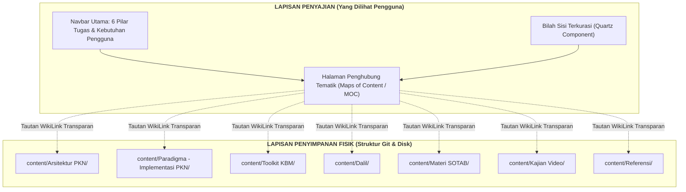
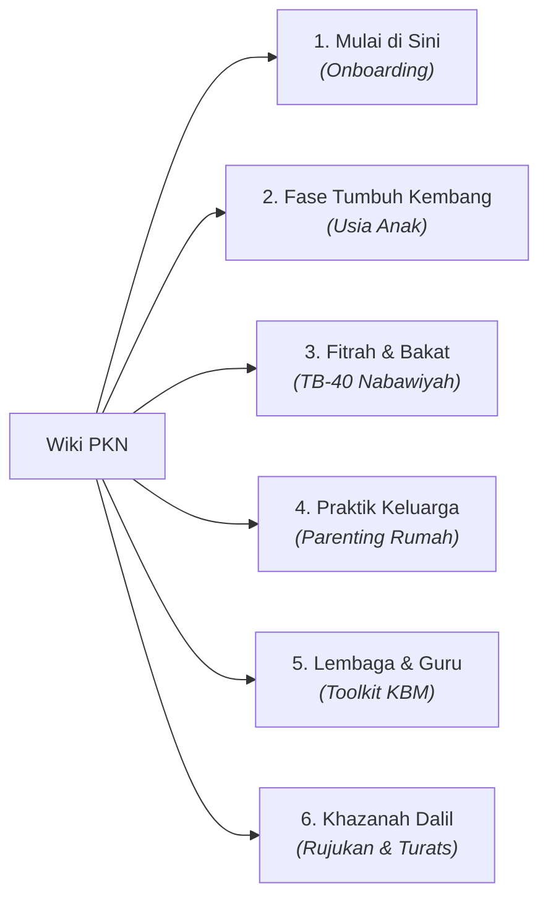

# 03 — Usulan Arsitektur Informasi dan Taksonomi Navigasi
## *(Proposed Information Architecture & Dual-Layer Navigation Taxonomy)*

**Status:** Cetak biru desain (*design blueprint*). Usulan penataan navigasi berbasis tugas (*task-oriented*) dengan prinsip **non-destruktif** (mempertahankan struktur berkas fisik, tautan `[[WikiLinks]]`, dan integritas slug URL Quartz).

---

## 1. Prinsip Utama: Arsitektur Ganda (*Dual-Layer Architecture*)

Untuk menyelesaikan keluhan pengguna tanpa menimbulkan risiko kerusakan teknis (*broken links* pada 482 berkas), Wiki PKN menerapkan pemisahan antara **Lapisan Penyimpanan Fisik** (*Storage Layer*) dan **Lapisan Penyajian Navigasi** (*Presentation Layer*):



### 3 Kaidah Operasional:
1. **Zero Path Breaking:** Tidak ada file markdown yang dipindahkan posisinya di dalam direktori `content/` secara massal. Semua URL permalink tetap stabil dan terindeks dengan baik.
2. **Task-Oriented Mental Model:** Pengelompokan visual didasarkan pada *apa yang ingin dicapai pengguna* (mendidik anak usia 7 tahun, membuat RPP, menguji hadits), bukan *dari mana file tersebut diimpor* (apakah transkrip video atau buletin SOTAB).
3. **Progressive Disclosure:** Pengguna diarahkan terlebih dahulu ke halaman rangkuman tematik (*Topic Hub / MOC*), sebelum menyelam ke berkas referensi detail atau transkrip panjang.

---

## 2. Enam Pilar Taksonomi Pintu Masuk (*Top-Level Facets*)

Navigasi tingkat atas diusulkan disederhanakan menjadi **6 Pilar Pintu Masuk Berorientasi Tugas**:



---

### Pilar 1: 🌟 Mulai di Sini *(Jalur Orientasi Pemula / Onboarding Track)*
* **Target Persona:** [01 Orang Tua Pemula], [02 Guru Pelaksana Baru], pembaca awam.
* **Tujuan Pengguna:** Memahami gambaran besar PKN dalam 15 menit tanpa tersesat dalam istilah rumit.
* **Isi Pintu Masuk:**
  - **Peta Konsep 5 Menit:** Ringkasan trilogi insan, fitrah, dan manhaj nabawiyah.
  - **Jalur Belajar Berdasarkan Peran:**
    - *"Saya Orang Tua"* $\rightarrow$ Jalur membaca pondasi keluarga dan fase usia anak.
    - *"Saya Guru/Pendidik"* $\rightarrow$ Jalur memahami adab murid, RPP, dan observasi bakat.
    - *"Saya Pegiat Dakwah/Pengkaji"* $\rightarrow$ Jalur sanad dalil, buku kanonikal, dan manhaj.
  - **Glosarium Istilah Kunci:** Kamus cepat istilah arab dan konsep khas (*Syakilah, Muthmainnah, Taisir, Tadarruj, Qudwah*).

---

### Pilar 2: 👶 Fase Tumbuh Kembang *(Pedoman Berbasis Usia Anak)*
* **Target Persona:** [01 Orang Tua Pemula], [02 Guru Pelaksana], [04 Fasilitator Kajian].
* **Tujuan Pengguna:** Menemukan panduan, batasan syar'i, dan stimulasi karakter yang tepat untuk usia anak saat ini.
* **Sub-Kluster Tematik (MOC):**
  1. **Fase Janin & Shighar (0–2 Tahun):** Tarbiyah pra-lahir, masa penyusuan (*radha'ah*), kelekatan emosional ibu.
  2. **Fase Thufulah (2–7 Tahun):** Masa keemasan penanaman tauhid gembira, fitrah bermain, imitasi keteladanan tanpa paksaan formal.
  3. **Fase Tamyiz (7–10 Tahun):** Titik tolak pembedaan baik-buruk, penanaman disiplin shalat, penegakan adab dan tanggung jawab mandiri.
  4. **Fase Murahaqah (10–14 Tahun):** Masa pra-baligh, pemisahan tempat tidur, penguatan rasa malu, kesiapan memikul taklif syar'i.
  5. **Fase Baligh & Syabab (14+ Tahun):** Kematangan aqil baligh, kemandirian finansial & sosial, penjagaan syahwat, penyiapan peran peradaban.

---

### Pilar 3: 🧭 Fitrah & Bakat Nabawiyah *(Talents-Based 40)*
* **Target Persona:** [02 Guru Pelaksana], [01 Orang Tua Pemula], konselor bakat.
* **Tujuan Pengguna:** Mengidentifikasi keunikan bakat anak, menghindari salah asuh (*mislabelling*), dan memetakan jalan kontribusi (*syakilah*).
* **Sub-Kluster Tematik:**
  - **Pondasi Fitrah:** Fitrah Keimanan, Fitrah Belajar & Nalar, Fitrah Bakat, Fitrah Perkembangan.
  - **Matriks Asesmen 40 Bakat (TB-40):**
    - Penyaring Berbasis 4 Kluster Jiwa (Karakter Berpikir, Karakter Menggerakkan, Karakter Hubungan, Karakter Pelaksana).
    - Akses 1-Klik ke 40 Berkas Indikator Bakat (dari *01-himmah* hingga *40-ishlah*).
  - **Panduan Observasi Bakat:** Lembar kerja guru/orang tua dalam mengamati aktivitas berulang anak yang bernilai tinggi (*EASY, ENJOY, EXCELLENT, EARN*).

---

### Pilar 4: 🏡 Praktik Keluarga & Pengasuhan Rumah *(Parenting Hub)*
* **Target Persona:** [01 Orang Tua Pemula], [04 Fasilitator Kajian].
* **Tujuan Pengguna:** Memperbaiki dinamika komunikasi keluarga dan menangani masalah keseharian anak di rumah.
* **Sub-Kluster Tematik:**
  - **Pilar Pasutri & Rumah Tangga:** Sinergi Ayah (Visi & Ketegasan) dan Bunda (Sentuhan Kasih & Madrasah Pertama).
  - **Bahasa Hati & Komunikasi Jiwa:** Teknik dialog nabawiyah tanpa membentak (*Kalam Thayyib*).
  - **Katalog Solusi Masalah Harian (Problem-Solution):**
    - Panduan Anak Mogok Shalat.
    - Panduan Detoks Gadget & Layar Digital.
    - Penanganan Ledakan Emosi (Tantrum) & Pembangkangan.
    - Mengatasi Pertengkaran Saudara (*Sibling Rivalry*).
  - **Recovery Luka Pengasuhan:** Rekonsiliasi hutang pengasuhan masa lalu dan pemulihan trauma.
  - **Kartu Ringkasan WAG Siap Sebar:** Akses infografis satu halaman padat untuk dibagikan ke keluarga besar.

---

### Pilar 5: 🏫 Lembaga, Sekolah & Guru *(Pedagogi & KBM)*
* **Target Persona:** [02 Guru Pelaksana], [03 Pengelola Lembaga].
* **Tujuan Pengguna:** Mengintegrasikan kurikulum karakter nabawiyah ke dalam jam pelajaran, SOP sekolah, dan budaya asrama/kelas.
* **Sub-Kluster Tematik:**
  - **Filosofi Pendidikan Berbasis Fitrah:** Transformasi sekolah dari pabrik hafalan kognitif menjadi taman persemaian karakter.
  - **Toolkit KBM Siap Pakai:**
    - Templat Modul Ajar / RPP Berbasis Adab.
    - Lembar Observasi Karakter Lapangan.
    - Bank Cerita Sirah & Pertanyaan Pemantik Apersepsi.
    - Panduan Prompt AI Asisten Perancang Pembelajaran.
  - **Manajemen Lembaga:** Standar Rekrutmen Guru Berkarakter, Program Parenting Sekolah (SOTAB), dan SOP Disiplin Positif.

---

### Pilar 6: 📚 Khazanah Dalil & Rujukan Otoritatif *(Turats & Verifikasi)*
* **Target Persona:** [05 Penelaah Sumber], [04 Fasilitator Kajian], asatidzah/peneliti.
* **Tujuan Pengguna:** Menelusuri keshahihan dalil, sanad hadits, syarah ulama salaf, dan buku rujukan utama PKN.
* **Sub-Kluster Tematik:**
  - **Master Katalog Dalil Al-Qur'an:** Indeks ayat tarbiyah tematik.
  - **Master Katalog Dalil Hadits & Sunnah:** Indeks hadits nabawiyah bersumber Kutubus Sittah.
  - **Pencarian 86 Dalil Mandiri:** Direktori komprehensif berkas dalil bertakhrij.
  - **Kajian Buku Kanonikal:** Telaah kritis 8 buku rujukan karya Ustadz Abdul Kholiq dan ulama rujukan (Ibnu Qayyim, Al-Ghazali, dll.).
  - **Arsip Riset Dalil Tarbiyah (OpenBayan):** Dokumentasi kerja riset hadits turats internal.

---

## 3. Desain Halaman Penghubung Tematik (*Maps of Content / MOC*)

Setiap tema pokok pada 6 pilar di atas diwakili oleh sebuah halaman MOC (Hub). Format standar halaman MOC mengintegrasikan keempat kuadran Diátaxis dalam satu wadah:

```markdown
# Hub Tematik: [Nama Tema, misal: Fase Tamyiz (7–10 Tahun)]

> [!SUMMARY] Esensi 1 Menit
> Fase Tamyiz adalah gerbang transisi kemandirian nalar anak. Fokus utama: penegakan shalat secara gembira namun disiplin, diferensiasi benar-salah, serta pengenalan batasan aurat dan adab interaksi.

## 1. Panduan Memahami (Tutorials)
* [[Pengantar Memasuki Usia 7 Tahun]]
* [[Karakteristik Perkembangan Akal dan Emosi Tamyiz]]

## 2. Praktik di Rumah & Sekolah (How-To Guides)
* [[Panduan Menegakkan Shalat Tanpa Bentakan]]
* [[SOP Penanganan Anak yang Melanggar Aturan Kelas]]
* [[Bank Cerita Sirah untuk Mengajarkan Kejujuran pada Anak Tamyiz]]

## 3. Landasan Syar'i & Takhrij (Reference)
* [[Dalil Hadits Perintah Shalat Usia 7 dan 10 Tahun]]
* [[Dalil Hadits Pemisahan Tempat Tidur]]
* [[Indikator Bakat Al-Muthla'ah pada Anak Usia 7-10 Tahun]]

## 4. Pendalaman Filosofis & Syarah (Explanation)
* [[Syarah Konsep Tamyiz dalam Fiqih dan Tarbiyah]]
* [[Transkrip Kajian: Menghidupkan Nalar Kritis Anak Tamyiz]]
```

---

## 4. Penataan Komponen Quartz Engine

Untuk mewujudkan arsitektur ini tanpa coding ulang seluruh frontend Quartz:

1. **Header Navigation Links (`quartz.config.ts` / Layout):**
   Tambahkan 6 tautan langsung di bilah atas (*top navbar*) menuju masing-masing MOC 6 Pilar:
   `[Mulai] | [Fase Usia] | [Bakat TB-40] | [Keluarga] | [Guru & KBM] | [Dalil & Rujukan]`
2. **Sidebar Explorer Filtering:**
   Konfigurasikan bilah sisi kiri agar menampilkan 6 folder logis pilar (menggunakan *Quartz Virtual Folder* atau pengelompokan indeks), menyembunyikan kedalaman subfolder 5-level di balik menu *accordion* yang dapat dilipat (*collapsible*).
3. **Navbox MediaWiki di Bawah Halaman (Zone 4):**
   Gunakan komponen kotak navigasi terpadu di setiap akhir artikel untuk memungkinkan pembaca melompat ke artikel relevan dalam satu kluster tanpa harus kembali ke beranda.
