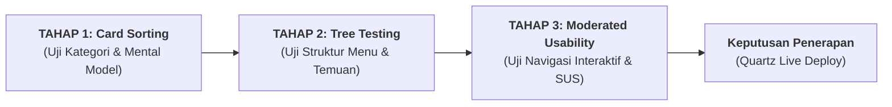

# 05 — Rencana Validasi Empiris dan Protokol Pengujian Pengguna
## *(Empirical Validation Protocol & IA Testing Roadmap)*

**Status:** Protokol pengujian metodologis (*testing roadmap*). Menjabarkan rencana pengujian empiris untuk mengonfirmasi atau merevisi hipotesis desain ([`persona/`](persona/README.md)) dan efektivitas usulan navigasi 6 pilar ([`03-usulan-arsitektur-informasi.md`](03-usulan-arsitektur-informasi.md)) sebelum diterapkan secara permanen pada Quartz wiki.

---

## 1. Landasan Metodologi: Dari Hipotesis Menuju Data Empiris

Sesuai catatan pemilik proyek dan deklarasi pada indeks persona, seluruh persona dan usulan taksonomi saat ini berstatus **hipotesis desain (`[INFERENCE]`)**. 

Untuk menjamin bahwa restrukturisasi konten benar-benar menyelesaikan kebingungan pengguna tanpa menciptakan friksi baru, evaluasi dilakukan dalam 3 tahap pengujian berstandar industri UX:



---

## 2. Tahap 1: Pengujian Card Sorting (Penyortiran Kartu)

### Tujuan:
Menguji apakah label kategori dan pengelompokan yang dipikirkan pengguna selaras dengan 6 pilar taksonomi yang diusulkan.

### Metodologi:
1. **Open Card Sorting (Sesi Terbuka):**
   - 15 peserta diminta mengelompokkan 50 kartu artikel (daftar kartu pada bagian 5) ke dalam grup yang menurut mereka masuk akal, lalu memberi nama pada masing-masing grup tersebut.
   - Luaran: *Similarity Matrix* dan *Dendrogram Clustering* untuk melihat pola pengelompokan alami.
2. **Closed Card Sorting (Sesi Tertutup):**
   - 15 peserta lain diminta menempatkan 50 kartu artikel ke dalam 6 kategori pilar yang telah ditetapkan:
     `[1. Mulai di Sini]`, `[2. Fase Usia]`, `[3. Bakat TB-40]`, `[4. Praktik Keluarga]`, `[5. Guru & KBM]`, `[6. Dalil & Rujukan]`.
   - Luaran: *Card Placement Agreement Rate* (tingkat kecocokan penempatan kartu $\ge 80\%$).

---

## 3. Tahap 2: Pengujian Pohon Navigasi (Tree Testing)

### Tujuan:
Mengukur seberapa mudah pengguna menemukan materi spesifik hanya dengan menyusuri pohon kategori teks (tanpa bantuan bilah pencarian dan tanpa pengaruh tata letak visual UI).

### 10 Skenario Tugas Uji (*Task Scenarios*):
Peserta diberikan skenario nyata dan diminta mengklik cabang kategori hingga menemukan halaman tujuan:

1. **Tugas 1 (Orang Tua):** *"Anak Anda berusia 4 tahun sering melempar mainan saat marah. Di mana Anda mencari panduan merespon ledakan emosi balita?"*
   - *Jalur Sukses:* `Fase Usia` $\rightarrow$ `Fase Thufulah (2-7 Tahun)` $\rightarrow$ `Menangani Ledakan Emosi/Tantrum`.
2. **Tugas 2 (Orang Tua):** *"Anda ingin mengetahui batas usia seorang anak boleh dikenai sanksi fisik ringan dalam shalat."*
   - *Jalur Sukses:* `Praktik Keluarga` (atau `Fase Usia`) $\rightarrow$ `Batas Toleransi & Disiplin Syar'i`.
3. **Tugas 3 (Guru):** *"Anda ditugaskan mengajar materi sains tentang siklus air dan membutuhkan cerita Sirah Nabawiyah untuk pembuka kelas."*
   - *Jalur Sukses:* `Lembaga & Guru` $\rightarrow$ `Toolkit KBM` $\rightarrow$ `Bank Cerita Sirah dan Apersepsi KBM`.
4. **Tugas 4 (Guru):** *"Anda ingin mencocokkan santri yang memiliki bakat 'Al-Himmah' (kemauan kuat) dengan instrumen observasi perilakunya."*
   - *Jalur Sukses:* `Fitrah & Bakat TB-40` $\rightarrow$ `Katalog 40 Bakat Nabawiyah` $\rightarrow$ `01-Himmah`.
5. **Tugas 5 (Guru):** *"Anda membutuhkan format resmi modul ajar KBM yang menyisipkan nilai adab."*
   - *Jalur Sukses:* `Lembaga & Guru` $\rightarrow$ `Toolkit KBM` $\rightarrow$ `Templat RPP Berbasis Adab`.
6. **Tugas 6 (Pengelola):** *"Sekolah Anda ingin mengadakan pertemuan bulanan wali murid untuk penyelarasan adab di rumah."*
   - *Jalur Sukses:* `Lembaga & Guru` $\rightarrow$ `Program SOTAB Lembaga`.
7. **Tugas 7 (Fasilitator):** *"Anda mengisi kajian tentang batasan pergaulan anak pubertas dan butuh rujukan dalil pemisahan tempat tidur."*
   - *Jalur Sukses:* `Fase Usia` (atau `Khazanah Dalil`) $\rightarrow$ `Fase Murahaqah` $\rightarrow$ `Dalil Pemisahan Tempat Tidur`.
8. **Tugas 8 (Fasilitator):** *"Anda ingin mengunduh materi infografis ringkas untuk dibagikan ke grup WhatsApp peserta kajian."*
   - *Jalur Sukses:* `Praktik Keluarga` $\rightarrow$ `Kartu Ringkasan WAG Siap Sebar`.
9. **Tugas 9 (Penelaah):** *"Anda ingin memeriksa status keshahihan hadits 'Muruu awladakum bish-shalah' beserta nomor riwayat Kutubus Sittah."*
   - *Jalur Sukses:* `Khazanah Dalil & Rujukan` $\rightarrow$ `Master Katalog Dalil Hadits`.
10. **Tugas 10 (Pemula):** *"Anda baru pertama kali mendengar istilah 'Syakilah' dan ingin mengetahui arti resminya."*
    - *Jalur Sukses:* `Mulai di Sini` $\rightarrow$ `Glosarium Istilah Karakter Nabawiyah`.

---

## 4. Tahap 3: Uji Ketergunaan Terpandu (Moderated Usability Testing)

### Profil Peserta Uji:
Total 15 partisipan riil yang terbagi rata sesuai persona:
- 4 Orang Tua (2 memiliki anak balita, 2 memiliki anak usia SD/SMP)
- 4 Guru / Pendidik Sekolah Dasar & Menengah
- 2 Kepala Sekolah / Pengelola Pesantren
- 3 Pemateri Kajian / Da'i
- 2 Asatidzah Peneliti Dalil

### Metrik Kuantitatif & Standar Kelulusan (*Pass Criteria*):

| Metrik Evaluasi | Definisi Operasional | Target Kelulusan Desain Baru | Baseline Lama (Estimasi) |
|---|---|:---:|:---:|
| **Task Completion Rate (TCR)** | Persentase tugas yang berhasil diselesaikan tanpa bantuan fasilitator | **$\ge 85\%$** | ~50% |
| **Directness Score** | Persentase peserta yang menempuh jalur benar tanpa *backtracking* (salah klik) | **$\ge 75\%$** | ~30% |
| **Time on Task (ToT)** | Waktu rata-rata yang dihabiskan untuk menemukan target materi | **$< 60$ detik** per tugas | > 150 detik |
| **System Usability Scale (SUS)** | Kuesioner standar 10 pertanyaan kepuasan ketergunaan (skala 0–100) | **$\ge 80.0$** *(Grade A / Excellent)* | < 60.0 *(Marginal)* |
| **Single Ease Question (SEQ)** | Evaluasi kemudahan setelah tiap tugas (skala 1–7) | **Rata-rata $\ge 5.8$** | ~3.5 |

---

## 5. Bank 50 Kartu Uji (*Card Sorting Inventory*)

Berikut adalah 50 sampel materi representatif dari 482 berkas wiki yang digunakan dalam pengujian:

```text
[KARTU ONBOARDING & MANHAJ]
01. Peta Navigasi Wiki PKN
02. Glosarium Istilah Karakter Nabawiyah
03. Hakikat Insan dan Tujuan Hidup
04. Tiga Lapisan Jiwa (Ammarah, Lawwamah, Muthmainnah)
05. 4 Kaidah Implementasi PKN

[KARTU FASE USIA ANAK]
06. Pendidikan Anak dalam Kandungan (Janin)
07. Panduan Fase Thufulah (2-7 Tahun)
08. Disiplin Shalat Fase Tamyiz (7-10 Tahun)
09. Menyiapkan Kesiapan Baligh Fase Murahaqah (10-14 Tahun)
10. Kematangan Aqil Baligh dan Kemandirian Pemuda (14+ Tahun)
11. Batas Toleransi dan Sanksi Disiplin Berdasarkan Usia

[KARTU BAKAT & FITRAH TB-40]
12. Konsep Fitrah Keimanan dan Nalar Belajar
13. Kuisioner Asesmen 40 Bakat Nabawiyah
14. Bakat 01: Al-Himmah (Daya Juang & Visi)
15. Bakat 08: Al-Idarah (Manajemen & Keteraturan)
16. Bakat 15: Al-Fashahah (Komunikasi & Retorika)
17. Bakat 22: Ash-Shabr (Ketahanan & Ketekunan)
18. Bakat 31: Al-Adl (Keadilan & Penengah)
19. Lembar Observasi Indikator Bakat Siswa di Kelas

[KARTU PRAKTIK KELUARGA & PARENTING]
20. Sinergi Peran Ayah dan Peran Bunda
21. Teknik Komunikasi Jiwa (Bahasa Hati)
22. Panduan Mengatasi Ledakan Emosi dan Tantrum
23. Menghentikan Kecanduan Layar Gadget pada Anak
24. Menangani Pertengkaran dan Iri Hati Antar Saudara
25. Recovery Luka Pengasuhan dan Rekonsiliasi Orang Tua
26. Infografis Kartu Ringkasan Materi PKN Siap Sebar (WAG)
27. Buletin SOTAB: Mengapa Anak Menolak Nasehat Orang Tua?

[KARTU GURU, KBM & SEKOLAH]
28. Templat RPP Berbasis Adab dan Karakter
29. Lembar Observasi Karakter Harian Siswa
30. Panduan Prompt AI untuk Asisten Perancang KBM
31. Bank Cerita Sirah dan Apersepsi KBM
32. Standar Ekosistem dan Iklim Sekolah Nabawiyah
33. Kaidah Pedagogis KH. Abdullah Syukri Zarkasyi
34. SOP Penanganan Pelanggaran Santri Berbasis Hukuman Mendidik
35. Kurikulum Pembiasaan Adab Sebelum Ilmu

[KARTU DALIL & RUJUKAN OTORITATIF]
36. Master Katalog Dalil Al-Qur'an
37. Master Katalog Dalil Hadits dan Sunnah
38. Dalil Perintah Shalat Anak Usia 7 dan 10 Tahun (Abu Dawud 495)
39. Dalil Pemisahan Tempat Tidur Anak (Hadits)
40. Dalil Hakikat Syakilah (QS. Al-Isra: 84)
41. Dalil Kelekatan Ibu dan Radha'ah (QS. Al-Baqarah: 233)
42. Dalil Larangan Membentak Anak Yatim dan Kaum Lemah
43. Review Buku: Tuhfatul Maudud (Ibnu Qayyim)
44. Review Buku: Ihya Ulumuddin (Al-Ghazali)
45. Review Buku: Manhaj Pendidikan Islam (Muhammad Quthb)
46. Laporan Riset Hadits Tarbiyah Turats (OpenBayan)

[KARTU KAJIAN VIDEO & AUDIO]
47. Transkrip Video: Menghidupkan Fitrah Belajar Tanpa Paksaan
48. Transkrip Video: Kunci Kesabaran Ayah dalam Mendidik
49. Transkrip Video: Membedah Tamyiz dan Aqil Baligh
50. Transkrip Video: Menghindari Tafrith dan Ifrath dalam Pengasuhan
```

---

## 6. Tindak Lanjut Pasca Uji (*Action Triggers*)

1. **Jika Card Agreement Rate $\ge 80\%$ dan TCR $\ge 85\%$:**
   - Susunan 6 pilar dianggap valid.
   - Lanjutkan pembuatan halaman MOC induk dan konfigurasi layout Quartz (`quartz.layout.ts`).
2. **Jika Terdapat Kartu yang Ambigu (Agreement Rate $< 60\%$):**
   - Lakukan analisis kartu bermasalah (apakah label kartu membingungkan atau dokumen memiliki fungsi ganda).
   - Terapkan *Dual Placement via Cross-Links* di kedua hub yang relevan tanpa menduplikasi berkas fisik.
3. **Pembaruan Berkelanjutan:**
   - Tanamkan umpan balik ringan (*Was this page helpful? Yes/No*) di footer halaman wiki setelah peluncuran.
