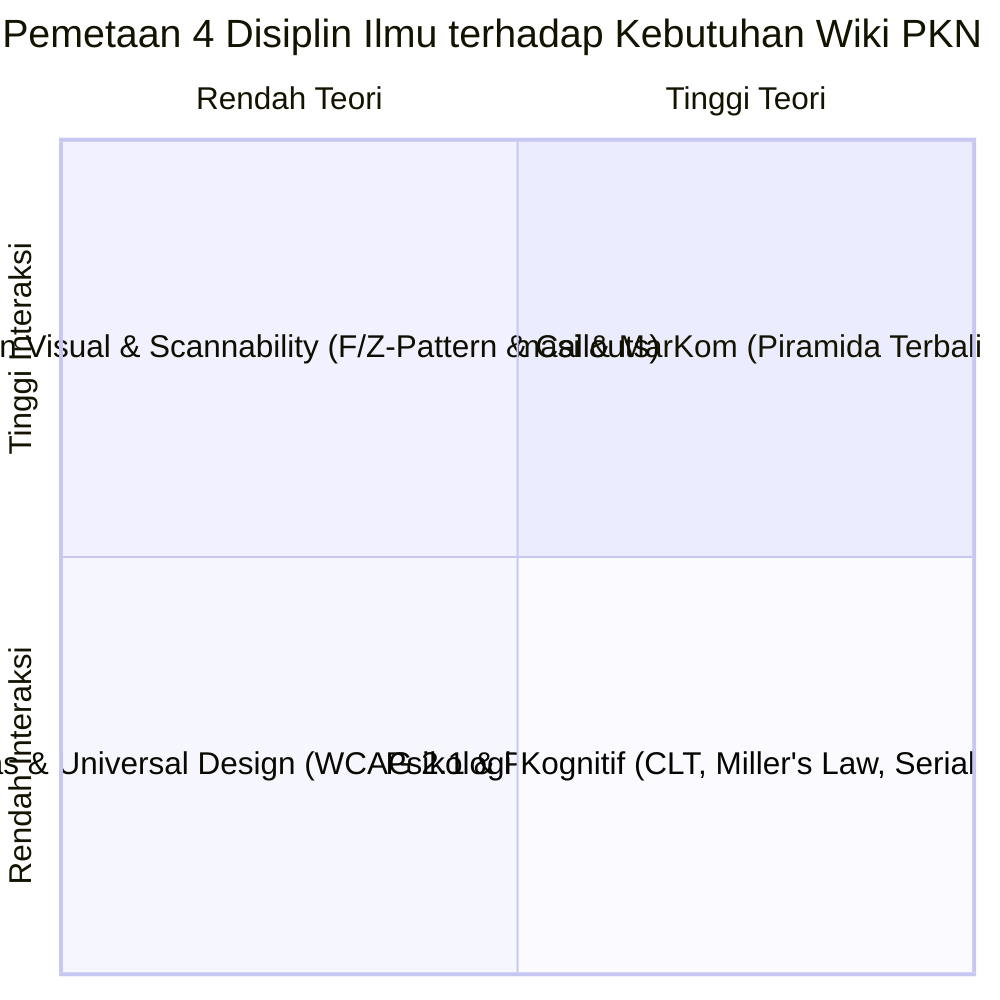
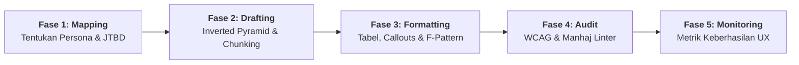

# 06 — Strategi Penulisan Interdisipliner dan Rencana Aksi Penerapan Persona
## *(Interdisciplinary Content Strategy & Persona Implementation Planning)*

**Status:** Rencana aksi operasional dan pedoman perancangan konten (*Actionable Implementation Planning*). Mengintegrasikan 4 pilar keilmuan (**Psikologi Kognitif**, **Arsitektur Informasi & MarKom**, **Desain Visual**, dan **Aksesibilitas Universal**) ke dalam strategi penerapan 13 persona Wiki PKN.

---

## 1. Landasan Interdisipliner dalam Ekosistem Persona PKN

Menata konten untuk 13 kelompok persona tidak cukup hanya dengan membagi folder, melainkan harus merancang **pengalaman kognitif** (*cognitive experience*) agar informasi terserap dengan cepat, akurat, dan minim beban mental (*extraneous load*).



Setiap persona memiliki kondisi psikologis dan konteks membaca yang unik:
* **Ayah & Ibu:** Membaca saat lelah setelah bekerja atau mengasuh anak $\rightarrow$ butuh *Chunking*, *Zero-Fluff*, dan *Callout Ringkas*.
* **Guru (Thufulah s.d. Syabab):** Membaca saat terburu-buru menyiapkan kelas $\rightarrow$ butuh *Pola F-Scanning*, *Tabel Komparatif*, dan *Ordered Lists*.
* **Pengelola Lembaga:** Membaca untuk rapat kebijakan $\rightarrow$ butuh *Piramida Terbalik*, *Hierarki Semantik*, dan *Matriks Regulasi*.
* **Siswa/Santri & Masyarakat Umum:** Membaca melalui ponsel pintar $\rightarrow$ butuh *Plain Language*, *Curiosity Loops*, dan *Tipografi Responsif*.

---

## 2. Pilar 1: Rekayasa Beban Kognitif (*Cognitive Load Engineering*)

Berdasarkan *Cognitive Load Theory* (Sweller), kapasitas memori kerja manusia (*working memory*) sangat terbatas. Wiki PKN menekan *extraneous load* (beban akibat tata letak yang buruk) melalui tiga prinsip psikologi kognitif:

### 2.1 Penerapan *Chunking* & Hukum Miller ($7 \pm 2$ dan $4 \pm 1$)
* **Aturan Paragraf:** Batasi satu paragraf maksimal **3 hingga 4 kalimat** (maksimal 50–70 kata). Paragraf dinding teks (*wall of text*) dilarang.
* **Jeda Mental (Micro-Headings):** Sisipkan sub-judul deskriptif (H3/H4) setiap **150–200 kata** untuk memberikan ruang bernapas bagi otak pembaca.
* **Kapasitas Pilihan Menu:** Batasi kelompok opsi navigasi maksimal **5–7 butir** dalam satu tingkat menu sidebar atau daftar indeks.

### 2.2 *Serial Position Effect* (Efek Primasi dan Resensi)
Otak manusia mengingat informasi di awal (*primacy*) dan di akhir (*recency*) jauh lebih kuat dibanding bagian tengah.
* **Primacy Rule:** Tempatkan rangkuman eksekutif, jawaban langsung, atau definisi inti pada **Zone 2 Lead Section / Callout TL;DR** di paragraf paling pertama.
* **Recency Rule:** Tempatkan rekomendasi tindakan konkret, daftar tilik (*checklist*), atau ayat refleksi di **bagian akhir artikel** sebelum catatan kaki.

### 2.3 Hukum Hick (*Hick’s Law*)
Waktu pengambilan keputusan meningkat seiring bertambahnya jumlah opsi.
* **Tautan Keluar Terkurasi:** Jangan memasang tautan `[[WikiLinks]]` secara acak pada setiap kata. Batasi hanya pada kata kunci utama yang relevan secara kontekstual.
* **Sidebar yang Terlipat (*Collapsible*):** Sembunyikan kedalaman subfolder 5-level di balik menu akordion yang hanya terbuka saat diklik (*progressive disclosure*).

---

## 3. Pilar 2: Arsitektur Informasi & Pendekatan Nilai (*Zero-Fluff MarKom*)

Dalam sistem dokumentasi, komunikasi pemasaran berfokus pada **menjual kejelasan dan efisiensi waktu**.

```text
▲ PUNCAK PIRAMIDA   [TL;DR / Jawaban Langsung / Definisi Inti] -> 10 Detik Pertama
├── BATANG PIRAMIDA  [Skenario Nyata / Konteks Syar'i / Kaidah Adab] -> 2 Menit Membaca
└── DASAR PIRAMIDA   [Takhrij Hadits Lengkap / Sanad / Diskursus Turats] -> Riset Mendalam
```

### 3.1 Pola Piramida Terbalik (*Inverted Pyramid*)
* **Puncak (Zone 2 Lead):** Jawaban langsung atas pertanyaan persona. (Contoh: *"Fase Tamyiz dimulai usia 7 tahun dengan fokus pembiasaan shalat tanpa hukuman fisik"*).
* **Batang (Body H2/H3):** Pembahasan kaidah, hikmah pedagogis, dan tabel kontras perlakuan.
* **Dasar (Zone 3 Footnotes):** Rujukan kitab klasik, no riwayat hadits Shamela/Qdrant, dan teks matan Arab.

### 3.2 Prinsip *Zero-Fluff* (Anti-Basa-Basi)
* Hapus kalimat klise pembuka seperti: *"Di zaman modern yang serba cepat dan penuh tantangan ini..."* atau *"Seperti yang telah kita ketahui bersama..."*.
* Langsung masuk ke pokok bahasan dengan kalimat aktif: *"Mendidik anak usia tamyiz memerlukan tiga tahapan pembiasaan..."*.

### 3.3 *Curiosity Loops* & Tautan Silang Kontekstual
* Tautkan istilah teknis secara alami di dalam kalimat untuk memicu eksplorasi bertahap, misal: *"...membangun hubungan berbasis [[Bahasa Hati]] sebelum menegakkan aturan..."*.

---

## 4. Pilar 3: Desain Visual & Penguat Pemindaian (*Scannability*)

Riset pelacakan mata (*eye-tracking*) membuktikan bahwa pembaca online membaca dengan pola huruf **F** (artikel teks) atau pola huruf **Z** (halaman beranda/portal).

### 4.1 Optimalisasi Pola Pemindaian F & Z
* Letakkan **kata kunci penting pada 2 kata pertama** di setiap judul, sub-judul, dan butir daftar (*bullet points*).
* Contoh Lemah: *"Beberapa cara yang dapat dilakukan orang tua untuk menenangkan anak..."*
* Contoh Unggul (Pola F): *"Tenangkan Balita: Tiga langkah validasi emosi saat tantrum..."*

### 4.2 Standar Tipografi Keterbacaan
* **Panjang Baris Ideal:** 60–75 karakter per baris (diatur via CSS Quartz `max-width: 65ch` pada artikel teks).
* **Tinggi Baris (*Line-Height*):** $1.5$ – $1.6$ untuk memastikan kenyamanan mata saat membaca di layar gawai.

### 4.3 Tiga Elemen Penguat Pemindaian (*Scannability Enhancers*)

#### A. Tabel Komparatif Dua Kolom
Gunakan tabel kontras untuk membedakan kesalahan umum dengan pendekatan PKN di setiap naskah pilar:
```markdown
| 🔴 Kebiasaan Umum / Kekeliruan | ✅ Pendekatan Karakter Nabawiyah |
|---|---|
| Membentak saat anak menolak shalat | Mengajak dengan teladan wudhu riang |
| Memberikan sanksi fisik pada balita | Batas sanksi fisik hanya setelah 10 tahun |
```

#### B. Kotak Callout Standar MediaWiki
* `[!info] Ringkasan Eksekutif (TL;DR)` untuk pembaca cepat (10 detik).
* `[!warning] Batas Toleransi & Kehati-hatian` untuk rambu-rambu syar'i/keselamatan anak.
* `[!tip] Panduan Praktis KBM / Rumah` untuk resep tindakan instan.

#### C. Daftar Terurut vs. Tak Terurut
* Gunakan **Numbered List (1, 2, 3)** HANYA untuk instruksi berurutan kronologis (langkah SOP, tahapan wudhu).
* Gunakan **Bullet Points (•)** untuk atribut setara tanpa urutan waktu.

---

## 5. Pilar 4: Aksesibilitas Universal & Inklusi Digital (WCAG 2.1 AA)

Konten Wiki PKN harus dapat diakses secara merata oleh guru di daerah terpencil, orang tua dengan layar ponsel kecil, maupun pengguna perangkat pembaca layar (*screen reader*).

### 5.1 Semantik Heading Runtut
* Hierarki wajib: `H1` (Judul Halaman) $\rightarrow$ `H2` (Seksi Utama) $\rightarrow$ `H3` (Sub-topik).
* **Larangan Keras:** Melompati hierarki (misal dari H2 langsung loncat ke H4 atau H5 demi mengejar ukuran huruf visual). Jangan memakai teks tebal (`**teks**`) sebagai pengganti tag heading.

### 5.2 Rasio Kontras Warna
* Teks normal wajib memiliki rasio kontras minimal **$4.5:1$** terhadap latar belakang (latar terang maupun gelap/dark mode).
* Callout box tidak boleh menggunakan warna teks abu-abu pudar di atas latar pastel yang tidak lolos standar WCAG AA.

### 5.3 Bahasa Lugas (*Plain Language*) & Penjelasan Jargon
* Istilah khas manhaj (*Syakilah, Muthmainnah, Lawwamah, Taisir, Qudwah, Tadarruj*) **wajib** disertai penjelasan bahasa Indonesia lugas dalam tanda kurung pada kemunculan pertama, atau ditautkan langsung ke `[[Glosarium Istilah Karakter Nabawiyah]]`.

---

## 6. Kerangka Kerja 5-Fase Penerapan Konten Persona

Ketika seorang kontributor atau agen AI menulis atau menyunting artikel wiki, ikuti alur kerja 5-fase berikut:



### Fase 1: Pemetaan Sasaran (*Audience & Goal Mapping*)
* Tentukan siapa persona utama artikel ini (Ayah, Ibu, Guru Tamyiz, Pengelola Formal, dll.).
* Definisikan satu aksi nyata yang harus dapat dilakukan persona tersebut setelah 3 menit membaca.

### Fase 2: Penulisan Draf Piramida Terbalik (*Drafting & Chunking*)
* Tuliskan *Lead Summary* (TL;DR) pada paragraf pembuka.
* Pecah materi ke dalam blok-blok 3–4 kalimat per paragraf. Pasang sub-heading setiap 200 kata.

### Fase 3: Desain Visual & Penguatan Scan (*Formatting & Scannability*)
* Sisipkan minimal 1 tabel komparatif (`🔴 vs ✅`).
* Bungkus tips penting atau batasan syar'i dalam callout box berstandar.
* Pastikan kata kunci penting berada di awal kalimat (*Front-loading keywords*).

### Fase 4: Validasi Aksesibilitas, Kognitif & Manhaj (*Pre-Publish Audit*)
* Cek urutan heading (H1 $\rightarrow$ H2 $\rightarrow$ H3 tanpa loncatan semantik).
* **Audit Kognitif Cepat (Pipeline 11):** Jalankan `python3 scripts/hybrid_quality_scorer.py --file <path>` untuk memverifikasi Inverted Pyramid, Zero-Fluff, Scannability, dan batas panjang kalimat ($Score \ge 70.0$, latensi $< 0.2$ detik).
* **Audit Korpus & Kosakata:** Jalankan linter korpus (`python3 scripts/wiki_corpus_linter.py`) untuk memastikan integritas tautan (0 broken links) dan ketiadaan kosa kata terlarang manhaj.
* Rujuk spesifikasi lengkap pada [`11_hybrid_quality_evaluation_system_one.md`](../pipeline_designs/11_hybrid_quality_evaluation_system_one.md).

### Fase 5: Evaluasi Metrik Keberhasilan (*UX Success Metrics*)
* **Search Success Rate:** Pengguna menemukan halaman target dalam 1–2 kali pencarian.
* **Quality Time on Page:** Pembaca menelusuri artikel secara wajar (2–4 menit) tanpa langsung mental (*low bounce rate*).
* **Reduksi Pertanyaan Berulang:** Berkurangnya pertanyaan mendasar dari wali murid atau guru di forum komunitas karena informasi di wiki sudah mandiri dan jelas.

---

## 7. Matriks Penerapan Standar per Kluster Persona

| Kluster Persona | Beban Kognitif Utama | Standar Penulisan Prioritas | Format Tampilan Sasaran |
|---|---|---|---|
| **01a. Ayah / Bapak** | Keterbatasan waktu & lelah kerja | *Zero-Fluff*, Primacy Lead, Hick's Law | Infografis WAG, Poin Aksi 3 Menit |
| **01b. Ibu / Bunda** | *Caregiver burnout* & stres harian | *Chunking* pendek, Bahasa Hati, Callout Tips | Dialog Nyata, Rangkuman Penenang Jiwa |
| **02a-e. Guru KBM (Semua Fase)** | Ketergesaan persiapan kelas | F-Pattern Scanning, Ordered Lists | Templat RPP, Lembar Observasi Siap Cetak |
| **03a. Pengelola Lembaga Formal** | Tekanan birokrasi & regulasi | Inverted Pyramid, Tabel Matriks, H2 Semantik | SOP Kebijakan, Dokumen KOSP Adab |
| **03b. Pengelola Non-Formal** | Desain kurikulum mandiri | Tautan Kontekstual Sirah, Rujukan Manhaj | Portofolio Karakter, Kontrak Kemitraan |
| **06. Siswa & Santri** | Rentang atensi pendek (*Gen-Z*) | Plain Language, Bullet Points, Mobile Responsive | Kuis Mandiri TB-40, Kartu Inspirasi |
| **07. Masyarakat Umum** | Pencarian makna & luka batin | Serial Position, Empati, Jeda Mental (Chunking) | Refleksi Jiwa, Bagan Anatomi Hati |

---

## 8. Panduan Integrasi Teknis pada Quartz Engine

Untuk memastikan standar di atas berlaku secara otomatis pada build Quartz:
1. **Konfigurasi SCSS (`quartz/styles/custom.scss`):**
   * Terapkan `max-width: 68ch` pada `.article-content` untuk membatasi panjang baris 60–75 karakter.
   * Pastikan `line-height: 1.6` pada teks paragraf dan `font-weight: 600` pada 2 kata pertama sub-heading.
2. **Standardisasi Callout CSS:**
   * Pastikan rasio kontras background callout terhadap teks warna gelap/terang memiliki rasio minimal $4.5:1$.
3. **Penyaringan Otomatis Linter (`scripts/wiki_corpus_linter.py`):**
   * Pertahankan pengujian otomatis untuk mendeteksi heading yang melompat (misal H2 langsung ke H4) dan kalimat yang terlalu panjang tanpa jeda tanda baca.
