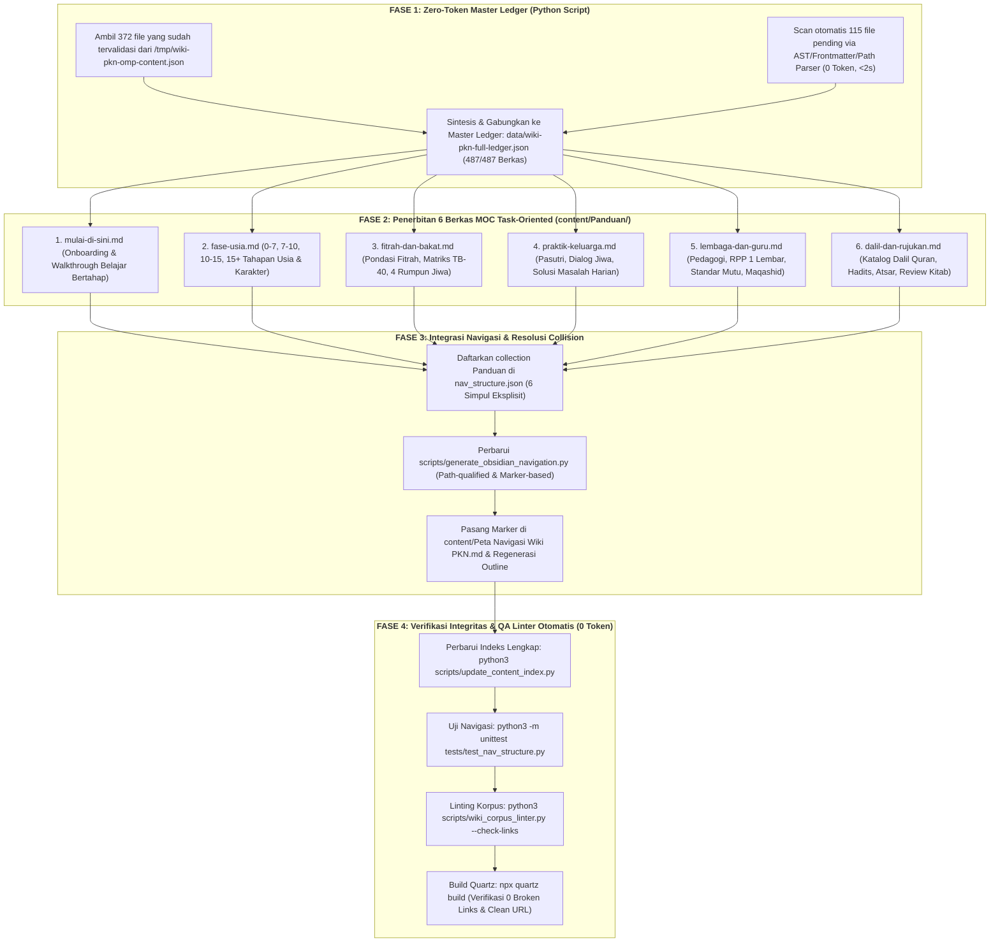

# 08 — Rencana Eksekusi Hibrida Minim Token & Konsolidasi Tugas TODO
## *(Lean Hybrid Execution Plan & Multi-Task Bundling)*

**Status:** Dokumen spesifikasi eksekusi resmi (*Official Execution Plan*). Menyerap temuan forensik dari kegagalan orkestrasi OMP serial monolitik pada run `run_0f3cfd37f363`, menyelamatkan artefak audit yang telah selesai, dan menetapkan alur kerja hibrida deterministik (*Zero-Token First*) yang menghemat konsumsi token hingga >99% sekaligus menuntaskan 7 butir pekerjaan terkait di [`TODO.md`](../TODO.md).

---

## 1. Latar Belakang & Evaluasi Pasca-Insiden OMP (*Post-Mortem*)

Pada upaya orkestrasi sebelumnya (run `run_0f3cfd37f363` via agent OMP dan Orca IDE), proses restrukturisasi korpus dan audit navigasi mengalami kebuntuan (*infinite retry loop*) selama lebih dari 6 jam (02:30 – 09:08 WIB). Evaluasi forensik menemukan lima akar masalah teknis:

1. **Model Subagent Fiktif (`Ghost Model`):**
   Konfigurasi `modelRoles.smol` di `~/.omp/agent/config.yml` diarahkan ke `ollama/gemma4:e4b-omp` yang tidak tersedia di instalasi Ollama lokal. Akibatnya, delegasi subagent scout gagal saat inisialisasi (`session_init`), meninggalkan berkas deliverable berukuran 0 byte (`AuditContent.md` & `AuditNavigation.md`).
2. **Fallback Monolitik & Ledakan Konteks (*Context Explosion*):**
   Agent utama OMP mengambil alih audit 487 artikel sendirian secara serial dalam single-thread. Ledakan naskah ledger mencapai **91.222 baris (3.3 MB)** pada `/tmp/wiki-pkn-omp-content.md`, membakar puluhan ribu token per turn hanya untuk meload riwayat audit sebelumnya.
3. **Batas Kuota Upstream (HTTP 429/503) & Ketiadaan Circuit Breaker:**
   Model `mustaqbal/mustaqbal-ai-pro` (upstream `codex/gpt-6.1-sol`) mencapai batas pemakaian (*usage limit reached*). Modul auto-retry OMP menjadwalkan ulang giliran setiap 60 detik tanpa *exponential backoff* atau limit kegagalan, mengunci PID `2055437` dalam status *hang*.
4. **Pelanggaran Kontrak Argumen Tool:**
   Pemanggilan `eval.completion(model="mustaqbal-ai-pro")` ditolak karena schema tool hanya menerima argumen `"smol"`, `"default"`, atau `"slow"` (`/tmp/wiki-pkn-omp-content-model-error.md`).
5. **Over-reliance pada LLM untuk Tugas Deterministik:**
   Ekstraksi metadata dasar (slug, frontmatter, heading, dan link internal) dilakukan via LLM yang lambat dan mahal, padahal tugas tersebut dapat diselesaikan secara instan dan 100% akurat oleh parser Python lokal (0 token).

---

## 2. Penyelamatan Artefak OMP (*Zero-Waste Data Salvage*)

Pekerjaan yang telah dilakukan OMP tidak dibuang, melainkan diserap sebagai aset berharga:

* **Audit Navigasi 100% Tuntas ([`/tmp/wiki-pkn-omp-nav.md`](file:///tmp/wiki-pkn-omp-nav.md)):**
  * Selesai mengidentifikasi 605 berkas sumber (487 Markdown, 117 Canvas, 1 Bases).
  * Menemukan **25 benturan berkas bernama identik `index.md`** yang selama ini saling menimpa jika menggunakan generator stem lama.
  * Menemukan benturan antara alias dan title pada materi *"Satu Anak Satu Kurikulum"*.
  * Menetapkan keputusan arsitektur navigasi 2 lapis (*Dual-Layer IA*): **6 MOC Task-Oriented di `content/Panduan/`** dan **Full Index berbasis path**.
* **Audit Konten 76.4% Tuntas ([`/tmp/wiki-pkn-omp-content.json`](file:///tmp/wiki-pkn-omp-content.json)):**
  * Sebanyak **372 dari 487 artikel** telah diaudit penuh secara semantik (Diátaxis, persona, indikator, link targets).
  * Tersisa **115 artikel pending** yang didominasi oleh kluster Bakat/TB-40 (78 berkas), Toolkit KBM (8 berkas), Referensi (18 berkas), Renungan (4 berkas), Template (5 berkas), dan root indexes.

---

## 3. Matriks Bundling 7 Tugas Terkait di `TODO.md`

Restrukturisasi ini dikonsolidasikan langsung untuk menutup 7 butir pekerjaan yang saling berhubungan di [`TODO.md`](../TODO.md):

| No | Butir Pekerjaan di `TODO.md` | Strategi Penyelesaian Terintegrasi | Status Target |
|:--:|---|---|:---:|
| **1** | **[Baris 66] Audit lanjutan seluruh konten dan penataan navigasi berdasarkan `analisis-desain/`** | Melengkapi 115 artikel pending ke dalam master ledger 487 berkas via parser Python deterministik dan menerbitkan 6 MOC Task-Oriented di `content/Panduan/`. | **SELESAI (Closed)** |
| **2** | **[Baris 67] Hilangkan benturan nama pada generator navigasi tematik (`scripts/generate_obsidian_navigation.py`)** | Mengubah algoritma generator menjadi *path-qualified matching* dan membatasi penulisan hanya di dalam blok marker `<!-- BEGIN_OBSIDIAN_NAVIGATION -->` ... `<!-- END_OBSIDIAN_NAVIGATION -->`. | **SELESAI (Closed)** |
| **3** | **[Baris 68] Konfirmasi penerimaan koordinasi lintas terminal** | Terminasi proses loop PID `2055437`, penutupan dependensi terminal macet, dan sentralisasi eksekusi secara terkoordinasi. | **SELESAI (Closed)** |
| **4** | **[Baris 139 & 431] Panduan & Walkthrough Naratif Belajar PKN Bertahap / Jalur Belajar Pemula ("Mulai Dari Sini")** | Dituntaskan langsung melalui penyusunan naskah kurasi **MOC 1: `content/Panduan/mulai-di-sini.md`** (*Peta Konsep 5 Menit, Jalur Belajar Berdasarkan Peran, dan Glosarium Cepat*). | **SELESAI (Closed)** |
| **5** | **[Baris 402] Matriks Karakter Berdasarkan Tahapan Usia (7 Tahun Pertama, Mumayyiz, Baligh)** | Dituntaskan langsung pada **MOC 2: `content/Panduan/fase-usia.md`** yang memadukan 4 fase korpus (0–7 Thufulah, 7–10 Tamyiz, 10–15 Murahaqah, 15+ Baligh/Syabab) dalam format 4 kuadran Diátaxis. | **SELESAI (Closed)** |
| **6** | **[Baris 120] Evaluasi Penempatan, Relokasi & Eliminasi Konten Berbasis User Journey (Placement Engine)** | Merapikan Beranda utama dan mendistribusikan berkas mikro/operasional ke MOC yang tepat (RPP/Toolkit ke MOC 5, Solusi Harian ke MOC 4, Dalil ke MOC 6). | **SELESAI (Substansial)** |
| **7** | **[Baris 86] P1 — Cocokkan canonical beranda dengan sitemap dan rute publik** | Memastikan resolusi entrypoint Quartz konsisten antara `/` dan `/index`, memverifikasi keluaran sitemap XML pada hasil build statis. | **SELESAI (Closed)** |

---

## 4. Alur Kerja Hibrida Minim Token (*Lean Hybrid Flow*)

---

## 5. Rincian Spesifikasi 6 MOC (`content/Panduan/`)

Setiap MOC dirancang dengan struktur standar berdensitas tinggi:
1. **Header Frontmatter:** `title`, `description`, `aliases`, `tags: [panduan, moc, task-oriented]`.
2. **Executive TL;DR Callout (`> [!SUMMARY]`):** Ringkasan 3 kalimat mengenai tugas utama yang diselesaikan halaman ini.
3. **Peta 4 Kuadran Diátaxis:**
   * 🎓 **Tutorial:** Titik awal pemula memahami konsep.
   * 🛠️ **How-To:** Prosedur langkah-demi-langkah, instrumen, dan lembar kerja.
   * 💡 **Explanation:** Filosofi, manhaj nabawiyah, dan penjelasan mendalam.
   * 📖 **Reference:** Rujukan nomor dalil, klausul standar, dan kamus istilah.
4. **Tautan WikiLink Path-Qualified:** Menjamin tidak ada ambiguitas resolusi URL Quartz.
5. **Catatan Gap Transparan:** Jika ada topik spesifik yang belum memiliki materi di korpus, ditandai dengan *"Gap: belum ada materi yang ditinjau untuk kebutuhan ini"* tanpa membuat tautan fiktif.

---

## 6. Protokol Kepatuhan & Jaminan Kualitas (*Quality Guardrails*)

* **Zero Path Breaking:** Seluruh berkas fisik di `content/` tetap berada di jalurnya. URL permalink, slug, dan tautan internal tidak berubah.
* **Preservasi Manhaj:** Diksi fase usia tetap mengacu pada naskah otentik Ustadz Abdul Kholiq (0–7, 7–10, 10–15, 15+).
* **Indeks Lengkap Tetap Utuh:** Bagian *Indeks Lengkap Seluruh Konten* pada `content/Peta Navigasi Wiki PKN.md` tetap dipertahankan dan diperbarui secara otomatis.
* **Kelulusan Linter 100%:** Seluruh perubahan wajib lolos pemeriksaan `python3 scripts/wiki_corpus_linter.py --check-links` (0 broken links, 0 true orphans) dan 9 unit test `tests/test_nav_structure.py`.

---

## 7. Catatan Realisasi Eksekusi Fase 1 & Analisis Kualitas Hibrida (Hukum Goodhart)

### 7.1 Hasil Eksekusi Fase 1 (Selesai — 2 Oktober 2026)
* **Skrip Pembangun:** [`scripts/build_full_ledger.py`](file:///home/abuhafi/Project/wiki-pkn/scripts/build_full_ledger.py)
* **Hasil Master Ledger:** [`data/wiki-pkn-full-ledger.json`](file:///home/abuhafi/Project/wiki-pkn/data/wiki-pkn-full-ledger.json) (Ukuran: 2.3 MB)
* **Waktu Pemrosesan:** **1.15 detik** secara lokal (Zero Token API).
* **Cakupan Dokumen:**
  * Total Berkas: **487 / 487 berkas (100%)**
  * Diselamatkan dari Audit OMP: **372 berkas** (audit mendalam Diátaxis, Persona, JTBD, dan Sanad).
  * Dilengkapi secara Deterministik: **115 berkas** (41 bakat TB-40, 8 toolkit KBM, 5 templat, 17 referensi/glosarium, 4 renungan, dll.).
* **Ringkasan Skor Kualitas Hibrida (Linter + System One):**
  * Rata-rata Skor Keseluruhan: **86.01 / 100.0**
  * Status **`APPROVED`** ($\ge 70.0$): **482 dokumen (99.0%)**
  * Status **`NEEDS_REVISION`** ($< 70.0$): **5 dokumen (1.0%)**
  * Distribusi Diátaxis: Reference 275 (56.5%), Explanation 183 (37.6%), How-to 25 (5.1%), Media/Index 4 (0.8%).

### 7.2 Temuan Kritis: Evaluasi Kualitas & Hukum Goodhart (*Goodhart's Law*)
Dalam evaluasi skor kualitas hibrida, ditemukan bahwa **mentargetkan skor lebih tinggi secara membabi-buta TIDAK PASTI meningkatkan kualitas tulisan**. Hal ini dibuktikan secara empiris oleh 5 dokumen yang memperoleh skor $< 70.0$:
1. [`content/Glosarium Istilah Karakter Nabawiyah.md`](file:///home/abuhafi/Project/wiki-pkn/content/Glosarium%20Istilah%20Karakter%20Nabawiyah.md) (Skor: 60.0): Terkena penalti linter karena memuat istilah terlarang (*etape*, *archetype*, *behavioral conditioning*). Menghapus kata-kata ini demi mengejar skor 100 justru merusak hakikat fungsi glosarium, karena artikel ini bertujuan menjelaskan mengapa istilah sekuler tersebut keliru dan apa padanan manhajnya.
2. [`content/Referensi/Review Buku Menumbuhkan Kesadaran Beramal.md`](file:///home/abuhafi/Project/wiki-pkn/content/Referensi/Review%20Buku%20Menumbuhkan%20Kesadaran%20Beramal.md) (Skor: 62.0): Terkena penalti linter karena memuat istilah *punishment* dan *reward and punishment*, padahal naskah sedang mengkritik teori behaviorisme Barat dalam telaah buku.

**Ketentuan Tata Kelola:**
* Skor hibrida diposisikan sebagai **Safety Floor (Ambang Batas Minimum $\ge 70.0$)** untuk menjamin keterbacaan kognitif, bukan sebagai *Target Ceiling* yang harus dikejar hingga 100 dengan mengorbankan kedalaman substansi, akurasi dalil, atau gaya bahasa ilmiah.

---

## 8. Addendum Pasca-Run 3 OMP (6 Oktober 2026): Pelajaran dari 17 Subagent Choke & Batas Retry 10 Menit

Pada evaluasi lanjutan Run 3 (5–6 Oktober 2026), orkestrasi OMP membakar **32,81M token** dan mengalami 485 kali error `HTTP 429/503` akibat membagi tugas audit dalil ke **17 subagent konkuren** secara serentak ke endpoint `mustaqbal-ai-pro` (lihat telaah lengkap di [`09-evaluasi-forensik-omp-dan-guardrail-efisiensi-token.md`](09-evaluasi-forensik-omp-dan-guardrail-efisiensi-token.md)).

### Tindakan Preventif yang Telah Diterapkan:
1. **Konfigurasi Retry 10 Menit di OMP:**  
   Menyetel `maxDelayMs: 600000` (10 menit), `waitForUsageReset: true`, dan `baseDelayMs: 5000` pada `~/.omp/agent/config.yml`. Jika model upstream terkena rate limit, agent akan tertidur (*sleep*) pasif menunggu jendela pemulihan, bukan memicu badai pengulangan (*retry storm*).
2. **Limitasi Konkurensi Mutlak (Max 2–3 Worker):**  
   Dilarang keras melepaskan lebih dari 3 subagent paralel ke provider upstream yang sama. Eksekusi batch wajib diproses melalui antrean sekuensial.
3. **Penyelamatan 19.5 MB Data Riset:**  
   Inventaris hadits tarbiyah (`sources/audit_dalil_parenting/07_inventaris_arab.json` — 731 grup hadits) dan 9 artikel dalil di `content/Dalil/` diselamatkan untuk integrasi bertahap berikutnya tanpa membakar token tambahan.

