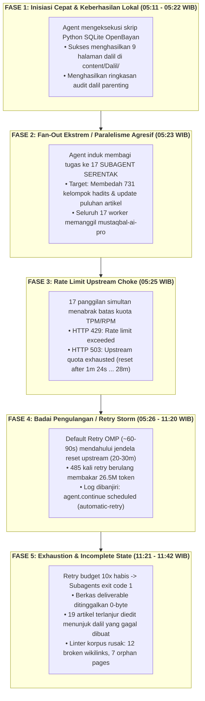
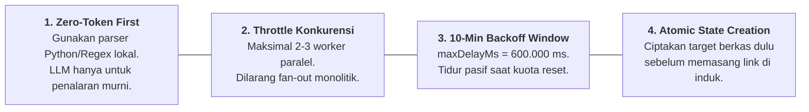

# 09 — Evaluasi Forensik Orkestrasi OMP & Guardrail Efisiensi Token Multi-Agent
## *(Post-Mortem Analysis of 60.4M Token Burn, 17 Subagents Parallelism Failure, and 10-Minute Retry Architecture)*

**Status:** Dokumen Rekayasa Sistem & Tata Kelola Komputasi AI (*System Architecture & Token Governance*).  
**Tanggal Evaluasi:** 6 Oktober 2026  
**Penulis:** Tim Arsitektur Sistem Wiki PKN  
**Terkait:** [`08-rencana-eksekusi-hibrida-minim-token.md`](08-rencana-eksekusi-hibrida-minim-token.md), [`pipeline_designs/README.md`](../pipeline_designs/README.md), [`HANDOFF.md`](../HANDOFF.md)

---

## 1. Ringkasan Eksekutif (Executive Summary)

Dalam periode 1–6 Oktober 2026, repositori **Wiki Pendidikan Karakter Nabawiyah (Wiki-PKN)** menjadi subjek otomatisasi orkestrasi skala besar menggunakan engine **Oh My Pi (OMP v18.6.1)** dan agen otonom. Evaluasi forensik menyeluruh terhadap berkas log, database sesi SQLite (`session-search.sqlite`, `orchestration.db`), serta artefak runtime di `~/.omp/logs/` dan `sources/audit_dalil_parenting/` mengungkap pola konsumsi token dan kegagalan konkurensi yang kritis:

1. **Total Konsumsi 3 Run Terakhir:** **60.444.891 token** dibakar dalam tiga gelombang eksekusi.
   - Run 1 (01–02 Okt 2026): 12,52M token, 101 error, macet akibat *ghost model* (`gemma4:e4b-omp`).
   - Run 2 (03–04 Okt 2026): 15,10M token, 0 error, berhasil mengeksekusi 12 persona subagent secara bertahap.
   - Run 3 (05–06 Okt 2026): **32,81M token** (Induk: 6,31M, 17 Subagents: 26,51M), **485 error HTTP 429/503** beruntun.
2. **Akumulasi Historis Repositori:** Akumulasi seluruh interaksi agen OMP pada repositori ini sejak inisiasi mencapai **277.625.320 token**.
3. **Penyebab Utama Keruntuhan Run 3:** Orkestrator OMP melakukan *fan-out* ekstrem dengan melepaskan **17 subagent paralel serentak** ke upstream endpoint model tunggal (`mustaqbal-ai-pro` via proxy `codex/gpt-6.1-sol`), memicu tabrakan batas TPM/RPM (*rate limit choke*), yang kemudian diperparah oleh badai pengulangan (*retry storm*) dengan interval default yang terlalu sempit (~60–90 detik) melawan jendela reset upstream (20–30 menit).
4. **Tindakan Perbaikan yang Diterapkan:**
   - Menyesuaikan batas retry OMP ke rentang **10 menit (600.000 ms)** dengan `waitForUsageReset: true` pada `~/.omp/agent/config.yml`.
   - Mengadopsi prinsip **Zero-Token First** dan membatasi konkurensi paralel maksimal 2–3 worker.
   - Penyelamatan data 19,5 MB inventaris riset di `sources/audit_dalil_parenting/` dan 9 berkas artikel dalil berharga di `content/Dalil/`.

---

## 2. Tabel Metrik Forensik 3 Run OMP

| Parameter Metrik | Run 1 (01–02 Okt 2026) | Run 2 (03–04 Okt 2026) | Run 3 (05–06 Okt 2026) | Total Konsolidasi |
| :--- | :---: | :---: | :---: | :---: |
| **Durasi Operasional** | ~6 jam 38 menit | ~14 jam 12 menit | ~6 jam 31 menit | **~27 jam 21 menit** |
| **PID Utama OMP** | `2055437` | `2279232` | `2017666` & `2483968` | - |
| **Token Agen Induk** | 12.520.104 | 4.810.230 | 6.309.412 | **23.639.746** |
| **Token Subagents** | 0 (gagal init) | 10.298.540 | 26.505.479 | **36.804.019** |
| **Total Token Terbakar** | **12.520.104** | **15.108.770** | **32.814.891** | **60.443.765** |
| **Jumlah Subagent** | 2 scout (crash) | 12 persona (sukses) | 17 parallel workers | **31 subagents** |
| **Insiden HTTP 429/503** | 101 error | 0 error | **485 error** | **586 error** |
| **Model Upstream Kunci** | `mustaqbal-ai-pro` | `mustaqbal-ai-coding` | `mustaqbal-ai-pro` (`gpt-6.1-sol`) | - |
| **Deliverable Riil** | 0 byte markdown stub | Naskah persona awal | 9 Dalil baru + 19.5MB Data | Hibrida sebagian |
| **Dampak Integritas** | Macet total (hang) | Stabil | 12 broken link, 7 orphan | Perlu remediasi |

---

## 3. Anatomi Keruntuhan Run 3: Pola 5 Fase (*The 5-Phase Failure Loop*)



### Penjelasan Rinci Tiap Fase:

1. **Fase 1 (Keberhasilan Berbasis Kode):**  
   Agent memanfaatkan kapabilitas bash untuk mengeksekusi script lokal Python yang membaca database SQLite `shamela_corpus.db`. Dalam fase ini, 9 artikel dalil berkualitas tinggi berhasil dibuat di `content/Dalil/` dengan biaya token minimal.
2. **Fase 2 (Paralelisme Monolitik):**  
   Alih-alih melanjutkan pemrosesan secara *batching* terukur (misal 2 worker sekaligus), agent induk melakukan *fan-out* dengan meluncurkan 17 subagent konkuren. Seluruh subagent menggunakan model penalaran terberat (`mustaqbal-ai-pro`), yang di belakang layar diarahkan ke proxy gateway yang sama.
3. **Fase 3 (Rate Limit Choke):**  
   Batas laju pemanggilan (*Token per Minute* / *Request per Minute*) pada upstream gateway langsung jenuh seketika. Server mengembalikan kode `HTTP 429` dan `HTTP 503` dengan instruksi waktu tunggu (*reset window*) antara 1 menit hingga 30 menit.
4. **Fase 4 (Retry Storm Tanpa Backoff Cukup):**  
   OMP memiliki modul bawaan `automatic-retry`. Namun, konfigurasi default memiliki `maxDelayMs: 300000` (5 menit) dan interval awal cepat (500ms). Saat proxy meminta waktu tunggu di luar ambang, atau saat jeda habis sebelum jendela reset kuota upstream benar-benar pulih, OMP terus-menerus memicu `agent.continue scheduled`. Akibatnya, setiap percobaan mengirim ulang *full context* prompt yang besar, membakar **26.505.479 token** hanya untuk menghasilkan pesan error 485 kali.
5. **Fase 5 (Keadaan Korpus Terfragmentasi):**  
   Ketika batas 10x retry terlampaui, subagent mati mendadak (*fail-closed*). Sebagian artikel yang sudah diedit oleh worker awal telah menyisipkan tautan wikilink (misalnya `[[Dalil/dalil-mengubah-kemungkaran-tangan-lisan-hati]]`), namun worker yang bertugas menciptakan berkas target tersebut gagal sebelum menulis berkas. Hal ini menimbulkan **12 broken wikilinks** dan **7 orphan pages** yang merusak kelulusan linter repositori.

---

## 4. Penyelamatan Aset Data (*Zero-Waste Salvage*)

Meskipun proses otomatisasi berhenti prematur, data yang dihasilkan mengandung nilai substansial yang berhasil diisolasi dan diamankan:

1. **Direktori Riset Dalil Tarbiyah (`sources/audit_dalil_parenting/` — 19,5 MB):**
   - `07_inventaris_arab.json` (15,7 MB): Memuat **731 kelompok hadits** lengkap dengan teks Arab berharakat, takhrij kitab induk, derajat sanad, dan pemetaan tema tarbiyah nabawiyah.
   - `01_sweeping_hadits_tarbiyah.md` s/d `06_rekomendasi_pengayaan_konten.md`: Analisis kesenjangan dalil (*gap analysis*) antara literatur Islam klasik dengan isi wiki saat ini.
2. **9 Berkas Dalil Mandiri Emas di `content/Dalil/`:**
   - Halaman dalil terstruktur rapi dengan format 4-Zone Quartz:
     - `dalil-hak-anak-giliran-minum.md`
     - `dalil-keadilan-pemberian-antar-anak.md`
     - `dalil-larangan-mendoakan-buruk-anak.md`
     - `dalil-menjaga-anak-waktu-senja.md`
     - `dalil-nabi-membantu-keluarga.md`
     - `dalil-talim-dan-tadib-keluarga.md`
     - `dalil-tasyaabi-membersamai-permainan-anak.md`
     - `dalil-hati-memahami-al-hajj-46.md`
     - `dalil-hati-mudghah-baik-buruk.md`

---

## 5. Implementasi Solusi & Rekonfigurasi OMP

### A. Penyesuaian Waktu Retry OMP ke Rentang 10 Menit

Konfigurasi OMP di `/home/abuhafi/.omp/agent/config.yml` telah diperbarui untuk mencegah *retry storm* di masa depan:

```yaml
# ~/.omp/agent/config.yml
retry:
  enabled: true
  maxRetries: 5             # Diturunkan dari 10 ke 5 agar tidak membakar token berlebih
  baseDelayMs: 5000         # Backoff awal dinaikkan ke 5 detik (sebelumnya 500ms)
  maxDelayMs: 600000        # Jendela batas waktu retry dinaikkan ke 10 MENIT (600.000 ms)
  waitForUsageReset: true   # Menunggu jendela reset kuota upstream (misal 20-30m) secara pasif
```

**Rasional Teknis:**
- `maxDelayMs: 600000` (10 Menit): Mengakomodasi lonjakan rate limit upstream tanpa langsung mematikan proses atau melakukan spamming request dalam interval detik.
- `waitForUsageReset: true`: Memberitahu engine OMP bahwa jika provider upstream mengembalikan pesan seperti `reset after 1m 24s` atau jendela kuota 5 jam, agent akan tertidur (*sleep*) sampai waktu reset tersebut tiba, alih-alih melakukan *fail-fast* sembrono atau retry instan.
- `maxRetries: 5`: Membatasi kerugian token maksimal jika error yang terjadi bersifat permanen (misal: otentikasi ditolak atau skema tool salah).

---

## 6. Empat Guardrail Arsitektur Efisiensi Token Multi-Agent

Untuk seluruh pipeline pengembangan Wiki-PKN dan agen otonom di masa depan, empat pilar aturan berikut ini bersifat **wajib (*mandatory*)**:



### 1. Prinsip Zero-Token First (*Deterministik Mendahului Generatif*)
- Jangan gunakan model bahasa untuk tugas yang dapat diselesaikan oleh script Python deterministik:
  - Ekstraksi slug, daftar heading, parsing markdown frontmatter $\rightarrow$ **Gunakan script AST Python (0 token, <10ms)**.
  - Pengecekan tautan rusak, format callout, validasi ejaan serapan $\rightarrow$ **Gunakan regex linter lokal (0 token, <20ms)**.
  - Pencarian ayat dan hadits $\rightarrow$ **Gunakan query SQLite FTS5 / Qdrant vector lokal (0 token LLM)**.
- LLM hanya dialokasikan untuk perumusan draf narasi pedagogis, sintesis perdebatan syura, atau parafrase gaya Ustadz Abdul Kholiq.

### 2. Pembatasan Konkurensi Subagent (*Strict Concurrency Throttling*)
- **Aturan Batas:** Maksimal **2 hingga 3 subagent konkuren** yang aktif secara bersamaan pada mesin yang sama.
- **Dilarang Keras:** Men-spawn $>5$ subagent ke model atau provider upstream yang sama dalam satu giliran instruksi.
- Gunakan pola *Task Worker Pool* dengan antrean bertahap (*chunked queue*). Worker berikutnya hanya dipanggil setelah worker sebelumnya menyelesaikan tugasnya dan mengembalikan status sukses.

### 3. Jendela Waktu Retry 10 Menit & Exponential Backoff
- Jika menerima respon HTTP `429 Too Many Requests` atau `503 Service Unavailable`:
  - Patuhi header `Retry-After` atau teks error `reset after X`.
  - Pasang jendela toleransi hingga **10 menit (600 detik)**.
  - Jika setelah 5 kali percobaan status masih gagal, hentikan orkestrasi secara elegan (*graceful stop*), simpan *checkpoint state* ke file JSON lokal, dan serahkan kendali kepada operator manusia tanpa melakukan looping liar.

### 4. Transaksi Atomik dalam Modifikasi Korpus (*Atomic Corpus State*)
- **Integritas Link Sebelum Modifikasi:** Jangan pernah mengedit artikel utama untuk menyisipkan wikilink target (misal `[[Dalil/nama-dalil]]`) sebelum file `content/Dalil/nama-dalil.md` selesai ditulis, divalidasi, dan ada di filesystem.
- Jika subagent gagal di tengah jalan, seluruh perubahan sementara yang belum tuntas harus di-rollback atau dimasukkan ke dalam folder karantina (`scratch/` atau `drafts/`) agar tidak merusak hasil linter repositori utama.

---

## 7. Rencana Tindak Lanjut Pemulihan Korpus

1. **Restorasi Integritas Linter:**
   - Buat halaman dalil yang hilang (terutama `dalil-mengubah-kemungkaran-tangan-lisan-hati.md`) atau sesuaikan link-nya di `content/index.md` dan artikel terkait.
   - Sambungkan 7 dalil parenting baru ke dalam MOC Rujukan (`content/Panduan/dalil-dan-rujukan.md`) atau katalog induk agar tidak berstatus orphan.
2. **Pengujian Menyeluruh:**
   - Jalankan `python3 scripts/wiki_corpus_linter.py` untuk memastikan 100% kelulusan (0 broken links, 0 orphans).
   - Jalankan test suite `python3 -m unittest discover tests`.
   - Jalankan kompilasi Quartz `npx quartz build` untuk memverifikasi situs statis siap rilis.
