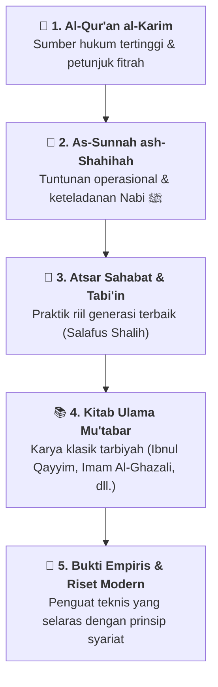

# 📜 Panduan Dalil & Kepustakaan Rujukan Karakter Nabawiyah

> [!SUMMARY] ⚡ Ringkasan Eksekutif
> Seluruh bangunan konsep, metode, dan instrumen dalam Pendidikan Karakter Nabawiyah bersumber dari wahyu Allah (Al-Qur'an al-Karim) dan petunjuk Nabi Muhammad ﷺ (As-Sunnah ash-Shahihah) yang dipahami oleh para Sahabat radhiyallahu 'anhum. Halaman ini menghimpun katalog dalil bertakhrij, telaah literatur rujukan kitab klasik, dan pustaka video kajian.

---

## 🏛️ Epistemologi Rujukan Manhaj PKN

Hierarki penerimaan ilmu dan penetapan kaidah dalam PKN tersusun secara berurutan:

---

## 📖 Katalog Dalil Bertakhrij

Wiki PKN menyajikan matan hadits berharakat, terjemahan, derajat takhrij, dan derivasi kaidah tarbiyah:

### 1. Master Hub Katalog Dalil
Akses direktori lengkap ratusan hadits nabawiyah tematik di **[[Master Katalog Dalil Hadits dan Sunnah|Master Katalog Dalil Hadits & Sunnah]]**.

### 2. Dalil Kunci Tematik Populer
* **Tiga Bahasa Pengasuhan & Tingkatan Mengubah Kemungkaran:** Landasan operasional Bahasa Hati, Lisan, dan Tangan dari HR. Muslim No. 49 di [[Dalil/dalil-mengubah-kemungkaran-tangan-lisan-hati|Dalil Mengubah Kemungkaran (Tangan, Lisan, Hati)]].
* **Perintah Shalat & Pentahapan Usia:** Takhrij lengkap hadits perintah shalat usia 7 tahun dan disiplin usia 10 tahun di [[Dalil/dalil-perintah-shalat-usia-7-dan-10|Dalil Perintah Shalat 7 & 10 Tahun]].
* **Musyawarah dalam Mendidik Remaja:** Telaah kisah Nabi Ibrahim dan Nabi Ismail dalam musyawarah akil baligh di [[Dalil/dalil-fase-murahaqah-musyawarah-ayah-anak|Dalil Musyawarah Ayah dan Anak]].
* **Kelembutan Pengasuhan (Ar-Rifq):** Hadits mengenai urgensi sikap lemah lembut dalam membangun kepatuhan sukarela di [[Dalil/dalil-bahasa-hati-kelembutan-ar-rifq|Dalil Kelembutan (Ar-Rifq)]].
* **Keadilan Pemberian Antar-Anak:** Hadits Nu'man bin Basyir mengenai pencegahan pilih kasih dan kecemburuan saudara di [[Dalil/dalil-keadilan-pemberian-antar-anak|Hadits Keadilan Pemberian Antar Anak]].
* **Proteksi Lingkungan & Penjagaan Anak:** Panduan menjaga anak pada awal malam dan benteng imunitas keluarga di [[Dalil/dalil-menjaga-anak-waktu-senja|Hadits Menjaga Anak pada Waktu Senja]].
* **Tanggung Jawab Pendidikan Keluarga:** Menjaga keluarga dari neraka via ta'lim dan ta'dib (Tafsir Ali bin Abi Thalib) di [[Dalil/dalil-talim-dan-tadib-keluarga|Ta'lim dan Ta'dib Keluarga: Tafsir At-Tahrim: 6]].
* **Membersamai Permainan Anak:** Tinjauan riwayat penyesuaian diri orang tua dengan dunia anak di [[Dalil/dalil-tasyaabi-membersamai-permainan-anak|Tasyaabi: Membersamai Permainan Anak]].

---

## 📚 Telaah Pustaka Rujukan & Kitab Klasik

Bagi santri, asatidz, dan peneliti yang ingin menelaah buku pegangan utama:

* **Review Buku Master PKN:** Telaah buku pedoman Pendidikan Karakter Nabawiyah karya Ustadz Abdul Kholiq di [[Referensi/Review Buku Pendidikan Karakter Nabawiyah|Review Buku Pendidikan Karakter Nabawiyah]].
* **Daftar Kitab Rujukan Klasik:** Inventaris kitab-kitab tarbiyah klasik (seperti *Tuhfatul Maudud bi Ahkamil Maulud* karya Ibnul Qayyim, *Ihya' Ulumiddin*, dll.) di [[Referensi/Referensi Tambahan Buku Cetak|Referensi Tambahan Buku Cetak]].
* **Kamus Istilah Manhaj:** Verifikasi istilah resmi syar'i agar terhindar dari percampuran konsep sekuler di [[Glosarium Istilah Karakter Nabawiyah|Glosarium Istilah Karakter Nabawiyah]].

---

## 🎥 Arsip Transkrip & Kajian Video

Untuk mempelajari pemaparan lisan dan rekaman daurah parenting:
* **Pusat Direktori Video PKN:** Telusuri lebih dari 120 transkrip video ceramah bertema spesifik di **[[Kajian Video|Pusat Kajian Video PKN]]**.

---

## 📐 Peta 4 Kuadran Diátaxis untuk Dalil & Rujukan

* 🎓 **Tutorial:** [[Referensi/Review Buku Pendidikan Karakter Nabawiyah|Cara Menelaah Sistematika Buku Karakter Nabawiyah]]
* 🛠️ **How-To:** [[Glosarium Istilah Karakter Nabawiyah|Mencari Padanan Istilah Karakter Nabawiyah yang Sahih]]
* 💡 **Explanation:** [[Dalil/dalil-bahasa-hati-kelembutan-ar-rifq|Penjelasan Hikmah Mengapa Kelembutan Menghiasi Segala Sesuatu]]
* 📖 **Reference:** [[Master Katalog Dalil Hadits dan Sunnah|Daftar Matan Lengkap Hadits-Hadits Shahih Tarbiyah]]

---

> [!NOTE] Catatan Takhrij & Penelitian Berkelanjutan
> Takhrij hadits dalam wiki ini merujuk pada kitab-kitab induk hadits (*Kutubus Sittah*) dan penilaian para ulama hadits mu'tabar (seperti Syaikh Al-Albani rahimahullah). Telaah komparatif kitab-kitab klasik lainnya terus diperkaya secara bertahap oleh dewan perumus konten.
