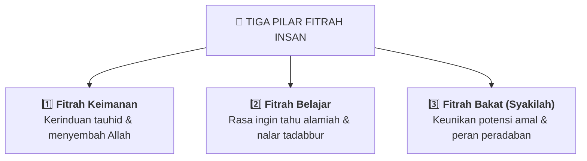

# 🎯 Panduan Fitrah & Penelusuran Bakat Nabawiyah (TB-40)

> [!SUMMARY] ⚡ Ringkasan Eksekutif
> Dalam manhaj Nabawiyah, setiap insan dilahirkan dengan fitrah dan susunan potensi unik (*syakilah*). Bakat bukanlah label kemampuan untuk kepentingan bisnis semata, melainkan amanah modal amal shalih untuk menegakkan peradaban Islam. Gunakan panduan ini untuk mengamati, memetakan, dan menyalurkan 40 pilar bakat syar'i (**TB-40**).

Pendidikan karakter nabawiyah memandang penelusuran bakat (*TB-40*) dan fitrah sebagai proses organik yang bertahap sepanjang fase usia anak—mulai dari penumbuhan keimanan di fase Thufulah, penajaman adab dan nalar di fase Tamyiz, hingga eksplorasi peran peradaban mandiri di fase Murahaqah dan Syabab. Pendekatan ini mengedepankan prinsip wasathiyah agar pendampingan tidak jatuh pada kelalaian (*tafrith*) maupun pemaksaan berlebihan (*ifrath*).

---

## 🧭 Tiga Pilar Fitrah Insan

Pendidikan karakter berpusat pada penumbuhan tiga dimensi fitrah yang telah Allah tiupkan ke dalam setiap jiwa:

* **Fitrah Keimanan:** Fondasi tauhid yang tidak boleh dibebani doktrin rumit di usia dini. Baca selengkapnya di [[Paradigma - Implementasi PKN/Dokumen Pendidikan Karakter Nabawiyah/Paradigma & Implementasi/Insan/Fitrah (Karakter)/index|Fondasi Fitrah Karakter Insan]].
* **Fitrah Belajar:** Naluri eksplorasi tanpa paksaan. Belajar bermula dari peristiwa nyata, bukan sekadar hafalan verbalistik. Pelajari di [[Paradigma - Implementasi PKN/Dokumen Pendidikan Karakter Nabawiyah/Paradigma & Implementasi/Insan/Fitrah (Karakter)/Belajar|Hakikat Fitrah Belajar]].
* **Fitrah Bakat:** Pola pikir, perasaan, dan perilaku alami yang berulang serta dapat dimanfaatkan untuk produktivitas amal kebajikan.

---

## 🏛️ Enam Rumpun Bakat Nabawiyah

Ke-40 pilar bakat nabawiyah dikelompokkan ke dalam 6 rumpun fungsional:

| Rumpun Bakat | Definisi & Kecenderungan Karakter | Contoh Pilar TB-40 | Tautan Uraian Konseptual |
|---|---|---|---|
| **Bekerja Keras** | Daya tahan fisik, keuletan, ketangguhan menyelesaikan tugas hingga tuntas. | Himmah (Daya Juang), Nashath (Kegigihan) | [[Paradigma - Implementasi PKN/Dokumen Pendidikan Karakter Nabawiyah/Paradigma & Implementasi/Insan/Fitrah (Karakter)/Bakat/Bekerja Keras\|Rumpun Bekerja Keras]] |
| **Bekerja Sama** | Keluwesan menjalin ukhuwah, sinergi tim, diplomasi, dan kerukunan sosial. | Ulfah (Kerekatan Hati), Ta'awun (Tolong Menolong) | [[Paradigma - Implementasi PKN/Dokumen Pendidikan Karakter Nabawiyah/Paradigma & Implementasi/Insan/Fitrah (Karakter)/Bakat/Bekerja Sama\|Rumpun Bekerja Sama]] |
| **Berperasaan** | Kelembutan empati, kepekaan batin, sensitivitas rasa keadilan dan keindahan. | Rifq (Kelembutan), Syaja'ah (Keberanian Batin) | [[Paradigma - Implementasi PKN/Dokumen Pendidikan Karakter Nabawiyah/Paradigma & Implementasi/Insan/Fitrah (Karakter)/Bakat/Berperasaan\|Rumpun Berperasaan]] |
| **Berpikir** | Nalar analitis, kedalaman riset, perancangan strategis, dan tadabbur hikmah. | Fithnah (Kecerdasan Tajam), Bashirah (Wawasan Batin) | [[Paradigma - Implementasi PKN/Dokumen Pendidikan Karakter Nabawiyah/Paradigma & Implementasi/Insan/Fitrah (Karakter)/Bakat/Berpikir\|Rumpun Berpikir]] |
| **Melayani** | Keramahan dalam memudahkan urusan orang lain, ketulusan khidmah sesama mukmin. | Khidmah (Pelayanan), Itsar (Mendahulukan Orang Lain) | [[Paradigma - Implementasi PKN/Dokumen Pendidikan Karakter Nabawiyah/Paradigma & Implementasi/Insan/Fitrah (Karakter)/Bakat/Melayani\|Rumpun Melayani]] |
| **Memerintah** | Kepemimpinan wibawa, ketegasan mengambil keputusan, kemampuan menggerakkan umat. | Qiyadah (Kepemimpinan), Hazm (Ketegasan Kebijakan) | [[Paradigma - Implementasi PKN/Dokumen Pendidikan Karakter Nabawiyah/Paradigma & Implementasi/Insan/Fitrah (Karakter)/Bakat/Memerintah\|Rumpun Memerintah]] |

---

## 📋 Katalog 40 Pilar Bakat (TB-40) & Pangkalan Data

Wiki PKN memuat direktori lengkap definisi, dalil pendukung, indikator perilaku, dan panduan fasilitasi untuk ke-40 pilar bakat syar'i:

* 📚 **Pusat Indeks Profil TB-40:** Akses seluruh profil dari nomor 01 hingga 40 di **[[Paradigma - Implementasi PKN/Dokumen Pendidikan Karakter Nabawiyah/Paradigma & Implementasi/Insan/Fitrah (Karakter)/Bakat/TB40/index|Katalog Lengkap 40 Pilar Bakat TB-40]]**.
* 🌐 **Pangkalan Data Format Obsidian Base:** Bagi pengguna aplikasi desktop Obsidian, gunakan pangkalan data relasional di `Paradigma & Implementasi/Insan/Fitrah (Karakter)/Bakat/TB40.base`.

---

## 🛠️ Instrumen Asesmen & Observasi Lapangan

Untuk mengenali bakat anak atau santri di lingkungan keluarga dan sekolah:

1. **Kuisioner Evaluasi Diri & Santri:** Gunakan instrumen baku di [[Paradigma - Implementasi PKN/Dokumen Pendidikan Karakter Nabawiyah/Paradigma & Implementasi/Insan/Fitrah (Karakter)/Bakat/Kuisioner Asesmen 40 Bakat Nabawiyah|Kuisioner Asesmen 40 Bakat Nabawiyah]].
2. **Panduan Observasi Guru & Orang Tua:** Pelajari kaidah pengamatan aktivitas spontan anak di [[Paradigma - Implementasi PKN/Dokumen Pendidikan Karakter Nabawiyah/Paradigma & Implementasi/Insan/Fitrah (Karakter)/Bakat/Panduan Asesmen dan Observasi TB40|Panduan Asesmen dan Observasi Lapangan TB-40]].

---

## 📐 Peta 4 Kuadran Diátaxis untuk Fitrah & Bakat

* 🎓 **Tutorial:** [[Paradigma - Implementasi PKN/Dokumen Pendidikan Karakter Nabawiyah/Paradigma & Implementasi/Insan/Fitrah (Karakter)/Bakat/Panduan Asesmen dan Observasi TB40|Panduan Memulai Observasi Bakat Anak di Rumah]]
* 🛠️ **How-To:** [[Paradigma - Implementasi PKN/Dokumen Pendidikan Karakter Nabawiyah/Paradigma & Implementasi/Insan/Fitrah (Karakter)/Bakat/Kuisioner Asesmen 40 Bakat Nabawiyah|Mengisi Lembar Kuisioner Asesmen 40 Bakat]]
* 💡 **Explanation:** [[Paradigma - Implementasi PKN/Dokumen Pendidikan Karakter Nabawiyah/Paradigma & Implementasi/Insan/Fitrah (Karakter)/Bakat/Memerintah|Penjelasan Filosofis Rumpun Memerintah dan Kepemimpinan]]
* 📖 **Reference:** [[Paradigma - Implementasi PKN/Dokumen Pendidikan Karakter Nabawiyah/Paradigma & Implementasi/Insan/Fitrah (Karakter)/Bakat/TB40/index|Daftar Takrif Resmi 40 Bakat Nabawiyah]]

---

> [!NOTE] Batasan Instrumen & Transparansi Gap
> Instrumen asesmen TB-40 di repositori ini adalah pedoman observasi perilaku dan lembar kuisioner teks yang dirancang untuk dibaca dan diisi secara manual. Sistem ini bukan aplikasi diagnosis psikometri digital otomatis. Penentuan jurusan atau profesi santri harus dipadukan dengan istikharah dan musyawarah keluarga.
