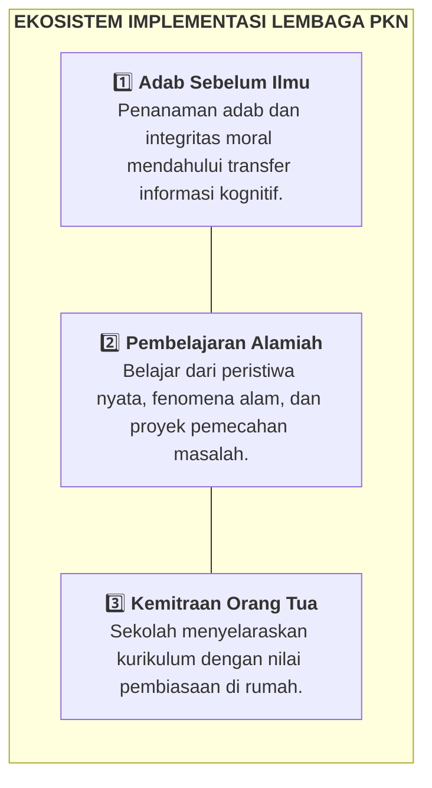

# 🏫 Panduan Lembaga & Guru: Implementasi Karakter Nabawiyah

> [!SUMMARY] ⚡ Ringkasan Eksekutif
> Lembaga pendidikan (sekolah, madrasah, pesantren, dan komunitas homeschooling) berperan sebagai mitra pendukung orang tua, bukan pengganti tanggung jawab keluarga. Panduan ini menyediakan instrumen praktis bagi pendidik untuk menyusun **RPP Karakter 1 Lembar**, apersepsi sirah bermakna, serta penerapan **8 Standar Mutu PKN**.

Penyelenggaraan pendidikan di lingkungan sekolah dan pesantren berbasis manhaj nabawiyah menuntut keselarasan bertahap di setiap jenjang usia—dari pembiasaan adab keteladanan pada fase Thufulah dan Tamyiz hingga kemandirian tanggung jawab sosial pada fase Murahaqah dan Syabab. Manajemen lembaga diarahkan secara wasathiyah (seimbang) agar kurikulum tidak terjebak dalam formalitas administratif yang kaku (*ifrath*) maupun pengabaian standar mutu pembinaan karakter (*tafrith*).

---

## 🏛️ Paradigma Kelembagaan PKN

Implementasi di ruang kelas berpijak pada integrasi tiga pilar ekosistem belajar:

---

## 🛠️ Perangkat Ajar & Ruang Kelas (Untuk Guru)

### 1. Perencanaan Pembelajaran Berbasis Karakter
* **RPP Karakter Nabawiyah 1 Lembar:** Templat ringkas yang mengintegrasikan aspek penumbuhan iman, adab, pengamatan bakat, dan capaian kognitif. Akses di [[Toolkit KBM/Template RPP Karakter Nabawiyah 1 Lembar|Template RPP Karakter Nabawiyah 1 Lembar]].
* **Panduan Pengisian & Rubrik Observasi:** Pelajari cara merumuskan indikator adab dan lembar pengamatan santri di [[Paradigma - Implementasi PKN/Dokumen Pendidikan Karakter Nabawiyah/Paradigma & Implementasi/Implementasi/Kaidah & Elemen/Panduan RPP dan Observasi Lapangan|Panduan RPP dan Observasi Lapangan]].

### 2. Apersepsi Pembuka Kelas & Pembelajaran Sirah
* **Menghubungkan Materi Pelajaran dengan Sirah Nabi ﷺ:** Jadikan kisah keteladanan para Sahabat sebagai pemantik rasa ingin tahu murid.
* **Katalog Narasi Siap Pakai:** Dapatkan kisah-kisah inspiratif dan pemantik diskusi kelas di [[Toolkit KBM/Bank Cerita Sirah dan Apersepsi KBM|Bank Cerita Sirah dan Apersepsi KBM]].

---

## 📋 Manajemen & Standardisasi Mutu (Untuk Kepala Sekolah & Pengelola)

Bagi pimpinan yayasan dan kepala sekolah yang ingin mentransformasi budaya lembaganya:

### 1. Empat Kaidah Pokok Implementasi
Pahami batasan metodologis penerapan PKN agar tidak terjebak dalam formalisme kurikulum melalui [[Paradigma - Implementasi PKN/Dokumen Pendidikan Karakter Nabawiyah/Paradigma & Implementasi/Implementasi/Kaidah & Elemen/4 Kaidah Implementasi|4 Kaidah Implementasi PKN]].

### 2. Delapan Standar Mutu Lembaga Nabawiyah
Audit kesiapan dan kematangan sekolah Anda dengan mengevaluasi 8 indikator ekosistem pendidikan di [[Paradigma - Implementasi PKN/Dokumen Pendidikan Karakter Nabawiyah/Paradigma & Implementasi/Implementasi/Kaidah & Elemen/8 Standar Implementasi PKN|8 Standar Implementasi PKN]]:
1. Standar Kompetensi Lulusan (Berbasis Adab & Akil Baligh)
2. Standar Isi (Integrasi Manhaj Nabawiyah)
3. Standar Proses (Pembelajaran Alamiah & Dialogis)
4. Standar Pendidik (Keteladanan & *Qudwah Hasanah*)
5. Standar Sarana Prasarana (Ramah Fitrah)
6. Standar Pengelolaan (Kemitraan Erat dengan Orang Tua)
7. Standar Pembiayaan (Akuntabel & Berkah)
8. Standar Penilaian (Observasi Otentik Portofolio)

### 3. Skala Prioritas Program Berbasis Maqashid Syariah
Cegah penumpukan program kegiatan yang melelahkan guru dan santri tanpa dampak nyata. Gunakan matriks evaluasi di [[Paradigma - Implementasi PKN/Dokumen Pendidikan Karakter Nabawiyah/Paradigma & Implementasi/Implementasi/Kaidah & Elemen/Prioritasi Program Lembaga Berbasis Maqashid Syariah|Prioritasi Program Lembaga Berbasis Maqashid Syariah]].

---

## 📐 Peta 4 Kuadran Diátaxis untuk Lembaga & Guru

* 🎓 **Tutorial:** [[Paradigma - Implementasi PKN/Dokumen Pendidikan Karakter Nabawiyah/Paradigma & Implementasi/Implementasi/Kaidah & Elemen/Panduan RPP dan Observasi Lapangan|Langkah Merancang Skenario KBM Berbasis Adab]]
* 🛠️ **How-To:** [[Toolkit KBM/Template RPP Karakter Nabawiyah 1 Lembar|Mengunduh dan Mengisi Templat RPP Karakter 1 Lembar]]
* 💡 **Explanation:** [[Paradigma - Implementasi PKN/Dokumen Pendidikan Karakter Nabawiyah/Paradigma & Implementasi/Implementasi/Kaidah & Elemen/4 Kaidah Implementasi|Mengapa Sekolah Harus Menjadi Mitra, Bukan Pengganti Orang Tua]]
* 📖 **Reference:** [[Paradigma - Implementasi PKN/Dokumen Pendidikan Karakter Nabawiyah/Paradigma & Implementasi/Implementasi/Kaidah & Elemen/8 Standar Implementasi PKN|Katalog Klausul 8 Standar Mutu Lembaga PKN]]

---

> [!NOTE] Penyelarasan Kurikulum
> Instrumen dan templat yang tersedia di repositori ini dirancang sebagai panduan berbasis teks yang dapat disesuaikan secara bebas dengan ketentuan teknis dinas pendidikan, kementerian agama, atau standar kurikulum mandiri masing-masing institusi.
