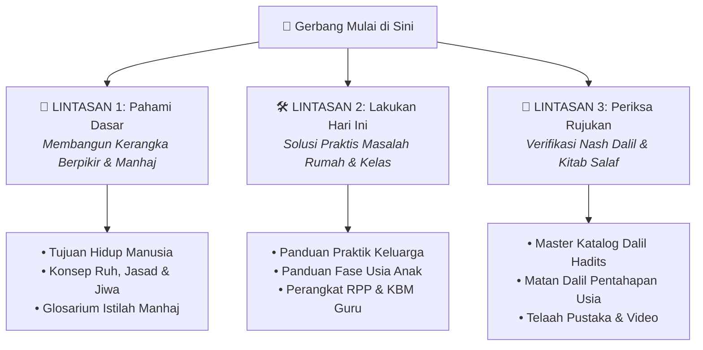
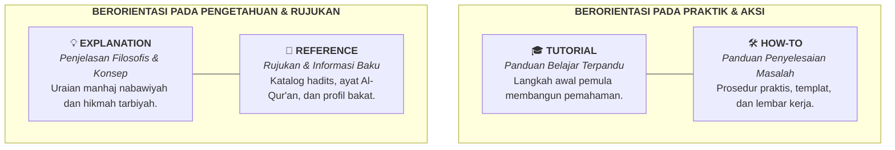

# 🚀 Mulai di Sini: Peta Orientasi & Jalur Belajar Wiki PKN

> [!SUMMARY] ⚡ Ringkasan Eksekutif
> Halaman ini adalah gerbang utama penelusuran basis pengetahuan **Pendidikan Karakter Nabawiyah (PKN)**. Temukan materi yang tepat sesuai peran Anda (Orang Tua, Guru, Pengelola Lembaga, atau Pembelajar Mandiri) melalui tiga lintasan aksi: **Pahami Dasar**, **Lakukan Hari Ini**, atau **Periksa Rujukan Dalil**.

---

## 🧭 Tiga Lintasan Cepat Memulai

Pilihlah salah satu dari tiga lintasan belajar di bawah ini sesuai intensi awal Anda:

### 1. Lintasan 1: Pahami Dasar (Kerangka Berpikir Manhaj)
Bagi Anda yang baru pertama kali mengenal PKN dan ingin memahami landasan epistemologinya:
* **Tujuan Hakiki Penciptaan:** Pelajari bagaimana pendidikan berakar dari tauhid dan amanah ibadah di [[Paradigma - Implementasi PKN/Dokumen Pendidikan Karakter Nabawiyah/Paradigma & Implementasi/Insan/Tujuan Hidup Manusia|Tujuan Hidup Manusia]].
* **Anatomi Insan:** Pahami relasi segitiga ruh, jasad, dan kalbu di [[Paradigma - Implementasi PKN/Dokumen Pendidikan Karakter Nabawiyah/Paradigma & Implementasi/Insan/Bersatunya Ruh dan Jasad Membentuk Jiwa|Bersatunya Ruh dan Jasad Membentuk Jiwa]].
* **Arsitektur Utuh:** Dapatkan gambaran 6 sektor pendidikan nabawiyah di [[Arsitektur PKN/00 - Master Arsitektur PKN|Master Hub Arsitektur PKN]].
* **Kamus Istilah Resmi:** Hindari kerancuan istilah psikologi sekuler dengan merujuk ke [[Glosarium Istilah Karakter Nabawiyah|Glosarium Istilah Karakter Nabawiyah]].

### 2. Lintasan 2: Lakukan Hari Ini (Aksi Cepat Lapangan)
Bagi Anda yang menghadapi tantangan nyata dalam keseharian:
* **Mengatasi Masalah Pengasuhan di Rumah:** Masuk ke [[Panduan/praktik-keluarga|Panduan Praktik Keluarga]] untuk panduan mengatasi tantrum balita, komunikasi hati, dan pengisian tangki jiwa.
* **Menyesuaikan Pendekatan Sesuai Usia Anak:** Masuk ke [[Panduan/fase-usia|Panduan Fase Usia Anak]] untuk panduan metodologis rentang 0–7, 7–10, 10–15, dan 15+ tahun.
* **Menyiapkan Pembelajaran di Sekolah/Pesantren:** Masuk ke [[Panduan/lembaga-dan-guru|Panduan Lembaga & Guru]] untuk templat RPP 1 lembar, apersepsi sirah, dan standar mutu pendidikan.

### 3. Lintasan 3: Periksa Rujukan (Validasi Ilmiah & Dalil)
Bagi Anda yang ingin memeriksa akurasi nash, sanad, dan takhrij:
* **Katalog Hadits & Sunnah:** Telusuri ratusan hadits nabawiyah bertakhrij di [[Master Katalog Dalil Hadits dan Sunnah|Master Katalog Dalil Hadits & Sunnah]].
* **Pustaka Rujukan & Review Kitab:** Akses perbandingan literatur di [[Panduan/dalil-dan-rujukan|Panduan Dalil & Kepustakaan Rujukan]].

---

## 👥 Peta Jalur Belajar Berdasarkan Persona (13 Peran)

Temukan rute navigasi yang dirancang khusus untuk kebutuhan peran Anda:

| Kelompok Persona | Subpersona & Kebutuhan Utama | Rekomendasi Pintu Masuk |
|---|---|---|
| **Orang Tua** | • **01a. Ayah / Kepala Keluarga:** Menegakkan kepemimpinan *qawwamah*, dialog visi hidup, ketegasan terukur. • **01b. Ibu / Pendidik Utama:** Merawat kelembutan *rahimah*, mengisi tangki cinta, meredam tantrum. | [[Panduan/praktik-keluarga\|Panduan Praktik Keluarga]] [[Panduan/fase-usia\|Panduan Fase Usia]] |
| **Guru & Pendidik** | • **02a. Guru Usia Dini (0–7):** Observasi fitrah bermain tanpa beban calistung dini. • **02b. Guru Mumayyiz (7–10):** Melatih shalat 5.000 kali, pembiasaan tertib. • **02c. Guru Murahaqah (10–15):** Penegakan disiplin *ta'dib*, pemisahan kamar, musyawarah akil baligh. • **02d. Guru Syabab (15+):** Pendampingan kemandirian, karya, dan penyiapan dakwah. • **02e. Pembimbing Dewasa:** Tarbiyah pranikah dan muhasabah pengasuhan. | [[Panduan/lembaga-dan-guru\|Panduan Lembaga & Guru]] [[Panduan/fase-usia\|Panduan Fase Usia]] [[Panduan/fitrah-dan-bakat\|Panduan Fitrah & Bakat]] |
| **Pengelola Lembaga** | • **03a. Pengelola Sekolah Formal:** Kurikulum adab, 8 Standar Mutu PKN, pencegahan bullying. • **03b. Pengelola Pesantren / Non-Formal:** Pembelajaran alamiah, asrama berbasis sunnah. | [[Panduan/lembaga-dan-guru\|Panduan Lembaga & Guru]] |
| **Fasilitator & Peneliti** | • **04. Fasilitator Kajian:** Bahan tayang, silabus daurah, tiga bahasa mendidik. • **05. Penelaah Literatur:** Verifikasi sanad hadits, telaah kitab klasik salaf. | [[Panduan/dalil-dan-rujukan\|Panduan Dalil & Rujukan]] |
| **Siswa & Pribadi** | • **06. Santri / Remaja:** Memahami potensi bakat diri, adab berguru, adab pergaulan digital. • **07. Pengembangan Diri:** Menata ulang tujuan hidup, *tazkiyatun nafs*, pemulihan batin. | [[Panduan/fitrah-dan-bakat\|Panduan Fitrah & Bakat]] [[Panduan/praktik-keluarga\|Panduan Praktik Keluarga]] |

---

## 📐 Peta Kuadran Diátaxis dalam Wiki PKN

Untuk navigasi yang efektif, kenali 4 bentuk materi di dalam repositori ini:

* 🎓 **Tutorial:** Modul pengenalan bertahap bagi orang tua baru dan guru pemula.
* 🛠️ **How-To:** Panduan langkah-demi-langkah (misal: penanganan tantrum, pembuatan RPP satu lembar, observasi bakat).
* 💡 **Explanation:** Artikel elaboratif yang membedah akar filosofis manhaj, perbedaan fitrah insan vs konsep kertas kosong sekuler, dan hakikat jiwa.
* 📖 **Reference:** Data definitif yang siap dikutip, seperti tabel takrif 40 pilar bakat, master katalog dalil, dan leksikon istilah.

---

## 🏛️ Enam Pintu Masuk Navigasi Tematik (MOC)

Kunjungi salah satu dari enam pusat navigasi tematik (*Maps of Content*) di bawah ini:

1. 🚀 **[[Panduan/mulai-di-sini|Mulai di Sini: Peta Orientasi & Jalur Belajar]]** *(Halaman ini)*
2. 🪜 **[[Panduan/fase-usia|Panduan Fase Usia Anak & Tadarruj Nabawiyah]]** (0–7, 7–10, 10–15, 15+ tahun)
3. 🎯 **[[Panduan/fitrah-dan-bakat|Panduan Fitrah & Penelusuran Bakat Nabawiyah (TB-40)]]**
4. 👨‍👩‍👧 **[[Panduan/praktik-keluarga|Panduan Praktik Keluarga & Pengasuhan Rumah Tangga]]**
5. 🏫 **[[Panduan/lembaga-dan-guru|Panduan Lembaga & Guru: Implementasi Karakter Nabawiyah]]**
6. 📜 **[[Panduan/dalil-dan-rujukan|Panduan Dalil & Kepustakaan Rujukan Karakter Nabawiyah]]**

---

> [!NOTE] Penelusuran Menyeluruh
> Ingin melihat seluruh daftar dokumen wiki tanpa penyaringan topik? Buka **[[Peta Navigasi Wiki PKN|Peta Navigasi & Indeks Lengkap Seluruh Konten]]** yang mencakup seluruh 487 berkas artikel, 117 bagan kanvas, dan pangkalan data rujukan.
