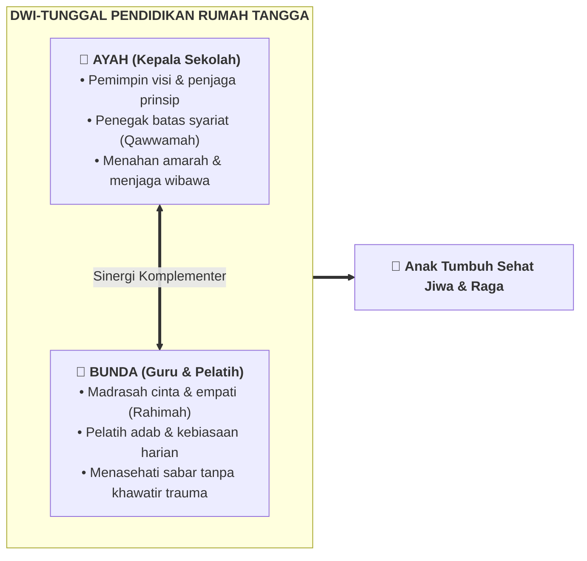

# 👨‍👩‍👧 Panduan Praktik Keluarga & Pengasuhan Rumah Tangga

> [!SUMMARY] ⚡ Ringkasan Eksekutif
> Rumah tangga adalah madrasah pertama dan utama (*al-ummu madrasatul ula*). Keberhasilan pendidikan anak bersumber dari keharmonisan suami istri, keteladanan nyata, serta penerapan tiga bahasa mendidik: **Bahasa Hati**, **Bahasa Lisan**, dan **Bahasa Tangan**. Gunakan panduan ini untuk menyelesaikan konflik harian dan memulihkan ikatan emosional keluarga.

---

## ⚖️ Sinergi Ayah (Qawwamah) dan Bunda (Rahimah)

Pendidikan keluarga memerlukan pembagian peran yang seimbang antara kepemimpinan dan kehangatan:

> [!NOTE] Analogi Peran PKN
> * **Ayah adalah "Kepala Sekolah":** Penentu arah visi akhirat, kurikulum adab rumah tangga, dan pembuat keputusan strategis keluarga.
> * **Bunda adalah "Guru dan Pelatih":** Eksekutor pengasuhan harian, pelatih kebiasaan amal shalih, dan penjaga kehangatan batiniah anak.

### ⚡ Dinamika Amarah: Keistimewaan Ibu vs Kewaspadaan Ayah
* **Kelebihan Fitrah Ibu (Marah yang Tidak Melukai):** Berkat tumpahan cinta yang sangat besar di usia Thufulah (dekapan, ASI, dan kehangatan fisik), marahnya ibu saat menasehati—bahkan jika sesekali dengan nada tegas—**tidak melukai batin anak**. Anak akan tetap rindu dan ingin tidur bersama ibunya. Ibu dapat memanfaatkan kelebihan ini untuk terus-menerus mengulang nasehat dan melatih anak dengan sabar tanpa rasa cemas berlebih akan timbulnya trauma.
* **Kewaspadaan Fitrah Ayah (Wibawa yang Rentan Melukai):** Sebaliknya, wibawa ayah sangat besar di mata anak. Ketika ayah membentak atau meledak marah, hal itu **sangat membekas di relung jiwa anak dan rentan melahirkan trauma menahun**. Ayah harus menjadi sosok yang paling sabar menahan amarah (*kazhmul ghaizh*) agar kemarahan emosional tidak tumpah kepada anak.

---

## 👥 Spesialisasi Pendampingan Gender Sesuai Fase Usia

Untuk membangun kepribadian yang utuh dan [[Imunitas Sosial]] yang kokoh, pola pendampingan orang tua diselaraskan dengan fase tumbuh kembang anak:

| Fase Usia | Pola Pendampingan | Fokus Tarbiyah & Sasaran Manhaj |
|---|---|---|
| **0–7 Tahun (Thufulah)** | **Bersama Keduanya (Ayah & Bunda)** | Pemenuhan kebutuhan rasa aman batin, kelekatan cinta simultan, dan bermain bermakna tanpa beban target kognitif. |
| **7–10 Tahun (Tamyiz)** | **Bersama Orang Tua Sejenis (*Same Gender*)** | **Pengokohan Identitas Fitrah Seksualitas:** • **Anak Laki-laki bersama Ayah:** Meneladani shalat berjamaah ke masjid, ketegasan ksatria, dan etos kerja pria. • **Anak Perempuan bersama Bunda:** Mempelajari keanggunan, rasa malu (*haya'*), tata kelola rumah, dan keterampilan adab wanita. |
| **10–15 Tahun (Murahaqah)** | **Bersama Orang Tua Lawan Jenis (*Cross Gender*)** | **Pengisian Tangki Cinta untuk Target [[Imunitas Sosial]]:** • **Anak Perempuan dekat dengan Ayah:** Ayah melimpahkan cinta dan apresiasi tulus agar putrinya kenyang kasih sayang pria dan kebal dari rayuan lelaki asing. • **Anak Laki-laki dekat dengan Bunda:** Bunda menjadi teman curhat penenang jiwa, melatih empati menghormati wanita, dan meredam gejolak pubertas. |
| **15+ Tahun (Syabab)** | **Kemitraan Mandiri (Keluarga Utuh)** | Pendelegasian amanah, pendampingan karya produktif, dan penyiapan tanggung jawab pernikahan. |

* **Rujukan Teori Lengkap:** Pelajari uraian mendalam di [[Paradigma - Implementasi PKN/Dokumen Pendidikan Karakter Nabawiyah/Paradigma & Implementasi/Implementasi/Peran & Tanggung Jawab/Peran Ayah dan Bunda|Peran Ayah dan Bunda]].

---

## 🛠️ Panduan Solusi Masalah Harian Pengasuhan

### 1. Menghadapi Ledakan Emosi Balita (Tantrum)
* **Kaidah Manhaj:** Tantrum pada usia dini bukanlah kejahatan moral, melainkan tanda kematangan otak yang sedang berproses mencari bahasa ungkap.
* **Langkah Penanganan:** Dekap anak dengan tenang, jauhkan dari bahaya fisik, dengarkan tanpa menghakimi, dan jangan merespons dengan amarah balik.
* **Rujukan Praktik:** Pelajari teknik lengkapnya di [[Materi SOTAB/TANTRUM ITU INDAH|Tantrum Itu Indah]].

### 2. Memastikan Tangki Cinta Anak Selalu Terisi
* **Kaidah Manhaj:** Anak yang defisit cinta akan menunjukkan perilaku menyimpang untuk mencari perhatian (*seeking attention*).
* **Langkah Aksi:** Lakukan kontak mata harian minimal 10 menit, berikan pelukan tulus, dengarkan cerita anak tanpa memegang gawai, dan ucapkan doa restu terang-terangan.
* **Rujukan Praktik:** Simak petunjuk praktis di [[Paradigma - Implementasi PKN/Dokumen Pendidikan Karakter Nabawiyah/Paradigma & Implementasi/Insan/Fitrah (Karakter)/Iman/Tangki Cinta|Pengisian Tangki Cinta Anak]].

### 3. Menerapkan Tiga Bahasa Mendidik
Gunakan ketiga bahasa ini secara proporsional sesuai tingkat kedewasaan anak:
* **Bahasa Hati (Kasih Sayang & Doa):** Membuka pintu penerimaan batin anak melalui [[Paradigma - Implementasi PKN/Dokumen Pendidikan Karakter Nabawiyah/Paradigma & Implementasi/Pendidikan Ideal/Metode Mendidik/Bahasa Hati|Bahasa Hati]].
* **Bahasa Lisan (Dialog Bermutu):** Berbicara dari hati ke hati (*qaulan baligha*) melalui [[Paradigma - Implementasi PKN/Dokumen Pendidikan Karakter Nabawiyah/Paradigma & Implementasi/Pendidikan Ideal/Metode Mendidik/Bahasa Lisan|Bahasa Lisan]].
* **Bahasa Tangan (Ketegasan Berwibawa):** Menegakkan batas disiplin dan keteladanan perbuatan melalui [[Paradigma - Implementasi PKN/Dokumen Pendidikan Karakter Nabawiyah/Paradigma & Implementasi/Pendidikan Ideal/Metode Mendidik/Bahasa Tangan|Bahasa Tangan]].

### 4. Memulihkan Hutang Pengasuhan & Luka Masa Lalu
Bagi orang tua yang merasa terlambat mendidik atau memiliki trauma masa kecil:
* **Kaidah Manhaj:** Pintu taubat dan perbaikan (*ishlah*) selalu terbuka lebar. Pemulihan diawali dengan mengakui kekhilafan, meminta maaf secara tulus kepada anak, dan membenahi ibadah bersama.
* **Rujukan Pemulihan:**
  * [[Paradigma - Implementasi PKN/Dokumen Pendidikan Karakter Nabawiyah/Paradigma & Implementasi/Pendidikan Ideal/Luka dan Hutang Pengasuhan/Recovery|Panduan Pemulihan Hutang Pengasuhan (Recovery)]]
  * [[Paradigma - Implementasi PKN/Dokumen Pendidikan Karakter Nabawiyah/Paradigma & Implementasi/Implementasi/Internal & Eksternal/Tazkiyatun Nafs|Tazkiyatun Nafs (Pembersihan Jiwa Pendidik)]]

---

## 📦 Materi Edukasi & Lembar Sebar

* 🖼️ **Infografis & Kartu Ringkas Siap Sebar:** Rangkuman ringkas 10 prinsip parenting siap dibaca atau dibagikan di [[Toolkit KBM/Infografis Ringkasan Materi PKN Siap Sebar|Infografis Ringkasan Materi PKN Siap Sebar]].
* 📖 **Serial Obrolan Tarbiyah Ayah Bunda (SOTAB):** Koleksi 120+ artikel obrolan praktis seputar problematika keluarga di [[Materi SOTAB|Koleksi Lengkap Materi SOTAB]].

---

## 📐 Peta 4 Kuadran Diátaxis untuk Praktik Keluarga

* 🎓 **Tutorial:** [[Paradigma - Implementasi PKN/Dokumen Pendidikan Karakter Nabawiyah/Paradigma & Implementasi/Implementasi/Peran & Tanggung Jawab/Peran Ayah dan Bunda|Langkah Membangun Kesepakatan Mendidik Suami-Istri]]
* 🛠️ **How-To:** [[Materi SOTAB/TANTRUM ITU INDAH|Prosedur Meredakan Tantrum Balita di Ruang Publik]]
* 💡 **Explanation:** [[Paradigma - Implementasi PKN/Dokumen Pendidikan Karakter Nabawiyah/Paradigma & Implementasi/Pendidikan Ideal/Metode Mendidik/Bahasa Hati|Filosofi Mengapa Hati Harus Lebih Dahulu Disentuh Sebelum Nalar]]
* 📖 **Reference:** [[Toolkit KBM/Infografis Ringkasan Materi PKN Siap Sebar|Daftar 10 Pesan Kunci Pengasuhan Nabawiyah]]

---

> [!NOTE] Batasan Penanganan
> Materi pemulihan hutang pengasuhan di wiki ini difokuskan pada pendekatan taubat spiritual (*tazkiyatun nafs*) dan rekonsiliasi keluarga. Untuk gangguan kesehatan mental berat atau trauma klinis anak, orang tua disarankan tetap berkonsultasi dengan psikolog atau psikiater muslim profesional.
