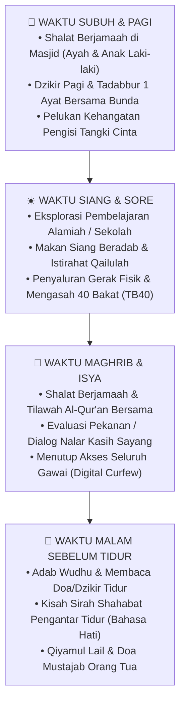

# Arahan Teknis Implementasi: Pedoman Operasional Pengasuhan Nabawiyah

> [!note] Catatan Metodologi & Sumber Penyusunan Dokumen
> Dokumen ini merupakan hasil rangkuman dan rekonstruksi berbantuan kecerdasan buatan (AI) dari berbagai materi presentasi, modul kurikulum, dokumen standar lembaga, dan rekaman kajian **Pendidikan Karakter Nabawiyah (PKN)** yang diampu oleh **Ustadz Abdul Kholiq**.  
> 
> Naskah ini telah melalui verifikasi dan pengayaan ulang dalil-dalil Al-Qur'an dan Hadits shahih dari korpus **OpenBayan** (60 kitab klasik), serta diperkaya dengan sintesis intisari dan masukan berharga dari kawan-kawan **Himmatul Ummah**, **Insan Taqwa / Mustaqbal**, dan **Tim SOTAB HEBAT**.

Dokumen ini memuat prosedur standar operasional (SOP), checklist harian, instrumen observasi, serta langkah-langkah terapan untuk mengeksekusi prinsip **Pendidikan Karakter Nabawiyah (PKN)** dalam rutinitas keluarga dan lingkungan sekolah.

> [!quote] Dalil & Rujukan Nabawiyah: Ketekunan Beramal Nyata
> **Teks Al-Qur'an:**  
> « فَإِذَا قُضِيَتِ الصَّلَاةُ فَانتَشِرُوا فِي الْأَرْضِ وَابْتَغُوا مِن فَضْلِ اللَّهِ وَاذْكُرُوا اللَّهَ كَثِيرًا لَّعَلَّكُمْ تُفْلِحُونَ »
> 
> *"Apabila telah ditunaikan shalat, maka bertebaranlah kamu di muka bumi; dan carilah karunia Allah dan ingatlah Allah banyak-banyak supaya kamu beruntung."*  
> — **QS. Al-Jumu'ah: 10**
> 
> 💡 **Relevansi PKN:** Keseimbangan antara ibadah ritual spiritual dengan keteraturan aksi teknis di lapangan menjadi kunci keberhasilan mencetak generasi produktif yang diridhai Allah SWT.

---

## 1. Siklus Rutinitas Harian Keluarga Nabawiyah

Penerapan PKN di rumah dibangun di atas ritme sunnah yang teratur, berporos pada 5 waktu shalat fardhu:

---

## 2. Checklist Adab & Tugas Berdasarkan Fase Usia

### 👶 Fase 1: Usia 0–7 Tahun ([[Thufulah]]) — Fokus: Rasa & Fisik
- [ ] Berikan minimal 10 kali pelukan dan ciuman kasih sayang setiap hari kepada ananda.
- [ ] Ajak bermain aktif di luar ruangan (tanah, rumput, air) minimal 1–2 jam sehari tanpa sekat gawai.
- [ ] Dengar tuntas celoteh dan pertanyaan anak dengan kontak mata penuh (*active listening*).
- [ ] Perdengarkan lantunan Al-Qur'an dan kisah kebaikan tanpa memaksakan target hafalan kaku.
- [ ] Tunjukkan keteladanan shalat dan adab nyata di depan mata anak tanpa intimidasi perintah.

### 👦 Fase 2: Usia 7–10 Tahun ([[Tamyiz]]) — Fokus: Nalar & Adab Shalat
- [ ] Perintahkan dan dampingi shalat 5 waktu secara konsisten dan lemah lembut (*amr bil-ma'ruf*).
- [ ] Ajarkan adab privasi syariat: meminta izin masuk kamar orang tua di 3 waktu aurat (QS. An-Nur: 58).
- [ ] Buka sesi dialog nalar sebab-akibat setiap kali anak melakukan kesalahan (*qaulan sadida*).
- [ ] Libatkan anak dalam tugas kerumahtanggaan ringan (merapikan kasur, mencuci piring sendiri).
- [ ] Mulai lakukan observasi kecenderungan bakat unik anak melalui rubrik **Rukun 3A**.

### 🧑 Fase 3: Usia 10–15 Tahun ([[Murahaqah]]) — Fokus: Disiplin & Pra-Baligh
- [ ] Tegakkan konsekuensi tegas jika anak sengaja melalaikan shalat fardhu (sesuai kaidah *ta'dib* nabawiyah).
- [ ] Pisahkan tempat tidur anak laki-laki dan anak perempuan secara ketat.
- [ ] Ajarkan fiqh pubertas: mandi wajib, tanda-tanda baligh, dan penjagaan pandangan (*ghaddhul bashar*).
- [ ] Ajak anak magang proyek nyata atau kerja lapangan bersama ayah/pakar untuk mengasah bakat spesifiknya.
- [ ] Latih kemandirian finansial: mengelola uang saku pribadi dan membiasakan sedekah harian.

---

## 3. Rubrik Observasi Bakat Rukun 3A di Rumah dan Sekolah

Gunakan instrumen sederhana berikut untuk mencatat potensi bawaan lahir anak:

| Parameter Observasi | Pertanyaan Pemandu Pengamatan | Indikator Skor Rendah (1-2) | Indikator Skor Tinggi (4-5) |
| :--- | :--- | :--- | :--- |
| **Suka (*Al-Hirsh*)** | Apakah anak menikmati aktivitas ini secara spontan tanpa harus disuruh atau diiming-imingi hadiah? | Mengerjakan dengan malas, terpaksa, dan mudah bosan. | Mata berbinar, antusias tinggi, dan lupa waktu saat asyik berkarya. |
| **Bisa (*Al-Maqdari*)** | Seberapa cepat anak menguasai keterampilan ini dibanding teman sebayanya? | Membutuhkan bimbingan berulang-ulang dan hasilnya kaku. | Belajar secara intuitif (*otodidak*), cepat mahir, dan memiliki teknik orisinil. |
| **Bermanfaat (*Al-Mufid*)** | Apakah hasil dari aktivitas ini memberi solusi nyata dan kebaikan bagi orang lain? | Hanya dinikmati sendiri dan berpotensi memicu kesombongan. | Membantu meringankan beban keluarga, memecahkan masalah teman, atau bernilai dakwah. |

---

## 4. Tautan Penting Pendukung Arahan Teknis

* Tinjau kaidah filosofis implementasi dalam [[4 Kaidah Implementasi]] dan [[4 Elemen Implementasi]].
* Pelajari panduan penegakan disiplin dalam [[Bahasa Tangan]] dan [[Batas Toleransi]].
* Pelajari kurikulum pelatihan orang tua dalam [[SOTABH]].
