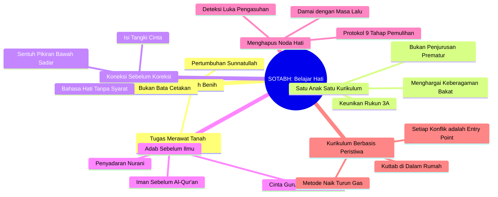
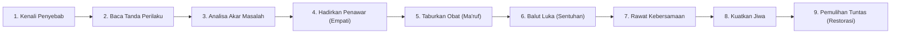

# SOTABH: State of the Art Belajar Hati

> [!note] Catatan Metodologi & Sumber Penyusunan Dokumen
> Dokumen ini merupakan hasil rangkuman dan rekonstruksi berbantuan kecerdasan buatan (AI) dari berbagai materi presentasi, modul kurikulum, dokumen standar lembaga, dan rekaman kajian **Pendidikan Karakter Nabawiyah (PKN)** yang diampu oleh **Ustadz Abdul Kholiq**.  
> 
> Naskah ini telah melalui verifikasi dan pengayaan ulang dalil-dalil Al-Qur'an dan Hadits shahih dari korpus **OpenBayan** (60 kitab klasik), serta diperkaya dengan sintesis intisari dan masukan berharga dari kawan-kawan **Himmatul Ummah**, **Insan Taqwa / Mustaqbal**, dan **Tim SOTAB HEBAT**.

> *"Anak bukan bata yang dicetak seragam dari luar, melainkan benih hidup yang tumbuh mekar dari dalam. Tugas pendidik bukanlah memahat atau memaksakan bentuk, melainkan menjaga tanah fitrahnya agar tumbuh subur menuju kematangan adab dan ketaatan kepada Allah."*  
> — **Ustadz Abdul Kholiq & Tim SOTAB HEBAT**

---

## 1. Hakikat & Latar Belakang SOTABH

**SOTABH (*State of the Art Belajar Hati*)** adalah puncak sintesis metodologis dalam Pendidikan Karakter Nabawiyah (PKN) yang menempatkan **kalbu (*Al-Qalb*)** sebagai episentrum utama seluruh proses pembelajaran dan pengasuhan.

Dalam lanskap peradaban modern, dunia pendidikan mengalami disorientasi arsitektural yang parah:
- **Pemesinan Anak (*Industrial Schooling*):** Anak-anak diperlakukan seperti bahan mentah pabrik yang harus masuk dalam cetakan kurikulum seragam, dinilai semata-mata dengan angka ujian kognitif, dan dipersiapkan sekadar menjadi sekrup industri ekonomi.
- **Kekosongan Jiwa (*Eros Soul*):** Ketika ilmu hanya berhenti di kepala tanpa menyentuh kesadaran hati, lahirlah generasi yang cerdas secara digital namun rapuh secara mental (*fragile*), gamang moralitasnya, dan terasing dari fitrah kehambaannya kepada Allah.
- **Krisis Aqil-Baligh:** Kematangan biologis (*baligh*) melesat lebih cepat akibat asupan gizi dan stimulasi visual digital, sementara kematangan akal budi, adab, dan kemandirian (*aqil*) tertinggal jauh.

SOTABH hadir untuk mendekonstruksi kekeliruan ini: **Pendidikan sejati bukanlah *Character Building* (membangun benda mati dari luar), melainkan *Character Growing* (menumbuhkan benih fitrah kehidupan dari dalam).**

---

## 2. Enam Pilar Paradigma Belajar Hati

Berdasarkan khazanah literatur SOTAB HEBAT, terdapat 6 pilar paradigma mendasar yang membedakan Belajar Hati dengan sekolah konvensional:

### 1. Paradigma Benih vs Paradigma Bata (*Anak Itu Benih, Bukan Bata*)
Allah Subhanahu wa Ta'ala berfirman tentang Maryam 'alaihassalam:
$$\text{فَتَقَبَّلَهَا رَبُّهَا بِقَبُوْلٍ حَسَنٍ وَّاَنْۢبَتَهَا نَبَاتًا حَسَنًاۖ}$$
*“Maka (Allah) menerimanya dengan penerimaan yang baik dan **menumbuhkannya dengan pertumbuhan yang baik**…”* (QS. Ali Imran: 37).

Allah tidak mengatakan *"mencetak"* atau *"membangun"* Maryam, melainkan **menumbuhkan (*wa ambataha*)**. Pendidik tidak menciptakan pertumbuhan, karena pertumbuhan adalah sunnatullah. Tugas pendidik adalah seperti petani: mengolah tanah hati, menabur pupuk kasih sayang, mencabut gulma luka, dan memastikan air keteladanan mengalir jernih.

### 2. Satu Anak Satu Kurikulum
Tidak ada benih mangga yang dituntut berbuah apel. Menyeragamkan seluruh anak dengan satu standar ujian yang sama adalah bentuk kezaliman fitrah. Setiap anak membawa peta potensi unik (TB40) dengan kombinasi gaya belajar (*Al-Fuad*, *Al-Bashar*, *As-Sam'u*) dan modalitas bakat tersendiri.

### 3. Koneksi Sebelum Koreksi (*Connection Before Correction*)
Sebelum lisan memberikan nasihat, pastikan hati telah tersambung. Mengoreksi anak saat tangki cintanya kosong hanya akan melahirkan pembangkangan lahiriah atau kepatuhan semu karena takut.

### 4. Menumbuhkan Adab Sebelum Huruf
Mengajarkan huruf dan hafalan teks kepada anak yang jiwanya belum ditumbuhkan kecintaannya kepada Allah akan melahirkan kecerdasan yang hampa—bahkan potensi manipulasi dalil tanpa adab.

### 5. Membasuh Luka Pengasuhan Pendidik
Sering kali yang mendidik anak di rumah bukanlah kebijaksanaan orang tua, melainkan **luka masa lalu orang tua (*inner child*)** yang belum tuntas. Pendidik harus melakukan *tazkiyatun nafs* dan berdamai dengan luka masa lalunya agar tidak mewariskan racun pengasuhan kepada generasi berikutnya.

### 6. Kurikulum Berbasis Peristiwa
Rumah adalah *Kuttab* sejati. Peristiwa tumpahnya susu, pertengkaran saudara, atau rasa malas shalat bukanlah gangguan, melainkan kurikulum organik yang dirancang Allah untuk mengasah karakter anak.

---

## 3. Protokol 9 Tahap Menghapus Noda & Luka Hati

Salah satu kontribusi terpenting dari SOTAB HEBAT adalah **Sistematika Pemulihan Luka Batin (*Healing & Recovery*)** yang terbagi ke dalam 9 tahapan terstruktur:

| Tahap | Nama Tahapan | Fokus Intervensi Orang Tua |
|---|---|---|
| **Tahap 1** | **Penyebab Luka Hati** | Mengidentifikasi pemicu: bentakan keras, pengabaian fisik, janji palsu, atau pemaksaan di luar kapasitas usia. |
| **Tahap 2** | **Tanda-Tanda Luka Hati** | Membaca alarm perilaku: anak menjadi pendiam ekstrem, mudah meledak marah, tantrum berkepanjangan, atau mengompol kembali. |
| **Tahap 3** | **Menganalisis Luka Hati** | Menemukan kebutuhan fitrah yang terhambat: apakah defisit tangki cinta, kehilangan hak bermain, atau ketiadaan figur ayah. |
| **Tahap 4** | **Penawar Luka Hati** | Menghadirkan ketenangan batin: istighfar orang tua, doa di sepertiga malam, dan pengakuan tulus bahwa orang tua pernah keliru. |
| **Tahap 5** | **Menabur Obat Luka Hati** | Membuka komunikasi tanpa syarat: tatap mata anak, validasi rasa sakitnya, dan meminta maaf tanpa dalih (*"Bunda minta maaf..."*). |
| **Tahap 6** | **Membalut Luka (Sentuhan Fisik)** | Memberikan pelukan hangat minimal 20 detik, dekapan di dada kiri, dan usapan kepala yang menstimulasi hormon oksitosin dan menenangkan amigdala. |
| **Tahap 7** | **Membalut Luka (Kebersamaan Berkualitas)** | Menghadirkan *Quality Time*: menemani aktivitas yang disukai anak tanpa diselingi memegang gawai atau menyelipkan ceramah lisan. |
| **Tahap 8** | **Membalut Luka (Pemberian Bermakna)** | Memberikan kejutan hadiah personal yang menunjukkan bahwa anak diperhatikan dan dicintai apa adanya. |
| **Tahap 9** | **Pemulihan Tuntas (*Restoration*)** | Mengembalikan kepercayaan diri anak, mengaktifkan kembali bakatnya, dan melatih kemandirian menuju kesiapan *Aqil-Baligh*. |

---

## 4. Kaidah Operasional Pendidik SOTAB

Untuk menerapkan Belajar Hati secara nyata di rumah dan madrasah, pegang 4 kaidah operasional berikut:

1. **Prinsip "Naik Turun Gas":**  
   Ketika menasihati anak dengan Bahasa Lisan dan anak menunjukkan resistensi atau defensif, jangan menginjak gas emosi lebih dalam. Segera turunkan gas ke **Bahasa Hati** (tenangkan, peluk, dengarkan). Setelah detak jantungnya tenang dan hatinya terbuka, barulah naikkan gas kembali ke Bahasa Lisan.
2. **Prinsip "Bahasa Hati Tanpa Syarat":**  
   Kasih sayang, pelukan, dan penerimaan tidak boleh dijadikan alat tawar-menawar (*"Kalau kamu ranking satu, baru Ayah sayang"*). Cinta orang tua kepada anak harus meneladani sifat *Rahman* Allah yang mendahului seluruh syarat ketaatan.
3. **Pemisahan Fardhu 'Ain vs Fardhu Kifayah dalam Pendidikan:**  
   Pendidikan agama dasar (shalat, wudhu, aqidah, adab) adalah kebutuhan pokok setiap insan. Jangan membebani seluruh anak dengan spesialisasi keilmuan tinggi di luar kapasitas bakatnya yang dapat mematikan kecintaan mereka terhadap Islam.
4. **Kemitraan Seimbang Ayah dan Bunda:**  
   Ayah adalah arsitek visi, penanam aqidah, dan benteng ketegasan. Bunda adalah rahim kasih sayang, pengasah empati, dan pembiasaan adab. Rumah yang kehilangan peran ayah (*father hunger*) akan melahirkan kerapuhan mental yang sulit diobati oleh ribuan kurikulum sekolah.

---

## 5. Rujukan Artikel Terkait di SOTAB HEBAT

Pembaca dapat menelusuri artikel pendalaman dari arsip resmi SOTAB HEBAT di direktori `old_backup/sotabh/artikel/`:
* *Anak Itu Benih, Bukan Bata* (`2026-08-12-anak-itu-benih-bukan-bata.md`)
* *Satu Anak Satu Kurikulum* (`2026-06-05-satu-anak-satu-kurikulum.md`)
* *Cinta yang Tak Melukai* (`2026-05-26-cinta-yang-tak-melukai.md`)
* *Seri Menghapus Noda Hati (Bagian 1 s.d. 9)* (`2026-07-11` s.d. `2026-07-29`)
* *Membasuh Luka Pengasuhan Diri* (`2025-11-19-membasuh-luka-pengasuhan-diri.md`)
* *Bahasa Hati Bukan Pembiaran* (`2025-12-26-bahasa-hati-bukan-pembiaran.md`)
