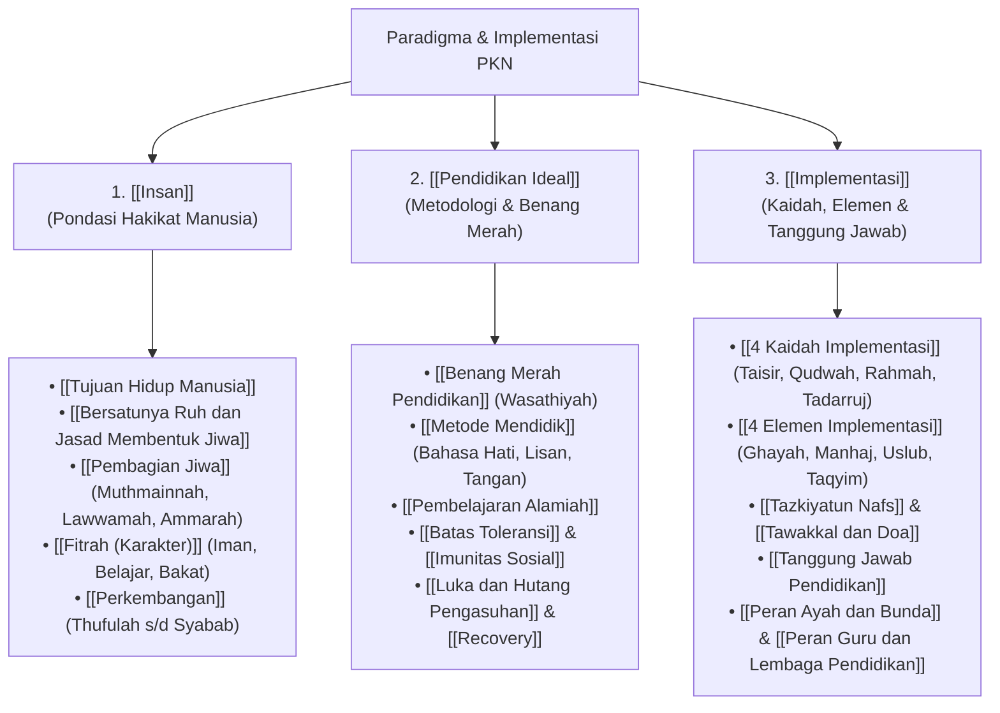

# Paradigma & Implementasi: Gerbang Arsitektur Utama PKN

Halaman ini merupakan simpul pintu gerbang (*master landing node*) yang memetakan seluruh bangunan teori dan aplikasi praktis **Pendidikan Karakter Nabawiyah (PKN)**. Bagian ini menguraikan dua pilar penyangga utama: **Paradigma Konseptual** (memahami hakikat manusia dan fitrah) serta **Implementasi Operasional** (mengeksekusinya di dunia nyata).

> [!quote] Dalil & Rujukan Nabawiyah: Petunjuk Penjelas Segala Sesuatu
> **Teks Al-Qur'an:**  
> « وَنَزَّلْنَا عَلَيْكَ الْكِتَابَ تِبْيَانًا لِّكُلِّ شَيْءٍ وَهُدًى وَرَحْمَةً وَبُشْرَىٰ لِلْمُسْلِمِينَ »
> 
> *"Dan Kami turunkan kepadamu Al Kitab (Al Quran) untuk menjelaskan segala sesuatu dan petunjuk serta rahmat dan kabar gembira bagi orang-orang yang berserah diri."*  
> — **QS. An-Nahl: 89**
> 
> 💡 **Relevansi PKN:** Al-Qur'an dan Sunnah adalah pedoman paripurna (*tibyanan likulli syai'*) yang menyediakan arsitektur utuh dalam memahami fitrah manusia dan cara mendidiknya.

---

## 1. Struktur Peta Arsitektur Tiga Tingkat

Bangunan dokumen di bawah direktori ini disusun secara logis bertingkat:

---

## 2. Intisari Tiga Pilar Utama

### 🧬 Pilar I: [[Insan]] (Siapa yang Kita Didik?)
Pendidikan tidak akan pernah berhasil jika pendidik keliru memahami objek yang dididiknya. Pilar Insan memetakan manusia secara utuh:
* Manusia diciptakan untuk mengabdi kepada Allah dan memimpin peradaban bumi ([[Tujuan Hidup Manusia]]).
* Manusia adalah perpaduan antara tanah (jasad) dan tiupan ruh Ilahi yang melahirkan entitas jiwa dinamis ([[Bersatunya Ruh dan Jasad Membentuk Jiwa]]).
* Dinamika jiwa bertingkat tiga: nafsu **[[Ammarah]]** (jasad/kemauan), nafsu **[[Lawwamah]]** (akal/nalar), dan nafsu **[[Muthmainnah]]** (hati/iman).
* Setiap anak membawa cetak biru fitrah ketauhidan suci sejak lahir ([[Fitrah (Karakter)]]) dan anugerah 40 potensi bakat unik ([[Bakat]]).
* Pertumbuhan anak melintasi 4 siklus sunnatullah: [[Thufulah]] (0–7 th), [[Tamyiz]] (7–10 th), [[Murahaqah]] (10–15 th), dan [[Syabab]] (15+ th).

### 🎯 Pilar II: [[Pendidikan Ideal]] (Bagaimana Cara Mendidiknya?)
Membahas prinsip-prinsip pedagogis murni warisan Rasulullah ﷺ:
* Berjalan di atas garis lurus jalan tengah (*wasathiyah*) menghindari sikap meremehkan (*tafrith*) maupun memaksa melampaui batas (*ifrath*) dalam [[Benang Merah Pendidikan]].
* Memadukan hirarki tiga bahasa tarbiyah nabawiyah: kehangatan batin dalam [[Bahasa Hati]], dialog logis santun dalam [[Bahasa Lisan]], dan ketegasan berbatas syariat dalam [[Bahasa Tangan]].
* Membebaskan anak dari penjara kelas formal melalui [[Pembelajaran Alamiah]].
* Membangun ketahanan moral anak melalui [[Batas Toleransi]] dan [[Imunitas Sosial]] di tengah fitnah digital.
* Menyembuhkan trauma pengasuhan masa lalu secara sistematis dalam [[Luka dan Hutang Pengasuhan]] dan [[Recovery]].

### ⚙️ Pilar III: [[Implementasi]] (Bagaimana Mengeksekusinya di Lapangan?)
Membahas kaidah praktis eksekusi di lingkungan keluarga dan sekolah:
* Memegang teguh [[4 Kaidah Implementasi]]: Bertahap (*Tadarruj*), Keteladanan (*Qudwah*), Kasih Sayang (*Rahmah*), dan Menjaga Fitrah.
* Mengintegrasikan [[4 Elemen Implementasi]]: Tujuan (*Ghayah*), Kurikulum (*Manhaj*), Metode (*Uslub*), dan Evaluasi (*Taqyim*).
* Menjadikan pensucian jiwa pendidik ([[Tazkiyatun Nafs]]) serta kepasrahan doa ([[Tawakkal dan Doa]]) sebagai poros utama.
* Menegakkan mandat fardhu 'ain pengasuhan dalam [[Tanggung Jawab Pendidikan]], serta membagi peran seimbang antara ayah, bunda, dan sekolah ([[Peran Ayah dan Bunda]], [[Peran Guru dan Lembaga Pendidikan]]).

---

## 3. Langkah Lanjutan

Silakan buka masing-masing pilar di atas untuk menelaah naskah lengkapnya, atau rujuk [QURAN_DALIL_CATALOG.md](file:///home/abuhafi/Project/wiki-pkn/QURAN_DALIL_CATALOG.md) untuk mempelajari ratusan dalil Al-Qur'an yang mendasari setiap bab ini.
---

## 4. Matriks Komprehensif Arsitektur Karakter dan Potensi Insan

Dalam mengimplementasikan Pendidikan Karakter Nabawiyah, pendidik wajib memahami bagaimana potensi manusia bertransformasi dari energi fitrah murni menuju karya peradaban:

| Dimensi Manusia | Komponen Substantif | Landasan Syar'i & Karakteristik | Metode Pendekatan | Indikator Kematangan Akil-Baligh |
| :--- | :--- | :--- | :--- | :--- |
| **Dimensi Ruhani (Hati/Perasaan)** | [[Muthmainnah]], [[Iman]], [[Tangki Cinta]], [[Berperasaan]] | QS. Al-Fajr: 27–30 & HR. Muslim No. 2594 (*Rifq*). Pusat keikhlasan, rasa malu (*haya'*), dan cinta tauhid. | [[Bahasa Hati]] (Edukasi Rasa) | Ketenangan batin, terbebas dari dendam/hasad, dan cinta beribadah tanpa paksaan. |
| **Dimensi Akal (Pikiran/Nalar)** | [[Lawwamah]], [[Belajar]], [[Berpikir]], [[Bekerja Sama]] | QS. Al-Qiyamah: 2 & QS. Al-Baqarah: 269 (*Al-Hikmah*). Daya nalar kritis, evaluasi diri (*muhasabah*), dan logika lurus. | [[Bahasa Lisan]] (Edukasi Logika) | Kemampuan menimbang maslahat-mudharat syar'i, haus ilmu, dan tidak mudah terbawa hoaks/syubhat. |
| **Dimensi Jasad (Kemauan/Fisik)** | [[Ammarah]], [[Bekerja Keras]], [[Memerintah]], [[Melayani]] | QS. Yusuf: 53 & QS. At-Taubah: 105 (*Itqan*). Dorongan eksekusi, daya juang (*grit*), kepemimpinan, dan khidmah. | [[Bahasa Tangan]] (Edukasi Aksi & Disiplin) | Kemandirian hidup, ketahanan fisik beramal shalih, tanggung jawab nafkah, dan kepemimpinan adil. |

---

## 5. Hubungan Sistemik: Dari Observasi Bakat Menuju Amal Peradaban

Pendidikan Karakter Nabawiyah bukanlah kumpulan teori yang terfragmentasi, melainkan sebuah siklus regenerasi peradaban yang berkesinambungan:
1. **Fase Pengenalan & Pengisian Jiwa (0–7 Tahun):** Orang tua fokus membangun kelekatan batin melalui pemenuhan tangki cinta di fase [[Thufulah]]. Di tahap ini, fitrah iman disemai tanpa paksaan kurikulum formal kaku.
2. **Fase Pembiasaan Adab & Eksplorasi (7–10 Tahun):** Anak dilatih mendirikan shalat dan adab harian di fase [[Tamyiz]]. Rasa ingin tahu difasilitasi melalui [[Pembelajaran Alamiah]] dan dialog nalar dua arah [[Bahasa Lisan]].
3. **Fase Penajaman Bakat & Penegakan Disiplin (10–15 Tahun):** Bakat unik anak mulai dipetakan ke dalam 40 pilar [[Bakat]] menggunakan instrumen Rukun 3A (*Suka, Bisa, Bermanfaat*). Anak dimagangkan pada proyek nyata dan didisiplinkan dengan [[Bahasa Tangan]] di fase [[Murahaqah]].
4. **Fase Kemitraan & Karya Mandiri (15+ Tahun):** Pemuda memasuki fase [[Syabab]] sebagai mukallaf sejati yang akil-baligh: siap memikul beban hukum syariat, mandiri secara ekonomi, dan aktif berkontribusi bagi kemaslahatan umat.

Untuk memahami detail teknis dari masing-masing komponen di atas, telaah dokumen-dokumen terkait di bilah navigasi kiri atau telusuri [Master Katalog Dalil Al-Qur'an](file:///home/abuhafi/Project/wiki-pkn/QURAN_DALIL_CATALOG.md).
