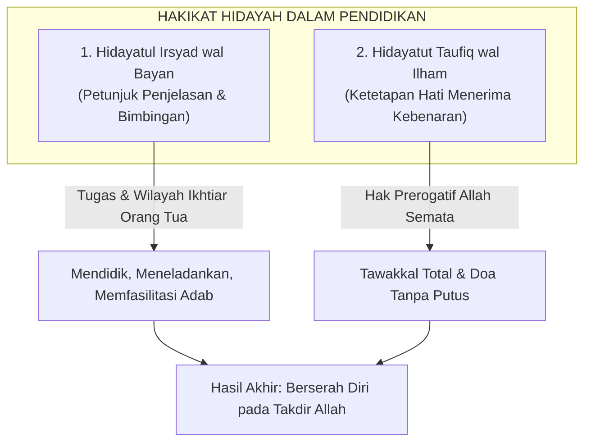

# Tawakkal dan Doa: Jangkar Spiritual Pengasuhan Nabawiyah

> [!note] Catatan Metodologi & Sumber Penyusunan Dokumen
> Dokumen ini merupakan hasil rangkuman dan rekonstruksi berbantuan kecerdasan buatan (AI) dari berbagai materi presentasi, modul kurikulum, dokumen standar lembaga, dan rekaman kajian **Pendidikan Karakter Nabawiyah (PKN)** yang diampu oleh **Ustadz Abdul Kholiq**.  
> 
> Naskah ini telah melalui verifikasi dan pengayaan ulang dalil-dalil Al-Qur'an dan Hadits shahih dari korpus **OpenBayan** (60 kitab klasik), serta diperkaya dengan sintesis intisari dan masukan berharga dari kawan-kawan **Himmatul Ummah**, **Insan Taqwa / Mustaqbal**, dan **Tim SOTAB HEBAT**.

Dalam paradigma Pendidikan Karakter Nabawiyah (PKN), **Tawakkal dan Doa** bukanlah jalan pintas kepasrahan kaum pemalas, melainkan puncak tertinggi dari arsitektur ikhtiar seorang mukmin. Setelah seluruh perangkat manhaj, kurikulum 40 bakat, metode tiga bahasa, dan keteladanan adab dikerahkan secara optimal, seorang pendidik muslim wajib menyadari batas eksistensial dirinya sebagai makhluk. Manusia hanyalah perantara wasilah; yang memiliki kekuasaan mutlak untuk membolak-balikkan hati, menumbuhkan hidayah, dan mengokohkan karakter anak hanyalah Allah Subhanahu wa Ta'ala.

Pendidikan yang hampa dari tawakkal dan doa akan melahirkan kesombongan intelektual tatkala anak berhasil berprestasi (*'ujub*), atau melahirkan keputusasaan dan depresi berat tatkala anak mengalami deviasi perilaku (*qunuth*). Tawakkal membebaskan orang tua dari sindrom kecemasan berlebih (*parenting anxiety*), sementara doa menjadi tali penyambung langsung antara ketidakberdayaan orang tua di bumi dengan kekuasaan Maha Dahsyat Sang Pencipta di Arsy.

> [!quote] Dalil & Rujukan Nabawiyah: Doa Orang Tua Menembus Langit
> **Teks Al-Qur'an & Hadits Shahih:**  
> « وَالَّذِينَ يَقُولُونَ رَبَّنَا هَبْ لَنَا مِنْ أَزْوَاجِنَا وَذُرِّيَّاتِنَا قُرَّةَ أَعْيُنٍ وَاجْعَلْنَا لِلْمُتَّقِينَ إِمَامًا »  
> *"Dan orang-orang yang berkata: 'Ya Tuhan kami, anugerahkanlah kepada kami pasangan-pasangan kami dan keturunan kami sebagai penyejuk hati (kami), dan jadikanlah kami imam bagi orang-orang yang bertakwa'."*  
> — **QS. Al-Furqan: 74**  
>  
> « ثَلَاثُ دَعَوَاتٍ مُسْتَجَابَاتٌ لَا شَكَّ فِيهِنَّ: دَعْوَةُ الْمَظْلُومِ، وَدَعْوَةُ الْمُسَافِرِ، وَدَعْوَةُ الْوَالِدِ لِوَلَدِهِ »  
> *"Tiga doa yang mustajab, tiada keraguan di dalamnya: doanya orang yang terzalimi, doanya orang yang sedang bepergian (musafir), dan doanya orang tua untuk anaknya."*  
> — **HR. Abu Dawud (No. 1536), At-Tirmidzi (No. 1905), dishahihkan oleh Al-Albani**  
>  
> 📚 **Syarah Al-Hafizh Ibnul Qayyim dalam Zadul Ma'ad (Juz 4 Hal. 170):**  
> *"Doa orang tua bagi anaknya memiliki kedudukan istimewa di sisi Allah karena ia bersumber dari lubuk hati yang paling ikhlas, terbebas dari kepalsuan, dan dipenuhi oleh rasa belas kasih yang mendalam. Para Nabi senantiasa memohon keturunan yang shalih sebelum anak itu lahir, tatkala ia diasuh, hingga saat mereka telah dewasa. Doa adalah senjata utama tarbiyah yang mampu menembus tirai takdir dan melunakkan hati yang membatu."*

---

## 1. Memahami Teologi Hidayah: Irsyad vs Taufiq

Pendidikan Karakter Nabawiyah membedakan secara tegas dua tingkatan hidayah agar orang tua tidak melampaui batas kewenangannya:

1. **Hidayatul Irsyad wal Bayan:** Tugas orang tua dan pendidik. Meliputi mengajarkan tauhid, mendialogkan adab, menyediakan lingkungan yang steril dari maksiat, dan mengasah bakat. Di wilayah inilah orang tua akan dihisab atas kesungguhan ikhtiarnya.
2. **Hidayatut Taufiq wal Ilham:** Wilayah Allah semata. Allah menegaskan kepada Nabi terbaik-Nya ﷺ:  
   *“Sungguh, engkau (Muhammad) tidak dapat memberi petunjuk kepada orang yang engkau kasihi, tetapi Allah memberi petunjuk kepada orang yang Dia kehendaki...”* (QS. Al-Qashash: 56).  
   Kisah Nabi Nuh 'alaihissalam dengan Kan'an, serta Nabi Ibrahim 'alaihissalam dengan ayahnya Azar, menjadi bukti abadi bahwa ikhtiar terbaik sekalipun tidak menjamin keimanan tanpa taufiq Ilahi. Kesadaran ini meruntuhkan keangkuhan pendidik dan melahirkan tawadhu'.

---

## 2. Peta Doa-Doa Nabawiyah untuk Perlindungan Anak

Para Nabi dan Rasul mewariskan untaian doa agung yang wajib menjadi wirid harian setiap orang tua:

| Sosok Pendidik | Matan Doa dalam Al-Qur'an | Intisari Permohonan & Relevansi PKN |
|---|---|---|
| **Nabi Ibrahim 'alaihissalam** | *“Rabbi hab lii minash-shaalihiin”* (QS. Ash-Shaffat: 100) & *“Rabbij'alnii muqiimash-shalaati wa min dzurriyyatii”* (QS. Ibrahim: 40) | Memohon anak yang saleh, istiqamah menegakkan shalat, dan dijauhkan dari penyembahan berhala modern (materialisme). |
| **Nabi Zakariya 'alaihissalam** | *“Rabbi hab lii mil ladunka dzurriyyatan thayyibah innaka samii'ud-du'aa'”* (QS. Ali 'Imran: 38) | Memohon keturunan yang suci fitrahnya (*thayyibah*) tatkala secara biologis tampak mustahil. |
| **Istri 'Imran (Ibunda Maryam)** | *“Wa innii u'iidzuhaa bika wa dzurriyyatahaa minasy-syaithaanir rajiim”* (QS. Ali 'Imran: 36) | Memohon benteng perlindungan (*hima*) bagi anak dan keturunannya dari sentuhan dan godaan setan. |
| **Doa 'Ibadurrahman** | *“Rabbanaa hab lanaa min azwaajinaa wa dzurriyyatinaa qurrata a'yun...”* (QS. Al-Furqan: 74) | Memohon anak menjadi penyejuk pandangan (*qurrata a'yun*) dan pelopor ketakwaan (*imamal lil-muttaqin*). |

---

## 3. Waktu-Waktu Emas Mustajab Mengetuk Pintu Langit

Jangan biarkan doa orang tua hanya diucapkan secara sporadis tatkala panik menghadapi kenakalan anak. Manfaatkan momentum mustajab:
1. **Sepertiga Malam Terakhir:** Tatkala seisi rumah terlelap tidur, bangunlah mengambil wudhu, sebut nama masing-masing anak satu per satu di dalam sujud tahajjud.
2. **Saat Bersujud dalam Shalat Wajib:** Rasulullah ﷺ bersabda: *“Keadaan terdekat seorang hamba dengan Tuhannya adalah tatkala ia bersujud, maka perbanyaklah doa padanya”* (HR. Muslim).
3. **Waktu Antara Adzan dan Iqamah:** Momentum emas saat pintu langit dibuka dan doa tidak ditolak.
4. **Saat Safar dan Berpuasa:** Doa orang tua yang sedang berpuasa dan bermusafir memiliki garansi ijabah yang sangat kuat.

---

## 4. Panduan Aplikatif bagi Ayah dan Bunda

1. **Jaga Lisan dari Sumpah Serapah:** Rasulullah ﷺ memperingatkan keras: *“Janganlah kalian mendoakan keburukan bagi diri kalian, jangan mendoakan keburukan bagi anak-anak kalian, dan jangan mendoakan keburukan bagi harta-harta kalian; jangan sampai kalian bertepatan dengan saat pengabulan doa dari Allah lalu Dia mengabulkannya bagi kalian”* (HR. Muslim No. 3009). Sekesal apa pun kepada anak, ganti kemarahan lisan dengan doa: *"Semoga Allah memberimu petunjuk dan menjadikkanmu ulama besar!"*
2. **Doakan Anak Secara Terang-terangan di Depannya:** Tatkala anak berangkat sekolah atau hendak tidur, peluk keningnya dan ucapkan doa dengan suara yang terdengar oleh telinganya: *"Ya Allah, berkahilah umur anak hamba ini, jadikan hatinya cinta kepada-Mu."* Mendengar doa tulus orang tuanya akan melunakkan jiwa anak yang keras.
3. **Lepaskan Beban Hasil kepada Allah (*Tawakkal Hakiki*):** Setelah kita berusaha menasihati, menjaga pergaulannya, dan mengarahkannya, tidurlah dengan tenang. Jangan memikul beban takdir yang bukan wewenang kita. Serahkan penjagaan anak kepada Dzat Yang Maha Menjaga (*Khairun Hafizha*).

> [!reflection] Refleksi Pendidik: Menakar Kedalaman Doa Kita
> - Berapa menit waktu khusus yang kita luangkan setiap hari semata-mata untuk mendoakan hidayah dan keselamatan akhirat anak-anak kita?
> - Apakah kita lebih banyak mengeluhkan tabiat anak kepada sesama manusia di media sosial daripada mengadukannya kepada Allah dalam linangan air mata sujud malam?

---

## Tautan Rujukan Terkait

* [[Implementasi]] — Paradigma menyeluruh implementasi kurikulum PKN.
* [[Tazkiyatun Nafs]] — Kesucian jiwa sebagai prasyarat tembusnya doa ke langit.
* [[Iman]] — Buah manis dari penanaman tauhid dan kepasrahan ilahiyah.
* [[Peran Ayah dan Bunda]] — Kemitraan spiritual dalam memimpin peradaban keluarga.
* [[Internal & Eksternal]] — Menyeimbangkan ikhtiar batin dengan benteng sosial.
