![[assets/banners/banner_tazkiyatun_nafs.webp]]
*Gambar: Penyucian Jiwa (Tazkiyatun Nafs) Menuju Kesucian Fitrah*

# Tazkiyatun Nafs: Menyucikan Bejana Pendidik Sebelum Menumbuhkan Fitrah Anak

> [!note] Catatan Metodologi & Sumber Penyusunan Dokumen
> Dokumen ini merupakan hasil rangkuman dan rekonstruksi berbantuan kecerdasan buatan (AI) dari berbagai materi presentasi, modul kurikulum, dokumen standar lembaga, dan rekaman kajian **Pendidikan Karakter Nabawiyah (PKN)** yang diampu oleh **Ustadz Abdul Kholiq**.  
> 
> Naskah ini telah melalui verifikasi dan pengayaan ulang dalil-dalil Al-Qur'an dan Hadits shahih dari korpus **OpenBayan** (60 kitab klasik), serta diperkaya dengan sintesis intisari dan masukan berharga dari kawan-kawan **Himmatul Ummah**, **Insan Taqwa / Mustaqbal**, dan **Tim SOTAB HEBAT**.

Dalam epistemologi Pendidikan Karakter Nabawiyah (PKN), **Tazkiyatun Nafs** (penyucian jiwa) menempati kedudukan sebagai jantung dari seluruh proses pendidikan. Kata *tazkiyah* mengandung dua makna agung yang saling melengkapi: **At-Tath-hir** (membersihkan dari kotoran dan racun dosa) serta **An-Numuw waz-Ziyadah** (menumbuhsuburkan dan melipatgandakan potensi kebaikan). Tarbiyah nabawiyah bukanlah transmisi informasi mekanis dari otak guru ke otak murid, melainkan proses **resonansi spiritual (*al-hal anfa' minal maqal*)** di mana frekuensi kesucian kalbu pendidik memancarkan getaran hikmah yang langsung meresap ke dalam sanubari anak.

Para ulama salaf sepakat bahwa mendidik anak bermula dari menyucikan diri pendidiknya. Jika bejana hati orang tua dipenuhi racun kesombongan (*kibr*), riya', kedengkian (*hasad*), dan cinta dunia berlebihan (*hubbud dunya*), maka segala perkataan manis dan nasihat agama yang keluar dari lisannya akan terasa hambar, bahkan dapat memicu resistensi batin pada anak. Air yang memancar dari hulu yang keruh tidak akan pernah mampu mengalirkan kesegaran ke hilir.

> [!quote] Dalil & Rujukan Nabawiyah: Keberuntungan Orang yang Bersuci Jiwa
> **Teks Al-Qur'an & Doa Nabawiyah:**  
> « قَدْ أَفْلَحَ مَن زَكَّاهَا ۝ وَقَدْ خَابَ مَن دَسَّاهَا »  
> *"Sungguh beruntung orang yang menyucikan jiwa itu, dan sungguh merugi orang yang mengotorinya."*  
> — **QS. Asy-Syams: 9–10**  
>  
> « اللَّهُمَّ آتِ نَفْسِي تَقْوَاهَا، وَزَكِّهَا أَنْتَ خَيْرُ مَنْ زَكَّاهَا، أَنْتَ وَلِيُّهَا وَمَوْلَاهَا »  
> *"Ya Allah, anugerahkanlah kepada jiwaku ketakwaannya, dan sucikanlah ia, karena Engkaulah sebaik-baik Dzat yang dapat menyucikannya. Engkaulah Pelindung dan Tuannya."*  
> — **HR. Muslim (No. 2722) dari Zaid bin Arqam radhiyallahu 'anhu**  
>  
> 📚 **Syarah Al-Imam Abu Hamid Al-Ghazali dalam Ihya 'Ulumiddin (Kitab Riyadhatun Nafs):**  
> *"Pendidik anak ibarat pembawa bayangan; jika tongkatnya bengkok, bagaimana mungkin bayangannya akan lurus? Demikian pula seorang ayah atau guru yang tidak mampu mengendalikan syahwat dan amarahnya sendiri, bagaimana mungkin ia dapat menundukkan keliaran nafsu ammarah anak asuhnya? Tazkiyatun nafs adalah syarat mutlak bagi siapa saja yang mengemban amanah tarbiyah, agar ucapannya menjadi obat bagi hati dan perilakunya menjadi qudwah yang diridhai."*

---

## 1. Dua Etape Tazkiyatun Nafs: Takhalli dan Tahalli

Proses penyucian jiwa pendidik berlangsung melalui dua tahapan dialektis yang berkesinambungan:

```mermaid
graph LR
    subgraph TAKHALLI["1. TAKHALLI (Pembersihan / Detoksifikasi)"]
        T1["Mengikis Riya' & Sum'ah"]
        T2["Membuang Amarah & Dendam"]
        T3["Menghilangkan Kibir (Sombong)"]
        T4["Menghindari Rezeki Syubhat"]
    end

    subgraph TAHALLI["2. TAHALLI (Penghiasan / Nutrisi Ruh)"]
        H1["Menghias dengan Ikhlas Lillah"]
        H2["Menghias dengan Kelembutan (Rifq)"]
        H3["Menghias dengan Tawadhu' & Sabar"]
        H4["Menghias dengan Qiyamul Lail & Doa"]
    end

    TAKHALLI --> TAHALLI
    TAHALLI --> Pancaran["Pancaran Wibawa Nabawiyah (Koneksi Batin Pendidik & Anak)"]
```

### A. Etape Takhalli (Detoksifikasi Racun Hati)
- **Mengikis Riya' Pengasuhan:** Sering kali orang tua mendidik anak bukan karena Allah, melainkan demi memuaskan gengsi sosial: agar dipuji sebagai "keluarga teladan" atau "orang tua sukses". Riya' ini meracuni ketulusan hubungan dengan anak.
- **Membuang Ego dan Amarah (*Ghadhab*):** Membentak anak saat melakukan kesalahan biasanya bukan karena membela syariat Allah, melainkan karena ego orang tua yang merasa tidak dihargai. Takhalli menuntut orang tua belajar menahan amarah (*kazhmul ghaizh*).
- **Menjauhkan Harta Syubhat:** Setiap suapan makanan haram yang masuk ke perut keluarga akan menggelapkan hati anak dan menutup pintu hidayah.

### B. Etape Tahalli (Penghiasan dengan Akhlak Mulia)
- **Ikhlas Semata-mata Mencari Ridha Allah:** Membebaskan diri dari pamrih ucapan terima kasih anak. Orang tua mendidik karena taat pada perintah Allah, bukan demi investasi balasan budi materi di masa tua.
- **Kelemahlembutan (*Ar-Rifq*):** Sebagaimana sabda Nabi ﷺ: *“Sesungguhnya kelembutan tidaklah berada pada sesuatu melainkan ia akan menghiasinya, dan tidaklah dicabut dari sesuatu melainkan ia akan memperburuknya”* (HR. Muslim No. 2594).
- **Istiqamah Menghidupkan Ibadah Khusus:** Menghidupkan shalat tahajjud, memperbanyak tilawah Al-Qur'an, dan istighfar harian untuk menjaga stabilitas cahaya batin.

---

## 2. Dampak Batin Kejernihan Hati Pendidik pada Perilaku Anak

Ulama tabi'in ternama, Utbah bin Abi Sufyan, berwasiat kepada pendidik anaknya dengan kalimat yang sangat melegenda:
> *"Hendaklah perbaikan pertama yang engkau lakukan terhadap anak-anakku adalah perbaikan terhadap dirimu sendiri. Karena mata mereka senantiasa terikat pada matamu; kebaikan menurut mereka adalah apa yang engkau kerjakan, dan keburukan menurut mereka adalah apa yang engkau tinggalkan."*

Hubungan spiritual antara orang tua dan anak bekerja melalui prinsip **In'ikas (Pantulan Spiritual)**:
1. Ketika orang tua bermaksiat secara sembunyi-sembunyi, Allah sering kali menampakkan hukuman-Nya berupa pembangkangan pada akhlak anak dan pasangannya. Al-Fudhail bin 'Iyadh berkata: *"Sungguh, tatkala aku bermaksiat kepada Allah, aku melihat bekas maksiat itu pada perubahan tabiat istriku dan hewan tungganganku."*
2. Tatkala orang tua menangis bertaubat di keheningan malam, Allah menurunkan kelembutan ke dalam kalbu anak-anaknya di keesokan harinya.

---

## 3. Matriks Evaluasi Diri Harian (*Muhasabah Pendidik*)

Gunakan rubrik berikut untuk mendeteksi kesehatan jiwa kita sebelum berinteraksi dengan ananda:

| Pertanyaan Diagnostik Batin | Jika Jawabannya "Ya" (Penyakit) | Terapi Tazkiyah yang Wajib Dilakukan |
|---|---|---|
| Apakah saya merasa malu jika anak saya belum bisa membaca saat anak tetangga sudah mahir? | Terjangkit kuman **Riya' & Gengsi Sosial**. | Ingat kembali bahwa setiap anak memiliki syakilah fitrah unik; luruskan niat mendidik lillahi ta'ala. |
| Apakah saya sering berteriak dan memukul saat anak menumpahkan air? | Terjangkit penyakit **Ghadhab (Kemarahan Ego)**. | Segera berwudhu, duduk atau berbaring, dan beristighfar sebelum berbicara kepada anak. |
| Apakah saya merasa bahwa keberhasilan anak semata-mata hasil metode hebat saya? | Terjangkit penyakit **'Ujub (Kagum Diri)**. | Akui kelemahan diri di hadapan Allah; sadari bahwa hidayah 100% milik-Nya. |

---

## 4. Panduan Aplikatif Praktik Tazkiyah bagi Orang Tua

1. **Jadikan Istighfar sebagai Pembuka Hari:** Basahi lisan dengan istighfar minimal 100 kali sehari. Sadari bahwa ketidaktaatan anak mungkin adalah buah dari dosa-dosa kita yang belum kita taubati.
2. **Puasa Lisan dari Mengeluh dan Mencela:** Latih diri untuk tidak pernah mengeluarkan kata-kata makian, sindiran sarkas, atau sumpah serapah kepada anak, meskipun dalam kondisi sangat lelah.
3. **Minta Ridha dan Maaf kepada Pasangan:** Keharmonisan batin suami-istri adalah pilar utama tazkiyatun nafs keluarga. Pertengkaran dingin yang dipendam akan memancarkan energi gelisah ke seluruh penjuru rumah.

> [!reflection] Refleksi Pendidik: Membasuh Cermin Batin
> - Sebelum kita menyalahkan anak yang sulit diatur, sudahkah kita bertanya pada diri sendiri: seberapa patuh diri kita kepada Allah tatkala adzan memanggil?
> - Apakah bejana jiwa kita hari ini memancarkan ketenangan sakinah ataukah racun kepanikan duniawi kepada ananda?

---

## Tautan Rujukan Terkait

* [[Implementasi]] — Paradigma menyeluruh operasionalisasi PKN.
* [[Tawakkal dan Doa]] — Melengkapi ikhtiar tazkiyah dengan kepasrahan total.
* [[Pembagian Jiwa]] — Memahami dinamika nafs menuju muthmainnah.
* [[Bahasa Hati]] — Resonansi komunikasi batin hasil dari tazkiyatun nafs.
* [[Internal & Eksternal]] — Harmonisasi pilar batiniah dan benteng lahiriah.
