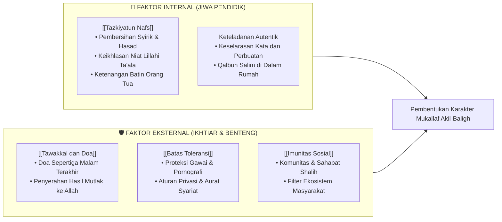

# Faktor Internal & Eksternal dalam Pendidikan Karakter Nabawiyah

> [!note] Catatan Metodologi & Sumber Penyusunan Dokumen
> Dokumen ini merupakan hasil rangkuman dan rekonstruksi berbantuan kecerdasan buatan (AI) dari berbagai materi presentasi, modul kurikulum, dokumen standar lembaga, dan rekaman kajian **Pendidikan Karakter Nabawiyah (PKN)** yang diampu oleh **Ustadz Abdul Kholiq**.  
> 
> Naskah ini telah melalui verifikasi dan pengayaan ulang dalil-dalil Al-Qur'an dan Hadits shahih dari korpus **OpenBayan** (60 kitab klasik), serta diperkaya dengan sintesis intisari dan masukan berharga dari kawan-kawan **Himmatul Ummah**, **Insan Taqwa / Mustaqbal**, dan **Tim SOTAB HEBAT**.

Keberhasilan pembentukan karakter anak adalah hasil harmonisasi antara **Faktor Internal** (kesucian batiniah dan kualitas spiritual pendidik) dengan **Faktor Eksternal** (ikhtiar nyata, doa, dan proteksi lingkungan pergaulan).

> [!quote] Dalil & Rujukan Nabawiyah: Perubahan Bermula dari Dalam Jiwa
> **Teks Al-Qur'an:**  
> « إِنَّ اللَّهَ لَا يُغَيِّرُ مَا بِقَوْمٍ حَتَّىٰ يُغَيِّرُوا مَا بِأَنفُسِهِمْ »
> 
> *"Sesungguhnya Allah tidak mengubah keadaan suatu kaum sehingga mereka mengubah keadaan yang ada pada diri mereka sendiri..."*  
> — **QS. Ar-Ra'd: 11**
> 
> 💡 **Relevansi PKN:** Transformasi karakter anak bermula dari perbaikan internal jiwa kedua orang tuanya; iklim batin rumah tangga yang bersih akan memancarkan energi kebaikan yang menyerap ke sanubari generasi.

---

## 1. Peta Sinergi Faktor Internal dan Eksternal

---

## 2. Uraian Pokok Dua Dimensi Penunjang

### 💎 1. Dimensi Internal: [[Tazkiyatun Nafs]]
* **Penyucian Jiwa Orang Tua Adalah Kunci:** Anak adalah spons spiritual yang menyerap energi batin orang tuanya. Jika hati orang tua dipenuhi kemarahan, kecemasan, atau riya, anak akan merespon dengan kegelisahan dan pembangkangan.
* **Takhalliyah & Tahalliyah:** Membersihkan batin dari penyakit hati (*hasad, ujub, takabbur*) dan menghiasinya dengan kesabaran, syukur, serta prasangka baik (*husnuzhan*).

### 🛡️ 2. Dimensi Eksternal: [[Tawakkal dan Doa]]
* **Ikhtiar Maksimal Diiringi Tawakkal Total:** Mendidik dengan teknik terbaik, namun meyakini bahwa hidayah taufiq mutlak berada di tangan Allah SWT.
* **Kekuatan Doa Penembus Langit:** Meneladani doa para nabi (Nabi Ibrahim AS dan Luqman AS) yang secara konsisten memohon anak keturunan penyejuk hati (*qurrata a'yun*) dan penjaga shalat.
* **Sinergi dengan Proteksi Nyata:** Doa harus dibarengi dengan penjagaan batasan syariat ([[Batas Toleransi]]) dan pengkondisian lingkungan yang kondusif ([[Imunitas Sosial]]).

---

## 3. Rekomendasi Kajian Lanjutan

* Pelajari metode pembersihan hati secara mendalam di [[Tazkiyatun Nafs]].
* Pelajari adab memanjatkan doa mustajab untuk anak di [[Tawakkal dan Doa]].
* Pelajari benteng proteksi pergaulan anak di [[Imunitas Sosial]] dan [[Batas Toleransi]].
---

## 4. Integrasi Tazkiyah Diri dan Rekayasa Ekosistem Rumah

Untuk mengoptimalkan sinergi faktor internal dan eksternal, orang tua disarankan menerapkan 5 pilar pembiasaan rumah tangga sakinah:
1. **Membersihkan Rumah dari Simbol-Simbol Kemaksiatan:** Memastikan tidak ada tontonan pornografi, musik-musik melalaikan, gambar bernyawa yang dilarang syariat, atau makanan yang syubhat masuk ke perut keluarga.
2. **Menghidupkan Budaya Majelis Ilmu Keluarga:** Membaca tafsir hadits tematik (*SOTABH*) atau sirah nabawiyah secara berkala di ruang keluarga untuk menyuburkan jiwa muthmainnah anak.
3. **Memelihara Adab Berkomunikasi Pasangan Suami-Istri:** Anak tidak boleh menyaksikan pertengkaran kasar, celaan, atau teriakan antara ayah dan bunda; ketenangan hubungan orang tua adalah benteng emosional anak.
4. **Membangun Aliansi dengan Keluarga Sefrekuensi:** Memilih tetangga dan kawan bermain anak dari keluarga yang sama-sama memiliki komitmen menjaga adab dan syariat Islam.
5. **Menjadikan Rumah Sebagai Markaz Ibadah Sunnah:** Mengerjakan shalat rawatib, tilawah Al-Qur'an harian, dan shalat dhuha/tahajjud di rumah agar rumah tidak seperti kuburan (sebagaimana sabda Nabi ﷺ dalam HR. Muslim No. 777).
---

## 5. Studi Komparasi: Lingkungan Protektif vs Lingkungan Berdaya Tahan

Dalam menghadapi tantangan eksternal zaman modern, terdapat dua pendekatan yang sering diambil oleh para orang tua:

| Parameter Perbandingan | Pendekatan Isolasi Tertutup (Karantina Buta) | Pendekatan Imunitas Nabawiyah (PKN) |
| :--- | :--- | :--- |
| **Pola Asuh** | Mengurung anak di dalam rumah, melarang seluruh interaksi luar, dan mengawasi dengan kecemasan tinggi. | Membangun pondasi fitrah iman dan adab yang kokoh di rumah, lalu melepas anak secara bertahap (*tadarruj*). |
| **Respon terhadap Fitnah** | Menghindari realitas sosial; anak tidak dikenalkan pada bahaya dunia luar sama sekali. | Melatih anak mengidentifikasi bahaya syubhat dan syahwat, serta memberikan keterampilan menolaknya secara mandiri. |
| **Dampak Jangka Panjang** | Ketika anak dewasa dan harus keluar rumah, ia mengalami *culture shock*, mudah terkontaminasi, dan rentan terseret arus. | Anak memiliki antibodi spiritual yang kebal; ke mana pun ia pergi, ia membawa lentera peradaban dan mewarnai lingkungannya. |

> [!tip] Kaidah Praktis Membangun Imunitas Rumah Tangga
> Mendidik anak di era digital bukan dengan cara memutus kabel internet selamanya, melainkan dengan membesarkan cinta anak kepada Allah dan Rasul-Nya, menanamkan rasa malu syariat (*haya'*), serta mengisi tangki jiwanya dengan kehangatan dialog keluarga sehingga ia tidak membutuhkan pengakuan semu dari media sosial.
