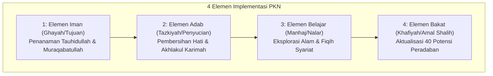
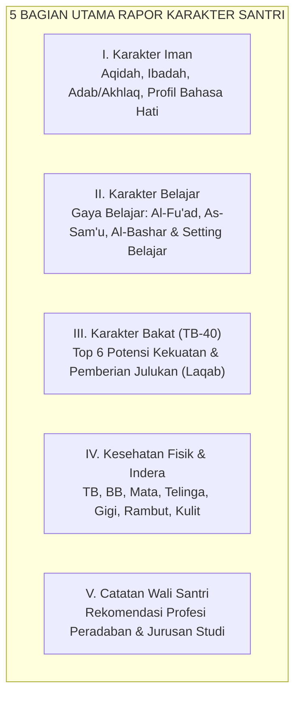

![[assets/banners/banner_4_elemen_implementasi.webp]]
*Gambar: Empat Elemen Pondasi Implementasi Pendidikan Karakter*

> [!info] Refleksi Lapangan: Realitas Penerapan 4 Elemen Implementasi
> **Kondisi Faktual:** Dalam praktik nyata di lembaga dan rumah tangga, penerapan 4 Elemen Implementasi sering menghadapi tantangan resistensi budaya lama dan tuntutan hasil instan.  
> **Akar Masalah PKN:** Ketidakselarasan antara standar ideal manhaj dengan kapasitas pendidik yang belum tuntas melakukan tazkiyatun nafs.  
> **Langkah Penanganan Nabawiyah:**  
> 1. Bangun pemahaman bersama (*idrak musytarak*) di kalangan pimpinan, guru, dan orang tua.  
> 2. Utamakan keteladanan nyata sebelum membuat aturan administratif yang kaku.  
> 3. Terapkan evaluasi berkala berbasis pertumbuhan karakter batin, bukan sekadar kelengkapan berkas fisik.

> [!warning] Peringatan Risiko: Jebakan Formalitas dalam 4 Elemen Implementasi
> * **Bentuk Kesalahan:** Mengubah kurikulum fitrah nabawiyah menjadi sekadar rutinitas administratif formalitas tanpa ruh keimanan.
> * **Dampak Terhadap Jiwa:** Hilangnya keberkahan majelis ilmu, kejenuhan pendidik, dan kegagalan mencetak generasi mukallaf yang kokoh.
> * **Pencegahan Nabawiyah:** Jaga kemurnian niat lillahi ta'ala dan jadikan setiap tahapan implementasi sebagai amal jariyah penegak peradaban Islam.

> [!tip] Tips Praktis Hari Ini
> * **Aksi Sederhana:** Evaluasi satu prosedur pembelajaran atau kebiasaan rumah tangga hari ini: apakah ia mempermudah mekarnya fitrah anak ataukah justru membebani jiwa tanpa dalil yang jelas?
> * **Tujuan:** Memastikan seluruh instrumen berjalan di atas kaidah *at-taisir* (kemudahan) dan *ar-rifq* (kelembutan).

# 4 Elemen Implementasi Pendidikan Karakter Nabawiyah

> [!note] Catatan Metodologi & Sumber Penyusunan Dokumen
> Dokumen ini merupakan hasil rangkuman dan rekonstruksi berbantuan kecerdasan buatan (AI) dari berbagai materi presentasi, modul kurikulum, dokumen standar lembaga, dan rekaman kajian **Pendidikan Karakter Nabawiyah (PKN)** yang diampu oleh **Ustadz Abdul Kholiq**.  
> 
> Naskah ini telah melalui verifikasi dan pengayaan ulang dalil-dalil Al-Qur'an dan Hadits shahih dari korpus **OpenBayan** (60 kitab klasik), serta diperkaya dengan sintesis intisari dan masukan berharga dari kawan-kawan **Himmatul Ummah**, **Insan Taqwa / Mustaqbal**, dan **Tim SOTAB HEBAT**.

> [!quote] Dalil & Rujukan Nabawiyah Utama
> **Naskah:**  
> « هُوَ الَّذِي بَعَثَ فِي الْأُمِّيِّينَ رَسُولًا مِّنْهُمْ يَتْلُو عَلَيْهِمْ آيَاتِهِ وَيُزَكِّيهِمْ وَيُعَلِّمُهُمُ الْكِتَابَ وَالْحِكْمَةَ وَإِن كَانُوا مِن قَبْلُ لَفِي ضَلَالٍ مُّبِينٍ »
>
> *"Dialah yang mengutus kepada kaum yang buta huruf seorang Rasul di antara mereka, yang membacakan ayat-ayat-Nya kepada mereka, menyucikan (jiwa) mereka, dan mengajarkan kepada mereka Kitab (Al-Qur'an) dan Hikmah (As-Sunnah). Dan sesungguhnya mereka sebelumnya benar-benar dalam kesesatan yang nyata."*
>
> 📚 **Sumber Rujukan OpenBayan:** QS. Al-Jumu'ah: 2; Tafsir Ibnu Katsir (Juz 8 Hal. 115); Al-Hulal al-Ibriziyyah min Ta'liqat al-Baziyyah ala Shahih al-Bukhari.  
> 💡 **Relevansi PKN:** Ayat ini menguraikan 4 elemen arsitektural risalah kenabian: Pembacaan tanda kebesaran Allah (Elemen Iman), Penyucian jiwa (Elemen Adab/Hati), Pengajaran hukum syariat (Elemen Belajar), dan Kebijaksanaan aplikasi nyata (Elemen Bakat/Peradaban).

---

## 1. Arsitektur Empat Elemen Ekosistem PKN

*Rancang Bangun Implementasi Kurikulum PKN pada Lembaga Persekolahan*

Agar Pendidikan Karakter Nabawiyah dapat beroperasi secara utuh di rumah dan sekolah, terdapat **4 Elemen Inti** yang harus hadir secara serentak dan saling menopang:

---

## 2. Rincian Empat Elemen & Teladan Tarbiyah Nabawiyah

### 1. Elemen Iman (الغَايَة - Al-Ghayah / Tujuan Tertinggi)
* **Hakikat:** Memastikan bahwa seluruh aktivitas pendidikan anak bermuara pada pengenalan (*Ma'rifatullah*), kecintaan (*Mahabbah*), dan ketundukan mutlak kepada Allah SWT.
* **Teladan Rasulullah ﷺ di Darul Arqam:** Selama 13 tahun fase Makkah, Rasulullah ﷺ memfokuskan pembinaan akidah tauhid sebelum hukum-hukum muamalah dan sanksi hudud diturunkan di Madinah. Hasilnya adalah para sahabat memiliki imunitas iman yang kokoh menghadapi siksaan dahsyat kaum musyrikin (seperti Bilal bin Rabah, Khabbab, dan Keluarga Yasir).
* **Aplikasi Keluarga:** Menghidupkan suasana zikir di rumah, mengaitkan seluruh fenomena sains dengan kekuasaan Allah (*"Lihatlah siapa yang menciptakan langit tanpa tiang ini"*).

### 2. Elemen Adab (التَّزْكِيَة - At-Tazkiyah / Penataan Jiwa)
* **Hakikat:** Menanamkan rasa hormat, tata krama, kesucian diri (*'iffah*), dan kerendahan hati sebelum mengajarkan ilmu pengetahuan akademis.
* **Atsar Shahabat & Ulama Salaf:**
  * Abdullah bin Al-Mubarak berkata: *"Kami mempelajari adab selama tiga puluh tahun, dan kami mempelajari ilmu pengetahuan selama dua puluh tahun."*
  * Imam Malik menasihatkan kepada pemuda Quraisy: *"Pelajarilah adab sebelum engkau mempelajari ilmu!"*
* **Aplikasi Keluarga:** Membiasakan adab makan, adab berbicara, adab meminta izin memasuki kamar orang tua (*isti'dzan*), dan adab menghormati orang yang lebih tua.

### 3. Elemen Belajar (المَنْهَج - Al-Manhaj / Logika & Eksplorasi)
* **Hakikat:** Mengasah fitrah ingin tahu alami anak melalui interaksi langsung dengan dunia nyata (*tajribah & mushahadah*), bukan hafalan mekanis di luar konteks.
* **Teladan Rasulullah ﷺ Mengajarkan Fiqih Praktis:** Rasulullah ﷺ tidak hanya berceramah di atas mimbar, melainkan berwudhu di hadapan para sahabat seraya bersabda: *"Barangsiapa berwudhu seperti wudhuku ini..."* (HR. Bukhari No. 159), dan bersabda: *"Shalatlah kalian sebagaimana kalian melihat aku shalat!"* (HR. Bukhari No. 631).
* **Aplikasi Keluarga:** Mengajak anak ke pasar tradisional untuk belajar matematika jual-beli, mengamati semut dan tumbuhan untuk belajar biologi ciptaan Allah.

### 4. Elemen Bakat (العَمَل - Al-'Amal / Aktualisasi Peran Kekhalifahan)
* **Hakikat:** Mengidentifikasi dan memfasilitasi 40 sifat karakter mulia (TB40) anak hingga bermuara pada karya amal shalih yang solutif bagi umat.
* **Teladan Rasulullah ﷺ Membina Potensi Khusus:** Beliau mengarahkan Hassan bin Tsabit bersyair membela Islam, mengutus Mush'ab bin Umair berdiplomasi, dan mengangkat Usamah bin Zaid memimpin ekspedisi militer.
* **Aplikasi Keluarga:** Menggunakan instrumen observasi Rukun 3A (Suka, Bisa, Bermanfaat) untuk menemukan penjurusan profesi anak menjelang usia baligh.

---

---

## 3. Matriks Sinergi Operasional 4 Elemen dalam Kehidupan Sehari-hari

Untuk memastikan keempat elemen ini tidak berjalan secara terisolasi, orang tua dan pendidik dapat menggunakan instrumen evaluasi berkala berikut:

| Dimensi Evaluasi | Indikator Keberhasilan Operasional | Contoh Penerapan di Rumah & Sekolah |
| :--- | :--- | :--- |
| **Integrasi Iman-Adab** | Ibadah tidak sekadar ritual mekanis, melainkan melahirkan kepekaan moral dan kesantunan. | Anak yang rajin shalat berjamaah di masjid otomatis memiliki adab berbicara yang santun kepada orang tua dan tetangga. |
| **Integrasi Belajar-Bakat** | Pengetahuan kognitif yang dipelajari langsung dihubungkan dengan penyaluran minat dan potensi karya nyatanya. | Anak yang memiliki bakat analitis (*Berpikir*) diajak meneliti siklus air wudhu atau merancang sistem pengairan hidroponik keluarga. |
| **Sinergi Keempat Elemen** | Anak tumbuh menjadi pribadi muslim yang utuh (*syumuliyyah*): kokoh tauhidnya, luhur adabnya, cerdas nalarnya, dan nyata kontribusinya. | Pemuda mukallaf yang siap memimpin, berwirausaha mandiri secara halal, dan menjadi teladan bagi lingkungannya. |

---

## 4. Sistem Evaluasi Autentik: Blueprint Rapor Karakter Santri (Model SKIS Semarang)

Dalam implementasi kelembagaan di **Sekolah Karakter Imam Syafi'i (SKIS Semarang)** di bawah bimbingan Ustadz Abdul Kholiq, S.Pd, elemen evaluasi diwujudkan dalam **Laporan Perkembangan Karakter Santri (Rapor PKN)**. Rapor ini menolak standardisasi angka ranking akademis yang kompetitif-destruktif, dan menggantinya dengan pemetaan tumbuh kembang fitrah secara holistik.

### A. Lima Komponen Inti Rapor Karakter Santri

1. **Bagian I: Karakter Iman (Pondasi Spiritual)**
   * **Aqidah & Ibadah:** Dipantau melalui observasi keseharian di sekolah dan rumah (tanpa harus disuruh shalat, berkata jujur tanpa tekanan, tertib berwudhu).
   * **Adab dan Akhlaq:** Sikap kepada guru, teman, alam, dan diri sendiri.
   * **Profil Bahasa Hati:** Menentukan bahasa kasih utama anak (*Pelayanan*, *Perlindungan*, atau *Kebersamaan*) sebagai panduan bagi orang tua dan guru dalam menyentuh hatinya.

2. **Bagian II: Karakter Belajar (Gaya Penyerapan Ilmu)**
   * Memetakan gaya belajar dominan berbasis firman Allah dalam QS. An-Nahl: 78:
     * *Al-Fu'ad (الفُؤَاد):* Kinestetik / motorik (belajar dengan bergerak, membongkar-pasang, praktik nyata).
     * *As-Sam'u (السَمْع):* Auditori (belajar dengan mendengar kisah, talaqqi, dialog).
     * *Al-Bashar (البَصَر):* Visual (belajar dengan melihat gambar, demonstrasi, peta konsep).
   * Rekomendasi tempat belajar yang nyaman (alam terbuka, bengkel, lapangan, atau halaqah hening).

3. **Bagian III: Karakter Bakat TB-40 (Peta Potensi Keunikan)**
   * Menampilkan **Top 6 Potensi Kekuatan** (*Dominant Strengths*) dan **Potensi Keterbatasan** (*Blind Spots*) hasil observasi guru dan orang tua.
   * **Pemberian Julukan Fitrah (*Al-Laqab al-Mamduh*):** Tradisi sunnah nabawiyah dalam menyematkan gelar kepribadian luhur (sebagaimana Rasulullah ﷺ menggelari Abu Bakar *Ash-Shiddiq*, Umar *Al-Faruq*, Khalid *Saifullah*, Abu Ubaidah *Aminul Ummah*). Di SKIS, ananda dianugerahi julukan pembangun kepercayaan diri sesuai kombinasi bakat puncaknya, seperti:
     * *"Tegas yang Cerdas"* (kombinasi 'Adaalah + Dzakaa' + Amaanah)
     * *"Perintis yang Penyayang"* (kombinasi 'Aziimah + Rahmah + Himmah)
     * *"Pemimpin yang Santun"* (kombinasi Syajaa'ah + Hilm + Rifq)

4. **Bagian IV: Kesehatan Fisik & Panca Indera**
   * Pemeriksaan antropometri berkala (Tinggi Badan, Berat Badan, fungsi mata, telinga, kulit, gigi, rambut) sebagai penunjang vitalitas ibadah dan belajar.

5. **Bagian V: Catatan Rekomendasi bagi Orang Tua & Wali Santri**
   * Pendidik merumuskan arahan strategis: proyek karya apa yang perlu difasilitasi di rumah, profesi peradaban apa yang relevan dengan fitrahnya, dan jurusan studi/pesantren lanjutan yang paling cocok dituju saat usia [[Syabab]].

---

### B. Empat Rubrik Observasi Pertumbuhan Karakter (@ 9 Indikator)

Evaluasi rapor ditopang oleh lembar observasi harian dengan rubrik perilaku konkret:

| Dimensi Evaluasi | Fokus Observasi Perilaku Anak |
|---|---|
| **1. Pertumbuhan Aqidah (9 Butir)** | Shalat tanpa disuruh; jujur tanpa takut dihukum; adab spontan; sering mengingat surga/neraka; mengingatkan teman yang lalai; berbesar hati saat dibangunkan subuh; tidak main gadget sembunyi-sembunyi; lisan berdzikir saat senang/susah; mengembalikan barang temuan. |
| **2. Pertumbuhan Ibadah (9 Butir)** | Gemar membaca/menyimak Al-Qur'an; rutin muraja'ah; tata cara wudhu mutqin; tertib shalat fardhu; shalat sesuai sunnah; beradab islami harian; mengajak teman beribadah; antusias di bulan Ramadhan; mampu mempraktikkan tayamum. |
| **3. Pertumbuhan Belajar (9 Butir)** | Belajar tanpa paksaan; gigih mencari solusi saat kesulitan; tidak malu bertanya pada orang baru; memanfaatkan benda sekitar jadi media belajar; aktif menjelajah lingkungan; banyak bertanya kritis; berani mencoba hal baru; tidak takut salah; larut (*flow state*) saat belajar. |
| **4. Pertumbuhan Bakat (9 Butir)** | Memiliki ciri khas unik yang membedakannya dari orang lain; memiliki hobi/aktivitas favorit konsisten; hasil karyanya mutqin/bagus; melakukan berulang-ulang tanpa bosan; spontan tampil baik tanpa persiapan berbelit; memanfaatkan mainan buatan sendiri; pantang putus asa saat gagal; rela menyisihkan uang jajan demi hobi karyanya. |

---

## 5. Tautan Konseptual Terkait
* [[4 Kaidah Implementasi]] — Prinsip Operasional Pengasuhan.
* [[Pendidikan Ideal]] — Paradigma Akil-Baligh PKN.
* [[Bakat]] — Katalog 40 Sifat Karakter Nabawiyah.
* [[Belajar]] — Tiga Gaya Belajar Fitrah Qur'ani dan 9 Indikator Belajar.
* [[Bahasa Hati]] — Tiga Modalitas Bahasa Hati (Pelayanan, Perlindungan, Kebersamaan).
* [[Tanggung Jawab Pendidikan]] — Peran Asali Orang Tua dalam Pengasuhan.

---

---

## Diagnosis Penyimpangan: Tafrith vs Ifrath dalam 4 Elemen Implementasi

| Dimensi Operasional | Gejala Sikap yang Teramati | Dampak Psikospiritual pada Ekosistem |
| :--- | :--- | :--- |
| **Tafrith (Lalai / Ketiadaan Standar)** | Berjalan tanpa arah yang jelas, mengabaikan evaluasi mutu karakter, dan membiarkan distorsi fitrah tanpa tindakan korektif. | Ekosistem pendidikan menjadi stagnan, kualitas lulusan rapuh, dan visi peradaban Islam tidak tercapai. |
| **Ifrath (Birokratisasi Kaku / Memaksa)** | Membebani guru dan santri dengan target dokumen berlebihan, menuntut kesempurnaan instan, dan menghukum deviasi tanpa hikmah. | Guru mengalami stres kronis (*burnout*), santri kehilangan kegembiraan belajar, dan suasana lembaga menjadi dingin tanpa cinta. |
| **Al-Wasathiyah (Implementasi Hikmah Nabawiyah)** | Menegakkan standar mutu tinggi (*itqan*) yang dibingkai dengan kelapangan kasih sayang, pembinaan bertahap, dan keteladanan otentik. | Tercipta ekosistem tarbiyah yang hidup, penuh keberkahan, melahirkan lulusan berakhlak mulia dan siap memimpin peradaban. |

---

## Studi Kasus Nyata & Solusi Kuratif Tadarruj

### Skenario Permasalahan
> **Kasus:** Lembaga pendidikan hanya fokus pada target akademik tanpa membangun ekosistem keteladanan guru dan keterlibatan orang tua.

### Tahapan Solusi Kuratif Langkah-demi-Langkah (Manhaj Tadarruj)
1. **Fase 1: Rekalibrasi Visi & Niat (Hari 1–7)**  
   Pimpinan dan pendidik duduk bersama dalam majelis muhasabah. Mengakui kekurangan diri dan meluruskan orientasi semata-mata mencari ridha Allah.
2. **Fase 2: Dialog Terbuka & Pemetaan Kebutuhan (Pekan 2)**  
   Mendengarkan aspirasi dan kendala nyata yang dihadapi pelaksana lapangan dengan empati tanpa penghakiman.
3. **Fase 3: Penyederhanaan Sistem Berbasis Fitrah (Bulan 1)**  
   Memangkas birokrasi yang membebani dan memfokuskan energi pada penguatan interaksi *Bahasa Hati* dan *Bahasa Lisan*.
4. **Fase 4: Pembiasaan Budaya Mutu & Pendampingan Konsisten (Bulan 2 dst)**  
   Menegakkan standar dengan teladan nyata, pendampingan beradab, dan apresiasi tulus atas setiap kemajuan karakter santri.

---

> [!quote] Dokumen & Slide Presentasi Rujukan Resmi PKN
> Pembahasan dalam artikel ini bersumber langsung dari materi tayang pelatihan dan dokumen kurikulum resmi PKN oleh **Ustadz Abdul Kholiq**:
>
> - **Materi:** *Standar Implementasi PKN 11-2024 (Rev 04)*
>   - 📖 **Rujukan Slide:** Dokumen Manual Hal. 10–48 (8 Standar Mutu PKN, Standar Pendewasaan Aqil-Baligh & Tata Kelola Lembaga)
>   - 🔗 **Akses Berkas:** [📥 Unduh PDF (2.5 MB)](https://www.dropbox.com/scl/fi/jp2699r9yutavs9ob49nl/7._Evaluasi__Pendidikan_Karakter_Nabawiyah-1.pdf?rlkey=wu4k8ik616fnmn4rku4agtktb&dl=1) • [👁️ Buka di Dropbox](https://www.dropbox.com/scl/fi/jp2699r9yutavs9ob49nl/7._Evaluasi__Pendidikan_Karakter_Nabawiyah-1.pdf?rlkey=wu4k8ik616fnmn4rku4agtktb&dl=0)
>
> - **Materi:** *3. PEMBELAJARAN BERBASIS PROJEK*
>   - 📖 **Rujukan Slide:** Slide Hal. 5–32 (Desain Pembelajaran Berbasis Proyek Karakter & Format RPP Terpadu)
>   - 🔗 **Akses Berkas:** [📥 Unduh PDF (3.8 MB)](https://www.dropbox.com/scl/fi/rib25hfpjgwg9jq4ecnsq/3.-PEMBELAJARAN-BERBASIS-PROJEK.pdf?rlkey=fx25vuj8iz97j9vsl64458di1&dl=1) • [📊 Unduh PPTX Asli (27.7 MB)](https://www.dropbox.com/scl/fi/s5odch61rsyu9gxos96a9/3.-PEMBELAJARAN-BERBASIS-PROJEK.pptx?rlkey=cfru4prp5q37ag3bf4z8jhzcb&dl=1) • [👁️ Buka di Dropbox](https://www.dropbox.com/scl/fi/rib25hfpjgwg9jq4ecnsq/3.-PEMBELAJARAN-BERBASIS-PROJEK.pdf?rlkey=fx25vuj8iz97j9vsl64458di1&dl=0)
>
> - **Materi:** *6. Implementasi Kurikulum PKN Pada Persekolahan*
>   - 📖 **Rujukan Slide:** Slide Hal. 8–28 (Tahapan Adopsi Kurikulum Karakter pada Sekolah, Pesantren, dan Madrasah)
>   - 🔗 **Akses Berkas:** [📥 Unduh PDF (1.9 MB)](https://www.dropbox.com/scl/fi/l31yame2e48ghsq4su02a/6.-Implementasi-Kurikulum-PKN-Pada-Persekolahan.pdf?rlkey=3qcjge7qn0sqebohiybyomkph&dl=1) • [📊 Unduh PPTX Asli (501 KB)](https://www.dropbox.com/scl/fi/d5g15b0din35v06sanzcx/6.-Implementasi-Kurikulum-PKN-Pada-Persekolahan.pptx?rlkey=n7o2e20svwk8p61i7fp9cvcys&dl=1) • [👁️ Buka di Dropbox](https://www.dropbox.com/scl/fi/l31yame2e48ghsq4su02a/6.-Implementasi-Kurikulum-PKN-Pada-Persekolahan.pdf?rlkey=3qcjge7qn0sqebohiybyomkph&dl=0)
>
> - **Materi:** *10 MASALAH PENDIDIKAN*
>   - 📖 **Rujukan Slide:** Slide Hal. 15–75 (Diagnosis Akar Krisis Pendidikan Modern & Desain Solutif PKN)
>   - 🔗 **Akses Berkas:** [📊 Unduh PPTX Asli (97.5 MB)](https://www.dropbox.com/scl/fi/jqnc3ldzd7ssjs8q45us9/10-MASALAH-PENDIDIKAN.pptx?rlkey=cpxg69hwsgntk514h37wb2gcr&dl=1) • [👁️ Buka di Dropbox](https://www.dropbox.com/scl/fi/jqnc3ldzd7ssjs8q45us9/10-MASALAH-PENDIDIKAN.pptx?rlkey=cpxg69hwsgntk514h37wb2gcr&dl=0)

