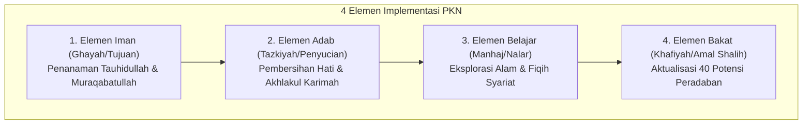

# 4 Elemen Implementasi Pendidikan Karakter Nabawiyah

> [!quote] Dalil & Rujukan Nabawiyah Utama
> **Naskah:**  
> « هُوَ الَّذِي بَعَثَ فِي الْأُمِّيِّينَ رَسُولًا مِّنْهُمْ يَتْلُو عَلَيْهِمْ آيَاتِهِ وَيُزَكِّيهِمْ وَيُعَلِّمُهُمُ الْكِتَابَ وَالْحِكْمَةَ وَإِن كَانُوا مِن قَبْلُ لَفِي ضَلَالٍ مُّبِينٍ »
>
> *"Dialah yang mengutus kepada kaum yang buta huruf seorang Rasul di antara mereka, yang membacakan ayat-ayat-Nya kepada mereka, menyucikan (jiwa) mereka, dan mengajarkan kepada mereka Kitab (Al-Qur'an) dan Hikmah (As-Sunnah). Dan sesungguhnya mereka sebelumnya benar-benar dalam kesesatan yang nyata."*
>
> 📚 **Sumber Rujukan OpenBayan:** QS. Al-Jumu'ah: 2; Tafsir Ibnu Katsir (Juz 8 Hal. 115); Al-Hulal al-Ibriziyyah min Ta'liqat al-Baziyyah ala Shahih al-Bukhari.  
> 💡 **Relevansi PKN:** Ayat ini menguraikan 4 elemen arsitektural risalah kenabian: Pembacaan tanda kebesaran Allah (Elemen Iman), Penyucian jiwa (Elemen Adab/Hati), Pengajaran hukum syariat (Elemen Belajar), dan Kebijaksanaan aplikasi nyata (Elemen Bakat/Peradaban).

---

## 1. Arsitektur Empat Elemen Ekosistem PKN

Agar Pendidikan Karakter Nabawiyah dapat beroperasi secara utuh di rumah dan sekolah, terdapat **4 Elemen Inti** yang harus hadir secara serentak dan saling menopang:

---

## 2. Rincian Empat Elemen & Teladan Tarbiyah Nabawiyah

### 1. Elemen Iman (الغَايَة - Al-Ghayah / Tujuan Tertinggi)
* **Hakikat:** Memastikan bahwa seluruh aktivitas pendidikan anak bermuara pada pengenalan (*Ma'rifatullah*), kecintaan (*Mahabbah*), dan ketundukan mutlak kepada Allah SWT.
* **Teladan Rasulullah ﷺ di Darul Arqam:** Selama 13 tahun fase Makkah, Rasulullah ﷺ memfokuskan pembinaan akidah tauhid sebelum hukum-hukum muamalah dan sanksi hudud diturunkan di Madinah. Hasilnya adalah para sahabat memiliki imunitas iman yang kokoh menghadapi siksaan dahsyat kaum musyrikin (seperti Bilal bin Rabah, Khabbab, dan Keluarga Yasir).
* **Aplikasi Keluarga:** Menghidupkan suasana zikir di rumah, mengaitkan seluruh fenomena sains dengan kekuasaan Allah (*"Lihatlah siapa yang menciptakan langit tanpa tiang ini"*).

### 2. Elemen Adab (التَّزْكِيَة - At-Tazkiyah / Penataan Jiwa)
* **Hakikat:** Menanamkan rasa hormat, tata krama, kesucian diri (*'iffah*), dan kerendahan hati sebelum mengajarkan ilmu pengetahuan akademis.
* **Atsar Shahabat & Ulama Salaf:**
  * Abdullah bin Al-Mubarak berkata: *"Kami mempelajari adab selama tiga puluh tahun, dan kami mempelajari ilmu pengetahuan selama dua puluh tahun."*
  * Imam Malik menasihatkan kepada pemuda Quraisy: *"Pelajarilah adab sebelum engkau mempelajari ilmu!"*
* **Aplikasi Keluarga:** Membiasakan adab makan, adab berbicara, adab meminta izin memasuki kamar orang tua (*isti'dzan*), dan adab menghormati orang yang lebih tua.

### 3. Elemen Belajar (المَنْهَج - Al-Manhaj / Logika & Eksplorasi)
* **Hakikat:** Mengasah fitrah ingin tahu alami anak melalui interaksi langsung dengan dunia nyata (*tajribah & mushahadah*), bukan hafalan mekanis di luar konteks.
* **Teladan Rasulullah ﷺ Mengajarkan Fiqih Praktis:** Rasulullah ﷺ tidak hanya berceramah di atas mimbar, melainkan berwudhu di hadapan para sahabat seraya bersabda: *"Barangsiapa berwudhu seperti wudhuku ini..."* (HR. Bukhari No. 159), dan bersabda: *"Shalatlah kalian sebagaimana kalian melihat aku shalat!"* (HR. Bukhari No. 631).
* **Aplikasi Keluarga:** Mengajak anak ke pasar tradisional untuk belajar matematika jual-beli, mengamati semut dan tumbuhan untuk belajar biologi ciptaan Allah.

### 4. Elemen Bakat (العَمَل - Al-'Amal / Aktualisasi Peran Kekhalifahan)
* **Hakikat:** Mengidentifikasi dan memfasilitasi 40 sifat karakter mulia (TB40) anak hingga bermuara pada karya amal shalih yang solutif bagi umat.
* **Teladan Rasulullah ﷺ Membina Potensi Khusus:** Beliau mengarahkan Hassan bin Tsabit bersyair membela Islam, mengutus Mush'ab bin Umair berdiplomasi, dan mengangkat Usamah bin Zaid memimpin ekspedisi militer.
* **Aplikasi Keluarga:** Menggunakan instrumen observasi Rukun 3A (Suka, Bisa, Bermanfaat) untuk menemukan penjurusan profesi anak menjelang usia baligh.

---

---

## 3. Matriks Sinergi Operasional 4 Elemen dalam Kehidupan Sehari-hari

Untuk memastikan keempat elemen ini tidak berjalan secara terisolasi, orang tua dan pendidik dapat menggunakan instrumen evaluasi berkala berikut:

| Dimensi Evaluasi | Indikator Keberhasilan Operasional | Contoh Penerapan di Rumah & Sekolah |
| :--- | :--- | :--- |
| **Integrasi Iman-Adab** | Ibadah tidak sekadar ritual mekanis, melainkan melahirkan kepekaan moral dan kesantunan. | Anak yang rajin shalat berjamaah di masjid otomatis memiliki adab berbicara yang santun kepada orang tua dan tetangga. |
| **Integrasi Belajar-Bakat** | Pengetahuan kognitif yang dipelajari langsung dihubungkan dengan penyaluran minat dan potensi karya nyatanya. | Anak yang memiliki bakat analitis (*Berpikir*) diajak meneliti siklus air wudhu atau merancang sistem pengairan hidroponik keluarga. |
| **Sinergi Keempat Elemen** | Anak tumbuh menjadi pribadi muslim yang utuh (*syumuliyyah*): kokoh tauhidnya, luhur adabnya, cerdas nalarnya, dan nyata kontribusinya. | Pemuda mukallaf yang siap memimpin, berwirausaha mandiri secara halal, dan menjadi teladan bagi lingkungannya. |

## 4. Tautan Konseptual Terkait
* [[4 Kaidah Implementasi]] — Prinsip Operasional Pengasuhan.
* [[Pendidikan Ideal]] — Paradigma Akil-Baligh PKN.
* [[Bakat]] — Katalog 40 Sifat Karakter Nabawiyah.
* [[Tanggung Jawab Pendidikan]] — Peran Asali Orang Tua dalam Pengasuhan.
