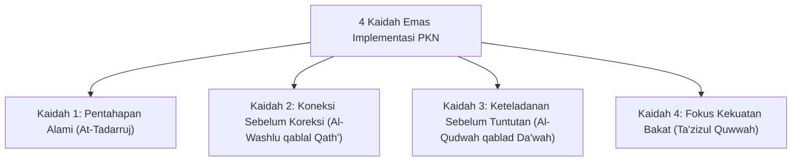

# 4 Kaidah Emas Implementasi Pendidikan Karakter Nabawiyah

> [!quote] Dalil & Rujukan Nabawiyah Utama
> **Naskah:**  
> « يَسِّرُوا وَلَا تُعَسِّرُوا، وَبَشِّرُوا وَلَا تُنَفِّرُوا، وَتَطَاوَعَا وَلَا تَخْتَلِفَا »
>
> *"Permudahlah dan jangan mempersulit, berikanlah kabar gembira dan jangan membuat orang lari menjauh, serta bersatu-padulah kalian dan jangan saling berselisih!"*
>
> 📚 **Sumber Rujukan OpenBayan:** HR. Al-Bukhari No. 69 & Muslim No. 1733; Wasiat Rasulullah ﷺ kepada Mu'adz bin Jabal dan Abu Musa Al-Asy'ari saat diutus ke Yaman; Riyadush Shalihin No. 637.  
> 💡 **Relevansi PKN:** Empat Kaidah Implementasi adalah kompas operasional bagi seluruh orang tua, guru, dan pengelola lembaga pendidikan dalam menerapkan PKN secara aplikatif, menggembirakan, dan terbebas dari kekakuan doktrin yang membuat anak lari menjauh dari agama.

---

## 1. Arsitektur Empat Kaidah Emas PKN

Pendidikan Karakter Nabawiyah merumuskan **4 Kaidah Emas Operasional** yang wajib dipegang teguh oleh setiap pendidik:

---

## 2. Rincian Kaidah, Dalil OpenBayan, & Contoh Interaksi Shahabat

### Kaidah 1: Pentahapan Alami (At-Tadarruj fi At-Tarbiyah)
* **Makna Kaidah:** Menumbuhkan karakter mengikuti ritme kematangan biologis dan kejiwaan anak, tidak menuntut buah matang sebelum pohon berakar kuat.
* **Teladan Rasulullah ﷺ & Atsar Aisyah radhiyallahu 'anha:**
  Ummul Mukminin Aisyah mengisahkan hikmah agung pentahapan turunnya Al-Qur'an:
  > « إِنَّمَا نَزَلَ أَوَّلَ مَا نَزَلَ مِنْهُ سُورَةٌ مِنَ المُفَصَّلِ، فِيهَا ذِكْرُ الجَنَّةِ وَالنَّارِ، حَتَّى إِذَا ثَابَ النَّاسُ إِلَى الإِسْلاَمِ نَزَلَ الحَلاَلُ وَالحَرَامُ، وَلَوْ نَزَلَ أَوَّلَ شَيْءٍ: لاَ تَشْرَبُوا الخَمْرَ، لَقَالُوا: لاَ نَدَعُ الخَمْرَ أَبَدًا! وَلَوْ نَزَلَ: لاَ تَزْنُوا، لَقَالُوا: لاَ نَدَعُ الزِّنَا أَبَدًا! »  
  > *"Sesungguhnya ayat Al-Qur'an yang mula-mula turun adalah surat-surat Al-Mufashshal yang di dalamnya menceritakan surga dan neraka (menanamkan keimanan). Hingga ketika manusia telah condong dan kokoh dalam Islam, barulah turun ayat-ayat tentang halal dan haram. Seandainya yang pertama kali turun adalah: 'Janganlah kalian minum khamr!', niscaya mereka akan berkata: 'Kami tidak akan meninggalkan khamr selamanya!' Dan seandainya yang pertama kali turun adalah: 'Janganlah kalian berzina!', niscaya mereka akan berkata: 'Kami tidak akan meninggalkan zina selamanya!'"*  
  > 📚 *(HR. Al-Bukhari No. 4993, Kitab Fadha'ilil Qur'an)*
* **Aplikasi Praktis PKN:** Jangan menuntut anak usia 7 tahun khusyuk shalat laksana ulama senior; usia 7–10 tahun adalah masa pembiasaan gerak dan cinta shalat, bukan masa penuntutan kesempurnaan.

---

### Kaidah 2: Koneksi Sebelum Koreksi (Al-Washlu qablal Qath')
* **Makna Kaidah:** Memastikan jalinan kasih sayang, kepercayaan batin, dan tangki cinta anak terisi penuh sebelum melancarkan koreksi atau teguran disiplin.
* **Teladan Rasulullah ﷺ Bersama Orang Arab Badui di Masjid:**
  Anas bin Malik menceritakan seorang Arab Badui yang kencing di sudut Masjid Nabawi:
  > « أَنَّ أَعْرَابِيًّا بَالَ فِي المَسْجِدِ، فَقَامَ إِلَيْهِ بَعْضُ القَوْمِ لِيَقَعُوا بِهِ، فَقَالَ رَسُولُ اللَّهِ ﷺ: دَعُوهُ وَلَا تُزْرِمُوهُ، فَلَمَّا فَرَغَ دَعَا بِذَنُوبٍ مِنْ مَاءٍ فَصُبَّ عَلَيْهِ، ثُمَّ دَعَاهُ فَقَالَ لَهُ: إِنَّ هَذِهِ المَسَاجِدَ لَا تَصْلُحُ لِشَيْءٍ مِنْ هَذَا البَوْلِ وَالقَذَرِ، إِنَّمَا هِيَ لِذِكْرِ اللَّهِ وَالصَّلَاةِ وَقِرَاءَةِ القُرْآنِ »  
  > *"Seorang Badui kencing di dalam masjid, maka sebagian sahabat bangkit hendak memukulnya. Rasulullah ﷺ bersabda: 'Biarkan dia dan jangan putuskan kencingnya!' Ketika orang Badui itu selesai kencing, beliau meminta seember air lalu menyiram bekas kencingnya. Kemudian beliau memanggil orang Badui itu dengan lembut dan bersabda: 'Sesungguhnya masjid-masjid ini tidak layak untuk air kencing dan kotoran sedikit pun; masjid itu hanya dibangun untuk mengingat Allah, mendirikan shalat, dan membaca Al-Qur'an.'"*  
  > 📚 *(HR. Al-Bukhari No. 220 & Muslim No. 285)*
* **Aplikasi Praktis PKN:** Saat anak berbuat salah (menumpahkan susu, memecahkan piring), jangan langsung menghardik. Dekap tubuhnya, tenangkan ketakutannya (*Koneksi*), bersihkan bersama-sama, barulah ajarkan cara memegang gelas yang benar (*Koreksi*).

---

### Kaidah 3: Keteladanan Sebelum Tuntutan (Al-Qudwah qablad Da'wah)
* **Makna Kaidah:** Pendidik wajib menjadi cerminan hidup dari nilai yang diajarkan. Anak adalah peniru ulung; ia mendengar apa yang kita lakukan, bukan apa yang kita ucapkan.
* **Teladan Rasulullah ﷺ pada Perjanjian Hudaibiyah:**
  Saat para sahabat terpukul dan enggan menyembelih hewan qurban tanda tahallul karena kecewa dengan isi perjanjian yang berat sebelah, Rasulullah ﷺ masuk ke tenda Ummu Salamah radhiyallahu 'anha. Ummu Salamah memberikan usulan cerdas: *"Wahai Rasulullah, keluarlah dan jangan berbicara sepatah kata pun kepada mereka sampai engkau menyembelih untamu dan memanggil tukang cukurmu untuk mencukur rambutmu!"* Ketika Rasulullah ﷺ keluar dan mempraktikkannya di depan mata para sahabat tanpa berkata-kata, seketika itu pula seluruh sahabat bangkit berebut menyembelih qurban dan mencukur rambut mereka! *(HR. Al-Bukhari No. 2731).*
* **Aplikasi Praktis PKN:** Orang tua yang ingin anaknya gemar membaca Al-Qur'an dan menjauhi gawai harus meletakkan ponselnya dan membuka mushaf Al-Qur'an setiap hari di ruang tengah keluarga.

---

### Kaidah 4: Fokus pada Kekuatan Bakat (Ta'zizul Quwwah)
* **Makna Kaidah:** Berfokus melejitkan potensi bakat alami anak (*focus on strengths*), bukan membuang energi hidup untuk memaksa memperbaiki kelemahan yang memang bukan bawaan fitrahnya.
* **Keterangan Imam Ibnu Qayyim Al-Jauziyyah:**
  Dalam *Madarijus Salikin*:
  > *"Pintu masuk menuju surga dan keridhaan Allah itu berbilang sesuai dengan ragam potensi manusia: ada yang dibukakan pintu melalui shalat sunnah dan puasa, ada yang melalui jihad dan keberanian, ada yang melalui sedekah dan harta, ada yang melalui ilmu dan tadabbur. Maka orang tua yang bijak mengamati pintu mana yang paling mudah bagi anaknya untuk masuk menuju Allah, lalu ia membimbingnya di jalan tersebut."*
* **Aplikasi Praktis PKN:** Jika anak memiliki bakat kuat dalam komunikasi dan kepemimpinan (*Memerintah*), jangan paksa ia menjadi juara olimpiade sains murni. Fasilitasi kekuatannya agar menjadi juru bicara dakwah yang tangguh.

---

## 3. Tautan Konseptual Terkait
* [[4 Elemen Implementasi]] — Struktur Empat Komponen Ekosistem PKN.
* [[Metode Mendidik]] — Operasionalisasi Tiga Bahasa Nabawiyah.
* [[Pendidikan Ideal]] — Paradigma Akil-Baligh dan Generasi Peradaban.
* [[Bakat]] — Penjabaran 40 Sifat Karakter Nabawiyah.
