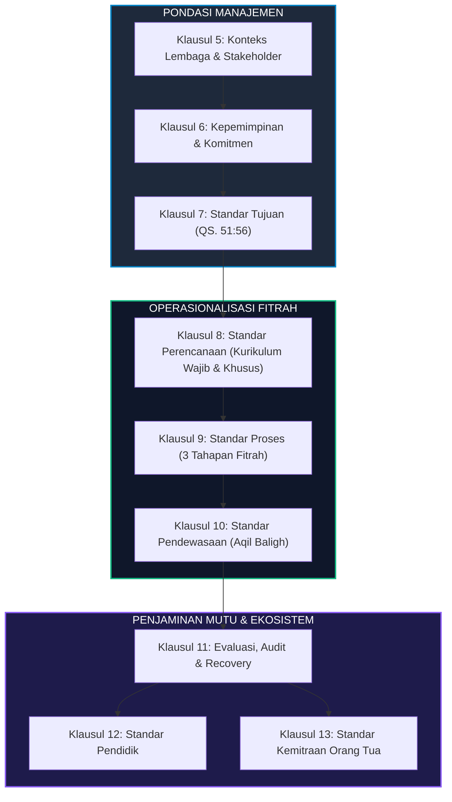
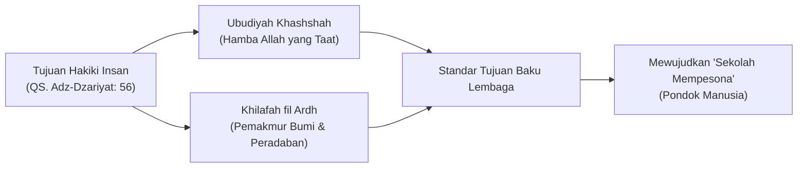
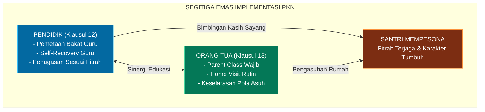

![[assets/banners/banner_8_standar_pkn.webp]]
*Gambar: Pilar-pilar 8 Standar Mutu Implementasi PKN*

# 🏛️ 8 Standar Implementasi Pendidikan Karakter Nabawiyah

> [!note] Catatan Metodologi & Sumber Penyusunan Dokumen
> Dokumen ini merupakan hasil rangkuman dan rekonstruksi berbantuan kecerdasan buatan (AI) dari berbagai materi presentasi, modul kurikulum, dokumen standar lembaga, dan rekaman kajian **Pendidikan Karakter Nabawiyah (PKN)** yang diampu oleh **Ustadz Abdul Kholiq**.  
> 
> Naskah ini telah melalui verifikasi dan pengayaan ulang dalil-dalil Al-Qur'an dan Hadits shahih dari korpus **OpenBayan** (60 kitab klasik), serta diperkaya dengan sintesis intisari dan masukan berharga dari kawan-kawan **Himmatul Ummah**, **Insan Taqwa / Mustaqbal**, dan **Tim SOTAB HEBAT**.

> [!IMPORTANT]
> **Rujukan Otoritatif:** Artikel ini disusun berdasarkan dokumen resmi *Panduan Implementasi Standar Pendidikan Karakter Nabawiyah pada Lembaga Pendidikan Islam* (Standar 11/2024 Rev 04) yang dirumuskan oleh Ustadz Abdul Kholiq dan Bayu Issetyadi (Penerbit Perkumpulan Radio Komunitas Mutiara Qur'an, Semarang/Depok, November 2024). Standar ini berfungsi sebagai pedoman sistem penjaminan mutu internal (*Internal Quality Assurance*) bagi sekolah, ma'had, pesantren, dan komunitas *homeschooling* yang berikhtiar menyelenggarakan pendidikan berbasis fitrah nabawiyah.

Penyelenggaraan pendidikan karakter nabawiyah di tingkat institusi menuntut tata kelola yang tertib, terukur, dan akuntabel tanpa mereduksi kelenturan fitrah manusia menjadi sekadar mekanisasi birokrasi. Jika [[4 Kaidah Implementasi]] menetapkan rambu-rambu metodologis universal dan [[4 Elemen Implementasi]] memetakan pilar ekosistemnya, maka **8 Standar Implementasi PKN** menguraikan langkah-langkah prosedural operasional lembaga dari hulu ke hilir.

---

## 1. Klausul 5: Standar Konteks Lembaga dan Pemangku Kepentingan

*Rancang Bangun Implementasi Kurikulum PKN pada Lembaga Persekolahan*

Standar ini mewajibkan setiap lembaga pendidikan mengenali karakteristik unik lingkungannya sebelum merancang program kerja. Lembaga tidak boleh sekadar menyalin (*copy-paste*) kurikulum dari tempat lain tanpa membedah konteks sosiokultural dan spiritualnya.

### 5.1 Memahami Permasalahan Internal dan Eksternal
Lembaga wajib memetakan dua dimensi permasalahan:
1. **Permasalahan Internal:**
   - Kesiapan mental dan aqidah para pendidik dan tenaga kependidikan.
   - Keberadaan luka atau hutang pengasuhan pada guru yang belum tuntas (*unresolved inner child*).
   - Sarana prasarana fisik yang mendukung eksplorasi alam dan proyek santri.
   - Kemandirian finansial yayasan agar tidak tergantung pada komersialisasi kuota santri.
2. **Permasalahan Eksternal:**
   - Tren degradasi moral masyarakat sekitar dan tantangan disrupsi digital (adiksi gawai, pornografi, pergaulan bebas).
   - Ekspektasi wali santri yang masih terbelenggu paradigma materialistik (menuntut angka rapor kognitif semata).
   - Regulasi pemerintah/dinas pendidikan lokal yang harus diselaraskan secara bijak.

### 5.2 Pemetaan Pemangku Kepentingan (*Stakeholder Analysis*)
Lembaga wajib mendokumentasikan harapan dan kebutuhan dari 5 lingkaran pemangku kepentingan:
- **Santri:** Hak mendapatkan perlindungan fitrah, ruang eksplorasi yang aman (*safe environment*), dan bimbingan adab tanpa kekerasan verbal maupun fisik.
- **Orang Tua / Wali Santri:** Kebutuhan pendampingan pengasuhan selaras antara rumah dan sekolah.
- **Pendidik & Karyawan:** Hak pembinaan ruhiyah berkala, penugasan yang sesuai dengan profil bakat, serta ruang pemulihan (*self-recovery*).
- **Masyarakat Sekitar:** Keberkahan kehadiran lembaga melalui khidmah sosial santri.
- **Pengurus Yayasan & Pembina:** Akuntabilitas syar'i dan keberlanjutan dakwah.

### 5.3 Matriks Pemilahan Permasalahan Lembaga (Lampiran B)
Dalam mengelola dinamika harian, pimpinan lembaga menerapkan adaptasi nabawi terhadap matriks urgensi dan signifikansi:

| Kuadran | Klasifikasi Masalah | Karakteristik Masalah | Tindakan Lembaga |
|:---:|---|---|---|
| **I** | **Urgen & Penting** | Penyimpangan aqidah darurat, kekerasan fisik antar santri, krisis moral akut | Ditangani seketika oleh pimpinan (*Immediate Intervention*) |
| **II** | **Tidak Urgen tapi Sangat Penting** | Perancangan kurikulum fitrah, pembinaan pendidik, *Parent Class*, *self-recovery* guru | Dijadwalkan secara konsisten tanpa kompromi (*Core Strategic Focus*) |
| **III** | **Urgen tapi Tidak Penting** | Interupsi administratif mendadak, permintaan laporan non-substantif pihak luar | Didelegasikan atau disederhanakan (*Streamline/Delegate*) |
| **IV** | **Tidak Urgen & Tidak Penting** | Debat kusir metodologi tanpa aksi, kesibukan seremonial yang melelahkan | Dieliminasi dari kalender lembaga (*Eliminate*) |

---

## 2. Klausul 6: Standar Kepemimpinan dan Komitmen

Kepemimpinan dalam PKN adalah kepemimpinan khidmah dan keteladanan (*Qiyadah bil-Uswah*), bukan sekadar manajemen manajerial formal.

### 6.1 Komitmen Pimpinan Puncak
Pimpinan lembaga (Mudir Ma'had, Kepala Sekolah, Ketua Yayasan) wajib:
1. Memastikan filosofi fitrah berbasis Al-Qur'an dan Sunnah menjadi jiwa dari seluruh dokumen operasional lembaga, bukan sekadar pelengkap brosur promosi.
2. Mengalokasikan sumber daya riil (anggaran, waktu, dan tenaga) untuk program pembinaan karakter pendidik dan orang tua santri.
3. Menjadi teladan utama dalam penerapan adab, kelembutan komunikasi (*Bahasa Hati*), dan keterbukaan menerima kritik (*tabayyun*).

### 6.2 Penetapan Kebijakan Mutu Karakter
Kebijakan lembaga harus secara eksplisit menyatakan:
- Larangan mutlak segala bentuk perundungan (*bullying*), hukuman fisik yang merusak fitrah, dan pelabelan negatif (*stigmatisasi*).
- Jaminan perlakuan adil kepada setiap anak berdasarkan keunikan fitrah masing-masing, bukan standarisasi peringkat kelas yang seragam.

---

## 3. Klausul 7: Standar Tujuan Lembaga

Standar ini mengunci arah seluruh program pendidikan agar tidak melenceng dari tujuan penciptaan manusia di muka bumi.

### 7.1 Landasan Filosofis Tujuan Pendidikan (Lampiran C)
Lembaga merujuk langsung pada firman Allah *Subhanahu wa Ta'ala*:
$$\text{وَمَا خَلَقْتُ الْجِنَّ وَالْإِنْسَ إِلَّا لِيَعْبُدُونِ}$$
*"Dan tidaklah Aku menciptakan jin dan manusia melainkan supaya mereka beribadah kepada-Ku."* (QS. Adz-Dzariyat: 56).

Sebagaimana diterangkan oleh Al-Hafizh Ibnu Katsir *rahimahullah*, tujuan peribadatan ini mengejawantah ke dalam dua dimensi mutlak:
1. **Ikhlas Lillah:** Seluruh amal ditujukan semata-mata mengharapkan ridha Allah.
2. **Ittiba' Rasul:** Pola pendidikan meneladani sunnah Rasulullah *shallallahu 'alaihi wa sallam*.

### 7.2 Mewujudkan "Sekolah Mempesona" (*Pondok Manusia*)
Standar 11/2024 mencanangkan visi transformasi lembaga menjadi **Sekolah Mempesona** (*Pondok Manusia*), yaitu lembaga pendidikan yang:
- Bukan menjadi "penjara waktu" tempat anak merasa terkekang dan tertekan, melainkan rumah kedua yang dirindukan santri.
- Menghargai martabat insani setiap anak, di mana guru memandang santri dengan pandangan kasih sayang (*Ainur Rahmah*).
- Menjadikan alam terbuka dan kehidupan sosial nyata sebagai ruang kelas utama, bukan mengurung santri di ruang kelas sempit berjam-jam.

---

## 4. Klausul 8: Standar Perencanaan

Standar Perencanaan adalah cetak biru kurikulum PKN. Lembaga membagi materi pembelajaran secara tegas ke dalam dua kategori utama:

### 8.1 Klasifikasi Materi: Wajib vs Khusus/Bakat
1. **Materi Pembelajaran Wajib (*Fardhu 'Ain*):**
   - Diberikan kepada **seluruh santri tanpa kecuali** dengan target tuntas (*mastery learning*).
   - Mencakup: Aqidah shahihah, rukun iman, rukun Islam, thaharah, shalat fardhu, adab-adab harian nabawi, kejujuran (*Shidq*), amanah, dan keterampilan dasar hidup mandiri.
2. **Materi Pembelajaran Khusus / Bakat (*Fardhu Kifayah*):**
   - Disesuaikan secara personal dengan peta keunikan 40 pilar bakat santri ([[Panduan Asesmen dan Observasi TB40]]).
   - Tidak ada paksaan materi bakat; santri yang berbakat logika-analitis (*Fathanah/Hikmah*) diperdalam di ranah sains syar'i dan riset, sedangkan santri yang berbakat kinestetik-kepemimpinan (*Syaja'ah/Qiyadah*) diarahkan pada kepanduan, manajemen sarana, dan bela diri.

### 8.2 Perencanaan Sesuai Alur 4 Tahap Perkembangan (Lampiran E)

| Fase Usia | Terminologi Syar'i | Fokus Materi Pembelajaran | Metode Penugasan |
|---|---|---|---|
| **0 – 7 Tahun** | *At-Thufulah* (Kanak-kanak) | Penumbuhan iman, pengasuhan lekat (*radha'ah & hidhanah*), pengenalan kebaikan Allah melalui alam | 100% Bermain bebas, sensorik alamiah, tanpa beban akademik formal |
| **7 – 10 Tahun** | *At-Tamyiz* (Tumbuh Pikiran) | Pembiasaan shalat (HR. Abu Dawud No. 495), adab sosial, nalar dasar sebab-akibat, keteraturan hidup | Proyek keseharian konkrit, pembiasaan berbasis keteladanan |
| **10 – Baligh** | *Al-Murahaqah* (Ambang Baligh) | Disiplin syariat shalat, pemisahan tempat tidur, eksplorasi intensif bakat (3A), tanggung jawab individu | Proyek kelompok mandiri, kepanduan, pemecahan masalah riil |
| **>14 / 15 Tahun** | *Asy-Syabab* (Pemuda Mukallaf) | Kesiapan mukallaf penuh, peran sosial peradaban, kepemudaan, kerumahtanggaan, magang keahlian | Magang profesional (*apprenticeship*), inisiatif dakwah mandiri |

### 8.3 Perencanaan Program Observasi 3 Dimensi
Lembaga merancang instrumen lembar observasi untuk 3 ranah:
1. **Observasi Bahasa Hati / Cinta:** Mengukur keterisian tangki cinta santri ([[Bahasa Hati]]).
2. **Observasi Gaya Belajar Qur'ani:** Mengidentifikasi modalitas belajar dominan (*Al-Fu'ad, As-Sam'u, Al-Bashar*) ([[Belajar]]).
3. **Observasi Kinerja Bakat TB-40:** Mengamati kemunculan spontan 40 pilar sifat mulia.

---

## 5. Klausul 9: Standar Proses Pembelajaran

Standar Proses mengatur tata cara interaksi edukatif di lapangan dengan mengedepankan toleransi deviasi yang proporsional.

### 9.1 Tahapan Penumbuhan Iman Melalui Bahasa Cinta
Proses pendidikan diawali dengan memastikan hati santri tertaut dengan pendidik. Sesuai prinsip:
> *"Selembut-lembutnya bahasa akal untuk mendidik hati, akan dapat melukainya!"*

Pendidik wajib menguasai 3 modalitas operasional Bahasa Hati:
- **Khidmah:** Melayani kebutuhan santri dengan tulus tanpa merendahkan martabatnya.
- **Himayah:** Memberikan perlindungan emosional dan fisik yang aman.
- **Mushahabah:** Membangun pertemanan dialogis, mendengarkan curahan hati santri tanpa langsung menghakimi.

### 9.2 Tahapan Penumbuhan Karakter Belajar (*Trial and Error*)
Belajar bukan menghafal pasif, melainkan proses aktif mengalami:
- Memberikan ruang bagi anak untuk melakukan kesalahan (*trial and error*) tanpa dicap bodoh atau gagal.
- Mengintegrasikan kurikulum 25 aktivitas keseharian ([[Pembelajaran Alamiah]]) ke dalam jadwal harian santri.

### 9.3 Tahapan Penajaman Bakat Berbasis Proyek (*Project-Based Learning*)
Penajaman bakat santri diorganisasikan melalui pembelajaran berbasis proyek nyata (*real-world project*), bukan sekadar teori di atas kertas. Proyek harus memiliki kriteria 3A:
- Santri menyukainya (**Al-Hirsh / sukA**).
- Santri mampu mengasahnya hingga mahir (**Al-Itqan / bisA**).
- Karya proyek memberikan manfaat bagi orang lain (**Al-Mufid / bergunA**).

---

## 6. Klausul 10: Standar Pendewasaan (Aqil Baligh)

> [!NOTE]
> Standar Pendewasaan adalah keunikan mahakarya kurikulum PKN. Standar ini memastikan anak yang telah menginjak usia baligh tidak mengalami *sindrom infantilisme* (remaja yang tubuhnya dewasa namun perilakunya kekanak-kanakan dan tidak berdaya secara finansial maupun sosial).

Klausul 10 menetapkan 6 pilar pendewasaan santri mukallaf:

### 10.1 Pembinaan Kepemudaan dan Kerumahtanggaan
Santri usia *syabab* dibekali keterampilan hidup (*life skills*) dan ilmu keluarga syar'i:
- Pemahaman fikih thaharah dan jinayah secara mendalam.
- Pengenalan hakikat lawan jenis dalam koridor syariat dan adab *Ghadhdhul Bashar*.
- Pengenalan tugas, hak, dan kewajiban kepala rumah tangga (*Qawwamah*) bagi santri putra dan kepengurusan rumah tangga bagi santriwati.
- Kriteria memilih pasangan hidup yang shalih/shalihah berlandaskan hadits Nabi.

### 10.2 Pembelajaran Berbasis Proyek Peradaban
Santri tidak lagi mengerjakan tugas lembar kerja siswa (LKS) sepele, melainkan memimpin proyek yang berdampak luas, seperti: pengelolaan sanitasi lingkungan ma'had, digitalisasi perpustakaan pesantren, penerbitan buletin dakwah, atau pengorganisasian bakti sosial masyarakat.

### 10.3 Pengelolaan Sarana dan Prasarana oleh Santri
Lembaga mempercayakan pengelolaan, pemeliharaan, dan perbaikan fasilitas ma'had kepada dewan santri (bengkel kerja, kelistrikan sederhana, inventaris dapur, dan pertamanan), guna menumbuhkan rasa tanggung jawab (*Amanah*) dan wibawa (*Waqaar*).

### 10.4 Pemandirian Finansial Santri Putra
Santri putra dilatih untuk berdikari secara finansial sebelum lulus dari lembaga:
- Kebiasaan menabung dan mengelola anggaran saku pribadi.
- Menjalankan unit usaha mandiri skala kecil di dalam ma'had (kantin kejujuran, *laundry* mandiri, percetakan kaos dakwah, budidaya hidroponik).
- Memahami etika jual-beli Islam, larangan riba, dan keberkahan mencari nafkah halal (*Kasab Halal*).

### 10.5 Pemandirian Pengurusan Rumah Tangga bagi Santriwati
Santriwati dibekali kompetensi manajerial keluarga nabawiyah: tata kelola gizi halal-thayyib, pertolongan pertama pada kesehatan keluarga, pendidikan usia dini, tata ruang islami, dan ketahanan ekonomi keluarga.

### 10.6 Program Magang Terbimbing (*Apprenticeship*)
Santri diterjunkan langsung ke dunia kerja nyata di bawah asuhan praktisi ahli:
- Magang diselaraskan dengan hasil pemetaan bakat TB-40 dominan santri.
- Memiliki mentor lapangan yang memantau adab profesional dan kompetensi teknis.
- Menyusun laporan refleksi portofolio karya setelah menyelesaikan masa magang.

---

## 7. Klausul 11: Standar Evaluasi, Audit, dan Recovery

Standar Evaluasi dalam PKN bertujuan memastikan pertumbuhan fitrah santri secara riil, bukan sekadar menilai hafalan kognitif sesaat.

### 11.1 Audit Kesesuaian Proses
Lembaga melakukan audit berkala setiap semester untuk memeriksa:
- Apakah jam mengajar guru terlalu dominan ceramah di kelas?
- Apakah rasio interaksi alam dan proyek lapangan terpenuhi minimal 40% dari total jam belajar?
- Apakah ada guru yang menggunakan metode intimidasi atau ancaman nilai?

### 11.2 Matriks Penanganan Deviasi dan Recovery (Tabel Klausul 11.2)
Bila santri menunjukkan perilaku menyimpang atau stagnasi perkembangan, lembaga tidak langsung menjatuhkan vonis sanksi, melainkan menerapkan protokol terapi berdasarkan klasifikasi kondisi:

| Kondisi | Penumbuhan Karakter | Diagnosis Masalah | Bentuk Intervensi & Terapi Recovery |
|:---:|---|---|---|
| **1** | Karakter Iman: Tumbuh Karakter Belajar: Tumbuh Karakter Bakat: Tumbuh | Telah sesuai tahapan perkembangan usia | Penguatan akselerasi proyek dan bimbingan kepemimpinan (*Qiyadah*) |
| **2** | Karakter Iman: Tumbuh Karakter Belajar: Tumbuh **Karakter Bakat: Belum Tumbuh** | Kurang stimulasi ragam peran dan aktivitas | Penajaman bakat menggunakan Standar Pendewasaan (magang & proyek minat khusus) |
| **3** | Karakter Iman: Tumbuh **Karakter Belajar: Belum Tumbuh** **Karakter Bakat: Belum Tumbuh** | Terjebak kejenuhan akademik formal | Memperbesar interaksi langsung dengan alam bebas (*Tadabbur Alam*) dan penugasan fisik nyata |
| **4** | **Karakter Iman: Belum Tumbuh** Karakter Belajar: Belum Tumbuh Karakter Bakat: Belum Tumbuh | **Hutang Pengasuhan Berat** (*Severe Parenting Debt*) | **Terapi Pemulihan Total (Recovery):** Hentikan seluruh tuntutan akademik; penuhi tangki cinta dengan Bahasa Hati intensif |
| **5** | Terjadi penyimpangan moral kronis | Akumulasi luka batin masa kecil (*deep childhood trauma*) | Konseling terpadu antara tim psikolog/asatidz PKN bersama kedua orang tua kandung |

### 11.3 Prinsip Mutlak: "Tidak Menambah Luka" (*Ad-Dhararu Yuzal*)
Klausul 11.2.3 menegaskan kaidah syar'i fundamental:
> **Pendidik dilarang keras melakukan tindakan perbaikan yang menimbulkan luka baru pada jiwa anak.**

Setiap intervensi perbaikan harus berbasis kasih sayang (*Rahmah*), dialog empatik (*Mushahabah*), dan pemenuhan hak-hak fitrah yang tertunda, bukan mempermalukan anak di depan teman-temannya.

---

## 8. Klausul 12 & 13: Standar Pendidik dan Kemitraan Orang Tua

Keberhasilan implementasi PKN bertumpu pada keselarasan dua pilar pendamping: Pendidik di sekolah dan Orang Tua di rumah.

### 12.1 Standar Pendidik (Klausul 12)
1. **Pemetaan Potensi Guru:** Setiap guru yang bergabung wajib mengikuti asesmen TB-40 untuk mengetahui 5 bakat dominannya.
2. **Penugasan Sesuai Potensi:** Guru tidak dibebani peran yang bertentangan dengan fitrah dasarnya (misal: guru berbakat *Rahmah/Rifq* difokuskan pada wali asrama dan konseling, sedangkan guru berbakat *Hazm/Qiyadah* difokuskan pada kedisiplinan kepanduan).
3. **Program *Self-Recovery* Pendidik:** Lembaga memfasilitasi sesi terapi pemulihan bagi para guru untuk menyelesaikan luka masa lalu masing-masing sebelum mendidik santri.
4. **Pembinaan Berkelanjutan:** Halaqah pekanan mengkaji tafsir ayat-ayat pendidikan, hadits tarbawi, dan studi kasus penanganan santri.

### 13.1 Standar Kemitraan Orang Tua / Wali Santri (Klausul 13)
1. **Pendidikan Orang Tua (*Parent Class*):** Program wajib berkala untuk menyamakan persepsi tarbiyah antara rumah dan ma'had.
2. **Kunjungan Rumah (*Home Visit*):** Pendidik mengunjungi rumah santri untuk melihat langsung lingkungan keluarga dan membangun kedekatan personal.
3. **Guru Tamu Orang Tua (*Parent as Teacher*):** Mengundang orang tua santri yang memiliki keahlian profesional tertentu (dokter, insinyur, pengusaha, pengrajin) untuk mengajar di hadapan santri, memperkaya wawasan peran peradaban santri.

---

## 📑 Matriks Komparatif Ringkas 8 Standar Implementasi PKN

| No | Standar PKN | Klausul Terkait | Sasaran Utama Mutu Lembaga | Bukti Fisik / Dokumen Verifikasi |
|:---:|---|:---:|---|---|
| **1** | **Konteks Lembaga** | Klausul 5 | Pemetaan masalah internal, eksternal, & stakeholder | Dokumen Analisis Konteks & Matriks Masalah |
| **2** | **Kepemimpinan** | Klausul 6 | Komitmen pimpinan terhadap filosofi fitrah | Piagam Kebijakan Mutu Karakter Lembaga |
| **3** | **Standar Tujuan** | Klausul 7 | Keselarasan visi dengan QS. 51:56 & Sekolah Mempesona | Profil Visi Misi & Blueprint Pondok Manusia |
| **4** | **Standar Perencanaan** | Klausul 8 | Pemisahan kurikulum wajib vs bakat per alur usia | Dokumen Kurikulum, Silabus & Program Tahunan |
| **5** | **Standar Proses** | Klausul 9 | Bahasa Hati, pembelajaran alamiah, & proyek nyata | RPP Karakter, Modul Proyek & Logbook Observasi |
| **6** | **Standar Pendewasaan** | Klausul 10 | Kemandirian mukallaf (keluarga, kerja, finansial) | Portofolio Magang, Proyek Santri & Unit Bisnis |
| **7** | **Evaluasi & Perbaikan** | Klausul 11 | Audit kesesuaian & penanganan recovery santri | Laporan Audit Internal & Kartu Terapi Recovery |
| **8** | **Pendidik & Orang Tua** | Klausul 12 & 13 | Sinergi segitiga emas guru - orang tua - santri | Peta TB-40 Guru, Modul Parent Class & Home Visit |

---

## 🔗 Keterkaitan Dokumen Terkait

- [[4 Kaidah Implementasi]]: Rambu-rambu metodologis dasar dalam menjalankan tarbiyah nabawiyah.
- [[4 Elemen Implementasi]]: Empat pilar ekosistem pendidikan (Pendidik, Kurikulum, Lingkungan, Evaluasi).
- [[Kaidah Implementasi di Berbagai Lembaga]]: Panduan adaptasi pada jenjang TK, SD, SMP/SMA, Pesantren, dan Homeschooling.
- [[Panduan RPP dan Observasi Lapangan]]: Instrumen operasional format RPP 3 pilar dan instrumen kuisioner observasi 19 butir.
- [[Panduan Asesmen dan Observasi TB40]]: Panduan lengkap asesmen 40 pilar bakat santri.
- [[Recovery]]: Metodologi pemulihan luka pengasuhan dan pemenuhan tangki cinta.
- [[Syabab]]: Karakteristik dan kurikulum pemuda mukallaf menyongsong aqil baligh.

---

> [!quote] Dokumen & Slide Presentasi Rujukan Resmi PKN
> Pembahasan dalam artikel ini bersumber langsung dari materi tayang pelatihan dan dokumen kurikulum resmi PKN oleh **Ustadz Abdul Kholiq**:
>
> - **Materi:** *Standar Implementasi PKN 11-2024 (Rev 04)*
>   - 📖 **Rujukan Slide:** Dokumen Manual Hal. 10–48 (8 Standar Mutu PKN, Standar Pendewasaan Aqil-Baligh & Tata Kelola Lembaga)
>   - 🔗 **Akses Berkas:** [📥 Unduh PDF (2.5 MB)](https://www.dropbox.com/scl/fi/jp2699r9yutavs9ob49nl/7._Evaluasi__Pendidikan_Karakter_Nabawiyah-1.pdf?rlkey=wu4k8ik616fnmn4rku4agtktb&dl=1) • [👁️ Buka di Dropbox](https://www.dropbox.com/scl/fi/jp2699r9yutavs9ob49nl/7._Evaluasi__Pendidikan_Karakter_Nabawiyah-1.pdf?rlkey=wu4k8ik616fnmn4rku4agtktb&dl=0)
>
> - **Materi:** *3. PEMBELAJARAN BERBASIS PROJEK*
>   - 📖 **Rujukan Slide:** Slide Hal. 5–32 (Desain Pembelajaran Berbasis Proyek Karakter & Format RPP Terpadu)
>   - 🔗 **Akses Berkas:** [📥 Unduh PDF (3.8 MB)](https://www.dropbox.com/scl/fi/rib25hfpjgwg9jq4ecnsq/3.-PEMBELAJARAN-BERBASIS-PROJEK.pdf?rlkey=fx25vuj8iz97j9vsl64458di1&dl=1) • [📊 Unduh PPTX Asli (27.7 MB)](https://www.dropbox.com/scl/fi/s5odch61rsyu9gxos96a9/3.-PEMBELAJARAN-BERBASIS-PROJEK.pptx?rlkey=cfru4prp5q37ag3bf4z8jhzcb&dl=1) • [👁️ Buka di Dropbox](https://www.dropbox.com/scl/fi/rib25hfpjgwg9jq4ecnsq/3.-PEMBELAJARAN-BERBASIS-PROJEK.pdf?rlkey=fx25vuj8iz97j9vsl64458di1&dl=0)
>
> - **Materi:** *6. Implementasi Kurikulum PKN Pada Persekolahan*
>   - 📖 **Rujukan Slide:** Slide Hal. 8–28 (Tahapan Adopsi Kurikulum Karakter pada Sekolah, Pesantren, dan Madrasah)
>   - 🔗 **Akses Berkas:** [📥 Unduh PDF (1.9 MB)](https://www.dropbox.com/scl/fi/l31yame2e48ghsq4su02a/6.-Implementasi-Kurikulum-PKN-Pada-Persekolahan.pdf?rlkey=3qcjge7qn0sqebohiybyomkph&dl=1) • [📊 Unduh PPTX Asli (501 KB)](https://www.dropbox.com/scl/fi/d5g15b0din35v06sanzcx/6.-Implementasi-Kurikulum-PKN-Pada-Persekolahan.pptx?rlkey=n7o2e20svwk8p61i7fp9cvcys&dl=1) • [👁️ Buka di Dropbox](https://www.dropbox.com/scl/fi/l31yame2e48ghsq4su02a/6.-Implementasi-Kurikulum-PKN-Pada-Persekolahan.pdf?rlkey=3qcjge7qn0sqebohiybyomkph&dl=0)
>
> - **Materi:** *10 MASALAH PENDIDIKAN*
>   - 📖 **Rujukan Slide:** Slide Hal. 15–75 (Diagnosis Akar Krisis Pendidikan Modern & Desain Solutif PKN)
>   - 🔗 **Akses Berkas:** [📊 Unduh PPTX Asli (97.5 MB)](https://www.dropbox.com/scl/fi/jqnc3ldzd7ssjs8q45us9/10-MASALAH-PENDIDIKAN.pptx?rlkey=cpxg69hwsgntk514h37wb2gcr&dl=1) • [👁️ Buka di Dropbox](https://www.dropbox.com/scl/fi/jqnc3ldzd7ssjs8q45us9/10-MASALAH-PENDIDIKAN.pptx?rlkey=cpxg69hwsgntk514h37wb2gcr&dl=0)

