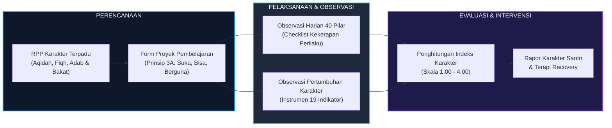
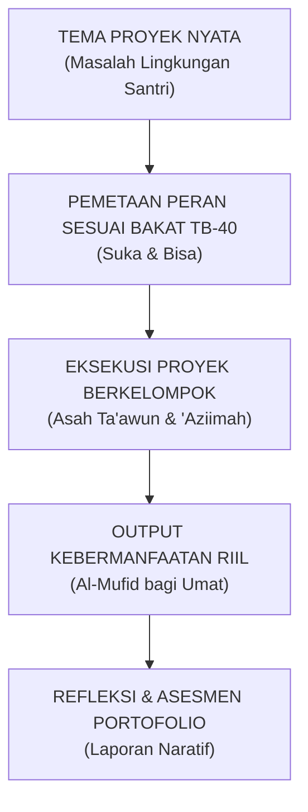
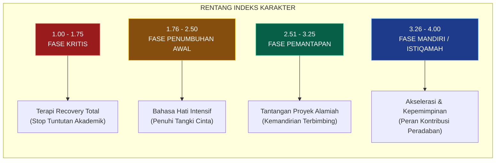

# 📝 Panduan RPP dan Observasi Lapangan Karakter Nabawiyah

> [!note] Catatan Metodologi & Sumber Penyusunan Dokumen
> Dokumen ini merupakan hasil rangkuman dan rekonstruksi berbantuan kecerdasan buatan (AI) dari berbagai materi presentasi, modul kurikulum, dokumen standar lembaga, dan rekaman kajian **Pendidikan Karakter Nabawiyah (PKN)** yang diampu oleh **Ustadz Abdul Kholiq**.  
> 
> Naskah ini telah melalui verifikasi dan pengayaan ulang dalil-dalil Al-Qur'an dan Hadits shahih dari korpus **OpenBayan** (60 kitab klasik), serta diperkaya dengan sintesis intisari dan masukan berharga dari kawan-kawan **Himmatul Ummah**, **Insan Taqwa / Mustaqbal**, dan **Tim SOTAB HEBAT**.


> [!IMPORTANT]
> **Instrumen Resmi Pembelajaran & Observasi:** Panduan ini disusun berdasarkan berkas instrumen resmi kurikulum Pendidikan Karakter Nabawiyah, meliputi:
> 1. *Lembar Rencana Pembelajaran Karakter (RPP)* & *Lembar Pelaksanaan Pembelajaran Karakter* (Akademi Guru PKN Batch 5).
> 2. *Lembar Observasi Pertumbuhan Karakter* (Instrumen 19 Indikator Karakter Iman, Belajar, dan Bakat).
> 3. *Lembar Observasi Pemetaan Karakter* & *Form Perencanaan Proyek Pembelajaran* (Temu Lembaga Batch 4).
> 4. *Pedoman Penghitungan Indeks Karakter* dari Lampiran F Dokumen Standar Implementasi PKN 11/2024 (Rev 04).

Pendidikan Karakter Nabawiyah (PKN) menolak pemisahan artifisial antara kurikulum akademis kognitif dengan pembinaan akhlaq. Karakter bukanlah mata pelajaran teoretis yang diajarkan melalui hafalan definisi semata, melainkan buah dari pembiasaan adab (*Tarbiyah bil-Mu'ayasyah*), pengalaman belajar alamiah, dan penugasan proyek nyata.

Untuk menjembatani paradigma filosofis dengan realitas ruang kelas dan asrama ma'had, artikel ini menyajikan **cetak biru operasional instrumen pembelajaran dan evaluasi harian** yang siap diaplikasikan oleh para guru, wali asrama, dan pimpinan lembaga.



---

## 1. Cetak Biru Rencana Pembelajaran Karakter (RPP) Berbasis Fitrah

Format RPP Karakter PKN dirancang terintegrasi (*integrated thematic learning*) yang menyatukan muatan syariat dengan penumbuhan sifat-sifat mulia 40 pilar bakat nabawiyah ([[Panduan Asesmen dan Observasi TB40]]).

### 1.1 Komponen Inti RPP PKN

| Bagian RPP | Komponen | Deskripsi Operasional |
|---|---|---|
| **I. Identitas Pembelajaran** | Lembaga, Jenjang/Kelas, Semester, Waktu | Menetapkan konteks fase usia santri (*Thufulah, Tamyiz, Murahaqah, Syabab*). |
| **II. Tema Kegiatan** | Tema Kehidupan Riil | Mengaitkan topik belajar dengan fenomena alam, muamalah, atau sirah nabawiyah. |
| **III. Integrasi 3 Ranah Jiwa** | Afeksi, Kognisi, Psikomotorik | - **Afeksi (*Nafsul Muthma'innah*):** Keikhlasan, kebersihan niat, rasa takut & harap kepada Allah.<br/>- **Kognisi (*Nafsul Lawwamah*):** Pemahaman hukum syar'i, analisis kausalitas, nalar ilmiah.<br/>- **Psikomotorik (*Nafsul Ammarah terdidik*):** Eksekusi fisik, ketelitian teknik, ketangkasan berkarya. |
| **IV. Materi Pembelajaran 3 Pilar** | A. Aqidah<br/>B. Ibadah (Fiqh)<br/>C. Adab & Bakat | - **Aqidah:** Menanamkan tauhid rububiyah, uluhiyah, dan asma' wa shifat terkait tema.<br/>- **Ibadah:** Praktik tatacara ibadah praktis (thaharah, shalat, dzikir, muamalah).<br/>- **Adab & Bakat:** Internalisasi adab nabawi dan pilar TB-40 sasaran (misal: *Shidq, Amaanah, 'Aziimah*). |
| **V. Skenario Kegiatan** | Pembuka, Inti, Penutup | - **Pembuka (15% waktu):** Bahasa Hati, sentuhan fisik, apersepsi ayat Al-Qur'an.<br/>- **Inti (70% waktu):** Eksplorasi alamiah, eksperimen mandiri, atau pengerjaan proyek.<br/>- **Penutup (15% waktu):** Refleksi ruhani, muhasabah adab, apresiasi kebaikan, dan doa kaffaratul majelis. |
| **VI. Alat & Bahan** | Sumber Belajar Alamiah | Memprioritaskan bahan-bahan alam terbuka (*open-ended materials*) dan peralatan kerja nyata. |
| **VII. Evaluasi Karakter** | Observasi Kinerja Langsung | Menilai proses dan sikap mental santri saat beraktivitas, bukan sekadar tes tertulis. |

---

### 1.2 Contoh Format RPP Karakter (Model Praktis)

```text
================================================================================
RENCANA PELAKSANAAN PEMBELAJARAN (RPP) BERBASIS FITRAH
================================================================================
Nama Lembaga     : Ma'had Himmatul Ummah
Fase Perkembangan: Fase At-Tamyiz (Usia 8-9 Tahun / Kelas 3)
Tema Kegiatan    : "Tadabbur Air Mengalir & Adab Memakmurkan Masjid"
Alokasi Waktu    : 2 Pertemuan (4 x 45 Menit)
Pilar Sasaran    : Ihsaan (Perfeksionis), Khidmah (Melayani), Syukur (Rasa Syukur)

I. TUJUAN PENUMBUHAN JIWA:
   1. Afeksi    : Merasakan betapa Maha Pengasihnya Allah yang menurunkan air tawar 
                  yang suci (QS. Al-Waqi'ah: 68-70) dan cinta melayani rumah ibadah.
   2. Kognisi   : Memahami pembagian air suci-menyucikan dalam fiqh thaharah dan 
                  menghitung volume kebutuhan air wudhu efisien ala sunnah.
   3. Motorik   : Terampil membersihkan tempat wudhu masjid dan menghemat air wudhu 
                  (maksimal satu mud / ±600 ml) secara disiplin.

II. MATERI PEMBELAJARAN 3 PILAR:
   A. Pilar Aqidah : Menanamkan keyakinan bahwa seluruh rizki air adalah milik Allah semata.
   B. Pilar Fiqh   : Bab Thaharah — Hukum Air Mutlaq vs Air Musta'mal vs Air Mutanajjis.
   C. Pilar Adab   : Adab wudhu tanpa berlebih-lebihan (*Laa Tusrif*) dan pilar Khidmah.

III. LANGKAH-LANGKAH KEGIATAN:
   1. Pembuka (Bahasa Hati):
      - Guru menyambut santri dengan senyuman hangat (*Basyaasyah*) dan jabat tangan.
      - Membaca QS. Al-Anbiya: 30 tentang penciptaan segala sesuatu hidup dari air.
   2. Kegiatan Inti (Eksplorasi Alam & Khidmah):
      - Sesi 1: Observasi sumber air ma'had dan pengukuran volume gayung wudhu.
      - Sesi 2: Praktik wudhu sunnah sesuai riwayat hadits satu mud air.
      - Sesi 3: Proyek "Khidmah Bersih Masjid": Membersihkan tempat wudhu ma'had secara 
                berkelompok (mengasah pilar Ta'awun dan Khidmah).
   3. Penutup (Muhasabah & Evaluasi):
      - Guru mengajak santri duduk melingkar mendoakan orang tua yang memberi nafkah.
      - Guru mencatat checklist observasi kemunculan pilar Ihsaan dan Khidmah.
================================================================================
```

---

## 2. Format Perencanaan Proyek Pembelajaran (*Project-Based Learning*)

Untuk santri fase *Al-Murahaqah* (10–14 tahun) dan *Asy-Syabab* (>14 tahun), pembelajaran diorganisasikan melalui penugasan proyek peradaban. Format perencanaan proyek mencakup:



### 2.1 Lembar Perencanaan Proyek (Template Standar)
1. **Nama Proyek:** Judul proyek kemanfaatan (contoh: *"Pengolahan Kompos Organik Dapur Ma'had & Budidaya Sayur Barakah"*).
2. **Latar Belakang Masalah Riil:** Masalah nyata yang ada di sekitar santri (contoh: sampah sisa sayur dapur ma'had menumpuk dan bau).
3. **Target Manfaat (*Al-Mufid*):** Siapa penerima manfaat dari proyek ini (contoh: tanah taman ma'had menjadi subur dan menghasilkan sayur segar untuk makan bersama).
4. **Distribusi Peran Santri Berbasis TB-40:**
   - Santri dominan *Qiyadah / Hazm* $\to$ Koordinator lapangan dan penegak jadwal kerja.
   - Santri dominan *Fathanah / Tafakkur* $\to$ Riset komposisi mikroorganisme pengurai (EM4) dan pencatat kelembaban.
   - Santri dominan *Himmah / 'Aziimah* $\to$ Eksekutor pembalikan tumpukan kompos dan pengadukan fisik.
   - Santri dominan *Fashahah / Basyaasyah* $\to$ Presenter laporan perkembangan dan pembuat papan edukasi kompos.
5. **Timeline & Jadwal Eksekusi:** Waktu pelaksanaan (3–6 pekan).
6. **Anggaran & Logistik Mandiri:** Santri menghitung modal yang dibutuhkan dan mencari sumber daya halal mandiri.

---

## 3. Instrumen Kuisioner Observasi Pertumbuhan Karakter (19 Indikator)

> [!NOTE]
> Instrumen ini diisi oleh pendidik (wali kelas, asatidz asrama) atau orang tua secara berkala (triwulanan/semesteran) untuk mengukur pertumbuhan fitrah secara obyektif tanpa membebani santri dengan ujian tertulis.

### 3.1 Bagian I: Indikator Karakter Iman (10 Butir)

| No | Pernyataan Indikator Perilaku | Skor 1<br/>*(Tidak Pernah)* | Skor 2<br/>*(Jarang)* | Skor 3<br/>*(Sering)* | Skor 4<br/>*(Selalu/Mandiri)* |
|:---:|---|:---:|:---:|:---:|:---:|
| **1** | Anak tidak perlu disuruh ketika akan melakukan ibadah sholat fardhu. | ☐ | ☐ | ☐ | ☐ |
| **2** | Meskipun tanpa tekanan/pengawasan, anak tetap berkata jujur (*Shidq*) dan bukan karena takut hukuman. | ☐ | ☐ | ☐ | ☐ |
| **3** | Anak tidak harus diingatkan untuk menerapkan tuntunan adab islami pada aktivitas hariannya (makan, masuk toilet, dll.). | ☐ | ☐ | ☐ | ☐ |
| **4** | Anak menunjukkan rasa syukur (*Syukur*) dan qana'ah atas makanan atau fasilitas yang disediakan tanpa mengeluh. | ☐ | ☐ | ☐ | ☐ |
| **5** | Anak menjaga pandangan, aurat, dan kehormatan dirinya (*'Iffah & Haya'*) dalam interaksi pergaulan. | ☐ | ☐ | ☐ | ☐ |
| **6** | Anak spontan menyebut asma Allah (*Dzikrullah*) ketika melihat keindahan alam atau fenomena takjub. | ☐ | ☐ | ☐ | ☐ |
| **7** | Anak tergerak membantu teman yang kesusahan atau bersedih (*Rahmah & Nushrah*) tanpa diminta guru. | ☐ | ☐ | ☐ | ☐ |
| **8** | Anak berlapang dada memaafkan kesalahan temannya (*Ghaffaar*) dan tidak menyimpan dendam berkepanjangan. | ☐ | ☐ | ☐ | ☐ |
| **9** | Anak menjaga lisannya dari kata-kata kotor, caci maki, ghibah, atau memanggil teman dengan julukan buruk. | ☐ | ☐ | ☐ | ☐ |
| **10** | Anak tampak tenang, hening, dan khusyu' saat dibacakan atau mendengarkan lantunan ayat suci Al-Qur'an. | ☐ | ☐ | ☐ | ☐ |

---

### 3.2 Bagian II: Indikator Karakter Belajar (9 Butir)

| No | Pernyataan Indikator Perilaku | Skor 1<br/>*(Tidak Pernah)* | Skor 2<br/>*(Jarang)* | Skor 3<br/>*(Sering)* | Skor 4<br/>*(Selalu/Mandiri)* |
|:---:|---|:---:|:---:|:---:|:---:|
| **1** | Anak tidak perlu disuruh atau diancam untuk membaca, belajar, atau mengeksplorasi ilmu baru. | ☐ | ☐ | ☐ | ☐ |
| **2** | Anak berusaha gigih mencari alternatif solusi sendiri ketika menemui kesulitan dalam tugas atau aktivitasnya. | ☐ | ☐ | ☐ | ☐ |
| **3** | Anak tidak canggung atau malu untuk bertanya kepada guru/orang dewasa mengenai hal yang belum dipahaminya. | ☐ | ☐ | ☐ | ☐ |
| **4** | Anak memiliki rasa ingin tahu yang tinggi (*Fathanah*) terhadap cara kerja benda, alam sekitar, dan lingkungan hidup. | ☐ | ☐ | ☐ | ☐ |
| **5** | Anak mampu mempertahankan fokus dan konsentrasi yang mendalam (*Deep Focus*) pada topik yang sedang dipelajarinya. | ☐ | ☐ | ☐ | ☐ |
| **6** | Anak gemar merenungkan makna di balik pelajaran dan menghubungkannya dengan kekuasaan Allah (*Tadabbur*). | ☐ | ☐ | ☐ | ☐ |
| **7** | Anak bersikap lapang dada (*Samahah*) saat menerima koreksi, kritik membangun, atau nasihat dari pendidik. | ☐ | ☐ | ☐ | ☐ |
| **8** | Anak memanfaatkan waktu luang dengan aktivitas yang bernilai guna dan menambah wawasan kebaikan. | ☐ | ☐ | ☐ | ☐ |
| **9** | Anak merawat buku, catatan, dan perlengkapan belajarnya secara rapi, mandiri, dan bertanggung jawab. | ☐ | ☐ | ☐ | ☐ |

---

### 3.3 Bagian III: Indikator Karakter Bakat (9 Butir)

| No | Pernyataan Indikator Perilaku | Skor 1<br/>*(Tidak Pernah)* | Skor 2<br/>*(Jarang)* | Skor 3<br/>*(Sering)* | Skor 4<br/>*(Selalu/Mandiri)* |
|:---:|---|:---:|:---:|:---:|:---:|
| **1** | Anak memiliki keunikan sifat atau gaya khas yang membedakan dirinya secara positif dari teman-temannya. | ☐ | ☐ | ☐ | ☐ |
| **2** | Anak memiliki aktivitas, peran, atau karya spesifik yang sangat disukainya dan menjadikannya penuh gairah. | ☐ | ☐ | ☐ | ☐ |
| **3** | Anak mampu menghasilkan karya atau menyelesaikan peran favoritnya dengan mutu hasil yang mengagumkan (*Itqan*). | ☐ | ☐ | ☐ | ☐ |
| **4** | Anak konsisten mengulang-ulang aktivitas favoritnya tanpa pernah mengeluh bosan atau jenuh (*Dawam*). | ☐ | ☐ | ☐ | ☐ |
| **5** | Secara spontan tanpa persiapan rumit, anak mampu menjalankan aktivitas favoritnya dengan tangkas dan percaya diri. | ☐ | ☐ | ☐ | ☐ |
| **6** | Anak berinisiatif memodifikasi alat permainan atau menciptakan inovasi baru dari bahan yang ada di sekitarnya. | ☐ | ☐ | ☐ | ☐ |
| **7** | Meskipun menghadapi rintangan berat, anak tidak lekas putus asa dan terus mencari cara menuntaskan karyanya. | ☐ | ☐ | ☐ | ☐ |
| **8** | Meskipun berulang kali mengalami kegagalan, anak bangkit kembali mencoba hingga tuntas (*Syaja'ah & 'Aziimah*). | ☐ | ☐ | ☐ | ☐ |
| **9** | Demi mendalami bidang yang diminatinya, anak rela menabung uang sakunya atau mengorbankan waktu santainya. | ☐ | ☐ | ☐ | ☐ |

---

## 4. Panduan Penskoran dan Kalkulasi Indeks Karakter

### 4.1 Bobot Skor Jawaban
- **Skor 1 (Tidak Pernah / 0%):** Perilaku belum pernah muncul sama sekali; anak selalu menolak atau bergantung mutlak pada paksaan fisik/verbal.
- **Skor 2 (Jarang / Kadang-kadang / <50%):** Perilaku hanya muncul sesekali bila ada pengawasan ketat atau iming-iming hadiah.
- **Skor 3 (Sering / >50%):** Perilaku sudah sering muncul atas kesadaran sendiri, namun sewaktu-waktu masih perlu diingatkan secara lembut.
- **Skor 4 (Selalu / Konsisten Mandiri / 100%):** Perilaku telah mengkristal menjadi karakter mandiri (*Malakah*), muncul spontan tanpa perlu diperintah siapa pun.

### 4.2 Rumus Indeks Karakter
Untuk setiap domain (Iman, Belajar, dan Bakat), hitung nilai indeks menggunakan formula:

$$\text{Indeks Domain} = \frac{\sum \text{Skor yang Diperoleh}}{\text{Jumlah Butir Pernyataan}}$$

Contoh Perhitungan:
- Total Skor Domain Iman (10 Butir) = $35 \implies \text{Indeks Karakter Iman} = \frac{35}{10} = \mathbf{3.50}$
- Total Skor Domain Belajar (9 Butir) = $27 \implies \text{Indeks Karakter Belajar} = \frac{27}{9} = \mathbf{3.00}$
- Total Skor Domain Bakat (9 Butir) = $31 \implies \text{Indeks Karakter Bakat} = \frac{31}{9} = \mathbf{3.44}$

$$\text{Indeks Karakter Komposit Santri} = \frac{35 + 27 + 31}{10 + 9 + 9} = \frac{93}{28} = \mathbf{3.32}$$

---

### 4.3 Matriks Interpretasi dan Intervensi Pedagogis



| Rentang Indeks | Kategori Kematangan | Diagnosis Perkembangan | Tindakan Intervensi Pendidik & Orang Tua |
|:---:|:---:|---|---|
| **1.00 – 1.75** | **Kritis / Terhambat** | Terjadi luka pengasuhan mendalam atau penolakan jiwa terhadap lingkungan sekolah. | **Hentikan sementara materi akademik berat.** Alihkan ke program pemulihan cinta (*Recovery*) dengan Bahasa Hati, hilangkan hukuman, dan lakukan konseling mendalam dengan orang tua ([[Recovery]]). |
| **1.76 – 2.50** | **Penumbuhan Awal** | Fitrah mulai terbangun namun masih rapuh dan mudah goyah saat menghadapi tekanan. | Perbanyak stimulasi bahasa kebersamaan (*Mushahabah*), dampingi santri saat menghadapi frustrasi belajar, dan jangan terburu-buru memberikan vonis kesalahan. |
| **2.51 – 3.25** | **Pemantapan** | Karakter telah tumbuh baik, disiplin syariat mulai stabil atas kesadaran pribadi. | Libatkan dalam proyek kelompok berbasis minat, beri tanggung jawab pengelolaan sarana ma'had secara bertahap, dan perkuat wawasan keteladanan para sahabat Nabi. |
| **3.26 – 4.00** | **Mandiri / Istiqamah** | Telah mencapai kematangan mukallaf sejati (*Al-Malakah al-Khuluqiyyah*). | Berikan ruang kepemimpinan riil (*Qiyadah*), delegasikan peran mentor bagi adik-adik kelasnya, dan fasilitasi magang keahlian profesional di dunia nyata. |

---

## 5. Lembar Checklist Harian Observasi 40 Pilar Bakat

Di luar penilaian kuisioner triwulanan di atas, para pendidik dan musyrif asrama menggunakan lembar checklist harian untuk mencatat **kemunculan spontan** sifat-sifat unggul dari 40 pilar bakat TB-40 santri.

### 5.1 Format Checklist Matriks Harian

```text
================================================================================
LEMBAR OBSERVASI HARIAN 40 PILAR BAKAT SANTRI
================================================================================
Nama Santri : ...................................  Bulan / Pekan : .............
Wali Asrama : ...................................  Kelas / Kamar : .............

Kode Pilar Karakter yang Muncul Spontan dalam Keseharian:
[ Beri tanda centang (✓) pada tanggal kemunculan dan tuliskan konteks peristiwa riil ]

| No | Pilar TB-40 | Tanggal Kemunculan | Catatan Peristiwa Nyata yang Teramati |
|:--:|---|:--:|---|
| 01 | Himmah (Cita-cita Tinggi) | 03/09 | Menyusun rencana menghafal 1 juz dalam 1 bulan tanpa disuruh. |
| 02 | Ihsaan (Perfeksionis) | 04/09 | Merapikan susunan sandal di depan masjid hingga lurus sempurna. |
| 03 | 'Izzah (Harga Diri) | 04/09 | Menolak disuapi makanan teman karena ingin mengambil porsi sendiri. |
| 11 | Shidq (Jujur) | 05/09 | Mengakui memecahkan piring dapur secara ksatria saat piket. |
| 17 | Syaja'ah (Berani) | 06/09 | Tampil ke depan memimpin kultum subuh santri dengan lantang. |
| 23 | Ta'awun (Kerjasama) | 07/09 | Membantu teman yang tertinggal mencuci pakaian tanpa pamrih. |
| 27 | Khidmah (Melayani) | 08/09 | Menyendokkan sayur untuk seluruh teman satu mejanya saat makan. |
================================================================================
```

### 5.2 Kaidah Menjalankan Observasi Harian
1. **Obyektif & Berbasis Peristiwa:** Pendidik hanya mencatat apa yang **dilihat dan didengar langsung**, bukan dugaan, opini, atau asumsi pribadi.
2. **Konteks Keseharian yang Alami:** Observasi paling akurat berlangsung saat santri tidak menyadari dirinya sedang dinilai (waktu bermain, makan bersama, antrean wudhu, piket kamar, atau olahraga).
3. **Mencari Intan Permata, Bukan Mencari Kesalahan:** Fokus observasi guru adalah merekam **kebaikan dan keunikan** santri. Pendidik berperan sebagai *"pemburu kebaikan"* (*Hunters of Goodness*), bukan pengawas yang mencari-cari aib santri.

---

## 6. Lembar Log Aktivitas 3A & Matriks Lapangan (Form Resmi PKN)

Berdasarkan **Panduan Implementasi Standar PKN (A4) Tabel 14** dan **Form Observasi Lapangan Resmi**, pemantauan keseharian santri diperkuat dengan dua instrumen pelengkap:

### 6.1 Format Lembar Log Aktivitas 3A
Log ini mencatat keterlibatan santri dalam tiga jenis aktivitas fitrah:
1. **Aktivitas Spontan (*Alami*):** Kejadian tanpa rencana di mana adab dan karakter anak teruji langsung.
2. **Aktivitas Terencana (*Aplikatif*):** Proyek karya atau penugasan terstruktur yang menuntut ketekunan.
3. **Aktivitas Penyesuaian Lingkungan (*Adaptif*):** Respons anak saat menghadapi situasi baru, pergantian jadwal, atau interaksi sosial yang menantang.

```text
================================================================================
LOG MONITORING AKTIVITAS 3A (ALAMI - APLIKATIF - ADAPTIF)
================================================================================
Nama Santri : ...................................  Pekan Ke- : .................
Pendidik    : ...................................  Kelas     : .................

| No | Kategori Aktivitas | Deskripsi Situasi & Respon Santri | Tanggal Pelaksanaan | Skor Keterlibatan (1-4) | Catatan Khusus Guru |
|:--:|---|---|:---:|:---:|---|
| 1  | Spontan (Alami)    | Membantu merapikan piring teman | 02/09 | 4 (Sangat Aktif) | Tumbuh jiwa Khidmah |
| 2  | Terencana (Proyek) | Merakit kincir air dari bambu   | 04/09 | 3 (Aktif)        | Gigih saat trial-error |
| 3  | Adaptif            | Menerima pembagian kamar baru   | 06/09 | 4 (Sangat Baik)  | Qana'ah & mudah akrab |
================================================================================
```

### 6.2 Matriks Form Observasi Bakat (Cross-Dimensional Matrix)
Menggabungkan preferensi kepribadian (*Introvert vs Ekstrovert*) dengan tiga dimensi kecerdasan (*Jasad/PQ, Akal/IQ, Hati/EQ*):

| Dimensi Kecerdasan | Orientasi Introvert (Reflektif / Ke Dalam) | Orientasi Ekstrovert (Sosial / Ke Luar) |
|:---|:---|:---|
| **Jasad / Fisik (PQ)**<br>*Jiwa Hayawaniyah / Ammarah* | **Bekerja Keras**<br>- Gigih bekerja fisik<br>- Tahan banting & ulet<br>- Mandiri menyelesaikan tugas | **Memerintah / Mempengaruhi**<br>- Berambisi & berwibawa<br>- Motivator & penggerak tim<br>- Berani memimpin risiko |
| **Akal / Rasional (IQ)**<br>*Jiwa Nuthqiyah / Lawwamah* | **Berpikir**<br>- Analitis & konseptor<br>- Kuat riset & firasat<br>- Meneliti sebab-akibat | **Bekerja Sama**<br>- Diplomatis & kolaboratif<br>- Membangun jejaring (*networking*)<br>- Juru damai & mudah akrab |
| **Hati / Emosi (EQ)**<br>*Jiwa Ruhaniyah / Muthmainnah* | **Berperasaan**<br>- Empati mendalam<br>- Menjaga adab & pemalu (*Hayaa'*<br>- Lemah lembut & pemaaf | **Melayani (*Khidmah*)**<br>- Dermawan (*Jud*) & suka menolong<br>- Mendahulukan orang lain (*Itsar*)<br>- Ramah & penyambut tamu (*Basyaasyah*) |

---

## 🔗 Keterkaitan Dokumen Terkait

- [[8 Standar Implementasi PKN]]: Kerangka tata kelola mutu lembaga pendidikan karakter nabawiyah (Standar 11/2024).
- [[4 Elemen Implementasi]]: Arsitektur rapor karakter model SKIS Semarang dan pilar implementasi ekosistem.
- [[Panduan Asesmen dan Observasi TB40]]: Definisi komparatif 40 pilar bakat anak vs dewasa dan alur triangulasi asesmen.
- [[Insan/Fitrah (Karakter)/Bakat/Kuisioner Asesmen 40 Bakat Nabawiyah|Kuisioner Asesmen 40 Bakat Nabawiyah]]: Instrumen baku 40 butir pernyataan self-assessment skala Likert.
- [[Pendidikan Ideal/Menumbuhkan Kesadaran Beramal|Menumbuhkan Kesadaran Beramal]]: Filosofi dan tadabbur ekologi qolbu penumbuhan kesadaran internal.
- [[PKN Blueprint Arsitektur Sistem|PKN Blueprint Arsitektur Sistem]]: Peta menyeluruh arsitektur sistem dan pilar pendidikan PKN.
- [[Pembelajaran Alamiah]]: Integrasi matriks aktivitas keseharian santri dan proyek ke dalam skenario RPP.
- [[Bahasa Hati]]: Tiga modalitas komunikasi cinta (*Khidmah, Himayah, Mushahabah*) untuk pembuka RPP.
- [[Recovery]]: Pedoman intervensi klinis bagi santri dengan indikator pertumbuhan yang terlambat atau memiliki hutang pengasuhan.

---

> [!quote] Dokumen & Slide Presentasi Rujukan Resmi PKN
> Pembahasan dalam artikel ini bersumber langsung dari materi tayang pelatihan dan dokumen kurikulum resmi PKN oleh **Ustadz Abdul Kholiq**:
>
> - **Materi:** *Standar Implementasi PKN 11-2024 (Rev 04)*
>   - 📖 **Rujukan Slide:** Dokumen Manual Hal. 10–48 (8 Standar Mutu PKN, Standar Pendewasaan Aqil-Baligh & Tata Kelola Lembaga)
>   - 🔗 **Akses Berkas:** [📥 Unduh PDF (2.5 MB)](https://www.dropbox.com/scl/fi/jp2699r9yutavs9ob49nl/7._Evaluasi__Pendidikan_Karakter_Nabawiyah-1.pdf?rlkey=wu4k8ik616fnmn4rku4agtktb&dl=1) • [👁️ Buka di Dropbox](https://www.dropbox.com/scl/fi/jp2699r9yutavs9ob49nl/7._Evaluasi__Pendidikan_Karakter_Nabawiyah-1.pdf?rlkey=wu4k8ik616fnmn4rku4agtktb&dl=0)
>
> - **Materi:** *3. PEMBELAJARAN BERBASIS PROJEK*
>   - 📖 **Rujukan Slide:** Slide Hal. 5–32 (Desain Pembelajaran Berbasis Proyek Karakter & Format RPP Terpadu)
>   - 🔗 **Akses Berkas:** [📥 Unduh PDF (3.8 MB)](https://www.dropbox.com/scl/fi/rib25hfpjgwg9jq4ecnsq/3.-PEMBELAJARAN-BERBASIS-PROJEK.pdf?rlkey=fx25vuj8iz97j9vsl64458di1&dl=1) • [📊 Unduh PPTX Asli (27.7 MB)](https://www.dropbox.com/scl/fi/s5odch61rsyu9gxos96a9/3.-PEMBELAJARAN-BERBASIS-PROJEK.pptx?rlkey=cfru4prp5q37ag3bf4z8jhzcb&dl=1) • [👁️ Buka di Dropbox](https://www.dropbox.com/scl/fi/rib25hfpjgwg9jq4ecnsq/3.-PEMBELAJARAN-BERBASIS-PROJEK.pdf?rlkey=fx25vuj8iz97j9vsl64458di1&dl=0)
>
> - **Materi:** *6. Implementasi Kurikulum PKN Pada Persekolahan*
>   - 📖 **Rujukan Slide:** Slide Hal. 8–28 (Tahapan Adopsi Kurikulum Karakter pada Sekolah, Pesantren, dan Madrasah)
>   - 🔗 **Akses Berkas:** [📥 Unduh PDF (1.9 MB)](https://www.dropbox.com/scl/fi/l31yame2e48ghsq4su02a/6.-Implementasi-Kurikulum-PKN-Pada-Persekolahan.pdf?rlkey=3qcjge7qn0sqebohiybyomkph&dl=1) • [📊 Unduh PPTX Asli (501 KB)](https://www.dropbox.com/scl/fi/d5g15b0din35v06sanzcx/6.-Implementasi-Kurikulum-PKN-Pada-Persekolahan.pptx?rlkey=n7o2e20svwk8p61i7fp9cvcys&dl=1) • [👁️ Buka di Dropbox](https://www.dropbox.com/scl/fi/l31yame2e48ghsq4su02a/6.-Implementasi-Kurikulum-PKN-Pada-Persekolahan.pdf?rlkey=3qcjge7qn0sqebohiybyomkph&dl=0)
>
> - **Materi:** *10 MASALAH PENDIDIKAN*
>   - 📖 **Rujukan Slide:** Slide Hal. 15–75 (Diagnosis Akar Krisis Pendidikan Modern & Desain Solutif PKN)
>   - 🔗 **Akses Berkas:** [📊 Unduh PPTX Asli (97.5 MB)](https://www.dropbox.com/scl/fi/jqnc3ldzd7ssjs8q45us9/10-MASALAH-PENDIDIKAN.pptx?rlkey=cpxg69hwsgntk514h37wb2gcr&dl=1) • [👁️ Buka di Dropbox](https://www.dropbox.com/scl/fi/jqnc3ldzd7ssjs8q45us9/10-MASALAH-PENDIDIKAN.pptx?rlkey=cpxg69hwsgntk514h37wb2gcr&dl=0)

