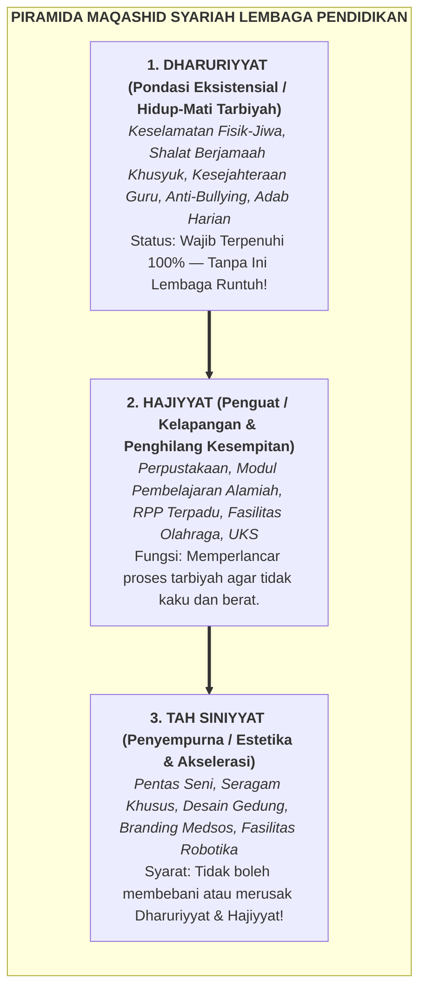
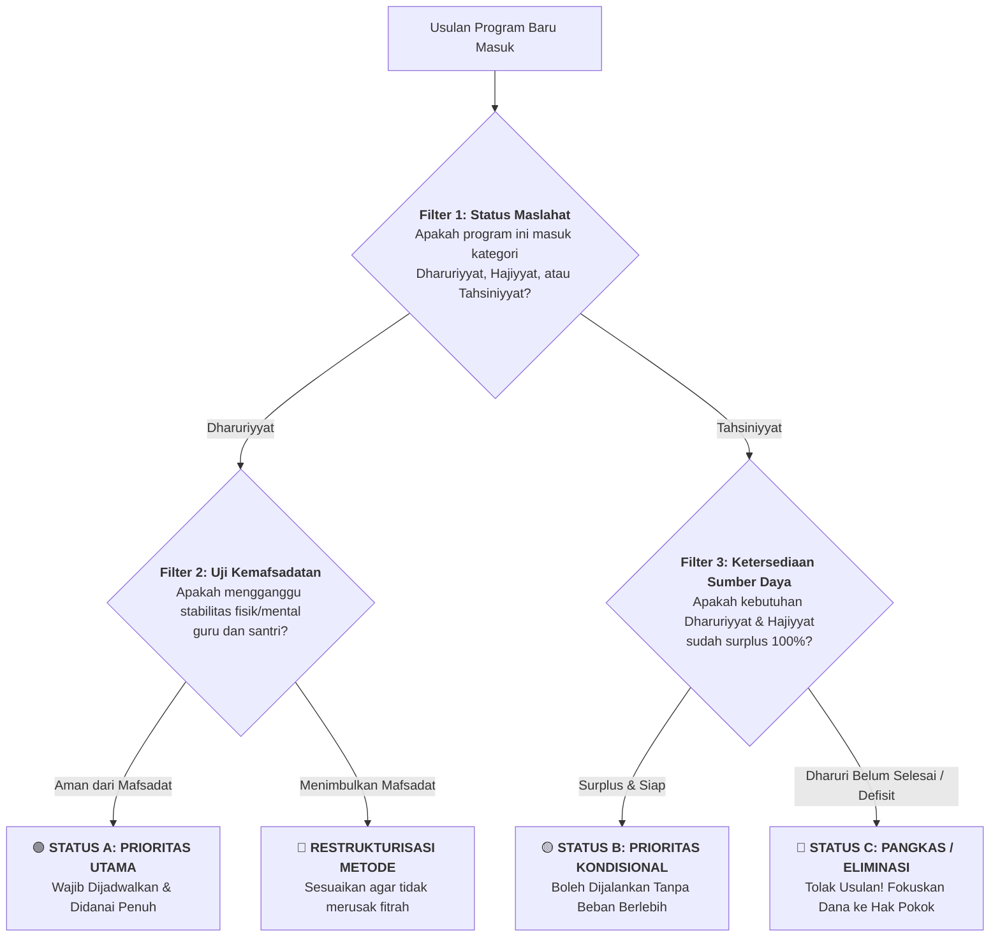

<!-- ========================================================================== -->
<!-- ZONA 1: HEADER, ACTION BAR & METADATA                                      -->
<!-- ========================================================================== -->

# Prioritasi Program Lembaga Berbasis Maqashid Syariah

<div class="wiki-action-bar">
  <span class="wiki-action-item active">📖 Baca</span>
  <a href="https://github.com/decaller/wiki-pkn/discussions" class="wiki-action-item" target="_blank" rel="noopener">💬 Diskusi</a>
  <a href="https://github.com/decaller/wiki-pkn/edit/main/content/Paradigma - Implementasi PKN/Dokumen Pendidikan Karakter Nabawiyah/Paradigma & Implementasi/Implementasi/Kaidah & Elemen/Prioritasi Program Lembaga Berbasis Maqashid Syariah.md" class="wiki-action-item" target="_blank" rel="noopener">✏️ Sunting</a>
  <a href="https://github.com/decaller/wiki-pkn/commits/main/content/Paradigma - Implementasi PKN/Dokumen Pendidikan Karakter Nabawiyah/Paradigma & Implementasi/Implementasi/Kaidah & Elemen/Prioritasi Program Lembaga Berbasis Maqashid Syariah.md" class="wiki-action-item" target="_blank" rel="noopener">📜 Riwayat</a>
  <span class="wiki-action-meta">Otoritas: Tier 1 (Active Truth) • [[Paradigma & Implementasi]]</span>
</div>

<!-- ========================================================================== -->
<!-- ZONA 2: AREA KONTEN UTAMA, INFOBOX, LEAD SECTION & BATANG TUBUH            -->
<!-- ========================================================================== -->

<div class="wiki-infobox">
  <div class="wiki-infobox-header">Prioritasi Program Lembaga Berbasis Maqashid Syariah</div>
  <div class="wiki-infobox-image">
    <div style="padding: 1.25rem 1rem; background: linear-gradient(135deg, rgb(30, 58, 138), rgb(13, 148, 136)); color: white; text-align: center; border-radius: 6px;">
      <div style="font-size: 1.8rem; font-weight: 700; margin-bottom: 0.35rem;">⚖️ Maqashid</div>
      <div style="font-weight: 600; font-size: 0.9rem;">Manajemen & Fiqh Aulawiyyat</div>
    </div>
    <div class="wiki-infobox-caption">Manhaj Pendidikan Karakter Nabawiyah</div>
  </div>
  <table class="wiki-infobox-table">
    <tr>
      <th>Topik Inti</th>
      <td><b>Prioritasi Program Berbasis Maqashid Syariah</b></td>
    </tr>
    <tr>
      <th>Tingkat Otoritas</th>
      <td><b>Tier 1: Active Truth</b> (Manhaj Implementasi PKN)</td>
    </tr>
    <tr>
      <th>Kluster Manhaj</th>
      <td>[[Paradigma & Implementasi]] ➡️ [[Kaidah & Elemen]]</td>
    </tr>
    <tr>
      <th>Pilar Kaidah</th>
      <td><i>Dar'ul Mafasid Muqaddamun 'ala Jalbil Mashalih</i></td>
    </tr>
    <tr>
      <th>Tiga Tingkatan</th>
      <td><b>Dharuriyyat ➡️ Hajiyyat ➡️ Tahsiniyyat</b></td>
    </tr>
    <tr>
      <th>Lima Penjagaan</th>
      <td><i>Din, Nafs, 'Aql, Nasl/'Irdh, Mal</i></td>
    </tr>
  </table>
</div>

> [!SUMMARY] Ringkasan Eksekutif (TL;DR Lead Section)
> **Hakikat Konsep:** **Prioritasi Program Lembaga Berbasis Maqashid Syariah** adalah instrumen navigasi strategis bagi yayasan, kepala sekolah, mudir pesantren, dan pengelola lembaga pendidikan Islam untuk menyaring, mengurutkan, dan mengalokasikan sumber daya program secara adil sesuai hierarki syariat.
> * **Prinsip Pokok:** Membedakan secara tegas antara pilar eksistensial (*Dharuriyyat*), instrumen kelapangan sistem (*Hajiyyat*), dan aksesoris penyempurna (*Tahsiniyyat*). Lembaga dilarang mengorbankan hal-hal pokok (seperti keselamatan jiwa santri, ketenangan batin guru, dan keteladanan adab) demi mengejar kemegahan seremonial atau pencitraan institusi.
> * **Kaidah Emas Asy-Syathibi:** *“Kullu tahsiinin yafdhil ila ibthali dharuriyyin aw hajiyyin fahuwa bathil”* (Setiap program penyempurna/tahsiniyyat yang berujung pada terancamnya perkara dharuriyyat atau hajiyyat, maka program tersebut batil dan wajib dipangkas).


*Gambar: Penerapan Kerangka Maqashid Syariah dan Fiqh Aulawiyyat dalam Tata Kelola Lembaga Pendidikan Karakter Nabawiyah*

---

## 1. Diagnosis Lapangan: Sindrom "Kaya Program, Miskin Jiwa" (*Institutional Burnout*)

Dalam dinamika persekolahan Islam kontemporer—baik Sekolah Islam Terpadu (SIT), Madrasah, Pondok Pesantren Berasrama (*Boarding School*), maupun Kuttab—kerap terjadi fenomena ironis yang merusak ekosistem tarbiyah:

```
┌────────────────────────────────────────────────────────────────────────┐
│                   LINGKARAN SETAN OVERLOAD PROGRAM                     │
├────────────────────────────────────────────────────────────────────────┤
│ 1. Ambisi Program Melimpah (Pentas, Lomba, Ekstrakurikuler, Festival)  │
│                                ⬇                                       │
│ 2. Guru Terkuras Energi & Waktu (Administrasi, Rapat Malam, Panitia)   │
│                                ⬇                                       │
│ 3. Hubungan Jiwa Terputus ("Bahasa Hati" Hilang, Pendidik Emosional)   │
│                                ⬇                                       │
│ 4. Santri Frustrasi & Tertekan (Perundungan Naik, Shalat Kehilangan Ruh)│
│                                ⬇                                       │
│ 5. Moral Santri Merosot ➡️ Manajemen Membuat Program Tambahan Baru!    │
└────────────────────────────────────────────────────────────────────────┘
```

### Karakteristik Patologis Lembaga Tanpa Fiqh Prioritas:
1. **Hipertrofi Seremonial (*Tahsiniyyat-Obsessed*):** Pimpinan sibuk merancang kegiatan gebyar, pentas akhir tahun berbiaya ratusan juta, branding media sosial yang gemerlap, dan perburuan piala kejuaraan, sementara adab shalat harian santri masih bolong-bolong dan toilet santri kotor tak terawat.
2. **Kelelahan Kronis Pendidik (*Teacher Burnout*):** Guru dikejar-kejar puluhan lembar instrumen administratif, rapat evaluasi hingga larut malam, dan kepanitiaan beruntun. Waktu untuk duduk tenang mendengarkan keluh kesah santri binaan (*Koneksi Sebelum Koreksi*) habis tak bersisa.
3. **Mekanisasi Ibadah Santri:** Shalat lima waktu, dzikir ma'tsurat, dan hafalan Al-Qur'an dijalankan di bawah ancaman hukuman dan pengawasan dingin, bukan atas dorongan cinta (*Mahabbah*) dan pengagungan kepada Allah (*Ta'zhim*).
4. **Distorsi Anggaran Finansial:** Yayasan menggelontorkan dana miliaran rupiah untuk renovasi gerbang sekolah megah, sementara honor para asatidzah di bawah standar hidup layak, memaksa mereka mencari nafkah sampingan di luar jam sekolah.

Akar dari seluruh kekacauan ini bukanlah kurangnya niat baik, melainkan **ketiadaan kompas Maqashid Syariah** dalam membedakan antara *kewajiban pokok yang mutlak* dengan *pelengkap yang mubah*.

---

## 2. Landasan Dalil Syar'i & Kaidah Ushul Fiqih

Pendidikan Karakter Nabawiyah berakar pada prinsip bahwa syariat Islam diturunkan untuk mewujudkan kemaslahatan hamba (*Tahqiqul Mashalih*) dan menolak segala bentuk kerusakan (*Dar'ul Mafasid*).

> [!quote] Dalil Al-Qur'an: Perintah Keadilan, Keseimbangan, dan Melindungi yang Pokok
> **Teks Al-Qur'an (QS. Al-A'raf: 31-32):**  
> « يَا بَنِي آدَمَ خُذُوا زِينَتَكُمْ عِندَ كُلِّ مَسْجِدٍ وَكُلُوا وَاشْرَبُوا وَلَا تُسْرِفُوا ۚ إِنَّهُ لَا يُحِبُّ الْمُسْرِفِينَ »  
> 
> *"Wahai anak cucu Adam! Pakailah pakaianmu yang bagus pada setiap (memasuki) masjid, makan dan minumlah, tetapi jangan berlebih-lebihan. Sungguh, Allah tidak menyukai orang-orang yang berlebih-lebihan."*  
> — **QS. Al-A'raf: 31**  
> 
> 💡 **Syarah Pedagogis:** Ayat ini meletakkan pilar keseimbangan (*Wasathiyah*): mengambil perhiasan dan keindahan (*Tahsiniyyat*) diperbolehkan, namun jika jatuh ke dalam pemborosan (*Israf*) yang melalaikan tujuan pokok ibadah (*Dharuriyyat*), maka perbuatan tersebut tercela di sisi Allah.  
> 🔍 [Telusuri di OpenBayan ↗](https://openbayan.insanmustaqbal.or.id/search?q=يا+بني+آدم+خذوا+زينتكم)

> [!quote] Dalil Sunnah Nabawiyah: Hierarki Prioritas dalam Dakwah dan Tarbiyah
> **Hadits Mu'adz bin Jabal radhiyallahu 'anhu (HR. Bukhari No. 1395 & Muslim No. 19):**  
> « إِنَّكَ تَقْدَمُ عَلَى قَوْمٍ أَهْلِ كِتَابٍ، فَلْيَكُنْ أَوَّلَ مَا تَدْعُوهُمْ إِلَيْهِ عِبَادَةُ اللَّهِ، فَإِذَا عَرَفُوا اللَّهَ، فَأَخْبِرْهُمْ أَنَّ اللَّهَ قَدْ فَرَضَ عَلَيْهِمْ خَمْسَ صَلَوَاتٍ فِي يَوْمِهِمْ وَلَيْلَتِهِمْ... »  
> 
> *"Sesungguhnya engkau akan mendatangi suatu kaum dari Ahli Kitab. Maka hendaklah perkara pertama yang engkau serukan kepada mereka adalah beribadah kepada Allah (mentauhidkan-Nya). Jika mereka telah mengenal Allah, beritahukanlah kepada mereka bahwa Allah telah mewajibkan atas mereka shalat lima waktu dalam sehari semalam..."*  
> 
> 📚 **Istinbath Hukum PKN:** Rasulullah ﷺ memerintahkan penjenjangan prioritas yang ketat (*At-Tadarruj fil Aulawiyyat*): Tauhid dan pengenalan Allah didahulukan sebelum kewajiban shalat, dan shalat didahulukan sebelum zakat. Manajemen lembaga pendidikan wajib mengikuti sunnah penjenjangan ini dalam kalender programnya.

### Kaidah-Kaidah Fiqhiyyah Navigasi Program:

1. **Kaidah Penolakan Kerusakan (*Dar'ul Mafasid*):**  
   « دَرْءُ الْمَفَاسِدِ مُقَدَّمٌ عَلَى جَلْبِ الْمَصَالِحِ »  
   *(Menolak mafsadat/kerusakan harus didahulukan daripada mengejar kemaslahatan).*  
   *Aplikasi PKN:* Jika suatu kegiatan ekstrakurikuler atau kompetisi luar kota (maslahat: prestasi/branding) berpotensi memicu campur baur bebas ikhwan-akhwat tanpa hijab, meninggalkan shalat berjamaah, atau membakar habis fisik santri (mafsadat), maka membatalkan kegiatan tersebut wajib didahulukan.

2. **Kaidah Batasan Penunjang (*Qaidah Ibthalil Ashl* - Imam Asy-Syathibi):**  
   « كُلُّ تَحْسِينِيٍّ يَعُودُ عَلَى أَصْلِهِ بِالْإِبْطَالِ فَلَا يَصِحُّ اعْتِبَارُهُ »  
   *(Setiap perkara penyempurna/tahsiniyyat yang berakibat pada pembatalan hukum pokoknya, maka gugurlah keabsahannya).*  
   *Aplikasi PKN:* Desain seragam mewah dan wisuda akbar (tahsiniyyat) yang membuat orang tua miskin tertekan hingga menunggak biaya makan pokok santri (dharuriyyat) adalah program yang tertolak secara syar'i.

3. **Kaidah Penyempurna Kewajiban (*Mā Lā Yatimmul Wājib*):**  
   « مَا لَا يَتِمُّ الْوَاجِبُ إِلَّا بِهِ فَهُوَ وَاجِبٌ »  
   *(Sesuatu yang tanpanya suatu kewajiban tidak dapat terlaksana sempurna, maka sesuatu itu hukumnya menjadi wajib).*  
   *Aplikasi PKN:* Pembinaan ketahanan mental dan kebersihan jiwa (*tazkiyatun nafs*) bagi guru adalah prasyarat mutlak terwujudnya pengajaran adab di kelas. Maka, alokasi waktu dan anggaran untuk ta'lim guru hukumnya setara dengan kewajiban mendidik itu sendiri.

4. **Kaidah Memilih Risiko Terkecil (*Irtikabu Akhaffidh-Dhararain*):**  
   « إِذَا تَعَارَضَتْ مَفْسَدَتَانِ رُوعِيَ أَعْظَمُهُمَا ضَرَرًا بِارْتِكَابِ أَخَفِّهِمَا »  
   *(Jika dua mafsadat berbenturan, hindari mafsadat yang lebih besar dengan mengambil mafsadat yang lebih ringan).*  
   *Aplikasi PKN:* Tunduk pada beban administrasi akreditasi dinas pemerintah memang menyita waktu (mafsadat ringan), tetapi jika menolak akreditasi berakibat izin sekolah dicabut dan ratusan santri terlantar tanpa ijazah (mafsadat besar), maka patuhilah regulasi tersebut sembari menyederhanakan pelaksanaannya secara cerdas.

---

## 3. Tiga Tingkatan Kebutuhan Maslahat (*Tsalatsul Maratib*) dalam Manajemen PKN

Imam Abu Ishaq Asy-Syathibi dalam mahakaryanya *Al-Muwafaqat fi Ushulisy-Syari'ah* membagi kebutuhan hidup manusia ke dalam tiga jenjang hierarkis:



### 1. Tingkat Dharuriyyat (Prioritas Mutlak / *Excellence Foundation*)
* **Definisi:** Segala hal yang menjadi sendi tegaknya kehidupan agama dan raga. Jika pilar ini hilang, ekosistem pendidikan akan binasa, fitrah anak rusak permanen, dan kemaslahatan dunia-akhirat sirna.
* **Karakteristik dalam Manajemen PKN:**
  - Bersifat non-negosiasi (*zero-tolerance*).
  - Tidak boleh dikurangi demi penghematan anggaran.
  - Wajib diaudit setiap pekan oleh pimpinan lembaga.
* **Wujud Nyata di Lembaga:**
  - Jaminan keamanan dari kekerasan fisik, pelecehan seksual, dan perundungan (*Hifdzun Nafs & Nasl*).
  - Shalat fardhu lima waktu berjamaah dengan penanaman adab dan thaharah yang benar (*Hifdzud Din*).
  - Makanan santri yang halal, thayyib, bergizi, dan higienis di dapur asrama (*Hifdzun Nafs*).
  - Upah pendidik dan tenaga kependidikan yang berkeadilan dan tepat waktu (*Hifdzul Mal*).
  - Waktu tidur dan istirahat yang manusiawi bagi santri (minimal 7–8 jam) agar hormon pertumbuhan dan fitrah perkembangan bekerja optimal.

### 2. Tingkat Hajiyyat (Prioritas Penguat / *Friction Reducers*)
* **Definisi:** Segala sarana dan sistem yang dibutuhkan untuk mewujudkan kelapangan, kemudahan, dan menghilangkan kesukaran (*Raf'ul Haraj*) dalam proses belajar mengajar. Jika pilar ini tidak terpenuhi, lembaga tidak langsung hancur, namun proses tarbiyah menjadi berat, kaku, dan lambat.
* **Wujud Nyata di Lembaga:**
  - Panduan RPP berbasis karakter nabawiyah dan lembar observasi 19 butir (*[[Panduan RPP dan Observasi Lapangan]]*).
  - Rasio jumlah guru berbanding murid yang proporsional (maksimal 1:12 atau 1:15) agar guru mampu menjalin dialog hati personal.
  - Fasilitas UKS dan pos kesehatan pesantren yang sigap.
  - Sesi *sharing session* mingguan antar-pendidik untuk saling menguatkan mental (*self-care syar'i*).
  - Buku penghubung dan majelis silaturahmi bulanan orang tua-sekolah (*SOTAB*).

### 3. Tingkat Tahsiniyyat (Prioritas Penyempurna / *Aesthetics & Accents*)
* **Definisi:** Segala program yang berkaitan dengan keindahan adab, tata ruang yang asri, sarana akselerasi minat khusus, dan syiar peradaban. Tujuannya adalah mempercantik (*tahsin*) dan menyempurnakan performa lembaga.
* **Wujud Nyata di Lembaga:**
  - Seragam santri berdesain elegan dan beridentitas khas.
  - Laboratorium teknologi canggih (komputer coding, studio audio-visual).
  - Acara tasyakuran wisuda, pameran karya seni fitrah, atau karnaval muharram.
  - Penyediaan piala penghargaan dan sertifikasi kompetensi eksternal.
* **Rambu Mutlak:** Tahsiniyyat **hanya boleh dieksekusi** apabila seluruh indikator Dharuriyyat dan Hajiyyat telah beroperasi stabil tanpa kekurangan dana dan tanpa kelelahan SDM.

---

## 4. Matriks Panca Perlindungan (*Al-Kulliyyat Al-Khamsah*) pada Manajemen Lembaga

Untuk memudahkan audit program tahunan, 5 objek perlindungan Maqashid Syariah diturunkan ke dalam matriks operasional lembaga pendidikan Islam:

| Objek Maqashid | Tingkat 1: Dharuriyyat (Wajib Ada) | Tingkat 2: Hajiyyat (Penguat Sistem) | Tingkat 3: Tahsiniyyat (Penyempurna) |
|---|---|---|---|
| **1. Hifdzud Din**<br/>*(Penjagaan Agama & Aqidah)* | • Pemurnian aqidah dari syirik/khurafat.<br/>• Shalat 5 waktu fardhu tepat waktu.<br/>• Qudwah keteladanan ibadah guru.<br/>• Ruang shalat yang suci dan layak. | • Shalat sunnah rawatib & dhuha berjamaah.<br/>• Halaqah tadabbur Al-Qur'an tematik.<br/>• Silabus sirah nabawiyah terstruktur.<br/>• Pelatihan fiqih ibadah praktis. | • Musabaqah Hifdzil Qur'an akbar.<br/>• Kaligrafi hiasan ayat di koridor.<br/>• Sertifikasi sanad qira'ah dari luar.<br/>• Daurah da'i cilik bersiaran medsos. |
| **2. Hifdzun Nafs**<br/>*(Penjagaan Jiwa & Fisik-Mental)* | • Larangan mutlak sanksi fisik memukul.<br/>• SOP penanganan perundungan tegas.<br/>• Menu makanan higienis & halal.<br/>• Waktu tidur malam minimal 7 jam.<br/>• Evakuasi keselamatan & sanitasi air bersih. | • Klinik/UKS dengan paramedis siaga.<br/>• Jam bimbingan konseling hati (*heart-to-heart*).<br/>• Lapangan olahraga sunnah (panahan, futsal).<br/>• Manajemen beban tugas harian siswa. | • Wahana outbound/flying fox modern.<br/>• Pusat kebugaran/gym santri khusus.<br/>• Seminar kesehatan mental berbayar.<br/>• Layanan katering menu variatif premium. |
| **3. Hifdzul 'Aql**<br/>*(Penjagaan Nalar & Pemahaman)* | • Menghapus budaya bentakan yang mematikan logika.<br/>• KBM berbasis pemahaman nalar fitrah (*Fahm*).<br/>• Menghindari doktrin hafalan buta tanpa makna.<br/>• Perlindungan dari pornografi & narkoba. | • Pojok baca kelas & perpustakaan aktif.<br/>• Desain pembelajaran alamiah berbasis proyek.<br/>• Asesmen bakat TB-40 untuk memetakan syakilah.<br/>• Pelatihan nalar kritis dan adab dialog. | • Laboratorium robotika & AI.<br/>• Keikutsertaan olimpiade sains nasional.<br/>• Langganan jurnal digital internasional.<br/>• Kunjungan studi banding luar negeri. |
| **4. Hifdzun Nasl / 'Irdh**<br/>*(Penjagaan Keturunan & Kehormatan)* | • Pemisahan tempat tidur santri usia 10 tahun.<br/>• Penegakan adab meminta izin (*isti'dzan*).<br/>• Penjagaan aurat dan batas ruang putra-putri.<br/>• Perlindungan harga diri anak dari cemoohan guru. | • Edukasi fiqih thaharah (haid/mimpi basah).<br/>• SOP interaksi ikhwan-akhwat teratur.<br/>• Program kemitraan parenting ayah-bunda (SOTAB).<br/>• Detoks gadget berkala di asrama. | • Kegiatan temu keluarga besar (*family gathering*).<br/>• Seragam batik identitas santri & wali.<br/>• Foto wisuda cetak eksklusif tahunan.<br/>• Dokumentasi video profil angkatan. |
| **5. Hifdzul Mal**<br/>*(Penjagaan Harta & Finansial)* | • Upah guru & karyawan adil dan tepat waktu.<br/>• Transparansi dana SPP & infaq yayasan.<br/>• Alokasi operasional dasar tidak defisit.<br/>• Menghindari utang riba dan spekulasi aset. | • Sistem pencatatan keuangan akuntansi baku.<br/>• SOP pengadaan sarpras bebas mark-up.<br/>• Dana cadangan darurat (*contingency fund*).<br/>• Pemeliharaan preventif gedung & fasilitas. | • Renovasi arsitektur gerbang megah.<br/>• Papan nama neonbox LED raksasa.<br/>• Pengadaan mobil dinas kepala sekolah baru.<br/>• Pameran expo pendidikan komersial. |

---

## 5. Instrumen Filter Maqashid Syariah (*The Maqashid Program Filter - MPF*)

Sebelum menyetujui program kerja tahunan dalam Rapat Kerja (Raker) Lembaga, Pimpinan Yayasan dan Dewan Guru wajib menguji setiap usulan kegiatan melalui **4 Filter Pertanyaan Emas**:



### Empat Pertanyaan Uji Kelayakan Program:
1. **Uji Esensi Maslahat:** *"Jika program ini TIDAK dijalankan tahun ini, apakah ada rukun iman, keselamatan jiwa, atau adab pokok santri yang terancam hancur?"*  
   - Jika **YA** $\rightarrow$ Program berstatus **Dharuriyyat**. Wajib dilaksanakan!
   - Jika **TIDAK** $\rightarrow$ Program berstatus **Hajiyyat** atau **Tahsiniyyat**.
2. **Uji Beban Guru (*Teacher Energy Capacity*):** *"Berapa jam kerja tambahan yang dibebankan kepada guru untuk kegiatan ini? Apakah kegiatan ini akan mengurangi waktu guru bercengkerama dan mendengarkan curhat santri?"*  
   - Jika menambah beban kerja hingga guru stres $\rightarrow$ **Tolak atau sederhanakan drastis!**
3. **Uji Kanibalisasi Anggaran (*Financial Integrity*):** *"Apakah pendanaan program ini mengambil jatah pos kesejahteraan guru, perbaikan sanitasi asrama, atau pemenuhan gizi santri?"*  
   - Jika ya $\rightarrow$ **Haram secara manajerial!** Mendahulukan Tahsiniyyat dengan memakan hak Dharuriyyat adalah kezaliman sistemik.
4. **Kaidah Pengguguran (*The Pruning Rule*):** *"Jika lembaga ingin menambah 1 program baru, program lama apa yang akan DIHAPUS untuk mengimbangi kapasitas energi ekosistem?"*  
   - Lembaga sehat tidak menumpuk program tanpa akhir. Setiap penambahan wajib disertai perampingan program yang sudah tidak relevan (*Continuous Program Pruning*).

---

## 6. Studi Kasus Nyata & Solusi Kuratif Berbasis Maqashid

### Studi Kasus 1: Ambisi Pentas Seni Akbar vs Kesejahteraan Asrama

> **Kondisi Faktual:** Sebuah Sekolah Islam Menengah Berasrama merencanakan perhelatan akbar *"Gebyar Pentas Seni Budaya Islam"* berdurasi 3 hari dengan estimasi biaya Rp 150 juta. Untuk persiapan acara, santri dilatih menari saman, teater, dan nasyid setiap malam hingga pukul 23.30 selama 2 bulan berturut-turut. Guru-guru senior ditunjuk sebagai seksi acara dan dekorasi.  
> 
> **Dampak Lapangan:**  
> - Santri kelelahan kronis: lebih dari 40% santri terlambat shalat subuh berjamaah di masjid karena tidur larut.
> - KBM pagi hari tidak efektif: santri tertidur di meja kelas.
> - Guru wali kelas kehilangan kesabaran: emosi membentak meningkat tajam karena guru kelelahan fisik.
> - Sementara itu, atap asrama santri putra yang bocor selama 6 bulan belum diperbaiki karena "tidak ada anggaran".

#### Analisis Maqashid Syariah:
* **Pentas Seni:** Kategori *Tahsiniyyat* (sekadar syiar seni dan aksesoris hiburan).
* **Shalat Subuh Tepat Waktu & Istirahat Santri:** Kategori *Dharuriyyat* (*Hifdzud Din* & *Hifdzun Nafs*).
* **Perbaikan Atap Asrama:** Kategori *Dharuriyyat* (*Hifdzun Nafs* - perlindungan raga dari dingin dan penyakit).
* **Kesimpulan Hukum Manajerial:** Terjadi pelanggaran kaidah Asy-Syathibi: *Tahsiniyyat membatalkan Dharuriyyat*. Program pentas seni tersebut berstatus **mafsadat yang terselubung**.

#### Solusi Kuratif Pembenahan:
1. **Pangkas Skala Acara (*Pruning*):** Batalkan perhelatan komersial 3 hari. Ganti dengan *Internal Sharing Day* 2 jam di hari Sabtu sore tanpa panggung megah berbayar.
2. **Hentikan Latihan Malam Hari:** Kembalikan jam tidur santri pukul 21.30. Lindungi shalat subuh berjamaah sebagai prioritas tertinggi lembaga.
3. **Realokasi Anggaran:** Alihkan dana Rp 150 juta untuk menuntaskan perbaikan atap asrama, perbaikan gizi dapur santri, dan bonus apresiasi guru asrama.

---

### Studi Kasus 2: Target Hafalan Al-Qur'an 30 Juz Kaku vs Penegakan Adab Tamyiz

> **Kondisi Faktual:** Sebuah Ma'had Tahfidz tingkat SD/MI menetapkan target hafalan 1 juz per semester dengan sistem setoran ketat 3 kali sehari. Santri usia 8 tahun yang tidak mencapai target setoran dikenakan sanksi berdiri di bawah terik matahari dan dilarang mengikuti jam bermain di lapangan.  
> 
> **Dampak Lapangan:**  
> - Santri mengalami trauma psikologis terhadap Al-Qur'an; hafalan berjalan di bawah rasa takut.
> - Timbul penyakit batin: santri menipu musyrif dengan mengaku sudah setoran, atau saling ejek terhadap santri yang hafalannya lambat (*hasad* dan *riya'*).
> - Fitrah bermain (*fase tamyiz*) terampas habis.

#### Analisis Maqashid Syariah:
* **Hafalan Banyak (Kuantitas Kognitif):** Kategori *Hajiyyat* atau *Tahsiniyyat* bagi anak usia 8 tahun (belum baligh, belum mukallaf).
* **Kecintaan pada Al-Qur'an, Kejujuran, & Kesehatan Mental:** Kategori *Dharuriyyat* (*Hifdzud Din* & *Hifdzun Nafs*).
* **Kesimpulan Hukum Manajerial:** Mengorbankan adab kejujuran dan kecintaan anak demi mengejar kuantitas juz hafalan adalah kebodohan pedagogis yang bertentangan dengan sunnah nabawiyah.

#### Solusi Kuratif Pembenahan:
1. **Restrukturisasi Metode Sesuai Kaidah Tadarruj:** Hapus hukuman berdiri di bawah terik matahari. Ubah orientasi dari *"kejar setoran"* menjadi *"tadabbur gembira dan pembiasaan shalat 7 tahun"* sesuai hadits Nabi ﷺ.
2. **Diferensiasi Beban (*Multi-Leveling*):** Sesuaikan target hafalan dengan fitrah bakat masing-masing anak (*syakilah*). Santri dengan bakat daya hafal tinggi difasilitasi, sedangkan santri dengan bakat motorik/logika tidak dipaksa melampaui batas fitrahnya.
3. **Penyelamatan Adab:** Tanamkan bahwa 1 ayat yang dipahami maknanya dan diamalkan adabnya jauh lebih mulia daripada 30 juz yang dihafal dengan kepura-puraan.

---

## 7. Rubrik Evaluasi & Lembar Skor Prioritas Program (Raker Lembaga)

Gunakan lembar kerja ini pada setiap sesi pembahasan program kerja tahunan:

| No | Kriteria Penilaian Maqashid Syariah | Skor Rendah (1–2) | Skor Sedang (3–4) | Skor Sempurna (5) |
|:--:|---|---|---|---|
| **1** | **Kedudukan Hierarki Maslahat** | Program bersifat aksesoris semata (*Tahsiniyyat murni*). | Program memperlancar sistem operasional KBM (*Hajiyyat*). | Program menjaga hidup-mati aqidah, adab pokok, atau keselamatan (*Dharuriyyat*). |
| **2** | **Ketersediaan Kapasitas Pendidik** | Menyita jam istirahat guru; memicu stres dan kelelahan mental. | Guru membutuhkan penyesuaian jadwal namun tetap proporsional. | Guru dapat menjalankan secara riang dan mempererat dialog hati dengan santri. |
| **3** | **Dampak terhadap Fitrah Santri** | Menekan santri dengan target seragam yang tidak realistis. | Cukup netral; beberapa santri membutuhkan pendampingan khusus. | Sangat membahagiakan santri, merawat fitrah bermain/belajar secara alami. |
| **4** | **Efisiensi & Keadilan Anggaran** | Menyedot biaya besar untuk hal kosmetik/branding luar. | Anggaran berimbang dan tidak mengganggu pos operasional pokok. | Biaya murah/mandiri dan berdampak langsung pada hak-hak guru & santri. |
| **5** | **Uji Beban Ekosistem (*Pruning Check*)** | Menambah beban tanpa ada program lama yang dihapus. | Menggabungkan dua program lama menjadi satu format terpadu. | Berhasil menggantikan/menghapus 2 program lama yang tidak efektif. |

### Panduan Tindak Lanjut Skor Total:
* **Skor 21 – 25:** 🟢 **Program Grade A (Eksekusi Wajib):** Jadwalkan sebagai prioritas kalender akademik utama.
* **Skor 15 – 20:** 🟡 **Program Grade B (Eksekusi Bertahap):** Jalankan secara terbatas jika sumber daya mencukupi.
* **Skor < 15:** 🔴 **Program Grade C (Gugur / Tunda):** Coret dari rancangan kerja! Alihkan waktu dan dana untuk menyempurnakan program Grade A.

---

## 8. Hubungan Silang & Dokumen Terkait

* [[Kaidah Implementasi di Berbagai Lembaga]] — 5 Kaidah Emas strategi adopsi PKN di sekolah dan pesantren.
* [[8 Standar Implementasi PKN]] — Standar audit mutu kelembagaan Standar 11/2024 Manhaj PKN.
* [[4 Kaidah Implementasi]] — Prinsip *At-Taisir*, *Al-Qudwah*, *Ar-Rahmah*, dan *At-Tadarruj*.
* [[4 Elemen Implementasi]] — Rancang bangun *Al-Ghayah*, *Al-Manhaj*, *Al-Uslub*, dan *At-Taqyim*.
* [[Program dan Kegiatan Pendidikan Karakter Nabawiyah]] — Katalog program kaderisasi dan standarisasi resmi PKN.
* [[Peran Guru dan Lembaga Pendidikan]] — Kemitraan strategis sekolah, musyrif, dan orang tua.
* [[Benang Merah Pendidikan]] — Dekonstruksi sistem persekolahan pabrik mekanik menuju pendidikan berbasis fitrah.

---

> [!reflection] Renungan Pimpinan & Pengelola Lembaga
> *"Kelak di hadapan Allah, kita tidak akan ditanya seberapa megah panggung pentas seni sekolah kita, atau seberapa banyak tropi kejuaraan yang berjejer di lemari kaca yayasan kita. Pertanyaan yang akan diajukan kepada kita adalah: **Apakah santri-santri yang diamanahkan kepada kita mencintai Allah dan Rasul-Nya? Apakah mereka selamat akidahnya? Dan apakah para guru yang berjuang di bawah kepemimpinan kita diperlakukan secara adil, dimuliakan martabatnya, dan terjaga ketenangan batinnya?**"*
