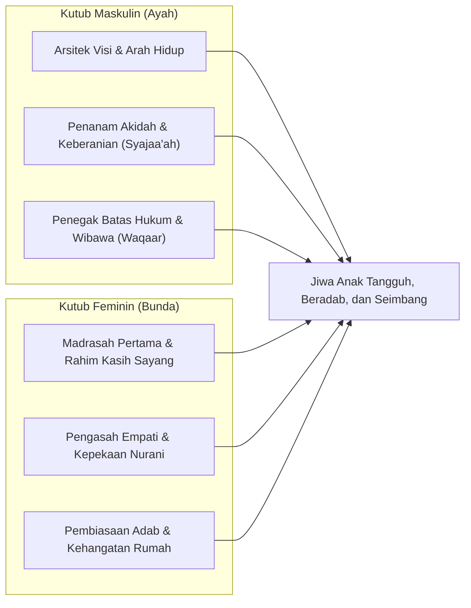

# Sinergi Peran Ayah dan Bunda dalam Pendidikan Karakter Nabawiyah

> [!quote] Dalil & Rujukan Nabawiyah
> **Naskah:**  
> « الرِّجَالُ قَوَّامُونَ عَلَى النِّسَاءِ بِمَا فَضَّلَ اللَّهُ بَعْضَهُمْ عَلَىٰ بَعْضٍ وَبِمَا أَنفَقُوا مِنْ أَمْوَالِهِمْ »
>
> *"Laki-laki (suami/ayah) itu adalah pemimpin bagi kaum wanita (istri/keluarga), oleh karena Allah telah melebihkan sebahagian mereka atas sebahagian yang lain..."*
>
> 📚 **Sumber Rujukan OpenBayan:** QS. An-Nisa': 34 & Riyadush Shalihin (Tahqiq Ar-Risalah II, Hal. 121)  
> 💡 **Relevansi PKN:** Ayah berperan sebagai nakhoda visi dan ketegasan arah peradaban, sementara bunda berperan sebagai madrasah pertama yang membasahi rumah dengan kasih sayang.

> *"Ayah dan Ibu bukanlah dua orang yang bersaing membuktikan siapa yang paling berjasa, melainkan sepasang sayap burung peradaban. Jika salah satu sayap patah atau pasif, burung itu tidak akan pernah bisa terbang tinggi mengantarkan anak-anaknya menuju puncak ketakwaan."*  
> — **Ustadz Abdul Kholiq**

---

## 1. Hakikat Sinergi Dua Kutub Pengasuhan

Dalam arsitektur Pendidikan Karakter Nabawiyah (PKN), keluarga diposisikan sebagai **laboratorium peradaban terkecil**. Allah menciptakan laki-laki dan perempuan dengan fitrah jasmani dan rohani yang berbeda bukan untuk saling mendominasi, melainkan untuk membentuk **sinergi komplementer** yang sempurna:

---

## 2. Rincian Peran Utama Ayah & Bunda

### A. Peran Ayah (Kepemimpinan, Akidah, dan Visi)
Ayah memegang mandat sebagai *Qawwam* (pemimpin dan pelindung):
1. **Arsitek Visi Keluarga:** Menentukan tujuan akhir pengasuhan—mencetak hamba Allah yang bertaqwa, bukan sekadar pemburu ijazah atau pekerja korporasi.
2. **Penanam Akidah dan Ketegasan:** Kisah Luqman Al-Hakim di dalam Al-Qur'an menunjukkan bahwa nasihat aqidah terberat (tauhid, bahaya syirik, dan kesadaran *Muraqabatullah*) disampaikan secara langsung oleh lisan seorang ayah.
3. **Pendorong Kemandirian Dunia Luar:** Ayah melatih anak untuk berani menghadapi kegagalan, mengambil risiko yang terukur, dan memikul tanggung jawab nafkah halal.
4. **Benteng Perlindungan (*Wibawa / Waqaar*):** Kehadiran ayah memberikan rasa aman bagi anak perempuan dan menjadi model keteladanan maskulin bagi anak laki-laki.

### B. Peran Bunda (Rahim Kasih Sayang, Adab, dan Bahasa Hati)
Bunda adalah madrasah pertama (*Al-Ummu Madrasatun Ula*):
1. **Pengisi Tangki Cinta Utama:** Dari buaian hingga usia 7 tahun, pelukan, tatapan mata, dan air susu ibu adalah fondasi rasa aman batin (*basic trust*) anak.
2. **Pengasah Bahasa Hati & Empati:** Melalui kelembutan bunda, anak belajar mengenal perasaan orang lain, berbelas kasih (*Rahmah*), dan menutupi aib sesama (*Satr*).
3. **Pembiasaan Adab Keseharian:** Tata krama makan, kebersihan diri, sopan santun berbicara, dan keindahan estetika rumah tangga ditanamkan secara konsisten melalui teladan bunda.

---

## 3. Dinamika Nyata di Lapangan & Solusi Praktis

### Kasus 1: Suami-Istri Beda Visi Pengasuhan (Ibu Paham PKN, Ayah Masih Keras)
Ini adalah persoalan yang paling sering dialami para ibu: ibu sudah mengikuti kajian fitrah, namun suami masih menggunakan pola asuh lama yang otoriter, kaku, dan mudah membentak anak.

Ustadz Abdul Kholiq memberikan rumus strategi 2 arah:
1. **Sikap Istri terhadap Anak:**  
   Jadilah **"Pembasuh Luka"**. Ketika anak baru saja dimarahi atau dibentak oleh ayahnya, jangan ikut memarahi anak dan jangan pula mencela suami di depan anak. Rangkul anak ke ruangan lain, peluk erat, tenangkan emosinya, dan validasi perasaannya: *"Ayah sebenarnya sayang, hanya tadi Ayah sedang lelah. Bunda ada di sini bersamamu."*
2. **Sikap Istri terhadap Suami:**  
   **Jangan pernah menggurui atau mendebat suami dengan dalil parenting!** Ego kepemimpinan seorang pria akan merasa terancam jika dinasihati istrinya secara frontal.  
   *Solusinya:* Sentuh bahasa hati suami terlebih dahulu. Sambut kedatangannya dengan senyuman, siapkan hidangan terbaik, layani kebutuhannya, dan apresiasi pengorbanannya dalam mencari nafkah. Ketika tangki cinta suami penuh dan egonya tenang, barulah ceritakan kondisi anak secara lembut atau ajak suami menghadiri forum parenting bersama tokoh yang ia hormati.

### Kasus 2: Bahaya *Father Hunger* (Kehausan Figur Ayah)
Banyak anak yang memiliki ayah secara fisik di rumah, namun yatim secara psikologis (*fatherless home*). Ayah hanya hadir sebagai "mesin ATM" pencari uang tanpa pernah bermain, berdialog dari hati ke hati, atau mendengarkan keluh kesah anak.

* **Dampak pada Anak Laki-Laki:** Tumbuh menjadi pemuda yang gamang dalam mengambil keputusan, pasif, atau sebaliknya melampiaskan maskulinitas toksik di luar rumah.
* **Dampak pada Anak Perempuan:** Mengalami defisit cinta laki-laki, sehingga mudah terbuai oleh rayuan palsu pria asing di media sosial untuk mencari validasi kasih sayang.

### Kasus 3: Pendampingan Khusus Ayah untuk Anak Putri Menjelang Baligh
Ketika anak perempuan memasuki usia 10–14 tahun (Fase Murahaqah), peran ayah menjadi sangat krusial:
- Ayah harus melimpahkan pujian tulus terhadap kecantikan dan kehormatan anak putrinya.
- Berikan hadiah, luangkan waktu berdua (*father-daughter date*), dan peluk dengan penuh kasih sayang yang suci.
- Ketika kebutuhan rasa dicintai anak putri telah terpenuhi secara paripurna oleh ayahnya sendiri, ia akan memiliki benteng harga diri (*'Izzah* dan *'Iffah*) yang sangat kokoh terhadap godaan pergaulan bebas.

---

## 4. Rujukan Kajian Video Terkait (PKN Video Database)

* *Peran Ayah vs Ibu dalam Pengasuhan Karakter* — [Tonton di YouTube @ 45:18](https://www.youtube.com/watch?v=iVLk4cfj_I4&t=2718s)
* *Tanya Jawab: Solusi Ayah vs Ibu Beda Pola Asuh* — [Tonton di YouTube @ 116:10](https://www.youtube.com/watch?v=w04OJijPmQk&t=6970s)
* *Kasus Anak Tidak Mau Digendong Ayahnya & Cara Rekonsiliasinya* — [Tonton di YouTube @ 119:47](https://www.youtube.com/live/eeyy_v54eWA&t=7187s)
* *Tanya Jawab: Bahasa Hati Khusus Ayah untuk Anak Putri Baligh* — [Tonton di YouTube @ 285:34](https://www.youtube.com/live/6H-qENwmmcw&t=17134s)
* *Mengisi Tangki Cinta Anak agar Tidak Mencari Kasih Sayang di Luar* — [Tonton di YouTube @ 40:16](https://www.youtube.com/watch?v=iVLk4cfj_I4&t=2416s)
