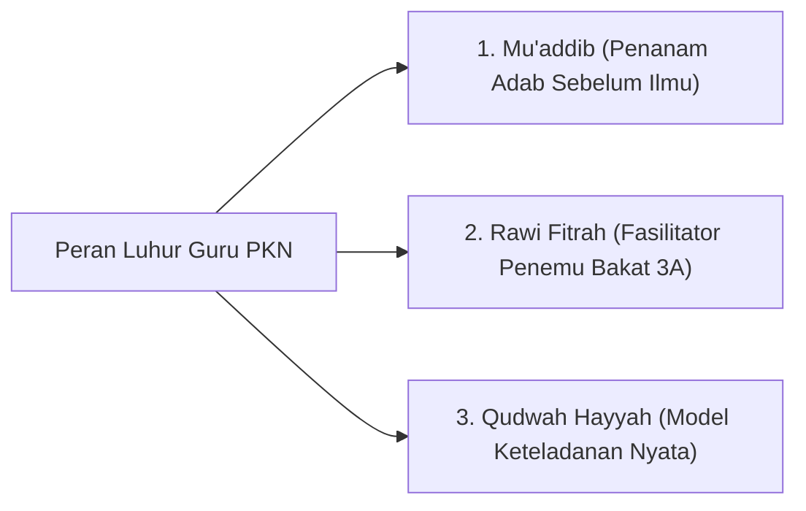

# Peran Guru & Lembaga Pendidikan: Pewaris Risalah & Mitra Fitrah Keluarga

> [!quote] Dalil & Rujukan Nabawiyah Utama
> **Naskah:**  
> « إِنَّ الْعُلَمَاءَ وَرَثَةُ الْأَنْبِيَاءِ، وَإِنَّ الْأَنْبِيَاءَ لَمْ يُوَرِّثُوا دِينَارًا وَلَا دِرْهَمًا، وَإِنَّمَا وَرَّثُوا الْعِلْمَ، فَمَنْ أَخَذَهُ أَخَذَ بِحَظٍّ وَافِرٍ »
>
> *"Sesungguhnya para ulama (guru dan pendidik) adalah pewaris para nabi. Dan sesungguhnya para nabi tidak mewariskan dinar maupun dirham, melainkan mereka mewariskan ilmu. Maka barangsiapa mengambilnya, sungguh ia telah mengambil bagian keuntungan yang sangat besar."*
>
> 📚 **Sumber Rujukan OpenBayan:** HR. Abu Dawud No. 3641 & At-Tirmidzi No. 2682; Kitab Al-Ilm; Dishahihkan oleh Ibnu Hibban dan Al-Albani; Riyadush Shalihin No. 1388.  
> 💡 **Relevansi PKN:** Guru dan lembaga pendidikan dalam PKN memegang status mulia sebagai *Waratsatul Anbiya'* (Pewaris Risalah Kenabian). Mereka hadir bukan sebagai penjual jasa industri komersial, melainkan sebagai murabbi spiritual yang mendampingi dan menyuburkan fitrah unik setiap anak murid.

---

## 1. Hakikat Posisi Guru & Sekolah dalam Perspektif PKN

Dalam arsitektur Pendidikan Karakter Nabawiyah, **Lembaga Pendidikan (Sekolah/Kuttab/Pesantren) berposisi sebagai MITRA KOMPLEMENTER bagi orang tua, BUKAN pengganti fungsi keluarga**:
* **Menolak Korporatisasi Pendidikan:** Sekolah bukan pabrik pencetak nilai ujian dan guru bukan buruh pengajar yang sekadar mentransfer kurikulum demi gaji. Guru adalah *Mu'addib* (pembina adab) dan *Muslih* (perawat jiwa generasi).
* **Menjaga Sinergi Segitiga Emas:** Ekosistem pendidikan hanya akan berhasil melahirkan generasi mukallaf mandiri jika terjalin sinergi seirama antara: **Orang Tua di Rumah ↔ Guru di Sekolah ↔ Lingkungan Masyarakat Shalih**.
* **Menghindari Standarisasi Pembunuh Bakat:** Sekolah PKN menghargai keberagaman fadhilah anak; tidak memaksakan setiap murid memiliki peringkat ranking seragam, melainkan memfasilitasi 40 pilar karakter nabawiyah (TB40).

---

## 2. Teladan Rasulullah ﷺ sebagai Pendidik Teragung (Al-Mu'allim Al-Awwal)

Rasulullah ﷺ menetapkan standar tertinggi bagi siapa saja yang mengemban profesi pendidik:

### A. Wasiat Beliau kepada Mu'adz bin Jabal & Abu Musa Al-Asy'ari
Ketika Rasulullah ﷺ mengutus kedua sahabat agung ini menjadi pendidik dan da'i bagi penduduk Yaman, beliau membekali mereka dengan kaidah pedagogi emas:
> « يَسِّرَا وَلَا تُعَسِّرَا، وَبَشِّرَا وَلَا تُنَفِّرَا، وَتَطَاوَعَا وَلَا تَخْتَلِفَا »  
> *"Permudahlah dan jangan mempersulit, berikanlah kabar gembira dan jangan membuat orang lari menjauh, serta bersatu-padulah kalian berdua dan jangan saling berselisih!"*  
> 📚 *(HR. Al-Bukhari No. 3038 & Muslim No. 1733)*

Guru yang meneladani sunnah nabawiyah adalah sosok yang membuat ilmu terasa memikat dan mudah dipahami, bukan guru yang senang memamerkan kerumitan dan menakut-nakuti murid dengan ancaman nilai jelek.

### B. Memperhatikan Kondisi Psikologis Murid (Tidak Menjemukan)
Abdullah bin Mas'ud radhiyallahu 'anhu mengisahkan bagaimana Rasulullah ﷺ mengatur jadwal ta'lim:
> « كَانَ النَّبِيُّ ﷺ يَتَخَوَّلُنَا بِالْمَوْعِظَةِ فِي الأَيَّامِ، كَرَاهَةَ السَّآمَةِ عَلَيْنَا »  
> *"Adalah Nabi ﷺ senantiasa memilih-milih hari dan waktu yang tepat dalam memberikan nasihat kepada kami, karena beliau khawatir menimbulkan kebosanan pada diri kami."*  
> 📚 *(HR. Al-Bukhari No. 68 & Muslim No. 2821)*

Seorang guru muslim wajib memiliki kepekaan rasa: kapan murid sedang siap menyerap ilmu, dan kapan murid membutuhkan jeda istirahat untuk menyegarkan kembali jiwanya.

---

## 3. Keterangan Para Ulama Klasik tentang Adab Guru

### 1. Ibn Sahnun Al-Qayrawani (Wafat 256 H)
Dalam kitab *Adab al-Mu'allimin*—buku panduan guru pertama dalam sejarah peradaban Islam:
> *"Wajib bagi seorang guru di Kuttab untuk menyamakan perhatiannya kepada seluruh murid; tidak boleh mengutamakan anak orang kaya atas anak orang miskin. Wajib baginya meniatkan pengajarannya ikhlas karena Allah, bersikap sabar menghadapi kelemahan nalar murid, dan melarang keras murid-muridnya saling mengolok-olok atau menindas satu sama lain."*

### 2. Imam Abu Bakar Muhammad bin Al-Husain Al-Ajurri (Wafat 360 H)
Dalam kitab *Akhlaqul Ulama* (Hal. 45):
> *"Ketahuilah bahwa pendidik sejati bukanlah orang yang banyak bicaranya, melainkan orang yang keteladanan akhlaknya mendahului kata-katanya. Murid-murid akan meniru cara gurunya tersenyum, cara gurunya menahan amarah, dan cara gurunya bersujud jauh lebih cepat daripada hafalan bait-bait syair yang didiktekan kepadanya."*

---

## 4. Tiga Peran Pokok Guru dalam Ekosistem PKN

1. **Sebagai Mu'addib (Penanam Adab Sebelum Ilmu):**
   * Memastikan murid menghormati ilmu, menghargai buku, menyayangi kawan, dan berbakti kepada orang tua sebelum mengajarkan rumus-rumus sains dan matematika.
2. **Sebagai Rawi Fitrah (Fasilitator Penemu Bakat 3A):**
   * Mengamati kecenderungan unik setiap anak melalui instrumen Rukun 3A (Suka, Bisa, Bermanfaat).
   * Melaporkan portofolio kekuatan karakter anak kepada orang tua secara berkala, bukan sekadar membagikan lembaran angka rapor kognitif.
3. **Sebagai Qudwah Hayyah (Cermin Hidup Keteladanan):**
   * Menjadi teladan integritas, kejujuran lisan (*Shidq*), kelemahlembutan (*Rifq*), dan ketepatan waktu shalat berjamaah.

---

## 5. Tautan Konseptual Terkait
* [[Tanggung Jawab Pendidikan]] — Mandat Fardhu 'Ain di Pundak Orang Tua.
* [[Pendidikan Ideal]] — Menautkan Akil dan Baligh Menuju Peradaban.
* [[4 Kaidah Implementasi]] — Prinsip Operasional Pengasuhan Nabawiyah.
* [[Metode Mendidik]] — Tiga Bahasa Pengasuhan Islam.
