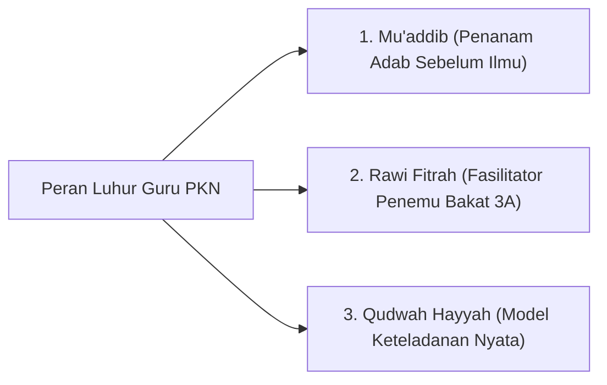
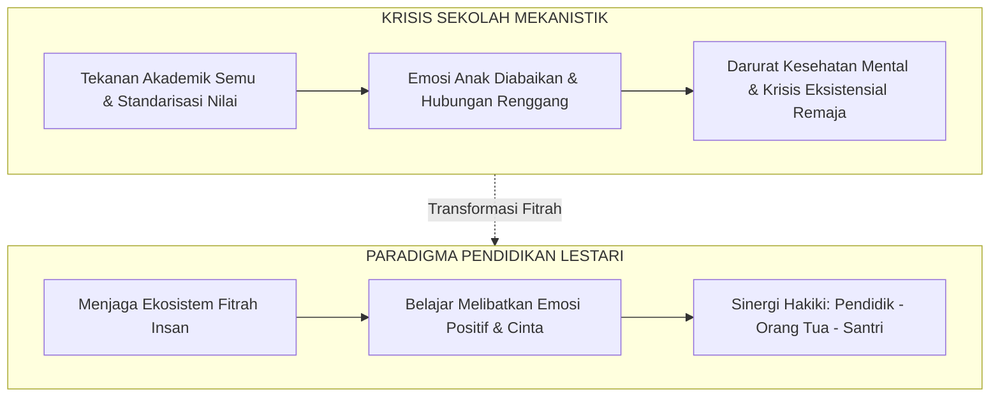
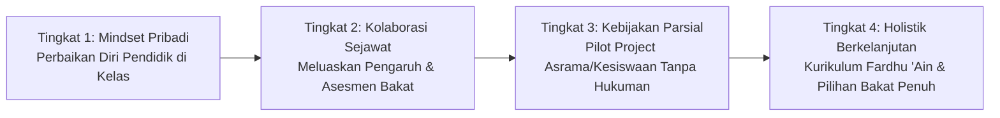

# Peran Guru & Lembaga Pendidikan: Pewaris Risalah & Mitra Fitrah Keluarga

> [!quote] Dalil & Rujukan Nabawiyah Utama
> **Naskah:**  
> « إِنَّ الْعُلَمَاءَ وَرَثَةُ الْأَنْبِيَاءِ، وَإِنَّ الْأَنْبِيَاءَ لَمْ يُوَرِّثُوا دِينَارًا وَلَا دِرْهَمًا، وَإِنَّمَا وَرَّثُوا الْعِلْمَ، فَمَنْ أَخَذَهُ أَخَذَ بِحَظٍّ وَافِرٍ »
>
> *"Sesungguhnya para ulama (guru dan pendidik) adalah pewaris para nabi. Dan sesungguhnya para nabi tidak mewariskan dinar maupun dirham, melainkan mereka mewariskan ilmu. Maka barangsiapa mengambilnya, sungguh ia telah mengambil bagian keuntungan yang sangat besar."*
>
> 📚 **Sumber Rujukan OpenBayan:** HR. Abu Dawud No. 3641 & At-Tirmidzi No. 2682; Kitab Al-Ilm; Dishahihkan oleh Ibnu Hibban dan Al-Albani; Riyadush Shalihin No. 1388.  
> 💡 **Relevansi PKN:** Guru dan lembaga pendidikan dalam PKN memegang status mulia sebagai *Waratsatul Anbiya'* (Pewaris Risalah Kenabian). Mereka hadir bukan sebagai penjual jasa industri komersial, melainkan sebagai murabbi spiritual yang mendampingi dan menyuburkan fitrah unik setiap anak murid.

---

## 1. Hakikat Posisi Guru & Sekolah dalam Perspektif PKN

Dalam arsitektur Pendidikan Karakter Nabawiyah, **Lembaga Pendidikan (Sekolah/Kuttab/Pesantren) berposisi sebagai MITRA KOMPLEMENTER bagi orang tua, BUKAN pengganti fungsi keluarga**:
* **Menolak Korporatisasi Pendidikan:** Sekolah bukan pabrik pencetak nilai ujian dan guru bukan buruh pengajar yang sekadar mentransfer kurikulum demi gaji. Guru adalah *Mu'addib* (pembina adab) dan *Muslih* (perawat jiwa generasi).
* **Menjaga Sinergi Segitiga Emas:** Ekosistem pendidikan hanya akan berhasil melahirkan generasi mukallaf mandiri jika terjalin sinergi seirama antara: **Orang Tua di Rumah ↔ Guru di Sekolah ↔ Lingkungan Masyarakat Shalih**.
* **Menghindari Standarisasi Pembunuh Bakat:** Sekolah PKN menghargai keberagaman fadhilah anak; tidak memaksakan setiap murid memiliki peringkat ranking seragam, melainkan memfasilitasi 40 pilar karakter nabawiyah (TB40).

---

## 2. Teladan Rasulullah ﷺ sebagai Pendidik Teragung (Al-Mu'allim Al-Awwal)

Rasulullah ﷺ menetapkan standar tertinggi bagi siapa saja yang mengemban profesi pendidik:

### A. Wasiat Beliau kepada Mu'adz bin Jabal & Abu Musa Al-Asy'ari
Ketika Rasulullah ﷺ mengutus kedua sahabat agung ini menjadi pendidik dan da'i bagi penduduk Yaman, beliau membekali mereka dengan kaidah pedagogi emas:
> « يَسِّرَا وَلَا تُعَسِّرَا، وَبَشِّرَا وَلَا تُنَفِّرَا، وَتَطَاوَعَا وَلَا تَخْتَلِفَا »  
> *"Permudahlah dan jangan mempersulit, berikanlah kabar gembira dan jangan membuat orang lari menjauh, serta bersatu-padulah kalian berdua dan jangan saling berselisih!"*  
> 📚 *(HR. Al-Bukhari No. 3038 & Muslim No. 1733)*

Guru yang meneladani sunnah nabawiyah adalah sosok yang membuat ilmu terasa memikat dan mudah dipahami, bukan guru yang senang memamerkan kerumitan dan menakut-nakuti murid dengan ancaman nilai jelek.

### B. Memperhatikan Kondisi Psikologis Murid (Tidak Menjemukan)
Abdullah bin Mas'ud radhiyallahu 'anhu mengisahkan bagaimana Rasulullah ﷺ mengatur jadwal ta'lim:
> « كَانَ النَّبِيُّ ﷺ يَتَخَوَّلُنَا بِالْمَوْعِظَةِ فِي الأَيَّامِ، كَرَاهَةَ السَّآمَةِ عَلَيْنَا »  
> *"Adalah Nabi ﷺ senantiasa memilih-milih hari dan waktu yang tepat dalam memberikan nasihat kepada kami, karena beliau khawatir menimbulkan kebosanan pada diri kami."*  
> 📚 *(HR. Al-Bukhari No. 68 & Muslim No. 2821)*

Seorang guru muslim wajib memiliki kepekaan rasa: kapan murid sedang siap menyerap ilmu, dan kapan murid membutuhkan jeda istirahat untuk menyegarkan kembali jiwanya.

---

## 3. Keterangan Para Ulama Klasik tentang Adab Guru

### 1. Ibn Sahnun Al-Qayrawani (Wafat 256 H)
Dalam kitab *Adab al-Mu'allimin*—buku panduan guru pertama dalam sejarah peradaban Islam:
> *"Wajib bagi seorang guru di Kuttab untuk menyamakan perhatiannya kepada seluruh murid; tidak boleh mengutamakan anak orang kaya atas anak orang miskin. Wajib baginya meniatkan pengajarannya ikhlas karena Allah, bersikap sabar menghadapi kelemahan nalar murid, dan melarang keras murid-muridnya saling mengolok-olok atau menindas satu sama lain."*

### 2. Imam Abu Bakar Muhammad bin Al-Husain Al-Ajurri (Wafat 360 H)
Dalam kitab *Akhlaqul Ulama* (Hal. 45):
> *"Ketahuilah bahwa pendidik sejati bukanlah orang yang banyak bicaranya, melainkan orang yang keteladanan akhlaknya mendahului kata-katanya. Murid-murid akan meniru cara gurunya tersenyum, cara gurunya menahan amarah, dan cara gurunya bersujud jauh lebih cepat daripada hafalan bait-bait syair yang didiktekan kepadanya."*

---

## 4. Tiga Peran Pokok Guru dalam Ekosistem PKN

1. **Sebagai Mu'addib (Penanam Adab Sebelum Ilmu):**
   * Memastikan murid menghormati ilmu, menghargai buku, menyayangi kawan, dan berbakti kepada orang tua sebelum mengajarkan rumus-rumus sains dan matematika.
2. **Sebagai Rawi Fitrah (Fasilitator Penemu Bakat 3A):**
   * Mengamati kecenderungan unik setiap anak melalui instrumen Rukun 3A (Suka, Bisa, Bermanfaat).
   * Melaporkan portofolio kekuatan karakter anak kepada orang tua secara berkala, bukan sekadar membagikan lembaran angka rapor kognitif.
3. **Sebagai Qudwah Hayyah (Cermin Hidup Keteladanan):**
   * Menjadi teladan integritas, kejujuran lisan (*Shidq*), kelemahlembutan (*Rifq*), dan ketepatan waktu shalat berjamaah.

---

---

## 5. Paradigma Pendidikan Lestari (*Sustainable Fitrah Education*)

Dalam kajian resmi Akademi Guru PKN Batch 7, **Prof. Dr. Iman Harymawan** (Guru Besar Universitas Airlangga, Peneliti Senior NUS, dan praktisi *homeschooling*) menguraikan konsep **Pendidikan Lestari**:

### A. Kritik atas Darurat Kesehatan Mental Remaja
Data empiris menunjukkan lonjakan drastis kasus depresi dan krisis kesehatan mental pada kalangan remaja di Indonesia. Salah satu akar masalah utamanya adalah **miskonsepsi persekolahan modern**:
- Sekolah sering direduksi menjadi "pabrik tes" yang mengabaikan aspek emosional dan spiritual murid.
- Anak-anak dipaksa bersaing dalam sistem peringkat yang artifisial, memicu kecemasan kronis dan perasaan tidak berharga bagi anak yang memiliki bakat di luar kurikulum standar.
- Ketika emosi ditekan dan fitrah tersumbat, jiwa anak mengalami kerapuhan luar biasa saat menghadapi tantangan hidup nyata.

### B. Belajar yang Melibatkan Emosi Positif
Pendidikan Lestari menegaskan bahwa **proses belajar yang efektif selalu melibatkan emosi positif**:
- Rasa penasaran (*Curiosity*), gairah (*Passion*), dan kebahagiaan (*Joy*) saat menemukan rahasia ciptaan Allah.
- Guru tidak hanya mengajar kepala (kognitif), melainkan menyentuh hati (afektif). Ketika hati santri merasa aman, dihargai, dan dicintai oleh gurunya, pintu nalar akan terbuka lebar untuk menyerap ilmu pengetahuan secara alami.

---

## 6. Standar Pendidik PKN: Pemetaan Potensi Guru & Self-Recovery (Klausul 12)

Dokumen *Standar Implementasi PKN 11/2024* menetapkan bahwa guru adalah instrumen utama yang membuka pintu hidayah bayan bagi santri. Oleh karena itu, lembaga wajib menjamin mutu internal para pendidik:

1. **Pemetaan Potensi Pendidik (*Teacher Talent Mapping*):**
   - Para guru akan bekerja dengan penuh kebahagiaan dan produktivitas tinggi bila beraktivitas sesuai bakatnya.
   - Setiap guru yang baru bergabung diasesmen menggunakan instrumen TB-40 untuk memetakan peran yang paling selaras: guru dominan *Rahmah/Rifq* diamanahi peran wali asrama dan konselor; guru dominan *Hikmah/Tafakkur* diamanahi kurikulum dan riset materi; guru dominan *Qiyadah/Hazm* diamanahi kepanduan dan ketertiban.
2. **Program *Self-Recovery* Pendidik:**
   - Guru yang jiwanya terluka oleh masa lalu akan cenderung melukai murid-muridnya tanpa sadar.
   - Lembaga menyelenggarakan program pemulihan berkala agar guru menyelesaikan hutang pengasuhan masa kecilnya masing-masing, sehingga dapat mengajar dengan hati yang bening (*Qalbun Salim*).
3. **Mewujudkan Sekolah Mempesona (*Pondok Manusia*):**
   - Menghapus budaya bentakan, ancaman, dan sarkasme guru di ruang guru maupun kelas.
   - Menciptakan suasana kerja ukhuwah yang hangat di antara sesama pendidik sebagai teladan nyata bagi santri.

---

## 7. Standar Mutu Kelembagaan & 4 Tingkatan Evolusi Sekolah PKN

Berdasarkan dokumen master *Panduan Implementasi Standar PKN pada Lembaga Pendidikan Islam* (Abdul Kholiq & Bayu Issetyadi), transformasi sekolah konvensional menuju madrasah nabawiyah dilakukan melalui **Empat Tingkatan Adopsi**:

1. **Tingkat 1 (Menata Ulang Mindset Diri Sendiri):** Guru memulai dari perbaikan cara pandang terhadap fitrah anak. Menerapkan 5 Bahasa Cinta di jam pelajarannya sendiri tanpa menunggu persetujuan birokrasi yayasan.
2. **Tingkat 2 (Meluaskan Pengaruh tanpa Merubah Sistem):** Berbagi wawasan santai dengan rekan guru sejawat, mulai mengobservasi fadhilah dan 40 pilar [[Bakat]] siswa, serta menyisipkan rencana pembelajaran alamiah yang kontekstual.
3. **Tingkat 3 (Kebijakan untuk Ruang Lingkup Tertentu/Parsial):** Lembaga menetapkan kebijakan resmi pada divisi percontohan (misalnya bidang kesiswaan atau asrama) dengan **menghapus sanksi fisik/hukuman yang mempermalukan**, menggantinya dengan restitusi adab dan pendampingan musyrif berbasis cinta.
4. **Tingkat 4 (Implementasi Holistik & Menuju Sempurna):** Penyelarasan menyeluruh antara kurikulum materi wajib syariat (*fardhu 'ain*) dengan materi pilihan bakat fungsional, serta penyiapan kemandirian santri mukallaf sebelum lulus.

Untuk panduan mendalam mengenai 5 strategi ushul fiqih dalam mengelola konflik adopsi sistem di lembaga, rujuk panduan lengkap di:  
👉 **[[Kaidah Implementasi di Berbagai Lembaga]]**.

---

## 8. Tautan Konseptual Terkait

* [[Tanggung Jawab Pendidikan]] — Mandat Fardhu 'Ain di Pundak Orang Tua.
* [[8 Standar Implementasi PKN]] — Pedoman Sistem Penjaminan Mutu Lembaga (Standar 11/2024 Rev 04).
* [[Panduan RPP dan Observasi Lapangan]] — Cetak Biru RPP Terpadu dan Form Observasi Karakter Santri.
* [[4 Kaidah Implementasi]] — Prinsip Operasional Pengasuhan Nabawiyah.
* [[Kaidah Implementasi di Berbagai Lembaga]] — 5 Kaidah Penyesuaian Adopsi Berdasarkan Tingkatan Lembaga.
* [[Recovery]] — Protokol Pemulihan Jiwa dan Kaidah "Tidak Menambah Luka".

