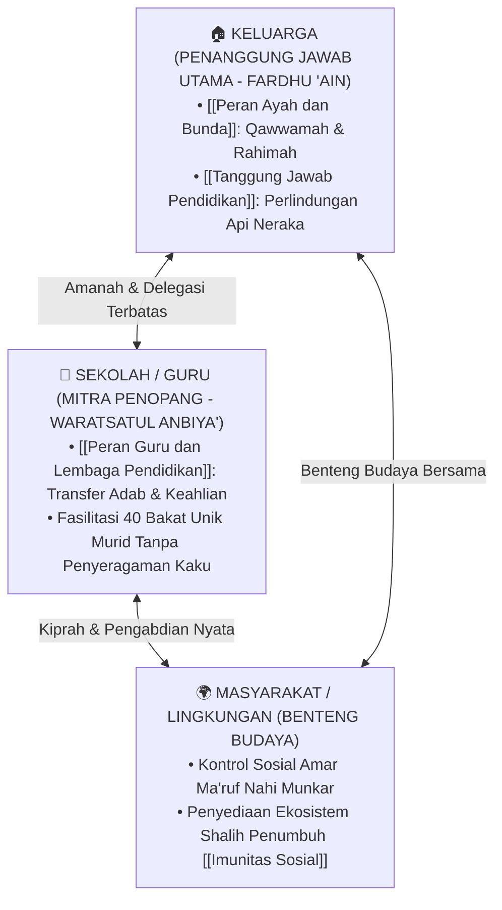

# Peran & Tanggung Jawab dalam Pendidikan Karakter Nabawiyah

> [!note] Catatan Metodologi & Sumber Penyusunan Dokumen
> Dokumen ini merupakan hasil rangkuman dan rekonstruksi berbantuan kecerdasan buatan (AI) dari berbagai materi presentasi, modul kurikulum, dokumen standar lembaga, dan rekaman kajian **Pendidikan Karakter Nabawiyah (PKN)** yang diampu oleh **Ustadz Abdul Kholiq**.  
> 
> Naskah ini telah melalui verifikasi dan pengayaan ulang dalil-dalil Al-Qur'an dan Hadits shahih dari korpus **OpenBayan** (60 kitab klasik), serta diperkaya dengan sintesis intisari dan masukan berharga dari kawan-kawan **Himmatul Ummah**, **Insan Taqwa / Mustaqbal**, dan **Tim SOTAB HEBAT**.

Halaman ini membedah arsitektur akuntabilitas dan pembagian peran para pemangku kepentingan (*stakeholders*) dalam ekosistem **Pendidikan Karakter Nabawiyah (PKN)**. Bagian ini menegaskan batas tanggung jawab syar'i antara orang tua, guru, lembaga pendidikan, dan masyarakat luas.

> [!quote] Dalil & Rujukan Nabawiyah: Pertanggungjawaban Mutlak Setiap Pemimpin
> **Naskah Hadits:**  
> « كُلُّكُمْ رَاعٍ وَكُلُّكُمْ مَسْئُولٌ عَنْ رَعِيَّتِهِ، فَالْإِمَامُ رَاعٍ وَمَسْئُولٌ عَنْ رَعِيَّتِهِ، وَالرَّجُلُ رَاعٍ فِي أَهْلِهِ وَهُوَ مَسْئُولٌ عَنْ رَعِيَّتِهِ، وَالْمَرْأَةُ رَاعِيَةٌ فِي بَيْتِ زَوْجِهَا وَمَسْئُولَةٌ عَنْ رَعِيَّتِهَا »
> 
> *"Setiap kalian adalah pemimpin dan setiap kalian akan dimintai pertanggungjawaban atas kepemimpinannya. Seorang imam adalah pemimpin dan bertanggung jawab atas rakyatnya. Seorang laki-laki (ayah) adalah pemimpin dalam keluarganya dan bertanggung jawab atas mereka. Dan seorang wanita (ibu) adalah pemimpin di rumah suaminya dan bertanggung jawab atas urusannya..."*  
> — **HR. Bukhari (No. 893) & HR. Muslim (No. 1829)**
> 
> 💡 **Relevansi PKN:** Menetapkan garis batas hukum syariat bahwa tanggung jawab pendidikan generasi berada di pundak keluarga; sekolah dan masyarakat hanyalah mitra penopang.

---

## 1. Segitiga Emas Ekosistem Pendidikan Nabawiyah

---

## 2. Rincian Tiga Pilar Tanggung Jawab

### 🏠 1. [[Tanggung Jawab Pendidikan]] & [[Peran Ayah dan Bunda]]
* **Mandat Fardhu 'Ain yang Tidak Bisa Dialihkan:** Perintah menjaga keluarga dari api neraka (QS. At-Tahrim: 6) dialamatkan langsung kepada orang tua, bukan kepada menteri pendidikan atau kepala sekolah.
* **Peran Qawwamah Ayah:** Menentukan arah visi akhirat, memimpin musyawarah keluarga, menjadi teladan ketegasan hukum, dan mencari rezeki halal.
* **Peran Rahimah Bunda:** Menjadi madrasah cinta pertama, menjaga kehangatan emosional rumah, membiasakan adab harian, dan mengisi penuh tangki kasih sayang anak.

### 🏫 2. [[Peran Guru dan Lembaga Pendidikan]]
* **Kedudukan Guru Sebagai Pewaris Nabi:** Guru memegang tugas mulia meneruskan risalah kenabian: membacakan ayat (*tilawah*), menyucikan jiwa murid (*tazkiyah*), dan mengajarkan hikmah (*ta'lim*).
* **Bukan Pabrik Penyeragaman:** Lembaga pendidikan PKN menolak perlakuan murid seperti botol kosong yang diisi secara seragam; guru bertindak sebagai fasilitator yang mengasah keunikan 40 bakat bawaan masing-masing anak.

### 🌍 3. Hak dan Kewajiban Timbal Balik
Sebagaimana dibahas dalam **[[Hak dan Kewajiban]]**, keadilan syariat mengharuskan terpenuhinya hak anak di masa kecil (hak hidup, hak bermain, hak disayangi, hak mengenal tauhid) agar kelak menghasilkan generasi yang berbakti (*birrul walidain*) dan bertanggung jawab memajukan peradaban umat.

---

## 3. Peta Penelusuran Dokumen Terkait

* Pahami landasan kewajiban orang tua di [[Tanggung Jawab Pendidikan]].
* Pahami rincian dwi-tunggal pengasuhan di [[Peran Ayah dan Bunda]].
* Pahami etika kemitraan sekolah di [[Peran Guru dan Lembaga Pendidikan]].
* Pahami timbal balik hak anak dan orang tua di [[Hak dan Kewajiban]].
---

## 4. Resolusi Konflik Peran Antara Sekolah dan Keluarga

Seringkali terjadi benturan ekspektasi antara pihak sekolah dan orang tua. Berikut adalah pedoman penyelesaian syar'i:
* **Prinsip Utama:** Otoritas tertinggi dan penanggung jawab sah anak di hadapan syariat adalah **Orang Tua**. Sekolah adalah pemegang amanah delegasi (*wakalah*) yang terikat pada batasan yang diizinkan orang tua dan syariat.
* **Jika Sekolah Menuntut Target Kognitif Berlebih:** Orang tua berhak mengambil sikap tegas untuk melindungi fitrah anak (misal: menolak PR berlebihan di usia dini yang merampas waktu istirahat dan bermain keluarga), serta mengkomunikasikannya secara adab kepada pihak sekolah.
* **Jika Anak Bermasalah di Sekolah:** Sekolah tidak boleh langsung melabeli anak atau menjatuhkan sanksi sepihak tanpa melibatkan orang tua; evaluasi bersama harus dilakukan untuk melihat apakah akar masalah berada di rumah (tangki cinta kering) atau di sekolah (perundungan kawan sebaya).
* **Kolaborasi Trias Karakter:** Guru bertindak sebagai pengamat keunikan bakat anak di lingkungan sosial, dan melaporkan temuan tersebut kepada orang tua untuk difasilitasi lebih lanjut di rumah.

---

> [!quote] Dokumen & Slide Presentasi Rujukan Resmi PKN
> Pembahasan dalam artikel ini bersumber langsung dari materi tayang pelatihan dan dokumen kurikulum resmi PKN oleh **Ustadz Abdul Kholiq**:
>
> - **Materi:** *Standar Implementasi PKN 11-2024 (Rev 04)*
>   - 📖 **Rujukan Slide:** Dokumen Manual Hal. 10–48 (8 Standar Mutu PKN, Standar Pendewasaan Aqil-Baligh & Tata Kelola Lembaga)
>   - 🔗 **Akses Berkas:** [📥 Unduh PDF (2.5 MB)](https://www.dropbox.com/scl/fi/jp2699r9yutavs9ob49nl/7._Evaluasi__Pendidikan_Karakter_Nabawiyah-1.pdf?rlkey=wu4k8ik616fnmn4rku4agtktb&dl=1) • [👁️ Buka di Dropbox](https://www.dropbox.com/scl/fi/jp2699r9yutavs9ob49nl/7._Evaluasi__Pendidikan_Karakter_Nabawiyah-1.pdf?rlkey=wu4k8ik616fnmn4rku4agtktb&dl=0)
>
> - **Materi:** *3. PEMBELAJARAN BERBASIS PROJEK*
>   - 📖 **Rujukan Slide:** Slide Hal. 5–32 (Desain Pembelajaran Berbasis Proyek Karakter & Format RPP Terpadu)
>   - 🔗 **Akses Berkas:** [📥 Unduh PDF (3.8 MB)](https://www.dropbox.com/scl/fi/rib25hfpjgwg9jq4ecnsq/3.-PEMBELAJARAN-BERBASIS-PROJEK.pdf?rlkey=fx25vuj8iz97j9vsl64458di1&dl=1) • [📊 Unduh PPTX Asli (27.7 MB)](https://www.dropbox.com/scl/fi/s5odch61rsyu9gxos96a9/3.-PEMBELAJARAN-BERBASIS-PROJEK.pptx?rlkey=cfru4prp5q37ag3bf4z8jhzcb&dl=1) • [👁️ Buka di Dropbox](https://www.dropbox.com/scl/fi/rib25hfpjgwg9jq4ecnsq/3.-PEMBELAJARAN-BERBASIS-PROJEK.pdf?rlkey=fx25vuj8iz97j9vsl64458di1&dl=0)
>
> - **Materi:** *6. Implementasi Kurikulum PKN Pada Persekolahan*
>   - 📖 **Rujukan Slide:** Slide Hal. 8–28 (Tahapan Adopsi Kurikulum Karakter pada Sekolah, Pesantren, dan Madrasah)
>   - 🔗 **Akses Berkas:** [📥 Unduh PDF (1.9 MB)](https://www.dropbox.com/scl/fi/l31yame2e48ghsq4su02a/6.-Implementasi-Kurikulum-PKN-Pada-Persekolahan.pdf?rlkey=3qcjge7qn0sqebohiybyomkph&dl=1) • [📊 Unduh PPTX Asli (501 KB)](https://www.dropbox.com/scl/fi/d5g15b0din35v06sanzcx/6.-Implementasi-Kurikulum-PKN-Pada-Persekolahan.pptx?rlkey=n7o2e20svwk8p61i7fp9cvcys&dl=1) • [👁️ Buka di Dropbox](https://www.dropbox.com/scl/fi/l31yame2e48ghsq4su02a/6.-Implementasi-Kurikulum-PKN-Pada-Persekolahan.pdf?rlkey=3qcjge7qn0sqebohiybyomkph&dl=0)
>
> - **Materi:** *10 MASALAH PENDIDIKAN*
>   - 📖 **Rujukan Slide:** Slide Hal. 15–75 (Diagnosis Akar Krisis Pendidikan Modern & Desain Solutif PKN)
>   - 🔗 **Akses Berkas:** [📊 Unduh PPTX Asli (97.5 MB)](https://www.dropbox.com/scl/fi/jqnc3ldzd7ssjs8q45us9/10-MASALAH-PENDIDIKAN.pptx?rlkey=cpxg69hwsgntk514h37wb2gcr&dl=1) • [👁️ Buka di Dropbox](https://www.dropbox.com/scl/fi/jqnc3ldzd7ssjs8q45us9/10-MASALAH-PENDIDIKAN.pptx?rlkey=cpxg69hwsgntk514h37wb2gcr&dl=0)

