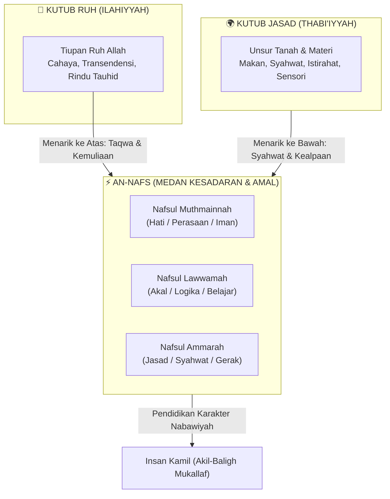
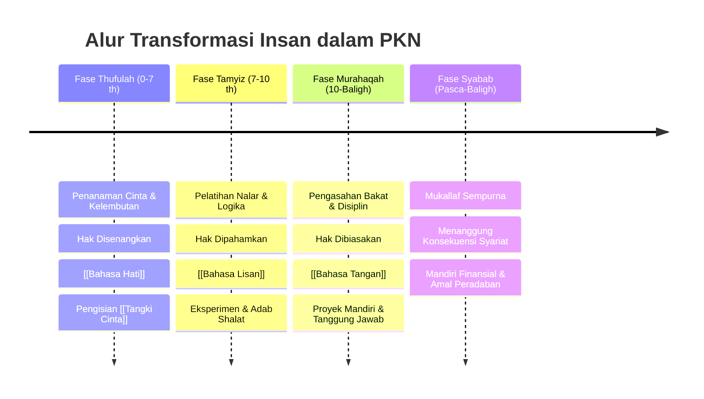

# Paradigma Insan dalam Pendidikan Karakter Nabawiyah

Pendidikan Karakter Nabawiyah (PKN) berdiri di atas landasan epistemologi bahwa manusia (*insan*) bukanlah produk evolusi materi belaka, bukan mesin biologis tanpa tujuan, dan bukan lembaran putih pasif (*tabula rasa*) yang bebas dibentuk sekehendak desainer kurikulum sekuler. Manusia adalah mahakarya ciptaan Allah Yang Maha Bijaksana, diciptakan dengan perpaduan dwidimensi yang sakral: tanah bumi yang rendah (*thiin*) dan tiupan ruh Ilahi yang agung (*nafkhatur ruh*). Persenyawaan kedua unsur ini memunculkan entitas hidup yang berpikir, merasa, dan berkehendak, yang disebut dengan **Jiwa (*An-Nafs*)**.

Pendidikan sejati dalam Islam bukanlah proses fabrikasi atau penyeragaman mekanis, melainkan ikhtiar pemuliaan martabat kemanusiaan (*takrimul insan*) dan penumbuhkembangan fitrah suci agar manusia mampu menunaikan dua amanah eksistensialnya: sebagai hamba yang mengikhlaskan ibadah hanya kepada Allah (*'Abdullah*) dan sebagai khalifah yang memakmurkan bumi dengan adil dan maslahat (*Khalifah fil Ardh*).

> [!quote] Dalil & Rujukan Nabawiyah: Penciptaan Insan yang Sempurna
> **Teks Al-Qur'an:**  
> « لَقَدْ خَلَقْنَا الْإِنسَانَ فِي أَحْسَنِ تَقْوِيمٍ ۝ ثُمَّ رَدَدْنَاهُ أَسْفَلَ سَافِلِينَ ۝ إِلَّا الَّذِينَ آمَنُوا وَعَمِلُوا الصَّالِحَاتِ فَلَهُمْ أَجْرٌ غَيْرُ مَمْنُونٍ »  
> *"Sungguh, Kami benar-benar telah menciptakan manusia dalam bentuk yang sebaik-baiknya. Kemudian Kami kembalikan dia ke tempat yang serendah-rendahnya, kecuali orang-orang yang beriman dan mengerjakan kebajikan; maka bagi mereka pahala yang tidak putus-putus."*  
> — **QS. At-Tiin: 4–6**  
>  
> 📚 **Takhrij & Syarah Tafsir Ibnu Katsir (Juz 8 Hal. 435):**  
> *"Allah Ta'ala mengabarkan tentang penciptaan manusia dalam rupa yang paling indah, postur yang tegak sempurna, dan anggota badan yang proporsional lagi seimbang (*fi ahsani taqwim*). Namun jika manusia menelantarkan fitrah keimanan dan ketaatan kepada Sang Pencipta, Allah akan menjatuhkannya ke jurang kenistaan yang paling hina (*asfala safilin*), yakni neraka Jahannam dan kehinaan derajat di bawah binatang ternak."*  
>  
> 💡 **Relevansi PKN:** Ayat ini menjadi kompas tertinggi tarbiyah: potensi kemuliaan anak telah tertanam secara fitrah (*ahsani taqwim*), dan tugas pendidikan adalah menjaga imunitas spiritual anak agar tidak terdegradasi menjadi *asfala safilin* akibat abai terhadap adab, iman, dan tanggung jawab syariat.

---

## 1. Arsitektur Tripartit Insan: Ruh, Jasad, dan Nafs

Dalam menganalisis manusia, Pendidikan Karakter Nabawiyah mengadopsi kerangka psikospiritual klasik Islam sebagaimana diuraikan oleh Imam Abu Hamid Al-Ghazali dalam *Ihya 'Ulumiddin* dan Al-Hafizh Ibnul Qayyim dalam *Kitab ar-Ruh* serta *Madarijus Salikin*. Manusia dipahami melalui tiga domain yang saling berinteraksi:

### A. Dimensi Jasad (*Al-Jism / Al-Jasad*)
Jasad adalah wadah fisik biologis yang berasal dari sari pati tanah (*sulalatin min thin*). Karakteristik jasad adalah tunduk pada hukum alam material (*sunnatullah kauni*) seperti gravitasi, kelelahan, rasa lapar, haus, dan dorongan pelestarian jenis (*syahwat*). 
- Dalam PKN, jasad tidak boleh dimusuhi atau disiksa secara asketis ekstrem (*tazahhud bathil*), tetapi wajib dirawat, diberi hak nutrisi halalan thayyiban, dan dilatih ketangkasan fisiknya.
- Jasad adalah kendaraan bagi jiwa untuk menunaikan amal saleh. Namun bila jasad dibiarkan tanpa bimbingan akal dan ruh, dorongan biologis hewani (*hayawaniyah*) akan menguasai diri anak, melahirkan watak malas, konsumtif, dan impulsif.

### B. Dimensi Ruh (*Ar-Ruh*)
Ruh adalah unsur gaib ciptaan Allah yang suci, ditiupkan langsung ke dalam janin pada usia 120 hari di dalam rahim ibu. 
- Karakteristik ruh selalu rindu pada asalnya: alam malakut, keagungan Ilahi, zikir, dan ketenangan tauhid.
- Ruh adalah sumber kompas moral terdalam (*nurani*) dan kesaksian primordial manusia di hadapan Allah: *“Alastu birabbikum? Qalu: Balaa syahidna!”* (Bukankah Aku ini Tuhanmu? Mereka menjawab: Benar, kami bersaksi! - QS. Al-A'raf: 172).

### C. Dimensi Jiwa (*An-Nafs*)
Nafs adalah perjumpaan dialektis antara ruh dan jasad. Di sinilah letak medan pertarungan ikhtiar (*mujahadah*) manusia. Jiwa memiliki kehendak bebas (*masyi'ah*) untuk memilih: tunduk pada bimbingan ruh menuju ketakwaan, atau tunduk pada tuntutan syahwat jasad menuju kefasikan.
- Al-Qur'an membagi kondisi jiwa ke dalam tiga tingkatan dinamis: [[Ammarah]] (jiwa pendorong keburukan bila liar), [[Lawwamah]] (jiwa pencela yang berpikir dan menimbang), serta [[Muthmainnah]] (jiwa tenang yang mantap dalam tauhid dan ketaatan).

---

## 2. Paradigma Dwi-Mandat: 'Abdullah dan Khalifah fil Ardh

Pendidikan modern sering kali terjebak dalam dikotomi sempit: mencetak anak sekadar menjadi pekerja korporasi yang produktif (*human capital*) atau mengejar capaian akademis kognitif semata. PKN mendefinisikan keberhasilan pendidikan melalui ketercapaian dua peran eksistensial insan:

| Dimensi Peran | Sumber Mandat | Orientasi Utama | Indikator Keberhasilan Tarbiyah |
|---|---|---|---|
| **'Abdullah (Hamba Allah)** | QS. Adz-Dzariyat: 56 | Hubungan Vertikal (*Hablum Minallah*) | Ikhlas beribadah, takut berbuat maksiat, tunduk pada syariat, memiliki [[Tangki Cinta]] ilahiyah, dan berakhlak mulia secara personal. |
| **Khalifah fil Ardh (Pengelola Bumi)** | QS. Al-Baqarah: 30 & Hud: 61 | Hubungan Horisontal (*Hablum Minannas wa 'Alam*) | Mengoptimalkan 40 pilar [[Bakat]], memiliki keterampilan hidup mandiri, memimpin perbaikan peradaban (*ishlah*), dan menebar rahmat bagi semesta. |

Kegagalan mendidik salah satu pilar ini akan melahirkan manusia cacat peradaban:
1. Menjadi hamba saleh ritual tapi pasif, apatis, dan tidak berdaya membangun peradaban (kehilangan peran Khalifah).
2. Menjadi teknokrat cerdas dan profesional produktif, namun sekuler, korup, amoral, dan tamak merusak bumi (kehilangan peran 'Abdullah).

---

## 3. Matriks Transformasi Insan Menuju Kematangan Akil-Baligh

Tujuan akhir dari paradigma insan dalam PKN adalah menghantarkan anak mencapai batas kedewasaan penuh: baligh secara biologis berbarengan dengan matang akal (*akil*) secara mental dan syar'i.

---

## 4. Panduan Implementasi bagi Pendidik dan Orang Tua

Untuk membumikan Paradigma Insan dalam interaksi pengasuhan harian, orang tua dan guru wajib memperhatikan kaidah-kaidah berikut:

1. **Memandang Anak sebagai Kesatuan Utuh (Holistik):** Jangan pernah mereduksi kemuliaan anak hanya pada nilai angka rapor, kepatuhan buta, atau performa fisik semata. Lihatlah gejolak emosi dan perilaku nakal anak sebagai sinyal kebutuhan jiwa yang belum terpenuhi pada dimensi ruh, nafs, atau jasadnya.
2. **Menghormati Fitrah Keberagaman Syakilah:** Sebagaimana firman Allah dalam QS. Al-Isra': 84 (*Kullun ya'malu 'ala syakilatih*), setiap anak memiliki sidik jari bakat yang unik. Tidak ada anak yang "gagal produk"; yang ada hanyalah anak yang fitrah bakatnya belum dikenali dan disesuaikan jalurnya oleh orang dewasa.
3. **Mendahulukan Adab Sebelum Ilmu (*Al-Adab Qablal 'Ilm*):** Sebagaimana nasihat Imam Malik kepada Imam Abu Zakariya Al-'Anbari: *"Pelajarilah adab sebelum kamu mempelajari ilmu."* Membentuk jiwa yang beradab dan takut kepada Allah jauh lebih mendesak daripada menjejali memori kognitif anak dengan setumpuk hafalan teori.

> [!reflection] Refleksi Orang Tua & Pendidik: Menatap Hakikat Anak
> - Apakah selama ini kita memandang ananda sebagai titipan amanah suci dari Allah yang harus dimuliakan fitrahnya, atau sekadar "proyek pribadi" untuk memuaskan ambisi sosial dan kebanggaan duniawi kita?
> - Ketika ananda berbuat salah, apakah kita meresponsnya dengan kejengkelan nafsu ammarah kita sendiri, atau mendampinginya dengan kesadaran bahwa jiwanya sedang berjuang menundukkan godaan syahwat jasad menuju kematangan akal?

---

## Tautan Navigasi Pilar Insan

* [[Tujuan Hidup Manusia]] — Dekonstruksi misi ibadah dan khilafah manusia di muka bumi.
* [[Bersatunya Ruh dan Jasad Membentuk Jiwa]] — Dinamika perjumpaan substansi langit dan bumi melahirkan nafs.
* [[Pembagian Jiwa]] — Pemetaan trikotomi jiwa: Ammarah, Lawwamah, dan Muthmainnah.
* [[Fitrah (Karakter)]] — 40 pilar karakter nabawiyah dan fitrah bawaan lahir.
* [[Perkembangan]] — 4 etape pengasuhan: Thufulah, Tamyiz, Murahaqah, dan Syabab.
