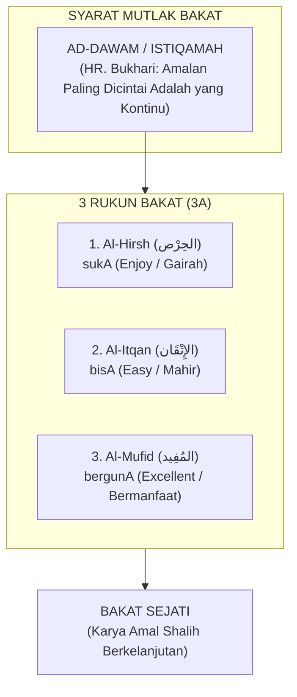

# Karakter Bakat: Menemukan Panggilan Misi Kekhalifahan

> [!quote] Dalil & Rujukan Nabawiyah
> **Naskah:**  
> « اعْمَلُوا فَكُلٌّ مُيَسَّرٌ لِمَا خُلِقَ لَهُ؛ أَمَّا مَنْ كَانَ مِنْ أَهْلِ السَّعَادَةِ فَيُيَسَّرُ لِعَمَلِ أَهْلِ السَّعَادَةِ »
>
> *"Beramallah kalian, karena masing-masing orang akan dimudahkan untuk menempuh jalan yang telah diciptakan baginya..."*
>
> 📚 **Sumber Rujukan OpenBayan:** HR. Bukhari (No. 4949) & Riyadush Shalihin (Tahqiq Ar-Risalah II, Hal. 295)  
> 💡 **Relevansi PKN:** Setiap anak dibekali keunikan bakat dan kemudahan amal (*isti'dad*) spesifik yang harus diobservasi secara personal ('satu anak satu kurikulum').

> *"Bakat bukanlah sekadar hobi atau keterampilan mencari uang, melainkan rancang bangun fitrah yang Allah sematkan secara unik pada diri setiap hamba untuk memikul tugas kekhalifahan di muka bumi. Sebagaimana sabda Rasulullah ﷺ: 'Bekerjalah kalian, karena masing-masing insan akan dimudahkan menuju takdir penciptaannya (Kullun muyassarun limaa khuliqa lah)'."*  
> — **Ustadz Abdul Kholiq & SOTAB HEBAT**

---

## 1. Hakikat Bakat (*Al-Mauhibah & Fitrah*)

Dalam naskah resmi *Seminar 2: Tafsir Bakat TB-40*, **Bakat** secara syar'i diistilahkan sebagai **Al-Mauhibah (المَوْهِبَة)**, yaitu anugerah keistimewaan sifat dan kecondongan fitriah yang Allah sematkan secara unik pada diri setiap hamba sebagai bekal menunaikan peran peradaban.

Landasan teologis penciptaan bakat merujuk pada firman Allah *Subhanahu wa Ta'ala*:
$$\text{وَكُلُّ شَيْءٍ عِنْدَهُ بِمِقْدَارٍ}$$
*"Dan segala sesuatu pada sisi-Nya ada kadarnya (ukuran dan potensinya yang terukur)."* (QS. Ar-Ra'd: 8).

Imam Ibnul Jauzi *rahimahullah* dalam kitab *Al-Hats 'ala Thalabil 'Ilmi* menegaskan:
> *"Di antara hal yang paling wajib diperhatikan oleh para pendidik adalah mengenali tabiat dan potensi anak. Apabila seorang anak dipaksa untuk menekuni bidang ilmu yang bukan bakat dan fitrah penciptaannya, niscaya ia tidak akan pernah berhasil meraih keunggulan dan hanya menghabiskan umurnya dalam kesia-siaan."*

Bakat bukanlah sekadar keterampilan duniawi untuk mencari penghasilan material, melainkan meliputi seluruh sendi kehidupan, termasuk kekhusyukan dalam peribadatan dan jihad peradaban membela agama Allah.

---

## 2. Syarat & Rukun 3A Bakat Nabawiyah

Sebuah aktivitas dapat divalidasi sebagai **Bakat Sejati** jika memenuhi satu syarat mutlak dan tiga rukun fundamental:

### A. Syarat Mutlak: *Ad-Dawam* (Kontinuitas Amal)
Merujuk pada sabda Rasulullah *shallallahu 'alaihi wa sallam*:
> « أَحَبُّ الأَعْمَالِ إِلَى اللَّهِ أَدْوَمُهَا وَإِنْ قَلَّ »  
> *"Amalan yang paling dicintai oleh Allah adalah amalan yang paling kontinu (dawam/istiqamah), meskipun sedikit."* (HR. Bukhari No. 6464 & Muslim No. 782).

Aktivitas yang hanya digemari sesaat lalu ditinggalkan ketika bosan bukanlah bakat, melainkan letupan emosi sesaat. Bakat sejati memiliki daya tahan (*endurance*) yang membuat pemiliknya terus berkarya secara konsisten.

### B. Tiga Rukun Bakat (3A): Suka, Bisa, Berguna
1. **Al-Hirsh (الحِرْص) $\to$ sukA:** Anak memiliki rasa cinta, gairah alami (*passion*), dan dorongan batin yang kuat untuk melakukannya tanpa perlu disuruh atau diiming-imingi upah.
2. **Al-Itqan (الإِتْقَان) $\to$ bisA:** Anak mampu mempelajarinya dengan cepat (*easy to learn*) dan menghasilkan mutu kerja yang rapi, presisi, serta berkualitas unggul melampaui rata-rata kawan sebayanya.
3. **Al-Mufid (المُفِيد) $\to$ bergunA:** Karyanya tidak berhenti pada kebanggaan ego pribadi, melainkan mendatangkan kemanfaatan nyata bagi keluarga, masyarakat, dan kejayaan umat Islam.

### Komparasi Kritis: Bakat vs Hobi vs Keterampilan Teknis

| Dimensi Pembeda | Bakat Sejati (*Al-Mauhibah*) | Hobi (*Al-Hiwayah*) | Keterampilan Teknis (*Al-Maharah*) |
|---|:---:|:---:|:---:|
| **Komponen Rukun** | **Suka + Bisa + Berguna** | **Suka saja** | **Bisa + Berguna (Tanpa Suka)** |
| **Dorongan Utama** | Panggilan Jiwa & Misi Khilafah | Hiburan & Kesenangan Sesaat | Tuntutan Profesi / Cari Nafkah |
| **Tingkat Kejenuhan** | Tidak Pernah Bosan (*Dawam*) | Cepat Bosan Bila Ada Tren Baru | Rentan Mengalami *Burnout* Parah |
| **Nilai Peradaban** | Melahirkan Karya *Ihsan* Abadi | Terbatas pada Kepuasan Pribadi | Rutinitas Transaksional Mekanik |

---

## 3. Paradigma Reframing: "Bakat Tersembunyi di Balik Kenakalan Anak"

Salah satu revolusi cara pandang dalam *Seminar 2: Tafsir Bakat TB-40* adalah kaidah **Reframing Perilaku**. Di mata orang tua konvensional, anak yang berbeda sering dicap "nakal" atau "bermasalah". Namun, kacamata PKN memandang perilaku tersebut sebagai **sinyal energi bakat yang tersumbat dan mencari jalan keluar**:

| Label Negatif Konvensional | Perilaku Anak yang Tampak | Reframing Fitrah: Potensi Pilar TB-40 | Panduan Penyaluran Ma'ruf |
|---|---|---|---|
| *"Suka membantah & cerewet"* | Selalu mendebat perintah, banyak bicara, ingin pembuktian logika | **Fashaahah** (Fasih Bicara) & **Hujjah** (Kuat Dalil) | Salurkan ke forum diskusi, kajian dalil, diplomasi, atau jurnalisme dakwah. |
| *"Hiperaktif & tidak bisa diam"* | Memanjat pohon, berlari kencang, gelisah jika duduk diam lama | **Nasyaath** (Enerjik) & **Syajaa'ah** (Berani) | Berikan porsi olahraga ketangkasan, kepanduan alam, dan peran logistik lapangan. |
| *"Suka membongkar mainan & merusak"* | Mengutak-atik barang elektronik, merusak jam dinding, mencopot baut | **Fathanah** (Cerdas) & **Tafakkur** (Nalar Kritis) | Berikan peralatan bengkel aman, bahan daur ulang, dan proyek rekayasa mesin. |
| *"Keras kepala & ngeyel"* | Menolak instruksi jika tidak sesuai kemauannya, bersikukuh pada target | **'Aziimah** (Tekad Kuat) & **Hazm** (Ketegasan) | Berikan target proyek besar yang menantang dan libatkan dalam penegakan aturan. |
| *"Pelit & hitung-hitungan"* | Sangat menjaga barang miliknya, teliti mencatat uang saku | **Iqtishaad** (Hemat) & **Amaanah** (Teliti) | Berikan amanah bendahara proyek, pembukuan koperasi santri, dan manajemen stok. |
| *"Cengeng & terlalu sensitif"* | Mudah menangis melihat kucing terluka, baper mendengar bentakan | **Rahmah** (Belas Kasih) & **Riqqahtul Qalb** (Lembut Hati) | Tempatkan di divisi pelayanan (*Khidmah*), panti asuhan, atau konseling sebaya. |

---

## 4. Tiga Induk Bakat (*Al-Ummuhat fits-Tafsir*)

Seluruh 40 sifat mulia dalam TB-40 bermuara pada tiga induk bakat nabawiyah:
1. **Induk Memerintah / Memimpin (*Al-Qiyadah fits-Ta'tsir*):** Energi menggerakkan peradaban, menegakkan keadilan, dan mengambil keputusan strategis.
2. **Induk Berpikir / Merumuskan Hikmah (*Al-Fikr wal-Hikmah*):** Energi meneliti ayat kauniyah dan qur'aniyah, menyusun rancang bangun strategi, dan melahirkan karya inovatif.
3. **Induk Melayani / Mempererat Umat (*Al-Khidmah wal-Ulfah*):** Energi menyatukan hati, merawat kaum dhuafa, melayani jamaah, dan menjaga soliditas ukhuwah.

---

## 5. Tahapan Observasi Berdasarkan Usia Anak

1. **Usia 0–7 Tahun (Fase Thufulah): Observasi "SUKA"**  
   - Fokus: Memberikan ragam pengalaman sensorik dan motorik seluas-luasnya di alam terbuka.
   - Amati aktivitas apa yang membuat anak antusias, lupa waktu, dan bergairah melakukannya tanpa disuruh. Jangan menuntut hasil karya atau kualitas di fase ini.
2. **Usia 7–10 Tahun (Fase Tamyiz): Observasi "SUKA & BISA"**  
   - Fokus: Memperhatikan aktivitas yang tidak hanya disukai anak, tetapi juga **mudah ia kuasai (*easy to learn*)** dibanding anak-anak sebayanya.
   - Anak mulai menunjukkan pola konsistensi: cepat mengerti saat membongkar mesin, fasih saat bercerita, atau tekun saat menggambar sketsa.
3. **Usia 10–14 Tahun (Fase Murahaqah): Pembuktian "SUKA, BISA, & BERGUNA"**  
   - Fokus: Mengarahkan bakat menjadi proyek nyata (*Project-Based Learning*) atau magang kerja keluarga (*internship*).
   - Anak diuji: apakah keahliannya mampu memecahkan masalah nyata dan mendatangkan kemanfaatan (*kemanfaatan sosial, ekonomi, atau dakwah*) bagi keluarga dan umat?

## 6. Kaidah Emas Pembinaan Bakat

### A. Fokus pada Kekuatan, Siasati Kelemahan
Paradigma sekolah modern sering terjebak dalam obsesi *"meratakan semua nilai rapor"*. Anak yang lemah matematika dipaksa les berjam-jam hingga lelah, sementara bakat sastranya yang luar biasa dibiarkan layu.

Islam mengajarkan prinsip terbalik:
- **Melejitkan Kekuatan (*Fadhilah*):** Asah pilar bakat dominan anak hingga mencapai derajat *Ihsan* (keahlian kelas dunia yang bernilai ibadah).
- **Menyiasati Kelemahan:** Kelemahan pada anak cukup dipenuhi pada batas standar minimal (*fardhu 'ain*) agar tidak menjerumuskannya ke dalam maksiat atau ketidakmampuan hidup mandiri, lalu bangun sinergi kemitraan (*Ta'aawun*) dengan orang lain yang memiliki kelebihan di bidang tersebut.

### B. Bahaya Penjurusan Prematur
Berdasarkan ulasan SOTAB HEBAT (*Penjurusan Prematur*), memaksa anak memilih satu jurusan kaku di usia dini sebelum tuntas eksplorasi fitrahnya adalah bentuk pengebirian potensi. Anak butuh spektrum pengalaman yang kaya sebelum mengerucutkan fokus pada karir spesifiknya saat baligh.

### C. Menghargai Anak Berkehebatan Khusus (ABK)
Dalam pandangan PKN, **tidak ada anak yang gagal diciptakan Allah**. Anak-anak dengan kebutuhan khusus (ABK, autis, ADHD, atau disleksia) sejatinya adalah insan yang membawa *"kehebatan khusus"*. Anak hiperaktif sering kali menyimpan potensi besar pilar *Nasyaath* (pekerja keras tangguh) atau *Syajaa'ah* (keberanian tinggi). Mereka sebaiknya tidak diisolasi, melainkan diikutsertakan bersama teman-temannya saat belajar di alam terbuka untuk melatih adaptasi sosial dan menumbuhkan rasa percaya diri.

---

## 7. Enam Kategori Bakat Utama (Level 6)

Persilangan antara Kutub Energi Sosial (Introvert vs Extrovert) dan Dimensi Jiwa (Karsa, Cipta, Rasa) menghasilkan 6 kluster bakat utama yang menaungi [[CONTENT_ANALYSIS#3.5-tingkat-40-katalog-komprehensif-40-pilar-karakter-nabawiyah|40 Pilar Karakter Nabawiyah (TB40)]]:

1. **[[Bekerja Keras]] (الحَمَاسَة):** Introvert + Karsa — Daya tahan fisik, ambisi tinggi, tekad membaja.
2. **[[Berpikir]] (التَّفْكِيْر):** Introvert + Cipta — Ketajaman analisa nalar, perumusan hikmah, kreativitas solusi.
3. **[[Berperasaan]] (الشُعُوْر):** Introvert + Rasa — Kepekaan nurani batin, kejujuran apa adanya, kerendahan hati.
4. **[[Memerintah]] / Mempengaruhi (التَّأْثِيْر):** Extrovert + Karsa — Keberanian memimpin, menggerakkan massa, ketegasan membela.
5. **[[Bekerja Sama]] (التَّعَامُل):** Extrovert + Cipta — Menjalin diplomasi, mencairkan suasana, mempererat ukhuwah.
6. **[[Melayani]] (الخِدْمَة):** Extrovert + Rasa — Kedermawanan sosial, mendahulukan orang lain, kesabaran melayani.

---

## 8. Rujukan Kajian Video Terkait (PKN Video Database)

* *Observasi Bakat Berdasarkan Usia Anak: Suka, Bisa, Berguna* — [Tonton di YouTube @ 01:32](https://www.youtube.com/watch?v=6e_Yy3AXbj4&t=92s)
* *Bakat Tersembunyi di Balik Kenakalan Anak* — [Tonton di YouTube @ 60:19](https://www.youtube.com/watch?v=w04OJijPmQk&t=3619s)
* *Tanya Jawab: Apakah Anak ABK Perlu Dipisah atau Dicampur?* — [Tonton di YouTube @ 55:14](https://www.youtube.com/watch?v=hODlNvl6qcc&t=3314s)
* *Kisah Sahabat Abu Dzar: Mengenal Kelemahan dan Mengakui Kekuatan* — [Tonton di YouTube @ 01:23](https://www.youtube.com/watch?v=Jl28ARzLW8g&t=83s)

---

## 9. Navigasi Instrumen & Panduan Terkait

* [[Panduan Asesmen dan Observasi TB40]] — Pedoman komprehensif instrumen 40 pilar, Likert 0–100 vs Ipsative 360°, dan pemetaan karir peradaban.
* [[Panduan RPP dan Observasi Lapangan]] — Template RPP Karakter, instrumen kuisioner pertumbuhan, dan checklist harian 40 pilar.
* [[8 Standar Implementasi PKN]] — Klausul 8 Perencanaan Kurikulum Bakat dan Klausul 10 Pendewasaan.

