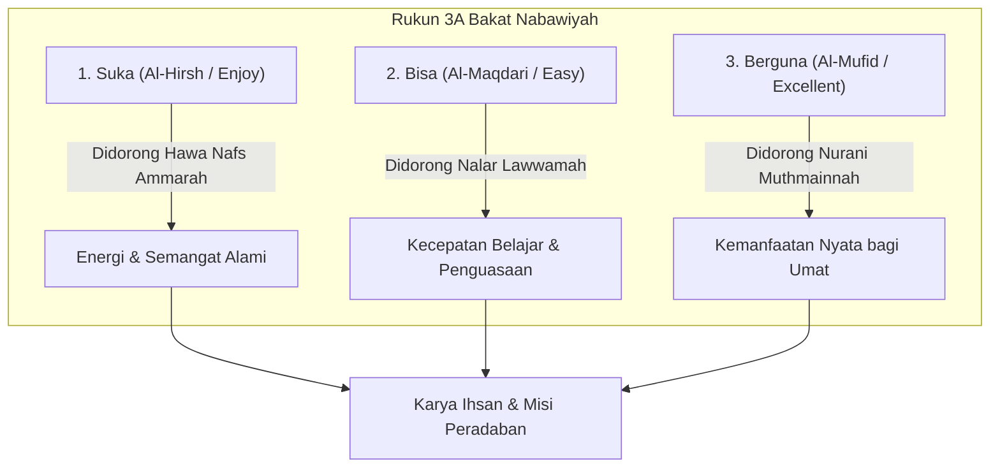

# Karakter Bakat: Menemukan Panggilan Misi Kekhalifahan

> *"Bakat bukanlah sekadar hobi atau keterampilan mencari uang, melainkan rancang bangun fitrah yang Allah sematkan secara unik pada diri setiap hamba untuk memikul tugas kekhalifahan di muka bumi. Sebagaimana sabda Rasulullah ﷺ: 'Bekerjalah kalian, karena masing-masing insan akan dimudahkan menuju takdir penciptaannya (Kullun muyassarun limaa khuliqa lah)'."*  
> — **Ustadz Abdul Kholiq & SOTAB HEBAT**

---

## 1. Hakikat Bakat (*Mauhibah & Fitrah*)

Dalam Pendidikan Karakter Nabawiyah (PKN), **Bakat** didefinisikan sebagai kombinasi sifat, potensi energi, dan kecondongan jiwa yang dominan pada diri seseorang yang membedakannya dari orang lain.

Bakat tidak datang secara kebetulan. Allah menciptakan manusia dengan ragam potensi yang berpasangan dan saling melengkapi: ada yang diberi ketangguhan fisik untuk bekerja keras, ada yang diberi ketajaman nalar untuk merumuskan hukum, ada yang diberi kelembutan hati untuk merawat sesama, dan ada yang diberi wibawa kepemimpinan untuk menggerakkan pasukan.

---

## 2. Rukun 3A & Tahapan Observasi Berdasarkan Usia

Sebuah aktivitas dapat divalidasi sebagai **Bakat Sejati** jika memenuhi tiga rukun fundamental yang disingkat **Rukun 3A**:

### Tahapan Observasi Bakat Sesuai Usia Anak
Ustadz Abdul Kholiq menegaskan bahwa orang tua tidak boleh tergesa-gesa memberi label bakat pada anak sebelum melalui tiga jenjang observasi alami:

1. **Usia 0–7 Tahun (Fase Thufulah): Observasi "SUKA"**  
   - Fokus: Memberikan ragam pengalaman sensorik dan motorik seluas-luasnya di alam terbuka.
   - Amati aktivitas apa yang membuat anak antusias, lupa waktu, dan bergairah melakukannya tanpa disuruh. Jangan menuntut hasil karya atau kualitas di fase ini.
2. **Usia 7–10 Tahun (Fase Tamyiz): Observasi "SUKA & BISA"**  
   - Fokus: Memperhatikan aktivitas yang tidak hanya disukai anak, tetapi juga **mudah ia kuasai (*easy to learn*)** dibanding anak-anak sebayanya.
   - Anak mulai menunjukkan pola konsistensi: cepat mengerti saat membongkar mesin, fasih saat bercerita, atau tekun saat menggambar sketsa.
3. **Usia 10–14 Tahun (Fase Murahaqah): Pembuktian "SUKA, BISA, & BERGUNA"**  
   - Fokus: Mengarahkan bakat menjadi proyek nyata (*Project-Based Learning*) atau magang kerja keluarga (*internship*).
   - Anak diuji: apakah keahliannya mampu memecahkan masalah nyata dan mendatangkan kemanfaatan (*kemanfaatan sosial, ekonomi, atau dakwah*) bagi keluarga dan umat?

---

## 3. Kaidah Emas Pembinaan Bakat

### A. Fokus pada Kekuatan, Siasati Kelemahan
Paradigma sekolah modern sering terjebak dalam obsesi *"meratakan semua nilai rapor"*. Anak yang lemah matematika dipaksa les berjam-jam hingga lelah, sementara bakat sastranya yang luar biasa dibiarkan layu.

Islam mengajarkan prinsip terbalik:
- **Melejitkan Kekuatan (*Fadhilah*):** Asah pilar bakat dominan anak hingga mencapai derajat *Ihsan* (keahlian kelas dunia yang bernilai ibadah).
- **Menyiasati Kelemahan:** Kelemahan pada anak cukup dipenuhi pada batas standar minimal (*fardhu 'ain*) agar tidak menjerumuskannya ke dalam maksiat atau ketidakmampuan hidup mandiri, lalu bangun sinergi kemitraan (*Ta'aawun*) dengan orang lain yang memiliki kelebihan di bidang tersebut.

### B. Bahaya Penjurusan Prematur
Berdasarkan ulasan SOTAB HEBAT (*Penjurusan Prematur*), memaksa anak memilih satu jurusan kaku di usia dini sebelum tuntas eksplorasi fitrahnya adalah bentuk pengebirian potensi. Anak butuh spektrum pengalaman yang kaya sebelum mengerucutkan fokus pada karir spesifiknya saat baligh.

### C. Menghargai Anak Berkehebatan Khusus (ABK)
Dalam pandangan PKN, **tidak ada anak yang gagal diciptakan Allah**. Anak-anak dengan kebutuhan khusus (ABK, autis, ADHD, atau disleksia) sejatinya adalah insan yang membawa *"kehebatan khusus"*. Anak hiperaktif sering kali menyimpan potensi besar pilar *Nasyaath* (pekerja keras tangguh) atau *Syajaa'ah* (keberanian tinggi). Mereka sebaiknya tidak diisolasi, melainkan diikutsertakan bersama teman-temannya saat belajar di alam terbuka untuk melatih adaptasi sosial dan menumbuhkan rasa percaya diri.

---

## 4. Enam Kategori Bakat Utama (Level 6)

Persilangan antara Kutub Energi Sosial (Introvert vs Extrovert) dan Dimensi Jiwa (Karsa, Cipta, Rasa) menghasilkan 6 kluster bakat utama yang menaungi [[CONTENT_ANALYSIS#3.5-tingkat-40-katalog-komprehensif-40-pilar-karakter-nabawiyah|40 Pilar Karakter Nabawiyah (TB40)]]:

1. **[[Bekerja Keras]] (الحَمَاسَة):** Introvert + Karsa — Daya tahan fisik, ambisi tinggi, tekad membaja.
2. **[[Berpikir]] (التَّفْكِيْر):** Introvert + Cipta — Ketajaman analisa nalar, perumusan hikmah, kreativitas solusi.
3. **[[Berperasaan]] (الشُعُوْر):** Introvert + Rasa — Kepekaan nurani batin, kejujuran apa adanya, kerendahan hati.
4. **[[Memerintah]] / Mempengaruhi (التَّأْثِيْر):** Extrovert + Karsa — Keberanian memimpin, menggerakkan massa, ketegasan membela.
5. **[[Bekerja Sama]] (التَّعَامُل):** Extrovert + Cipta — Menjalin diplomasi, mencairkan suasana, mempererat ukhuwah.
6. **[[Melayani]] (الخِدْمَة):** Extrovert + Rasa — Kedermawanan sosial, mendahulukan orang lain, kesabaran melayani.

---

## 5. Rujukan Kajian Video Terkait (PKN Video Database)

* *Observasi Bakat Berdasarkan Usia Anak: Suka, Bisa, Berguna* — [Tonton di YouTube @ 01:32](https://www.youtube.com/watch?v=6e_Yy3AXbj4&t=92s)
* *Bakat Tersembunyi di Balik Kenakalan Anak* — [Tonton di YouTube @ 60:19](https://www.youtube.com/watch?v=w04OJijPmQk&t=3619s)
* *Tanya Jawab: Apakah Anak ABK Perlu Dipisah atau Dicampur?* — [Tonton di YouTube @ 55:14](https://www.youtube.com/watch?v=hODlNvl6qcc&t=3314s)
* *Kisah Sahabat Abu Dzar: Mengenal Kelemahan dan Mengakui Kekuatan* — [Tonton di YouTube @ 01:23](https://www.youtube.com/watch?v=Jl28ARzLW8g&t=83s)
