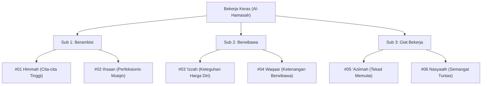

# Bakat Bekerja Keras (الحَمَاسَة - Al-Hamasah)

> [!quote] Dalil & Rujukan Nabawiyah Utama
> **Naskah:**  
> « إِنَّ اللَّهَ يُحِبُّ إِذَا عَمِلَ أَحَدُكُمْ عَمَلًا أَنْ يُتْقِنَهُ »
>
> *"Sesungguhnya Allah menyukai jika salah seorang di antara kalian melakukan suatu pekerjaan, ia mengerjakannya dengan tekun, teliti, dan berkualitas tinggi (itqan)."*
>
> 📚 **Sumber Rujukan OpenBayan:** HR. Al-Baihaqi (Syu'abul Iman No. 4930), dishahihkan oleh Syaikh Al-Albani dalam *Silsilah Ash-Shahihah* No. 1113; Syarah Riyadush Shalihin (Juz 5 Hal. 12).  
> 💡 **Relevansi PKN:** Bakat Bekerja Keras (*Al-Hamasah*) adalah motor penggerak fisik yang merealisasikan cita-cita iman menjadi amal nyata (*amal shalih*). Tanpa daya tahan kerja keras, gagasan besar peradaban hanya akan berhenti pada angan-angan kosong.

---

## 1. Hakikat & Kedudukan Konseptual dalam Arsitektur PKN

Dalam taksonomi Pendidikan Karakter Nabawiyah (PKN), **Bekerja Keras** merupakan persilangan antara **Kutub Introvert** (dorongan energi yang bersumber dari konsentrasi internal mandiri) dan **Dimensi Karsa / Jasad** (*Al-Hawa* yang telah ditundukkan oleh syariat pada jiwa ammarah). 

Anak dengan bakat dominan Bekerja Keras dicirikan oleh:
* **Grit & Stamina Fisik:** Memiliki ketahanan tinggi terhadap keletihan jasmani, mampu fokus berjam-jam menyelesaikan tantangan praktis.
* **Orientasi Ketuntasan (*Closure*):** Merasa sangat terganggu bila melihat pekerjaan terbengkalai setengah jalan; kepuasan batinnya tercapai ketika proyek selesai dengan kokoh.
* **Bukan Sekadar Otot:** Kerja keras dalam Islam bukanlah perbudakan fisik tanpa arah, melainkan **Al-Mujahadah**—pencurahan segenap potensi fisik dan mental untuk menegakkan kalimat Allah dan memberi manfaat luas bagi sesama.

---

## 2. Enam Turunan Pilar Karakter TB40 & Inspirasi Shahabat Nabi ﷺ

Bakat Bekerja Keras membawahi **6 Pilar Karakter Mulia (TB40)** yang terbagi ke dalam 3 sub-kelompok Level 18. Setiap pilar terinspirasi langsung oleh keteladanan para Shahabat Nabi radhiyallahu 'anhum:

### Pilar #01: Himmah (الهِمَّة - Cita-cita Luhur)
* **Sub-Kelompok:** Berambisi (Introvert + Karsa)
* **Definisi Karakter:** Memiliki gairah batin dan cita-cita tertinggi yang melampaui batas kenyamanan duniawi, selalu memandang jauh ke depan.
* **Inspirasi Shahabat Nabi ﷺ:** **Usamah bin Zaid radhiyallahu 'anhu**. Di usia yang belum genap 18 tahun, beliau memiliki *himmah* kepemimpinan yang sangat tinggi hingga dipercaya oleh Rasulullah ﷺ menjadi panglima tertinggi memimpin pasukan yang di dalamnya terdapat Abu Bakar dan Umar untuk menghadapi imperium Romawi.
* **Dalil Otentik OpenBayan:**
  > « فَإِذَا سَأَلْتُمُ اللَّهَ فَاسْأَلُوهُ الْفِرْدَوْسَ، فَإِنَّهُ أَوْسَطُ الْجَنَّةِ، وَأَعْلَى الْجَنَّةِ »  
  > *"Jika kalian memohon kepada Allah, mintalah surga Al-Firdaus, karena sesungguhnya ia adalah surga yang paling utama dan paling tinggi."*  
  > 📚 *(HR. Al-Bukhari No. 2790, Kitab Al-Jihad was-Siyar)*
* **Diagnosis Deviasi:**
  * *Tafrith (Lalai):* **Futuur (الفُتُوْر)** — Lemah kemauan, cepat puas, malas berusaha. *Kuratif:* Dikuatkan dengan pilar *'Aziimah* dan *Nasyaath*.
  * *Ifrath (Berlebih):* **Thuulul Amal (طُوْلُ الأَمَلِ)** — Panjang angan-angan tanpa realisasi realistis. *Kuratif:* Diredam dengan pilar *Qanaa'ah*, *Tawaadhu'*, dan *Hayaa'*.

---

### Pilar #02: Ihsaan (الاِحْسَان - Mutqin & Sempurna)
* **Sub-Kelompok:** Berambisi (Introvert + Karsa)
* **Definisi Karakter:** Dorongan kuat untuk selalu memberikan hasil karya terbaik, tidak rela menghasilkan produk yang cacat atau setengah matang.
* **Inspirasi Shahabat Nabi ﷺ:** **Zaid bin Tsabit radhiyallahu 'anhu**. Beliau menunjukkan standar *ihsaan* dan ketelitian tingkat tinggi saat diamanahi membukukan mushaf Al-Qur'an pada masa Khalifah Abu Bakar dan Utsman; beliau tidak menuliskan satu ayat pun kecuali disaksikan oleh dua saksi hafalan dan tulisan asli.
* **Dalil Otentik OpenBayan:**
  > « إِنَّ اللَّهَ كَتَبَ الْإِحْسَانَ عَلَى كُلِّ شَيْءٍ »  
  > *"Sesungguhnya Allah mewajibkan berbuat ihsan (profesional dan beradab) atas segala sesuatu."*  
  > 📚 *(HR. Muslim No. 1955, Kitab Ash-Shaid wadz-Dzaba'ih)*
* **Diagnosis Deviasi:**
  * *Tafrith (Lalai):* **Isaa'ah (الإِسَاءة)** — Bekerja asal jadi, merusak mutu. *Kuratif:* Dilatih dengan penugasan terukur berbasis *Himmah* dan *'Izzah*.
  * *Ifrath (Berlebih):* **Tabdziir (التَّبْذِيْر)** — Perfeksionisme berlebihan hingga membuang waktu dan biaya demi hal minor. *Kuratif:* Dielingkan dengan *Qanaa'ah* dan *Tawaadhu'*.

---

### Pilar #03: 'Izzah (العِزَّة - Kehormatan Diri Beriman)
* **Sub-Kelompok:** Berwibawa (Introvert + Karsa)
* **Definisi Karakter:** Teguh mempertahankan kemuliaan prinsip tauhid dan integritas pribadi, pantang menghinakan diri di hadapan manusia.
* **Inspirasi Shahabat Nabi ﷺ:** **Umar bin Al-Khattab radhiyallahu 'anhu**. Sosok yang sejak keislamannya memancarkan kemuliaan (*'izzah*) bagi kaum muslimin di Makkah.
* **Dalil Otentik OpenBayan:**
  > « إِنَّا كُنَّا أَذَلَّ قَوْمٍ، فَأَعَزَّنَا اللَّهُ بِالإِسْلاَمِ، فَمَهْمَا نَبْتَغِي الْعِزَّةَ بِغَيْرِ مَا أَعَزَّنَا اللَّهُ بِهِ أَذَلَّنَا اللَّهُ »  
  > *"Dahulu kita adalah kaum yang paling hina, lalu Allah muliakan kita dengan Islam. Maka kapan saja kita mencari kemuliaan dengan selain apa yang Allah muliakan kepada kita, niscaya Allah akan menghinakan kita."*  
  > 📚 *(Atsar Shahih Riwayat Al-Hakim dalam Al-Mustadrak No. 207; Siyar A'lam An-Nubala 1/79)*
* **Diagnosis Deviasi:**
  * *Tafrith (Lalai):* **Dzull (الذُّلّ)** — Jiwa lemah, minder, mudah diintimidasi kebatilan. *Kuratif:* Penguatan tauhid rububiyah dan pilar *Syajaa'ah*.
  * *Ifrath (Berlebih):* **Kibr (الكِبْر)** — Angkuh, menolak kebenaran dan merendahkan manusia. *Kuratif:* Diimbangi dengan pilar *Tawaadhu'* dan *Hayaa'*.

---

### Pilar #04: Waqaar (الوَقَار - Wibawa Ketenangan)
* **Sub-Kelompok:** Berwibawa (Introvert + Karsa)
* **Definisi Karakter:** Memiliki ketenangan sikap yang berbobot, tidak grusa-grusu, sedikit bicara namun mendalam dan berwibawa dalam tindakan.
* **Inspirasi Shahabat Nabi ﷺ:** **Utsman bin Affan radhiyallahu 'anhu**. Beliau adalah pribadi yang sangat tenang, menjaga adab kesantunan tingkat tinggi, namun sangat tangguh dalam mengambil keputusan strategis umat.
* **Dalil Otentik OpenBayan:**
  > « إِذَا أُقِيمَتِ الصَّلَاةُ فَلَا تَأْتُوهَا تَسْعَوْنَ، وَأْتُوهَا تَمْشُونَ وَعَلَيْكُمُ السَّكِينَةُ وَالْوَقَارُ »  
  > *"Jika shalat telah diiqamahkan, janganlah kalian mendatanginya dengan berlari tergesa-gesa. Datangilah dengan berjalan tenang, dan hendaklah kalian menjaga ketenangan batin (sakinah) dan kewibawaan lahiriah (waqaar)."*  
  > 📚 *(HR. Al-Bukhari No. 636 & Muslim No. 602)*
* **Diagnosis Deviasi:**
  * *Tafrith (Lalai):* **Thaysy (الطَّيْش)** — Sikap serampangan, banyak bercanda tidak pada tempatnya, hilang wibawa. *Kuratif:* Latihan adab diam (*Shamt*) dan tafakkur.
  * *Ifrath (Berlebih):* **'Ujb (العُجْب)** — Merasa diri paling suci dan menjaga jarak dingin dari orang lain. *Kuratif:* Pelatihan kehangatan (*Basyaasyah*) dan kerendahhatian (*Tawaadhu'*).

---

### Pilar #05: 'Aziimah (العَزِيمَة - Tekad Memulai)
* **Sub-Kelompok:** Giat Bekerja (Introvert + Karsa)
* **Definisi Karakter:** Tekad membaja untuk segera mengambil inisiatif dan memulai langkah pertama tanpa menunda-nunda pekerjaan (*procrastination*).
* **Inspirasi Shahabat Nabi ﷺ:** **Khalid bin Al-Walid radhiyallahu 'anhu**. Pedang Allah yang tidak pernah ragu mengambil keputusan inisiatif di medan laga saat celah kemenangan terbuka.
* **Dalil Otentik OpenBayan:**
  > « احْرِصْ عَلَى مَا يَنْفَعُكَ، وَاسْتَعِنْ بِاللَّهِ وَلَا تَعْجَزْ »  
  > *"Bersemangatlah terhadap apa saja yang bermanfaat bagimu, mohonlah pertolongan kepada Allah, dan jangan sekali-kali merasa lemah/lemah tekad!"*  
  > 📚 *(HR. Muslim No. 2664, Kitab Al-Qadar)*
* **Diagnosis Deviasi:**
  * *Tafrith (Lalai):* **Kasal (الكَسَل)** — Menunda pekerjaan, ragu melangkah, berat memulai. *Kuratif:* Pemecahan tugas besar menjadi modul kecil dan pendampingan *Bahasa Tangan* terstruktur.
  * *Ifrath (Berlebih):* **Tahawwur (التَّهَوُّر)** — Nekat bertindak tanpa perhitungan syariat dan strategi. *Kuratif:* Wajib musyawarah dan penanaman pilar *Anaah* (kehati-hatian).

---

### Pilar #06: Nasyaath (النَّشَاط - Ketekunan Eksekusi)
* **Sub-Kelompok:** Giat Bekerja (Introvert + Karsa)
* **Definisi Karakter:** Daya tahan kerja fisik yang konsisten, berstamina tinggi dalam menyelesaikan pekerjaan rutin hingga tuntas sempurna.
* **Inspirasi Shahabat Nabi ﷺ:** **Abu Hurairah radhiyallahu 'anhu**. Beliau mengikatkan batu di perutnya menahan lapar demi terus aktif (*nasyaath*) menyertai Rasulullah ﷺ mencatat ribuan hadits tanpa terputus.
* **Dalil Otentik OpenBayan:**
  > « اللَّهُمَّ إِنِّي أَعُوذُ بِكَ مِنَ الْعَجْزِ وَالْكَسَلِ، وَالْجُبْنِ وَالْهَرَمِ »  
  > *"Ya Allah, sesungguhnya aku berlindung kepada-Mu dari kelemahan tekad dan kemalasan fisik, dari rasa takut dan kepikunan."*  
  > 📚 *(HR. Al-Bukhari No. 2823 & Muslim No. 2706)*
* **Diagnosis Deviasi:**
  * *Tafrith (Lalai):* **Khumuul (الخُمُوْل)** — Lesu, pasif, lamban dalam bergerak. *Kuratif:* Olahraga sunnah (memanah, berenang, bela diri) untuk memicu adrenalin gerak.
  * *Ifrath (Berlebih):* **Irhāq (الإِرْهَاق)** — *Workaholic*, memforsir tubuh hingga melanggar hak istirahat, hak keluarga, dan hak ibadah. *Kuratif:* Menegakkan hadits Salman Al-Farisi: *"Sesungguhnya tubuhmu memiliki hak atasmu."*

---

## 3. Rubrik Observasi Bakat untuk Orang Tua & Pendidik (Rukun 3A)

Untuk memastikan apakah seorang anak memiliki benih unggul bakat **Bekerja Keras**, gunakan instrumen observasi **Rukun 3A**:

| Rukun Observasi | Indikator Perilaku Otentik Anak | Catatan Guru / Orang Tua |
| :--- | :--- | :--- |
| **1. Suka (*Interest*)** | Anak secara spontan memilih aktivitas fisik menantang (merakit perkakas, berkebun, membersihkan ruangan, membuat karya pertukangan) tanpa disuruh. | Timbul rasa gembira saat keringat mengalir dan tangan kotor oleh pekerjaan nyata. |
| **2. Bisa (*Ability*)** | Belajar keterampilan motorik dan teknis jauh lebih cepat daripada anak seusianya; memiliki koordinasi mata-tangan dan ketelitian luar biasa. | Mampu menyelesaikan proyek konstruksi mini dengan rapi tanpa cepat menyerah. |
| **3. Bermanfaat (*Utility*)** | Hasil kerjanya memberi solusi nyata bagi rumah tangga atau teman sebaya (membantu memperbaiki barang rusak, merapikan fasilitas umum). | Dorongan tenaganya dialirkan menjadi amal shalih yang meringankan beban orang lain. |

---

## 4. Panduan Pendampingan Berdasarkan 4 Fase Usia Nabawiyah

### A. Fase Thufulah (0–7 Tahun: Raja & Eksplorasi Sensori-Motorik)
* Biarkan anak bebas bermain pasir, lumpur, air, dan balok kayu untuk menumbuhkan kekuatan otot (*gross motor skills*).
* Jangan marahi anak saat bajunya kotor karena bereksplorasi fisik; di sinilah benih *nasyaath* bersemi.
* Sambut bantuan fisiknya (misal membawakan sandal ayah) dengan pelukan hangat dan pujian tulus.

### B. Fase Tamyiz (7–10 Tahun: Pembantu & Adab Ketuntasan)
* Libatkan dalam tugas rumah tangga terstruktur: merapikan tempat tidur, mencuci piring sendiri, menyiram tanaman.
* Ajarkan adab *itqan*: periksa bersama apakah pekerjaan sudah bersih dan rapi sesuai standar.
* Hindari memberi upah uang untuk tugas wajib keluarga; tumbuhkan kebanggaan beramal karena Allah.

### C. Fase Murahaqah (10–15 Tahun: Menteri & Magang Proyek Nyata)
* Berikan proyek teknis mandiri: merakit meja, merawat sepeda/motor, membangun instalasi hidroponik.
* Kenalkan dengan sosok pengrajin atau teknisi Muslim yang memiliki etos *'izzah* dan ketelitian tinggi.
* Jika anak lalai dari tanggung jawab yang disepakati, terapkan konsekuensi logis secara tegas tanpa merendahkan martabatnya.

### D. Fase Syabab (15+ Tahun: Kemitraan & Profesionalisme Mandiri)
* Salurkan bakatnya ke dunia vokasi, industri teknik, rekayasa sipil, atau wirausaha mandiri.
* Tegakkan pemahaman bahwa kerja kerasnya adalah sarana menafkahi keluarga secara halal (*iffah*) dan mendanai dakwah.

---

## 5. Pemetaan Rumpun Profesi & Jurusan Masa Depan

Bakat Bekerja Keras yang terdidik secara islami akan melahirkan insan kamil yang mengisi pos-pos vital peradaban:
* **Profesi:** Insinyur Sipil, Arsitek Lapangan, Kontraktor Proyek, Quality Controller (QC), Mekanik Handal, Ahli Robotika & Mesin, Tim SAR & Logistik Kemanusiaan, Entrepreneur Manufaktur.
* **Rumpun Jurusan:** Teknik Sipil, Teknik Mesin, Teknik Elektro, Agroteknologi, Farmasi Industri, Manajemen Operasional, Desain Produk Industri.

---

## 6. Tautan Konseptual Terkait
* [[Bakat]] — Induk Peta 6 Dimensi Karakter Nabawiyah.
* [[Insan]] — Hakikat Manusia, Ruh, Jasad, dan Jiwa.
* [[Pembelajaran Alamiah]] — Metode Belajar Alami Berbasis Ekosistem Nyata.
* [[Perkembangan]] — Pentahapan Usia dari Thufulah Menuju Mukallaf Mandiri.
