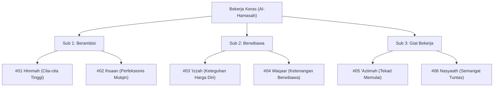

> [!info] Refleksi Lapangan: Gejala Sindrom Anak Rapuh (*Strawberry Generation*)
> **Kondisi Faktual:** Anak zaman sekarang mudah menyerah saat menghadapi kesulitan tugas sekolah, menangis ketika dikritik sedikit oleh guru, dan enggan melakukan pekerjaan fisik yang menguras keringat.  
> **Akar Masalah PKN:** Pola asuh over-protektif (*helicopter parenting*) yang melayani segala kebutuhan anak sejak kecil tanpa pernah melatih otot daya juang (*Al-Jalad*) dan ketahanan menghadapi tekanan (*resilience*).  
> **Langkah Penanganan Nabawiyah:**  
> 1. Hentikan kebiasaan membereskan semua masalah anak; biarkan mereka merasakan konsekuensi logis dari kelalaiannya.  
> 2. Berikan tanggung jawab pekerjaan rumah tangga harian (*al-khidmah*) yang nyata: mencuci piring sendiri, menyapu halaman, atau membuang sampah.  
> 3. Libatkan dalam kegiatan fisik menantang: hiking, berkemah, atau olahraga bela diri.

> [!warning] Peringatan Risiko Pengasuhan: Memberikan Fasilitas Kemewahan Tanpa Keringat
> * **Bentuk Kesalahan:** Membelikan gawai mahal, motor, atau barang mewah hanya sebagai hadiah nilai tanpa mengajarkan anak berjuang mengumpulkan tabungan atau beramal nyata.
> * **Dampak Terhadap Jiwa:** Menumbuhkan mentalitas parasit (*entitled mentality*), malas bekerja, tidak menghargai tetes keringat orang tua, dan rentan depresi saat dewasa menghadapi dunia nyata.
> * **Pencegahan Nabawiyah:** Para nabi semuanya pernah menggembalakan kambing untuk melatih ketahanan mental dan fisik sebelum memikul amanah kenabian. Latihlah anak bekerja keras sejak dini.

> [!tip] Tips Praktis Pengasuhan Hari Ini
> * **Aksi Sederhana:** Saat anak mengeluh lelah mengerjakan tugas atau membantu di rumah, jangan langsung mengambil alih. Tatap matanya dan katakan: *"Ayah tahu ini berat, tapi Ayah percaya otot jiwamu sedang tumbuh semakin kuat sekarang."*
> * **Tujuan:** Menanamkan kebanggaan atas rasa lelah yang halal dan melatih ketangguhan mental (*Al-Hammasah wal-Jalad*).

---
title: "Bekerja Keras"
tags:
  - pkn
  - fitrah_bakat
  - bekerja_keras
  - tb40
  - shahabat
---

# Bakat Bekerja Keras (الحَمَاسَة - Al-Hamasah)

> [!note] Catatan Metodologi & Sumber Penyusunan Dokumen
> Dokumen ini merupakan hasil rangkuman dan rekonstruksi berbantuan kecerdasan buatan (AI) dari berbagai materi presentasi, modul kurikulum, dokumen standar lembaga, dan rekaman kajian **Pendidikan Karakter Nabawiyah (PKN)** yang diampu oleh **Ustadz Abdul Kholiq**.  
> 
> Naskah ini telah melalui verifikasi dan pengayaan ulang dalil-dalil Al-Qur'an dan Hadits shahih dari korpus **OpenBayan** (60 kitab klasik), serta diperkaya dengan sintesis intisari dan masukan berharga dari kawan-kawan **Himmatul Ummah**, **Insan Taqwa / Mustaqbal**, dan **Tim SOTAB HEBAT**.

> [!quote] Dalil & Rujukan Nabawiyah Utama
> **Naskah:**  
> « إِنَّ اللَّهَ يُحِبُّ إِذَا عَمِلَ أَحَدُكُمْ عَمَلًا أَنْ يُتْقِنَهُ »
>
> *"Sesungguhnya Allah menyukai jika salah seorang di antara kalian melakukan suatu pekerjaan, ia mengerjakannya dengan tekun, teliti, dan berkualitas tinggi (itqan)."*
>
> 📚 **Sumber Rujukan OpenBayan:** HR. Al-Baihaqi (Syu'abul Iman No. 4930), dishahihkan oleh Syaikh Al-Albani dalam *Silsilah Ash-Shahihah* No. 1113; Syarah Riyadush Shalihin (Juz 5 Hal. 12).  
> 💡 **Relevansi PKN:** Bakat Bekerja Keras (*Al-Hamasah*) adalah motor penggerak fisik yang merealisasikan cita-cita iman menjadi amal nyata (*amal shalih*). Tanpa daya tahan kerja keras, gagasan besar peradaban hanya akan berhenti pada angan-angan kosong.

---

## 1. Hakikat & Kedudukan Konseptual dalam Arsitektur PKN

*Matriks Silsilah 6 Rumpun Bakat: Introvert (Sirr) vs Extrovert ('Alaniyah)*

Dalam taksonomi Pendidikan Karakter Nabawiyah (PKN), **Bekerja Keras** merupakan persilangan antara **Kutub Introvert** (dorongan energi yang bersumber dari konsentrasi internal mandiri) dan **Dimensi Karsa / Jasad** (*Al-Hawa* yang telah ditundukkan oleh syariat pada jiwa ammarah). 

Anak dengan bakat dominan Bekerja Keras dicirikan oleh:
* **Grit & Stamina Fisik:** Memiliki ketahanan tinggi terhadap keletihan jasmani, mampu fokus berjam-jam menyelesaikan tantangan praktis.
* **Orientasi Ketuntasan (*Closure*):** Merasa sangat terganggu bila melihat pekerjaan terbengkalai setengah jalan; kepuasan batinnya tercapai ketika proyek selesai dengan kokoh.
* **Bukan Sekadar Otot:** Kerja keras dalam Islam bukanlah perbudakan fisik tanpa arah, melainkan **Al-Mujahadah**—pencurahan segenap potensi fisik dan mental untuk menegakkan kalimat Allah dan memberi manfaat luas bagi sesama.

---

## 2. Enam Turunan Pilar Karakter TB40 & Inspirasi Shahabat Nabi ﷺ

Bakat Bekerja Keras membawahi **6 Pilar Karakter Mulia (TB40)** yang terbagi ke dalam 3 sub-kelompok Level 18. Setiap pilar terinspirasi langsung oleh keteladanan para Shahabat Nabi radhiyallahu 'anhum:

### Pilar #01: Himmah (الهِمَّة - Cita-cita Luhur)
* **Sub-Kelompok:** Berambisi (Introvert + Karsa)
* **Definisi Karakter:** Memiliki gairah batin dan cita-cita tertinggi yang melampaui batas kenyamanan duniawi, selalu memandang jauh ke depan.
* **Inspirasi Shahabat Nabi ﷺ:** **Usamah bin Zaid radhiyallahu 'anhu**. Di usia yang belum genap 18 tahun, beliau memiliki *himmah* kepemimpinan yang sangat tinggi hingga dipercaya oleh Rasulullah ﷺ menjadi panglima tertinggi memimpin pasukan yang di dalamnya terdapat Abu Bakar dan Umar untuk menghadapi imperium Romawi.
* **Dalil Otentik OpenBayan:**
  > « فَإِذَا سَأَلْتُمُ اللَّهَ فَاسْأَلُوهُ الْفِرْدَوْسَ، فَإِنَّهُ أَوْسَطُ الْجَنَّةِ، وَأَعْلَى الْجَنَّةِ »  
  > *"Jika kalian memohon kepada Allah, mintalah surga Al-Firdaus, karena sesungguhnya ia adalah surga yang paling utama dan paling tinggi."*  
  > 📚 *(HR. Al-Bukhari No. 2790, Kitab Al-Jihad was-Siyar)*
* **Diagnosis Deviasi:**
  * *Tafrith (Lalai):* **Futuur (الفُتُوْر)** — Lemah kemauan, cepat puas, malas berusaha. *Kuratif:* Dikuatkan dengan pilar *'Aziimah* dan *Nasyaath*.
  * *Ifrath (Berlebih):* **Thuulul Amal (طُوْلُ الأَمَلِ)** — Panjang angan-angan tanpa realisasi realistis. *Kuratif:* Diredam dengan pilar *Qanaa'ah*, *Tawaadhu'*, dan *Hayaa'*.

* **Label Diri (Self-Talk Indikator):** *"Sangat rendah"*
* **Peta Karir Peradaban (Profesi):** 
* **Peta Jurusan Studi & Akademik:** 
* **Preskripsi Terapi Deviasi (Manhaj SKIS):**
  * *Pemulihan Tafrith (Lalai):* 
  * *Penyeimbang Ifrath (Berlebih):* 

---

### Pilar #02: Ihsaan (الاِحْسَان - Mutqin & Sempurna)
* **Sub-Kelompok:** Berambisi (Introvert + Karsa)
* **Definisi Karakter:** Dorongan kuat untuk selalu memberikan hasil karya terbaik, tidak rela menghasilkan produk yang cacat atau setengah matang.
* **Inspirasi Shahabat Nabi ﷺ:** **Zaid bin Tsabit radhiyallahu 'anhu**. Beliau menunjukkan standar *ihsaan* dan ketelitian tingkat tinggi saat diamanahi membukukan mushaf Al-Qur'an pada masa Khalifah Abu Bakar dan Utsman; beliau tidak menuliskan satu ayat pun kecuali disaksikan oleh dua saksi hafalan dan tulisan asli.
* **Dalil Otentik OpenBayan:**
  > « إِنَّ اللَّهَ كَتَبَ الْإِحْسَانَ عَلَى كُلِّ شَيْءٍ »  
  > *"Sesungguhnya Allah mewajibkan berbuat ihsan (profesional dan beradab) atas segala sesuatu."*  
  > 📚 *(HR. Muslim No. 1955, Kitab Ash-Shaid wadz-Dzaba'ih)*
* **Diagnosis Deviasi:**
  * *Tafrith (Lalai):* **Isaa'ah (الإِسَاءة)** — Bekerja asal jadi, merusak mutu. *Kuratif:* Dilatih dengan penugasan terukur berbasis *Himmah* dan *'Izzah*.
  * *Ifrath (Berlebih):* **Tabdziir (التَّبْذِيْر)** — Perfeksionisme berlebihan hingga membuang waktu dan biaya demi hal minor. *Kuratif:* Dielingkan dengan *Qanaa'ah* dan *Tawaadhu'*.

* **Label Diri (Self-Talk Indikator):** *"sangat tinggi"*
* **Peta Karir Peradaban (Profesi):** 
* **Peta Jurusan Studi & Akademik:** 
* **Preskripsi Terapi Deviasi (Manhaj SKIS):**
  * *Pemulihan Tafrith (Lalai):* 
  * *Penyeimbang Ifrath (Berlebih):* 

---

### Pilar #03: 'Izzah (العِزَّة - Kehormatan Diri Beriman)
* **Sub-Kelompok:** Berwibawa (Introvert + Karsa)
* **Definisi Karakter:** Teguh mempertahankan kemuliaan prinsip tauhid dan integritas pribadi, pantang menghinakan diri di hadapan manusia.
* **Inspirasi Shahabat Nabi ﷺ:** **Umar bin Al-Khattab radhiyallahu 'anhu**. Sosok yang sejak keislamannya memancarkan kemuliaan (*'izzah*) bagi kaum muslimin di Makkah.
* **Dalil Otentik OpenBayan:**
  > « إِنَّا كُنَّا أَذَلَّ قَوْمٍ، فَأَعَزَّنَا اللَّهُ بِالإِسْلاَمِ، فَمَهْمَا نَبْتَغِي الْعِزَّةَ بِغَيْرِ مَا أَعَزَّنَا اللَّهُ بِهِ أَذَلَّنَا اللَّهُ »  
  > *"Dahulu kita adalah kaum yang paling hina, lalu Allah muliakan kita dengan Islam. Maka kapan saja kita mencari kemuliaan dengan selain apa yang Allah muliakan kepada kita, niscaya Allah akan menghinakan kita."*  
  > 📚 *(Atsar Shahih Riwayat Al-Hakim dalam Al-Mustadrak No. 207; Siyar A'lam An-Nubala 1/79)*
* **Diagnosis Deviasi:**
  * *Tafrith (Lalai):* **Dzull (الذُّلّ)** — Jiwa lemah, minder, mudah diintimidasi kebatilan. *Kuratif:* Penguatan tauhid rububiyah dan pilar *Syajaa'ah*.
  * *Ifrath (Berlebih):* **Kibr (الكِبْر)** — Angkuh, menolak kebenaran dan merendahkan manusia. *Kuratif:* Diimbangi dengan pilar *Tawaadhu'* dan *Hayaa'*.

---

### Pilar #04: Waqaar (الوَقَار - Wibawa Ketenangan)
* **Sub-Kelompok:** Berwibawa (Introvert + Karsa)
* **Definisi Karakter:** Memiliki ketenangan sikap yang berbobot, tidak grusa-grusu, sedikit bicara namun mendalam dan berwibawa dalam tindakan.
* **Inspirasi Shahabat Nabi ﷺ:** **Utsman bin Affan radhiyallahu 'anhu**. Beliau adalah pribadi yang sangat tenang, menjaga adab kesantunan tingkat tinggi, namun sangat tangguh dalam mengambil keputusan strategis umat.
* **Dalil Otentik OpenBayan:**
  > « إِذَا أُقِيمَتِ الصَّلَاةُ فَلَا تَأْتُوهَا تَسْعَوْنَ، وَأْتُوهَا تَمْشُونَ وَعَلَيْكُمُ السَّكِينَةُ وَالْوَقَارُ »  
  > *"Jika shalat telah diiqamahkan, janganlah kalian mendatanginya dengan berlari tergesa-gesa. Datangilah dengan berjalan tenang, dan hendaklah kalian menjaga ketenangan batin (sakinah) dan kewibawaan lahiriah (waqaar)."*  
  > 📚 *(HR. Al-Bukhari No. 636 & Muslim No. 602)*
* **Diagnosis Deviasi:**
  * *Tafrith (Lalai):* **Thaysy (الطَّيْش)** — Sikap serampangan, banyak bercanda tidak pada tempatnya, hilang wibawa. *Kuratif:* Latihan adab diam (*Shamt*) dan tafakkur.
  * *Ifrath (Berlebih):* **'Ujb (العُجْب)** — Merasa diri paling suci dan menjaga jarak dingin dari orang lain. *Kuratif:* Pelatihan kehangatan (*Basyaasyah*) dan kerendahhatian (*Tawaadhu'*).

---

### Pilar #05: 'Aziimah (العَزِيمَة - Tekad Memulai)
* **Sub-Kelompok:** Giat Bekerja (Introvert + Karsa)
* **Definisi Karakter:** Tekad membaja untuk segera mengambil inisiatif dan memulai langkah pertama tanpa menunda-nunda pekerjaan (*procrastination*).
* **Inspirasi Shahabat Nabi ﷺ:** **Khalid bin Al-Walid radhiyallahu 'anhu**. Pedang Allah yang tidak pernah ragu mengambil keputusan inisiatif di medan laga saat celah kemenangan terbuka.
* **Dalil Otentik OpenBayan:**
  > « احْرِصْ عَلَى مَا يَنْفَعُكَ، وَاسْتَعِنْ بِاللَّهِ وَلَا تَعْجَزْ »  
  > *"Bersemangatlah terhadap apa saja yang bermanfaat bagimu, mohonlah pertolongan kepada Allah, dan jangan sekali-kali merasa lemah/lemah tekad!"*  
  > 📚 *(HR. Muslim No. 2664, Kitab Al-Qadar)*
* **Diagnosis Deviasi:**
  * *Tafrith (Lalai):* **Kasal (الكَسَل)** — Menunda pekerjaan, ragu melangkah, berat memulai. *Kuratif:* Pemecahan tugas besar menjadi modul kecil dan pendampingan *Bahasa Tangan* terstruktur.
  * *Ifrath (Berlebih):* **Tahawwur (التَّهَوُّر)** — Nekat bertindak tanpa perhitungan syariat dan strategi. *Kuratif:* Wajib musyawarah dan penanaman pilar *Anaah* (kehati-hatian).

---

### Pilar #06: Nasyaath (النَّشَاط - Ketekunan Eksekusi)
* **Sub-Kelompok:** Giat Bekerja (Introvert + Karsa)
* **Definisi Karakter:** Daya tahan kerja fisik yang konsisten, berstamina tinggi dalam menyelesaikan pekerjaan rutin hingga tuntas sempurna.
* **Inspirasi Shahabat Nabi ﷺ:** **Abu Hurairah radhiyallahu 'anhu**. Beliau mengikatkan batu di perutnya menahan lapar demi terus aktif (*nasyaath*) menyertai Rasulullah ﷺ mencatat ribuan hadits tanpa terputus.
* **Dalil Otentik OpenBayan:**
  > « اللَّهُمَّ إِنِّي أَعُوذُ بِكَ مِنَ الْعَجْزِ وَالْكَسَلِ، وَالْجُبْنِ وَالْهَرَمِ »  
  > *"Ya Allah, sesungguhnya aku berlindung kepada-Mu dari kelemahan tekad dan kemalasan fisik, dari rasa takut dan kepikunan."*  
  > 📚 *(HR. Al-Bukhari No. 2823 & Muslim No. 2706)*
* **Diagnosis Deviasi:**
  * *Tafrith (Lalai):* **Khumuul (الخُمُوْل)** — Lesu, pasif, lamban dalam bergerak. *Kuratif:* Olahraga sunnah (memanah, berenang, bela diri) untuk memicu adrenalin gerak.
  * *Ifrath (Berlebih):* **Irhāq (الإِرْهَاق)** — *Workaholic*, memforsir tubuh hingga melanggar hak istirahat, hak keluarga, dan hak ibadah. *Kuratif:* Menegakkan hadits Salman Al-Farisi: *"Sesungguhnya tubuhmu memiliki hak atasmu."*

---

---

## 💼 Matriks Panduan Karir Peradaban & Jurusan Studi

Berdasarkan rumusan instrumen asesmen **Tafsir Bakat TB-40 (Manhaj SKIS Semarang)**, berikut adalah panduan praktis penjurusan studi dan orientasi profesi peradaban untuk setiap pilar:

| No | Pilar Karakter | Bahasa Arab | Karakter Inti | Rekomendasi Profesi Peradaban | Rekomendasi Jurusan Studi / Vokasi |
|---|---|:---:|---|---|---|
| 1 | **Himmah** | الهِمَّة | Memiliki rasa ingin tahu dan gairah tinggi meraih cita-cita tertinggi peradaban | Tim Litbang/Perumus Visi, Entrepreneur Visioner, Perencana Jangka Panjang, Inovator | Manajemen Strategis, Teknik Industri, Hubungan Internasional, Sains Terapan |
| 2 | **Ihsaan** | الاِحْسَان | Bekerja dengan mutu terbaik (*itqan*), teliti, tuntas, dan berorientasi kesempurnaan | Quality Assurance (QA/QC), Arsitek Perancang, Kurator Presisi, Spesialis Kalibrasi | Arsitektur, Teknik Mesin Presisi, Desain Grafis/Industri, Akuntansi Forensik |
| 3 | **'Izzah** | العِزَّة | Menjaga kehormatan diri sebagai mukmin, pantang meminta-minta dan tunduk pada kezaliman | Pengusaha Mandiri, Manajer Negosiasi Kontrak, Petugas Perlindungan Hak, Diplomat | Ilmu Hukum, Ekonomi Bisnis, Hubungan Internasional, Ketahanan Nasional |
| 4 | **Waqaar** | الوَقَار | Ketenangan berwibawa, tidak banyak bicara tapi disegani, tangguh dalam tekanan | Konsultan Senior, Pendidik Karakter, Trainer Kepemimpinan, Tim Manajemen Krisis | Manajemen SDM, Psikologi Kepemimpinan, Teknik Sipil, Ilmu Pendidikan |
| 5 | **'Aziimah** | العَزِيمَة | Tekad membaja yang tak tergoyahkan oleh rintangan, pantang mundur sebelum tuntas | Komandan Lapangan, Eksekutor Proyek Sulit, Peneliti Riset Ekstrem, Perintis Usaha | Teknik Sipil/Kelautan, Ekspedisi Geologi, Manajemen Proyek, Akademi Militer |
| 6 | **Nasyaath** | النَّشَاط | Stamina fisik tinggi, selalu bersemangat menyelesaikan pekerjaan lapangan hingga tuntas | Kontraktor Lapangan, Teknisi Mesin/Listrik, Relawan SAR Bencana, Pemadam Kebakaran | Teknik Mesin, Teknik Elektro, Keperawatan Gawat Darurat, Pendidikan Olahraga |

---

## 3. Rubrik Observasi Bakat untuk Orang Tua & Pendidik (Rukun 3A)

Untuk memastikan apakah seorang anak memiliki benih unggul bakat **Bekerja Keras**, gunakan instrumen observasi **Rukun 3A**:

| Rukun Observasi | Indikator Perilaku Otentik Anak | Catatan Guru / Orang Tua |
| :--- | :--- | :--- |
| **1. Suka (*Interest*)** | Anak secara spontan memilih aktivitas fisik menantang (merakit perkakas, berkebun, membersihkan ruangan, membuat karya pertukangan) tanpa disuruh. | Timbul rasa gembira saat keringat mengalir dan tangan kotor oleh pekerjaan nyata. |
| **2. Bisa (*Ability*)** | Belajar keterampilan motorik dan teknis jauh lebih cepat daripada anak seusianya; memiliki koordinasi mata-tangan dan ketelitian luar biasa. | Mampu menyelesaikan proyek konstruksi mini dengan rapi tanpa cepat menyerah. |
| **3. Bermanfaat (*Utility*)** | Hasil kerjanya memberi solusi nyata bagi rumah tangga atau teman sebaya (membantu memperbaiki barang rusak, merapikan fasilitas umum). | Dorongan tenaganya dialirkan menjadi amal shalih yang meringankan beban orang lain. |

---

## 4. Panduan Pendampingan Berdasarkan 4 Fase Usia Nabawiyah

### A. Fase Thufulah (0–7 Tahun: Raja & Eksplorasi Sensori-Motorik)
* Biarkan anak bebas bermain pasir, lumpur, air, dan balok kayu untuk menumbuhkan kekuatan otot (*gross motor skills*).
* Jangan marahi anak saat bajunya kotor karena bereksplorasi fisik; di sinilah benih *nasyaath* bersemi.
* Sambut bantuan fisiknya (misal membawakan sandal ayah) dengan pelukan hangat dan pujian tulus.

### B. Fase Tamyiz (7–10 Tahun: Pembantu & Adab Ketuntasan)
* Libatkan dalam tugas rumah tangga terstruktur: merapikan tempat tidur, mencuci piring sendiri, menyiram tanaman.
* Ajarkan adab *itqan*: periksa bersama apakah pekerjaan sudah bersih dan rapi sesuai standar.
* Hindari memberi upah uang untuk tugas wajib keluarga; tumbuhkan kebanggaan beramal karena Allah.

### C. Fase Murahaqah (10–15 Tahun: Menteri & Magang Proyek Nyata)
* Berikan proyek teknis mandiri: merakit meja, merawat sepeda/motor, membangun instalasi hidroponik.
* Kenalkan dengan sosok pengrajin atau teknisi Muslim yang memiliki etos *'izzah* dan ketelitian tinggi.
* Jika anak lalai dari tanggung jawab yang disepakati, terapkan konsekuensi logis secara tegas tanpa merendahkan martabatnya.

### D. Fase Syabab (15+ Tahun: Kemitraan & Profesionalisme Mandiri)
* Salurkan bakatnya ke dunia vokasi, industri teknik, rekayasa sipil, atau wirausaha mandiri.
* Tegakkan pemahaman bahwa kerja kerasnya adalah sarana menafkahi keluarga secara halal (*iffah*) dan mendanai dakwah.

---

## 5. Profil Karakter, Label Diri, & Terapi Deviasi (Manhaj SKIS)

* **Label Diri (Self-Talk Indikator):** *"Aku dikaruniai energi fisik dan tekad membaja untuk bekerja keras menuntaskan amanah dengan standar ihsan tertinggi, menjaga harga diri mukmin, dan menyumbangkan keringat demi kejayaan peradaban Islam."*
* **Peta Karir Peradaban (Profesi):** Insinyur Sipil, Arsitek Lapangan, Kontraktor Proyek, Quality Controller (QC), Mekanik Handal, Ahli Robotika & Mesin, Tim SAR & Logistik Kemanusiaan, Entrepreneur Manufaktur.
* **Peta Jurusan Studi & Akademik:** Teknik Sipil, Teknik Mesin, Teknik Elektro, Agroteknologi, Farmasi Industri, Manajemen Operasional, Desain Produk Industri.
* **Preskripsi Terapi Deviasi (Manhaj SKIS):**
  * *Pemulihan Tafrith (Lalai / Kemalasan & Lesu - Kasal & Khumuul):* Kuatkan pilar *Himmah* dan *Nasyaath*. Biasakan bangun pagi sebelum subuh, olahraga fisik sunnah (memanah, berenang, beladiri), dan beri target kerja harian terukur yang wajib diselesaikan.
  * *Penyeimbang Ifrath (Berlebih / Workaholic & Melampaui Batas Tubuh - Irhaaq):* Kunci dengan pilar *Hikmah*, *Qanaa'ah*, dan *Rahmah*. Tanamkan nasehat agung Salman Al-Farisi: *"Sesungguhnya Rabbmu memiliki hak atasmu, jiwamu memiliki hak atasmu, dan keluargamu memiliki hak atasmu, maka berikanlah setiap yang memiliki hak haknya masing-masing."*

---

## 🏛️ Keteladanan Ashabus Rasul: Archetype Rumpun Bekerja Keras & Pola Asuh Nabawi

Berdasarkan kajian kitab *Ashabur Rasul SAW* karya Syaikh Mahmud Al-Mishri (Juz 2) dan korpus sirah OpenBayan, rumpun Bekerja Keras tercermin dengan sangat perkasa pada para sahabat berikut:

### 1. Salamah bin Al-Akwa' radhiyallahu 'anhu: Ketahanan Fisik Pejalan Kaki Nomor Satu (*Khairu Rajjālatinā*)
* **Manifestasi Bakat:** Memiliki kecepatan lari dan ketahanan fisik (*Nasyaath*) yang melampaui kuda. Pada peristiwa Ghazwah Dzi Qarad, ketika sekelompok musuh merampas unta-unta Rasulullah ﷺ, Salamah mengejar mereka sendirian dengan berjalan kaki, memanah musuh sambil melompat dari bukit ke bukit, hingga merebut kembali seluruh unta rampasan.
* **Pengakuan Nabawi:** Rasulullah ﷺ bersabda: *"Sebaik-baik prajurit berkuda kita hari ini adalah Abu Qatadah, dan sebaik-baik prajurit pejalan kaki kita adalah Salamah!"* (HR. Muslim No. 1807).
* **Pelajaran untuk Guru/Orang Tua:** Anak yang hiperaktif, tidak bisa diam, dan gemar berlari-lari menyimpan potensi kinestetik ksatria. Salurkan staminanya ke olahraga bela diri, atletik, atau proyek fisik yang bermartabat.

### 2. Abu Qatadah Al-Anshari radhiyallahu 'anhu: Penunggang Kuda Terbaik Kaum Muslimin (*Khairu Fursāninā*)
* **Manifestasi Bakat:** Ksatria berkuda andalan Rasulullah ﷺ yang dijuluki *Farisur Rasul* (hlm. 497 *Ashabur Rasul*). Beliau memiliki koordinasi gerak fisik (*Gross & Fine Motor*) dan reflek tempur yang luar biasa tangguh.
* **Pelajaran untuk Guru/Orang Tua:** Keterampilan fisik tingkat tinggi membutuhkan kedisiplinan latihan berulang sejak usia Tamyiz agar menjadi refleks yang terlatih.

### 3. Al-Bara' bin Malik radhiyallahu 'anhu: Daya Dobrak Ksatria Tak Kenal Mundur ('Aziimah)
* **Manifestasi Bakat:** Saudara kandung Anas bin Malik ini memiliki tekad membaja (*'Aziimah*) dan keberanian fisik tanpa batas (hlm. 182 *Ashabur Rasul*). Pada Perang Yamamah, ketika kaum muslimin tertahan di depan gerbang benteng Musailamah Al-Kadzdzab, Al-Bara' meminta tubuhnya dilemparkan ke dalam benteng menggunakan pelontar demi membuka gerbang dari dalam sendirian. Beliau terluka di lebih dari delapan puluh titik namun tetap bertahan hidup.
* **Pelajaran untuk Guru/Orang Tua:** Ketangguhan fisik yang disinari iman melahirkan ketabahan luar biasa yang tidak pernah gentar menghadapi rintangan hidup seberat apa pun.

### 4. Khabbaab bin Al-Aratt radhiyallahu 'anhu: Ketabahan 'Aziimah Menghadapi Tekanan Berat
* **Manifestasi Bakat:** Pandai besi pertama di Makkah yang disiksa dengan punggung ditempelkan di atas bara api menyala hingga lemak tubuhnya memadamkan api tersebut. Ia tidak pernah mengucapkan sepatah kata kekufuran pun.
* **Pelajaran untuk Guru/Orang Tua:** Pekerja keras muslim bukan hanya kuat ototnya, tetapi memiliki tekad tauhid yang tahan uji dalam situasi paling terjepit sekalipun.

---

## 6. Tautan Konseptual Terkait
* [[Bakat]] — Induk Peta 6 Dimensi Karakter Nabawiyah dan Matriks Sahabat.
* [[Insan]] — Hakikat Manusia, Ruh, Jasad, dan Jiwa.
* [[Pembelajaran Alamiah]] — Metode Belajar Alami Berbasis Ekosistem Nyata.
* [[Perkembangan]] — Pentahapan Usia dari Thufulah Menuju Mukallaf Mandiri.
* [[Panduan Asesmen dan Observasi TB40]] — Instrumen Diagnostik 40 Karakter.

---

---

## Diagnosis Penyimpangan: Tafrith vs Ifrath dalam Rumpun Bekerja Keras

| Dimensi Daya Juang | Gejala Sikap yang Teramati | Dampak Psikospiritual pada Anak |
| :--- | :--- | :--- |
| **Tafrith (Manja / Lembek / Menyerah)** | Menghindari pekerjaan sulit, gampang merajuk, menuntut fasilitas instan, dan tidak memiliki daya tahan banting. | Menjadi beban keluarga dan masyarakat, tidak mampu bersaing, serta mudah mengalami krisis mental saat menghadapi ujian hidup. |
| **Ifrath (Workaholic Buta / Eksploitasi Diri)** | Bekerja membabi buta tanpa istirahat, mengorbankan waktu shalat dan hak tubuh, serta menilai kehormatan diri hanya dari akumulasi materi. | Tubuh mengalami kelelahan kronis (*burnout*), hati mengeras, mengabaikan keluarga, dan rawan terjangkit penyakit kesombongan (*ujub*). |
| **Al-Wasathiyah (Etos Kerja Mujahid Nabawi)** | Bekerja keras dengan penuh ketekunan (*itqan*), berniat ikhlas mencari nafkah halal, seraya menunaikan hak ibadah dan istirahat secara proporsional. | Tumbuh insan pejuang yang mandiri, produktif, tangan di atas (*al-yadul 'ulya*), dan seluruh keringatnya bernilai pahala jihad. |

---

## Studi Kasus Nyata & Solusi Kuratif Tadarruj

### Skenario Permasalahan
> **Kasus:** Daffa (15 tahun, fase Syabab) menghabiskan waktu 8–10 jam sehari bermain game online di kamarnya. Ketika diminta orang tuanya membantu mengangkat galon air atau membersihkan mobil, Daffa mengunci pintu dan membentak ibunya: *"Itu tugas pembantu, bukan tugasku!"*.

### Tahapan Solusi Kuratif Langkah-demi-Langkah (Manhaj Tadarruj)
1. **Fase 1: Penegasan Batas Tegas & Pemutusan Fasilitas (Hari 1–3)**  
   Ayah mengambil alih komando (*Bahasa Tangan*). Wifi rumah dimatikan di jam kerja harian. Ayah berbicara empat mata dengan suara rendah tapi sangat tegas: *"Di rumah ini tidak ada tempat bagi pemalas yang tidak menghormati ibunya. Mulai hari ini fasilitas gawai disesuaikan dengan kontribusi amalmu."*
2. **Fase 2: Pemulihan Jembatan Hormat (*Bahasa Hati*) (Hari 4–7)**  
   Ayah mengajak Daffa lari pagi berdua. Setelah lelah berolahraga, ayah membelikan sarapan sederhana di pinggir jalan dan menceritakan bagaimana perjuangan kakek dahulu bekerja membanting tulang demi menyekolahkan ayah. Menumbuhkan rasa malu nurani pada jiwa Lawwamah Daffa.
3. **Fase 3: Kontrak Tanggung Jawab Nyata (*Bahasa Lisan*) (Pekan 2)**  
   Daffa diberikan pilihan 3 pos amanah harian di rumah: (a) membersihkan seluruh teras dan kendaraan, (b) mengurus kebun belakang, atau (c) belanja kebutuhan pasar bersama ayah tiap subuh. Daffa memilih pos belanja dan kendaraan.
4. **Fase 4: Mentorship Kerja Lapangan (*Magang Peradaban*) (Bulan 1 dst)**  
   Saat liburan sekolah, Daffa dimagangkan di bengkel motor milik kerabat selama 2 pekan. Merasakan sendiri beratnya mencari uang halal Rp 50.000 sehari. Sikap Daffa berubah drastis menjadi santun, hemat, dan ringan tangan membantu keluarga.

---

<!-- START_OFFICE_PPTX_EMBED -->

---

### 📽️ Media Presentasi & Slide Interaktif (Office Web Apps)

> [!info] Pratinjau Interaktif Microsoft Office
> Anda dapat menavigasi slide secara langsung melalui penampil di bawah ini, atau membuka layar penuh dan mengunduh berkas aslinya.

  <h4 style="margin-bottom: 0.5rem; display: flex; align-items: center; gap: 0.5rem;">📊 Pratinjau Materi Presentasi: 1. 40 Pilar Karakter diurai dalam Kurikulum</h4>
  

    <iframe 
      src="https://view.officeapps.live.com/op/embed.aspx?src=https%3A%2F%2Fwikipkn.insanmustaqbal.or.id%2Fpresentations%2F16-40-pilar-karakter-kurikulum.pptx" 
      style="position: absolute; top:0; left: 0; width: 100%; height: 100%; border: 0;" 
      frameborder="0" 
      allowfullscreen="true"
      title="1. 40 Pilar Karakter diurai dalam Kurikulum">
    </iframe>
  

  

    <a href="https://wikipkn.insanmustaqbal.or.id/presentations/16-40-pilar-karakter-kurikulum.pptx" download style="display: inline-flex; align-items: center; gap: 0.35rem; padding: 0.4rem 0.8rem; background: var(--light); border: 1px solid var(--lightgray); border-radius: 6px; text-decoration: none; color: var(--dark); font-weight: 500;">📥 Unduh Slide PPTX (8.91 MB)</a>
    <a href="https://view.officeapps.live.com/op/view.aspx?src=https%3A%2F%2Fwikipkn.insanmustaqbal.or.id%2Fpresentations%2F16-40-pilar-karakter-kurikulum.pptx" target="_blank" rel="noopener" style="display: inline-flex; align-items: center; gap: 0.35rem; padding: 0.4rem 0.8rem; background: var(--light); border: 1px solid var(--lightgray); border-radius: 6px; text-decoration: none; color: var(--dark); font-weight: 500;">🖥️ Buka Layar Penuh (Office Online)</a>
    <a href="https://1drv.ms/f/c/3efe4d3cd3a3788a/IgDcc7tk4xrzRLl5cAMnNZRfAZnQHlpC2x6T2PpXeL_jTzg" target="_blank" rel="noopener" style="display: inline-flex; align-items: center; gap: 0.35rem; padding: 0.4rem 0.8rem; background: var(--light); border: 1px solid var(--lightgray); border-radius: 6px; text-decoration: none; color: var(--dark); font-weight: 500;">☁️ Folder OneDrive Resmi</a>
  

<!-- END_OFFICE_PPTX_EMBED -->

> [!quote] Dokumen & Slide Presentasi Rujukan Resmi PKN
> Pembahasan dalam artikel ini bersumber langsung dari materi tayang pelatihan dan dokumen kurikulum resmi PKN oleh **Ustadz Abdul Kholiq**:
>
> - **Materi:** *BAKAT - TB - 40 (Tafsir Bakat 40 Karakter Nabawiyah)*
>   - 📖 **Rujukan Slide:** Slide Hal. 20–85 (Konsep Al-Mauhibah, Silsilah 6 Rumpun Bakat, 18 Sub-Kelompok, & Taksonomi 40 Sifat)
>   - 🔗 **Akses Berkas:** [📥 Unduh PDF (11.2 MB)](https://www.dropbox.com/scl/fi/ws2rfs4dlnhiv4zfzg4bg/2.-BAKAT-TB-40.pdf?rlkey=tw82umdj2dljhrc1h4fb0gtgt&dl=1) • [📊 Unduh PPTX Asli (8.0 MB)](https://www.dropbox.com/scl/fi/9xroycr8405dd7a0bwpi0/2.-BAKAT-TB-40.pptx?rlkey=1du37yttvbovjte96quzez1b7&dl=1) • [👁️ Buka di Dropbox](https://www.dropbox.com/scl/fi/ws2rfs4dlnhiv4zfzg4bg/2.-BAKAT-TB-40.pdf?rlkey=tw82umdj2dljhrc1h4fb0gtgt&dl=0)
>
> - **Materi:** *Materi Seminar 2: Kupas Tuntas Tafsir Bakat TB-40*
>   - 📖 **Rujukan Slide:** Slide Hal. 30–120 (Formula Asesmen, Analisis Tafrith vs Ifrath, Rukun 3A, dan Pemetaan Karir Peradaban)
>   - 🔗 **Akses Berkas:** [📥 Unduh PDF (24.6 MB)](https://www.dropbox.com/scl/fi/of5hkad2jl8evdbx86o2y/Materi-Seminar-2_-Tafsir-Bakat-TB-40.pdf?rlkey=m1qcgt0bmcwsjsmtvuw58m3q0&dl=1) • [👁️ Buka di Dropbox](https://www.dropbox.com/scl/fi/of5hkad2jl8evdbx86o2y/Materi-Seminar-2_-Tafsir-Bakat-TB-40.pdf?rlkey=m1qcgt0bmcwsjsmtvuw58m3q0&dl=0)
>
> - **Materi:** *1. 40 PILAR KARAKTER diurai dalam KURIKULUM*
>   - 📖 **Rujukan Slide:** Slide Hal. 12–48 (Operasionalisasi Bakat ke dalam RPP & Pembelajaran Berbasis Proyek Siswa)
>   - 🔗 **Akses Berkas:** [📥 Unduh PDF (7.9 MB)](https://www.dropbox.com/scl/fi/64vqc29u401ei6qhemuru/1.-40-PILAR-KARAKTER-diurai-dalam-KURIKULUM.pdf?rlkey=absjy37qzld7hq6ross1pryzm&dl=1) • [📊 Unduh PPTX Asli (8.8 MB)](https://www.dropbox.com/scl/fi/r8imh9ciuosapo7sghuno/1.-40-PILAR-KARAKTER-diurai-dalam-KURIKULUM.pptx?rlkey=yky4b5dptr6v9fzszc4qvxwyd&dl=1) • [👁️ Buka di Dropbox](https://www.dropbox.com/scl/fi/64vqc29u401ei6qhemuru/1.-40-PILAR-KARAKTER-diurai-dalam-KURIKULUM.pdf?rlkey=absjy37qzld7hq6ross1pryzm&dl=0)
