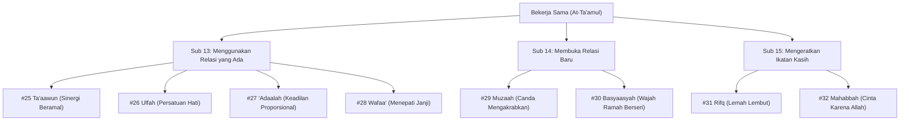

# Bakat Bekerja Sama (التَّعَامُل - At-Ta'amul)

> [!note] Catatan Metodologi & Sumber Penyusunan Dokumen
> Dokumen ini merupakan hasil rangkuman dan rekonstruksi berbantuan kecerdasan buatan (AI) dari berbagai materi presentasi, modul kurikulum, dokumen standar lembaga, dan rekaman kajian **Pendidikan Karakter Nabawiyah (PKN)** yang diampu oleh **Ustadz Abdul Kholiq**.  
> 
> Naskah ini telah melalui verifikasi dan pengayaan ulang dalil-dalil Al-Qur'an dan Hadits shahih dari korpus **OpenBayan** (60 kitab klasik), serta diperkaya dengan sintesis intisari dan masukan berharga dari kawan-kawan **Himmatul Ummah**, **Insan Taqwa / Mustaqbal**, dan **Tim SOTAB HEBAT**.

> [!quote] Dalil & Rujukan Nabawiyah Utama
> **Naskah:**  
> « وَتَعَاوَنُوا عَلَى الْبِرِّ وَالتَّقْوَىٰ ۖ وَلَا تَعَاوَنُوا عَلَى الْإِثْمِ وَالْعُدْوَانِ »
>
> *"Dan tolong-menolonglah kalian dalam (mengerjakan) kebajikan dan takwa, dan jangan tolong-menolong dalam berbuat dosa dan permusuhan."*
>
> 📚 **Sumber Rujukan OpenBayan:** QS. Al-Ma'idah: 2; Tafsir Ibnu Katsir (Juz 3 Hal. 7); Shahih Al-Bukhari No. 481 (Perumpamaan Mukmin Bagaikan Bangunan yang Kokoh).  
> 💡 **Relevansi PKN:** Bakat Bekerja Sama (*At-Ta'amul*) adalah perekat sosial umat (*networking & harmony*) yang menyatukan ragam potensi yang berserak menjadi shaff perjuangan yang kokoh dan harmonis.

---

## 1. Hakikat & Kedudukan Konseptual dalam Arsitektur PKN

Dalam arsitektur Pendidikan Karakter Nabawiyah, **Bakat Bekerja Sama** berakar pada persilangan antara **Kutub Ekstrovert** (terbuka menjalin relasi sosial) dan **Dimensi Cipta / Akal** (*Al-'Aql* pada jiwa lawwamah yang mendambakan harmoni dan keadilan).

Karakteristik dominan anak berbakat Bekerja Sama:
* **Relasional & Supel:** Mudah bergaul dengan orang baru, pandai mencairkan suasana kaku, senang berada dalam kebersamaan kelompok.
* **Anti-Konflik Destruktif & Berorientasi Solusi:** Memiliki radar keadilan (*'adaalah*), menjunjung tinggi sportivitas dan janji (*wafaa'*), serta suka mendamaikan pihak yang berselisih.
* **Bukan Kompromi Murahan:** Sifat kompromi dan kerukunan dalam Islam dibatasi oleh tauhid; tidak boleh berkompromi dalam perkara prinsipil akidah dan keharaman syariat.

---

## 2. Delapan Turunan Pilar Karakter TB40 & Inspirasi Shahabat Nabi ﷺ

Bakat Bekerja Sama membawahi **8 Pilar Karakter Mulia (TB40)** yang terbagi ke dalam 3 sub-kelompok Level 18:

### Pilar #25: Ta'aawun (التَّعَاوُن - Sinergi Kolektif)
* **Sub-Kelompok:** Menggunakan Relasi yang Ada (Ekstrovert + Cipta)
* **Definisi Karakter:** Kemampuan berkolaborasi dan berbagi peran secara sinergis demi mencapai target dakwah bersama.
* **Inspirasi Shahabat Nabi ﷺ:** **Kaum Muhajirin dan Kaum Anshar**. Monumen kolaborasi terbesar sepanjang sejarah saat kaum Anshar menyediakan modal, tanah, dan hunian, sementara kaum Muhajirin menggerakkan keahlian perniagaan dan dakwah di Madinah.
* **Dalil Otentik OpenBayan:**
  > « الْمُؤْمِنُ لِلْمُؤْمِنِ كَالْبُنْيَانِ يَشُدُّ بَعْضُهُ بَعْضًا »  
  > *"Seorang mukmin dengan mukmin lainnya bagaikan satu bangunan yang saling mengokohkan satu sama lain."*  
  > 📚 *(HR. Al-Bukhari No. 481 & Muslim No. 2585)*
* **Diagnosis Deviasi:**
  * *Tafrith (Lalai):* **'Inaad / Ananiyah (الأَنَانِيَّة)** — Individualis, egois, tidak mau berbagi peran. *Kuratif:* Libatkan dalam proyek kelompok yang mensyaratkan ketergantungan antar anggota.
  * *Ifrath (Berlebih):* **Ittikaaliyah (الاتِّكَالِيَّة)** — Ketergantungan kronis, tidak bisa bekerja mandiri. *Kuratif:* Berikan tugas personal yang menuntut pertanggungjawaban individual.

---

### Pilar #26: Ulfah (الاُلْفَة - Mengharmoniskan Hati)
* **Sub-Kelompok:** Menggunakan Relasi yang Ada (Ekstrovert + Cipta)
* **Definisi Karakter:** Kemampuan merangkul ragam latar belakang manusia dan menyatukan frekuensi hati dalam kebersamaan iman.
* **Inspirasi Shahabat Nabi ﷺ:** **Abdullah bin Salam radhiyallahu 'anhu** (pendeta Yahudi yang masuk Islam dan menjadi jembatan perdamaian) & **Abu Musa Al-Asy'ari radhiyallahu 'anhu**.
* **Dalil Otentik OpenBayan:**
  > « الأَرْوَاحُ جُنُودٌ مُجَنَّدَةٌ، فَمَا تَعَارَفَ مِنْهَا ائْتَلَفَ، وَمَا تَنَاكَرَ مِنْهَا اخْتَلَفَ »  
  > *"Ruh-ruh manusia bagaikan pasukan yang berbaris; yang saling mengenal di antaranya akan merasa cocok dan bersatu (i'talafa), sedangkan yang saling asing akan berselisih."*  
  > 📚 *(HR. Al-Bukhari No. 3336 & Muslim No. 2638)*
* **Diagnosis Deviasi:**
  * *Tafrith (Lalai):* **Namiimah / Furqah (الفُرْقَة)** — Gemar memecah belah dan mengelompokkan kawan (*clique*). *Kuratif:* Ingatkan dengan dosa besar adu domba.
  * *Ifrath (Berlebih):* **Talfiiq / Muhaadanah (المُهَادَنَة)** — Menoleransi kemungkaran demi menjaga keharmonisan semu. *Kuratif:* Tegakkan batas amar ma'ruf nahi munkar.

---

### Pilar #27: 'Adaalah (العَدَالَة - Keadilan Proporsional)
* **Sub-Kelompok:** Menggunakan Relasi yang Ada (Ekstrovert + Cipta)
* **Definisi Karakter:** Sikap tegak lurus menempatkan sesuatu pada tempatnya, tidak berat sebelah karena suka atau benci.
* **Inspirasi Shahabat Nabi ﷺ:** **Umar bin Al-Khattab radhiyallahu 'anhu (Al-Faruq)**. Beliau bahkan menegakkan keadilan hukum kepada anak gubernur Mesir (Amr bin Al-Ash) yang memukul rakyat biasa suku Qibthi.
* **Dalil Otentik OpenBayan:**
  > « إِنَّ الْمُقْسِطِينَ عِنْدَ اللَّهِ عَلَى مَنَابِرَ مِنْ نُورٍ عَنْ يَمِينِ الرَّحْمَنِ »  
  > *"Sesungguhnya orang-orang yang berlaku adil di sisi Allah berada di atas mimbar-mimbar cahaya di sebelah kanan Ar-Rahman."*  
  > 📚 *(HR. Muslim No. 1827, Kitab Al-Imarah)*
* **Diagnosis Deviasi:**
  * *Tafrith (Lalai):* **Zhulm / Haif (الظُّلْم)** — Curang, pilih kasih terhadap kawan dekat. *Kuratif:* Latihan menjadi wasit adil dalam permainan anak.
  * *Ifrath (Berlebih):* **Jumuud (الجُمُوْد)** — Kaku secara hukum tanpa mempertimbangkan aspek rahmah dan maslahat. *Kuratif:* Gabungkan dengan pilar *Rifq* dan *Rahmah*.

---

### Pilar #28: Wafaa' (الوَفَاء - Setia Menepati Janji)
* **Sub-Kelompok:** Menggunakan Relasi yang Ada (Ekstrovert + Cipta)
* **Definisi Karakter:** Keteguhan memegang komitmen, kesepakatan, dan sumpah setia walaupun dalam situasi yang merugikan dirinya.
* **Inspirasi Shahabat Nabi ﷺ:** **Hudzaifah bin Al-Yaman dan ayahnya Al-Yaman radhiyallahu 'anhuma**. Ketika ditawan kaum musyrikin menjelang Perang Badar, mereka berjanji tidak akan ikut berperang bersama Nabi ﷺ jika dibebaskan. Rasulullah ﷺ memerintahkan mereka menepati janji tersebut dan tidak mengizinkan mereka ikut Perang Badar!
* **Dalil Otentik OpenBayan:**
  > « نَفِي لَهُمْ بِعَهْدِهِمْ، وَنَسْتَعِينُ اللَّهَ عَلَيْهِمْ »  
  > *"Kita penuhi janji kita kepada mereka, dan kita memohon pertolongan kepada Allah untuk menghadapi mereka!"*  
  > 📚 *(HR. Muslim No. 1787, Kitab Al-Jihad was-Siyar)*
* **Diagnosis Deviasi:**
  * *Tafrith (Lalai):* **Ghadr / Khiyanah (الغَدْر)** — Ingkar janji, khianat kesepakatan. *Kuratif:* Ajarkan bahwa tanda munafik adalah bila berjanji ia ingkar.
  * *Ifrath (Berlebih):* **Wafaa' fil Ma'shiyah (الوَفَاءُ بِالمَعْصِيَة)** — Setia pada ikrar yang melanggar syariat. *Kuratif:* Tegakkan kaidah: *"Tidak ada ketaatan dalam maksiat kepada Khalik."*

---

### Pilar #29: Muzaah (المُزَاح - Canda Mengakrabkan)
* **Sub-Kelompok:** Membuka Relasi Baru (Ekstrovert + Cipta)
* **Definisi Karakter:** Keluwesan mencairkan suasana dengan canda tawa yang mubah, membahagiakan hati kawan tanpa ada unsur dusta dan penghinaan.
* **Inspirasi Shahabat Nabi ﷺ:** **Nu'aiman bin 'Amr radhiyallahu 'anhu**. Sahabat yang gemar melontarkan lelucon cerdas yang membuat Rasulullah ﷺ dan para shahabat tertawa bahagia hingga tampak gigi geraham beliau.
* **Dalil Otentik OpenBayan:**
  > « قَالُوا: يَا رَسُولَ اللَّهِ، إِنَّكَ تُدَاعِبُنَا! قَالَ: إِنِّي لَا أَقُولُ إِلَّا حَقًّا »  
  > *"Para shahabat berkata: Wahai Rasulullah, sesungguhnya engkau mencandai kami! Beliau bersabda: Sesungguhnya aku tidak mengatakan (dalam bercanda) kecuali kebenaran."*  
  > 📚 *(HR. At-Tirmidzi No. 1990, dinyatakan Shahih; Syarah Asy-Syamail Al-Muhammadiyah)*
* **Diagnosis Deviasi:**
  * *Tafrith (Lalai):* **'Ubus / Quhuth (العُبُوْس)** — Wajah selalu cemberut, kaku, menakutkan orang lain. *Kuratif:* Latihan tersenyum dan menyapa ramah.
  * *Ifrath (Berlebih):* **Katsratul Dhahik (كَثْرَةُ الضَّحِكِ)** — Terlalu banyak tertawa terbahak-bahak hingga mematikan kepekaan hati (*qaswatul qalb*). *Kuratif:* Puasa tawa dan dzikrul maut.

---

### Pilar #30: Basyaasyah (البَشَاشَة - Wajah Ceria Ramah)
* **Sub-Kelompok:** Membuka Relasi Baru (Ekstrovert + Cipta)
* **Definisi Karakter:** Kehangatan ekspresi wajah yang selalu berseri-seri dan murah senyum saat menyambut kedatangan orang lain.
* **Inspirasi Shahabat Nabi ﷺ:** **Jarir bin Abdillah Al-Bajali radhiyallahu 'anhu**. Beliau mengisahkan kehangatan interaksinya dengan Rasulullah ﷺ yang senantiasa tersenyum setiap kali memandang wajahnya.
* **Dalil Otentik OpenBayan:**
  > « تَبَسُّمُكَ فِي وَجْهِ أَخِيكَ لَكَ صَدَقَةٌ »  
  > *"Senyum manismu di hadapan saudaramu adalah sedekah bagimu."*  
  > 📚 *(HR. At-Tirmidzi No. 1956, dinyatakan Hasan Gharib; Shahih Ibnu Hibban)*
* **Diagnosis Deviasi:**
  * *Tafrith (Lalai):* **Jafaa' (الجَفَاء)** — Sikap dingin, membuang muka saat berpapasan. *Kuratif:* Budayakan salam, senyum, dan sapa di rumah.
  * *Ifrath (Berlebih):* **Riya' / Tasannu' (التَّصَنُّع)** — Senyum palsu diplomatik untuk menutupi kebusukan niat. *Kuratif:* Luruskan keikhlasan batin lillahi ta'ala.

---

### Pilar #31: Rifq (الرِّفْق - Lemah Lembut Pergaulan)
* **Sub-Kelompok:** Mengeratkan Ikatan Kasih (Ekstrovert + Cipta)
* **Definisi Karakter:** Kelembutan dalam tutur kata dan perbuatan, memilih cara yang paling mudah dan tidak menyulitkan orang lain.
* **Inspirasi Shahabat Nabi ﷺ:** **Anas bin Malik radhiyallahu 'anhu**. Beliau menjadi pelayan Rasulullah ﷺ selama 10 tahun dan menyatakan bahwa Rasulullah ﷺ tidak pernah sekalipun membentaknya atau berkata *"mengapa engkau lakukan ini?"*.
* **Dalil Otentik OpenBayan:**
  > « إِنَّ الرِّفْقَ لَا يَكُونُ فِي شَيْءٍ إِلَّا زَانَهُ، وَلَا يُنْزَعُ مِنْ شَيْءٍ إِلَّا شَانَهُ »  
  > *"Sesungguhnya kelembutan tidaklah berada pada sesuatu melainkan pasti akan menghiasinya (membuatnya indah), dan tidaklah kelembutan dicabut dari sesuatu melainkan pasti akan memperburuknya."*  
  > 📚 *(HR. Muslim No. 2594, Kitab Al-Birr wash-Shilah)*
* **Diagnosis Deviasi:**
  * *Tafrith (Lalai):* **Unf / Ghilzhah (العُنْف)** — Kasar, suka membanting barang, membentak. *Kuratif:* Terapi wudhu saat marah dan larangan berbicara saat emosi tinggi.
  * *Ifrath (Berlebih):* **Dhina' / Huun (الهُوْن)** — Terlalu lembek hingga tidak berani menegur kemungkaran fatal. *Kuratif:* Padukan dengan pilar *Ghairah*.

---

### Pilar #32: Mahabbah (المَحَبَّة - Mempererat Cinta Iman)
* **Sub-Kelompok:** Mengeratkan Ikatan Kasih (Ekstrovert + Cipta)
* **Definisi Karakter:** Kemampuan menumbuhkan dan memelihara ikatan cinta persaudaraan yang murni karena Allah (Ukhuwah Fillah).
* **Inspirasi Shahabat Nabi ﷺ:** **Salman Al-Farisi & Abu Ad-Darda' radhiyallahu 'anhuma** yang dipersaudarakan oleh Nabi ﷺ dan saling menasihati dalam kebaikan dengan penuh cinta.
* **Dalil Otentik OpenBayan:**
  > « لَا يُؤْمِنُ أَحَدُكُمْ حَتَّى يُحِبَّ لِأَخِيهِ مَا يُحِبُّ لِنَفْسِهِ »  
  > *"Tidak sempurna iman salah seorang di antara kalian sampai ia mencintai bagi saudaranya apa yang ia cintai bagi dirinya sendiri."*  
  > 📚 *(HR. Al-Bukhari No. 13 & Muslim No. 45)*
* **Diagnosis Deviasi:**
  * *Tafrith (Lalai):* **Bughdh / Jafwah (البُغْض)** — Hati penuh dendam dan permusuhan. *Kuratif:* Mendoakan kebaikan bagi saudaranya di belakangnya.
  * *Ifrath (Berlebih):* **'Isyq Muharram (العِشْق)** — Keterikatan emosional buta yang menggeser cinta mutlak kepada Allah. *Kuratif:* Kokohkan tauhid mahabbah hanya kepada Allah.

---

---

## 💼 Matriks Panduan Karir Peradaban & Jurusan Studi

Berdasarkan rumusan instrumen asesmen **Tafsir Bakat TB-40 (Manhaj SKIS Semarang)**, berikut adalah panduan praktis penjurusan studi dan orientasi profesi peradaban untuk setiap pilar:

| No | Pilar Karakter | Bahasa Arab | Karakter Inti | Rekomendasi Profesi Peradaban | Rekomendasi Jurusan Studi / Vokasi |
|---|---|:---:|---|---|---|
| 1 | **Ta'aawun** | التَّعَاوُن | Suka menjalin kerja sama sinergis, berdamai, dan merangkul untuk tujuan bersama | Penggerak Dakwah, Pembangun Jejaring, Juru Damai, Manajer Kemitraan, Wirausahawan Sinergis | Manajemen Bisnis, Ilmu Komunikasi, Ilmu Dakwah, Hubungan Internasional |
| 2 | **Ulfah** | الاُلْفَة | Senang berkumpul, mudah akrab, merangkul anggota baru, mempererat ikatan kelompok | Da'i Komunitas, Humas Organisasi, Pimpinan Multikultur, Pembina Remaja Masjid | Sosiologi, Manajemen Pendidikan, Komunikasi Dakwah, Antropologi |
| 3 | **'Adaalah** | العَدَالَة | Menempatkan hak secara proporsional dan adil, objektif, tidak memihak karena sentimen | Hakim, Arbiter Sengketa Bisnis, Penilai Standar Mutu, Petugas Bagi Hasil, Notaris | Hukum Ekonomi Syariah, Ilmu Hukum, Ushul Fiqih, Kebijakan Publik |
| 4 | **Wafaa'** | الوَفَاء | Memegang teguh kesepakatan dan janji, terpercaya dalam kemitraan jangka panjang | Manajer Kontrak Kemitraan, Account Executive, Quality Assurance, Administrator Kerjasama | Hukum Perdata/Bisnis, Administrasi Niaga, Manajemen Hubungan Industri |
| 5 | **Muzaah** | المُزَاح | Selera humor santun, pandai mencairkan ketegangan, menghadirkan keceriaan syar'i | Edukator/Trainer Interaktif, Fasilitator Outbound, Penulis Konten Kreatif, Presenter | Ilmu Komunikasi, Tarbiyah Kreatif, Seni Peran/Media Islami |
| 6 | **Basyaasyah / Rifq** | البَشَاشَة | Wajah ramah berseri-seri, senyum hangat, bertutur kata lembut menyejukkan hati | Duta Pelayanan Umat, Customer Service Specialist, Negosiator Santun, Front Office | Manajemen Perhotelan Syariah, Ilmu Komunikasi, Public Relations, Psikologi |
| 7 | **Hamaasah** | الحَمَاسَة | Semangat antusiasme tinggi yang menular, membakar gairah kelompok untuk berprestasi | Koordinator Kampanye Sosial, Event Organizer Dakwah, Kapten Tim, Pemandu Lapangan | Manajemen Acara (Event Management), Komunikasi Massa, Manajemen Olahraga |
| 8 | **Mahabbah** | المَحَبَّة | Menumbuhkan cinta karena Allah (ukhuwah fillah), tulus memperhatikan kawan seiman | Pembina Asrama/Pondok, Konselor Keluarga Sakinah, Pekerja Sosial Ukhuwah, Mentor | Bimbingan Konseling Islam, Psikologi Sosial, Ilmu Kesejahteraan Keluarga |

---

## 3. Rubrik Observasi Bakat untuk Orang Tua & Pendidik (Rukun 3A)

| Rukun Observasi | Indikator Perilaku Otentik Anak | Catatan Guru / Orang Tua |
| :--- | :--- | :--- |
| **1. Suka (*Interest*)** | Sangat bersemangat saat diajak bermain bersama; suka mengajak kawan baru bergabung; tidak betah bermain sendirian. | Ceria membagikan mainan dan makanan kepada kawan-kawannya. |
| **2. Bisa (*Ability*)** | Mampu menjadi mediator alami saat kawan-kawannya berebut mainan; pandai bernegosiasi secara adil. | Disukai oleh teman-teman dari berbagai tingkatan usia. |
| **3. Bermanfaat (*Utility*)** | Menjadi perekat ukhuwah di kelas; mengorganisir bantuan untuk kawan yang sakit; menyemarakkan kegiatan jamaah. | Menghadirkan suasana persaudaraan yang hangat di lingkungannya. |

---

## 4. Panduan Pendampingan Berdasarkan 4 Fase Usia Nabawiyah

### A. Fase Thufulah (0–7 Tahun: Belajar Berbagi Mainan)
* Latih anak berbagi makanan dan mainan tanpa paksaan kasar; jelaskan nikmatnya makan bersama.
* Ajak berinteraksi dengan teman sebaya di taman atau masjid untuk melatih *basyaasyah*.
* Dampingi saat terjadi pertengkaran perebutan mainan; ajarkan meminta maaf dan memaafkan.

### B. Fase Tamyiz (7–10 Tahun: Menjalin Ukhuwah Shalat Berjamaah)
* Biasakan shalat berjamaah di masjid untuk menanamkan filosofi shaff yang lurus dan rapat.
* Kenalkan konsep menepati janji bermain dan adab bertamu ke rumah kawan.
* Ajarkan olahraga beregu (futsal, basket, kasti) untuk melatih sinergi *ta'aawun*.

### C. Fase Murahaqah (10–15 Tahun: Pengelolaan Organisasi Remaja)
* Dorong aktif dalam tim marawis, panitia qurban, atau karang taruna masjid.
* Ajarkan resolusi konflik: bagaimana menengahi dua kawan yang berselisih secara objektif (*'adaalah*).
* Ingatkan bahaya *peer pressure* (tekanan teman sebaya) yang mengarah pada kemaksiatan.

### D. Fase Syabab (15+ Tahun: Pembangun Jaringan Dakwah & Bisnis)
* Kembangkan kemampuannya dalam diplomasi dakwah, public relations, dan jejaring wirausaha kemitraan.
* Bekali dengan pemahaman fiqih muamalah syirkah (musyarakah, mudharabah) agar kerja samanya berkah.

---

## 5. Profil Karakter, Label Diri, & Terapi Deviasi (Manhaj SKIS)

* **Label Diri (Self-Talk Indikator):** *"Aku dikaruniai kemudahan merangkul sesama, mencairkan perselisihan menjadi persaudaraan yang hangat, membangun kemitraan syar'i yang kokoh, dan menyatukan berbagai potensi umat demi kemaslahatan dakwah Islam."*
* **Peta Karir Peradaban (Profesi):** Public Relations (Humas), Mediator/Juru Damai, Manajer Sumber Daya Manusia (HRD), Pengembang Kemitraan Strategis, Event Organizer (EO) Dakwah, Diplomat Hubungan Luar Negeri.
* **Peta Jurusan Studi & Akademik:** Ilmu Komunikasi, Hubungan Internasional, Psikologi Industri & Organisasi, Manajemen Sumber Daya Manusia, Sosiologi Islam.
* **Preskripsi Terapi Deviasi (Manhaj SKIS):**
  * *Pemulihan Tafrith (Lalai / Individualis & Mengasingkan Diri - 'Uzlah Salbiyyah):* Latih anak dalam aktivitas beregu, beri peran sebagai tuan rumah saat ada tamu, dan biasakan menyapa kawan dengan senyum ceria.
  * *Penyeimbang Ifrath (Berlebih / Kompromi Syariat Demi Pertemanan - Mudahanah & 'Ashabiyah):* Kunci dengan pilar *'Adaalah*, *Ghairah*, dan *Shidq*. Tanamkan prinsip teguh: kecintaan kepada sahabat tidak boleh mengorbankan kebenaran hukum Allah SWT.

---

## 🏛️ Keteladanan Ashabus Rasul: Archetype Rumpun Bekerja Sama & Pola Asuh Nabawi

Berdasarkan kajian kitab *Ashabur Rasul SAW* karya Syaikh Mahmud Al-Mishri (Juz 2) dan khazanah sirah OpenBayan, rumpun Bekerja Sama terwujud secara mempesona pada pribadi-pribadi sahabat berikut:

### 1. Mush'ab bin Umair radhiyallahu 'anhu: Duta Diplomasi Pertama yang Membuka Madinah
* **Manifestasi Bakat:** Duta dakwah pertama yang diutus Rasulullah ﷺ ke Yatsrib (Madinah). Dengan tutur kata santun, kelembutan akhlak (*Rifq*), dan kemampuan merangkul (*Ulfah*), beliau meluluhkan permusuhan berdarah puluhan tahun antara suku Aus dan Khazraj hingga hampir seluruh rumah di Madinah memeluk Islam sebelum Nabi berhijrah.
* **Pelajaran untuk Guru/Orang Tua:** Diplomasi dakwah memerlukan seni komunikasi yang santun dan empati mendalam. Anak yang supel dan mudah bergaul adalah calon duta-duta peradaban masa depan.

### 2. Abdurrahman bin Auf radhiyallahu 'anhu: Maestro Sinergi Ekonomi & Kemitraan Pasar
* **Manifestasi Bakat:** Ketika tiba di Madinah tanpa sepeser pun uang, Sa'ad bin Ar-Rabi' menawarinya separuh rumah dan hartanya. Abdurrahman dengan elegan berterima kasih dan berkata: *"Tunjukkan padaku di mana pasar!"* Beliau membangun sinergi perdagangan bersama kaum Anshar hingga melahirkan pasar Madinah yang membebaskan perekonomian muslim dari cengkeraman monopoli Yahudi.
* **Pelajaran untuk Guru/Orang Tua:** Kerja sama ekonomi dalam Islam didasarkan pada harga diri (*'Izzah*) dan kemitraan saling menguntungkan (*Syirkah*), bukan mentalitas meminta-minta atau ketergantungan.

### 3. Nu'aiman bin Amr Al-Anshari radhiyallahu 'anhu: Humor Santun Edukatif (*Muzaah*)
* **Manifestasi Bakat:** Sahabat pejuang Badar yang terkenal jenaka dan suka bercanda secara cerdas. Candaannya sering kali membuat Rasulullah ﷺ tertawa hingga terlihat gigi geraham beliau, menjadi penyejuk suasana di tengah beratnya beban perjuangan.
* **Pelajaran untuk Guru/Orang Tua:** Jangan marahi anak yang suka bercanda dan menghibur temannya sebagai anak tidak sopan. Bimbing humurnya agar tetap jujur tanpa menyakiti hati kawan dan tidak berdusta (*Muzaah Nabawi*).

### 4. Kaum Anshar & Muhajirin: Mahakarya Mu'akhah (Persaudaraan Puncak Sejarah)
* **Manifestasi Bakat:** Peristiwa *Mu'akhah* di rumah Anas bin Malik adalah bukti nyata bagaimana nilai *Ta'aawun* dan *Mahabbah* mampu meleburkan fanatisme suku menjadi satu kesatuan tubuh yang kokoh.
* **Pelajaran untuk Guru/Orang Tua:** Didik anak untuk selalu memandang sesama muslim sebagai saudara kandung seakidah, menghilangkan sekat-sekat kesukuan dan status sosial.

---

## 6. Tautan Konseptual Terkait
* [[Bakat]] — Taksonomi Lengkap 40 Pilar Karakter dan Matriks Sahabat.
* [[Bahasa Lisan]] — Komunikasi Nasihat dan Tabayyun dalam Berjamaah.
* [[Imunitas Sosial]] — Membentengi Anak dari Pengaruh Negatif Lingkungan.
* [[Panduan Asesmen dan Observasi TB40]] — Instrumen Diagnostik 40 Karakter.

---

> [!quote] Dokumen & Slide Presentasi Rujukan Resmi PKN
> Pembahasan dalam artikel ini bersumber langsung dari materi tayang pelatihan dan dokumen kurikulum resmi PKN oleh **Ustadz Abdul Kholiq**:
>
> - **Materi:** *BAKAT - TB - 40 (Tafsir Bakat 40 Karakter Nabawiyah)*
>   - 📖 **Rujukan Slide:** Slide Hal. 20–85 (Konsep Al-Mauhibah, Silsilah 6 Rumpun Bakat, 18 Sub-Kelompok, & Taksonomi 40 Sifat)
>   - 🔗 **Akses Berkas:** [📥 Unduh PDF (11.2 MB)](https://www.dropbox.com/scl/fi/ws2rfs4dlnhiv4zfzg4bg/2.-BAKAT-TB-40.pdf?rlkey=tw82umdj2dljhrc1h4fb0gtgt&dl=1) • [📊 Unduh PPTX Asli (8.0 MB)](https://www.dropbox.com/scl/fi/9xroycr8405dd7a0bwpi0/2.-BAKAT-TB-40.pptx?rlkey=1du37yttvbovjte96quzez1b7&dl=1) • [👁️ Buka di Dropbox](https://www.dropbox.com/scl/fi/ws2rfs4dlnhiv4zfzg4bg/2.-BAKAT-TB-40.pdf?rlkey=tw82umdj2dljhrc1h4fb0gtgt&dl=0)
>
> - **Materi:** *Materi Seminar 2: Kupas Tuntas Tafsir Bakat TB-40*
>   - 📖 **Rujukan Slide:** Slide Hal. 30–120 (Formula Asesmen, Analisis Tafrith vs Ifrath, Rukun 3A, dan Pemetaan Karir Peradaban)
>   - 🔗 **Akses Berkas:** [📥 Unduh PDF (24.6 MB)](https://www.dropbox.com/scl/fi/of5hkad2jl8evdbx86o2y/Materi-Seminar-2_-Tafsir-Bakat-TB-40.pdf?rlkey=m1qcgt0bmcwsjsmtvuw58m3q0&dl=1) • [👁️ Buka di Dropbox](https://www.dropbox.com/scl/fi/of5hkad2jl8evdbx86o2y/Materi-Seminar-2_-Tafsir-Bakat-TB-40.pdf?rlkey=m1qcgt0bmcwsjsmtvuw58m3q0&dl=0)
>
> - **Materi:** *1. 40 PILAR KARAKTER diurai dalam KURIKULUM*
>   - 📖 **Rujukan Slide:** Slide Hal. 12–48 (Operasionalisasi Bakat ke dalam RPP & Pembelajaran Berbasis Proyek Siswa)
>   - 🔗 **Akses Berkas:** [📥 Unduh PDF (7.9 MB)](https://www.dropbox.com/scl/fi/64vqc29u401ei6qhemuru/1.-40-PILAR-KARAKTER-diurai-dalam-KURIKULUM.pdf?rlkey=absjy37qzld7hq6ross1pryzm&dl=1) • [📊 Unduh PPTX Asli (8.8 MB)](https://www.dropbox.com/scl/fi/r8imh9ciuosapo7sghuno/1.-40-PILAR-KARAKTER-diurai-dalam-KURIKULUM.pptx?rlkey=yky4b5dptr6v9fzszc4qvxwyd&dl=1) • [👁️ Buka di Dropbox](https://www.dropbox.com/scl/fi/64vqc29u401ei6qhemuru/1.-40-PILAR-KARAKTER-diurai-dalam-KURIKULUM.pdf?rlkey=absjy37qzld7hq6ross1pryzm&dl=0)

