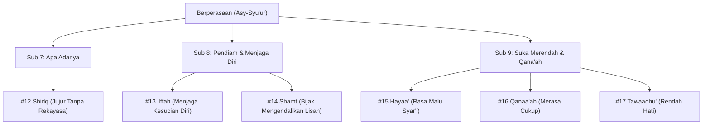

# Bakat Berperasaan (الشُعُوْر - Asy-Syu'ur)

> [!quote] Dalil & Rujukan Nabawiyah Utama
> **Naskah:**  
> « أَلَا وَإِنَّ فِي الْجَسَدِ مُضْغَةً إِذَا صَلَحَتْ صَلَحَ الْجَسَدُ كُلُّهُ، وَإِذَا فَسَدَتْ فَسَدَ الْجَسَدُ كُلُّهُ، أَلَا وَهِيَ الْقَلْبُ »
>
> *"Ingatlah, sesungguhnya di dalam tubuh terdapat segumpal daging. Jika ia baik, maka baiklah seluruh tubuh itu; dan jika ia rusak, maka rusaklah seluruh tubuh itu. Ingatlah, segumpal daging itu adalah Hati (Al-Qalb)."*
>
> 📚 **Sumber Rujukan OpenBayan:** HR. Al-Bukhari No. 52 & Muslim No. 1599; Syarah Shahih Muslim Imam An-Nawawi (Juz 11 Hal. 27); Tafsir Al-Baghawi.  
> 💡 **Relevansi PKN:** Bakat Berperasaan (*Asy-Syu'ur*) adalah radar batiniah jiwa (*Al-Qalb*) yang peka terhadap kesucian nurani, kejujuran batin, rasa malu syar'i, dan qana'ah terhadap karunia Allah.

---

## 1. Hakikat & Kedudukan Konseptual dalam Arsitektur PKN

Dalam kerangka Pendidikan Karakter Nabawiyah, **Bakat Berperasaan** merupakan persilangan antara **Kutub Introvert** (orientasi internal ke dalam diri) dan **Dimensi Rasa / Hati** (*Al-Qalb* pada jiwa muthmainnah).

Anak dengan bakat dominan Berperasaan memiliki ciri:
* **Sensitivitas Nurani yang Tinggi:** Sangat peka terhadap kebohongan, ketidakadilan, atau kepalsuan; hatinya mudah bergetar oleh nasihat iman dan penderitaan orang lain.
* **Cenderung Pendiam & Suka Merenung:** Tidak suka keramaian yang bising, berhati-hati dalam menjaga kesucian diri (*'iffah*), dan memiliki rasa malu (*hayaa'*) yang sangat dominan.
* **Bukan Kelemahan Mental:** Sensitivitas perasaan bukanlah sifat "cengeng" atau rapuh, melainkan **Muraqabatullah**—kesadaran batin yang mendalam bahwa dirinya senantiasa diawasi oleh Allah SWT.

---

## 2. Enam Turunan Pilar Karakter TB40 & Inspirasi Shahabat Nabi ﷺ

Bakat Berperasaan menaungi **6 Pilar Karakter Mulia (TB40)** yang terbagi ke dalam 3 sub-kelompok Level 18:

### Pilar #12: Shidq (الصِّدْق - Jujur & Autentik)
* **Sub-Kelompok:** Suka Apa Adanya (Introvert + Rasa)
* **Definisi Karakter:** Keselarasan mutlak antara apa yang ada di dalam batin dengan ucapan lisan dan tindakan nyata; pantang bermuka dua.
* **Inspirasi Shahabat Nabi ﷺ:** **Abu Bakar Ash-Shiddiq radhiyallahu 'anhu**. Sosok yang meraih gelar *Ash-Shiddiq* karena membenarkan risalah kenabian tanpa keraguan sedikit pun, serta **Ka'ab bin Malik radhiyallahu 'anhu** yang memilih berkata jujur apa adanya saat tertinggal dari Perang Tabuk meskipun menghadapi sanksi pengasingan sosial, hingga Allah menurunkan pengampunan baginya di QS. At-Taubah: 118.
* **Dalil Otentik OpenBayan:**
  > « عَلَيْكُمْ بِالصِّدْقِ، فَإِنَّ الصِّدْقَ يَهْدِي إِلَى البِرِّ، وَإِنَّ البِرَّ يَهْدِي إِلَى الجَنَّةِ »  
  > *"Wajib atas kalian senantiasa bersikap jujur, karena sesungguhnya kejujuran mengantarkan kepada kebajikan, dan kebajikan mengantarkan ke surga."*  
  > 📚 *(HR. Al-Bukhari No. 6094 & Muslim No. 2607)*
* **Diagnosis Deviasi:**
  * *Tafrith (Lalai):* **Kadzib / Nifaq (الكَذِب)** — Dusta, menutupi kesalahan dengan rekayasa. *Kuratif:* Bangun rasa aman di rumah; jangan pernah hukum anak yang telah berani jujur mengakui kesalahan.
  * *Ifrath (Berlebih):* **Ifsyaa'us Sirr (إِفْشَاءُ السِّرّ)** — Berbicara terlalu polos hingga membuka aib keluarga atau rahasia penting. *Kuratif:* Dikuatkan dengan pilar *Kitmaanus Sirr* dan *Satr*.

* **Label Diri (Self-Talk Indikator):** *""*
* **Peta Karir Peradaban (Profesi):** 
* **Peta Jurusan Studi & Akademik:** 
* **Preskripsi Terapi Deviasi (Manhaj SKIS):**
  * *Pemulihan Tafrith (Lalai):* 
  * *Penyeimbang Ifrath (Berlebih):* 

---

### Pilar #13: 'Iffah (العِفَّة - Menjaga Kesucian Jiwa)
* **Sub-Kelompok:** Pendiam (Introvert + Rasa)
* **Definisi Karakter:** Kemampuan batin menahan diri dari godaan syahwat, harta syubhat, dan perilaku hina yang merendahkan martabat kehambaan.
* **Inspirasi Shahabat Nabi ﷺ:** **Mush'ab bin Umair radhiyallahu 'anhu**. Pemuda bangsawan Makkah yang meninggalkan segala gelimang harta dan kemewahan demi menjaga kesucian iman di jalan dakwah, hingga wafat di Perang Uhud hanya berkafan sehelai kain burdah.
* **Dalil Otentik OpenBayan:**
  > « اللَّهُمَّ إِنِّي أَسْأَلُكَ الْهُدَى وَالتُّقَى وَالْعَفَافَ وَالْغِنَى »  
  > *"Ya Allah, sesungguhnya aku memohon kepada-Mu petunjuk, ketakwaan, kesucian diri ('iffah), dan kekayaan jiwa."*  
  > 📚 *(HR. Muslim No. 2721, Kitadz-Dzikr wad-Du'a)*
* **Diagnosis Deviasi:**
  * *Tafrith (Lalai):* **Fahsy (الفَحْش)** — Terjerumus pada pergaulan bebas, pornografi, atau serakah harta haram. *Kuratif:* Bentengi pandangan mata, fasilitasi pernikahan dini saat usia syabab bila telah mampu.
  * *Ifrath (Berlebih):* **Was-was / Rohbaniyah (الرَّهْبَانِيَّة)** — Mengharamkan hal-hal mubah dan menjauhi interaksi halal kemasyarakatan. *Kuratif:* Tanamkan sunnah Nabi ﷺ dalam berkeluarga dan bermuamalah.

* **Label Diri (Self-Talk Indikator):** *""*
* **Peta Karir Peradaban (Profesi):** 
* **Peta Jurusan Studi & Akademik:** 
* **Preskripsi Terapi Deviasi (Manhaj SKIS):**
  * *Pemulihan Tafrith (Lalai):* 
  * *Penyeimbang Ifrath (Berlebih):* 

---

### Pilar #14: Shamt (الصَّمْت - Menjaga Lisan)
* **Sub-Kelompok:** Pendiam (Introvert + Rasa)
* **Definisi Karakter:** Kecenderungan menahan diri dari banyak bicara; hanya berbicara bila mengandung kebaikan, ilmu, atau maslahat dakwah.
* **Inspirasi Shahabat Nabi ﷺ:** **Abdullah bin Mas'ud radhiyallahu 'anhu**. Beliau memegang lisannya seraya berkata: *"Wahai lisan, katakanlah yang baik niscaya engkau beruntung, atau diamlah dari keburukan niscaya engkau selamat!"*
* **Dalil Otentik OpenBayan:**
  > « مَنْ كَانَ يُؤْمِنُ بِاللَّهِ وَاليَوْمِ الآخِرِ فَلْيَقُلْ خَيْرًا أَوْ لِيَصْمُتْ »  
  > *"Barangsiapa beriman kepada Allah dan hari akhir, hendaklah ia berkata yang baik atau diam."*  
  > 📚 *(HR. Al-Bukhari No. 6018 & Muslim No. 47)*
* **Diagnosis Deviasi:**
  * *Tafrith (Lalai):* **Ghiibah / Namimah (الغِيْبَة)** — Gemar bergosip, mencela, dan menebar fitnah. *Kuratif:* Puasa bicara sia-sia, perbanyak dzikir lisan.
  * *Ifrath (Berlebih):* **Jubn (الجُبْن)** — Takut berbicara kebenaran saat kemungkaran merajalela. *Kuratif:* Dikuatkan dengan pilar *Syajaa'ah* dan *Nashiihah*.

* **Label Diri (Self-Talk Indikator):** *""*
* **Peta Karir Peradaban (Profesi):** 
* **Peta Jurusan Studi & Akademik:** 
* **Preskripsi Terapi Deviasi (Manhaj SKIS):**
  * *Pemulihan Tafrith (Lalai):* 
  * *Penyeimbang Ifrath (Berlebih):* 

---

### Pilar #15: Hayaa' (الحَيَاء - Malu Syar'i)
* **Sub-Kelompok:** Suka Merendah (Introvert + Rasa)
* **Definisi Karakter:** Perasaan malu hakiki yang mencegah seorang hamba dari melanggar syariat Allah dan menabrak norma adab kesopanan.
* **Inspirasi Shahabat Nabi ﷺ:** **Utsman bin Affan radhiyallahu 'anhu**. Pribadi yang memiliki tingkat rasa malu begitu luhur hingga para malaikat pun merasa segan dan malu kepada beliau.
* **Dalil Otentik OpenBayan:**
  > « أَلَا أَسْتَحِي مِنْ رَجُلٍ تَسْتَحِي مِنْهُ الْمَلَائِكَةُ »  
  > *"Tidakkah aku merasa malu kepada seorang lelaki yang para malaikat pun merasa malu kepadanya?"*  
  > 📚 *(HR. Muslim No. 2401, Bab Keutamaan Utsman bin Affan)*
* **Diagnosis Deviasi:**
  * *Tafrith (Lalai):* **Waqaahah (الوَقَاحَة)** — Muka tebal, tidak punya malu berbuat dosa di ruang publik. *Kuratif:* Tanamkan muraqabatullah sejak usia tamyiz.
  * *Ifrath (Berlebih):* **Duuniyyah (الدُوْنِيَّة)** — Minder patologis, takut tampil, tidak berani menyuarakan hak. *Kuratif:* Penguatan konsep diri beriman melalui pilar *'Izzah*.

* **Label Diri (Self-Talk Indikator):** *""*
* **Peta Karir Peradaban (Profesi):** 
* **Peta Jurusan Studi & Akademik:** 
* **Preskripsi Terapi Deviasi (Manhaj SKIS):**
  * *Pemulihan Tafrith (Lalai):* 
  * *Penyeimbang Ifrath (Berlebih):* 

---

### Pilar #16: Qanaa'ah (القَنَاعَة - Merasa Cukup)
* **Sub-Kelompok:** Suka Merendah (Introvert + Rasa)
* **Definisi Karakter:** Kelapangan hati menerima karunia rezeki dari Allah SWT tanpa ada rasa dengki terhadap kenikmatan yang diberikan kepada orang lain.
* **Inspirasi Shahabat Nabi ﷺ:** **Abu Dzar Al-Ghifari radhiyallahu 'anhu**. Sahabat yang hidup sangat bersahaja, tidak silau pada gemerlap perbendaharaan dunia, dan merasa cukup dengan bekal seorang musafir.
* **Dalil Otentik OpenBayan:**
  > « قَدْ أَفْلَحَ مَنْ أَسْلَمَ، وَرُزِقَ كَفَافًا، وَقَنَّعَهُ اللَّهُ بِمَا آتَاهُ »  
  > *"Sungguh sangat beruntung orang yang memeluk Islam, dianugerahi rezeki yang cukup, dan Allah karuniakan sifat qana'ah atas apa yang Dia berikan."*  
  > 📚 *(HR. Muslim No. 1054, Kitab Az-Zakah)*
* **Diagnosis Deviasi:**
  * *Tafrith (Lalai):* **Thama' / Hasad (الطَّمَع)** — Serakah, tidak pernah puas, iri melihat rezeki tetangga. *Kuratif:* Melatih anak berinfaq dan melihat orang yang berada di bawahnya dalam urusan duniawi.
  * *Ifrath (Berlebih):* **Tawaakul / Kasal (التَّوَاكُل)** — Pasrah buta tanpa ikhtiar, enggan bekerja mencari nafkah halal. *Kuratif:* Integrasikan dengan pilar *Himmah* dan *'Aziimah*.

* **Label Diri (Self-Talk Indikator):** *""*
* **Peta Karir Peradaban (Profesi):** 
* **Peta Jurusan Studi & Akademik:** 
* **Preskripsi Terapi Deviasi (Manhaj SKIS):**
  * *Pemulihan Tafrith (Lalai):* 
  * *Penyeimbang Ifrath (Berlebih):* 

---

### Pilar #17: Tawaadhu' (التَّوَاضُع - Kerendahan Hati)
* **Sub-Kelompok:** Suka Merendah (Introvert + Rasa)
* **Definisi Karakter:** Sikap batin yang tidak memandang dirinya lebih mulia daripada orang lain, mudah menerima kebenaran dari siapa pun datangnya.
* **Inspirasi Shahabat Nabi ﷺ:** **Umar bin Al-Khattab radhiyallahu 'anhu**. Sebagai Amirul Mukminin penguasa dua imperium besar, beliau tetap memanggul karung gandum di punggungnya sendiri di kegelapan malam untuk diserahkan kepada janda miskin yang kelaparan.
* **Dalil Otentik OpenBayan:**
  > « وَمَا تَوَاضَعَ أَحَدٌ لِلَّهِ إِلَّا رَفَعَهُ اللَّهُ »  
  > *"Dan tidaklah seseorang bersikap rendah hati (tawadhu') karena Allah, melainkan Allah pasti akan meninggikan derajatnya."*  
  > 📚 *(HR. Muslim No. 2588, Kitab Al-Birr wash-Shilah)*
* **Diagnosis Deviasi:**
  * *Tafrith (Lalai):* **Kibr (الكِبْر)** — Sombong, memandang remeh orang lain, menolak nasihat. *Kuratif:* Ajak anak berkhidmat melayani orang-orang lemah dan berziarah kubur.
  * *Ifrath (Berlebih):* **Mahaanah (المَهَانَة)** — Menghinakan diri di hadapan orang kaya atau pelaku maksiat. *Kuratif:* Kokohkan dengan pilar *'Izzah* Islamiyah.

---

---

## 💼 Matriks Panduan Karir Peradaban & Jurusan Studi

Berdasarkan rumusan instrumen asesmen **Tafsir Bakat TB-40 (Manhaj SKIS Semarang)**, berikut adalah panduan praktis penjurusan studi dan orientasi profesi peradaban untuk setiap pilar:

| No | Pilar Karakter | Bahasa Arab | Karakter Inti | Rekomendasi Profesi Peradaban | Rekomendasi Jurusan Studi / Vokasi |
|---|---|:---:|---|---|---|
| 1 | **Shidq** | الصِّدْق |  |  |  |
| 2 | **'Iffah** | العِفَّة |  |  |  |
| 3 | **Shamt** | الصَّمْت |  |  |  |
| 4 | **Hayaa'** | الحَيَاء |  |  |  |
| 5 | **Qanaa'ah** | القَنَاعَة |  |  |  |
| 6 | **Tawaadhu'** | التَّوَاضُع |  |  |  |

---

## 3. Rubrik Observasi Bakat untuk Orang Tua & Pendidik (Rukun 3A)

| Rukun Observasi | Indikator Perilaku Otentik Anak | Catatan Guru / Orang Tua |
| :--- | :--- | :--- |
| **1. Suka (*Interest*)** | Menikmati suasana tenang, suka menggambar hening, peka terhadap keindahan adab, tidak tahan melihat orang lain menangis. | Menolak berbohong meskipun dalam situasi terdesak; menghargai barang milik orang lain. |
| **2. Bisa (*Ability*)** | Memiliki empati alami (*emotional intelligence*); mampu membaca suasana hati orang tua lewat ekspresi mikro wajah. | Mampu menahan diri dari amarah dan godaan jajan sembarangan. |
| **3. Bermanfaat (*Utility*)** | Menjadi penenang di rumah saat terjadi ketegangan; menjadi sahabat yang setia menjaga rahasia kawan; menjaga etika kesantunan. | Menjaga nama baik keluarga melalui keanggunan akhlaknya. |

---

## 4. Panduan Pendampingan Berdasarkan 4 Fase Usia Nabawiyah

### A. Fase Thufulah (0–7 Tahun: Mengisi Tangki Cinta Hati)
* Penuhi jiwa anak dengan pelukan, kelembutan, dan sentuhan fisik (*Bahasa Hati*).
* Jangan bentak atau labeli anak pemalu sebagai "penakut"; rasa malunya adalah modalitas fitrah kesucian.
* Jadilah teladan kejujuran: jangan pernah membohongi anak meskipun untuk menenangkannya saat menangis.

### B. Fase Tamyiz (7–10 Tahun: Menjaga Batas Aurat & Kesucian)
* Pisahkan tempat tidur anak laki-laki dan perempuan sesuai petunjuk hadits Nabi ﷺ.
* Ajarkan adab meminta izin (*isti'dzan*) saat memasuki kamar orang tua di tiga waktu aurat.
* Tumbuhkan rasa bangga dengan busana muslimah yang menutup aurat sempurna secara sukarela.

### C. Fase Murahaqah (10–15 Tahun: Menjaga Pandangan & Manajemen Syahwat)
* Berikan pendidikan *tazkiyatun nafs*: bahaya zina mata dan kerusakan pornografi terhadap qalb.
* Arahkan sensitivitas perasaannya ke dunia seni bernilai adab tinggi: kaligrafi, sastra Islam, puisi dakwah, arsitektur masjid.
* Fasilitasi pertemanan shalih yang saling menjaga kesucian adab pergaulan.

### D. Fase Syabab (15+ Tahun: Benteng Kesucian & Integritas Lembaga)
* Jadikan pemuda pemegang amanah kebendaharaan, audit internal, atau pengelola dana sosial umat.
* Dorong untuk segera menggenapkan separuh agama melalui pernikahan yang berkah bila telah memiliki kesiapan.

---

## 5. Pemetaan Rumpun Profesi & Jurusan Masa Depan

* **Profesi:** Pengelola Baitul Mal / Bendahara Amanah, Auditor Keuangan Syariah, Konselor Pernikahan, Sastrawan/Penulis Buku Akhlak, Arsitek Beradab, Kurator Warisan Sejarah Islam.
* **Rumpun Jurusan:** Akuntansi Syariah, Manajemen Keuangan Islam, Sastra Arab & Linguistik, Psikologi Konseling Islam, Ilmu Adab & Sejarah Peradaban Islam.

* **Label Diri (Self-Talk Indikator):** *""*
* **Peta Karir Peradaban (Profesi):** 
* **Peta Jurusan Studi & Akademik:** 
* **Preskripsi Terapi Deviasi (Manhaj SKIS):**
  * *Pemulihan Tafrith (Lalai):* 
  * *Penyeimbang Ifrath (Berlebih):* 

---

## 6. Tautan Konseptual Terkait
* [[Bakat]] — Taksonomi Lengkap Karakter Nabawiyah.
* [[Insan]] — Anatomi Ruh, Nafs, dan Qalb.
* [[Bahasa Hati]] — Seni Mengisi Tangki Cinta Anak.
* [[Tazkiyatun Nafs]] — Metodologi Pembersihan Jiwa dalam Islam.
