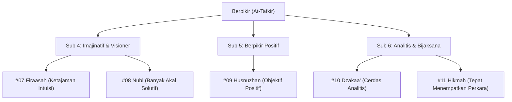

# Bakat Berpikir (التَّفْكِيْر - At-Tafkir)

> [!quote] Dalil & Rujukan Nabawiyah Utama
> **Naskah:**  
> « أَفَلَا يَتَدَبَّرُونَ الْقُرْآنَ أَمْ عَلَىٰ قُلُوبٍ أَقْفَالُهَا »
>
> *"Maka tidakkah mereka mentadabburi (memikirkan secara mendalam) Al-Qur'an, ataukah hati mereka telah terkunci rapat?"*
>
> 📚 **Sumber Rujukan OpenBayan:** QS. Muhammad: 24; Tafsir Ibnu Katsir (Juz 7 Hal. 312); Shahih Al-Bukhari (Kitab Fadha'ilil Qur'an).  
> 💡 **Relevansi PKN:** Bakat Berpikir (*At-Tafkir*) adalah modalitas akal (*Al-'Aql*) yang ditundukkan untuk menangkap ayat-ayat kauniyah dan qauliyah, menalar sebab-akibat, serta merumuskan strategi peradaban Islam.

---

## 1. Hakikat & Kedudukan Konseptual dalam Arsitektur PKN

Dalam arsitektur Pendidikan Karakter Nabawiyah, **Bakat Berpikir** adalah hasil persilangan antara **Kutub Introvert** (sumber energi dari perenungan batin mandiri) dan **Dimensi Cipta / Akal** (*Al-'Aql* pada jiwa lawwamah).

Anak dengan bakat dominan Berpikir dicirikan oleh:
* **Daya Analitis & Haus Pengetahuan:** Senang bertanya "mengapa" dan "bagaimana", suka mengurai struktur permasalahan, gemar membaca dan menyerap data.
* **Gaya Belajar Visual & Reflektif:** Cepat memahami bagan, diagram, peta konsep, dan memerlukan ruang hening untuk mencerna informasi secara tuntas.
* **Bukan Sekadar Intelektual Kering:** Berpikir dalam Islam bukanlah rasionalisme sekuler yang mendewakan logika (*ahlur ra'yi*), melainkan **Tafakkur & Tadabbur** yang mengantarkan akal pada kekaguman mutlak kepada Sang Pencipta (*Ma'rifatullah*).

---

## 2. Lima Turunan Pilar Karakter TB40 & Inspirasi Shahabat Nabi ﷺ

Bakat Berpikir membawahi **5 Pilar Karakter Mulia (TB40)** yang terbagi ke dalam 3 sub-kelompok Level 18. Masing-masing pilar berakar pada keteladanan agung para Shahabat Nabi radhiyallahu 'anhum:

### Pilar #07: Firaasah (الفِرَاسَة - Ketajaman Firasat Iman)
* **Sub-Kelompok:** Suka Berpikir Imajinatif / Visioner (Introvert + Cipta)
* **Definisi Karakter:** Ketajaman nalar batin yang mampu menangkap hakikat perkara tersembunyi dengan mengamati tanda-tanda lahiriah yang tampak.
* **Inspirasi Shahabat Nabi ﷺ:** **Umar bin Al-Khattab radhiyallahu 'anhu**. Beliau dijuluki sebagai *Al-Muhaddats* (orang yang diberi ilham firasat benar). Firasat pemikirannya berulang kali bertepatan dengan turunnya wahyu ayat Al-Qur'an (*Muwafaqat Umar*), seperti penetapan Maqam Ibrahim sebagai tempat shalat dan hijab bagi ummahatul mukminin.
* **Dalil Otentik OpenBayan:**
  > « إِنَّهُ قَدْ كَانَ فِيمَا مَضَى قَبْلَكُمْ مِنَ الأُمَمِ مُحَدَّثُونَ، وَإِنَّهُ إِنْ كَانَ فِي أُمَّتِي هَذِهِ مِنْهُمْ فَإِنَّهُ عُمَرُ بْنُ الخَطَّابِ »  
  > *"Sesungguhnya pada umat-umat terdahulu sebelum kalian terdapat orang-orang yang diberi ilham kebenaran (muhaddatsun). Dan jika ada seorang di antara umatku ini, maka dialah Umar bin Al-Khattab."*  
  > 📚 *(HR. Al-Bukhari No. 3689 & Muslim No. 2398)*
* **Diagnosis Deviasi:**
  * *Tafrith (Lalai):* **Safah (السَّفَه)** — Kedangkalan berpikir, mudah tertipu oleh bungkus luar. *Kuratif:* Melatih anak mengamati pola sebab-akibat dan memperdalam tadabbur ayat.
  * *Ifrath (Berlebih):* **Kadzib / Khurafat (الكَذِب)** — Mengaku mengetahui hal ghaib tanpa dalil syar'i. *Kuratif:* Mengikat firasat dengan nash shahih dan kaidah *Shidq*.

* **Label Diri (Self-Talk Indikator):** *"kurang berakhlak mulia"*
* **Peta Karir Peradaban (Profesi):** 
* **Peta Jurusan Studi & Akademik:** 
* **Preskripsi Terapi Deviasi (Manhaj SKIS):**
  * *Pemulihan Tafrith (Lalai):* 
  * *Penyeimbang Ifrath (Berlebih):* 

---

### Pilar #08: Nubl (النُّبْل - Cerdik & Banyak Akal)
* **Sub-Kelompok:** Suka Berpikir Imajinatif / Visioner (Introvert + Cipta)
* **Definisi Karakter:** Cepat memahami situasi kritis dan lihai merumuskan solusi strategis yang keluar dari kelaziman (*out of the box*).
* **Inspirasi Shahabat Nabi ﷺ:** **Salman Al-Farisi radhiyallahu 'anhu**. Ketika 10.000 pasukan sekutu Quraisy mengepung Madinah dalam Perang Ahzab (Khandaq), Salman mengajukan gagasan cerdik menggali parit raksasa di utara Madinah—sebuah strategi pertahanan militer yang belum pernah dikenal oleh bangsa Arab saat itu.
* **Dalil Otentik OpenBayan:**
  > « كَانَ سَلْمَانُ يُشِيرُ عَلَى رَسُولِ اللَّهِ ﷺ بِالْأَمْرِ فَيَأْخُذُ بِهِ »  
  > *"Adalah Salman senantiasa memberikan usulan gagasan cerdik kepada Rasulullah ﷺ dalam berbagai urusan, lalu beliau mengambil dan menerapkannya."*  
  > 📚 *(Siyar A'lam An-Nubala karya Adz-Dzahabi 1/540; Al-Bidayah wan-Nihayah 4/105)*
* **Diagnosis Deviasi:**
  * *Tafrith (Lalai):* **Jahl (الجَهْل)** — Buntu saat menghadapi masalah kecil, panik. *Kuratif:* Dilatih dengan studi kasus pemecahan teka-teki nyata (*problem solving*).
  * *Ifrath (Berlebih):* **Ghisy / Hiyal (الغِشِّ)** — Menggunakan kecerdikan untuk menipu, memanipulasi celah hukum demi keuntungan pribadi. *Kuratif:* Menanamkan pilar *Amaanah* dan *'Adaalah*.

* **Label Diri (Self-Talk Indikator):** *"cukup berakhlak mulia"*
* **Peta Karir Peradaban (Profesi):** 
* **Peta Jurusan Studi & Akademik:** 
* **Preskripsi Terapi Deviasi (Manhaj SKIS):**
  * *Pemulihan Tafrith (Lalai):* 
  * *Penyeimbang Ifrath (Berlebih):* 

---

### Pilar #09: Husnuzhan (حُسْنُ الظَّن - Kejernihan Nalar Positif)
* **Sub-Kelompok:** Suka Berpikir Positif (Introvert + Cipta)
* **Definisi Karakter:** Senantiasa mengedepankan asas praduga baik, objektif menyaring informasi, dan tidak mudah terprovokasi oleh isu liar.
* **Inspirasi Shahabat Nabi ﷺ:** **Abu Ayyub Al-Anshari & istrinya radhiyallahu 'anhuma**. Saat kota Madinah diguncang fitnah keji terhadap Ummul Mukminin Aisyah (Haditsul Ifk), Ummu Ayyub bertanya kepada suaminya, lalu Abu Ayyub menjawab dengan jernih: *"Demi Allah, aku tidak akan pernah melakukannya, dan Aisyah jauh lebih mulia daripada engkau!"* Mereka menolak mentah-mentah berita hoax tersebut sebelum ada konfirmasi wahyu.
* **Dalil Otentik OpenBayan:**
  > « إِيَّاكُمْ وَالظَّنَّ، فَإِنَّ الظَّنَّ أَكْذَبُ الحَدِيثِ »  
  > *"Jauhilah oleh kalian prasangka buruk (tanpa bukti), karena sesungguhnya prasangka adalah seburuk-buruk perkataan dusta."*  
  > 📚 *(HR. Al-Bukhari No. 5143 & Muslim No. 2563)*
* **Diagnosis Deviasi:**
  * *Tafrith (Lalai):* **Suu'uzhan (سُوْءُ الظَّن)** — Pikiran penuh kecurigaan kronis, meracuni hubungan persaudaraan. *Kuratif:* Membiasakan tabayyun dan berbaik sangka kepada takdir Allah.
  * *Ifrath (Berlebih):* **Taqliid A'ma (التَّقْلِيْد)** — Polos hingga mudah ditipu dan dibodohi musuh. *Kuratif:* Dilengkapi dengan kewaspadaan pilar *Firaasah* dan *Dzakaa'*.

* **Label Diri (Self-Talk Indikator):** *"Sangat rendah"*
* **Peta Karir Peradaban (Profesi):** 
* **Peta Jurusan Studi & Akademik:** 
* **Preskripsi Terapi Deviasi (Manhaj SKIS):**
  * *Pemulihan Tafrith (Lalai):* 
  * *Penyeimbang Ifrath (Berlebih):* 

---

### Pilar #10: Dzakaa' (الذَّكَاء - Cerdas & Cepat Menyerap)
* **Sub-Kelompok:** Suka Berpikir Analitis (Introvert + Cipta)
* **Definisi Karakter:** Kecepatan daya tangkap logika, ketajaman hafalan, serta kecerdasan mendalam dalam mengurai data kompleks.
* **Inspirasi Shahabat Nabi ﷺ:** **Zaid bin Tsabit radhiyallahu 'anhu**. Beliau diperintahkan oleh Nabi ﷺ untuk mempelajari bahasa Yahudi (Suryani/Ibrani) demi kepentingan surat-menyurat resmi kenegaraan, dan beliau mampu menguasainya secara fasih hanya dalam tempo 15 hari!
* **Dalil Otentik OpenBayan:**
  > « أَمَرَنِي رَسُولُ اللَّهِ ﷺ أَنْ أَتَعَلَّمَ لَهُ كِتَابَ يَهُودَ، قَالَ: إِنِّي وَاللَّهِ مَا آمَنُ يَهُودَ عَلَى كِتَابٍ، فَتَعَلَّمْتُهُ، فَمَا مَرَّ بِي نِصْفُ شَهْرٍ حَتَّى حَذَقْتُهُ »  
  > *"Rasulullah ﷺ memerintahkanku untuk mempelajari surat orang-orang Yahudi untuk beliau... Maka aku mempelajarinya, dan belum berlalu setengah bulan sampai aku telah mahir menguasainya."*  
  > 📚 *(HR. At-Tirmidzi No. 2715, dinyatakan Hasan Shahih; Al-Bukhari secara mu'allaq)*
* **Diagnosis Deviasi:**
  * *Tafrith (Lalai):* **Balaadah (البَلَادَة)** — Malas mengasah nalar, enggan membaca. *Kuratif:* Latihan menghafal Al-Qur'an dan mutun ilmiah secara bertahap.
  * *Ifrath (Berlebih):* **Ahlur Ra'yi (أَهْلُ الرَّأْيِ)** — Mendewakan logika akal di atas nash wahyu, gemar mendebat perkara agama yang qath'i. *Kuratif:* Tundukkan akal di bawah wibawa wahyu dengan pilar *Tawaadhu'* dan *Ihsan*.

* **Label Diri (Self-Talk Indikator):** *"sangat berakhlak mulia"*
* **Peta Karir Peradaban (Profesi):** 
* **Peta Jurusan Studi & Akademik:** 
* **Preskripsi Terapi Deviasi (Manhaj SKIS):**
  * *Pemulihan Tafrith (Lalai):* 
  * *Penyeimbang Ifrath (Berlebih):* 

---

### Pilar #11: Hikmah (الحِكْمَة - Kebijaksanaan Menempatkan Perkara)
* **Sub-Kelompok:** Suka Berpikir Analitis (Introvert + Cipta)
* **Definisi Karakter:** Kedalaman ilmu yang mampu menempatkan setiap perkataan, tindakan, dan keputusan pada tempat dan waktu yang paling tepat (*proporsional*).
* **Inspirasi Shahabat Nabi ﷺ:** **Mu'adz bin Jabal radhiyallahu 'anhu**. Sahabat muda yang dipuji Rasulullah ﷺ sebagai sosok yang paling paham tentang halal dan haram, dan diutus ke Yaman sebagai hakim dan mufti rujukan umat.
* **Dalil Otentik OpenBayan:**
  > « يُؤْتِي الْحِكْمَةَ مَن يَشَاءُ ۚ وَمَن يُؤْتَ الْحِكْمَةَ فَقَدْ أُوتِيَ خَيْرًا كَثِيرًا »  
  > *"Allah menganugerahkan al-hikmah (pemahaman mendalam dan tepat) kepada siapa yang Dia kehendaki. Dan barangsiapa dianugerahi al-hikmah, sungguh dia telah dianugerahi kebajikan yang sangat banyak."*  
  > 📚 *(QS. Al-Baqarah: 269; Tafsir Ibnu Katsir 1/702)*
* **Diagnosis Deviasi:**
  * *Tafrith (Lalai):* **Jahl Murakkab (الجَهْلُ المُرَكَّب)** — Merasa tahu padahal tidak paham konteks, asal bicara. *Kuratif:* Duduk di majelis para ulama rabbani dan belajar mendengarkan.
  * *Ifrath (Berlebih):* **Falsafah ‘Aqiimah (الفَلْسَفَة)** — Berputar-putar dalam teori rumit tanpa aksi nyata. *Kuratif:* Salurkan ke penulisan fatwa praktis atau panduan amal nyata.

---

---

## 💼 Matriks Panduan Karir Peradaban & Jurusan Studi

Berdasarkan rumusan instrumen asesmen **Tafsir Bakat TB-40 (Manhaj SKIS Semarang)**, berikut adalah panduan praktis penjurusan studi dan orientasi profesi peradaban untuk setiap pilar:

| No | Pilar Karakter | Bahasa Arab | Karakter Inti | Rekomendasi Profesi Peradaban | Rekomendasi Jurusan Studi / Vokasi |
|---|---|:---:|---|---|---|
| 1 | **Firaasah** | الفِرَاسَة |  |  |  |
| 2 | **Nubl** | النُّبْل |  |  |  |
| 3 | **Husnuzhan** | حُسْنُ الظَّن | Extrovert |  |  |
| 4 | **Dzakaa'** | الذَّكَاء |  |  |  |
| 5 | **Hikmah** | الحِكْمَة | Introvert |  |  |

---

## 3. Rubrik Observasi Bakat untuk Orang Tua & Pendidik (Rukun 3A)

| Rukun Observasi | Indikator Perilaku Otentik Anak | Catatan Guru / Orang Tua |
| :--- | :--- | :--- |
| **1. Suka (*Interest*)** | Gemar membaca buku, membongkar rahasia mesin/permainan, menikmati teka-teki logika, asyik merenung sendiri. | Wajahnya berbinar ketika menemukan jawaban dari misteri yang mengganjal pikirannya. |
| **2. Bisa (*Ability*)** | Mampu mengingat detail peristiwa dengan sangat presisi; cepat menghubungkan fakta yang berserak menjadi kesimpulan utuh. | Memiliki daya nalar kritis di atas rata-rata usia sebayanya. |
| **3. Bermanfaat (*Utility*)** | Mampu memberikan nasihat bijak kepada kawan yang berselisih; menyusun strategi belajar bersama; merangkum materi rumit. | Pemikirannya menjadi penerang jalan keluar bagi orang-orang di sekitarnya. |

---

## 4. Panduan Pendampingan Berdasarkan 4 Fase Usia Nabawiyah

### A. Fase Thufulah (0–7 Tahun: Menjawab Rasa Ingin Tahu dengan Kasih)
* Dengarkan dan jawab setiap pertanyaan anak tanpa membentak atau menyepelekan ("Kenapa langit biru?", "Kenapa semut baris?").
* Ajak mengamati alam terbuka: melihat dedaunan, perbintangan, hewan ternak untuk memicu *tafakkur*.
* Hindari membebani anak dengan hafalan mekanis yang dipaksakan tanpa kecintaan.

### B. Fase Tamyiz (7–10 Tahun: Menata Logika Syariat & Membaca)
* Fasilitasi perpustakaan rumah yang kaya sirah nabawiyah, kisah shahabat, sains alam, dan fiqih dasar.
* Ajak berdiskusi santai di meja makan mengenai hikmah di balik perintah Allah (misal hikmah shalat berjamaah, hikmah puasa).
* Ajarkan metode berpikir kritis Islami: menyaring kabar bohong (*tabayyun*).

### C. Fase Murahaqah (10–15 Tahun: Pelatihan Riset & Problem Solving)
* Berikan tantangan menganalisis masalah nyata keluarga atau masyarakat, lalu minta ia menyusun proposal solusinya.
* Libatkan anak dalam musyawarah keluarga; dengarkan sudut pandang analitisnya secara serius.
* Ajarkan adab ikhtilaf: bagaimana berbeda pandangan ilmiah dengan tetap menjaga kelembutan hati.

### D. Fase Syabab (15+ Tahun: Karya Intelektual & Khidmah Peradaban)
* Dorong anak untuk menulis artikel, karya ilmiah, riset teknologi, atau kajian syariah aplikatif.
* Dampingi agar ilmunya membuahkan *khasy-yah* (rasa takut kepada Allah), bukan kesombongan akademik.

---

## 5. Pemetaan Rumpun Profesi & Jurusan Masa Depan

* **Profesi:** Peneliti Sains, Analis Kebijakan Publik, Arsitek Sistem Software (IT), Konsultan Manajemen, Mufti/Hakim Syariah, Perencana Strategis (Litbang), Penulis Ilmiah.
* **Rumpun Jurusan:** Ilmu Ushuluddin, Fiqih wa Ushuluhu, Ilmu Komputer/Informatika, Matematika Murni, Fisika Teoritik, Hukum Islam & Internasional, Data Science.

* **Label Diri (Self-Talk Indikator):** *""*
* **Peta Karir Peradaban (Profesi):** 
* **Peta Jurusan Studi & Akademik:** 
* **Preskripsi Terapi Deviasi (Manhaj SKIS):**
  * *Pemulihan Tafrith (Lalai):* 
  * *Penyeimbang Ifrath (Berlebih):* 

---

## 6. Tautan Konseptual Terkait
* [[Bakat]] — Induk Taksonomi 40 Karakter Nabawiyah.
* [[Insan]] — Hakikat Akal, Hati, dan Hawa Nafsu.
* [[Bahasa Lisan]] — Seni Komunikasi Nasihat & Diskusi Intelektual.
* [[Tamyiz]] — Etape Emas Pembentukan Nalar Kritis Anak.
