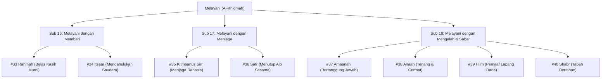

# Bakat Melayani (الخِدْمَة - Al-Khidmah)

> [!quote] Dalil & Rujukan Nabawiyah Utama
> **Naskah:**  
> « سَيِّدُ الْقَوْمِ خَادِمُهُمْ فِي السَّفَرِ »
>
> *"Pemimpin suatu kaum adalah orang yang paling banyak melayani mereka dalam perjalanan."*
>
> 📚 **Sumber Rujukan OpenBayan:** HR. Al-Baihaqi dalam *Syu'abul Iman* No. 8419; Syarah Shahih Muslim Imam An-Nawawi (Juz 12 Hal. 188); Dinyatakan Hasan oleh Syaikh Al-Albani.  
> 💡 **Relevansi PKN:** Bakat Melayani (*Al-Khidmah*) adalah perwujudan tertinggi dari sifat rahmah dan pengorbanan tanpa pamrih (*itsaar*), menjadi benteng penjaga amanah dan perisai kerahasiaan dakwah Islam.

---

## 1. Hakikat & Kedudukan Konseptual dalam Arsitektur PKN

Dalam disiplin Pendidikan Karakter Nabawiyah, **Bakat Melayani** adalah hasil persilangan antara **Kutub Ekstrovert** (fokus aksi tercurah kepada kebutuhan orang lain) dan **Dimensi Rasa / Hati** (*Al-Qalb* pada jiwa muthmainnah yang dipenuhi kasih sayang ilahiah).

Karakteristik khas anak berbakat Melayani:
* **Altruistik & Berjiwa Sosial Tinggi:** Spontan bergerak membantu orang yang kerepotan tanpa diminta, tidak tega melihat penderitaan orang lain.
* **Amanah & Penjaga Rahasia:** Sangat setia memegang amanah, mampu menutupi aib kawan (*satr*), sabar dan teliti dalam tugas-tugas pendampingan.
* **Bukan Berjiwa Budak (*Riqqun*):** Melayani dalam Islam bukanlah kehinaan perbudakan, melainkan **Al-Itsaar & Khidmah Mubarakah**—kemuliaan derajat yang dicontohkan para nabi dan rasul yang melayani umatnya siang dan malam.

---

## 2. Delapan Turunan Pilar Karakter TB40 & Inspirasi Shahabat Nabi ﷺ

Bakat Melayani membawahi **8 Pilar Karakter Mulia (TB40)** yang terbagi ke dalam 3 sub-kelompok Level 18:

### Pilar #33: Rahmah (الرَّحْمَة - Kasih Sayang Murni)
* **Sub-Kelompok:** Melayani dengan Memberi (Ekstrovert + Rasa)
* **Definisi Karakter:** Pancaran belas kasih tulus yang mendorong tindakan nyata untuk menolong kaum dhu'afa, anak yatim, dan orang-orang yang terluka.
* **Inspirasi Shahabat Nabi ﷺ:** **Abu Bakar Ash-Shiddiq radhiyallahu 'anhu**. Beliau dipuji oleh Rasulullah ﷺ sebagai sosok umat yang paling penyayang kepada umat ini (*Arhamu Ummati bi Ummati*), yang memerdekakan budak-budak tertindas seperti Bilal bin Rabah.
* **Dalil Otentik OpenBayan:**
  > « الرَّاحِمُونَ يَرْحَمُهُمُ الرَّحْمَنُ، ارْحَمُوا مَنْ فِي الأَرْضِ يَرْحَمْكُمْ مَنْ فِي السَّمَاءِ »  
  > *"Orang-orang yang penyayang niscaya akan disayangi oleh Dzat Yang Maha Penyayang (Ar-Rahman). Sayangilah siapa saja yang ada di bumi, niscaya Dzat yang ada di langit akan menyayangi kalian!"*  
  > 📚 *(HR. At-Tirmidzi No. 1924, dinyatakan Shahih; Sunan Abi Dawud No. 4941)*
* **Diagnosis Deviasi:**
  * *Tafrith (Lalai):* **Qaswah (القَسْوَة)** — Hati keras membatu, tega melihat penderitaan orang lain. *Kuratif:* Mengusap kepala anak yatim dan memberi makan orang miskin.
  * *Ifrath (Berlebih):* **Khawwar (الخَوَر)** — Lembek hingga tidak tega menegakkan sanksi syariat yang adil. *Kuratif:* Imbangi dengan pilar *'Adaalah* dan *Ghairah*.

---

### Pilar #34: Itsaar (الاِيْثَار - Altruisme Syar'i)
* **Sub-Kelompok:** Melayani dengan Memberi (Ekstrovert + Rasa)
* **Definisi Karakter:** Kerelaan mendahulukan kebutuhan saudara seiman di atas kepentingan diri sendiri, meskipun dirinya sedang dalam kesempitan.
* **Inspirasi Shahabat Nabi ﷺ:** **Abu Thalhah Al-Anshari & istrinya Ummu Sulaim radhiyallahu 'anhuma**. Mereka mematikan lampu dan berpura-pura makan demi membiarkan tamu Rasulullah ﷺ makan hidangan yang hanya tersisa sedikit sampai kenyang, hingga turun ayat pujian dari langit: QS. Al-Hasyr: 9.
* **Dalil Otentik OpenBayan:**
  > « وَيُؤْثِرُونَ عَلَىٰ أَنفُسِهِمْ وَلَوْ كَانَ بِهِمْ خَصَاصَةٌ »  
  > *"Dan mereka lebih mengutamakan (orang-orang Muhajirin) atas diri mereka sendiri, sekalipun mereka sedang berada dalam kesusahan/kekurangan."*  
  > 📚 *(QS. Al-Hasyr: 9; HR. Al-Bukhari No. 3798 & Muslim No. 2054)*
* **Diagnosis Deviasi:**
  * *Tafrith (Lalai):* **Syuhh / Bukhl (الشُّحّ)** — Sangat kikir dan takut miskin. *Kuratif:* Latihan sedekah barang yang paling dicintai.
  * *Ifrath (Berlebih):* **Dhai'atul 'Iyal (ضَيْعَةُ العِيَالِ)** — Berinfaq habis-habisan ke luar hingga menelantarkan nafkah wajib anak dan istri. *Kuratif:* Dahulukan urutan nafkah keluarga sesuai sabda Nabi ﷺ: *"Mulailah dari orang yang menjadi tanggunganmu."*

---

### Pilar #35: Kitmaanus Sirr (كِتْمَانُ السِّرِّ - Menjaga Rahasia)
* **Sub-Kelompok:** Melayani dengan Menjaga (Ekstrovert + Rasa)
* **Definisi Karakter:** Kemampuan luar biasa mengunci informasi rahasia yang diamanahkan kepadanya agar tidak bocor dan menimbulkan madharat.
* **Inspirasi Shahabat Nabi ﷺ:** **Hudzaifah bin Al-Yaman radhiyallahu 'anhu (Shahibu Sirri Rasulillah)**. Beliau dipercaya memegang daftar rahasia nama-nama orang munafik di Madinah, dan sampai akhir hayatnya beliau tidak pernah membocorkannya kepada siapapun, termasuk kepada Khalifah Umar bin Khattab!
* **Dalil Otentik OpenBayan:**
  > « اسْتَعِينُوا عَلَى قَضَاءِ حَوَائِجِكُمْ بِالْكِتْمَانِ، فَإِنَّ كُلَّ ذِي نِعْمَةٍ مَحْسُودٌ »  
  > *"Bantulah kelancaran penyelesaian hajat-hajat kalian dengan menjaga kerahasiaan, karena sesungguhnya setiap orang yang memiliki nikmat itu ada yang mendengkinya."*  
  > 📚 *(HR. Ath-Thabrani dalam Al-Kabir No. 13334; Al-Bani dalam Silsilah Ash-Shahihah No. 1453)*
* **Diagnosis Deviasi:**
  * *Tafrith (Lalai):* **Ifsyaa'us Sirr (إِفْشَاءُ السِّرّ)** — Mulut ember, membocorkan rahasia penting demi sensasi. *Kuratif:* Peringatkan tentang dosa khianat amanah.
  * *Ifrath (Berlebih):* **Kithmanul Haqq (كِتْمَانُ الحَقِّ)** — Menyembunyikan persaksian kebenaran yang wajib diungkap di pengadilan. *Kuratif:* Tegakkan pilar *Shidq*.

---

### Pilar #36: Satr (السَّتْر - Menutup Aib Saudara)
* **Sub-Kelompok:** Melayani dengan Menjaga (Ekstrovert + Rasa)
* **Definisi Karakter:** Menahan diri dari menceritakan atau menyebarkan aib dan kekhilafan saudaranya sesama muslim demi menjaga martabatnya.
* **Inspirasi Shahabat Nabi ﷺ:** **Abu Bakar & Umar radhiyallahu 'anhuma** yang selalu berusaha menasihati secara tertutup dan menutupi aib kaum muslimin dari cemoohan publik.
* **Dalil Otentik OpenBayan:**
  > « وَمَنْ سَتَرَ مُسْلِمًا سَتَرَهُ اللَّهُ فِي الدُّنْيَا وَالآخِرَةِ »  
  > *"Dan barangsiapa menutupi (aib) seorang muslim, niscaya Allah akan menutupi aibnya di dunia dan akhirat."*  
  > 📚 *(HR. Muslim No. 2699, Kitab Adz-Dzikr wad-Du'a)*
* **Diagnosis Deviasi:**
  * *Tafrith (Lalai):* **Fadhihah / Tasy-hir (الفَضِيْحَة)** — Gemar memviralkan aib dan membongkar kesalahan orang lain. *Kuratif:* Renungi hadits ancaman bahwa Allah akan membongkar aibnya di rumahnya sendiri.
  * *Ifrath (Berlebih):* **Iqrārul Munkar (إِقْرَارُ المُنْكَر)** — Melindungi pelaku kriminal berbahaya yang merugikan publik atas nama menutup aib. *Kuratif:* Laporkan kepada pihak berwenang sesuai kaidah hukum syar'i.

---

### Pilar #37: Amaanah (الاَمَانَة - Tanggung Jawab Terpercaya)
* **Sub-Kelompok:** Melayani dengan Mengalah (Ekstrovert + Rasa)
* **Definisi Karakter:** Sikap bertanggung jawab penuh menunaikan setiap tugas, titipan harta, dan janji tanpa pernah berkhianat.
* **Inspirasi Shahabat Nabi ﷺ:** **Abu Ubaidah bin Al-Jarrah radhiyallahu 'anhu (Aminul Ummah)**. Rasulullah ﷺ bersabda di hadapan delegasi Najran bahwa beliau akan mengirimkan seorang yang benar-benar terpercaya, lalu beliau memegang tangan Abu Ubaidah.
* **Dalil Otentik OpenBayan:**
  > « إِنَّ لِكُلِّ أُمَّةٍ أَمِينًا، وَإِنَّ أَمِينَنَا أَيَّتُهَا الأُمَّةُ أَبُو عُبَيْدَةَ بْنُ الجَرَّاحِ »  
  > *"Sesungguhnya setiap umat memiliki orang yang paling terpercaya (amin), dan sesungguhnya orang yang paling terpercaya di kalangan umat kita ini adalah Abu Ubaidah bin Al-Jarrah."*  
  > 📚 *(HR. Al-Bukhari No. 3744 & Muslim No. 2419)*
* **Diagnosis Deviasi:**
  * *Tafrith (Lalai):* **Khiyanah (الخِيَانَة)** — Mengabaikan tugas, korupsi dana titipan. *Kuratif:* Awasi dengan audit ketat dan tanamkan hisab akhirat.
  * *Ifrath (Berlebih):* **Hamlul Ma La Yuthaq (حَمْلُ مَا لَا يُطَاقُ)** — Mengambil semua beban amanah hingga fisik dan mental hancur (*burnout*). *Kuratif:* Pelajari seni delegasi tugas dengan pilar *Ta'aawun*.

---

### Pilar #38: Anaah (الاَنَاة - Ketenangan & Ketelitian)
* **Sub-Kelompok:** Melayani dengan Mengalah (Ekstrovert + Rasa)
* **Definisi Karakter:** Ketenangan sikap yang mendalam, tidak tergesa-gesa dalam mengambil keputusan, menimbang maslahat dan madharat secara matang.
* **Inspirasi Shahabat Nabi ﷺ:** **Al-Asyaj (Ashaj Abdul Qais) radhiyallahu 'anhu**. Ketika rombongannya tiba di Madinah dan langsung berlari menemui Nabi ﷺ, Al-Asyaj dengan tenang merapikan hewan tunggangannya, mandi, mengenakan pakaian terbaiknya, baru kemudian menghadap Rasulullah ﷺ dengan penuh wibawa.
* **Dalil Otentik OpenBayan:**
  > « إِنَّ فِيكَ خَصْلَتَيْنِ يُحِبُّهُمَا اللَّهُ: الْحِلْمُ، وَالأَنَاةُ »  
  > *"Sesungguhnya pada dirimu terdapat dua sifat yang sangat dicintai oleh Allah: Kesantunan (Al-Hilm) dan Ketenangan yang tidak tergesa-gesa (Al-Anaah)."*  
  > 📚 *(HR. Muslim No. 17 & 18, Kitab Al-Iman; Riyadush Shalihin Tahqiq Al-Fahl No. 631)*
* **Diagnosis Deviasi:**
  * *Tafrith (Lalai):* **'Ajalah (العَجَلَة)** — Grusa-grusu, terburu-buru, ceroboh. *Kuratif:* Hadits: *"Ketergesa-gesaan itu berasal dari setan."*
  * *Ifrath (Berlebih):* **Tawaani / Batha' (التَّوَانِي)** — Lamban berlebihan hingga kehilangan momentum emas. *Kuratif:* Pacu dengan pilar *'Aziimah*.

---

### Pilar #39: Hilm (الحِلْم - Pemaaf Santun Lapang Dada)
* **Sub-Kelompok:** Melayani dengan Mengalah (Ekstrovert + Rasa)
* **Definisi Karakter:** Kemampuan menahan amarah dan tetap bersikap santun serta memaafkan orang yang berbuat kasar kepadanya, padahal ia sanggup membalas.
* **Inspirasi Shahabat Nabi ﷺ:** **Al-Ahnaf bin Qais radhiyallahu 'anhu**. Tokoh tabi'in senior yang menjadi perumpamaan bangsa Arab dalam sifat santun (*Ahlamu minal Ahnaf*); ketika seseorang memaki dan mengikutinya berjam-jam, beliau hanya berkata tenang di dekat gerbang kampungnya: *"Wahai saudaraku, selesaikanlah makianmu di sini, agar orang-orang di kampungku tidak mendengar dan memukulmu!"*
* **Dalil Otentik OpenBayan:**
  > « لَيْسَ الشَّدِيدُ بِالصُّرَعَةِ، إِنَّمَا الشَّدِيدُ الَّذِي يَمْلِكُ نَفْسَهُ عِنْدَ الغَضَبِ »  
  > *"Bukanlah orang kuat itu yang menang dalam bergulat, melainkan orang kuat sejati adalah yang mampu mengendalikan dirinya saat marah."*  
  > 📚 *(HR. Al-Bukhari No. 6114 & Muslim No. 2609)*
* **Diagnosis Deviasi:**
  * *Tafrith (Lalai):* **Hadad / Ghadhab (الغَضَب)** — Cepat naik darah, meledak-ledak, pendendam. *Kuratif:* Ajarkan teknik meredam amarah (duduk, berbaring, wudhu).
  * *Ifrath (Berlebih):* **Dzull (الذُّلّ)** — Membiarkan kemungkaran merajalela karena takut dianggap tidak santun. *Kuratif:* Imbangi dengan ketegasan *Syajaa'ah*.

---

### Pilar #40: Shabr (الصَّبْر - Ketabahan Melayani Umat)
* **Sub-Kelompok:** Melayani dengan Mengalah (Ekstrovert + Rasa)
* **Definisi Karakter:** Daya tahan batin yang kokoh menghadapi keletihan, cercaan, dan hambatan berat dalam melayani kemaslahatan umat manusia.
* **Inspirasi Shahabat Nabi ﷺ:** **Keluarga Yasir (Ammar, Sumayyah, Yasir) radhiyallahu 'anhum & Khabbab bin Al-Aratt**. Ketabahan luar biasa di bawah terik matahari Makkah menanggung siksaan kaum musyrikin demi mempertahankan kalimat Tauhid.
* **Dalil Otentik OpenBayan:**
  > « صَبْرًا يَا آلَ يَاسِرٍ، فَإِنَّ مَوْعِدَكُمُ الْجَنَّةُ »  
  > *"Bersabarlah wahai keluarga Yasir, karena sesungguhnya tempat yang dijanjikan bagi kalian adalah Surga!"*  
  > 📚 *(Al-Mustadrak Al-Hakim No. 5646, dinyatakan Shahih; Fathul Bari karya Ibnu Hajar 7/46)*
* **Diagnosis Deviasi:**
  * *Tafrith (Lalai):* **Jaza' / Taskhuth (الجَزَع)** — Berkeluh kesah, menyalahkan takdir saat tertimpa musibah. *Kuratif:* Tanamkan keimanan pada qadha dan qadar.
  * *Ifrath (Berlebih):* **Istislam lil Batil (الاسْتِسْلَام)** — Pasrah dizalimi musuh tanpa ada ikhtiar melepaskan diri. *Kuratif:* Bangkitkan tekad perlawanan syar'i dengan *Nushrah*.

---

## 💼 Matriks Panduan Karir Peradaban & Jurusan Studi

Berdasarkan rumusan instrumen asesmen **Tafsir Bakat TB-40 (Manhaj SKIS Semarang)**, berikut adalah panduan praktis penjurusan studi dan orientasi profesi peradaban untuk setiap pilar:

| No | Pilar Karakter | Bahasa Arab | Karakter Inti | Rekomendasi Profesi Peradaban | Rekomendasi Jurusan Studi / Vokasi |
|---|---|:---:|---|---|---|
| 1 | **Rahmah** | الرَّحْمَة | Belas kasih mendalam, mudah terenyuh dan berhasrat memberi yang terbaik bagi yang susah | Konselor, Pembina Keluarga, Perawat Pasien, Guru PAUD/Inklusi, Pekerja Sosial, HRD | PAI, Tarbiyah, Psikologi, Keperawatan, Ilmu Kesejahteraan Sosial |
| 2 | **Iitsaar** | الإِيْثَار | Rela mendahulukan kepentingan orang lain daripada kebutuhan diri demi ridha Allah | Koordinator Kemanusiaan, Pekerja Sosial Darurat, Pengurus Panti Asuhan, Relawan Bencana | Kesejahteraan Sosial, Manajemen Penanggulangan Bencana, Manajemen Zakat & Wakaf |
| 3 | **Satr** | السَّتْر | Mampu memegang teguh dan menutupi aib orang lain maupun rahasia diri | Ajudan Pribadi, Asisten Eksekutif, Sekretaris Khusus, Penjaga Arsip Rahasia, Notaris | Akademi Militer, Akademi Kepolisian, Kenotariatan, Administrasi Perkantoran |
| 4 | **Wafaa'** | الوَفَاء | Memegang teguh janji yang telah disepakati meskipun dalam posisi dirugikan | Manajer Hubungan Pelanggan (CRM), Quality Control, Petugas Keamanan, Auditor Kontrak | Akuntansi, Administrasi Bisnis, Manajemen Mutu, Ilmu Hukum |
| 5 | **Amaanah** | الأَمَانَة | Menunaikan tanggung jawab secara penuh atas titipan tugas, harta, dan syariat | Bendahara Umum, Auditor Syariah, Manajer Logistik Utama, Penjaga Khazanah | Manajemen Keuangan Syariah, Akuntansi, Manajemen Rantai Pasok |
| 6 | **Hilm** | الحِلْم | Santun, berjiwa lapang, dan mampu menahan amarah dalam melayani orang bermasalah | Konsultan Pelayanan, Mediator Sengketa, Guru Pendidikan Inklusi, Konselor Trauma | Psikologi Islam, Bimbingan Konseling, Ilmu Komunikasi Sosial |
| 7 | **Anaah** | الأَنَاة | Tidak tergesa-gesa, tenang, penuh kecermatan dalam ketelitian pelayanan teknis | Quality Assurance, Analis Laboratorium, Farmasis Presisi, Teknisi Kalibrasi | Farmasi, Analis Medis, Kimia Terapan, Manajemen Mutu Operasional |
| 8 | **Tawaadhu'** | التَّوَاضُع | Rendah hati, tidak ingin ditampakkan kehebatannya di hadapan sesama manusia | Khadimul Ummah, Relawan Lapangan, Guru Karakter Dasar, Pengasuh Santri | Tarbiyah, Sosiologi Dakwah, Sastra, Konseling Ruhani |

---

## 3. Rubrik Observasi Bakat untuk Orang Tua & Pendidik (Rukun 3A)

| Rukun Observasi | Indikator Perilaku Otentik Anak | Catatan Guru / Orang Tua |
| :--- | :--- | :--- |
| **1. Suka (*Interest*)** | Secara spontan membantu merapikan piring kotor, membawakan barang belanjaan ibu, melayani minuman untuk tamu. | Merasa sangat bahagia saat melihat orang yang dibantunya tersenyum lega. |
| **2. Bisa (*Ability*)** | Memiliki kesabaran tinggi mendampingi adik kecil atau orang lanjut usia; sangat teliti dan rapi dalam menjaga barang titipan. | Mampu menahan emosi saat temannya berbuat salah kepadanya. |
| **3. Bermanfaat (*Utility*)** | Menjadi andalan keluarga dan sekolah dalam urusan logistik dan pelayanan kemanusiaan; penjaga rahasia yang paling amanah. | Memberikan rasa aman dan ketenangan bagi lingkungannya. |

---

## 4. Panduan Pendampingan Berdasarkan 4 Fase Usia Nabawiyah

### A. Fase Thufulah (0–7 Tahun: Mengasah Naluri Melayani)
* Apresiasi setiap bantuan kecilnya (mengambilkan handuk ayah, membuang sampah ke tempatnya).
* Jangan anggap melayani sebagai hukuman ("karena nakal, kamu bersihkan lantai!"); jadikan melayani sebagai kehormatan beramal shalih.
* Bacakan kisah keteladanan Anas bin Malik melayani Rasulullah ﷺ dengan penuh cinta.

### B. Fase Tamyiz (7–10 Tahun: Khidmah Tamu & Masjid)
* Libatkan dalam memuliakan tamu (*ikramud dhaif*): menyiapkan hidangan dan membukakan pintu dengan senyum.
* Ajarkan adab membersihkan rumah ibadah (menjadi laskar pembersih masjid).
* Latih amanah memegang uang saku titipan belanja secara presisi.

### C. Fase Murahaqah (10–15 Tahun: Pelayanan Sosial & Medis Dasar)
* Ikutkan dalam kegiatan relawan bencana alam, dapur umum qurban, atau palang merah remaja.
* Ajarkan keterampilan pertolongan pertama pada kecelakaan (P3K) dan perawatan orang sakit.
* Tanamkan kedalaman *kitmaanus sirr*: jangan pernah membicarakan masalah pribadi orang yang sedang ditolongnya.

### D. Fase Syabab (15+ Tahun: Pengabdi Umat & Khadimul Ummah)
* Siapkan menjadi pengelola lembaga amil zakat, dokter/paramedis kemanusiaan, atau administrator yayasan sosial.
* Tanamkan prinsip agung: *"Orang yang paling dicintai Allah adalah yang paling bermanfaat bagi manusia."*

---

## 5. Profil Karakter, Label Diri, & Terapi Deviasi (Manhaj SKIS)

* **Label Diri (Self-Talk Indikator):** *"Aku menemukan kebahagiaan sejati saat meringankan beban sesama, berkhidmat dengan penuh keikhlasan dan kerendahan hati, menjaga kehormatan dan rahasia saudara seiman, serta mendahulukan kemaslahatan bersama demi meraih cinta Allah SWT."*
* **Peta Karir Peradaban (Profesi):** Dokter Spesialis / Tenaga Medis Kemanusiaan, Pekerja Sosial / Relawan SAR, Pengelola Lembaga Zakat & Wakaf, Administrator Rahasia Negara / Notaris, Konselor Rehabilitasi Sosial, Manajer Layanan Pelanggan (Customer Service Excellence).
* **Peta Jurusan Studi & Akademik:** Kedokteran & Keperawatan, Ilmu Kesejahteraan Sosial, Manajemen Zakat & Wakaf, Psikologi Klinis, Ilmu Hukum & Kenotariatan, Administrasi Publik.
* **Preskripsi Terapi Deviasi (Manhaj SKIS):**
  * *Pemulihan Tafrith (Lalai / Kikir Pelayanan & Egois - Bukhl):* Latih empati anak dengan mengajaknya berbagi langsung kepada keluarga dhu'afa, libatkan dalam kepanitiaan bakti sosial, dan biasakan membersihkan fasilitas umum tanpa pamrih.
  * *Penyeimbang Ifrath (Berlebih / People Pleaser & Kelelahan Fisik - Burnout):* Kunci dengan pilar *'Izzah*, *Hikmah*, dan *Shamt*. Ajarkan batasan diri syar'i agar anak tidak dimanfaatkan oleh pihak-pihak manipulatif, dan tanamkan bahwa menolong orang lain tidak boleh mengorbankan kewajiban fardhu 'ain pribadi.

---

## 🏛️ Keteladanan Ashabus Rasul: Archetype Rumpun Melayani & Pola Asuh Nabawi

Berdasarkan kajian kitab *Ashabur Rasul SAW* karya Syaikh Mahmud Al-Mishri (Juz 2) dan khazanah sirah OpenBayan, rumpun Melayani menemukan keteladanan puncaknya pada figur-figur shahabat berikut:

### 1. Anas bin Malik radhiyallahu 'anhu: Khadimur Rasul 10 Tahun Penuh Kelembutan
* **Manifestasi Bakat:** Berkhidmat melayani Rasulullah ﷺ sejak usia 10 tahun hingga wafatnya beliau (selama 10 tahun). Anas menuturkan: *"Demi Allah, Rasulullah tidak pernah sekalipun berkata 'ah' kepadaku, dan tidak pernah mencelaku atas apa yang kulakukan dengan ucapan 'mengapa engkau lakukan itu?' atau atas apa yang tidak kulakukan dengan ucapan 'mengapa tidak engkau lakukan?'"* (HR. Bukhari & Muslim).
* **Pola Pengasuhan Nabawi:** Khidmah Anas dibalas oleh doa Rasulullah ﷺ yang mustajab: panjang umur, berkah harta dan keturunan, serta naungan surga.
* **Pelajaran untuk Guru/Orang Tua:** Melayani bukanlah pekerjaan rendahan, melainkan jalan tercepat meraih kemuliaan adab dan doa para kekasih Allah. Latih anak melayani dengan kebanggaan, bukan paksaan.

### 2. Abu Hurairah radhiyallahu 'anhu: Khidmah Menjaga Khazanah Hadits Umat
* **Manifestasi Bakat:** Mengorbankan kenyamanan duniawi dan menahan lapar di serambi masjid (*Ahli Suffah*) demi melayani kebutuhan masa depan umat Islam dalam menjaga sabda dan ketetapan Rasulullah ﷺ. Beliau menjadi sahabat yang paling banyak meriwayatkan hadits (lebih dari 5.300 hadits).
* **Pelajaran untuk Guru/Orang Tua:** Pelayanan peradaban tidak selalu berupa materi; pelayanan ilmu dan literasi adalah sedekah jariyah abadi yang menopang peradaban Islam.

### 3. Abdullah bin Ummi Maktum radhiyallahu 'anhu: Khidmah Panggilan Adzan & Panji Dakwah
* **Manifestasi Bakat:** Meskipun tuna netra, beliau mengemban amanah sebagai muadzin Rasulullah ﷺ di Madinah (hlm. 144 *Ashabur Rasul*). Bahkan Nabi ﷺ mempercayakannya memimpin kota Madinah sebanyak 13 kali saat Nabi memimpin ekspedisi luar kota. Di akhir hayatnya, ia memeluk tiang panji perang di Qadisiyah hingga gugur syahid.
* **Pelajaran untuk Guru/Orang Tua:** Keterbatasan fisik (*difabel*) bukan penghalang untuk berkhidmat di garis depan peradaban. Temukan pintu khidmah yang sesuai dengan kelebihan anak.

### 4. Asma' binti Abu Bakar radhiyallahu 'anha: *Dzatun Nithaqain* (Khidmah Logistik Peradaban)
* **Manifestasi Bakat:** Menembus kegelapan malam mendaki gunung Tsur membawa makanan dan kabar intelijen bagi Rasulullah ﷺ dan ayahnya saat hijrah, merobek ikat pinggangnya (*Itsaar*) demi mengikat perbekalan dakwah.
* **Pelajaran untuk Guru/Orang Tua:** Semangat melayani pada anak perempuan menumbuhkan jiwa ketabahan pahlawan yang tidak gentar menghadapi bahaya demi membela kebenaran.

---

## 6. Tautan Konseptual Terkait
* [[Bakat]] — Induk Peta Bakat 40 Pilar Karakter dan Matriks Sahabat.
* [[Insan]] — Pembagian Jiwa dan Tujuan Penciptaan Manusia.
* [[Bahasa Hati]] — Pendidikan Cinta dan Ketulusan Melayani.
* [[Bank Studi Kasus]] — Rekam Jejak Kasus Pengasuhan Berbasis Bakat.
* [[Panduan Asesmen dan Observasi TB40]] — Instrumen Diagnostik 40 Karakter.
