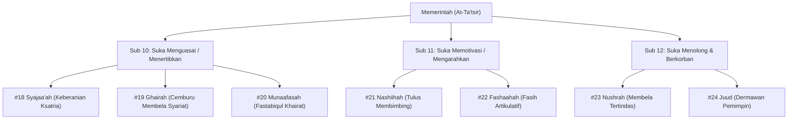

# Bakat Memerintah / Mempengaruhi (التَّأْثِيْر - At-Ta'tsir)

> [!quote] Dalil & Rujukan Nabawiyah Utama
> **Naskah:**  
> « كُلُّكُمْ رَاعٍ، وَكُلُّكُمْ مَسْئُولٌ عَنْ رَعِيَّتِهِ »
>
> *"Setiap kalian adalah pemimpin (penggembala), dan setiap kalian akan dimintai pertanggungjawaban atas apa yang dipimpinnya."*
>
> 📚 **Sumber Rujukan OpenBayan:** HR. Al-Bukhari No. 893 & Muslim No. 1829; Syarah Riyadush Shalihin (Juz 3 Hal. 412); Sunan Abi Dawud.  
> 💡 **Relevansi PKN:** Bakat Memerintah (*At-Ta'tsir*) adalah energi kepemimpinan ekstrovert yang menggerakkan gerbong dakwah, menegakkan amar ma'ruf nahi munkar, membela kaum mustadh'afin, dan mengambil keputusan strategis di garis terdepan.

---

## 1. Hakikat & Kedudukan Konseptual dalam Arsitektur PKN

Dalam sistematika Pendidikan Karakter Nabawiyah, **Bakat Memerintah / Mempengaruhi** lahir dari persilangan antara **Kutub Ekstrovert** (dorongan energi keluar menuju interaksi publik) dan **Dimensi Karsa / Jasad** (*Al-Hawa* yang disublimasikan menjadi ghirah dakwah pada jiwa ammarah).

Karakteristik dominan anak berbakat Memerintah:
* **Keberanian Tampil (*Presence*):** Percaya diri tinggi berbicara di depan orang banyak, berani mengambil risiko, tidak gentar menghadapi konfrontasi terbuka.
* **Naluri Mengatur & Melindungi:** Suka mengorganisir teman bermainnya, membagi tugas, membela kawan yang diintimidasi, dan mengarahkan tujuan kelompok.
* **Bukan Otoriter Diktator:** Kepemimpinan Nabawiyah (*Qiyadah Nabawiyah*) bukan penindasan ego, melainkan **Sayyidul Qaumi Khaadimuhum**—pemimpin sejati adalah pelayan paling depan bagi kaum yang dipimpinnya.

---

## 2. Tujuh Turunan Pilar Karakter TB40 & Inspirasi Shahabat Nabi ﷺ

Bakat Memerintah membawahi **7 Pilar Karakter Mulia (TB40)** yang terbagi ke dalam 3 sub-kelompok Level 18:

### Pilar #18: Syajaa'ah (الشَّجَاعَة - Keberanian Ksatria)
* **Sub-Kelompok:** Suka Menguasai (Ekstrovert + Karsa)
* **Definisi Karakter:** Keteguhan jiwa menghadapi bahaya dan tantangan besar tanpa gentar demi membela kebenaran hakiki.
* **Inspirasi Shahabat Nabi ﷺ:** **Ali bin Abi Thalib radhiyallahu 'anhu**. Pemuda ksatria yang tanpa ragu tidur di ranjang Rasulullah ﷺ menggantikan beliau saat rumah dikepung para algojo Quraisy bersenjata lengkap, serta keberanian beliau meruntuhkan benteng Khaybar.
* **Dalil Otentik OpenBayan:**
  > « الْمُؤْمِنُ الْقَوِيُّ خَيْرٌ وَأَحَبُّ إِلَى اللَّهِ مِنَ الْمُؤْمِنِ الضَّعِيفِ، وَفِي كُلٍّ خَيْرٌ »  
  > *"Mukmin yang kuat lebih baik dan lebih dicintai oleh Allah daripada mukmin yang lemah, meskipun pada masing-masing ada kebaikan."*  
  > 📚 *(HR. Muslim No. 2664, Kitab Al-Qadar)*
* **Diagnosis Deviasi:**
  * *Tafrith (Lalai):* **Jubn (الجُبْن)** — Pengecut, lari dari tanggung jawab. *Kuratif:* Latihan olahraga ketangkasan dan bela diri syar'i.
  * *Ifrath (Berlebih):* **Tahawwur (التَّهَوُّر)** — Nekat ugal-ugalan tanpa perhitungan. *Kuratif:* Wajib tunduk pada pilar *Hikmah* dan *Anaah*.

---

### Pilar #19: Ghairah (الغَيْرَة - Cemburu Membela Kehormatan Syariat)
* **Sub-Kelompok:** Suka Menguasai (Ekstrovert + Karsa)
* **Definisi Karakter:** Kebencian batin yang membuncah ketika aturan syariat Allah dilanggar, aurat keluarga dinistakan, atau martabat Islam direndahkan.
* **Inspirasi Shahabat Nabi ﷺ:** **Sa'ad bin 'Ubadah radhiyallahu 'anhu**. Beliau berkata dengan tegas mengenai pembelaan terhadap kehormatan keluarga, hingga Rasulullah ﷺ bersabda memuji kecemburuannya.
* **Dalil Otentik OpenBayan:**
  > « أَتَعْجَبُونَ مِنْ غَيْرَةِ سَعْدٍ؟ لَأَنَا أَغْيَرُ مِنْهُ، وَاللَّهُ أَغْيَرُ مِنِّي »  
  > *"Apakah kalian merasa heran dengan kecemburuan Sa'ad? Demi Allah, sungguh aku lebih cemburu daripadanya, dan Allah jauh lebih cemburu daripada diriku!"*  
  > 📚 *(HR. Al-Bukhari No. 6846 & Muslim No. 1499)*
* **Diagnosis Deviasi:**
  * *Tafrith (Lalai):* **Diyaatsah (الدِّيَاثَة)** — Permisif, tidak peduli anggota keluarga bermaksiat. *Kuratif:* Tegakkan qowwamah ayah di rumah.
  * *Ifrath (Berlebih):* **Tasyaddud / Tajassus (التَّجَسُّس)** — Curiga berlebihan dan memata-matai privasi orang lain. *Kuratif:* Terapkan kaidah larangan tajassus (QS. Al-Hujurat: 12).

---

### Pilar #20: Munaafasah (المُنَافَسَة - Bersaing dalam Kebaikan)
* **Sub-Kelompok:** Suka Menguasai (Ekstrovert + Karsa)
* **Definisi Karakter:** Ambisi positif untuk menjadi yang terdepan dalam menorehkan amal kebajikan dan prestasi peradaban (*Fastabiqul Khairat*).
* **Inspirasi Shahabat Nabi ﷺ:** **Umar bin Al-Khattab radhiyallahu 'anhu**. Beliau senantiasa berlomba dengan Abu Bakar Ash-Shiddiq dalam berinfaq di jalan dakwah, seperti saat menyumbangkan separuh hartanya dalam Perang Tabuk.
* **Dalil Otentik OpenBayan:**
  > « وَفِي ذَٰلِكَ فَلْيَتَنَافَسِ الْمُتَنَافِسُونَ »  
  > *"Dan untuk yang demikian itu hendaknya orang-orang berlomba-lomba (mencapai surga dan keridhaan Allah)."*  
  > 📚 *(QS. Al-Muthaffifin: 26; Tafsir Ibnu Katsir 8/355)*
* **Diagnosis Deviasi:**
  * *Tafrith (Lalai):* **Dzull / Qunuth (القُنُوْط)** — Patah arang, merasa diri pecundang. *Kuratif:* Berikan target kemenangan-kemenangan kecil (*small wins*).
  * *Ifrath (Berlebih):* **Hasad / Ghill (الحَسَد)** — Dengki, ingin menjatuhkan kawan agar dirinya juara sendiri. *Kuratif:* Didik untuk mendoakan keberkahan kawan (*Ghibthah*).

---

### Pilar #21: Nashiihah (النَّصِيْحَة - Tulus Membimbing)
* **Sub-Kelompok:** Suka Memotivasi (Ekstrovert + Karsa)
* **Definisi Karakter:** Keinginan tulus agar orang lain menjadi lebih baik, gemar memberi bimbingan, arahan, dan teguran yang membangun.
* **Inspirasi Shahabat Nabi ﷺ:** **Jarir bin Abdillah Al-Bajali radhiyallahu 'anhu**. Beliau membai'at Rasulullah ﷺ untuk senantiasa menegakkan shalat, menunaikan zakat, dan bersikap tulus memberi nasihat kepada setiap muslim.
* **Dalil Otentik OpenBayan:**
  > « الدِّينُ النَّصِيحَةُ، قُلْنَا: لِمَنْ؟ قَالَ: لِلَّهِ وَلِكِتَابِهِ وَلِرَسُولِهِ وَلِأَئِمَّةِ الْمُسْلِمِينَ وَعَامَّتِهِمْ »  
  > *"Agama ini adalah nasihat (ketulusan). Kami bertanya: Untuk siapa? Beliau bersabda: Untuk Allah, Kitab-Nya, Rasul-Nya, para pemimpin kaum muslimin, dan masyarakat umum."*  
  > 📚 *(HR. Muslim No. 55, Kitab Al-Iman)*
* **Diagnosis Deviasi:**
  * *Tafrith (Lalai):* **Mudahanah (المُدَاهَنَة)** — Menjilat, mendiamkan kemungkaran demi cari aman. *Kuratif:* Tanamkan amar ma'ruf nahi munkar.
  * *Ifrath (Berlebih):* **Tanfiir / Ta'yir (التَّنْفِير)** — Menasihati di depan umum dengan kasar hingga mempermalukan. *Kuratif:* Nasihati empat mata dengan *Bahasa Hati*.

---

### Pilar #22: Fashaahah (الفَصَاحَة - Fasih Artikulatif)
* **Sub-Kelompok:** Suka Memotivasi (Ekstrovert + Karsa)
* **Definisi Karakter:** Kemampuan merangkai kata dan berorasi secara memikat, menyederhanakan gagasan rumit agar mudah dipahami dan menggerakkan massa.
* **Inspirasi Shahabat Nabi ﷺ:** **Hassan bin Tsabit radhiyallahu 'anhu**. Penyair resmi dakwah Rasulullah ﷺ yang orasi dan syairnya mampu meruntuhkan propaganda kaum musyrikin dengan dukungan Ruhul Qudus (Malaikat Jibril).
* **Dalil Otentik OpenBayan:**
  > « اهْجُهُمْ وَجِبْرِيلُ مَعَكَ »  
  > *"Bantahlah dan balaslah propaganda mereka (melalui syairmu), dan Jibril senantiasa menyertaimu!"*  
  > 📚 *(HR. Al-Bukhari No. 3213 & Muslim No. 2486)*
* **Diagnosis Deviasi:**
  * *Tafrith (Lalai):* **'Ujmah (العُجْمَة)** — Gagap mengungkapkan isi pikiran, kosa kata miskin. *Kuratif:* Latihan membaca nyaring dan bercerita (*storytelling*).
  * *Ifrath (Berlebih):* **Jidaal ‘Aqiim (الجِدَال)** — Pandai bersilat lidah, suka mendebat kusir demi gengsi. *Kuratif:* Peringatkan dengan hadits ancaman bagi ahli jidal.

---

### Pilar #23: Nushrah (النُّصْرَة - Membela Kaum Tertindas)
* **Sub-Kelompok:** Suka Menolong (Ekstrovert + Karsa)
* **Definisi Karakter:** Keberpihakan tegas dan aksi nyata membela orang yang teraniaya serta menghentikan kezaliman para penindas.
* **Inspirasi Shahabat Nabi ﷺ:** **Sa'ad bin Mu'adz radhiyallahu 'anhu**. Pemimpin kaum Anshar yang menjadi benteng pertahanan dakwah Rasulullah ﷺ di Madinah, hingga 'Arsy Allah berguncang saat beliau wafat.
* **Dalil Otentik OpenBayan:**
  > « انْصُرْ أَخَاكَ ظَالِمًا أَوْ مَظْلُومًا، فَقَالَ رَجُلٌ: يَا رَسُولَ اللَّهِ، أَنْصُرُهُ إِذَا كَانَ مَظْلُومًا، أَفَرَأَيْتَ إِذَا كَانَ ظَالِمًا كَيْفَ أَنْصُرُهُ؟ قَالَ: تَحْجُزُهُ عَنِ الظُّلْمِ فَإِنَّ ذَلِكَ نَصْرُهُ »  
  > *"Tolonglah saudaramu baik dia dalam keadaan berbuat zalim maupun dizalimi! Seorang sahabat bertanya: Bagaimana menolongnya jika dia zalim? Beliau bersabda: Engkau cegah dia dari berbuat zalim, itulah cara menolongnya!"*  
  > 📚 *(HR. Al-Bukhari No. 2444 & 6952)*
* **Diagnosis Deviasi:**
  * *Tafrith (Lalai):* **Khidzlaan (الخِذْلَان)** — Apatis, membiarkan saudara dizalimi di depan mata. *Kuratif:* Tumbuhkan solidaritas ukhuwah Islamiyah.
  * *Ifrath (Berlebih):* **'Ashabiyah (العَصَبِيَّة)** — Membela kelompoknya secara membabi buta meski berada di pihak yang salah. *Kuratif:* Ikat loyalitas hanya kepada kebenaran syariat (*Al-Haqq*).

---

### Pilar #24: Juud (الجُوْد - Kedermawanan Pemimpin)
* **Sub-Kelompok:** Suka Menolong (Ekstrovert + Karsa)
* **Definisi Karakter:** Kelapangan tangan mengorbankan sumber daya, tenaga, dan harta pribadi demi menyukseskan misi kepemimpinan umat.
* **Inspirasi Shahabat Nabi ﷺ:** **Abdurrahman bin Auf radhiyallahu 'anhu**. Pemimpin saudagar muslim yang pernah menyedekahkan 700 unta bermuatan penuh bahan makanan untuk seluruh penduduk Madinah, serta mendanai berbagai ekspedisi jihad.
* **Dalil Otentik OpenBayan:**
  > « مَا نَقَصَتْ صَدَقَةٌ مِنْ مَالٍ، وَمَا زَادَ اللَّهُ عَبْدًا بِعَفْوٍ إِلَّا عِزًّا »  
  > *"Tidaklah sedekah itu mengurangi harta, dan tidaklah Allah menambah bagi seorang hamba yang pemaaf melainkan kemuliaan."*  
  > 📚 *(HR. Muslim No. 2588, Kitab Al-Birr wash-Shilah)*
* **Diagnosis Deviasi:**
  * *Tafrith (Lalai):* **Bukhl (البُخْل)** — Kikir, pelit mengeluarkan modal untuk perjuangan. *Kuratif:* Latihan sedekah harian secara sembunyi-sembunyi.
  * *Ifrath (Berlebih):* **Riya' / Sum'ah (الرِّيَاء)** — Dermawan demi pujian gelar pahlawan atau mencari pengaruh politik kotor. *Kuratif:* Murnikan niat ikhlas lillahi ta'ala.

---

---

## 💼 Matriks Panduan Karir Peradaban & Jurusan Studi

Berdasarkan rumusan instrumen asesmen **Tafsir Bakat TB-40 (Manhaj SKIS Semarang)**, berikut adalah panduan praktis penjurusan studi dan orientasi profesi peradaban untuk setiap pilar:

| No | Pilar Karakter | Bahasa Arab | Karakter Inti | Rekomendasi Profesi Peradaban | Rekomendasi Jurusan Studi / Vokasi |
|---|---|:---:|---|---|---|
| 1 | **Syajaa'ah** | الشَّجَاعَة | Berani menghadapi orang langsung untuk memimpin, mengatur, dan melindungi | Komandan Militer/TNI/Polri, Pengusaha, Negosiator, Advokat Pembela Umat, Wartawan Investigasi | Akademi Militer, Akademi Kepolisian, Ilmu Hukum/Syariah, Manajemen Bisnis |
| 2 | **Ghairah** | الغَيْرَة | Cemburu membela kesucian syariat, moralitas umat, dan kehormatan keluarga | Penegak Kode Etik Lembaga, Petugas Pengawas Syariat, Pengawal Kehormatan, Analis Ketahanan | Hukum Pidana Islam, Kriminologi, Manajemen Keamanan, Ketahanan Nasional |
| 3 | **Munaafasah** | المُنَافَسَة | Gairah berkompetisi dalam kebaikan (*fastabiqul khairat*), pantang menyerah dalam prestasi | Atlet Olahraga Sunnah, Koordinator Target Kinerja, Pengembang Prestasi, Manajer Proyek | Ilmu Keolahragaan, Manajemen Kinerja, Marketing & Penjualan, Manajemen Proyek |
| 4 | **Nashiihah** | النَّصِيْحَة | Tulus membimbing, meluruskan kekeliruan, dan memberikan saran solutif | Da'i/Muballigh, Konselor, Supervisor, Pengawas Lembaga, Pelatih Kepemimpinan | Bimbingan Konseling Islam, Ilmu Dakwah, Psikologi, Manajemen SDM |
| 5 | **Fashaahah** | الفَصَاحَة | Fasih bertutur kata, artikulatif, memikat, dan terstruktur dalam menyampaikan pesan | Juru Bicara (Humas), Presenter, Duta Diplomasi, Orator Dakwah, Pengacara Publik | Ilmu Komunikasi, Public Relations, Sastra Arab/Indonesia, Jurnalistik Dakwah |
| 6 | **Nushrah** | النُّصْرَة | Membela dan menolong pihak yang tertindas hingga terbebas dari kesulitan | Advokat LBH Syariah, Petugas SAR Bencana, Pembela Perlindungan Anak, Polisi Pengayom | Ilmu Hukum, Kesejahteraan Sosial, Tarbiyah Khusus, Kriminologi |
| 7 | **Juud** | الجُوْد | Kedermawanan pemimpin, rela mengorbankan modal demi menyukseskan misi umat | Direktur Filantropi/Baitul Mal, Manajer CSR, Pengusaha Donatur Dakwah, Manajer Logistik | Manajemen Zakat & Wakaf, Ekonomi Syariah, Manajemen Keuangan Publik |

---

## 3. Rubrik Observasi Bakat untuk Orang Tua & Pendidik (Rukun 3A)

| Rukun Observasi | Indikator Perilaku Otentik Anak | Catatan Guru / Orang Tua |
| :--- | :--- | :--- |
| **1. Suka (*Interest*)** | Secara alami mengambil inisiatif memimpin barisan, mengatur permainan teman-temannya, berani berbicara mewakili kelompok. | Tidak betah menjadi penonton pasif; ingin selalu terlibat di garis depan pergerakan. |
| **2. Bisa (*Ability*)** | Memiliki kharisma yang ditaati kawan-kawannya; mampu menghentikan perselisihan antar teman dengan ketegasannya. | Mampu berbicara runtut, percaya diri, dan memotivasi orang lain. |
| **3. Bermanfaat (*Utility*)** | Menggunakan kekuatannya untuk melindungi anak yang lebih lemah dari perundungan (*bullying*); mengorganisir kegiatan sosial. | Gerak kepemimpinannya membawa ketertiban dan keadilan di lingkungannya. |

---

## 4. Panduan Pendampingan Berdasarkan 4 Fase Usia Nabawiyah

### A. Fase Thufulah (0–7 Tahun: Jangan Patahkan Keberanian Anak)
* Jangan matikan ego kepemimpinannya dengan label negatif ("kamu suka ngatur-ngatur!").
* Berikan peran kecil di rumah: memimpin doa sebelum makan, memanggil adik untuk shalat.
* Tanamkan empati agar kekuatannya tidak melukai kawan sebayanya.

### B. Fase Tamyiz (7–10 Tahun: Kepemimpinan Berbasis Keteladanan Adab)
* Tanamkan bahwa pemimpin sejati adalah yang paling disiplin menaati aturan syariat.
* Jadikan anak ketua regu saat berkemah atau imam shalat di antara kawan sebayanya.
* Latih seni retorika santun: membedakan antara ketegasan (*Syajaa'ah*) dan kekasaran (*Ghilzhah*).

### C. Fase Murahaqah (10–15 Tahun: Mentoring Tanggung Jawab Nyata)
* Libatkan dalam kepanitiaan dakwah remaja masjid atau OSIS sekolah Islam.
* Ajarkan adab syura (musyawarah): mendengarkan masukan anggota sebelum memutuskan.
* Berikan sanksi mendidik jika ia menyalahgunakan kekuasaan untuk menekan rekannya.

### D. Fase Syabab (15+ Tahun: Panglima Muda Peradaban)
* Siapkan menjadi organisator dakwah kampus, pimpinan ekspedisi kemanusiaan, atau politisi muslim berintegritas.
* Dampingi dengan ulama berilmu agar kepemimpinannya selalu berlandaskan fatwa syar'i yang kokoh.

---

## 5. Profil Karakter, Label Diri, & Terapi Deviasi (Manhaj SKIS)

* **Label Diri (Self-Talk Indikator):** *"Aku terpanggil untuk berada di barisan terdepan, mengambil keputusan tegas demi maslahat bersama, melindungi yang lemah dari kezaliman, dan menggerakkan orang lain menuju keridhaan Allah SWT."*
* **Peta Karir Peradaban (Profesi):** Komandan Militer/Kepolisian, Diplomat/Duta Besar, Advokat Pembela Hak Umat, Eksekutif Perusahaan (CEO), Manajer Kampanye Dakwah, Juru Bicara Publik.
* **Peta Jurusan Studi & Akademik:** Ilmu Hukum & Syariah, Ilmu Pemerintahan & Hubungan Internasional, Manajemen Kepemimpinan, Ilmu Komunikasi & Jurnalistik, Akademi Militer/Kepolisian.
* **Preskripsi Terapi Deviasi (Manhaj SKIS):**
  * *Pemulihan Tafrith (Lalai / Penakut - Jubn):* Kuatkan pilar *Ghairah*, *Himmah*, dan *'Aziimah*. Latih anak mengambil keputusan mandiri, berikan tanggung jawab memimpin secara bertahap, dan hilangkan trauma hukuman masa lalu.
  * *Penyeimbang Ifrath (Berlebih / Otoriter - Taghollub):* Kunci dengan pilar *Rahmah*, *Tawaadhu'*, dan *Hilm*. Tanamkan doktrin nabawi *Sayyidul Qaumi Khaadimuhum* (pemimpin adalah pelayan bagi kaumnya) agar kekuasaan tidak melahirkan arogansi fir'auniah.

---

## 🏛️ Keteladanan Ashabus Rasul: Archetype Rumpun Memerintah & Pola Asuh Nabawi

Berdasarkan telaah kitab *Ashabur Rasul SAW* karya Syaikh Mahmud Al-Mishri (Juz 2) dan rujukan silang *Siyar A'lam An-Nubala* di OpenBayan, rumpun Memerintah menemukan manifestasi puncaknya pada figur-figur shahabat berikut:

### 1. Khalid bin Walid radhiyallahu 'anhu: Karunia Komando Tempur (*Saifullah Al-Maslul*)
* **Manifestasi Bakat:** Memiliki ketajaman insting taktis (*Syajaa'ah* dan *Qiyadah*) yang tidak terkalahkan di lebih dari seratus pertempuran. Beliau mampu membalikkan situasi kritis pada Perang Mu'tah dengan siasat penataan ulang formasi pasukan.
* **Pola Pengasuhan Nabawi:** Rasulullah ﷺ tidak mencela Khalid karena hafalan Al-Qur'annya tidak sebanyak sahabat lainnya, melainkan memuliakan keahlian komandonya dengan gelar *Saifullah Al-Maslul* (Pedang Allah yang Terhunus) dan mengangkatnya memimpin ekspedisi-ekspedisi strategis.
* **Pelajaran untuk Guru/Orang Tua:** Anak yang berjiwa komandan ksatria memerlukan panggung tantangan nyata di lapangan. Jika hanya dikurung di dalam kelas untuk menghafal teks secara pasif tanpa ruang aksi fisik dan strategi, energinya akan berubah menjadi ledakan agresi yang destruktif.

### 2. Umar bin Al-Khatthab radhiyallahu 'anhu: Ketegasan Penegak Keadilan (*Al-Faruq*)
* **Manifestasi Bakat:** *Asyadduhum fi amrillah* (sahabat paling tegas dalam urusan agama Allah). Beliau memiliki wibawa (*Waqaar*) dan keberanian membela syariat (*Ghairah*) yang membuat setan sekalipun mengambil jalan lain saat berpapasan dengannya.
* **Sublimasi Fitrah:** Di masa jahiliyah, energi ketegasan Umar hampir membunuh dakwah Islam; namun setelah disentuh hidayah Al-Qur'an, energi yang sama disublimasikan menjadi perisai kokoh yang melindungi kaum muslimin hingga mereka bisa shalat terang-terangan di Ka'bah.
* **Pelajaran untuk Guru/Orang Tua:** Jangan mengutuk ketegasan dan watak dominan anak sebagai "anak pemberontak" atau "keras kepala". Bimbing energinya dengan tauhid agar menjadi keteguhan prinsip dalam membela kebenaran.

### 3. Amr bin Al-Ash radhiyallahu 'anhu: Kecerdikan Taktis & Diplomasi Kepemimpinan
* **Manifestasi Bakat:** Dikenal sebagai salah satu dari *Daha'ul Arab* (tokoh paling cerdik bangsa Arab). Pada Perang Dzat As-Salasil, beliau melarang pasukan menyalakan api unggun di malam yang sangat dingin demi mencegah musuh mendeteksi jumlah pasukan muslimin, sebuah keputusan yang menuai protes namun dibenarkan oleh Rasulullah ﷺ.
* **Pelajaran untuk Guru/Orang Tua:** Kepemimpinan visioner sering kali melihat konsekuensi jauh ke depan yang tidak dipahami oleh orang kebanyakan. Latih anak berargumen secara logis dan menghargai keputusannya yang visioner.

---

## 6. Tautan Konseptual Terkait
* [[Bakat]] — Peta Lengkap Arsitektur Bakat PKN dan Matriks 40 Sahabat Teladan.
* [[Bahasa Tangan]] — Batasan Tegas Penegakan Disiplin Syar'i dalam Memimpin.
* [[Murahaqah]] — Etape Penggemblengan Tanggung Jawab Taklif.
* [[Syabab]] — Kematangan Mukallaf Menuju Peran Panglima Peradaban.
* [[Panduan Asesmen dan Observasi TB40]] — Instrumen Lengkap 40 Pilar Karakter.

