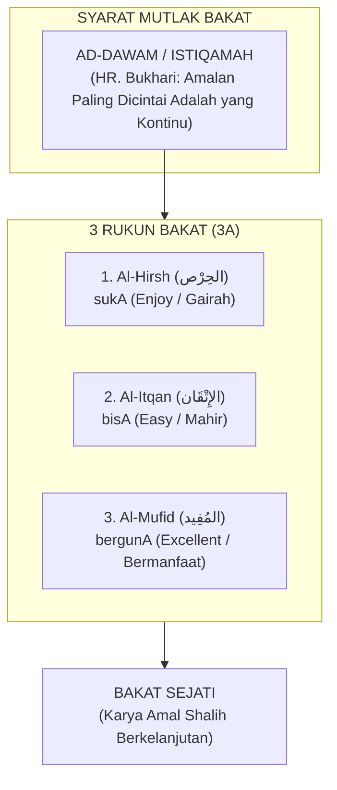

# Karakter Bakat: Menemukan Panggilan Misi Kekhalifahan

> [!note] Catatan Metodologi & Sumber Penyusunan Dokumen
> Dokumen ini merupakan hasil rangkuman dan rekonstruksi berbantuan kecerdasan buatan (AI) dari berbagai materi presentasi, modul kurikulum, dokumen standar lembaga, dan rekaman kajian **Pendidikan Karakter Nabawiyah (PKN)** yang diampu oleh **Ustadz Abdul Kholiq**.  
> 
> Naskah ini telah melalui verifikasi dan pengayaan ulang dalil-dalil Al-Qur'an dan Hadits shahih dari korpus **OpenBayan** (60 kitab klasik), serta diperkaya dengan sintesis intisari dan masukan berharga dari kawan-kawan **Himmatul Ummah**, **Insan Taqwa / Mustaqbal**, dan **Tim SOTAB HEBAT**.

> [!quote] Dalil & Rujukan Nabawiyah
> **Naskah:**  
> « اعْمَلُوا فَكُلٌّ مُيَسَّرٌ لِمَا خُلِقَ لَهُ؛ أَمَّا مَنْ كَانَ مِنْ أَهْلِ السَّعَادَةِ فَيُيَسَّرُ لِعَمَلِ أَهْلِ السَّعَادَةِ »
>
> *"Beramallah kalian, karena masing-masing orang akan dimudahkan untuk menempuh jalan yang telah diciptakan baginya..."*
>
> 📚 **Sumber Rujukan OpenBayan:** HR. Bukhari (No. 4949) & Riyadush Shalihin (Tahqiq Ar-Risalah II, Hal. 295)  
> 💡 **Relevansi PKN:** Setiap anak dibekali keunikan bakat dan kemudahan amal (*isti'dad*) spesifik yang harus diobservasi secara personal ('satu anak satu kurikulum').

> *"Bakat bukanlah sekadar hobi atau keterampilan mencari uang, melainkan rancang bangun fitrah yang Allah sematkan secara unik pada diri setiap hamba untuk memikul tugas kekhalifahan di muka bumi. Sebagaimana sabda Rasulullah ﷺ: 'Bekerjalah kalian, karena masing-masing insan akan dimudahkan menuju takdir penciptaannya (Kullun muyassarun limaa khuliqa lah)'."*  
> — **Ustadz Abdul Kholiq & SOTAB HEBAT**

---

> [!tip] 🌐 Eksplorasi Visual: Peta Bakat & Sifat Manusia (Insan Taqwa)
> Anda dapat menjelajahi peta kluster sifat, potensi fitrah, dan visualisasi 40 pilar bakat manusia secara interaktif melalui aplikasi web resmi:  
> 👉 **[Aplikasi Web Peta Bakat & Sifat Manusia — pub.insantaqwa.org/bakat](https://pub.insantaqwa.org/bakat/)**

## 1. Hakikat Bakat (*Al-Mauhibah & Fitrah*)

Dalam naskah resmi *Seminar 2: Tafsir Bakat TB-40*, **Bakat** secara syar'i diistilahkan sebagai **Al-Mauhibah (المَوْهِبَة)**, yaitu anugerah keistimewaan sifat dan kecondongan fitriah yang Allah sematkan secara unik pada diri setiap hamba sebagai bekal menunaikan peran peradaban.

Landasan teologis penciptaan bakat merujuk pada firman Allah *Subhanahu wa Ta'ala*:
$$\text{وَكُلُّ شَيْءٍ عِنْدَهُ بِمِقْدَارٍ}$$
*"Dan segala sesuatu pada sisi-Nya ada kadarnya (ukuran dan potensinya yang terukur)."* (QS. Ar-Ra'd: 8).

Imam Ibnul Jauzi *rahimahullah* dalam kitab *Al-Hats 'ala Thalabil 'Ilmi* menegaskan:
> *"Di antara hal yang paling wajib diperhatikan oleh para pendidik adalah mengenali tabiat dan potensi anak. Apabila seorang anak dipaksa untuk menekuni bidang ilmu yang bukan bakat dan fitrah penciptaannya, niscaya ia tidak akan pernah berhasil meraih keunggulan dan hanya menghabiskan umurnya dalam kesia-siaan."*

Bakat bukanlah sekadar keterampilan duniawi untuk mencari penghasilan material, melainkan meliputi seluruh sendi kehidupan, termasuk kekhusyukan dalam peribadatan dan jihad peradaban membela agama Allah.

---

## 2. Syarat & Rukun 3A Bakat Nabawiyah

*Formula Rukun 3A Pengembangan Bakat (Alami, Acuhkan Kelemahan Minor, Asah Kekuatan Dominan)*

Sebuah aktivitas dapat divalidasi sebagai **Bakat Sejati** jika memenuhi satu syarat mutlak dan tiga rukun fundamental:

### A. Syarat Mutlak: *Ad-Dawam* (Kontinuitas Amal)
Merujuk pada sabda Rasulullah *shallallahu 'alaihi wa sallam*:
> « أَحَبُّ الأَعْمَالِ إِلَى اللَّهِ أَدْوَمُهَا وَإِنْ قَلَّ »  
> *"Amalan yang paling dicintai oleh Allah adalah amalan yang paling kontinu (dawam/istiqamah), meskipun sedikit."* (HR. Bukhari No. 6464 & Muslim No. 782).

Aktivitas yang hanya digemari sesaat lalu ditinggalkan ketika bosan bukanlah bakat, melainkan letupan emosi sesaat. Bakat sejati memiliki daya tahan (*endurance*) yang membuat pemiliknya terus berkarya secara konsisten.

### B. Tiga Rukun Bakat (3A): Suka, Bisa, Berguna
1. **Al-Hirsh (الحِرْص) $\to$ sukA:** Anak memiliki rasa cinta, gairah alami (*passion*), dan dorongan batin yang kuat untuk melakukannya tanpa perlu disuruh atau diiming-imingi upah.
2. **Al-Itqan (الإِتْقَان) $\to$ bisA:** Anak mampu mempelajarinya dengan cepat (*easy to learn*) dan menghasilkan mutu kerja yang rapi, presisi, serta berkualitas unggul melampaui rata-rata kawan sebayanya.
3. **Al-Mufid (المُفِيد) $\to$ bergunA:** Karyanya tidak berhenti pada kebanggaan ego pribadi, melainkan mendatangkan kemanfaatan nyata bagi keluarga, masyarakat, dan kejayaan umat Islam.

### Komparasi Kritis: Bakat vs Hobi vs Keterampilan Teknis

| Dimensi Pembeda | Bakat Sejati (*Al-Mauhibah*) | Hobi (*Al-Hiwayah*) | Keterampilan Teknis (*Al-Maharah*) |
|---|:---:|:---:|:---:|
| **Komponen Rukun** | **Suka + Bisa + Berguna** | **Suka saja** | **Bisa + Berguna (Tanpa Suka)** |
| **Dorongan Utama** | Panggilan Jiwa & Misi Khilafah | Hiburan & Kesenangan Sesaat | Tuntutan Profesi / Cari Nafkah |
| **Tingkat Kejenuhan** | Tidak Pernah Bosan (*Dawam*) | Cepat Bosan Bila Ada Tren Baru | Rentan Mengalami *Burnout* Parah |
| **Nilai Peradaban** | Melahirkan Karya *Ihsan* Abadi | Terbatas pada Kepuasan Pribadi | Rutinitas Transaksional Mekanik |

---

## 3. Paradigma Reframing: "Bakat Tersembunyi di Balik Kenakalan Anak"

*Kaidah Reframing: Ada Potensi Bakat Tersembunyi di Balik Kenakalan Anak*

Salah satu revolusi cara pandang dalam *Seminar 2: Tafsir Bakat TB-40* adalah kaidah **Reframing Perilaku**. Di mata orang tua konvensional, anak yang berbeda sering dicap "nakal" atau "bermasalah". Namun, kacamata PKN memandang perilaku tersebut sebagai **sinyal energi bakat yang tersumbat dan mencari jalan keluar**:

| Label Negatif Konvensional | Perilaku Anak yang Tampak | Reframing Fitrah: Potensi Pilar TB-40 | Panduan Penyaluran Ma'ruf |
|---|---|---|---|
| *"Suka membantah & cerewet"* | Selalu mendebat perintah, banyak bicara, ingin pembuktian logika | **Fashaahah** (Fasih Bicara) & **Hujjah** (Kuat Dalil) | Salurkan ke forum diskusi, kajian dalil, diplomasi, atau jurnalisme dakwah. |
| *"Hiperaktif & tidak bisa diam"* | Memanjat pohon, berlari kencang, gelisah jika duduk diam lama | **Nasyaath** (Enerjik) & **Syajaa'ah** (Berani) | Berikan porsi olahraga ketangkasan, kepanduan alam, dan peran logistik lapangan. |
| *"Suka membongkar mainan & merusak"* | Mengutak-atik barang elektronik, merusak jam dinding, mencopot baut | **Fathanah** (Cerdas) & **Tafakkur** (Nalar Kritis) | Berikan peralatan bengkel aman, bahan daur ulang, dan proyek rekayasa mesin. |
| *"Keras kepala & ngeyel"* | Menolak instruksi jika tidak sesuai kemauannya, bersikukuh pada target | **'Aziimah** (Tekad Kuat) & **Hazm** (Ketegasan) | Berikan target proyek besar yang menantang dan libatkan dalam penegakan aturan. |
| *"Pelit & hitung-hitungan"* | Sangat menjaga barang miliknya, teliti mencatat uang saku | **Iqtishaad** (Hemat) & **Amaanah** (Teliti) | Berikan amanah bendahara proyek, pembukuan koperasi santri, dan manajemen stok. |
| *"Cengeng & terlalu sensitif"* | Mudah menangis melihat kucing terluka, baper mendengar bentakan | **Rahmah** (Belas Kasih) & **Riqqahtul Qalb** (Lembut Hati) | Tempatkan di divisi pelayanan (*Khidmah*), panti asuhan, atau konseling sebaya. |

---

## 4. Tiga Induk Bakat (*Al-Ummuhat fits-Tafsir*)

Seluruh 40 sifat mulia dalam TB-40 bermuara pada tiga induk bakat nabawiyah:
1. **Induk Memerintah / Memimpin (*Al-Qiyadah fits-Ta'tsir*):** Energi menggerakkan peradaban, menegakkan keadilan, dan mengambil keputusan strategis.
2. **Induk Berpikir / Merumuskan Hikmah (*Al-Fikr wal-Hikmah*):** Energi meneliti ayat kauniyah dan qur'aniyah, menyusun rancang bangun strategi, dan melahirkan karya inovatif.
3. **Induk Melayani / Mempererat Umat (*Al-Khidmah wal-Ulfah*):** Energi menyatukan hati, merawat kaum dhuafa, melayani jamaah, dan menjaga soliditas ukhuwah.

---

## 5. Tahapan Observasi Berdasarkan Usia Anak

1. **Usia 0–7 Tahun (Fase Thufulah): Observasi "SUKA"**  
   - Fokus: Memberikan ragam pengalaman sensorik dan motorik seluas-luasnya di alam terbuka.
   - Amati aktivitas apa yang membuat anak antusias, lupa waktu, dan bergairah melakukannya tanpa disuruh. Jangan menuntut hasil karya atau kualitas di fase ini.
2. **Usia 7–10 Tahun (Fase Tamyiz): Observasi "SUKA & BISA"**  
   - Fokus: Memperhatikan aktivitas yang tidak hanya disukai anak, tetapi juga **mudah ia kuasai (*easy to learn*)** dibanding anak-anak sebayanya.
   - Anak mulai menunjukkan pola konsistensi: cepat mengerti saat membongkar mesin, fasih saat bercerita, atau tekun saat menggambar sketsa.
3. **Usia 10–14 Tahun (Fase Murahaqah): Pembuktian "SUKA, BISA, & BERGUNA"**  
   - Fokus: Mengarahkan bakat menjadi proyek nyata (*Project-Based Learning*) atau magang kerja keluarga (*internship*).
   - Anak diuji: apakah keahliannya mampu memecahkan masalah nyata dan mendatangkan kemanfaatan (*kemanfaatan sosial, ekonomi, atau dakwah*) bagi keluarga dan umat?

## 6. Kaidah Emas Pembinaan Bakat

### A. Fokus pada Kekuatan, Siasati Kelemahan
Paradigma sekolah modern sering terjebak dalam obsesi *"meratakan semua nilai rapor"*. Anak yang lemah matematika dipaksa les berjam-jam hingga lelah, sementara bakat sastranya yang luar biasa dibiarkan layu.

Islam mengajarkan prinsip terbalik:
- **Melejitkan Kekuatan (*Fadhilah*):** Asah pilar bakat dominan anak hingga mencapai derajat *Ihsan* (keahlian kelas dunia yang bernilai ibadah).
- **Menyiasati Kelemahan:** Kelemahan pada anak cukup dipenuhi pada batas standar minimal (*fardhu 'ain*) agar tidak menjerumuskannya ke dalam maksiat atau ketidakmampuan hidup mandiri, lalu bangun sinergi kemitraan (*Ta'aawun*) dengan orang lain yang memiliki kelebihan di bidang tersebut.

### B. Bahaya Penjurusan Prematur
Berdasarkan ulasan SOTAB HEBAT (*Penjurusan Prematur*), memaksa anak memilih satu jurusan kaku di usia dini sebelum tuntas eksplorasi fitrahnya adalah bentuk pengebirian potensi. Anak butuh spektrum pengalaman yang kaya sebelum mengerucutkan fokus pada karir spesifiknya saat baligh.

### C. Menghargai Anak Berkehebatan Khusus (ABK)
Dalam pandangan PKN, **tidak ada anak yang gagal diciptakan Allah**. Anak-anak dengan kebutuhan khusus (ABK, autis, ADHD, atau disleksia) sejatinya adalah insan yang membawa *"kehebatan khusus"*. Anak hiperaktif sering kali menyimpan potensi besar pilar *Nasyaath* (pekerja keras tangguh) atau *Syajaa'ah* (keberanian tinggi). Mereka sebaiknya tidak diisolasi, melainkan diikutsertakan bersama teman-temannya saat belajar di alam terbuka untuk melatih adaptasi sosial dan menumbuhkan rasa percaya diri.

---

## 7. Enam Kategori Bakat Utama (Level 6)

Persilangan antara Kutub Energi Sosial (Introvert vs Extrovert) dan Dimensi Jiwa (Karsa, Cipta, Rasa) menghasilkan 6 kluster bakat utama yang menaungi [[CONTENT_ANALYSIS#3.5-tingkat-40-katalog-komprehensif-40-pilar-karakter-nabawiyah|40 Pilar Karakter Nabawiyah (TB40)]]:

1. **[[Bekerja Keras]] (الحَمَاسَة):** Introvert + Karsa — Daya tahan fisik, ambisi tinggi, tekad membaja.
2. **[[Berpikir]] (التَّفْكِيْر):** Introvert + Cipta — Ketajaman analisa nalar, perumusan hikmah, kreativitas solusi.
3. **[[Berperasaan]] (الشُعُوْر):** Introvert + Rasa — Kepekaan nurani batin, kejujuran apa adanya, kerendahan hati.
4. **[[Memerintah]] / Mempengaruhi (التَّأْثِيْر):** Extrovert + Karsa — Keberanian memimpin, menggerakkan massa, ketegasan membela.
5. **[[Bekerja Sama]] (التَّعَامُل):** Extrovert + Cipta — Menjalin diplomasi, mencairkan suasana, mempererat ukhuwah.
6. **[[Melayani]] (الخِدْمَة):** Extrovert + Rasa — Kedermawanan sosial, mendahulukan orang lain, kesabaran melayani.

---

---

## 8. Ashabus Rasul: Mahkota & Bukti Empiris Sejarah Fitrah Bakat

> [!quote] Hadits Pemetaan Fitrah Sahabat Nabi ﷺ
> **Naskah:**  
> « أَرْحَمُ أُمَّتِي بِأُمَّتِي أَبُو بَكْرٍ، وَأَشَدُّهُمْ فِي دِينِ اللَّهِ عُمَرُ، وَأَصْدَقُهُمْ حَيَاءً عُثْمَانُ، وَأَعْلَمُهُمْ بِالْحَلَالِ وَالْحَرَامِ مُعَاذُ بْنُ جَبَلٍ، وَأَقْرَؤُهُمْ لِكِتَابِ اللَّهِ أُبَيٌّ، وَأَعْلَمُهُمْ بِالْفَرَائِضِ زَيْدُ بْنُ ثَابِتٍ، وَلِكُلِّ أُمَّةٍ أَمِينٌ، وَأَمِينُ هَذِهِ الْأُمَّةِ أَبُو عُبَيْدَةَ بْنُ الْجَرَّاحِ »
>
> *"Orang yang paling penyayang di antara umatku adalah Abu Bakar, yang paling tegas dalam menegakkan agama Allah adalah Umar, yang paling pemalu adalah Utsman, yang paling mengetahui halal dan haram adalah Mu'adz bin Jabal, yang paling ahli membaca Al-Qur'an adalah Ubay (bin Ka'ab), yang paling mengetahui ilmu waris adalah Zaid bin Tsabit, dan setiap umat memiliki orang kepercayaan, dan orang kepercayaan umat ini adalah Abu Ubaidah bin Al-Jarrah."*  
> 📚 **Sumber Rujukan:** HR. Ahmad (3:184), At-Tirmidzi (No. 3802), Ibnu Majah (No. 154); *Siyar A'lam An-Nubala* (Adz-Dzahabi); *Ashabur Rasul* (Syaikh Mahmud Al-Mishri).

Generasi Sahabat Nabi ﷺ (*Ashabur Rasul*) adalah mahkota pembuktian sejarah paling otentik bahwa **konsep diferensiasi potensi bawaan (fitrah bakat) adalah Sunnah Nabawiyah murni**, bukan sekadar konstruksi psikologi modern. Mereka menjadi generasi terbaik (*Khairul Qurun*) bukan karena mereka seragam seperti tentara cetakan pabrik, melainkan karena mereka **beragam dalam peran dan saling menggenapi (*At-Takamul*) dalam satu tauhid**:

1. **Rasulullah ﷺ Mendidik di Atas Poros Keunikan Fadhilah:**  
   Nabi ﷺ tidak pernah memaksa Khalid bin Walid untuk menjadi ahli fara'idh atau penghafal seluruh ayat Al-Qur'an, melainkan menobatkan beliau sebagai *Saifullah Al-Maslul* (panglima tempur). Beliau juga tidak memaksakan Zaid bin Tsabit memimpin barisan kavaleri depan, melainkan mempercayakan tugas kodifikasi mushaf dan penguasaan bahasa asing kepadanya.
2. **Kelemahan Bukan Aib, Melainkan Batasan Domain:**  
   Ketika sahabat mulia Abu Dzar Al-Ghifari memohon jabatan pemerintahan, Rasulullah ﷺ dengan penuh kasih bersabda: *"Wahai Abu Dzar, sesungguhnya engkau lemah, dan jabatan itu adalah amanah yang pada hari kiamat menjadi kehinaan dan penyesalan kecuali bagi yang mengambilnya dengan hak dan menunaikan kewajibannya"* (HR. Muslim No. 1825). Kelemahan administratif manajerial Abu Dzar tidak menurunkan derajat kezuhudannya (*Ashdaqu Lahjah*); Nabi ﷺ melindunginya dari peran yang tidak selaras dengan fitrahnya.
3. **Konsep Tabiat Bawaan (*Jubilta 'Alaihima*):**  
   Kepada Asyaj Abdul Qais, Nabi ﷺ bersabda: *"Sesungguhnya pada dirimu ada dua sifat yang dicintai Allah: Al-Hilm (santun) dan Al-Anaah (tidak tergesa-gesa)."* Saat Asyaj bertanya apakah itu hasil usahanya atau bawaan sejak lahir, Nabi ﷺ menegaskan bahwa Allah-lah yang menciptakan fitrahnya di atas dua tabiat mulia tersebut (HR. Abu Dawud No. 5225).

---

### Matriks Akbar 40 Pilar Bakat TB-40 vs. Figur Sahabat Nabi ﷺ (*Archetype Matrix*)

Berikut adalah pemetaan komprehensif 40 pilar karakter TB-40 terhadap figur-figur teladan sahabat, disintesis dari karya ensiklopedis **Syaikh Mahmud Al-Mishri (*Ashabur Rasul SAW*, Maktabah Dar At-Taqwa)** dan rujukan silang korpus turats Islam di **OpenBayan** (*Siyar A'lam An-Nubala*, *Ath-Tabaqat Al-Kubra*, *Al-Ishabah*, *Rijal Hawla Ar-Rasul*, *Shuwar min Hayatish Shahabah*):

| No | Pilar Karakter | Rumpun | Figur Sahabat Teladan (*Archetype*) | Landasan Dalil & Riwayat Nabawi | Referensi Literatur |
|:---:|:---|:---|:---|:---|:---|
| 1 | **Himmah** (Cita-cita Tinggi) | Bekerja Keras | **Rabi'ah bin Ka'ab Al-Aslami** | Meminta menyertai Nabi ﷺ di surga saat ditanya hajatnya. | *Siyar* 3/14; *Ashabur Rasul* |
| 2 | **Ihsaan** (Perfeksionis) | Bekerja Keras | **Zaid bin Tsabit** | Meneliti setiap ayat dengan dua saksi tertulis saat kodifikasi. | *Fathul Bari* 9/12; OpenBayan |
| 3 | **'Izzah** (Harga Diri Mukmin) | Bekerja Keras | **Sa'ad bin Mu'adz** | Menolak memberikan kurma Madinah sebutir pun kepada Ahzab. | *Ashabur Rasul* Juz 1; *Siyar* |
| 4 | **Waqaar** (Kewibawaan Tenang) | Bekerja Keras | **Utsman bin Mazh'un** | Keteguhan wibawa zuhud dan ketenangan ibadah tanpa silau dunia. | *Al-Ishabah* No. 5449 |
| 5 | **'Aziimah** (Tekad Membaja) | Bekerja Keras | **Khabbaab bin Al-Aratt** | Bertahan di atas bara api tanpa pernah mengkhianati tauhid. | *Rijal Hawla Ar-Rasul* |
| 6 | **Nasyaath** (Semangat Tangguh) | Bekerja Keras | **Salamah bin Al-Akwa'** | Pelari cepat pejalan kaki penumpas musuh di Dzi Qarad. | HR. Muslim 1807; *Ashabur Rasul* |
| 7 | **Firaasah** (Ketajaman Intuisi) | Berpikir | **Umar bin Al-Khatthab** | *Al-Muhaddats*: firasatnya bersesuaian dengan turunnya wahyu. | HR. Bukhari 3689; *Siyar* 2/85 |
| 8 | **Nubl** (Kecerdikan Solutif) | Berpikir | **Salman Al-Farisi** | Solusi taktis menggali parit (*Khandaq*) yang belum dikenal Arab. | *Shuwar min Hayatish Shahabah* |
| 9 | **Dzakaa'** (Kecerdasan Nalar) | Berpikir | **Ali bin Abi Thalib** | *Aqdhaahum*: rujukan fatwa dan pemecah kebuntuan kasus rumit. | HR. At-Tirmidzi 3723 |
| 10 | **Hikmah** (Kedalaman Fiqih) | Berpikir | **Mu'adz bin Jabal** | Ahli halal-haram; diutus memimpin dakwah dan qadhi Yaman. | HR. Ahmad 3/184; *Ashabur Rasul* hlm. 365 |
| 11 | **Shamt** (Bicara Seperlunya) | Berpikir | **Abu Ad-Darda'** | Mengutamakan perenungan, tafakkur, dan sedikit berbicara sia-sia. | *Hilyatul Awliya'* 1/208 |
| 12 | **Husnuzhan** (Prasangka Baik) | Berperasaan | **Abu Ayyub Al-Anshari** | Membela kesucian Sayyidah Aisyah saat fitnah *Haditsul Ifki*. | QS. An-Nur: 12; Tafsir Ibnu Katsir |
| 13 | **Shidq** (Kejujuran Lurus) | Berperasaan | **Abu Dzar Al-Ghifari** | *Ashdaqu lahjah*: manusia paling jujur di bawah kolong langit. | HR. At-Tirmidzi 3802; *Ashabur Rasul* hlm. 217 |
| 14 | **'Iffah** (Menjaga Kehormatan) | Berperasaan | **Mush'ab bin Umair** | Meninggalkan kemewahan Makkah demi kesucian kehormatan iman. | *Ashabur Rasul* Juz 1 |
| 15 | **Hayaa'** (Rasa Malu Syar'i) | Berperasaan | **Utsman bin Affan** | *Ashdaquhum haya'an*: para malaikat pun malu kepada ketulusannya. | HR. Muslim 2401; *Ashabur Rasul* |
| 16 | **Qanaa'ah** (Merasa Cukup) | Berperasaan | **Sa'id bin 'Amir Al-Jumahi** | Gubernur Homs yang hidup dalam daftar penerima santunan fakir. | *Shuwar min Hayatish Shahabah* |
| 17 | **Shabr** (Ketabahan Jiwa) | Berperasaan | **Keluarga Yasir (Ammar, Sumayyah)** | *Shafwatush Shabirin*: janji surga atas siksaan keji di padang pasir. | HR. Al-Hakim; *Al-Ishabah* |
| 18 | **Syajaa'ah** (Keberanian Ksatria) | Memerintah | **Khalid bin Walid** | Panglima tak terkalahkan di puluhan palagan; *Saifullah*. | *Ashabur Rasul* hlm. 263; *Siyar* 1/369 |
| 19 | **Ghairah** (Cemburu Syariat) | Memerintah | **Sa'ad bin 'Ubadah** | Sangat cemburu menjaga kehormatan; dipuji oleh Rasulullah ﷺ. | HR. Bukhari 6846; *Muslim* 1499 |
| 20 | **Munaafasah** (Fastabiqul Khairat) | Memerintah | **Umar vs Abu Bakar** | Perlombaan sedekah separuh vs seluruh harta pada Perang Tabuk. | HR. Abu Dawud 1678 |
| 21 | **Nashiihah** (Tulus Membimbing) | Memerintah | **Jarir bin Abdillah Al-Bajali** | Membaiat Nabi untuk selalu memberi nasihat bagi setiap muslim. | HR. Bukhari 57; *Muslim* 56 |
| 22 | **Fashaahah** (Fasih Mempengaruhi) | Memerintah | **Ja'far bin Abi Thalib** | Pidato diplomasi fasih di hadapan Raja Najasyi Habasyah. | *Sirah Ibnu Hisyam*; OpenBayan |
| 23 | **Nushrah** (Membela Tertindas) | Memerintah | **Zubair bin Al-Awwam** | *Hawariyyur Rasul*: orang pertama yang menghunus pedang di Makkah. | HR. Bukhari 2997; *Ashabur Rasul* |
| 24 | **Juud** (Dermawan Pemimpin) | Memerintah | **Thalhah bin Ubaidillah** | Dijuluki *Thalhah Al-Khair* dan *Thalhah Al-Juud* saat berinfak. | *Siyar A'lam An-Nubala* 1/23 |
| 25 | **Ta'aawun** (Kerja Sama Sinergis) | Bekerja Sama | **Kaum Anshar & Muhajirin** | *Mu'akhah*: membagi rumah, ladang, dan usaha demi dakwah. | QS. Al-Hasyr: 9; *Bukhari* 2293 |
| 26 | **Ulfah** (Mudah Menyatukan) | Bekerja Sama | **Abu Hurairah** | Mengumpulkan sahabat di Shuffah dan mencintai kebersamaan. | *Hilyatul Awliya'* 1/376 |
| 27 | **Mahabbah** (Penuh Kasih Sayang) | Bekerja Sama | **Zaid bin Haritsah** | *Hibbur Rasul*: cinta mendalam Nabi dan para sahabat kepadanya. | *Ashabur Rasul* Juz 1 |
| 28 | **'Adaalah** (Keadilan Objektif) | Bekerja Sama | **Abdullah bin Rawahah** | Menilai bagi hasil kurma Khaibar secara presisi tanpa curang. | *Muwaththa' Malik* No. 1324 |
| 29 | **Muzaah** (Humor Edukatif Santun) | Bekerja Sama | **Nu'aiman bin Amr Al-Anshari** | Humor cerdas yang menghibur Rasulullah dan mencairkan suasana. | *Al-Ishabah* No. 8740; *Siyar* |
| 30 | **Mulaathafah / Rifq** (Kelembutan) | Bekerja Sama | **Abdullah bin Mas'ud** | Membimbing murid-murid Kufah dengan sentuhan tutur kata lembut. | *Ath-Tabaqat Al-Kubra* 3/150 |
| 31 | **Hamaasah** (Gairah Antusias) | Bekerja Sama | **Umair bin Al-Humam** | Membuang kurma di Badar demi segera menyongsong surga. | HR. Muslim 1901 |
| 32 | **Kitmaanus Sirr** (Menjaga Rahasia) | Bekerja Sama | **Hudzaifah ibnul Yaman** | *Shahibu Sirrir Rasul*: pemegang tunggal daftar nama kaum munafik. | *Ashabur Rasul* Juz 1; *Siyar* |
| 33 | **Tawaadhu'** (Rendah Hati) | Melayani | **Abu Ubaidah bin Al-Jarrah** | Rela berada di bawah komando Khalid bin Walid tanpa tersinggung. | *Ashabur Rasul* Juz 1; *Siyar* |
| 34 | **Satr** (Menutup Aib Sesama) | Melayani | **Abu Bakar Ash-Shiddiq** | Membeli budak tersiksa dan menutup masa lalu kelam mereka. | *Sirah Ibnu Hisyam* |
| 35 | **Wafaa'** (Tepat Janji Teguh) | Melayani | **Hudzaifah & Ayahnya (Husail)** | Menepati janji pada kafir Quraisy untuk tidak ikut perang Badar. | HR. Muslim 1787 |
| 36 | **Rahmah** (Kasih Sayang Terbuka) | Melayani | **Abu Bakar Ash-Shiddiq** | *Arhamu ummati bi ummati*: hati selembut sutra yang mudah menangis. | HR. Ahmad 3/184 |
| 37 | **Amaanah** (Integritas Kredibel) | Melayani | **Abu Ubaidah bin Al-Jarrah** | *Aminu hadzihil ummah*: utusan penengah konflik Yaman dan Najran. | HR. Bukhari 4380 |
| 38 | **Hilm** (Santun Pengendali Diri) | Melayani | **Ashaj Abdul Qais** | Tidak terburu-buru menghakimi dan menahan amarah secara elegan. | HR. Abu Dawud 5225 |
| 39 | **Anaah** (Tenang Penuh Perhitungan) | Melayani | **Amr bin Al-Ash** | Menolak menyalakan api di Dzat As-Salasil demi keselamatan pasukan. | *Sunan Abu Dawud* 334; *Ashabur Rasul* |
| 40 | **Iitsaar** (Mendahulukan Orang Lain) | Melayani | **Ikrimah, Suhail, Al-Harits** | Saling mempersilakan air minum saat sekarat di Perang Yarmuk. | *Al-Mustadrak Al-Hakim* 3/270 |

---

### Pedagogi Nabawi: Storytelling Sahabat Berbasis Profil Bakat Anak

Dalam ekosistem sekolah dan keluarga PKN, pembacaan Sirah Sahabat (*Qashashush Shahabah*) tidak diberikan secara acak atau sekadar dongeng pengantar tidur. Pendidik menerapkan kaidah **Isyhadul Uswah (Menghadirkan Teladan Relevan)**:

1. **Sinkronisasi Figur dengan Dominansi Pilar Anak:**  
   * Anak yang terobservasi memiliki bakat *Fashaahah* dan *Syajaa'ah* (berani tampil, suka memimpin) didekatkan dengan kisah **Ja'far bin Abi Thalib** dan **Umar bin Al-Khatthab**.
   * Anak yang pendiam, teliti, dan suka memecahkan teka-teki (*Dzakaa'* dan *Hikmah*) didekatkan dengan kisah **Ali bin Abi Thalib**, **Mu'adz bin Jabal**, dan **Zaid bin Tsabit**.
   * Anak yang sangat penyayang, peka perasaan temannya (*Rahmah*, *Tawaadhu'*) didekatkan dengan kisah **Abu Bakar Ash-Shiddiq** dan **Anas bin Malik**.
2. **Menghadirkan Idola Fitrah (*Fitrah Idols*):**  
   Anak yang mengenal figur sahabat yang memiliki kemiripan fitrah dengannya tidak akan merasa minder atau aneh dengan karakternya. Ia memiliki gambaran konkret ke mana potensi itu harus bermuara: **menjadi pembela risalah dan pemakmur bumi (*khalifah fil ardh*)**.
3. **Mengikis Infantilisasi Remaja:**  
   Melihat Usamah bin Zaid memimpin pasukan di usia 18 tahun, Zaid bin Tsabit menguasai bahasa asing dalam hitungan minggu di usia 13 tahun, dan Mush'ab bin Umair menjadi diplomat ulung di usia belia, menyalakan gairah kedewasaan (*Rijal*) pada fase *Syabab*.

---

## 9. Rujukan Kajian Video Terkait (PKN Video Database)

* *Observasi Bakat Berdasarkan Usia Anak: Suka, Bisa, Berguna* — [Tonton di YouTube @ 01:32](https://www.youtube.com/watch?v=6e_Yy3AXbj4&t=92s)
* *Bakat Tersembunyi di Balik Kenakalan Anak* — [Tonton di YouTube @ 60:19](https://www.youtube.com/watch?v=w04OJijPmQk&t=3619s)
* *Tanya Jawab: Apakah Anak ABK Perlu Dipisah atau Dicampur?* — [Tonton di YouTube @ 55:14](https://www.youtube.com/watch?v=hODlNvl6qcc&t=3314s)
* *Kisah Sahabat Abu Dzar: Mengenal Kelemahan dan Mengakui Kekuatan* — [Tonton di YouTube @ 01:23](https://www.youtube.com/watch?v=Jl28ARzLW8g&t=83s)

---

## 10. Navigasi Instrumen & Panduan Terkait

* 🌐 **[Aplikasi Web Peta Bakat & Sifat Manusia (Insan Taqwa)](https://pub.insantaqwa.org/bakat/)** — Visualisasi interaktif spektrum sifat dan 40 pilar bakat.

* [[Insan/Fitrah (Karakter)/Bakat/Kuisioner Asesmen 40 Bakat Nabawiyah|Kuisioner Asesmen 40 Bakat Nabawiyah]] — Instrumen baku self-assessment 40 butir Likert 5 tingkat, teks Arab, deskriptor perilaku, dan rekapitulasi kluster.
* [[Panduan Asesmen dan Observasi TB40]] — Pedoman komprehensif instrumen 40 pilar, Likert 0–100 vs Ipsative 360°, dan pemetaan karir peradaban.
* [[Panduan RPP dan Observasi Lapangan]] — Template RPP Karakter, instrumen kuisioner pertumbuhan, dan checklist harian 40 pilar.
* [[8 Standar Implementasi PKN]] — Klausul 8 Perencanaan Kurikulum Bakat dan Klausul 10 Pendewasaan.
* [[Kaidah Implementasi di Berbagai Lembaga]] — Standardisasi kurikulum fitrah di sekolah formal, pesantren, dan komunitas homeschooling.

---

*Makna Hakiki Al-Mauhibah (Bakat): Karunia Allah yang Melekat Kuat*

> [!quote] Dokumen & Slide Presentasi Rujukan Resmi PKN
> Pembahasan dalam artikel ini bersumber langsung dari materi tayang pelatihan dan dokumen kurikulum resmi PKN oleh **Ustadz Abdul Kholiq**:
>
> - **Materi:** *BAKAT - TB - 40 (Tafsir Bakat 40 Karakter Nabawiyah)*
>   - 📖 **Rujukan Slide:** Slide Hal. 20–85 (Konsep Al-Mauhibah, Silsilah 6 Rumpun Bakat, 18 Sub-Kelompok, & Taksonomi 40 Sifat)
>   - 🔗 **Akses Berkas:** [📥 Unduh PDF (11.2 MB)](https://www.dropbox.com/scl/fi/ws2rfs4dlnhiv4zfzg4bg/2.-BAKAT-TB-40.pdf?rlkey=tw82umdj2dljhrc1h4fb0gtgt&dl=1) • [📊 Unduh PPTX Asli (8.0 MB)](https://www.dropbox.com/scl/fi/9xroycr8405dd7a0bwpi0/2.-BAKAT-TB-40.pptx?rlkey=1du37yttvbovjte96quzez1b7&dl=1) • [👁️ Buka di Dropbox](https://www.dropbox.com/scl/fi/ws2rfs4dlnhiv4zfzg4bg/2.-BAKAT-TB-40.pdf?rlkey=tw82umdj2dljhrc1h4fb0gtgt&dl=0)
>
> - **Materi:** *Materi Seminar 2: Kupas Tuntas Tafsir Bakat TB-40*
>   - 📖 **Rujukan Slide:** Slide Hal. 30–120 (Formula Asesmen, Analisis Tafrith vs Ifrath, Rukun 3A, dan Pemetaan Karir Peradaban)
>   - 🔗 **Akses Berkas:** [📥 Unduh PDF (24.6 MB)](https://www.dropbox.com/scl/fi/of5hkad2jl8evdbx86o2y/Materi-Seminar-2_-Tafsir-Bakat-TB-40.pdf?rlkey=m1qcgt0bmcwsjsmtvuw58m3q0&dl=1) • [👁️ Buka di Dropbox](https://www.dropbox.com/scl/fi/of5hkad2jl8evdbx86o2y/Materi-Seminar-2_-Tafsir-Bakat-TB-40.pdf?rlkey=m1qcgt0bmcwsjsmtvuw58m3q0&dl=0)
>
> - **Materi:** *1. 40 PILAR KARAKTER diurai dalam KURIKULUM*
>   - 📖 **Rujukan Slide:** Slide Hal. 12–48 (Operasionalisasi Bakat ke dalam RPP & Pembelajaran Berbasis Proyek Siswa)
>   - 🔗 **Akses Berkas:** [📥 Unduh PDF (7.9 MB)](https://www.dropbox.com/scl/fi/64vqc29u401ei6qhemuru/1.-40-PILAR-KARAKTER-diurai-dalam-KURIKULUM.pdf?rlkey=absjy37qzld7hq6ross1pryzm&dl=1) • [📊 Unduh PPTX Asli (8.8 MB)](https://www.dropbox.com/scl/fi/r8imh9ciuosapo7sghuno/1.-40-PILAR-KARAKTER-diurai-dalam-KURIKULUM.pptx?rlkey=yky4b5dptr6v9fzszc4qvxwyd&dl=1) • [👁️ Buka di Dropbox](https://www.dropbox.com/scl/fi/64vqc29u401ei6qhemuru/1.-40-PILAR-KARAKTER-diurai-dalam-KURIKULUM.pdf?rlkey=absjy37qzld7hq6ross1pryzm&dl=0)

