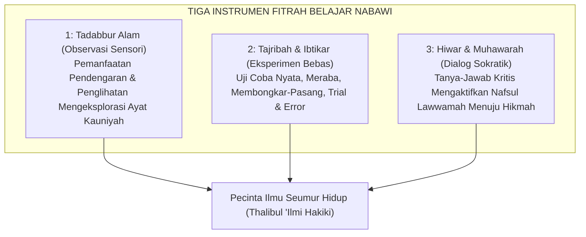
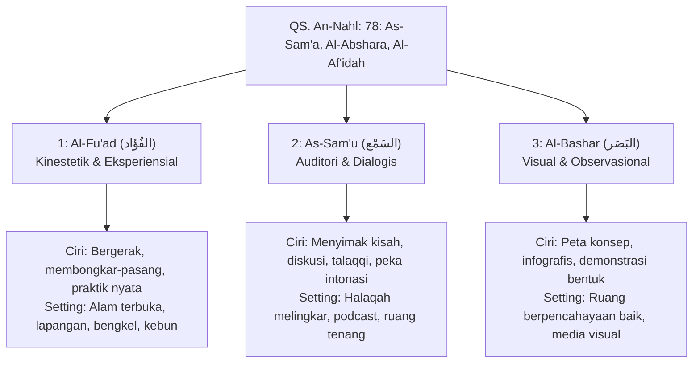

> [!info] Refleksi Lapangan: Mogok Belajar Akibat Desensitisasi Fitrah Intelektual
> **Kondisi Faktual:** Anak usia 8 tahun (kelas 2 SD) mulai menunjukkan keengganan membuka buku, menangis histeris saat disuruh mengerjakan PR, dan mengeluh kepalanya pusing setiap kali jam belajar tiba.  
> **Akar Masalah PKN:** Penjejangan kognitif massal gaya Prusia yang memaksa anak duduk diam 6 jam sehari sambil menghafal rumus abstrak, mematikan rasa ingin tahu alami (*curiosity*) dan menguras tangki cinta tanpa memberi ruang gerak fisik kinestetik.  
> **Langkah Penanganan Nabawiyah:**  
> 1. Hentikan intimidasi nilai rapor; alihkan media belajar ke observasi alam nyata di luar ruangan (*outdoor living books*).  
> 2. Sambungkan kembali jembatan emosi (*Bahasa Hati*) melalui pelukan dan apresiasi atas minat unik anak.  
> 3. Kenalkan adab sebelum ilmu (*Al-Adab Qablal 'Ilm*) agar proses menuntut ilmu dirasakan sebagai ibadah yang menggembirakan.

> [!warning] Peringatan Risiko Pengasuhan: Bahaya Menghukum Kegagalan Akademik Anak
> * **Bentuk Kesalahan:** Membentak, memberi cap "pemalas / bodoh", atau mencabut hak bermain anak karena nilai ujian yang rendah.
> * **Dampak Terhadap Jiwa:** Merusak fitrah keimanan pada takdir (*qadar*), mematikan insting eksplorasi nalar (*Al-Fu'ad*), serta memicu mentalitas penipu (*cheating syndrome*) demi sekadar menghindari murka orang tua.
> * **Pencegahan Nabawiyah:** Rasulullah ﷺ tidak pernah sekalipun mencela Anas bin Malik RA selama 10 tahun berkhidmah atas pekerjaan yang belum sempurna dikerjakan. Fokuslah pada proses kesungguhan ikhtiar, bukan angka mutlak di atas kertas.

> [!tip] Tips Praktis Pengasuhan Hari Ini
> * **Aksi Sederhana:** Ganti pertanyaan klise saat anak pulang: *"Dapat nilai berapa tadi?"* dengan pertanyaan fitrah: *"Apa hal baru paling menakjubkan yang kamu pelajari hari ini, Nak?"*
> * **Tujuan:** Menyalakan pelita gairah cinta ilmu (*Syaghaf bil 'Ilm*) dan menanamkan bahwa belajar adalah petualangan seumur hidup.

---
title: "Fitrah Belajar"
---

# Fitrah Belajar: Dari Kebebasan Eksplorasi Menuju Nalar Hikmah

> [!note] Catatan Metodologi & Sumber Penyusunan Dokumen
> Dokumen ini merupakan hasil rangkuman dan rekonstruksi berbantuan kecerdasan buatan (AI) dari berbagai materi presentasi, modul kurikulum, dokumen standar lembaga, dan rekaman kajian **Pendidikan Karakter Nabawiyah (PKN)** yang diampu oleh **Ustadz Abdul Kholiq**.  
> 
> Naskah ini telah melalui verifikasi dan pengayaan ulang dalil-dalil Al-Qur'an dan Hadits shahih dari korpus **OpenBayan** (60 kitab klasik), serta diperkaya dengan sintesis intisari dan masukan berharga dari kawan-kawan **Himmatul Ummah**, **Insan Taqwa / Mustaqbal**, dan **Tim SOTAB HEBAT**.

Dalam paradigma Pendidikan Karakter Nabawiyah (PKN), **Fitrah Belajar dan Bernalar** (*Fitratut Ta'allum wal 'Aql*) adalah instrumen kognitif agung yang dianugerahkan Allah kepada setiap manusia untuk mengeksplorasi ayat-ayat-Nya, baik ayat kauniyah yang terhampar di alam semesta maupun ayat qauliyah yang termaktub di dalam wahyu Al-Qur'an. Manusia tidak diciptakan dalam keadaan dungu permanen; Allah membekali manusia sejak dalam rahim dengan potensi pendengaran, penglihatan, dan hati nurani (*as-sam'a wal abshara wal af'idah*) agar mereka mampu belajar dan bersyukur.

Pendidikan modern bergaya industrial sering kali mereduksi fitrah belajar yang mulia ini menjadi sekadar hafalan mekanis, duduk diam mendengarkan satu arah di ruang kelas tertutup, demi mengejar standarisasi nilai ujian yang seragam. PKN merekonstruksi hakikat belajar kembali ke fitrah nabawiyah: **belajar adalah petualangan spiritual yang menyenangkan, didorong oleh rasa ingin tahu (*curiosity*) yang murni, dipandu oleh metodologi eksperimen (*tajribah*), dan bermuara pada lahirnya hikmah serta ketundukan kepada Sang Maha Mengetahui (*Al-'Alim*)**.

> [!quote] Dalil & Rujukan Nabawiyah: Penganugerahan Instrumen Belajar
> **Teks Al-Qur'an:**  
> « وَعَلَّمَ آدَمَ الْأَسْمَاءَ كُلَّهَا ثُمَّ عَرَضَهُمْ عَلَى الْمَلَائِكَةِ فَقَالَ أَنبِئُونِي بِأَسْمَاءِ هَٰؤُلَاءِ إِن كُنتُمْ صَادِقِينَ »  
> *"Dan Dia mengajarkan kepada Adam nama-nama (benda-benda) seluruhnya, kemudian mengemukakannya kepada para malaikat lalu berfirman: 'Sebutkanlah kepada-Ku nama benda-benda itu jika kamu memang orang-orang yang benar!'"*  
> — **QS. Al-Baqarah: 31**  
>  
> « وَاللَّهُ أَخْرَجَكُم مِّن بُطُونِ أُمَّهَاتِكُمْ لَا تَعْلَمُونَ شَيْئًا وَجَعَلَ لَكُمُ السَّمْعَ وَالْأَبْصَارَ وَالْأَفْئِدَةَ ۙ لَعَلَّكُمْ تَشْكُرُونَ »  
> *"Dan Allah mengeluarkan kamu dari perut ibumu dalam keadaan tidak mengetahui sesuatu pun, dan Dia memberi kamu pendengaran, penglihatan, dan hati, agar kamu bersyukur."*  
> — **QS. An-Nahl: 78**  
>  
> 📚 **Analisis Sosiologis & Pedagogis Ibnu Khaldun dalam Muqaddimah (Bab VI Fashl 39):**  
> *"Ketahuilah bahwa penggunaan kekerasan dan pemaksaan yang berlebihan terhadap para pembelajar akan mematikan fitrah belajar mereka. Jika seorang anak dididik dengan kekerasan, penindasan, dan intimidasi, jiwanya akan menjadi sempit, hilang kegembiraannya dalam menuntut ilmu, malas, serta mendorongnya untuk berbohong dan bersikap munafik demi menghindari hukuman. Mengajarkan ilmu kepada anak harus dimulai dari hal-hal yang konkrit menuju yang abstrak, secara bertahap (tadarruj), dan melalui dialog yang memicu daya nalar mereka."*

---

## 1. Tiga Pilar Pembelajaran Alamiah Nabawiyah

*Tiga Modalitas Gaya Belajar Qur'ani: As-Sam'u, Al-Bashar, Al-Fu'ad*

Pendidikan Karakter Nabawiyah merumuskan bahwa proses belajar anak harus selaras dengan hukum alam penciptaan (*sunnatullah kauni*):

### A. Tadabbur Alam (Observasi Sensori Terbuka)
- Anak belajar paling cepat tatkala melibatkan seluruh panca inderanya di alam terbuka: menyentuh tekstur tanah, mengamati semut berbaris, mencium bau hujan, mendengarkan desir angin.
- Alam adalah laboratorium raksasa ciptaan Allah yang membuktikan kebesaran-Nya secara nyata, jauh melampaui lembaran kertas buku teks yang statis.

### B. Tajribah (Eksperimen dan Kebebasan Mencoba)
- Fitrah belajar menuntut keberanian mengambil risiko. Anak yang dilarang menyentuh barang atau dimarahi tatkala menumpahkan air saat bereksperimen akan mengalami kelumpuhan inisiatif (*learned helplessness*).
- Kesalahan dalam eksperimen bukanlah kegagalan, melainkan data empiris baru bagi otak anak untuk menyempurnakan pemahamannya.

### C. Hiwar (Dialog Dialektis yang Menghormati Akal)
- Rasulullah ﷺ mendidik para sahabat bukan dengan ceramah monolog yang membosankan, melainkan dengan mengajukan analogi (*amtsal*) dan pertanyaan retoris: *“Tahukah kalian siapakah orang yang bangkrut itu?”* (HR. Muslim).
- Dialog menghidupkan nalar kritis [[Lawwamah]] anak dan mengikis kepatuhan mekanis tanpa pemahaman.

---

## 2. Dekonstruksi Model Schooling Massal Prusia

Pendidikan Karakter Nabawiyah mengkritisi sistem persekolahan konvensional yang diadaptasi dari model pabrik Prusia abad ke-19:

| Fitur Persekolahan Prusia (Pabrik) | Paradigma Fitrah Belajar Nabawiyah |
|---|---|
| **Penyeragaman Usia & Waktu** (Bel berbunyi, duduk kaku 7–8 jam sehari). | Fleksibilitas berbasis ritme kesiapan biologis dan ketuntasan minat anak. |
| **Keseragaman Materi** (Semua anak wajib menguasai materi yang sama di waktu yang sama). | Personalisasi kurikulum berbasis 40 pilar [[Bakat]] dan keunikan *syakilah* anak. |
| **Motivasi Ekstrinsik** (Belajar demi ranking, nilai angka, dan menghindari hukuman). | Motivasi Intrinsik (Belajar demi memuaskan rasa ingin tahu dan mencari ridha Allah). |
| **Pemisahan Ilmu Sekuler & Syar'i** (Dikotomi sains duniawi vs agama akhirat). | Integrasi Holistik (Semua cabang sains adalah sarana mentadabburi keagungan ayat Allah). |

---

## 3. Tiga Gaya Belajar Fitrah Berbasis Al-Qur'an (Manhaj SKIS Semarang)

Merujuk pada firman Allah Ta'ala dalam **QS. An-Nahl: 78**, instrumen penyerapan ilmu pada manusia dianugerahkan dalam tiga saluran utama: pendengaran (*As-Sam'u*), penglihatan (*Al-Bashar*), dan hati nurani/daya gerak batin (*Al-Af'idah/Al-Fu'ad*). Diadaptasi dalam sistem evaluasi rapor karakter santri PKN, ketiga instrumen ini melahirkan **Tiga Gaya Belajar Fitrah**:

| Gaya Belajar | Modalitas Indera | Ciri Perilaku Dominan Anak | Setting Lingkungan Belajar yang Optimal |
|---|---|---|---|
| **Al-Fu'ad (الفُؤَاد)** | Kinestetik, Sentuhan, Gerak Motorik | Belajar dengan bergerak, menyentuh, membongkar sesuatu, praktik langsung dengan peragaan, menyukai aktivitas fisik yang dapat langsung dirasakan, lebih suka langsung terjun daripada menyimak teori abstrak. | Alam terbuka, lapangan, bengkel kerja (*workshop*), sawah, kebun, atau tempat luas yang memungkinkan banyak mobilitas fisik. |
| **As-Sam'u (السَمْع)** | Pendengaran, Frekuensi Nada, Audio | Sangat peka terhadap intonasi kata, mudah menyerap pelajaran melalui dongeng/kisah lisan, rekaman audio, muraja'ah talaqqi hafalan, dan perdebatan dialektis santun. | Halaqah melingkar santai, ruangan hening tanpa polusi suara, diskusi tatap muka intim dengan pendidik. |
| **Al-Bashar (البَصَر)** | Penglihatan, Visual, Spasial | Menangkap informasi tercepat lewat diagram, warna, demonstrasi visual guru, membaca teks terstruktur, peta pikiran (*mind map*), dan observasi detail bentuk fisik. | Ruang belajar berpencahayaan alami cukup, dinding berinfografis rapi, meja belajar tertata, buku-buku bergambar kaya ilustrasi. |

---

## 4. Sembilan Indikator Observasi Pertumbuhan Karakter Belajar

Berdasarkan instrumen baku **Lembar Observasi Pertumbuhan Karakter Santri (Akademi Guru PKN Batch 5 & Model SKIS)**, gairah belajar anak dipantau melalui 9 indikator perilaku autentik tanpa angka ujian kaku:

1. **Inisiatif Belajar Mandiri:** Anak tidak perlu disuruh atau diancam ketika akan belajar; dorongan eksplorasi terbit dari rasa ingin tahu batiniahnya (*intrinsic drive*).
2. **Resiliensi Pemecahan Masalah:** Anak berusaha gigih menemukan solusi kreatif tatkala menghadapi kesulitan dalam bermain, merakit proyek, atau menghadapi tantangan keseharian.
3. **Keberanian Bertanya Tanpa Canggung:** Anak tidak canggung, minder, atau malu untuk bertanya kepada orang baru/ahli tatkala ingin menanyakan arah jalan, nama benda, atau hal yang belum diketahuinya.
4. **Pemanfaatan Media Sekitar:** Anak secara kreatif memanfaatkan benda-benda alam atau barang bekas di sekitarnya (kardus, daun, ranting, pasir, tali) sebagai sarana dan obyek belajarnya.
5. **Eksplorasi Lingkungan Luar:** Anak aktif menjelajah lingkungan sekitar, kebun, halaman, atau tempat-tempat baru demi menuntaskan rasa ingin tahunya.
6. **Kehausan Bertanya (*Inquisitiveness*):** Anak gemar mengajukan rentetan pertanyaan kritis kepada orang tua, guru, atau narasumber ahli tentang fenomena yang mengusik pikirannya.
7. **Keberanian Mencoba Hal Baru:** Anak bersemangat mencoba keterampilan atau aktivitas yang belum pernah ia lakukan sebelumnya (*risk-taking mindset*).
8. **Bebas dari Ketakutan Berbuat Salah:** Anak berani bereksperimen tanpa rasa takut dihakimi, dihina, atau dimarahi tatkala hasil percobaannya belum sempurna.
9. **Kondisi Khusyuk / Hanyut (*Flow State*):** Anak sering lupa waktu (*deeply absorbed*) tatkala sedang asyik mempelajari, merancang, atau meneliti sesuatu yang memikat minat bakatnya.

---

## 5. Tahapan Perkembangan Nalar Belajar Sesuai Sunnah

1. **Usia 0 – 7 Tahun ([[Thufulah]]): Bermain adalah Belajar**
   - Dunia anak usia dini adalah dunia gerak dan sensori. Jangan membebani mereka dengan lembar kerja kertas (*worksheet*) calistung yang kaku. 
   - Biarkan mereka memanjat, melompat, menyusun balok, dan mendengarkan dongeng. Kematangan motorik kasar dan halus adalah prasyarat mutlak kematangan kognitif di masa depan.
2. **Usia 7 – 10 Tahun ([[Tamyiz]]): Masa Literasi & Pengasahan Logika**
   - Di usia inilah nalar tamyiz mekar. Anak mulai mampu membedakan sebab-akibat, membedakan hak kepemilikan, dan memahami konsep tanggung jawab shalat.
   - Kenalkan membaca dan menulis dengan pendekatan cinta literasi, bukan paksaan angka ujian.
3. **Usia 10 – Baligh ([[Murahaqah]]): Pembelajaran Berbasis Proyek & Magang**
   - Anak diarahkan untuk menerapkan ilmunya dalam memecahkan masalah nyata di lingkungan melalui karya dan magang bersama para ahli (*mentorship*).

---

## 4. Panduan Aplikatif bagi Pendidik dan Orang Tua

1. **Jangan Pernah Membunuh Pertanyaan Anak:** Ketika anak bertanya hal-hal filosofis atau rumit, jangan menjawab: *"Kamu masih kecil, jangan banyak tanya!"* Jika belum tahu jawabannya, katakan jujur: *"Pertanyaanmu sangat cerdas, Nak! Yuk kita cari tahu jawabannya bersama di buku atau kita tanyakan pada ahlinya."*
2. **Sediakan "Pojok Eksplorasi" di Rumah:** Berikan anak akses pada peralatan sederhana: kaca pembesar, obeng mainan, kardus bekas, plastisin, kuas cat, atau kebun mini. Biarkan tangan mereka kotor berkreasi.
3. **Fokus pada Usaha, Bukan Hasil Nilai Rapor:** Berikan apresiasi pada ketekunan belajarnya (*"Ayah sangat menghargai usahamu membaca buku ini sampai tuntas walau sulit"*), bukan sekadar pada perolehan angka 100 yang memicu mentalitas curang (*cheating*).

> [!reflection] Refleksi Pendidik: Menyalakan atau Memadamkan Pelita
> - Apakah anak kita memandang belajar sebagai beban penderitaan yang membosankan, ataukah sebagai petualangan ilmu yang mengasyikkan?
> - Sudahkah kita memberi mereka ruang untuk berbuat salah dan belajar memperbaikinya secara mandiri tanpa caci maki?

---

---

## Diagnosis Penyimpangan: Tafrith vs Ifrath dalam Karakter Belajar

| Dimensi Pendekatan | Gejala Perilaku yang Teramati | Dampak Psikospiritual pada Anak |
| :--- | :--- | :--- |
| **Tafrith (Meremehkan / Lalai)** | Membiarkan anak kecanduan gawai tanpa batas, mengabaikan adab menuntut ilmu, dan tidak melatih ketekunan membaca (*iqra'*). | Anak tumbuh dengan rentang konsentrasi pendek (*short attention span*), tidak memiliki ketahanan nalar, dan malas berpikir mendalam (*anti-intellectualism*). |
| **Ifrath (Memaksa / Berlebihan)** | Memaksa balita membaca calistung dengan ancaman, menjejali les privat non-stop, dan menuntut anak selalu menjadi ranking 1. | Terjadinya *academic burnout*, hilangnya kelekatan batin dengan orang tua, kepalsuan budi pekerti, dan keputusasaan jiwa saat menghadapi kegagalan. |
| **Al-Wasathiyah (Jalan Tengah Nabawiyah)** | Memfasilitasi belajar berbasis fitrah alamiah, menghormati ritme perkembangan usia (*tadarruj*), dan mengintegrasikan ilmu dengan amal shalih. | Tumbuh insan pembelajar mandiri (*autodidact*), memiliki kepekaan nalar tajam, berakhlak mulia, dan menjadikan ilmu sebagai sarana taqarrub ilallah. |

---

## Studi Kasus Nyata & Solusi Kuratif Tadarruj

### Skenario Permasalahan
> **Kasus:** Rayhan (9 tahun, fase Tamyiz) dipindahkan oleh orang tuanya ke sekolah berasrama modern. Di pekan ketiga, Rayhan mogok masuk kelas, menyobek buku tugas matematika, dan menunjukkan agresi verbal kepada ustadz pembimbing. Orang tua merasa malu dan berencana memberikan hukuman fisik.

### Tahapan Solusi Kuratif Langkah-demi-Langkah (Manhaj Tadarruj)
1. **Fase 1: Pendinginan & Introspeksi Orang Tua (Hari 1–3)**  
   Orang tua membatalkan rencana hukuman fisik. Ayah mengambil cuti untuk menjenguk Rayhan tanpa membawa tuntutan sekolah. Menyelaraskan niat bahwa anak bukan piala gengsi sosial keluarga.
2. **Fase 2: Pemulihan Jembatan Batin (*Bahasa Hati*) (Hari 4–7)**  
   Ayah mengajak Rayhan keluar lingkungan asrama sejenak, makan bersama di tempat yang tenang, memeluknya erat, dan berkata: *"Maafkan Ayah ya Nak, Ayah lupa bertanya apakah Rayhan nyaman atau kaget dengan suasana baru ini."* Memberikan ruang aman bagi anak untuk menangis dan menumpahkan beban batinnya.
3. **Fase 3: Identifikasi Gaya Belajar (*Bahasa Lisan*) (Pekan 2)**  
   Melalui dialog santun terungkap bahwa Rayhan memiliki dominansi gaya belajar kinestetik-alamiah (*Al-Bashar* & *Al-Amal*). Duduk diam mendengarkan ceramah teori membuatnya frustrasi. Orang tua dan pembimbing menyepakati proyek belajar aplikatif: menghitung luas dan volume melalui pembuatan miniatur kandang kelinci.
4. **Fase 4: Penegasan Amanah & Adab Menuntut Ilmu (*Bahasa Tangan*) (Pekan 3 dst)**  
   Rayhan berkomitmen kembali mengikuti jam pelajaran kelas setelah ritme gerak fisiknya terpenuhi. Dibuat jadwal belajar mandiri 30 menit sehari dengan pendampingan apresiatif tanpa bentakan.

---

## Tautan Rujukan Terkait

* [[Fitrah (Karakter)]] — Fondasi cetak biru fitrah insan dalam PKN.
* [[Iman]] — Menjaga agar ilmu senantiasa terikat dengan tauhid dan adab.
* [[Bakat]] — Mengalirkan gairah belajar ke dalam 40 pilar kontribusi peradaban.
* [[Tamyiz]] — Etape keemasan kematangan nalar logika anak (7–10 tahun).
* [[Pembelajaran Alamiah]] — Prinsip belajar berbasis fitrah alam dan kehidupan nyata.

---

> [!quote] Dokumen & Slide Presentasi Rujukan Resmi PKN
> Pembahasan dalam artikel ini bersumber langsung dari materi tayang pelatihan dan dokumen kurikulum resmi PKN oleh **Ustadz Abdul Kholiq**:
>
> - **Materi:** *BAKAT - TB - 40 (Tafsir Bakat 40 Karakter Nabawiyah)*
>   - 📖 **Rujukan Slide:** Slide Hal. 20–85 (Konsep Al-Mauhibah, Silsilah 6 Rumpun Bakat, 18 Sub-Kelompok, & Taksonomi 40 Sifat)
>   - 🔗 **Akses Berkas:** [📥 Unduh PDF (11.2 MB)](https://www.dropbox.com/scl/fi/ws2rfs4dlnhiv4zfzg4bg/2.-BAKAT-TB-40.pdf?rlkey=tw82umdj2dljhrc1h4fb0gtgt&dl=1) • [📊 Unduh PPTX Asli (8.0 MB)](https://www.dropbox.com/scl/fi/9xroycr8405dd7a0bwpi0/2.-BAKAT-TB-40.pptx?rlkey=1du37yttvbovjte96quzez1b7&dl=1) • [👁️ Buka di Dropbox](https://www.dropbox.com/scl/fi/ws2rfs4dlnhiv4zfzg4bg/2.-BAKAT-TB-40.pdf?rlkey=tw82umdj2dljhrc1h4fb0gtgt&dl=0)
>
> - **Materi:** *Materi Seminar 2: Kupas Tuntas Tafsir Bakat TB-40*
>   - 📖 **Rujukan Slide:** Slide Hal. 30–120 (Formula Asesmen, Analisis Tafrith vs Ifrath, Rukun 3A, dan Pemetaan Karir Peradaban)
>   - 🔗 **Akses Berkas:** [📥 Unduh PDF (24.6 MB)](https://www.dropbox.com/scl/fi/of5hkad2jl8evdbx86o2y/Materi-Seminar-2_-Tafsir-Bakat-TB-40.pdf?rlkey=m1qcgt0bmcwsjsmtvuw58m3q0&dl=1) • [👁️ Buka di Dropbox](https://www.dropbox.com/scl/fi/of5hkad2jl8evdbx86o2y/Materi-Seminar-2_-Tafsir-Bakat-TB-40.pdf?rlkey=m1qcgt0bmcwsjsmtvuw58m3q0&dl=0)
>
> - **Materi:** *1. 40 PILAR KARAKTER diurai dalam KURIKULUM*
>   - 📖 **Rujukan Slide:** Slide Hal. 12–48 (Operasionalisasi Bakat ke dalam RPP & Pembelajaran Berbasis Proyek Siswa)
>   - 🔗 **Akses Berkas:** [📥 Unduh PDF (7.9 MB)](https://www.dropbox.com/scl/fi/64vqc29u401ei6qhemuru/1.-40-PILAR-KARAKTER-diurai-dalam-KURIKULUM.pdf?rlkey=absjy37qzld7hq6ross1pryzm&dl=1) • [📊 Unduh PPTX Asli (8.8 MB)](https://www.dropbox.com/scl/fi/r8imh9ciuosapo7sghuno/1.-40-PILAR-KARAKTER-diurai-dalam-KURIKULUM.pptx?rlkey=yky4b5dptr6v9fzszc4qvxwyd&dl=1) • [👁️ Buka di Dropbox](https://www.dropbox.com/scl/fi/64vqc29u401ei6qhemuru/1.-40-PILAR-KARAKTER-diurai-dalam-KURIKULUM.pdf?rlkey=absjy37qzld7hq6ross1pryzm&dl=0)

