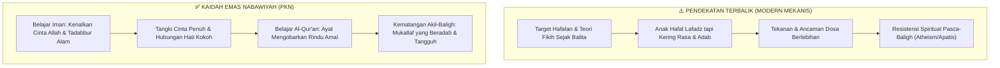

# Fitrah Keimanan: Belajar Iman Sebelum Belajar Al-Qur'an

Dalam arsitektur Pendidikan Karakter Nabawiyah (PKN), **Fitrah Keimanan** adalah pondasi paling hakiki yang mendasari seluruh bangunan kepribadian insan. Al-Qur'an dan Sunnah menegaskan bahwa setiap anak lahir dengan membawa perjanjian ketuhanan yang primordial (*mitsaq al-awwal*). Jauh sebelum jasad manusia dirakit di alam rahim, seluruh ruh keturunan Adam telah dikumpulkan di hadapan Allah Ta'ala dan menyatakan sumpah kesaksian: *“Alastu birabbikum? Qalu: Balaa syahidna!”* (Bukankah Aku ini Tuhanmu? Mereka menjawab: Benar, kami bersaksi! - QS. Al-A'raf: 172).

Oleh karena itu, iman bukanlah benda asing yang harus diimpor atau dipaksakan dari luar ke dalam diri anak. Iman adalah kerinduan alami batin yang tertidur, yang menanti dibangunkan melalui sentuhan kasih sayang, keteladanan orang tua (*qudwah hasanah*), dan pembiasaan adab yang indah. PKN merumuskan kaidah emas pendidikan tauhid nabawiyah: **"Mempelajari Iman Sebelum Mempelajari Al-Qur'an"**—yakni menumbuhkan rasa cinta, pengagungan, dan hubungan emosional yang lekat dengan Allah sebelum membebani anak dengan hafalan teks dan rincian hukum fikih yang rumit.

> [!quote] Dalil & Rujukan Nabawiyah: Metodologi Generasi Sahabat
> **Atsar Shahih Shahabat Nabi ﷺ:**  
> « كُنَّا مَعَ النَّبِيِّ صَلَّى اللَّهُ عَلَيْهِ وَسَلَّمَ وَنَحْنُ فِتْيَانٌ حَزَاوِرَةٌ، فَتَعَلَّمْنَا الْإِيمَانَ قَبْلَ أَنْ نَتَعَلَّمَ الْقُرْآنَ، ثُمَّ تَعَلَّمْنَا الْقُرْآنَ فَازْدَدْنَا بِهِ إِيمَانًا »  
> *"Dahulu kami bersama Nabi ﷺ tatkala kami masih berusia belia mendekati baligh (fityanun hazawirah). Kami belajar iman terlebih dahulu sebelum kami belajar Al-Qur'an. Kemudian barulah kami belajar Al-Qur'an, sehingga bertambahlah keimanan kami dengannya."*  
> — **HR. Ibnu Majah (No. 61) & Al-Baihaqi (Juz 3 Hal. 120), dishahihkan oleh Al-Albani**  
>  
> 📚 **Syarah Al-Hafizh Ibnu Rajab Al-Hanbali dalam Fathul Bari (Juz 1 Hal. 22):**  
> *"Jundub bin Abdillah radhiyallahu 'anhu menjelaskan manhaj tarbiyah para sahabat di bawah bimbingan Rasulullah ﷺ: mereka menanamkan ma'rifatullah (mengenal Allah), rasa cinta kepada-Nya, takut akan siksa-Nya, dan harapan akan rahmat-Nya ke dalam kalbu anak-anak. Tatkala wadah kalbu tersebut telah dipenuhi oleh cahaya keimanan, barulah ayat-ayat Al-Qur'an yang memuat perintah, larangan, janji, dan ancaman dituangkan ke dalamnya, sehingga Al-Qur'an itu langsung menyatu dan mengokohkan bangunan iman mereka."*

---

## 1. Patologi Pendidikan Agama Kontemporer: Membalik Kaidah Emas

Krisis moral generasi muda hari ini acapkali bukan karena kurangnya sekolah Islam atau minimnya target hafalan surat, melainkan karena **pembalikan metodologi nabawiyah**: mengajarkan teks Al-Qur'an dan hukum halal-haram sebelum kalbu anak merasakan manisnya iman.

Jika anak diajarkan Al-Qur'an sebelum iman tertanam:
1. Anak menghafal ayat-ayat tentang neraka, namun hatinya tidak mengenal betapa luasnya rahmat Allah, sehingga ia tumbuh menjadi pribadi yang cemas, kaku, atau justru skeptis.
2. Al-Qur'an diperlakukan sekadar sebagai objek perlombaan akademis (*musabaqah*) demi mengejar piala dan gengsi orang tua, kehilangan fungsinya sebagai petunjuk hidup (*hudan lin-nas*).
3. Tatkala anak menginjak fase pubertas dan terlepas dari kontrol orang tua, bangunan agamanya runtuh karena tidak memiliki fondasi *mahabbah* (cinta) kepada Allah.

---

## 2. Tahapan Penanaman Fitrah Keimanan Berbasis Usia

Pendidikan Karakter Nabawiyah menyelaraskan kurikulum keimanan dengan etape perkembangan psikologis anak:

| Etape Usia | Fase PKN | Fokus Utama Keimanan | Instrumen Pedagogis |
|---|---|---|---|
| **0 – 7 Tahun** | [[Thufulah]] | **Mengenalkan Allah Maha Pengasih & Maha Indah:** Menghubungkan setiap nikmat hidup dengan kebaikan Allah. Memenuhi [[Tangki Cinta]] anak. Belum ada beban taklif hukum. | [[Bahasa Hati]]: Pelukan, dongeng kisah Nabi yang penuh teladan kasih sayang, tadabbur keindahan ciptaan Allah di alam bebas. |
| **7 – 10 Tahun** | [[Tamyiz]] | **Membangun Kebiasaan Shalat dengan Dialog Hikmah:** Mengajarkan shalat pada usia 7 tahun secara bertahap dan menyenangkan, menjelaskan makna bacaan, menanamkan rasa syukur. | [[Bahasa Lisan]]: Dialog interaktif, kisah kepahlawanan sahabat, pembelajaran adab wudhu dan shalat berjamaah. |
| **10 – Baligh** | [[Murahaqah]] | **Menegakkan Muraqabatullah & Kesiapan Mukallaf:** Menanamkan kesadaran bahwa Allah Maha Melihat di mana pun berada. Ketegasan disiplin syariat tanpa kekerasan fisik. | [[Bahasa Tangan]]: Konsistensi aturan, pendampingan saat baligh (mimpi basah/haidh), penegasan batas mahram dan aurat. |

---

## 3. Teladan Nabawiyah: Menanamkan Fondasi Tauhid pada Anak-anak

Rasulullah ﷺ senantiasa menggunakan momentum keseharian yang rileks untuk menanamkan pondasi akidah yang kokoh ke dalam dada para sahabat cilik:

1. **Wasiat Tauhid kepada Ibnu Abbas:** Tatkala membonceng Ibnu Abbas yang masih belia, Nabi ﷺ tidak mengujinya dengan soal hafalan yang rumit, melainkan menanamkan intisari tauhid qadar: *“Jika engkau memohon, mohonlah kepada Allah; jika engkau meminta pertolongan, mintalah kepada Allah...”* (HR. Tirmidzi).
2. **Kelemahlembutan kepada Anak-anak Badui:** Tatkala orang Badui terheran-heran melihat Nabi ﷺ mencium cucu-cucunya, beliau bersabda: *“Aku tidak bisa berbuat apa-apa jika Allah telah mencabut rasa kasih sayang dari hatimu!”* (HR. Bukhari No. 5998). Cinta orang tua adalah cermin pertama bagi anak untuk memahami kasih sayang Allah.

---

## 4. Panduan Aplikatif bagi Ayah dan Bunda

1. **Jangan Jadikan Allah sebagai "Momok Menakutkan":** Hindari menakut-nakuti anak yang sedang berbuat salah dengan kalimat: *"Awas ya, nanti kamu dibakar Allah di neraka!"* Kalimat toksik ini merusak citra Allah di kalbu anak. Gantilah dengan: *"Nak, Allah itu Maha Baik, Allah sayang sekali sama kamu. Kalau kamu berbuat begitu, Allah sedih. Yuk kita berbuat baik agar Allah semakin sayang."*
2. **Hidupkan Budaya Tadabbur Kauniyah di Luar Rumah:** Ajak anak berkemah, mendaki bukit, atau sekadar memandangi langit malam bertabur bintang. Tanyakan: *"Siapa yang menyalakan bintang-bintang indah itu tanpa tiang penyangga, Nak?"* Biarkan fitrahnya sendiri yang menjawab: *"Allah!"*
3. **Ayah sebagai Imam Keteladanan Tauhid:** Anak laki-laki dan perempuan melihat figur ketegasan iman pertama kali dari ayahnya. Jika sang ayah segera bergegas ke masjid saat adzan berkumandang dan meninggalkan urusan dunianya, pesan tauhid itu akan terpatri jauh lebih dalam daripada seribu nasihat lisan.

> [!reflection] Refleksi Pendidik: Memeriksa Akar Keimanan Keluarga
> - Apakah ananda mencintai ibadah shalat karena merasa rindu berjumpa dengan Allah, ataukah mereka shalat semata-mata karena takut pada ancaman dan kemarahan kita?
> - Sudahkah kita mengajarkan mereka mengenal betapa agung dan penyayangnya Allah sebelum kita menuntut mereka menghafal rincian aturan agama?

---

## Tautan Rujukan Terkait

* [[Fitrah (Karakter)]] — Induk pembahasan konsepsi fitrah dalam PKN.
* [[Tangki Cinta]] — Wadah emosional kasih sayang prasyarat melebarnya keimanan.
* [[Belajar]] — Mengembangkan fitrah akal dan nalar tadabbur Al-Qur'an.
* [[Thufulah]] — Fase keemasan penyemaian cinta Allah dan Rasul-Nya (0–7 tahun).
* [[Tamyiz]] — Etape penegakan shalat dan logika tauhid (7–10 tahun).
